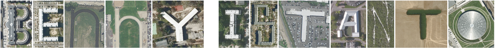

{fig-alt="The name Benny Istanto spelled out in satellite imagery, each letter formed by a building, road or landscape feature seen from above"}

Hi! My name is **Benny Istanto**. I am an agricultural meteorologist by training and a certified [GIS Professional (GISP)](https://www.gisci.org/Already-a-GISP/GISP-Registry/pagesize/10/GISP/Active?Region=west+java). With nearly 20 years of experience working with the [United Nations](https://www.un.org/) and various international organizations, I specialize in integrating advanced GIS modeling with climate technology to support international development initiatives.

I create maps, play with spatial data and satellite imagery. In addition to technical activities, I enjoy listening to [Iwan Fals](https://en.wikipedia.org/wiki/Iwan_Fals), [Led Zeppelin](https://en.wikipedia.org/wiki/Led_Zeppelin), and [MR.BIG](https://en.wikipedia.org/wiki/Mr._Big_(American_band)), as well as other similar music genres. During my free time, I practice [pencak silat](https://en.wikipedia.org/wiki/Pencak_silat), hike, cycle, draw, and occasionally post on social media.

My interests began to expand while I was still a student. I grew to love [GIS](https://en.wikipedia.org/wiki/Geographic_information_system), [remote sensing](https://en.wikipedia.org/wiki/Remote_sensing), and [computational science](https://en.wikipedia.org/wiki/Computational_science), and decided to build my work around those fields. I have been fortunate to work with governments, non-government organizations, and international organizations in disaster risk reduction, climate adaptation, mitigation, and other fascinating areas.

Through my work, I have had the chance to travel, live in interesting places, learn from different cultures, and enjoy lots of delicious, and sometimes unusual, food. I love what I do and I am eager to keep following this path. People say that the more involved we become, the more interesting the journey gets. The more I learn, the more I realize how much I still do not know.

From June 2012 to August 2021, I was an Earth Observation and Climate Analyst at the United Nations [World Food Programme](https://www.wfp.org/countries/indonesia) in Indonesia, where I served as a geospatial and climate technologist for the Indonesia Country Office and the Regional Bureau in Bangkok (RBB) for Asia and the Pacific, covering 17 country offices and 5 oversight countries. During my time with WFP, two colleagues and I began working on an [award-winning](https://medium.com/world-food-programme-insight/wfp-staff-show-entrepreneurial-side-in-annual-competition-be03924215) technology innovation project called [VAMPIRE](works/projects/2016-vampire.qmd) (Vulnerability Analysis and Monitoring Platform for the Impact of Regional Events) in 2015, which is now being rebranded as [PRISM](https://innovation.wfp.org/project/prism). In my final four years at WFP, I focused on transforming satellite-based data products into actionable, life-saving insights for hydro-meteorological hazard early warning and early action.

Currently, I work as a [Climate Geographer](https://worldbank.github.io/GOST/content/staff/bennyistanto.html) at Geospatial Operations Support Team ([GOST](https://www.worldbank.org/en/research/brief/geospatial-operations-support-team-at-the-world-bank)) of Development Economic Data Group (DECDG), and as a [Data Scientist](https://riskdatalibrary.org/team/) with the Global Facility for Disaster Reduction and Recovery ([GFDRR](https://www.gfdrr.org/)) on the [Risk Data Library](https://riskdatalibrary.org/) project, both at [The World Bank](https://www.worldbank.org/), Washington DC.

I run a "casual weekend project" called [Climate Social Responsibility (CSR)](csr.qmd) to provide satellite-based climate and vegetation products for free, including rainfall and rainfall anomaly, dry and wet spells, standardized precipitation index, and crop phenology.

**Disclaimer**: All content on this website does not represent the views of my (current or previous) employer.

**Acknowledgement**: Development of this website is supported by my cheering team [El](https://wijanging.ngelmu.art/about-me) and my beloved wife, [Kiki Kartikasari](https://www.linkedin.com/in/kikikartikasari/).

---

## Background.

::: {.grid}

::: {.g-col-12 .g-col-md-6}
### Education.

**[Bogor Agricultural University](https://www.ipb.ac.id/), Bogor, Indonesia** (09/2001 - 03/2006)

*Sarjana Sains* (S.Si. - equal to Bachelor of Science B.Sc.) in Meteorology with a focus on agriculture meteorology and climatology, computation and agriculture simulation model, satellite meteorology, with minor in geographic information system and remote sensing.

**Supervisors**:

- [Idung Risdiyanto](https://scholar.google.co.id/citations?hl=id&user=WBIaIyYAAAAJ) (Bogor Agricultural University)
- [M. Rokhis Khomarudin](https://scholar.google.com/citations?hl=en&user=RA5YWWQAAAAJ) (Indonesian National Institute of Aeronautics and Spaces)

**Bachelor thesis**:

Software development to determine the Canadian Forest Fire Weather Index System using remote sensing satellite. (in Bahasa Indonesia). Source: [IPB Scientific Repository](https://repository.ipb.ac.id/handle/123456789/47915)

---

**[Bogor Agricultural University](https://www.ipb.ac.id/), Bogor, Indonesia** (09/2022 - 08/2026)

*Magister Sains* (M.Si. - equal to Master of Science M.Sc.) in Applied Climatology with a focus on satellite-derived climate data, statistical and deep learning bias correction models, gauge-satellite integration, and open-science methodologies.

**Supervisors**:

- [Rizaldi Boer](https://scholar.google.com/citations?user=jTPXEp8AAAAJ&hl=en) (Bogor Agricultural University)
- [I Putu Santikayasa](https://scholar.google.com/citations?user=DcQ58z8AAAAJ&hl=en) (Bogor Agricultural University)

**Master's thesis**:

A Hybrid Bias Correction Framework for Daily Satellite Precipitation. Source: [IPB Scientific Repository](https://repository.ipb.ac.id/handle/123456789/177877) or [Zenodo](https://doi.org/10.5281/zenodo.21996372)
:::

::: {.g-col-12 .g-col-md-6}
### Professional Certificates.

**[Harvard University on edX, T.H. Chan School of Public Health](https://pll.harvard.edu/series/professional-certificate-data-science), United States** (01/2022 - 10/2024)

*Data Science Professional*

- **Credential**: [View certificate](https://credentials.edx.org/credentials/5dc2c828afb74fdbb8f9bfe1cdbb554b/)
- **Capstone Projects**: [HarvardX PH125.9x Data Science Capstone](https://github.com/bennyistanto/HarvardX-PH125.9x-Data-Science-Capstone)

---

**[GIS Certification Institute](https://www.gisci.org/), United States** (08/2023)

*Geographic Information Systems Professional (GISP)*

---

### Awards.

**Jacub Rais award**

Indonesian Society for Remote Sensing ([MAPIN](https://mapin.or.id/)), December 2006.

The Best Author in 15th Annual Scientific gathering and 4th Congress of Indonesian Society for Remote Sensing. Bandung, Indonesia. Paper entitled *"Software development for forest fire early warning system in Indonesia"*. (in Bahasa Indonesia)

---

**The WFP GIS Community Award**

World Food Programme, worldwide

The Best GIS Officer in the 1st WFP GIS Community Award. Rome, Italy. June 2015.

---

**Innovative New Solution to Hunger**

World Food Programme, worldwide

VAMPIRE (Vulnerability Analysis Monitoring Platform for the Impact of Regional Events) won the [2017 WFP Innovation Challenge](https://medium.com/world-food-programme-insight/wfp-staff-show-entrepreneurial-side-in-annual-competition-be03924215). Rome, Italy. January 2018.
:::

:::

---

## Expertise.

::: {.grid}

::: {.g-col-12 .g-col-md-6}
### Domains.

- Atmospheric science, agriculture meteorology and climatology, climate risk
- GIS, remote-sensing and agriculture related spatial modeling
- Climate, geo-statistics and other scientific data processing
- Impact science, early-warning and anticipatory-action
- Capacity development on geospatial and climate analytics
- Proposal development or funding and project implementation
:::

::: {.g-col-12 .g-col-md-6}
### Tools.

- *Remote Sensing & GIS*: ArcGIS Suite (Pro, Server, Image Server, Online), QGIS, GDAL/OGR, SAGA, Whitebox, ERMapper, ILWIS
- *Programming & Scripting*: Python, Bash, Google Earth Engine (GEE), ArcPy
- *Development Tools & Version Control*: Git, Visual Studio Code, Sublime Text, Jupyter/ESRI Notebooks
- *Documentation & Publishing*: LaTeX, Quarto, Markdown, Material for MkDocs, Jupyter Book
- *Geospatial Data Catalogs*: CKAN, GeoNode, Portal for ArcGIS
- *Agriculture & Climate Modeling*: DSSAT, TIMESAT
- *Cartography & Digital Imaging*: Avenza, Adobe Illustrator/Photoshop, CorelDRAW, Inkscape, GIMP
:::

:::

---

::: {style="text-align: center; padding: 2rem 0;"}
## Ask Me Something.

*It all begins with a question.*

I'm moderately active on Telegram. You can discuss GIS and remote sensing, or post questions, in the [@gis_id](https://t.me/gis_id) channel, and I will do my best to answer. If you would like to get in touch, my email is below, and you can also reach me through WhatsApp or the message form on this page. Feel free to explore the site and say hello.
:::

---

## Contact.

::: {.grid}

::: {.g-col-12 .g-col-md-6}
### Get in Touch.
[benny@istan.to](mailto:benny@istan.to)

[+1 (903) 890-3786](https://wa.me/19038903786)

Currently living in Bogor, Indonesia

**Connect with me**:

- [<i class="bi bi-github"></i> GitHub](https://github.com/bennyistanto)
- [<i class="bi bi-linkedin"></i> LinkedIn](https://linkedin.com/in/bennyistanto)
- [<i class="bi bi-globe"></i> Website](https://benny.istan.to)

:::

::: {.g-col-12 .g-col-md-6}
### Send a Message.

```{=html}
<form action="https://formspree.io/f/xeezoery" method="POST">
  <div style="margin-bottom: 1rem;">
    <label for="name" style="display: block; margin-bottom: 0.25rem;">Name</label>
    <input type="text" id="name" name="name" required style="width: 100%; padding: 0.5rem; border: 1px solid var(--bs-border-color); border-radius: 0.25rem;">
  </div>

  <div style="margin-bottom: 1rem;">
    <label for="email" style="display: block; margin-bottom: 0.25rem;">Email</label>
    <input type="email" id="email" name="email" required style="width: 100%; padding: 0.5rem; border: 1px solid var(--bs-border-color); border-radius: 0.25rem;">
  </div>

  <div style="margin-bottom: 1rem;">
    <label for="message" style="display: block; margin-bottom: 0.25rem;">Message</label>
    <textarea id="message" name="message" rows="5" required style="width: 100%; padding: 0.5rem; border: 1px solid var(--bs-border-color); border-radius: 0.25rem;"></textarea>
  </div>

  <button type="submit" style="padding: 0.5rem 1.5rem; background-color: var(--bs-primary); color: white; border: none; border-radius: 0.25rem; cursor: pointer;">Send Message</button>
</form>
```

:::

:::
