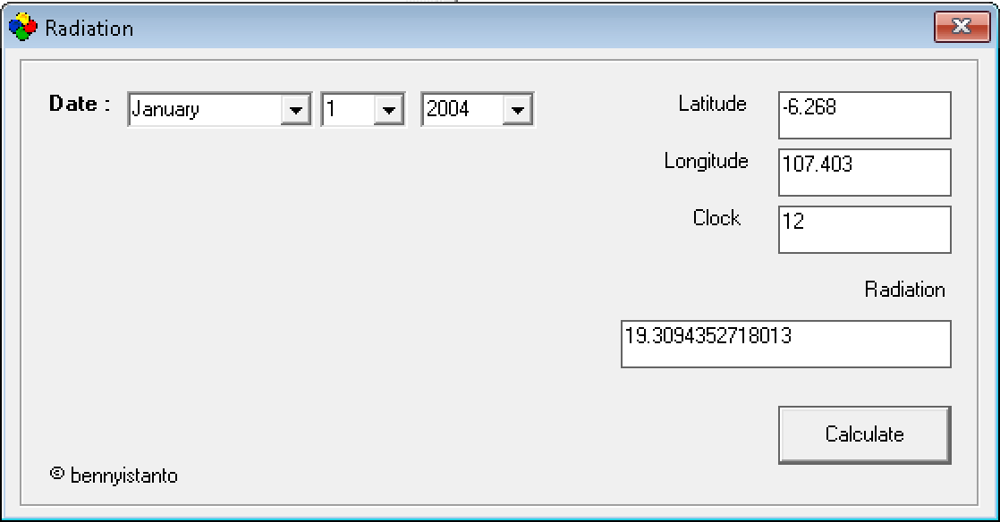

Mata kuliah Mikrometeorologi membuat saya dan teman-teman melakukan pengamatan cuaca selama 24 jam di halaman Kampus IPB Baranangsiang, sangat menyenangkan karena waktu pengamatannya bertepatan dengan perayaan pergantian tahun 2003/2004.

**Praktikum pengukuran profil iklim mikro fluks uap air dan bahang pada permukaan rumput**

Tujuan dari praktikum ini adalah:

1. Menentukan variasi diurnal Radiasi netto (Rn) yang terdapat pada permukaan rumput
2. Mendapatkan variasi diurnal dari profil kecepatan angin, suhu udara, suhu tanah dan kelembaban spesifikpada permukaan rumput selama 24 jam.
3. Menentukan karakteristik kekasapan permukaan rumput (d, zo, dan U\*)
4. Menetukan kondisi stabilitas atmosfer (Ri), netral, stabil dan inversi dalam periode 24 jam.
5. Menentukan besarnya energi yang digunakan untuk fluks bahang (QH) dan (QG), uap air (QE) pada kondisi netral.

Selain melakukan pengamatan, praktikum kali ini juga mengasah kemampuan saya dan teman-teman dalam menerapkan ilmu yang kita pelajari pada mata kuliah Instrumentasi Meteorologi untuk membuat beberapa IoT Anemometer portable dengan interface USB-2, sehingga data yang dihasilkan bisa langsung tersimpan di komputer untuk dianalisa lebih lanjut. Saya bertanggung jawab untuk mengamati Radiasi Netto, merekam data dan menganalisanya. Selain itu saya juga harus membandingkan dengan nilai dugaan Radiasi menggunakan pendekatan rumus empirik.

Slide di bawah ini adalah materi kuliah tentang radiasi matahari yang disampaikan Bu Tania June seminggu yang lalu, sebelum kita melakukan pengamatan lapangan.

```{=html}
<iframe
  src="https://docs.google.com/presentation/d/e/2PACX-1vTO13ZbLHJ8yjqCLhYV7WIIpZK8BVowsOGlMtNak-RWgF1K59NVR8GujiuDMyaVq_q5MUVC7ArhzjBx/embed?start=false&loop=false&delayms=3000"
  frameborder="0"
  width="960"
  height="749"
  allowfullscreen="true"
  mozallowfullscreen="true"
  webkitallowfullscreen="true">
</iframe>
```

## Hasil pengamatan

Berdasarkan hasil praktikum terlihat adanya perubahan radiasi netto pada siang dan malam hari. Satuan miliVolt (mV) menunjukkan bahwa pengukuran radiasi netto ini menggunakan Net Radiometer dan DVM (Digital Volt Meter), diukur setiap 30 menit. Nilai Radiasi Netto pada siang hari ditunjukkan oleh grafik di bawah ini:


```{=html}
<div style="position:relative;padding-bottom:62%;height:0;overflow:hidden;max-width:100%;">
  <iframe
    src="https://docs.google.com/spreadsheets/d/e/2PACX-1vTqXuB4FCvNsP2TRGGGhRFi3eBCX2jwMXa1im9jo6trmgQrRv_zz6LmCTMCVFD9TWDMSQt39cX_KqHl/pubchart?oid=1441155080&format=interactive"
    style="position:absolute;top:0;left:0;width:100%;height:100%;border:0;"
    scrolling="no">
  </iframe>
</div>
```
Grafik di atas menunjukkan bahwa nilai Radiasi Netto pada siang hari berkisar antara 0,5 mV sampai 1,5 mV. Nilai ini akan berubah-ubah tergantung pada kondisi cuaca, seperti apakah langit cerah atau mendung. Pada malam hari, nilai Radiasi Netto cenderung mendekati nol atau bahkan negatif, karena tidak ada sinar matahari yang mencapai permukaan bumi.

Selanjutnya saya harus membandingkan nilai radiasi hasil pengukuran dengan hasil dugaan menggunakan rumus empiris. Referensi saya adalah dokumen dari FAO no 56: Crop evapotranspiration - Guidelines for computing crop water requirements - FAO Irrigation and drainage paper 56 (http://www.fao.org/3/x0490e/x0490e00.htm#Contents): Chapter 3 yang membahas tentang data meteorologi, sub topik radiasi: http://www.fao.org/3/x0490e/x0490e07.htm#radiation

Menurut dokumen di atas, konsep dari perhitungan radiasi adalah sebagai berikut:

## Radiasi ekstraterestrial (Ra)

Radiasi yang mengenai permukaan tegak lurus terhadap sinar matahari di bagian atas atmosfer bumi, yang disebut konstanta matahari, adalah sekitar 0,082 MJ m-2 mnt-1. Intensitas lokal radiasi ditentukan oleh sudut antara arah sinar matahari ke permukaan atmosfer. Sudut ini akan berubah pada siang hari dan akan berbeda di lintang yang berbeda dan di musim yang berbeda. Radiasi matahari yang diterima di bagian atas atmosfer bumi pada permukaan horizontal disebut radiasi ekstraterestrial, Ra. Jika matahari berada tepat di atas kepala, sudut datangnya nol dan radiasi ekstraterestrial 0,0820 MJ m-2 min-1. Saat musim berubah, posisi matahari dan panjang hari juga berubah, oleh karena itu Ra juga berubah. Radiasi ekstraterestrial dengan demikian merupakan fungsi dari garis lintang, tanggal dan waktu hari.

### Ra untuk periode harian

Ra untuk periode harian dalam setahun dan untuk lintang yang berbeda dapat diperkirakan dari konstanta matahari, deklinasi matahari, dan waktu dalam setahun dengan:

$$
R_a = \frac{24(60)}{\pi} \, G_{sc} \, d_r
\left[
\omega_s \sin(\phi)\sin(\delta) + \cos(\phi)\cos(\delta)\sin(\omega_s)
\right]
\tag{1}
$$

dimana:

- $R_a$ radiasi ekstraterestrial $[\mathrm{MJ\ m^{-2}\ hari^{-1}}]$
- $G_{sc}$ konstanta matahari $= 0{,}0820\ \mathrm{MJ\ m^{-2}\ menit^{-1}}$
- $d_r$ jarak relatif terbalik Bumi-Matahari pada persamaan (4)
- $\omega_s$ sudut waktu matahari terbenam, dalam radian, pada persamaan (7) atau persamaan (8)
- $\phi$ lintang, dalam radian, pada persamaan (3)
- $\delta$ sudut deklinasi matahari, dalam radian, pada persamaan (5)

Dalam persamaan FAO Penman-Monteith tentang evapotranspirasi, radiasi yang dinyatakan dalam $\mathrm{MJ\ m^{-2}\ hari^{-1}}$ dikonversi menjadi penguapan yang setara dalam $\mathrm{mm\ hari^{-1}}$ dengan menggunakan faktor konversi yang sama dengan kebalikan dari panas laten penguapan, yaitu $\frac{1}{\lambda} = 0.408$:

$$
\text{evaporasi }[\mathrm{mm\ hari^{-1}}]
=
0.408 \times \text{Radiasi }[\mathrm{MJ\ m^{-2}\ hari^{-1}}]
\tag{2}
$$

$R_a$ diekspresikan dalam persamaan di atas dalam $\mathrm{MJ\ m^{-2}\ hari^{-1}}$. Penguapan dalam $\mathrm{mm\ hari^{-1}}$ diperoleh dengan mengalikan $R_a$ dengan $0.408$ sebagaimana ditunjukkan pada persamaan (2). Garis lintang, $\phi$, dinyatakan dalam radian positif untuk belahan bumi utara dan negatif untuk belahan selatan. Konversi dari derajat desimal ke radian diberikan oleh:

$$
[\mathrm{radian}] = \frac{\pi}{180} \times [\mathrm{derajat\ desimal}]
\tag{3}
$$

Jarak relatif terbalik Bumi-Matahari, $d_r$, dan deklinasi matahari, $\delta$, dihitung dari:

$$
d_r = 1 + 0.033 \cos\left(\frac{2\pi}{365} J\right)
\tag{4}
$$

$$
\delta = 0.409 \sin\left(\frac{2\pi}{365} J - 1.39\right)
\tag{5}
$$

dimana $J$ adalah tanggal dalam Julian, antara 1 (1 Januari) dan 365 atau 366 (31 Desember). $J$ dapat ditentukan untuk setiap hari ($D$) bulan ($M$) melalui:

$$
\begin{aligned}
J &= \operatorname{INTEGER}\left(\frac{275M}{9} - 30 + D\right) - 2 \\
\text{Jika } M < 3, &\text{ maka } J = J + 2 \\
\text{Jika tahun kabisat dan } M > 2, &\text{ maka } J = J + 1
\end{aligned}
\tag{6}
$$

Sudut waktu matahari terbenam, $\omega_s$, ditentukan dari:

$$
\omega_s = \arccos\left[-\tan(\phi)\tan(\delta)\right]
\tag{7}
$$

Karena fungsi $\arccos$ tidak tersedia dalam semua bahasa komputer, sudut waktu matahari terbenam juga dapat dihitung menggunakan fungsi $\arctan$:

$$
\omega_s = \frac{\pi}{2} - \arctan\left[\frac{-\tan(\phi)\tan(\delta)}{\sqrt{X}}\right]
\tag{8}
$$

dimana:

$$
X = 1 - [\tan(\phi)]^2[\tan(\delta)]^2
\tag{9}
$$

dan $X = 0.00001$ jika $X \leq 0$.

### Ra untuk periode per jam atau yang lebih pendek

Untuk periode per jam atau yang lebih pendek, sudut waktu matahari pada awal dan akhir periode harus dipertimbangkan ketika menghitung $R_a$:

$$
R_a = \frac{12(60)}{\pi} \, G_{sc} \, d_r
\left[
(\omega_2 - \omega_1)\sin(\phi)\sin(\delta) + \cos(\phi)\cos(\delta)\left(\sin(\omega_2) - \sin(\omega_1)\right)
\right]
\tag{10}
$$

dimana:

- $R_a$ radiasi ekstraterestrial per jam atau periode yang lebih pendek $[\mathrm{MJ\ m^{-2}\ jam^{-1}}]$
- $G_{sc}$ konstanta matahari $= 0{,}0820\ \mathrm{MJ\ m^{-2}\ menit^{-1}}$
- $d_r$ jarak relatif terbalik Bumi-Matahari pada persamaan (4)
- $\delta$ sudut deklinasi matahari, dalam radian, pada persamaan (5)
- $\phi$ lintang, dalam radian, pada persamaan (3)
- $\omega_1$ sudut waktu matahari pada awal periode, dalam radian, pada persamaan (11)
- $\omega_2$ sudut waktu matahari pada akhir periode, dalam radian, pada persamaan (12)

Sudut waktu matahari pada awal dan akhir periode dihitung menggunakan persamaan berikut:

$$
\omega_1 = \omega - \frac{\pi t_1}{24}
\tag{11}
$$

$$
\omega_2 = \omega + \frac{\pi t_1}{24}
\tag{12}
$$

dimana:

- $\omega$ sudut waktu matahari pada titik tengah hari atau periode yang lebih pendek, dalam radian
- $t_1$ panjang periode perhitungan $[\mathrm{jam}]$; misalnya, $1$ untuk periode per jam atau $0{,}5$ untuk periode 30 menit

Sudut waktu matahari di titik tengah periode adalah:

$$
\omega = \frac{\pi}{12} \left[(t + 0.06667(L_z - L_m) + S_c) - 12\right]
\tag{13}
$$

dimana:

- $t$ waktu jam standar di tengah periode $[\mathrm{jam}]$; misalnya, untuk periode antara pukul 14.00 dan 15.00, maka $t = 14{,}5$
- $L_z$ lokasi bujur titik tengah zona waktu lokal $[\mathrm{derajat\ Bujur\ Barat\ Greenwich}]$; misalnya, $L_z = 75$, $90$, $105$, dan $120^\circ$ untuk zona waktu wilayah Timur, Tengah, Pegunungan Rocky, dan Pasifik (Amerika Serikat), serta $L_z = 0^\circ$ untuk Greenwich, $330^\circ$ untuk Kairo (Mesir), dan $255^\circ$ untuk Bangkok (Thailand)
- $L_m$ bujur lokasi pengukuran $[\mathrm{derajat\ Bujur\ Barat\ Greenwich}]$
- $S_c$ koreksi musiman untuk waktu matahari $[\mathrm{jam}]$

Tentu saja, jika $\omega < -\omega_s$ atau $\omega > \omega_s$, maka persamaan (13) menunjukkan bahwa matahari berada di bawah cakrawala sehingga, menurut definisi, $R_a$ bernilai nol.

Koreksi musiman untuk waktu matahari adalah:

$$
S_c = 0.1645 \sin(2b) - 0.1255 \cos(b) - 0.025 \sin(b)
\tag{14}
$$

$$
b = \frac{2\pi(J - 81)}{364}
\tag{15}
$$

dimana $J$ adalah hari ke-$n$ dalam setahun.

## Lama penyinaran, dalam jam ($N$)

Dihitung menggunakan persamaan berikut:

$$
N = \frac{24}{\pi} \, \omega_s
\tag{16}
$$

dimana $\omega_s$ adalah sudut waktu matahari terbenam dalam radian yang diberikan oleh persamaan (7) atau persamaan (8).

## Radiasi matahari ($R_s$)

Jika radiasi matahari, $R_s$, tidak terukur, maka dapat dihitung dengan rumus Angstrom yang menghubungkan radiasi matahari dengan radiasi ekstraterestrial dan durasi sinar matahari relatif:

$$
R_s = \left(a_s + b_s \frac{n}{N}\right) R_a
\tag{17}
$$

dimana:

- $R_s$ radiasi matahari atau gelombang pendek $[\mathrm{MJ\ m^{-2}\ hari^{-1}}]$
- $n$ durasi aktual sinar matahari $[\mathrm{jam}]$
- $N$ durasi maksimum yang mungkin dari sinar matahari atau panjang hari $[\mathrm{jam}]$
- $\frac{n}{N}$ durasi sinar matahari relatif $[-]$
- $R_a$ radiasi ekstraterestrial $[\mathrm{MJ\ m^{-2}\ hari^{-1}}]$
- $a_s$ konstanta regresi, yang menyatakan fraksi radiasi ekstraterestrial yang mencapai bumi pada hari-hari mendung $(n = 0)$
- $a_s + b_s$ fraksi radiasi ekstraterestrial yang mencapai bumi pada hari-hari cerah $(n = N)$

$R_s$ dinyatakan dalam persamaan di atas dalam $\mathrm{MJ\ m^{-2}\ hari^{-1}}$. Penguapan setara yang sesuai dalam $\mathrm{mm\ hari^{-1}}$ diperoleh dengan mengalikan $R_s$ dengan $0.408$ sebagaimana ditunjukkan pada persamaan (2). Bergantung pada kondisi atmosfer (kelembaban, debu) dan deklinasi matahari (garis lintang dan bulan), nilai konstanta Angstrom $a_s$ dan $b_s$ akan bervariasi. Ketika tidak ada data radiasi matahari aktual yang tersedia dan tidak ada kalibrasi yang telah dilakukan untuk parameter $a_s$ dan $b_s$, nilai yang direkomendasikan adalah $a_s = 0{,}25$ dan $b_s = 0{,}50$.

Radiasi ekstraterestrial, $R_a$, dan panjang hari atau durasi maksimum yang mungkin dari sinar matahari, $N$, diberikan oleh persamaan (10) dan persamaan (16). Durasi aktual sinar matahari, $n$, direkam dengan perekam sinar matahari Campbell-Stokes.

## Radiasi matahari ketika langit cerah ($R_{so}$)

Perhitungan radiasi ketika langit cerah, $R_{so}$, ketika $n = N$, diperlukan untuk menghitung radiasi gelombang panjang netto.

Untuk daerah dekat permukaan laut atau ketika nilai kalibrasi untuk $a_s$ dan $b_s$ tersedia:

$$
R_{so} = (a_s + b_s) R_a
\tag{18}
$$

dimana:

- $R_{so}$ radiasi matahari ketika langit cerah $[\mathrm{MJ\ m^{-2}\ hari^{-1}}]$
- $a_s + b_s$ fraksi radiasi ekstraterestrial yang mencapai bumi pada hari-hari dengan langit cerah $(n = N)$

Ketika nilai kalibrasi untuk $a_s$ dan $b_s$ tidak tersedia:

$$
R_{so} = (0.75 + 2 \times 10^{-5} z) R_a
\tag{19}
$$

dimana:

- $z$ ketinggian stasiun di atas permukaan laut $[\mathrm{m}]$

## Radiasi matahari atau gelombang pendek netto ($R_{ns}$)

Radiasi gelombang pendek netto yang dihasilkan dari keseimbangan antara radiasi matahari yang masuk dan yang dipantulkan diberikan oleh:

$$
R_{ns} = (1-\alpha) R_s
\tag{20}
$$

dimana:

- $R_{ns}$ radiasi matahari atau gelombang pendek netto $[\mathrm{MJ\ m^{-2}\ hari^{-1}}]$
- $\alpha$ koefisien refleksi albedo atau kanopi, yang bernilai $0{,}23$ untuk tanaman rumput referensi hipotesis $[-]$
- $R_s$ radiasi matahari yang masuk $[\mathrm{MJ\ m^{-2}\ hari^{-1}}]$

## Radiasi gelombang panjang netto ($R_{nl}$)

Tingkat emisi energi gelombang panjang sebanding dengan suhu absolut permukaan yang dipangkatkan empat. Hubungan ini diekspresikan secara kuantitatif oleh hukum Stefan-Boltzmann. Namun, fluks energi netto yang meninggalkan permukaan bumi lebih kecil daripada yang dipancarkan menurut hukum Stefan-Boltzmann karena adanya penyerapan dan radiasi ke bawah dari atmosfer. Uap air, awan, karbon dioksida, dan debu merupakan penyerap dan pemancar radiasi gelombang panjang. Konsentrasi unsur-unsur tersebut perlu diperhitungkan ketika menilai fluks keluar netto. Karena kelembaban dan kekeruhan memainkan peran penting, hukum Stefan-Boltzmann dikoreksi oleh dua faktor tersebut ketika memperkirakan fluks keluar radiasi gelombang panjang. Dengan demikian, diasumsikan bahwa konsentrasi unsur peredam lainnya bersifat konstan.

$$
R_{nl} =
\sigma
\left[
\frac{(T_{\max} + 273.16)^4 + (T_{\min} + 273.16)^4}{2}
\right]
(0.34 - 0.14\sqrt{e_a})
\left[
1.35 \frac{R_s}{R_{so}} - 0.35
\right]
\tag{21}
$$

dimana:

- $R_{nl}$ radiasi gelombang panjang keluar netto $[\mathrm{MJ\ m^{-2}\ hari^{-1}}]$
- $\sigma$ konstanta Stefan-Boltzmann $= 4.903 \times 10^{-9}\ \mathrm{MJ\ K^{-4}\ m^{-2}\ hari^{-1}}$
- $T_{\max}$ suhu absolut maksimum selama periode 24 jam $[\mathrm{K = ^\circ C + 273.16}]$
- $T_{\min}$ suhu absolut minimum selama periode 24 jam $[\mathrm{K = ^\circ C + 273.16}]$
- $e_a$ tekanan uap aktual $[\mathrm{kPa}]$
- $\frac{R_s}{R_{so}}$ radiasi gelombang pendek relatif, dengan batas $\leq 1.0$
- $R_s$ radiasi matahari $[\mathrm{MJ\ m^{-2}\ hari^{-1}}]$, dihitung dari persamaan (17)
- $R_{so}$ radiasi langit cerah $[\mathrm{MJ\ m^{-2}\ hari^{-1}}]$, dihitung dari persamaan (18) atau persamaan (19)

Rata-rata suhu udara maksimum dan suhu udara minimum yang dipangkatkan empat biasanya digunakan dalam persamaan Stefan-Boltzmann untuk periode waktu 24 jam. Istilah $(0.34 - 0.14\sqrt{e_a})$ menyatakan koreksi untuk kelembaban udara, dan nilainya akan semakin kecil ketika kelembaban meningkat. Efek kekeruhan dinyatakan oleh $\left(1.35 \frac{R_s}{R_{so}} - 0.35\right)$. Istilah ini akan semakin kecil ketika kekeruhan meningkat dan, akibatnya, $R_s$ menurun. Semakin kecil nilai faktor koreksi tersebut, semakin kecil pula fluks keluar radiasi gelombang panjang. Perhatikan bahwa suku $\frac{R_s}{R_{so}}$ dalam persamaan (21) harus dibatasi sehingga $\frac{R_s}{R_{so}} \leq 1.0$.

Apabila tersedia pengukuran radiasi gelombang pendek dan gelombang panjang, baik yang masuk maupun yang keluar, pada kondisi langit cerah maupun mendung, maka koefisien dalam persamaan (21) dapat dikalibrasi.

## Radiasi netto ($R_n$)

Radiasi netto ($R_n$) adalah selisih antara radiasi gelombang pendek netto masuk ($R_{ns}$) dan radiasi gelombang panjang netto keluar ($R_{nl}$):

$$
R_n = R_{ns} - R_{nl}
\tag{22}
$$

## Script menggunakan bahasa BASIC

Selanjutnya untuk memudahkan perhitungan radiasi harian selama 1 tahun, beberapa persamaan diatas saya tulis menggunakan bahasa BASIC (kodenya dapat dilihat dibagian bawah tulisan). Dan untuk perhitungan 1 waktu, saya buat user interface sederhana menggunakan Visual Basic 6 seperti gambar dibawah.

 

Gambar 1. UI program menghitung radiasi matahari.

### Radiasi harian

::: {.callout-note collapse="true" title="Kode program - radiasi harian"}
```vb
'++++++++++++++++++++++++
' Program untuk menghitung Radiasi harian
' Benny Istanto, G241010143
' Praktikum matakuliah Mikrometeorologi, Semester 5
' 1 Jan 2004, Lapangan Taman Koleksi - Kampus IPB Baranangsiang
' Referensi: http://www.fao.org/3/x0490e/x0490e07.htm#radiation
'++++++++++++++++++++++++

'Pengenal variabel
'Rs   = rata-rata bulanan radiasi global harian yang jatuh pada permukaan horizontal [MJ m-2 hari-1]
'Ra   = radiasi ekstraterestrial (radiasi yang sampai di puncak atmosfer / radiasi angot) harian yang
'       jatuh pada permukaan horizontal tiap satuan luas [MJ m-2 hari-1]
'ax+bx= fraksi radiasi ekstraterestrial yang sampai ke bumi pada hari cerah
'n    = lama penyinaran aktual [jam]
'nMax = lama penyinaran harian maksimum (pada hari cerah) [jam]
'Gsc  = konstanta matahari
'dr   = inverse relative jarak bumi - matahari [-]
'Ws   = sudut matahari terbenam [radian]
'W    = lintang [radian]
'dekl = sudut deklinasi [radian]

Dim g%, z%
Dim rads As Double
Dim Rs As Double, Ra As Double
Dim ax As Double, bx As Double
Dim n As Double, nMax As Double
Dim Gsc As Double, dr As Double, Ws As Double
Dim Lat As Double, W As Double, dekl As Double
Dim pi As Double
Dim Day As Integer
Dim X As Double
Dim JulianDate As Integer
Dim MONTH As Integer
Dim bfeb As Integer
Dim jumlah As Integer

'Array untuk menyimpan hari Julian dari file
Dim dino(1000) As Integer

'++++++++++++++++++++++++
' Calculate Julian Date
'++++++++++++++++++++++++

Dim bulan(12) As Integer

bulan(1) = 31

'Bulan kabisat
If Val(frmRadiation.cboTahun.Text) Mod 4 = 0 Then
    bfeb = 29
Else
    bfeb = 28
End If

bulan(2) = bulan(1)
bulan(3) = bulan(2) + bfeb
bulan(4) = bulan(3) + 31
bulan(5) = bulan(4) + 30
bulan(6) = bulan(5) + 31
bulan(7) = bulan(6) + 30
bulan(8) = bulan(7) + 31
bulan(9) = bulan(8) + 31
bulan(10) = bulan(9) + 30
bulan(11) = bulan(10) + 31
bulan(12) = bulan(11) + 30

'Isi Combo box
With cboBulan
    If .Text = "January" Then MONTH = 0
    If .Text = "February" Then MONTH = 1
    If .Text = "March" Then MONTH = 2
    If .Text = "April" Then MONTH = 3
    If .Text = "May" Then MONTH = 4
    If .Text = "June" Then MONTH = 5
    If .Text = "July" Then MONTH = 6
    If .Text = "August" Then MONTH = 7
    If .Text = "September" Then MONTH = 8
    If .Text = "October" Then MONTH = 9
    If .Text = "November" Then MONTH = 10
    If .Text = "December" Then MONTH = 11
End With

If MONTH = 0 Then
    JulianDate = Val(frmRadiation.cboTanggal.Text)
Else
    JulianDate = bulan(MONTH) + Val(frmRadiation.cboTanggal.Text)
End If

'++++++++++++++++++++++++
' Membaca file input dan menulis hasil output
'++++++++++++++++++++++++

Open App.Path & "\Book1.csv" For Input As #1
Open App.Path & "\Book2.csv" For Output As #2

g% = 0

While Not EOF(1)

    'Membaca satu nilai hari Julian dari file input
    g% = g% + 1
    Input #1, dino(g%)

    Day = dino(g%)

    'Konstanta empiris Angstrom
    ax = 0.25
    bx = 0.5

    'Input lintang pengamatan
    Lat = Val(txtLat.Text)

    'Konstanta matahari
    Gsc = 0.082

    'Konstanta pi
    pi = 3.14159265358979

    'Konversi lintang dari derajat ke radian
    W = (pi / 180) * Lat

    '++++++++++++++++++++++++
    ' Menghitung komponen astronomis
    '++++++++++++++++++++++++

    'Inverse relative distance Bumi-Matahari
    dr = 1 + (0.033 * Cos(((2 * pi) / 365) * Day))

    'Sudut deklinasi matahari
    dekl = 0.409 * Sin((((2 * pi) / 365) * Day) - 1.39)

    'Nilai bantu untuk persamaan sudut matahari terbenam
    X = 1 - ((Tan(W) ^ 2) * (Tan(dekl) ^ 2))
    If X <= 0 Then X = 0.00001

    'Sudut matahari terbenam [radian]
    'Menggunakan bentuk arctan yang setara dengan persamaan FAO
    Ws = (pi / 2) - Atn(((-Tan(W)) * Tan(dekl)) / Sqr(X))

    'Lama penyinaran maksimum harian [jam]
    nMax = (24 / pi) * Ws

    '++++++++++++++++++++++++
    ' Input lama penyinaran aktual
    '++++++++++++++++++++++++

    'Contoh: lama penyinaran aktual 7.1 jam
    'Silakan ganti sesuai data pengamatan jika tersedia
    n = 7.1

    '++++++++++++++++++++++++
    ' Menghitung radiasi ekstraterestrial harian
    ' Persamaan harian FAO:
    ' Ra = (24*60/pi) * Gsc * dr * [Ws*sin(W)*sin(dekl) + cos(W)*cos(dekl)*sin(Ws)]
    '++++++++++++++++++++++++

    Ra = ((24 * 60) / pi) * Gsc * dr * _
         ((Ws * Sin(W) * Sin(dekl)) + _
         (Cos(W) * Cos(dekl) * Sin(Ws)))

    '++++++++++++++++++++++++
    ' Menghitung radiasi matahari harian dengan persamaan Angstrom
    ' Rs = (ax + bx * (n / nMax)) * Ra
    '++++++++++++++++++++++++

    Rs = (ax + (bx * (n / nMax))) * Ra

    'Menampilkan hasil dalam MJ m-2 hari-1
    txtRad.Text = Format$(Rs, "0.000")
    rads = Rs

    'Menulis hasil ke file output
    Write #2, Day, rads

Wend

Close #1
Close #2

MsgBox "complete"
```
:::

### Radiasi per jam atau 30 menit

::: {.callout-note collapse="true" title="Kode program - radiasi per jam atau 30 menit"}
```vb
'++++++++++++++++++++++++
' Program untuk menghitung Radiasi Ekstraterestrial per jam atau 30 menit
' Benny Istanto, G241010143
' Praktikum matakuliah Mikrometeorologi, Semester 5
' 1 Jan 2004, Lapangan Taman Koleksi - Kampus IPB Baranangsiang
' Referensi: http://www.fao.org/3/x0490e/x0490e07.htm#radiation
'++++++++++++++++++++++++

'Pengenal variabel
'Ra   = radiasi ekstraterestrial per jam atau periode yang lebih pendek
'       yang jatuh pada permukaan horizontal tiap satuan luas [MJ m-2 interval-1]
'Gsc  = konstanta matahari [MJ m-2 menit-1]
'dr   = inverse relative jarak bumi - matahari [-]
'Ws   = sudut matahari terbenam [radian]
'W    = lintang [radian]
'dekl = sudut deklinasi [radian]
'W1   = sudut waktu matahari pada awal periode [radian]
'W2   = sudut waktu matahari pada akhir periode [radian]
'WW   = sudut waktu matahari pada titik tengah periode [radian]
'Lz   = bujur titik tengah zona waktu lokal [derajat Bujur Barat Greenwich]
'Lm   = bujur lokasi pengamatan [derajat Bujur Barat Greenwich]
'Sc   = koreksi musiman waktu matahari [jam]
'b    = variabel bantu untuk menghitung Sc
't    = waktu standar pada titik tengah periode [jam]
't1   = panjang interval perhitungan [jam]
'       t1 = 1   untuk per jam
'       t1 = 0.5 untuk per 30 menit

Dim g%
Dim rads As Double
Dim Ra As Double
Dim Gsc As Double, dr As Double, Ws As Double
Dim Lat As Double, W As Double, dekl As Double
Dim pi As Double
Dim Day As Integer
Dim X As Double
Dim W1 As Double, W2 As Double, WW As Double
Dim Lz As Double, Lm As Double, LmBT As Double
Dim Sc As Double, b As Double
Dim t As Double, t1 As Double

'Array untuk menyimpan hari Julian dari file
Dim dino(1000) As Integer

'++++++++++++++++++++++++
' Membaca file input dan menulis hasil output
' Book1.csv  : berisi hari Julian (1 s.d. 365/366), satu nilai per baris
' Book2.csv  : hasil keluaran berisi Day, t, Ra
'++++++++++++++++++++++++

Open App.Path & "\Book1.csv" For Input As #1
Open App.Path & "\Book2.csv" For Output As #2

'++++++++++++++++++++++++
' Input parameter tetap
'++++++++++++++++++++++++

'Lintang lokasi pengamatan dalam derajat desimal
Lat = Val(txtLat.Text)

'Konversi lintang dari derajat ke radian
pi = 3.14159265358979
W = (pi / 180) * Lat

'Konstanta matahari
Gsc = 0.082

'Panjang interval perhitungan
'Gunakan salah satu:
t1 = 1          'untuk per jam
't1 = 0.5       'untuk per 30 menit

'++++++++++++++++++++++++
' Pengaturan bujur dan zona waktu
' Catatan penting:
' Persamaan FAO menggunakan derajat Bujur Barat Greenwich.
'
' Untuk Indonesia, jika input bujur lokasi dimasukkan dalam derajat BT (mis. Bogor ~ 106.8 BT),
' maka perlu diubah menjadi derajat Bujur Barat Greenwich:
'   Lm = 360 - LmBT
'
' Contoh meridian zona waktu Indonesia dalam derajat Bujur Barat Greenwich:
'   WIB  = 255   (105 BT)
'   WITA = 240   (120 BT)
'   WIT  = 225   (135 BT)
'++++++++++++++++++++++++

LmBT = Val(txtLon.Text)     'input longitude dalam derajat BT
Lm = 360 - LmBT             'ubah ke derajat Bujur Barat Greenwich

Lz = 255                    'contoh untuk WIB
'Jika lokasi Anda di WITA gunakan: Lz = 240
'Jika lokasi Anda di WIT  gunakan: Lz = 225

'++++++++++++++++++++++++
' Perulangan untuk setiap hari Julian pada file input
'++++++++++++++++++++++++

g% = 0

While Not EOF(1)

    'Membaca satu nilai hari Julian dari file input
    g% = g% + 1
    Input #1, dino(g%)

    Day = dino(g%)

    '++++++++++++++++++++++++
    ' Menghitung komponen astronomis harian
    '++++++++++++++++++++++++

    'Inverse relative distance Bumi-Matahari
    dr = 1 + (0.033 * Cos(((2 * pi) / 365) * Day))

    'Sudut deklinasi matahari
    dekl = 0.409 * Sin((((2 * pi) / 365) * Day) - 1.39)

    'Nilai bantu untuk persamaan sudut matahari terbenam
    X = 1 - ((Tan(W) ^ 2) * (Tan(dekl) ^ 2))
    If X <= 0 Then X = 0.00001

    'Sudut matahari terbenam [radian]
    'Menggunakan bentuk arctan yang setara dengan persamaan FAO
    Ws = (pi / 2) - Atn(((-Tan(W)) * Tan(dekl)) / Sqr(X))

    '++++++++++++++++++++++++
    ' Menghitung koreksi musiman waktu matahari
    '++++++++++++++++++++++++

    b = ((2 * pi) * (Day - 81)) / 364
    Sc = (0.1645 * Sin(2 * b)) - (0.1255 * Cos(b)) - (0.025 * Sin(b))

    '++++++++++++++++++++++++
    ' Menghitung Ra untuk setiap interval waktu dalam satu hari
    ' t adalah waktu standar pada titik tengah periode
    '
    ' Contoh:
    '   - untuk interval 1 jam:
    '       00:00-01:00 -> t = 0.5
    '       01:00-02:00 -> t = 1.5
    '       ...
    '   - untuk interval 30 menit:
    '       00:00-00:30 -> t = 0.25
    '       00:30-01:00 -> t = 0.75
    '       ...
    '++++++++++++++++++++++++

    For t = (t1 / 2) To (24 - (t1 / 2)) Step t1

        'Sudut waktu matahari pada titik tengah periode
        WW = (pi / 12) * ((t + (0.06667 * (Lz - Lm)) + Sc) - 12)

        'Sudut waktu matahari pada awal dan akhir periode
        W1 = WW - ((pi * t1) / 24)
        W2 = WW + ((pi * t1) / 24)

        'Jika matahari berada di bawah cakrawala, maka Ra = 0
        If (WW <= -Ws) Or (WW >= Ws) Then

            Ra = 0

        Else

            'Batasi awal dan akhir periode agar tidak melewati saat terbit / terbenam
            If W1 < -Ws Then W1 = -Ws
            If W2 > Ws Then W2 = Ws

            'Persamaan FAO untuk Ra per jam atau periode yang lebih pendek
            Ra = ((12 * 60) / pi) * Gsc * dr * _
                 (((W2 - W1) * Sin(W) * Sin(dekl)) + _
                 (Cos(W) * Cos(dekl) * (Sin(W2) - Sin(W1))))

        End If

        'Menampilkan hasil terakhir ke textbox
        txtRad.Text = Format$(Ra, "0.000")
        rads = Ra

        'Menulis hasil ke file output
        'Format output: Day, t, Ra
        Write #2, Day, Format$(t, "0.00"), rads

    Next t

Wend

Close #1
Close #2

MsgBox "complete"
```
:::