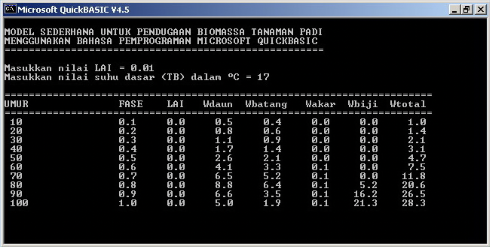
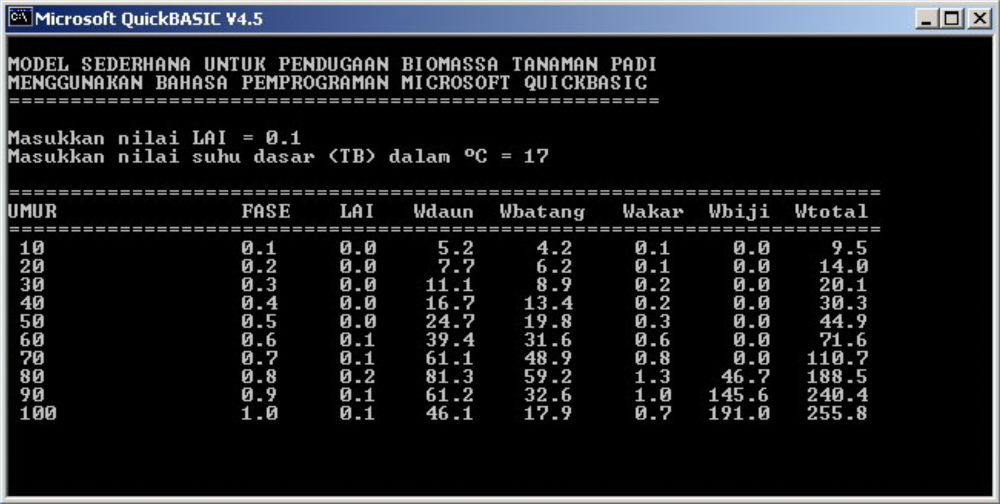
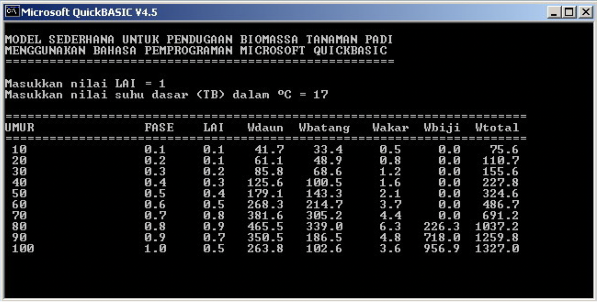
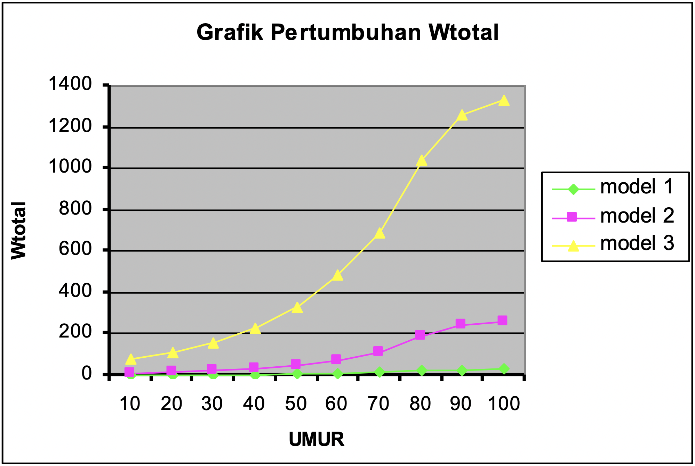
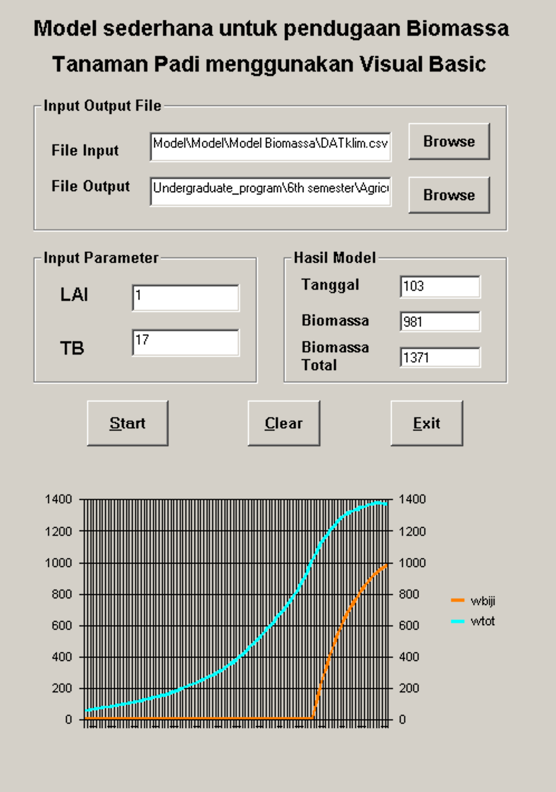

Ini adalah salah satu tugas praktikum dari mata kuliah Model Simulasi Pertanian yang diberikan oleh Pak Handoko dan Pak Yon Sugiarto.

Pendugaan biomassa tanaman padi yang dilakukan mencakup dua tahapan proses yang saling mempengaruhi satu sama lain. Struktur neraca air yang dimodelkan mengasumsikan CH dan faktor irigasi sebagai sumber air. Dua model pendugaan Biomassa dan Neraca Air Lahan ini kemudian digabungkan dalam satu model yang berkaitan satu sama lain.

Seperti yang telah dikemukakan diatas bahwa pemodelan ini merupakan penggabungan antara pendugaan biomassa tanaman dan neraca air lahan. Oleh karena itu ada parameter masukan yang dubutuhkan. Untuk sub model perkembangan dan sub model pertumbuhan dibutuhkan parameter masukan yang dapat kita impor dari file input oleh pengguna model yaitu data iklim suhu udara rataan harian (dalam °C) dan radiasi surya (dalam MJ M-2) yang dalam hal ini data inputnya adalah data iklim Stasiun Gunung Medan selama periode setahun. Dan untuk neraca air lahan dibutuhkan data iklim curah hujan, radiasi dan kelembaban relatif.

### Sub Model Perkembangan

1. Menggambarkan fase perkembangan tanaman dari masing-masing kejadian fenologi yang diduga berdasarkan konsep *heat unit* atau *thermal unit*.
2. Berdasarkan konsep ini, laju perkembangan tanaman terjadi jika suhu rata-rata harian melebihi suhu dasar.
3. Fase perkembangan tanaman akan berubah dari suatu fase ke fase selanjutnya jika tanaman telah mencapai akumulasi *heat unit* tertentu.
4. Secara umum, kejadian fenologi tanaman padi mulai dari semai hingga panen diberi skala $0$--$1$. Skala tersebut dibagi menjadi beberapa kejadian, yaitu semai $(s = 0.0)$, tanam $(s = 0.25)$, tunas maksimum $(s = 0.50)$, pembungaan $(s = 0.75)$, dan matang fisiologis $(s = 1.0)$.
5. Persamaan umum perkembangan tanaman dinyatakan sebagai:

$$
ds =
\begin{cases}
\dfrac{T - T_b}{TU}, & \text{jika } T > T_b \\
0, & \text{jika } T \leq T_b
\end{cases}
\tag{1}
$$

dimana:

- $ds$ laju perkembangan tanaman
- $T$ suhu rata-rata harian $(^\circ\mathrm{C})$
- $T_b$ suhu dasar $(^\circ\mathrm{C})$
- $TU$ *thermal unit* atau *heat unit*

### Sub Model Pertumbuhan

1. Mensimulasi aliran biomassa ke daun, batang, akar, dan biji serta kehilangannya berupa respirasi.
2. Menghitung pertambahan biomassa berdasarkan intersepsi radiasi surya dan ketersediaan air tanaman.
3. Intersepsi radiasi surya ($Q_{\text{int}}$) dihitung dari data radiasi surya ($Q_s$) dan indeks luas daun ($LAI$) berdasarkan persamaan:

$$
Q_{\text{int}} = Q_s \left(1 - \exp(-k \cdot LAI)\right)
\tag{2}
$$

dimana:

- $Q_{\text{int}}$ radiasi yang diintersepsi $(\mathrm{MJ\ m^{-2}})$
- $Q_s$ radiasi surya $(\mathrm{MJ\ m^{-2}})$
- $k$ koefisien pemadaman tajuk tanaman
- $LAI$ indeks luas daun

4. Biomassa hasil fotosintesis dibagi antara organ vegetatif dan generatif (biji).
5. Pertambahan biomassa total merupakan fungsi dari efisiensi penggunaan radiasi surya dan jumlah radiasi surya yang diintersepsi:

$$
dW = LUE \cdot Q_{\text{int}}
\tag{3}
$$

dimana:

- $dW$ pertambahan berat total $(\mathrm{kg\ ha^{-1}\ hari^{-1}})$
- $LUE$ efisiensi penggunaan radiasi surya

6. Sebagian biomassa ini akan digunakan dalam proses respirasi.
7. Laju respirasi dipengaruhi oleh berat organ $x$ dan suhu dalam bentuk *temperature quotient* ($Q_{10}$):

$$
R_m = k_m \cdot W_x \cdot Q_{10}
\tag{4}
$$

dimana:

- $R_m$ kehilangan biomassa dalam proses respirasi
- $k_m$ koefisien respirasi
- $W_x$ biomassa organ $x$
- $Q_{10}$ *temperature quotient*

### Asumsi

#### Parameter awal dan masukan

1. Parameter statis

   - Suhu dasar atau $T_b$ sebesar $17^\circ\mathrm{C}$
   - *Heat Unit* atau *Thermal Unit* ($TU$) sebesar $1000$
   - Koefisien pemadaman ($k$) sebesar $0.5$
   - Koefisien respirasi sebesar $0.02$ untuk seluruh organ
   - $SLA$ sebesar $0.002$

2. Parameter dinamis

   - $LAI$ awal sebesar $0.1$

3. Parameter masukan

   - Suhu udara rataan harian $(^\circ\mathrm{C})$
   - Radiasi surya rataan harian $(\mathrm{MJ\ m^{-2}})$

#### Sub model perkembangan

1. Untuk mempermudah model yang akan dibuat, model hanya akan menggunakan dua fase, yaitu fase dari semai $(s = 0.00)$ sampai fase pembungaan $(s = 0.75)$, dan fase setelah pembungaan sampai fase panen $(s = 1.00)$.
2. Panen terjadi setelah fase panen tercapai $(s = 1)$; model berhenti setelah nilai $s = 1$ atau fase panen tercapai.

#### Sub model pertumbuhan

1. Pertambahan biomassa merupakan kumulatif biomassa dari masing-masing organ tanaman.
2. Pertambahan biomassa total dan koefisien alokasi biomassa ke masing-masing organ dipengaruhi oleh fase perkembangan tanaman dan respirasi.

   - Pada $s = 0$--$0.75$, alokasi biomassa ke daun sebesar $0.5$, alokasi biomassa ke batang sebesar $0.4$, dan alokasi biomassa ke akar sebesar $0.1$.
   - Pada $s > 0.75$ sampai $s = 1$, alokasi biomassa ke akar, daun, dan batang sangat kecil, sehingga diasumsikan tidak ada alokasi, dan $3\%$ dari biomassa batang akan dialokasikan ke biomassa biji.

### Program

Selanjutnya parameter dan asumsi di atas ditulis menggunakan bahasa pemrograman BASIC. Model sederhana untuk pendugaan biomassa tanaman padi berikut ini menggunakan parameter awal sebagai berikut:

- *Thermal Unit* $(TU) = 1000$
- $k = 0.5$
- $LUE = 1.5$
- $SLA = 0.002$

Pada model yang pertama ini menggunakan parameter masukan LAI = 0.01 dan suhu dasar 17ºC

 

Gambar 1. Model 1

Pada model yang kedua ini menggunakan parameter masukan LAI = 0.1 dan suhu dasar 17ºC

 

Gambar 2. Model 2

Pada model yang ketiga ini menggunakan parameter masukan LAI = 1 dan suhu dasar 17ºC

 

Gambar 3. Model 3

Dari ketiga model diatas, dapat disimpulkan bahwa semakin besar nilai LAI maka nilai Wdaun, Wbatang, Wakar, Wbiji juga akan semakin besar.

 

Gambar 4. Perbandingan model

Pertambahan Wtotal juga bergantung pada besarnya LAI. Hal ini dapat dilihat pada grafik di samping:

## User interface menggunakan Visual BASIC

Selanjutnya untuk memudahkan perhitungan pendugaan biomassa dengan periode tertentu, beberapa persamaan diatas saya tulis ulang menggunakan Visual BASIC 6 (kodenya dapat dilihat dibagian bawah tulisan), dilengkapi dengan user interface sederhana seperti gambar dibawah.



### Program untuk menghitung pendugaan biomassa tanaman padi menggunakan Visual BASIC 6

```vb
'++++++++++++++++++++++++
' Program untuk menduga biomassa tanaman padi
' Benny Istanto, G241010143
' Praktikum matakuliah Model Simulasi Pertanian, Semester 6
' 27 April 2004, Kampus IPB Baranangsiang
'++++++++++++++++++++++++

Option Explicit

Dim pddcol As Integer
Dim pddrow As Integer

Private Sub cmdclear_Click()

    txtwbiji.Text = ""
    txtwtot.Text = ""
    txthari.Text = ""
    txtlai.Text = ""
    txttb.Text = ""
    txtinput.Text = ""
    txtoutput.Text = ""

End Sub


'++++
Private Sub cmdinput_Click()
'Listing code di bawah ini digunakan untuk memilih nama file input

    On Error GoTo out1

    txtinput.Text = ""
    Dialog1.DialogTitle = "open File Data Iklim"
    Dialog1.InitDir = CurDir
    Dialog1.Filter = "comma delimated(*.csv)|*.csv|all files(*.*)|*.*|"
    Dialog1.ShowOpen
    txtinput.Text = Dialog1.FileName

out1:
    Exit Sub

End Sub


'++++
Private Sub cmdoutput_Click()
'Listing code di bawah ini digunakan untuk memilih nama file output

    On Error GoTo out2

    txtoutput.Text = ""
    Dialog1.DialogTitle = "save output hasil simulasi"
    Dialog1.InitDir = CurDir
    Dialog1.Filter = "comma delimated(*.csv)|*.csv|all files(*.*)|*.*|"
    Dialog1.ShowSave
    txtoutput.Text = Dialog1.FileName

out2:
    Exit Sub

End Sub


'++++
Private Sub cmdproses_Click()

    Dim i As Integer

    Dim hujan As Double
    Dim RH As Double
    Dim suhu As Double
    Dim rad As Double
    Dim angin As Double

    Dim tu As Double
    Dim k As Double
    Dim lue As Double
    Dim sla As Double
    Dim tb As Double
    Dim lai As Double

    Dim s As Double
    Dim Qint As Double
    Dim dw As Double
    Dim Q10 As Double

    Dim wdaun As Double
    Dim wbatang As Double
    Dim wakar As Double
    Dim wbiji As Double
    Dim wtot As Double

    Dim rdaun As Double
    Dim rbatang As Double
    Dim rakar As Double
    Dim rbiji As Double

    'PARAMETER AWAL
    tu = 1000
    k = 0.5
    lue = 1.5
    sla = 0.002

    tb = Val(txttb.Text)
    lai = Val(txtlai.Text)

    'Inisialisasi variabel keadaan
    s = 0
    wdaun = 0
    wbatang = 0
    wakar = 0
    wbiji = 0
    wtot = 0

    If txtinput.Text = "" Or txtoutput.Text = "" Then
        MsgBox "File input dan output harus diisi terlebih dahulu.", vbExclamation, "Benny's Message"
        Exit Sub
    End If

    Open txtinput.Text For Input As #1
    Open txtoutput.Text For Output As #2

    i = 0

    Do While Not EOF(1)

        i = i + 1

        Input #1, hujan, RH, suhu, rad, angin

        'SUB MODEL PERKEMBANGAN
        If suhu > tb Then
            s = s + (suhu - tb) / tu
        End If

        If s > 1 Then s = 1

        'SUB MODEL PERTUMBUHAN
        Qint = rad * (1 - Exp(-k * lai))

        'Catatan:
        'Jika LUE dinyatakan dalam g biomassa / MJ radiasi terintersepsi,
        'maka dikalikan 10 untuk konversi ke kg ha-1 hari-1
        dw = lue * Qint * 10

        'Temperature quotient (Q10)
        Q10 = 2 ^ ((suhu - 20) / 10)

        'BIOMASSA
        rdaun = 0.02 * wdaun * Q10
        rbatang = 0.02 * wbatang * Q10
        rakar = 0.02 * wakar * Q10
        rbiji = 0.02 * wbiji * Q10

        If s <= 0.75 Then

            'Fase vegetatif
            wdaun = wdaun + dw * 0.5 - rdaun
            wbatang = wbatang + dw * 0.4 - rbatang
            wakar = wakar + dw * 0.1 - rakar

        Else

            'Fase generatif
            'Diasumsikan tidak ada alokasi baru ke akar, daun, dan batang
            'Biomassa hasil fotosintesis dialokasikan ke biji
            'Sebesar 3% biomassa batang diremobilisasi ke biji
            wbiji = wbiji + dw - rbiji + (0.03 * wbatang)
            wbatang = (wbatang * 0.97) - rbatang
            wdaun = wdaun - rdaun
            wakar = wakar - rakar

        End If

        'Mencegah biomassa bernilai negatif
        If wdaun < 0 Then wdaun = 0
        If wbatang < 0 Then wbatang = 0
        If wakar < 0 Then wakar = 0
        If wbiji < 0 Then wbiji = 0

        'Update LAI dan biomassa total
        lai = sla * wdaun
        wtot = wakar + wdaun + wbatang + wbiji

        'Simpan hasil simulasi ke file
        Write #2, i, s, lai, wdaun, wbatang, wakar, wbiji, wtot

        'Model berhenti jika fase panen tercapai
        If s >= 1 Then Exit Do

    Loop

    Close #2
    Close #1

    txtwbiji.Text = CStr(Int(wbiji))
    txtwtot.Text = CStr(Int(wtot))
    txthari.Text = CStr(i)
    txtlai.Text = Format$(lai, "0.000")

    pddrow = i
    pddcol = 2

    MsgBox "Model telah selesai dijalankan, Klik OK untuk menampilkan Grafik ", vbOKOnly, "Benny's Message"

    Call Grafik_Padi

End Sub


Public Sub Grafik_Padi()

    Dim i As Integer
    Dim j As Integer

    Dim s As Double
    Dim lai As Double
    Dim wdaun As Double
    Dim wbatang As Double
    Dim wakar As Double
    Dim wbiji As Double
    Dim wtot As Double

    With Chart1

        .Refresh

        Open txtoutput.Text For Input As #1

        j = 0

        .RowCount = pddrow
        .ColumnCount = pddcol

        While Not EOF(1)

            Input #1, i, s, lai, wdaun, wbatang, wakar, wbiji, wtot

            j = j + 1

            .Row = j
            .RowLabel = CStr(j)

            .Column = 1
            .Data = wbiji
            .ColumnLabel = "wbiji"

            .Column = 2
            .Data = wtot
            .ColumnLabel = "wtot"

        Wend

        Close #1

    End With

End Sub
```