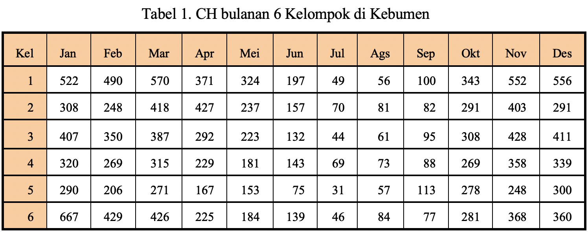
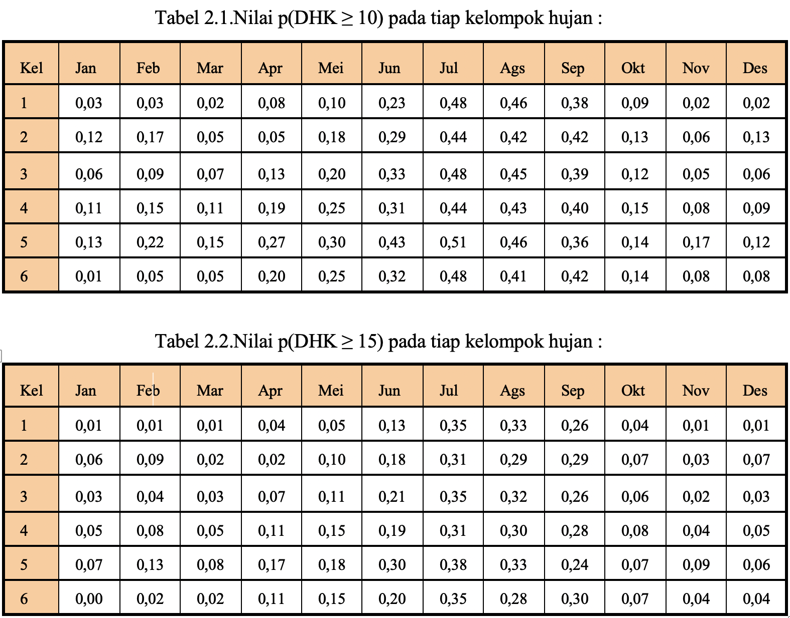
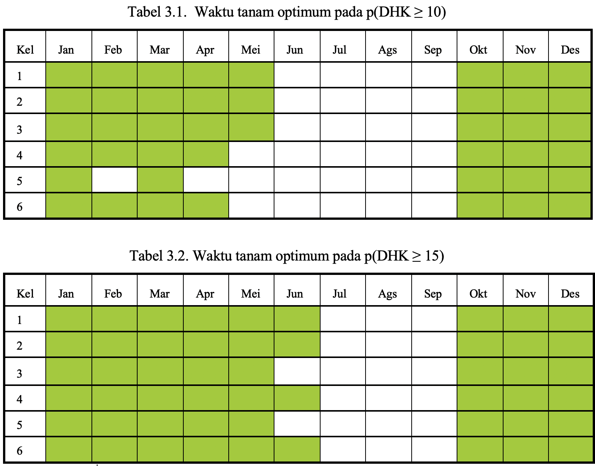
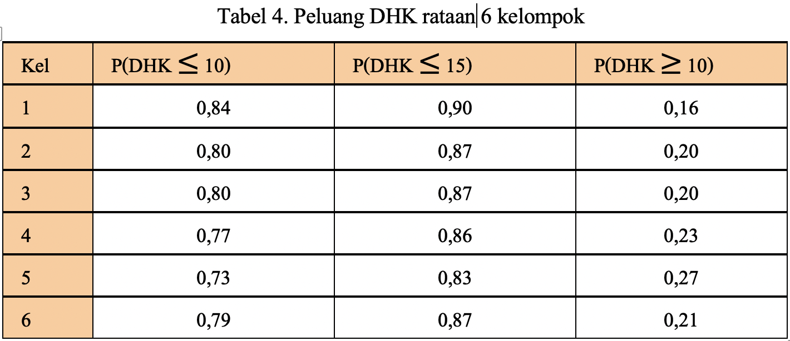
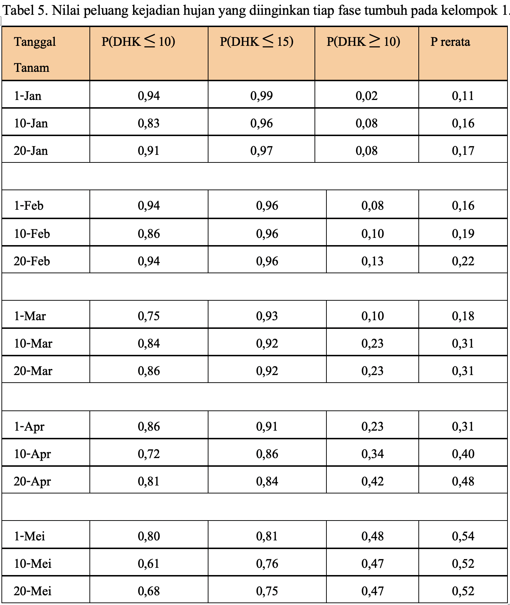
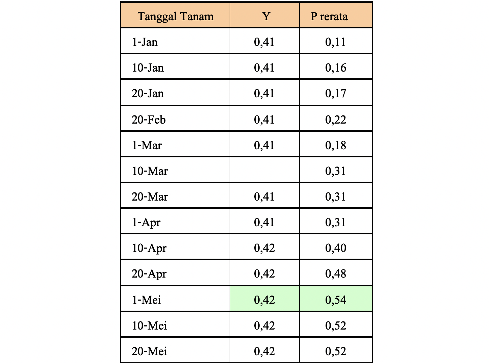

Makalah berikut merupakan tugas dari mata kuliah Klimatologi Pertanian di semester 6, dibimbing oleh Pak Rizaldi Boer.

## Penentuan musim tanam berdasarkan kejadian deret hari kering

Kejadian deret hari kering merupakan salah satu indikator yang dapat digunakan untuk mengetahui apakah suatu tanaman mengalami cekaman kekeringan atau tidak (McCaskill dan Kariada, 1992; Niewolt,1989). Untuk mendukung produksi tanaman yang baik, diusahakan agar syarat-syarat yang dibutuhkan tanaman terpenuhi. Salah satu syarat yang dibutuhkan tanaman adalah cuaca dan iklim. Curah hujan sebagai salah satu unsur iklim sangat besar peranannya dalam mendukung ketersediaan air.

Kegagalan panen sering disebabkan karena pembagian curah hujan di daerah tersebut tidak merata sehingga pada waktu tanaman betul-betul sedang membutuhkan air, hujan tidak ada. Untuk mengatasi keadaan ini, diperlukan analisis data hujan dalam menentukan musim tanam tanaman agar fase kritis tidak jatuh pada waktu curah hujan kurang.

## Tujuan

1. Menentukan peluang terjadinya deret hari kering (DHK) pada masing-masing alternative waktu tanam.
2. Menentukan waktu tanam optimum dengan menggunakan nilai rata-rata peluang kejadian deret hari kering (DHK).

## Data

1. Data curah hujan bulanan rata-rata Kabupaten Kebumen.

## Metode

1. Mengkelompokkan beberapa wilayah berdasarkan pola dan tinggi hujan rata-rata dari hasil analisis gerombol dengan algoritma centroid.
2. Mencari nilai $p(DHK \geq 10)$ dan $p(DHK \geq 15)$ untuk masing-masing kelompok.
3. Memilih peluang kritis yang digunakan sebagai acuan dalam penentuan waktu tanam.
4. Mentukan waktu tanam optimal dari suatu daerah.

## Hasil dan Pembahasan

Analisis ini menggunakan data curah hujan Kabupaten Kebumen yang terdiri dari 24 wilayah. Berdasarkan hasil analisis gerombol dengan algoritma centroid diperoleh dendogram dan mengelompokkan wilayah tersebut, menjadi 6.

Analisis yang dilakukan yang dilakukan selanjutnya pada praktikum ini diasumsikan mempunyai nilai persamaan-persamaan yang sama dengan persamaan-persamaan dari panduan praktikum “Penentuan Waktu Tanam Tembakau di Tamanggung Jawa Tengah Berdasar Sifat Curah Hujan dan Model Regresi Akhir (Sumber : Supriyanto,1997).

Jika diketahui

$$
\begin{aligned}
p(DHK \geq 10) &= \frac{1}{1 + \exp(-0.2688 + 0.00745\,X)} \\[4pt]
p(DHK \geq 15) &= \frac{1}{1 + \exp(0.22913 + 0.00831\,X)}
\end{aligned}
$$

maka diperoleh:

Karena peluang kritis yang digunakan adalah 0,2 artinya waktu penanaman harus diatur agar pada bulan dimana fase pertumbuhan sensitif terhadap kekeringan tercapai $\leq 0{,}2$. Sehingga waktu tanam optimal adalah daerah yang diarsir pada tabel 3.

 

Catatan: Tabel yang diarsir menunjukkan waktu tanam optimum (peluang kekeringan tercapai ≤ 0,2)

Berdasarkan tabel 3, waktu tanam tembakau optimum di Kebumen rata-rata pada bulan Oktober- Mei kecuali ada beberapa yang tidak optimum yaitu pada kel.4 di bulan mei, kel.5 di bulan Pebruari, April, dan Mei.

Dengan waktu tanam yang berbeda dan selang 10 hari (diambil contoh mulai tanggal 1 Januari – 30 Mei) maka nilai rata-rata peluang kejadian deret hari kering yang merupakan rataan dari keenam kelompok. Maka diperoleh hasil seperti:

Jika diketahui bahwa umur tanaman tembakau pada fase vegetatif awal 20 hari, fase vegetatif cepat 40 hari, dan fase pemasakan 30 hari. Tembakau ditanam selang 10 hari berdasar julian day, dan sebaran curah hujan menjadi dasarian dengan perbandingan 5:3:2 maka dapat diperoleh sebaran curah hujan menurut fase tumbuhnya (hasil tidak dilampirkan).

Dari hasil perhitungan tersebut, diambil contoh kelompok 1. Berdasarkan kondisi kejadian deret hari kering yang diinginkan oleh masing-masing fase tumbuh, maka nilai peluang dapat diperoleh (Tabel 5).

Setelah diketahui nilai peluang DHK masing-masing fase, maka akan didapatkan nilai rata-rata peluang kejadian DHK $(P_{\text{rerata}})$, yang merupakan acuan penentuan waktu tanam. Dengan persamaan

$$
P_{\text{rerata}} = 0.051 \cdot p(DHK \leq 10) + 0.041 \cdot p(DHK \geq 15) + 0.97 \cdot p(DHK \geq 10)
$$

Nilai peluang rataan menentukan waktu tanam. Waktu tanam paling optimum adalah saat peluang rataannya terbesar. Pada tabel 5 menunjukkan bahwa waktu tanam optimum dari 6 kelommpok adalah pada tanggal 1 Mei, karena memiliki peluang terbesar yaitu 0,54. Ini berarti potensi produksi optimal tanaman tembakau akan lebih besar jika ditanam pada tanggal 1 Mei untuk daerah yang termasuk dalam kelomppok 1 yaitu Kedungringin dan Sadang. Dengan catatan kualitas tembakau belum diperhitungkan.

Keragaman produksi $Y$ ditentukan oleh panjang deret hari kering maksimum fase vegetatif awal $(X_1)$, $P(DHK \geq 15)$ fase vegetatif cepat $(X_2)$ dan $P(DHK \geq 10)$ fase pemasakan $(X_3)$, dengan persamaan:

$$
Y = 0.407 - 0.00259\,X_1 - 0.009\,X_2 + 0.0426\,X_3
$$

maka diperoleh hasil:

Dari perhitungan yang telah dilakukan nilai $Y$ terbesar adalah 0,42. Pada saat $P_{\text{rerata}}$ maksimum, nilai $Y$ juga 0,42 meskipun nilai $Y$ tidak terlalu beragam. Mulai tanggal 10 April - 20 Mei waktu penananam, nilai $Y = 0{,}42$ tetapi nilai $P_{\text{rerata}}$ tanggal 1 Mei yang paling tinggi. Nilai peluang terjadinya deret hari kering $\geq 10$ $(X_3)$ pada tanggal ini juga mempunyai nilai paling tinggi yaitu 0,48.

Hal ini menunjukkan pada tanggal 1 Mei di daerah kelompok satu, bila ditanam tanaman tembakau akan akan memperoleh keragaman produksi sebesar 0,42. Ini berarti saat masa tanam optimum maka keragaman prosuksi juga akan tinggi.

## Kesimpulan

Pada analisis gerombol diperoleh bahwa jumlah gerombol untuk Kebumen adalah 6 kelompok.

Dari analisis peluang deret hari kering untuk kelompok 1 (daerah Kedungringin dan Sadang) menunjukkan waktu yang paling optimum untuk menanam tembakau adalah pada tanggal 1 Mei karena memiliki peluang rataan terbesar yaitu 0,54 dan keragaman produksi 0,42.

## Pustaka

Boer, R et al.1996. Penentuan Waktu Tanam Tembakau di Temanggung Jawa Tengah Berdasarkan Sifat Hujan dan Model Regresi Hasil.

Rachmat, Marsudi. 1998. Analisis Data Hujan Untuk Menentukan Musim Tanam Padi dan Palawija Pada Lahan Tadah Hujan. Jurusan Geofisika dan Meteorologi. FAMIPA. IPB. Bogor.