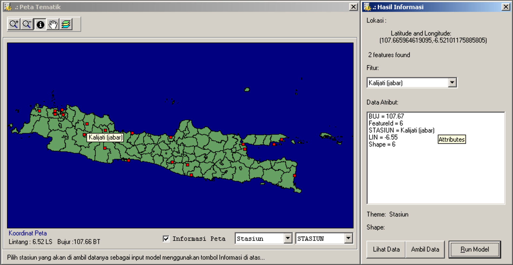
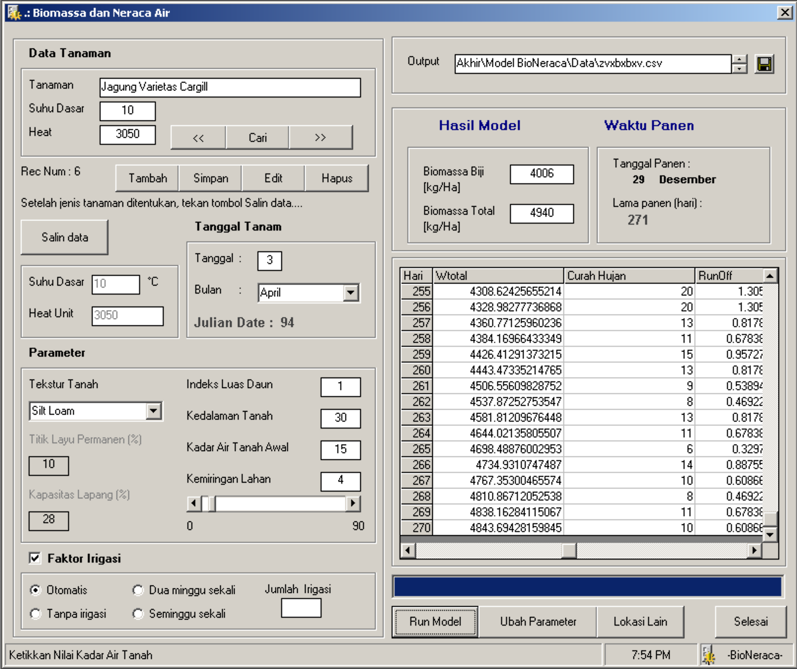

Model ini merupakan tugas akhir mata kuliah Model Simulasi Pertanian pada Semester 6. Melanjutkan model [sebelumnya](20040427-model-pendugaan-biomassa-tanaman-padi.html) yang telah diajarkan pada praktikum, kali ini saya menambahkan beberapa variabel sehingga pengguna dapat:

1. Memilih jenis tanaman, yang telah dilengkapi dengan Suhu Dasar dan *Heat Unit*.
2. Memilih tanggal tanam.
3. Memilih jenis tanah, yang berkaitan dengan Titik Layu Permanen dan Kapasitas Lapang.
4. Menentukan jenis irigasi.
5. Menentukan nilai Indeks Luas Daun, kedalaman tanah, kadar air tanah pada awal tanam, dan kemiringan lahan.

Selain itu, pengguna juga dapat mencoba data iklim dari beberapa stasiun cuaca yang disediakan, seperti ditunjukkan pada gambar di bawah ini.



Gambar di bawah ini merupakan tampilan model biomassa dan neraca air.



Script di bawah ini digunakan untuk menghitung neraca air pada model.

```vb
'++++++++++++++++++++++++
' Script untuk menghitung neraca air
' Benny Istanto, G241010143
' Tugas akhir matakuliah Model Simulasi Pertanian, Semester 6
' 8 Juli 2004, Kampus IPB Baranangsiang
'++++++++++++++++++++++++

    'Catatan:
    'kat(i-1) = kadar air tanah hari sebelumnya [mm]
    'kat(i)   = kadar air tanah hari ke-i [mm]
    'a        = nomor hari relatif terhadap awal simulasi / setelah tanam
    'Diasumsikan kat(0) sudah diisi dengan kadar air tanah awal sebelum simulasi dimulai

    Dim kat_awal As Double
    Dim target_ir As Double

    'Inisialisasi variabel harian
        kat_awal = kat(i - 1)
        ir(i) = 0
        Pc(i) = 0

    'Intersepsi Tajuk Tanaman:
        If lai(i) < 3 Then
            Ic(i) = 0.423 * lai(i)
        Else
            Ic(i) = 1.27
        End If

        If ch(i) < Ic(i) Then Ic(i) = ch(i)
        If a < 0 Then Ic(i) = 0

    'Curah Hujan Efektif
        CHeff(i) = ch(i) - Ic(i)
        If CHeff(i) < 0 Then CHeff(i) = 0
        If a < 0 Then CHeff(i) = 0

    'Run off fungsi kemiringan dan CHeff:
        Roff(i) = Sin(3.14159265358979 / 180 * slope) * CHeff(i)
        If Roff(i) < 0 Then Roff(i) = 0
        If Roff(i) > CHeff(i) Then Roff(i) = CHeff(i)

    'Evapotranspirasi (Penman):
        f1 = 0.64 * (1.054 * v(i))
        del = 208.84
        ETP(i) = (del * 0.5 * q(i) + f1 * (100 - rh(i)) / 100 * 2000) / (del * 66.1)

        If a < 0 Then ETP(i) = 0
        If ETP(i) < 0 Then ETP(i) = 0

    'Evaporasi (Ea) dan Transpirasi (Ta):
        Em(i) = ETP(i) * Exp(-0.5 * lai(i))
        Tm(i) = ETP(i) - Em(i)

        If Tm(i) < 0 Then Tm(i) = 0
        If Em(i) < 0 Then Em(i) = 0

        If kat_awal < kl Then
            If kat_awal > tlp Then
                Ta(i) = Tm(i) * (kat_awal - tlp) / (kl - tlp)
            Else
                Ta(i) = 0
            End If
        Else
            Ta(i) = Tm(i)
        End If

        If kat_awal < (tlp / 2) Then
            Ea(i) = 0
        Else
            Ea(i) = Em(i)
        End If

     'Irigasi
        If a < 0 Then
            ir(i) = 0

        ElseIf optminggu.Value = True Then
            If a Mod 7 = 0 Then
                ir(i) = Val(txtir.Text)
            Else
                ir(i) = 0
            End If

        ElseIf opt2minggu.Value = True Then
            If a Mod 14 = 0 Then
                ir(i) = Val(txtir.Text)
            Else
                ir(i) = 0
            End If

        ElseIf optnon.Value = True Then
            ir(i) = 0

        ElseIf optoto.Value = True Then
            target_ir = tlp + (0.5 * (kl - tlp))
            If kat_awal < target_ir Then
                ir(i) = target_ir - kat_awal
            Else
                ir(i) = 0
            End If
        End If

     'Kadar Air Tanah (mm):
        kat(i) = kat_awal + ir(i) + CHeff(i) - Roff(i) - Ea(i) - Ta(i)

        If a < 0 Then kat(i) = 0

     'Perkolasi:
        If kat(i) > kl Then
            Pc(i) = kat(i) - kl
            kat(i) = kl
        Else
            Pc(i) = 0
        End If

        If kat(i) < 0 Then kat(i) = 0
```