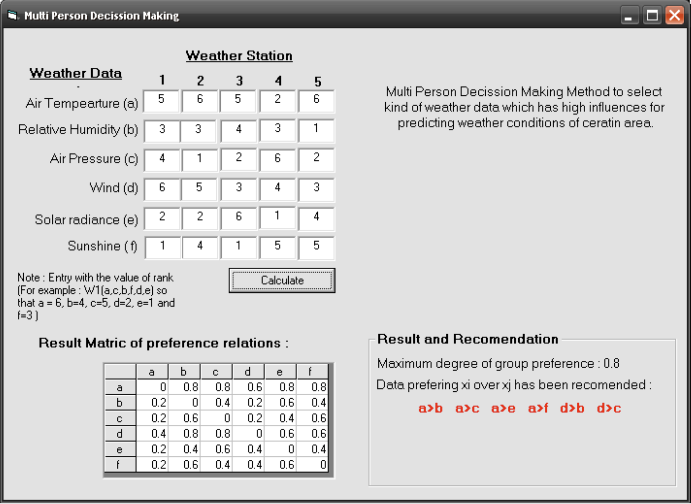

### Problem

Prediction on weather phenomena could be done using data from weather station. For small certain location may be could use data from one station. But for global area would be need more than one weather station. Formulated parameter to predict weather conditions for all weather station in the large area may different between each of stations. For example if we have a watershed for study area; this area maybe has more than one weather station, then we must concern about parameters that give big influences for weather conditions. Temperature 25°C on the low land maybe would give the same impact if on the up land has same temperature but different air humidity.

I would like to determine weather information from 7 stations in certain watershed and each station has the different rank of weather stations data that give impact on weather conditions for this area. Information on that would needed if we want to create generalisation which weather data will given big influence of watershed area.

### Formulated of the problem

The problem will be solved with multi person decision-making. Derived from 5 weather stations data, we get 6 kind of weather data, they are :

1. Air Temperature (a)
2. Air Relative Humidity (b)
3. Air Pressure (c)
4. Wind (d)
5. Solar radiance (e)
6. Sunshine hours (Measured by Campbell Stokes Instrument) (f)

Weather data priority to predict weather conditions each of stations:

* W1 = (d, a, c, b, e, f)
* W2 = (a, d, f, b, e, c)
* W3 = (e, a, b, d, c, f)
* W4 = (c, f, d, b, a, e)
* W5 = (a, f, e, d, c, b)

Determine the degree of weather data of priority by below equation:

* S(xi,xj) = N(xi,xj) / n

  N(xi,xj) is number of stations preferring xi over xj

  n is number of stations

Creating fuzzy preference relations in matric (would be created in computer program)

Selected maximum degree of group preference of alternative xi over xj (would be created in computer program)

Determine data prefering xi over xj which recommendation by computer program

Determine possible combination

### Problem Solving



Based on result above program we can determine the possible combination with the maximum degree of group preference is 0.8 and data preferring xi over xj has been recommended are :

1. a > b
2. a > c
3. a > e
4. d > b, and
5. d > c

The possible data ranking and combination are :

* a, d, c, b, e, f
* a, d, b, c, e, f
* a, d, b, c, f, e
* a, d, e, f, b, c
* a, d, e, f, c, b
* a, d, f, e, b, c
* a, d, f, e, c, b
* d, a, c, b, e, f
* d, a, b, c, e, f
* d, a, b, c, f, e
* d, a, e, f, b, c
* d, a, e, f, c, b
* d, a, f, e, b, c
* d, a, f, e, c, b
* etc.

Note : Possible combination must be put a or d in the first or second series.

::: {.callout-note collapse="true" title="Visual BASIC 6 - fuzzy preference relation and group ranking"}
```vb
'+++++++++++++++++++++++++++++++++++++++++++++++++++++++++++++++++
' Multi person decision making
'
' Each station ranks the six weather parameters. For every pair the
' program counts how many stations prefer one over the other, turns
' that into a fuzzy preference relation S(xi,xj) = N(xi,xj) / n, and
' reports the pairs holding the maximum degree of group preference.
'
' Benny Istanto, June 2006
'+++++++++++++++++++++++++++++++++++++++++++++++++++++++++++++++++

Option Explicit

Private Const NUM_STATIONS As Integer = 5    ' n, the decision makers
Private Const NUM_PARAMS   As Integer = 6    ' alternatives a..f
Private Const NUM_PAIRS    As Integer = NUM_PARAMS * NUM_PARAMS   ' 36 cells

' Written next to the executable. Change to suit your own setup.
Private Const MATRIX_FILE  As String = "preference_matrix.csv"
Private Const BEST_FILE    As String = "preferred_pairs.csv"


'===================================================================
' Turn "cell number" into a preference label, e.g. 7 -> "b>a"
'===================================================================
Private Function PairLabel(ByVal cell As Integer) As String
    Dim r As Integer, c As Integer
    r = (cell - 1) \ NUM_PARAMS + 1
    c = (cell - 1) Mod NUM_PARAMS + 1
    PairLabel = Chr$(96 + r) & ">" & Chr$(96 + c)
End Function


Private Sub cmdSolve_Click()

    Dim rank(1 To NUM_PARAMS, 1 To NUM_STATIONS) As Double
    Dim N(1 To NUM_PAIRS)  As Double     ' stations preferring xi over xj
    Dim S(1 To NUM_PARAMS, 1 To NUM_PARAMS) As Double
    Dim best()             As String     ' pairs holding the maximum degree

    Dim maxDegree As Double
    Dim bestCount As Integer
    Dim cell      As Integer
    Dim station   As Integer
    Dim p         As Integer, q As Integer
    Dim i         As Integer, j As Integer
    Dim fileNo    As Integer

    '--- Read each station's ranking of the six parameters ----------
    ' a = air temperature
    rank(1, 1) = Val(Wa1.Text): rank(1, 2) = Val(Wa2.Text): rank(1, 3) = Val(Wa3.Text)
    rank(1, 4) = Val(Wa4.Text): rank(1, 5) = Val(Wa5.Text)
    ' b = relative humidity
    rank(2, 1) = Val(Wb1.Text): rank(2, 2) = Val(Wb2.Text): rank(2, 3) = Val(Wb3.Text)
    rank(2, 4) = Val(Wb4.Text): rank(2, 5) = Val(Wb5.Text)
    ' c = air pressure
    rank(3, 1) = Val(Wc1.Text): rank(3, 2) = Val(Wc2.Text): rank(3, 3) = Val(Wc3.Text)
    rank(3, 4) = Val(Wc4.Text): rank(3, 5) = Val(Wc5.Text)
    ' d = wind
    rank(4, 1) = Val(Wd1.Text): rank(4, 2) = Val(Wd2.Text): rank(4, 3) = Val(Wd3.Text)
    rank(4, 4) = Val(Wd4.Text): rank(4, 5) = Val(Wd5.Text)
    ' e = solar radiance
    rank(5, 1) = Val(We1.Text): rank(5, 2) = Val(We2.Text): rank(5, 3) = Val(We3.Text)
    rank(5, 4) = Val(We4.Text): rank(5, 5) = Val(We5.Text)
    ' f = sunshine hours
    rank(6, 1) = Val(Wf1.Text): rank(6, 2) = Val(Wf2.Text): rank(6, 3) = Val(Wf3.Text)
    rank(6, 4) = Val(Wf4.Text): rank(6, 5) = Val(Wf5.Text)

    '--- Count preferences for every pair ---------------------------
    ' Cell (p,q) lives at index (p-1)*NUM_PARAMS + q. Each unordered
    ' pair is visited once and credited to whichever side wins, so the
    ' diagonal stays at zero.
    For cell = 1 To NUM_PAIRS
        N(cell) = 0
    Next cell

    For station = 1 To NUM_STATIONS
        For p = 1 To NUM_PARAMS - 1
            For q = p + 1 To NUM_PARAMS
                If rank(p, station) > rank(q, station) Then
                    cell = (p - 1) * NUM_PARAMS + q
                Else
                    cell = (q - 1) * NUM_PARAMS + p
                End If
                N(cell) = N(cell) + 1
            Next q
        Next p
    Next station

    '--- Fuzzy preference relation, and fill the on-screen grid -----
    fileNo = FreeFile
    Open App.Path & "\" & MATRIX_FILE For Output As #fileNo

    For i = 1 To NUM_PARAMS
        grdMatrix.Row = i
        For j = 1 To NUM_PARAMS
            cell = (i - 1) * NUM_PARAMS + j
            S(i, j) = N(cell) / NUM_STATIONS
            grdMatrix.Col = j
            grdMatrix.Text = S(i, j)
        Next j
        Write #fileNo, S(i, 1), S(i, 2), S(i, 3), S(i, 4), S(i, 5), S(i, 6)
    Next i

    Close #fileNo

    '--- Maximum degree of group preference -------------------------
    maxDegree = 0
    For i = 1 To NUM_PARAMS
        For j = 1 To NUM_PARAMS
            If S(i, j) > maxDegree Then maxDegree = S(i, j)
        Next j
    Next i

    '--- Every pair that reaches it ---------------------------------
    ReDim best(1 To NUM_PAIRS)
    bestCount = 0

    fileNo = FreeFile
    Open App.Path & "\" & BEST_FILE For Output As #fileNo

    For cell = 1 To NUM_PAIRS
        i = (cell - 1) \ NUM_PARAMS + 1
        j = (cell - 1) Mod NUM_PARAMS + 1
        If S(i, j) = maxDegree Then
            bestCount = bestCount + 1
            best(bestCount) = PairLabel(cell)
            Write #fileNo, best(bestCount)
        End If
    Next cell

    Close #fileNo

    lblMaxDegree.Caption = "Maximum degree of group preference : " & maxDegree

    If bestCount > 0 Then
        ReDim Preserve best(1 To bestCount)
        lblRecommendation.Caption = Join(best, "   ")
    Else
        lblRecommendation.Caption = "No preference reached the maximum degree."
    End If

End Sub


'===================================================================
' Label the grid a..f along both axes
'===================================================================
Private Sub Form_Load()

    Dim i As Integer

    With grdMatrix
        .Rows = NUM_PARAMS + 1
        .Cols = NUM_PARAMS + 1

        For i = 0 To NUM_PARAMS
            .ColWidth(i) = 500
        Next i

        For i = 1 To NUM_PARAMS
            .Row = 0: .Col = i: .Text = "   " & Chr$(96 + i)   ' column header
            .Row = i: .Col = 0: .Text = "   " & Chr$(96 + i)   ' row header
        Next i
    End With

End Sub
```
:::