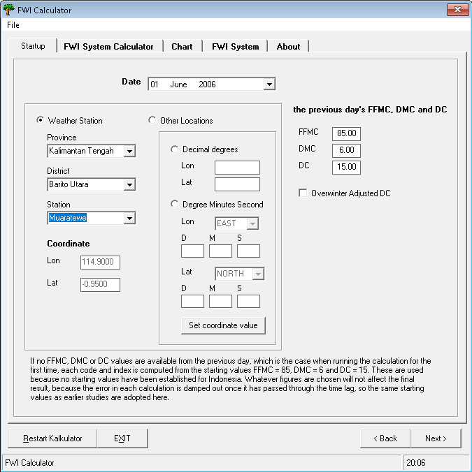
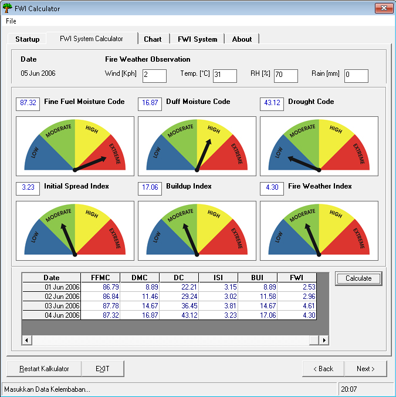
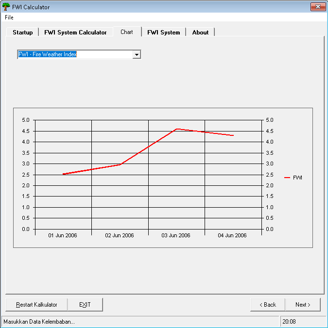
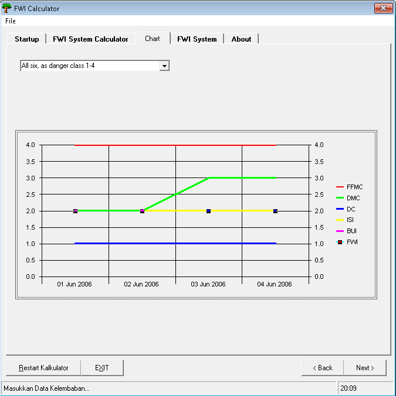
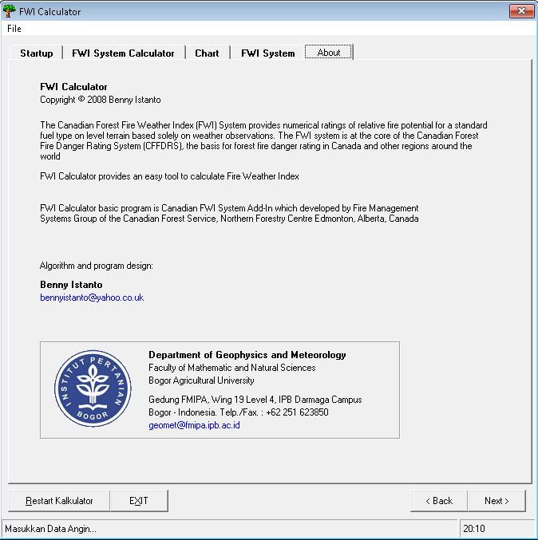

FWI Excel program add-in is a quick and easy way to calculate the fire weather index into a table in Microsoft Excel, hereinafter known as XLFWI add-ins. XLFWI add-in consists of functions worksheets for six index of fire weather index (FFMC, DMC, DC, BUI, ISI and FWI). Besides the function of this worksheet can be applied directly into the weather data that is stored in Microsoft Excel.

Calculation system is designed to easily and quickly used by the user, or can also be modified in accordance with the application. XLFWI add-ins can be used for operational calculations FWI index on a single weather station, as FWI and training systems can be combined with other manufacturing excel display, such as charts and basic data analysis.

Download FWI Excel add-in [here](https://drive.google.com/file/d/1pksUS60aNB8IZoltfEZft3XddarnMbJO/view?usp=sharing).

In addition to the Excel add-ins, as part of my final research project I developed a program that can run directly to calculate the FWI. The program is written in BASIC language, and some components have been adjusted for the FWI calculations in Indonesia.

Download FWI Calculator [here](https://drive.google.com/file/d/1MBq27VT-oigwcB128JXuzKWpGGee4ARU/view?usp=sharing) (32-bit Windows program)

::: {.image-gallery}
::: {.gallery-item}

:::
::: {.gallery-item}

:::
::: {.gallery-item}

:::
::: {.gallery-item}

:::
::: {.gallery-item}

:::
:::

### The six indices

The calculator works through the Canadian Forest Fire Weather Index system in order. The three
fuel moisture codes come first, each carrying yesterday's value forward:

- **FFMC** (Fine Fuel Moisture Code) from temperature, humidity, wind and rain
- **DMC** (Duff Moisture Code) from temperature, humidity, rain and day length
- **DC** (Drought Code) from temperature, rain and a seasonal drying factor

Those feed the three fire behaviour indices: **ISI** from FFMC and wind, **BUI** from DMC and DC,
and finally **FWI** from ISI and BUI. The day-length and drying-factor terms are the parts
adjusted for Indonesia, since the original Canadian values assume a temperate seasonal cycle.

### Starting values

FFMC, DMC and DC are running values: each day's calculation needs yesterday's result. If no
FFMC, DMC or DC values are available from the previous day, which is the case when running the
calculation for the first time, each code and index is computed from the starting values
FFMC = 85, DMC = 6 and DC = 15.

These are used because no starting values have been established for Indonesia. Whatever figures
are chosen will not affect the final result, because the error in each calculation is damped out
once it has passed through the time lag, so the same starting values as earlier studies are
adopted here.

The calculator applies this automatically. The first calculation at a location is seeded with
85, 6 and 15; after that, each result is carried into the next day, and picking a different
station starts a fresh sequence.

### Charting the results

The six indices look like they belong on one chart, but they do not share a scale. FFMC is a
moisture code bounded near 101, DC is an open-ended drought accumulator that can pass 800, and
ISI usually sits below 20. Drawn on a single axis, DC dominates and the other five collapse into
a line along the bottom.

So the chart shows **one index at a time** at full resolution, picked from a combo box, with one
extra option that plots all six as their **danger class 1 to 4** - the only form in which they
are directly comparable, and the same scale the indicator lamps use.

The results grid is the store; the chart is only a view of it, redrawn after every calculation.
On the Chart tab that needs two controls: the MSChart itself, named `chrtFDRS`, and a combo box
named `cboChart` for the series picker.

The source below is in two parts, and they go in two different places in the VB6 project:

| Part | Goes in | Name |
|---|---|---|
| The six index calculations | a standard module | `modFWI` (`modFWI.bas`) |
| Form, station database, indicators | the form's code window | `frmNumeric` |

The module holds only pure functions, so it has no state of its own. Everything that has to be
remembered between clicks (the station table, and the running FFMC, DMC and DC values) lives in
the form.

::: {.callout-note collapse="true" title="Visual BASIC 6 - the six FWI index calculations (modFWI.bas)"}
```vb
'+++++++++++++++++++++++++++++++++++++++++++++++++++++++++++++++++
'  FWI Calculator - index calculations
'
'  Canadian Forest Fire Weather Index system, with the day-length
'  and drying-factor terms adjusted for Indonesia.
'
'  Benny Istanto
'  Departemen Geofisika dan Meteorologi, FMIPA
'  Institut Pertanian Bogor
'
'  WHERE THIS GOES
'    Project > Add Module > Module > Open, then in the Properties
'    window set (Name) to  modFWI  and save it as  modFWI.bas
'
'  Every routine here is a pure function: give it the weather and
'  yesterday's code, it returns today's. It holds no state of its own,
'  so the form owns all the running values.
'+++++++++++++++++++++++++++++++++++++++++++++++++++++++++++++++++

Option Explicit

Private Const PI As Double = 3.14159265358979

' Day-length adjustment factor for the Drought Code, by month. These are the
' original hardcoded Canadian values, kept as-is. The Duff Moisture Code no
' longer uses a lookup like this: see DayLength() below.
Private Const LF_NORTH As String = "1.17,1.2,4.5,2.99,2.27,2.45,4.13,4.4,5.3,5.17,3.12,1.88"
Private Const LF_SOUTH As String = "4.4,5.3,5.17,3.12,1.88,1.17,1.2,4.5,2.99,2.27,2.45,4.13"


'===================================================================
' FFMC - Fine Fuel Moisture Code
'   temp     air temperature at 12:00 LST, degC
'   rh       relative humidity at 12:00 LST, %
'   wind     wind speed at 12:00 LST, km/h
'   rain     24-hour accumulated rainfall to 12:00 LST, mm
'   ffmcPrev yesterday's FFMC
'===================================================================
Public Function CalcFFMC(ByVal temp As Double, ByVal rh As Double, _
                         ByVal wind As Double, ByVal rain As Double, _
                         ByVal ffmcPrev As Double) As Double

    Dim mo As Double     ' yesterday's moisture content
    Dim rf As Double     ' effective rainfall
    Dim mr As Double     ' moisture content after rain
    Dim ed As Double     ' equilibrium moisture, drying
    Dim ew As Double     ' equilibrium moisture, wetting
    Dim ko As Double, kd As Double
    Dim kl As Double, kw As Double
    Dim m  As Double     ' today's moisture content

    mo = 147.2 * (101 - ffmcPrev) / (59.5 + ffmcPrev)

    '--- Rainfall phase ---------------------------------------------
    If rain > 0.5 Then
        rf = rain - 0.5

        mr = mo + 42.5 * rf * Exp(-100 / (251 - mo)) * (1 - Exp(-6.93 / rf))
        If mo > 150 Then
            mr = mr + 0.0015 * (mo - 150) ^ 2 * rf ^ 0.5
        End If

        If mr > 250 Then mr = 250
        mo = mr
    End If

    '--- Drying or wetting phase ------------------------------------
    ed = 0.942 * rh ^ 0.679 _
       + 11 * Exp((rh - 100) / 10) _
       + 0.18 * (21.1 - temp) * (1 - Exp(-0.115 * rh))

    If mo > ed Then
        ko = 0.424 * (1 - (rh / 100) ^ 1.7) _
           + 0.0694 * wind ^ 0.5 * (1 - (rh / 100) ^ 8)
        kd = ko * 0.581 * Exp(0.0365 * temp)
        m = ed + (mo - ed) * 10 ^ (-kd)
    Else
        ew = 0.618 * rh ^ 0.753 _
           + 10 * Exp((rh - 100) / 10) _
           + 0.18 * (21.1 - temp) * (1 - Exp(-0.115 * rh))

        If mo < ew Then
            kl = 0.424 * (1 - ((100 - rh) / 100) ^ 1.7) _
               + 0.0694 * wind ^ 0.5 * (1 - ((100 - rh) / 100) ^ 8)
            kw = kl * 0.581 * Exp(0.0365 * temp)
            m = ew - (ew - mo) * 10 ^ (-kw)
        Else
            m = mo
        End If
    End If

    CalcFFMC = 59.5 * (250 - m) / (147.2 + m)
    If CalcFFMC < 0 Then CalcFFMC = 0

End Function


'===================================================================
' Day length in hours, after Handoko (1998), Shierary-Weather v2.0
'
' The original FWI system reads the Duff Moisture Code day-length
' term from a hardcoded table of Canadian values. That table assumes
' a temperate seasonal cycle and is wrong near the equator, so this
' computes the real day length from latitude and day of year instead,
' assuming clear sky.
'===================================================================
Public Function DayLength(ByVal lat As Double, ByVal julianDay As Double) As Double

    Dim decl As Double, sinld As Double, cosld As Double
    Dim sinb As Double, arg As Double, hourAngle As Double

    decl = -23.4 * Cos(2 * PI * (julianDay + 10) / 365)
    sinld = Sin(lat * PI / 180) * Sin(decl * PI / 180)
    cosld = Cos(lat * PI / 180) * Cos(decl * PI / 180)
    sinb = Sin(-0.833 * PI / 180)
    arg = (sinb - sinld) / cosld
    hourAngle = 2 * Atn(1) - Atn(arg / Sqr(1 - arg * arg))

    DayLength = 24 / PI * hourAngle

End Function


'===================================================================
' DMC - Duff Moisture Code
'===================================================================
Public Function CalcDMC(ByVal temp As Double, ByVal rh As Double, _
                        ByVal rain As Double, ByVal dmcPrev As Double, _
                        ByVal lat As Double, ByVal julianDay As Double) As Double

    Dim re As Double     ' effective rainfall
    Dim mo As Double, mr As Double
    Dim b  As Double     ' slope coefficient
    Dim pr As Double     ' DMC after rain
    Dim dayLen As Double
    Dim k  As Double     ' log drying rate

    '--- Rainfall phase ---------------------------------------------
    If rain > 1.5 Then
        re = 0.92 * rain - 1.27
        mo = 20 + Exp(5.6348 - dmcPrev / 43.43)

        If dmcPrev <= 33 Then
            b = 100 / (0.5 + 0.3 * dmcPrev)
        ElseIf dmcPrev <= 65 Then
            b = 14 - 1.3 * Log(dmcPrev)
        Else
            b = 6.2 * Log(dmcPrev) - 17.2
        End If

        mr = mo + 1000 * re / (48.77 + b * re)
        pr = 244.72 - 43.43 * Log(mr - 20)

        If pr > 0 Then dmcPrev = pr Else dmcPrev = 0
    End If

    '--- Drying phase -----------------------------------------------
    dayLen = DayLength(lat, julianDay)

    If temp > -1.1 Then
        k = 1.894 * (temp + 1.1) * (100 - rh) * dayLen * 0.000001
    Else
        k = 0
    End If

    CalcDMC = dmcPrev + 100 * k
    If CalcDMC < 0 Then CalcDMC = 0

End Function


'===================================================================
' DC - Drought Code
'   monthIndex is 1..12
'===================================================================
Public Function CalcDC(ByVal temp As Double, ByVal rain As Double, _
                       ByVal dcPrev As Double, ByVal lat As Double, _
                       ByVal monthIndex As Integer) As Double

    Dim rd As Double     ' effective rainfall
    Dim qo As Double     ' moisture equivalent of DC
    Dim qr As Double     ' moisture equivalent after rain
    Dim dr As Double     ' DC after rain
    Dim lf As Double     ' day-length adjustment
    Dim v  As Double     ' evapotranspiration
    Dim factors() As String

    '--- Rainfall phase ---------------------------------------------
    If rain > 2.8 Then
        rd = 0.83 * rain - 1.27
        qo = 800 * Exp(-dcPrev / 400)
        qr = qo + 3.937 * rd
        dr = 400 * Log(800 / qr)

        If dr > 0 Then dcPrev = dr Else dcPrev = 0
    End If

    '--- Seasonal drying factor -------------------------------------
    If lat > 0 Then
        factors = Split(LF_NORTH, ",")
    Else
        factors = Split(LF_SOUTH, ",")
    End If
    lf = CDbl(factors(monthIndex - 1))

    If temp > -2.8 Then
        v = 0.36 * (temp + 2.8) + lf
    Else
        v = lf
    End If
    If v < 0 Then v = 0

    CalcDC = dcPrev + 0.5 * v
    If CalcDC < 0 Then CalcDC = 0

End Function


'===================================================================
' ISI - Initial Spread Index
'   The wind function doubles ISI for roughly every 14 km/h of wind.
'===================================================================
Public Function CalcISI(ByVal wind As Double, ByVal ffmc As Double) As Double

    Dim fWind As Double
    Dim m     As Double     ' FFMC expressed as moisture content
    Dim fF    As Double

    fWind = Exp(0.05039 * wind)
    m = 147.2 * (101 - ffmc) / (59.5 + ffmc)
    fF = 91.9 * Exp(-0.1386 * m) * (1 + m ^ 5.31 / 49300000#)

    CalcISI = 0.208 * fWind * fF
    If CalcISI < 0 Then CalcISI = 0

End Function


'===================================================================
' BUI - Buildup Index
'===================================================================
Public Function CalcBUI(ByVal dmc As Double, ByVal dc As Double) As Double

    If dmc <= 0.4 * dc Then
        CalcBUI = 0.8 * dmc * dc / (dmc + 0.4 * dc)
    Else
        ' Van Wagner (1987): the whole fraction is subtracted from 1.
        CalcBUI = dmc - (1 - 0.8 * dc / (dmc + 0.4 * dc)) _
                      * (0.92 + (0.0114 * dmc) ^ 1.7)
    End If

    If CalcBUI < 0 Then CalcBUI = 0

End Function


'===================================================================
' FWI - Fire Weather Index
'   When B <= 1 the logarithmic form goes negative, so S is taken
'   as equal to B.
'===================================================================
Public Function CalcFWI(ByVal isi As Double, ByVal bui As Double) As Double

    Dim fD As Double     ' duff moisture function
    Dim b  As Double
    Dim s  As Double

    If bui <= 80 Then
        fD = 0.626 * (bui ^ 0.809 + 2)
    Else
        fD = 1000 / (25 + 108.64 * Exp(-0.023 * bui))
    End If

    b = 0.1 * isi * fD

    If b > 1 Then
        s = Exp(2.72 * (0.434 * Log(b)) ^ 0.647)
    Else
        s = b
    End If

    CalcFWI = s
    If CalcFWI < 0 Then CalcFWI = 0

End Function


'===================================================================
' Danger class from the index thresholds
'   1 = low, 2 = moderate, 3 = high, 4 = extreme
'===================================================================
Public Function DangerClass(ByVal value As Double, ByVal t1 As Double, _
                            ByVal t2 As Double, ByVal t3 As Double) As Integer
    If value < t1 Then
        DangerClass = 1
    ElseIf value < t2 Then
        DangerClass = 2
    ElseIf value < t3 Then
        DangerClass = 3
    Else
        DangerClass = 4
    End If
End Function
```
:::

::: {.callout-note collapse="true" title="Visual BASIC 6 - form, station database and indicators (frmNumeric)"}
```vb
'+++++++++++++++++++++++++++++++++++++++++++++++++++++++++++++++++
'  FWI Calculator - form code
'
'  WHERE THIS GOES
'    The form itself (frmNumeric), NOT a standard module. Open the
'    form, press F7 for its code window, and paste there.
'
'  It owns the station table, the running FFMC/DMC/DC values and every
'  control reference, and calls the pure functions in modFWI.
'+++++++++++++++++++++++++++++++++++++++++++++++++++++++++++++++++

Option Explicit

'--- Station database ----------------------------------------------
' One row per weather station. Province, district, station, lon, lat.
' The three cascading combo boxes and the coordinate lookup all read
' from this one table.
' NOTE: the member is StationName, not Name. "Name" is a VB6 reserved word
' (the Name statement renames files), and using it here makes the whole
' declarations section fail to compile.
Private Type StationRec
    Province    As String
    District    As String
    StationName As String
    Lon         As Double
    Lat         As Double
End Type

Private m_Stations() As StationRec
Private m_Count      As Integer
Private m_Loading    As Boolean

'--- Carrying the codes forward ------------------------------------
' FFMC, DMC and DC are running values: each day's calculation needs
' yesterday's result. On the first run at a location the system is
' seeded with these standard starting values. After every calculation
' the results are written back into the "previous day" boxes, so the
' next Calculate continues the sequence. Changing location resets it.
Private Const FFMC_START As Double = 85
Private Const DMC_START  As Double = 6
Private Const DC_START   As Double = 15

Private m_LocationKey As String   ' lat/lon of the last calculation


Private Sub AddStation(ByVal prov As String, ByVal dist As String, _
                       ByVal nm As String, ByVal lon As Double, ByVal lat As Double)
    m_Count = m_Count + 1
    ReDim Preserve m_Stations(1 To m_Count)
    With m_Stations(m_Count)
        .Province = prov: .District = dist: .StationName = nm
        .Lon = lon:       .Lat = lat
    End With
End Sub


Private Sub LoadStations()

    m_Count = 0

    AddStation "DI Aceh", "Kota Sabang", "Cut Bau", 95.317, 5.867
    AddStation "DI Aceh", "Aceh Besar", "Blangbintang", 95.417, 5.517
    AddStation "DI Aceh", "Aceh Utara", "Malikussaleh", 97.21, 5.1
    AddStation "DI Aceh", "Aceh Barat", "Meulaboh", 96.117, 4.25

    AddStation "Sumatera Utara", "Kota Medan", "Belawan", 98.67, 3.78
    AddStation "Sumatera Utara", "Kota Medan", "Polonia", 98.683, 3.567
    AddStation "Sumatera Utara", "Nias", "Binaka", 97.453, 1.41
    AddStation "Sumatera Utara", "Tapanuli Tengah", "Pinangsori", 98.883, 1.55

    AddStation "Sumatera Barat", "Kota Padang", "Tabing", 100.37, -0.893
    AddStation "Jambi", "Kota Jambi", "Sultan Taha", 103.65, -1.633

    AddStation "Riau", "Batam", "Batan", 104.117, -1.117
    AddStation "Riau", "Natuna", "Ranai", 108.363, 3.95
    AddStation "Riau", "Natuna", "Tarempa", 106.25, 3.2
    AddStation "Riau", "Pelalawan", "Rengat", 102.317, 0.333
    AddStation "Riau", "Pekanbaru", "Simpangtiga", 101.45, 0.467
    AddStation "Riau", "Kepulauan Riau", "Singkep", 104.583, -0.483
    AddStation "Riau", "Kepulauan Riau", "Tanjung Pinang", 104.533, 0.917

    AddStation "Sumatera Selatan", "Musi Banyu Asin", "Talangbetutu", 104.7, -2.9
    AddStation "Sumatera Selatan", "Musi Banyu Asin", "Kenten", 104.7719, -2.92731

    AddStation "Bangka Belitung", "Bangka", "Pangkalpinang", 106.133, -2.167
    AddStation "Bangka Belitung", "Belitung", "Tanjung Pandan", 107.75, -2.75

    AddStation "Bengkulu", "Bengkulu Utara", "Kerinci", 101.367, -2.767
    AddStation "Bengkulu", "Kota Bengkulu", "Padang Kemiling", 102.333, -3.833

    AddStation "Lampung", "Tulang Bawang", "Menggala", 105.183, -4.45
    AddStation "Lampung", "Lampung Selatan", "Telukbetung", 105.183, -5.267

    AddStation "Banten", "Serang", "Serang", 106.133, -6.117
    AddStation "Banten", "Kota Tangerang", "Budiarto", 106.65, -7.333
    AddStation "Banten", "Kota Tangerang", "Soekarno Hatta", 106.65, -6.117

    AddStation "DKI Jakarta", "Jakarta Utara", "Tanjung Priok", 106.867, -6.1
    AddStation "DKI Jakarta", "Jakarta Pusat", "Observatory", 106.833, -6.183
    AddStation "DKI Jakarta", "Jakarta Timur", "Halim Perdanakusumah", 106.9, -6.25

    AddStation "Jawa Barat", "Bogor", "Atang Sanjaya", 106.9, -6.55
    AddStation "Jawa Barat", "Bogor", "Darmaga", 106.75, -6.5
    AddStation "Jawa Barat", "Bogor", "Puncak", 106.933, -6.7
    AddStation "Jawa Barat", "Kota Bandung", "Bandung", 107.6, -6.883
    AddStation "Jawa Barat", "Kota Bandung", "Husein Sastranegara", 107.583, -6.9
    AddStation "Jawa Barat", "Subang", "Kalijati", 107.667, -6.55
    AddStation "Jawa Barat", "Tasikmalaya", "Cibeureum", 108.25, -7.333
    AddStation "Jawa Barat", "Majalengka", "Jatiwangi", 108.267, -6.75

    AddStation "Jawa Tengah", "Kota Semarang", "Semarang", 110.44, -7.02
    AddStation "Jawa Tengah", "Kota Semarang", "Ahmad Yani", 110.383, -7.01
    AddStation "Jawa Tengah", "Kota Tegal", "Tegal", 109.15, -6.85
    AddStation "Jawa Tengah", "Cilacap", "Cilacap", 109.017, -7.673
    AddStation "Jawa Tengah", "Surakarta", "Adi Sumarmo", 110.917, -7.867

    AddStation "DI Yogyakarta", "Sleman", "Adi Sucipto", 110.433, -7.783

    AddStation "Jawa Timur", "Kota Surabaya", "Perak", 112.717, -7.217
    AddStation "Jawa Timur", "Sidoarjo", "Juanda", 112.767, -7.367
    AddStation "Jawa Timur", "Sumenep", "Kalianget", 113.927, -7
    AddStation "Jawa Timur", "Sumenep", "Sumenep", 113.64, -7.04
    AddStation "Jawa Timur", "Pacitan", "Pacitan", 111.05, -8.2
    AddStation "Jawa Timur", "Kota Madiun", "Iswahyudi", 111.517, -7.617
    AddStation "Jawa Timur", "Malang", "Abdul Rakhman Saleh", 112.7, -7.967
    AddStation "Jawa Timur", "Banyuwangi", "Banyuwangi", 114.323, -8.21

    AddStation "Bali", "Badung", "Ngurah Rai", 115.19, -8.79

    AddStation "Kalimantan Barat", "Sintang", "Nangapinoh", 111.783, -0.35
    AddStation "Kalimantan Barat", "Sintang", "Sintang", 111.533, 0.117
    AddStation "Kalimantan Barat", "Sambas", "Paloh", 109.35, 1.74
    AddStation "Kalimantan Barat", "Sambas", "Singkawang", 109.015, 1.083
    AddStation "Kalimantan Barat", "Ketapang", "Pangkalan Bun", 110.7, -2.7
    AddStation "Kalimantan Barat", "Ketapang", "Rahadi Usman", 109.967, -1.85
    AddStation "Kalimantan Barat", "Kapuas Hulu", "Putusibau", 112.933, 0.883
    AddStation "Kalimantan Barat", "Pontianak", "Supadio", 109.4, -0.15

    AddStation "Kalimantan Tengah", "Barito Utara", "Muaratewe", 114.9, -0.95
    AddStation "Kalimantan Tengah", "Kapuas", "Panarung", 114, -1

    AddStation "Kalimantan Timur", "Nunukan", "Juvai Semaring", 115.683, 3.733
    AddStation "Kalimantan Timur", "Tarakan", "Juwata", 117.567, 3.333
    AddStation "Kalimantan Timur", "Kutai Timur", "Sangkulirang", 118.06, 1.03
    AddStation "Kalimantan Timur", "Kutai", "Temindung", 117.15, -0.617
    AddStation "Kalimantan Timur", "Balikpapan", "Sepinggan", 116.9, -1.267
    AddStation "Kalimantan Timur", "Berau", "Tanjung Redep", 117.45, 2.117
    AddStation "Kalimantan Timur", "Bulongan", "Tanjung Selor", 117.333, 2.85

    AddStation "Kalimantan Selatan", "Kotabaru", "Kotabaru", 116.217, -3.4
    AddStation "Kalimantan Selatan", "Banjar", "Syamsuddin Noor", 114.75, -3.433

    AddStation "Gorontalo", "Kota Gorontalo", "Jalaluddin", 123.067, 0.517

    AddStation "Sulawesi Utara", "Kota Manado", "Sam Ratulangi", 124.917, 1.533
    AddStation "Sulawesi Utara", "Kota Bitung", "Bitung", 125.163, 1.463

    AddStation "Sulawesi Tengah", "Banggai", "Bubung", 122.783, -0.9
    AddStation "Sulawesi Tengah", "Poso", "Kasiguncu", 120.733, -1.383
    AddStation "Sulawesi Tengah", "Toli-Toli", "Lalos", 120.8, 1.017
    AddStation "Sulawesi Tengah", "Donggala", "Palu", 119.733, -0.713

    AddStation "Sulawesi Selatan", "Maros", "Hasanuddin", 119.55, -5.067
    AddStation "Sulawesi Selatan", "Mamuju", "Majene", 119.131, -2.55
    AddStation "Sulawesi Selatan", "Luwu Utara", "Masamba", 120.367, -2.55
    AddStation "Sulawesi Selatan", "Luwu Utara", "Soroako", 121.35, -2.533
    AddStation "Sulawesi Selatan", "Makassar", "Makassar", 119.55, -5.067

    AddStation "Sulawesi Tenggara", "Buton", "Bau-Bau", 122.617, -5.467
    AddStation "Sulawesi Tenggara", "Kolaka", "Poma", 121.573, -4.31
    AddStation "Sulawesi Tenggara", "Kendari", "Wolter Monginsidi", 122.433, -4.1

    AddStation "Nusa Tenggara Barat", "Bima", "Bima", 118.7, -8.55
    AddStation "Nusa Tenggara Barat", "Lombok Barat", "Selaparang", 116.117, -8.533
    AddStation "Nusa Tenggara Barat", "Sumbawa", "Sumbawa Besar", 117.45, -8.51

    AddStation "Nusa Tenggara Timur", "Kota Kupang", "El Tari", 123.667, -10.167
    AddStation "Nusa Tenggara Timur", "Kupang", "Rote", 123.067, -10.733
    AddStation "Nusa Tenggara Timur", "Kupang", "Tardamu", 121.833, -10.5
    AddStation "Nusa Tenggara Timur", "Flores Timur", "Larantuka", 122.967, -8.267
    AddStation "Nusa Tenggara Timur", "Alor", "Mali", 124.567, -8.217
    AddStation "Nusa Tenggara Timur", "Sikka", "Wai Oti", 122.26, -8.69
    AddStation "Nusa Tenggara Timur", "Sumba Timur", "Waingapu", 120.31, -9.71

    AddStation "Maluku", "Kota Ambon", "Pattimura", 128.083, -3.7
    AddStation "Maluku", "Maluku Tengah", "Amahai", 129.0183, -3.31
    AddStation "Maluku", "Maluku Tenggara", "Saumlaki", 131.3, -7.983
    AddStation "Maluku", "Maluku Tenggara", "Tual", 132.7, -5.7
    AddStation "Maluku", "Buru", "Namlea", 127.083, -3.25

    AddStation "Maluku Utara", "Maluku Utara", "Galelau", 127.833, 1.817
    AddStation "Maluku Utara", "Maluku Utara", "Sanana", 125.941, -2.083
    AddStation "Maluku Utara", "Maluku Utara", "Taliabu", 124.56, -1.7
    AddStation "Maluku Utara", "Kota Ternate", "Baabullah", 127.333, 0.813

    AddStation "Irian Jaya Barat", "Sorong", "Jefman", 131.01, -0.983
    AddStation "Irian Jaya Barat", "Manokwari", "Rendani", 134.05, -0.883
    AddStation "Irian Jaya Barat", "Fak-Fak", "Torea", 132.25, -2.833
    AddStation "Irian Jaya Barat", "Fak-Fak", "Utarom", 133.75, -3.63

    AddStation "Irian Jaya Tengah", "Paniai", "Enarotali", 136.367, -3.917
    AddStation "Irian Jaya Tengah", "Biak Numfor", "Mokmer", 136.117, -1.183
    AddStation "Irian Jaya Tengah", "Nabire", "Nabire", 135.51, -3.403
    AddStation "Irian Jaya Tengah", "Mimika", "Timuka", 136.433, -4.717
    AddStation "Irian Jaya Tengah", "Yapen Waropen", "Yendosa", 136.233, -1.867

    AddStation "Irian Jaya Timur", "Jayapura", "Jayapura", 140.617, -2.51
    AddStation "Irian Jaya Timur", "Jayapura", "Sentani", 140.483, -2.567
    AddStation "Irian Jaya Timur", "Merauke", "Mopah", 140.383, -8.467
    AddStation "Irian Jaya Timur", "Merauke", "Tanah Merah", 140.3, -6.1
    AddStation "Irian Jaya Timur", "Jayawijaya", "Wamena", 138.95, -4.067

End Sub


'===================================================================
' Cascading combo boxes, all driven from the table above
'===================================================================
Private Sub FillProvinces()
    Dim i As Integer
    cboProp.Clear
    For i = 1 To m_Count
        If Not InList(cboProp, m_Stations(i).Province) Then
            cboProp.AddItem m_Stations(i).Province
        End If
    Next i
End Sub

Private Sub cboProp_Click()
    Dim i As Integer
    cboKab.Clear: cboSta.Clear
    txtLon.Text = "": txtLat.Text = ""
    lblKab.Enabled = True: cboKab.Enabled = True

    For i = 1 To m_Count
        If m_Stations(i).Province = cboProp.Text Then
            If Not InList(cboKab, m_Stations(i).District) Then
                cboKab.AddItem m_Stations(i).District
            End If
        End If
    Next i
End Sub

Private Sub cboKab_Click()
    Dim i As Integer
    cboSta.Clear
    txtLon.Text = "": txtLat.Text = ""
    lblSta.Enabled = True: cboSta.Enabled = True

    For i = 1 To m_Count
        If m_Stations(i).Province = cboProp.Text _
           And m_Stations(i).District = cboKab.Text Then
            cboSta.AddItem m_Stations(i).StationName
        End If
    Next i
End Sub

' The Change events only fire if the combos are editable (Style 0).
' They keep the cascade in step when the user types instead of picking.
Private Sub cboProp_Change()
    cboProp_Click
End Sub

Private Sub cboKab_Change()
    cboKab_Click
End Sub


Private Sub cboSta_Click()
    Dim i As Integer
    For i = 1 To m_Count
        If m_Stations(i).StationName = cboSta.Text Then
            txtLon.Text = Format$(m_Stations(i).Lon, "#0.0000")
            txtLat.Text = Format$(m_Stations(i).Lat, "#0.0000")
            Exit For
        End If
    Next i
End Sub

Private Function InList(cbo As ComboBox, ByVal item As String) As Boolean
    Dim i As Integer
    For i = 0 To cbo.ListCount - 1
        If cbo.List(i) = item Then InList = True: Exit Function
    Next i
End Function


'===================================================================
' Danger indicator lamps. One routine instead of six near-identical
' twenty-line blocks.
'
' Each index has five separate picture controls on the form, e.g.
' picFFMC1..picFFMC4 for low / moderate / high / extreme, and picFFMCo
' for the initial state with no arrow. They are individual controls,
' not a control array, so all five are passed in.
'
'   level  1..4 lights that class, 0 lights the no-arrow picture
'
' NOTE: the parameter is "level", not "cls". Cls is a VB6 method that
' clears a form, so a bare cls inside a form module is asking for trouble.
'===================================================================
Private Sub SetIndicator(picLow As Control, picModerate As Control, _
                         picHigh As Control, picExtreme As Control, _
                         picNone As Control, ByVal level As Integer)
    picLow.Visible = (level = 1)
    picModerate.Visible = (level = 2)
    picHigh.Visible = (level = 3)
    picExtreme.Visible = (level = 4)
    picNone.Visible = (level = 0)
End Sub

Private Sub ResetIndicators()
    SetIndicator picFFMC1, picFFMC2, picFFMC3, picFFMC4, picFFMCo, 0
    SetIndicator picDMC1, picDMC2, picDMC3, picDMC4, picDMCo, 0
    SetIndicator picDC1, picDC2, picDC3, picDC4, picDCo, 0
    SetIndicator picISI1, picISI2, picISI3, picISI4, picISIo, 0
    SetIndicator picBUI1, picBUI2, picBUI3, picBUI4, picBUIo, 0
    SetIndicator picFWI1, picFWI2, picFWI3, picFWI4, picFWIo, 0
End Sub


'===================================================================
' Calculate
'===================================================================
Private Sub cmdCalculate_Click()

    Static nRun As Integer

    Dim lat As Double, lon As Double
    Dim temp As Double, rh As Double, wind As Double, rain As Double
    Dim julianDay As Double
    Dim monthIndex As Integer

    ' Today's six index values
    Dim ffmc As Double, dmc As Double, dc As Double
    Dim isi As Double, bui As Double, fwi As Double

    If txtLat.Text = "" Or txtLon.Text = "" Or txtTa.Text = "" Or _
       txtWind.Text = "" Or txtRH.Text = "" Or txtRain.Text = "" Or _
       txtFFMCo.Text = "" Or txtDMCo.Text = "" Or txtDCo.Text = "" Then
        MsgBox "Please fill in every input field before calculating.", _
               vbExclamation, "FWI Calculator"
        Exit Sub
    End If

    lon = Val(txtLon.Text):  lat = Val(txtLat.Text)
    wind = Val(txtWind.Text): temp = Val(txtTa.Text)
    rh = Val(txtRH.Text):     rain = Val(txtRain.Text)

    '--- New location? Start a fresh sequence -----------------------
    If LocationKey() <> m_LocationKey Then
        SeedStartValues
        nRun = 0
        Grid1.Rows = 1
    End If

    julianDay = DatePart("y", dt.Value)
    monthIndex = Month(dt.Value)

    ffmc = CalcFFMC(temp, rh, wind, rain, Val(txtFFMCo.Text))
    dmc = CalcDMC(temp, rh, rain, Val(txtDMCo.Text), lat, julianDay)
    dc = CalcDC(temp, rain, Val(txtDCo.Text), lat, monthIndex)
    isi = CalcISI(wind, ffmc)
    bui = CalcBUI(dmc, dc)
    fwi = CalcFWI(isi, bui)

    txtFFMC.Text = Format$(ffmc, "0.00")
    txtDMC.Text = Format$(dmc, "0.00")
    txtDC.Text = Format$(dc, "0.00")
    txtISI.Text = Format$(isi, "0.00")
    txtBUI.Text = Format$(bui, "0.00")
    txtFWI.Text = Format$(fwi, "0.00")

    SetIndicator picFFMC1, picFFMC2, picFFMC3, picFFMC4, picFFMCo, _
                 DangerClass(ffmc, 72, 77, 82)
    SetIndicator picDMC1, picDMC2, picDMC3, picDMC4, picDMCo, _
                 DangerClass(dmc, 4, 14, 29)
    SetIndicator picDC1, picDC2, picDC3, picDC4, picDCo, _
                 DangerClass(dc, 140, 260, 350)
    SetIndicator picISI1, picISI2, picISI3, picISI4, picISIo, _
                 DangerClass(isi, 2, 4, 5)
    SetIndicator picBUI1, picBUI2, picBUI3, picBUI4, picBUIo, _
                 DangerClass(bui, 7, 20, 33)
    SetIndicator picFWI1, picFWI2, picFWI3, picFWI4, picFWIo, _
                 DangerClass(fwi, 2, 7, 13)

    '--- Append a row to the results grid ---------------------------
    nRun = nRun + 1
    With Grid1
        .Rows = nRun + 1
        .Row = nRun
        .Col = 0:  .Text = lblDt.Caption
        .Col = 1:  .Text = txtLat.Text      ' column header is Lat
        .Col = 2:  .Text = txtLon.Text      ' column header is Lon
        .Col = 3:  .Text = txtWind.Text
        .Col = 4:  .Text = txtTa.Text
        .Col = 5:  .Text = txtRH.Text
        .Col = 6:  .Text = txtRain.Text
        .Col = 7:  .Text = txtFFMC.Text
        .Col = 8:  .Text = txtDMC.Text
        .Col = 9:  .Text = txtDC.Text
        .Col = 10: .Text = txtISI.Text
        .Col = 11: .Text = txtBUI.Text
        .Col = 12: .Text = txtFWI.Text
    End With

    '--- Today's codes become tomorrow's starting point -------------
    txtFFMCo.Text = Format$(ffmc, "0.00")
    txtDMCo.Text = Format$(dmc, "0.00")
    txtDCo.Text = Format$(dc, "0.00")
    m_LocationKey = LocationKey()

    RedrawChart

    ' Step the date on so the next Calculate is the following day.
    dt.Value = dt.Value + 1
    SyncDateLabel

End Sub


'===================================================================
' Running-value helpers
'===================================================================
Private Function LocationKey() As String
    LocationKey = Trim$(txtLat.Text) & "|" & Trim$(txtLon.Text)
End Function

Private Sub SeedStartValues()
    txtFFMCo.Text = Format$(FFMC_START, "0.00")
    txtDMCo.Text = Format$(DMC_START, "0.00")
    txtDCo.Text = Format$(DC_START, "0.00")
End Sub


'===================================================================
' Date
'
' lblDt is the date written into the results grid, so it has to track
' whatever is picked in dt. Change fires for both user picks and
' programmatic assignment; CloseUp catches the dropdown closing on
' DTPicker versions where Change alone is unreliable.
'===================================================================
Private Sub SyncDateLabel()
    lblDt.Caption = Format$(dt.Value, "dd mmm yyyy")
End Sub

Private Sub dt_Change()
    SyncDateLabel
End Sub

Private Sub dt_CloseUp()
    SyncDateLabel
End Sub


'===================================================================
' Chart
'
' The six indices cannot share one axis. FFMC tops out near 101 while
' DC can pass 800, so drawing them together flattens four of them into
' a line along the bottom. The chart therefore shows one index at a
' time at full resolution, chosen from cboChart, plus an "all six"
' option that plots the danger classes 1-4 so they do share a scale.
'
' Grid1 is the store; the chart is only a view of it, redrawn after
' every calculation.
'
' Controls on the Chart tab: chrtFDRS (MSChart) and cboChart (combo).
'===================================================================
Private Sub FillChartPicker()
    With cboChart
        .Clear
        .AddItem "FWI - Fire Weather Index"
        .AddItem "ISI - Initial Spread Index"
        .AddItem "BUI - Buildup Index"
        .AddItem "FFMC - Fine Fuel Moisture Code"
        .AddItem "DMC - Duff Moisture Code"
        .AddItem "DC - Drought Code"
        .AddItem "All six, as danger class 1-4"
        .ListIndex = 0
    End With
End Sub

Private Sub cboChart_Click()
    RedrawChart
End Sub

' Grid1 column holding each index, in cboChart order
Private Function ChartColumn(ByVal pick As Integer) As Integer
    Select Case pick
        Case 0: ChartColumn = 12    ' FWI
        Case 1: ChartColumn = 10    ' ISI
        Case 2: ChartColumn = 11    ' BUI
        Case 3: ChartColumn = 7     ' FFMC
        Case 4: ChartColumn = 8     ' DMC
        Case 5: ChartColumn = 9     ' DC
    End Select
End Function

' Read a cell without disturbing the caller's Row/Col
Private Function GridText(ByVal r As Integer, ByVal c As Integer) As String
    Grid1.Row = r
    Grid1.Col = c
    GridText = Grid1.Text
End Function

Private Sub ClearChart()
    With chrtFDRS
        .RowCount = 1
        .ColumnCount = 1
        .Row = 1
        .Column = 1
        .RowLabel = ""
        .ColumnLabel = ""
        .Data = 0
    End With
End Sub


Private Sub RedrawChart()

    Dim nRows As Integer
    Dim r     As Integer
    Dim pick  As Integer

    nRows = Grid1.Rows - 1          ' row 0 holds the headers
    If nRows < 1 Then
        ClearChart
        Exit Sub
    End If

    pick = cboChart.ListIndex
    If pick < 0 Then pick = 0

    With chrtFDRS
        .ChartType = VtChChartType2dLine
        .ShowLegend = True
        .RowCount = nRows

        If pick <= 5 Then
            '--- one index, actual values -------------------------
            .ColumnCount = 1
            .Column = 1
            .ColumnLabel = Left$(cboChart.Text, InStr(cboChart.Text, " ") - 1)

            For r = 1 To nRows
                .Row = r
                .RowLabel = GridText(r, 0)
                .Data = Val(GridText(r, ChartColumn(pick)))
            Next r
        Else
            '--- all six, as danger class so they share an axis ----
            .ColumnCount = 6
            .Column = 1: .ColumnLabel = "FFMC"
            .Column = 2: .ColumnLabel = "DMC"
            .Column = 3: .ColumnLabel = "DC"
            .Column = 4: .ColumnLabel = "ISI"
            .Column = 5: .ColumnLabel = "BUI"
            .Column = 6: .ColumnLabel = "FWI"

            For r = 1 To nRows
                .Row = r
                .RowLabel = GridText(r, 0)
                .Column = 1: .Data = DangerClass(Val(GridText(r, 7)), 72, 77, 82)
                .Column = 2: .Data = DangerClass(Val(GridText(r, 8)), 4, 14, 29)
                .Column = 3: .Data = DangerClass(Val(GridText(r, 9)), 140, 260, 350)
                .Column = 4: .Data = DangerClass(Val(GridText(r, 10)), 2, 4, 5)
                .Column = 5: .Data = DangerClass(Val(GridText(r, 11)), 7, 20, 33)
                .Column = 6: .Data = DangerClass(Val(GridText(r, 12)), 2, 7, 13)
            Next r
        End If
    End With

End Sub


'===================================================================
' Choosing how the location is entered
'
' optSta  pick a weather station from the three cascading lists
' optLok  type a coordinate by hand, either as decimal degrees
'         (optDD) or degrees/minutes/seconds (optDMS)
'
' optDD and optDMS sit inside fraKoordinat. Disabling a frame in VB6
' disables every control inside it, so those two stay unclickable
' until optLok enables the frame.
'===================================================================
Private Sub optSta_Click()

    optLok.Value = False
    optDD.Value = False
    optDMS.Value = False

    ' Station lists on, hand-entry off
    cboProp.Enabled = True
    cboKab.Enabled = False
    cboSta.Enabled = False
    lblKab.Enabled = False
    lblSta.Enabled = False

    fraKoordinat.Enabled = False
    cboBTBB.Enabled = False
    cboLULS.Enabled = False
    txtLat.Enabled = False
    txtLon.Enabled = False

    cboProp.ListIndex = -1
    cboKab.Clear
    cboSta.Clear
    ClearCoordinates

End Sub


Private Sub optLok_Click()

    optSta.Value = False

    ' Station lists off, hand-entry on
    cboProp.Enabled = False
    cboKab.Enabled = False
    cboSta.Enabled = False
    cboProp.Text = "-Province-"
    cboKab.Text = "-District-"
    cboSta.Text = "-Weather Station-"

    fraKoordinat.Enabled = True
    optDD.Enabled = True
    optDMS.Enabled = True

    ' Neither format chosen yet, so leave both sets of boxes off
    optDD.Value = False
    optDMS.Value = False
    SetCoordMode -1

    txtLat.Enabled = False
    txtLon.Enabled = False
    ClearCoordinates

End Sub


Private Sub optDD_Click()
    SetCoordMode 0        ' decimal degrees
End Sub

Private Sub optDMS_Click()
    SetCoordMode 1        ' degrees / minutes / seconds
End Sub


' mode: 0 = decimal degrees, 1 = DMS, -1 = neither
Private Sub SetCoordMode(ByVal mode As Integer)

    txtLonDD.Enabled = (mode = 0)
    txtLatDD.Enabled = (mode = 0)

    txtBD.Enabled = (mode = 1)
    txtBM.Enabled = (mode = 1)
    txtBS.Enabled = (mode = 1)
    txtLD.Enabled = (mode = 1)
    txtLM.Enabled = (mode = 1)
    txtLS.Enabled = (mode = 1)
    cboBTBB.Enabled = (mode = 1)
    cboLULS.Enabled = (mode = 1)

    ClearCoordinates

End Sub


Private Sub ClearCoordinates()
    txtLon.Text = "":   txtLat.Text = ""
    txtLonDD.Text = "": txtLatDD.Text = ""
    txtBD.Text = "":    txtBM.Text = "":  txtBS.Text = ""
    txtLD.Text = "":    txtLM.Text = "":  txtLS.Text = ""
End Sub


'===================================================================
' Coordinate entry: decimal degrees or degrees/minutes/seconds
'===================================================================
Private Function DMS2DD(ByVal deg As Double, ByVal min As Double, _
                        ByVal sec As Double, ByVal hemisphere As String) As Double
    Dim dd As Double
    dd = Abs(deg) + min / 60 + sec / 3600
    Select Case UCase$(Left$(hemisphere, 1))
        Case "S", "W": dd = -dd
    End Select
    DMS2DD = dd
End Function

Private Sub cmdSalin_Click()
    If optDD.Value Then
        txtLon.Text = txtLonDD.Text
        txtLat.Text = txtLatDD.Text
    ElseIf optDMS.Value Then
        txtLon.Text = Format$(DMS2DD(Val(txtBD.Text), Val(txtBM.Text), _
                      Val(txtBS.Text), cboBTBB.Text), "#0.0000")
        txtLat.Text = Format$(DMS2DD(Val(txtLD.Text), Val(txtLM.Text), _
                      Val(txtLS.Text), cboLULS.Text), "#0.0000")
    End If
End Sub


'===================================================================
' Form lifecycle
'===================================================================
Private Sub Form_Load()

    Dim i As Integer

    m_Loading = True

    Me.Caption = "FWI Calculator"
    Me.Height = 10155
    Me.Width = 10140
    SBar1.Panels(1).Text = "FWI Calculator"
    Tab1.Tab = 0
    Tab2.Tab = 0

    LoadStations
    FillProvinces
    FillChartPicker
    ResetIndicators
    ClearInputs
    SeedStartValues
    m_LocationKey = ""

    ' Nothing chosen yet: both entry modes off, everything disabled
    optSta.Value = False: optLok.Value = False
    optDD.Value = False:  optDMS.Value = False

    cboProp.Enabled = False: cboKab.Enabled = False: cboSta.Enabled = False
    lblKab.Enabled = False:  lblSta.Enabled = False
    fraKoordinat.Enabled = False
    SetCoordMode -1
    txtLat.Enabled = False:  txtLon.Enabled = False
    fraSpringDC.Visible = False

    dt.Value = Date
    SyncDateLabel

    '--- Results grid header ---------------------------------------
    With Grid1
        .Rows = 1: .Row = 0
        For i = 0 To 12
            .Col = i
            .ColWidth(i) = IIf(i = 0, 1500, 1000)
            .CellFontBold = True
            .CellAlignment = 4
        Next i
        .Col = 0:  .Text = "Date"
        .Col = 1:  .Text = "Lat"
        .Col = 2:  .Text = "Lon"
        .Col = 3:  .Text = "Wind"
        .Col = 4:  .Text = "Temp."
        .Col = 5:  .Text = "RH"
        .Col = 6:  .Text = "Rain"
        .Col = 7:  .Text = "FFMC"
        .Col = 8:  .Text = "DMC"
        .Col = 9:  .Text = "DC"
        .Col = 10: .Text = "ISI"
        .Col = 11: .Text = "BUI"
        .Col = 12: .Text = "FWI"
    End With

    m_Loading = False

End Sub

Private Sub ClearInputs()
    ClearCoordinates
    txtTa.Text = "":    txtRH.Text = ""
    txtWind.Text = "":  txtRain.Text = ""
    txtFFMC.Text = "":  txtDMC.Text = "": txtDC.Text = ""
    txtISI.Text = "":   txtBUI.Text = "": txtFWI.Text = ""
End Sub

Private Sub cmdReset_Click()
    ' Note: this only clears state. It must NOT call Form_Load, which
    ' would append a second copy of every province to the combo box.
    Me.Caption = "FWI Calculator"
    ResetIndicators
    ClearInputs
    SeedStartValues
    m_LocationKey = ""
    cboProp.ListIndex = -1
    cboKab.Clear
    cboSta.Clear
    Grid1.Rows = 1
    ClearChart
    dt.Value = Date
    SyncDateLabel
End Sub

Private Sub cmdExit_Click()
    ExitCalculator
End Sub

Private Sub mnuexit_Click()
    ExitCalculator
End Sub

Private Sub mnurestart_Click()
    cmdReset_Click
End Sub

Private Sub ExitCalculator()
    If MsgBox("Are you sure you want to exit?", _
              vbInformation + vbYesNo + vbDefaultButton1, _
              "FWI Calculator") = vbYes Then
        Unload Me
    End If
End Sub

Private Sub chkOADC_Click()
    If m_Loading Then Exit Sub
    fraSpringDC.Visible = (chkOADC.Value = 1)
End Sub


'===================================================================
' Status bar hints
'===================================================================
Private Sub Hint(ByVal msg As String)
    SBar1.Panels(1).Text = msg
End Sub

Private Sub Form_Click():   Hint "FWI Calculator":                        End Sub
Private Sub Frame1_Click(): Hint "FWI Calculator":                        End Sub
Private Sub Frame2_Click(): Hint "FWI Calculator":                        End Sub
Private Sub Frame3_Click(): Hint "FWI Calculator":                        End Sub
Private Sub txtLat_Click():   Hint "Enter latitude...":                          End Sub
Private Sub txtLon_Click():   Hint "Enter longitude...":                         End Sub
Private Sub txtWind_Click():  Hint "Enter wind speed at 12:00 LST, km/h...":     End Sub
Private Sub txtTa_Click():    Hint "Enter air temperature at 12:00 LST, degC...": End Sub
Private Sub txtRH_Click():    Hint "Enter relative humidity at 12:00 LST, %...":  End Sub
Private Sub txtRain_Click():  Hint "Enter 24-hour rainfall to 12:00 LST, mm...":  End Sub
Private Sub txtFFMCo_Click(): Hint "Enter yesterday's FFMC...":                   End Sub
Private Sub txtDMCo_Click():  Hint "Enter yesterday's DMC...":                    End Sub
Private Sub txtDCo_Click():   Hint "Enter yesterday's DC...":                     End Sub
```
:::