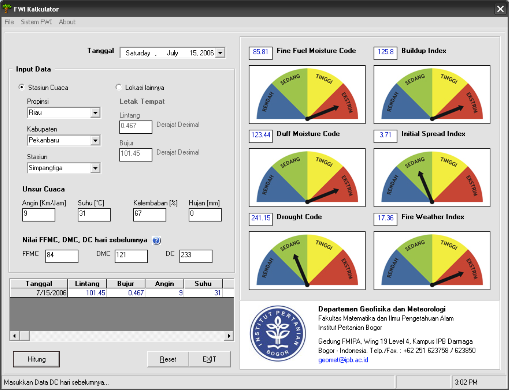

FWI Excel program add-in is a quick and easy way to calculate the fire weather index into a table in Microsoft Excel, hereinafter known as XLFWI add-ins. XLFWI add-in consists of functions worksheets for six index of fire weather index (FFMC, DMC, DC, BUI, ISI and FWI). Besides the function of this worksheet can be applied directly into the weather data that is stored in Microsoft Excel.

Calculation system is designed to easily and quickly used by the user, or can also be modified in accordance with the application. XLFWI add-ins can be used for operational calculations FWI index on a single weather station, as FWI and training systems can be combined with other manufacturing excel display, such as charts and basic data analysis.

Download FWI Excel add-in [here](https://drive.google.com/file/d/1pksUS60aNB8IZoltfEZft3XddarnMbJO/view?usp=sharing).

In addition to the Excel add-ins, as part of my final research project I developed a program that can run directly to calculate the FWI. The program is written in BASIC language, and some components have been adjusted for the FWI calculations in Indonesia.

Download FWI Calculator [here](https://drive.google.com/file/d/1MBq27VT-oigwcB128JXuzKWpGGee4ARU/view?usp=sharing) (32-bit Windows program)

