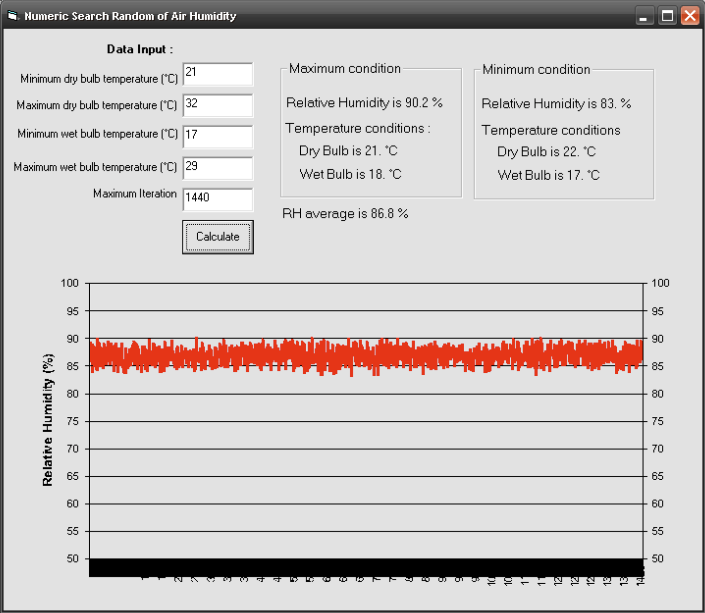

In meteorological station, air humidity measurement often use hygrometer which can give direct value in RH unit (%), but many meteorological station did not has this feature, so they use temperature measurement to calculate air humidity data.

Air humidity calculation using temperature data also give some problem about the data it self. Many meteorological stations have been recording temperature data in the minimum and maximum temperature daily only. So, if we want to know the variation of humidity every day, we might not get it, because we don't have temperature data based on the time of day (for example per hour or per ten minutes), while this data is very much needed if we are going to learn about plant micro-climatology.

To calculate air humidity from temperature data could be use below equation:

$$E_s = 6.1078 \exp\left\{\frac{17.239T_{wb}}{T_{wb}+237.3}\right\}$$

$$E_a = E_s - 0.661 (T_{db} - T_{wb})$$

$$RH = \frac{E_a}{E_s} \times 100\%$$

Where:

$E_s$ = water vapor potential (mbar)

$E_a$ = water vapor actual (mbar)

$T_{wb}$ = Temperature of wet bulb thermometer (°C)

$T_{db}$ = Temperature of dry bulb thermometer (°C)

$RH$ = Relative humidity

We need information or data about air humidity fluctuation or variation in the one-day. How much the minimum, maximum and average the air humidity in relative humidity unit (%) if we only know the maximum and minimum temperature from dry and wet bulb thermometer in one-day?

### Formulation of the problem

This problem will be solve using Numeric Search – Random Search.

Relative humidity will calculate using above equation and the temperature data will provided by four data which recorded in one day:

* Maximum dry bulb temperature: X1\_max
* Minimum dry bulb temperature: X1\_min
* Maximum wet bulb temperature: X2\_max
* Minimum wet bulb temperature: X2\_min

Generate X1 and X2 random numbers R1 :

* $X_1 = X_{1,\min} + R_i (X_{1,\max} - X_{1,\min})$
* $X_2 = X_{2,\min} + R_i (X_{2,\max} - X_{2,\min})$

Calculate the water vapor pressure by using above function:

* $E_s = 6.1078 \exp\left\{\frac{17.239 X_2}{X_2 +237.3}\right\}$
* $E_a = E_s - 0.661 (X_1 - X_2)$
* $RH = \frac{E_a}{E_s} \times 100\%$

RH calculation should be iterate base on minutes/day (1440 minutes)

Save RH as temporary solution

Compare and calculate :

Maximum RH (\* is maximum or temporary value)

* IF $RH > RH_{\max}^*$ then $RH_{\max}^* = RH$; $X_1^* = X_1$ and $X_2^* = X_2$

Minimum RH ((\* is minimum or temporary value)

IF $RH < RH_{\min}^*$ then $RH_{\min}^* = RH$; $X_1^* = X_1$ and $X_2^* = X_2$

Average RH

* $RH_{avg} = \frac{\sum RH}{\text{number of iteration}}$

### Expected result

Get the maximum, minimum and average air relative humidity and how is the maximum and minimum temperature when the value has reached.

### Finding the optimal value

Fluctuation of air humidity that represent by relative humidity could be used in the microclimate condition on certain site. For example, if we have crop plantation we need information on potential water needed and photosynthesis rate of plant that could be estimated from transpiration rate, while transpiration process (dilatation) is determined by air humidity. So once we are able to identify maximum, minimum and average RH we can also identify stomata activity and potential photosynthesis daily.

### Solving the problem

Visual Basic 6 used to solve above problem. For example, the data as input is :

* Maximum dry bulb temperature is 32°C
* Minimum dry bulb temperature is 21°C
* Maximum wet bulb temperature is 29°C
* Minimum wet bulb tempereture is 17°C

Number of iteration is 1440 (same as number of minutes/day)

::: {.callout-note collapse="true" title="Visual BASIC 6 - random search for daily RH range"}
```vb
'+++++++++++++++++++++++++++++++++++++++++++++++++++++++++++++++++
' Numerical random search for the daily range of relative humidity
'
' Draws random dry-bulb and wet-bulb temperatures between the
' recorded daily minimum and maximum, computes RH for each draw,
' and keeps the highest, lowest and mean value found.
'
' Benny Istanto, August 2006
'+++++++++++++++++++++++++++++++++++++++++++++++++++++++++++++++++

Option Explicit

'--- Magnus/Tetens coefficients for saturation vapour pressure -----
Private Const MAGNUS_A As Double = 6.108     ' mbar
Private Const MAGNUS_B As Double = 17.27
Private Const MAGNUS_C As Double = 237.3     ' degC

' Psychrometric constant, mbar per degC
Private Const PSYCHROMETRIC As Double = 0.661

' Written next to the executable. Change to suit your own setup.
Private Const OUTPUT_FILE As String = "rh_random_search.csv"


Private Sub cmdRun_Click()

    Dim dryBulbMin   As Double   ' X1 min, degC
    Dim dryBulbMax   As Double   ' X1 max, degC
    Dim wetBulbMin   As Double   ' X2 min, degC
    Dim wetBulbMax   As Double   ' X2 max, degC
    Dim iterations   As Long

    Dim dryBulb      As Double   ' X1 for this draw
    Dim wetBulb      As Double   ' X2 for this draw
    Dim es           As Double   ' saturation vapour pressure, mbar
    Dim ea           As Double   ' actual vapour pressure, mbar
    Dim rh           As Double   ' relative humidity, %

    Dim rhMax        As Double
    Dim rhMin        As Double
    Dim rhSum        As Double
    Dim rhMean       As Double
    Dim dryBulbAtMax As Double
    Dim wetBulbAtMax As Double
    Dim dryBulbAtMin As Double
    Dim wetBulbAtMin As Double

    Dim outputFile   As String
    Dim fileNo       As Integer
    Dim i            As Long

    '--- Read the four recorded temperatures and the iteration count
    dryBulbMin = Val(txtX1Min.Text)
    dryBulbMax = Val(txtX1Max.Text)
    wetBulbMin = Val(txtX2Min.Text)
    wetBulbMax = Val(txtX2Max.Text)
    iterations = Val(txtIterations.Text)

    If iterations < 1 Then
        MsgBox "Number of iterations must be at least 1.", vbExclamation, "Check input"
        Exit Sub
    End If

    chtRH.RowCount = iterations

    ' Seed the generator so each run explores a different sample.
    ' Remove this line if you want the same sequence every run.
    Randomize

    rhMax = 0
    rhMin = 100          ' RH cannot physically exceed 100%
    rhSum = 0

    outputFile = App.Path & "\" & OUTPUT_FILE
    fileNo = FreeFile
    Open outputFile For Output As #fileNo
    Write #fileNo, "iteration", "dry_bulb_at_max", "wet_bulb_at_max", _
                   "dry_bulb_at_min", "wet_bulb_at_min", "rh_min", "rh_max"

    For i = 1 To iterations

        '--- Draw X1 and X2 uniformly across their recorded range ---
        dryBulb = dryBulbMin + Rnd * (dryBulbMax - dryBulbMin)
        wetBulb = wetBulbMin + Rnd * (wetBulbMax - wetBulbMin)

        '--- Relative humidity for this pair -------------------------
        es = MAGNUS_A * Exp(MAGNUS_B * wetBulb / (wetBulb + MAGNUS_C))
        ea = es - PSYCHROMETRIC * (dryBulb - wetBulb)
        rh = (ea / es) * 100

        '--- Keep the wettest draw so far ----------------------------
        If rh > rhMax Then
            rhMax = rh
            dryBulbAtMax = dryBulb
            wetBulbAtMax = wetBulb
        End If

        '--- Keep the driest draw so far -----------------------------
        If rh < rhMin Then
            rhMin = rh
            dryBulbAtMin = dryBulb
            wetBulbAtMin = wetBulb
        End If

        rhSum = rhSum + rh

        chtRH.Row = i
        chtRH.RowLabel = i
        chtRH.Data = rh

        Write #fileNo, i, dryBulbAtMax, wetBulbAtMax, _
                       dryBulbAtMin, wetBulbAtMin, rhMin, rhMax

    Next i

    Close #fileNo

    rhMean = rhSum / iterations

    lblRHmax.Caption = "Relative Humidity is " & Format(rhMax, "##.#") & " %"
    lblX1AtMax.Caption = "Dry Bulb is " & Format(dryBulbAtMax, "##.#") & " " & Chr(176) & "C"
    lblX2AtMax.Caption = "Wet Bulb is " & Format(wetBulbAtMax, "##.#") & " " & Chr(176) & "C"

    lblRHmin.Caption = "Relative Humidity is " & Format(rhMin, "##.#") & " %"
    lblX1AtMin.Caption = "Dry Bulb is " & Format(dryBulbAtMin, "##.#") & " " & Chr(176) & "C"
    lblX2AtMin.Caption = "Wet Bulb is " & Format(wetBulbAtMin, "##.#") & " " & Chr(176) & "C"

    lblRHavg.Caption = "RH average is " & Format(rhMean, "##.#") & " %"

End Sub
```
:::