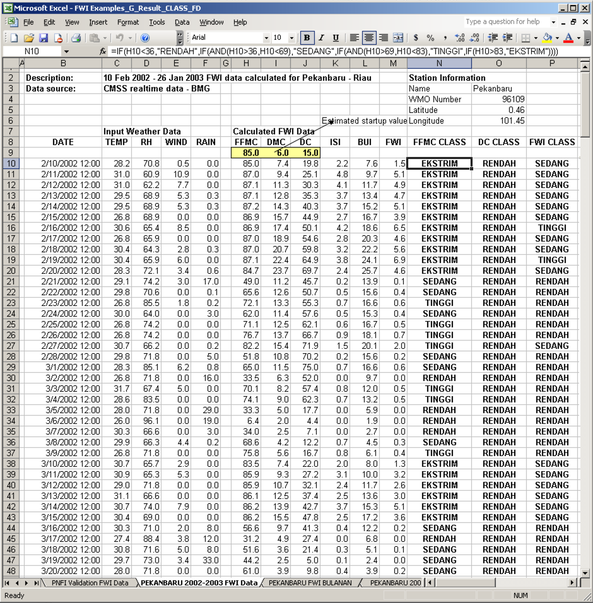
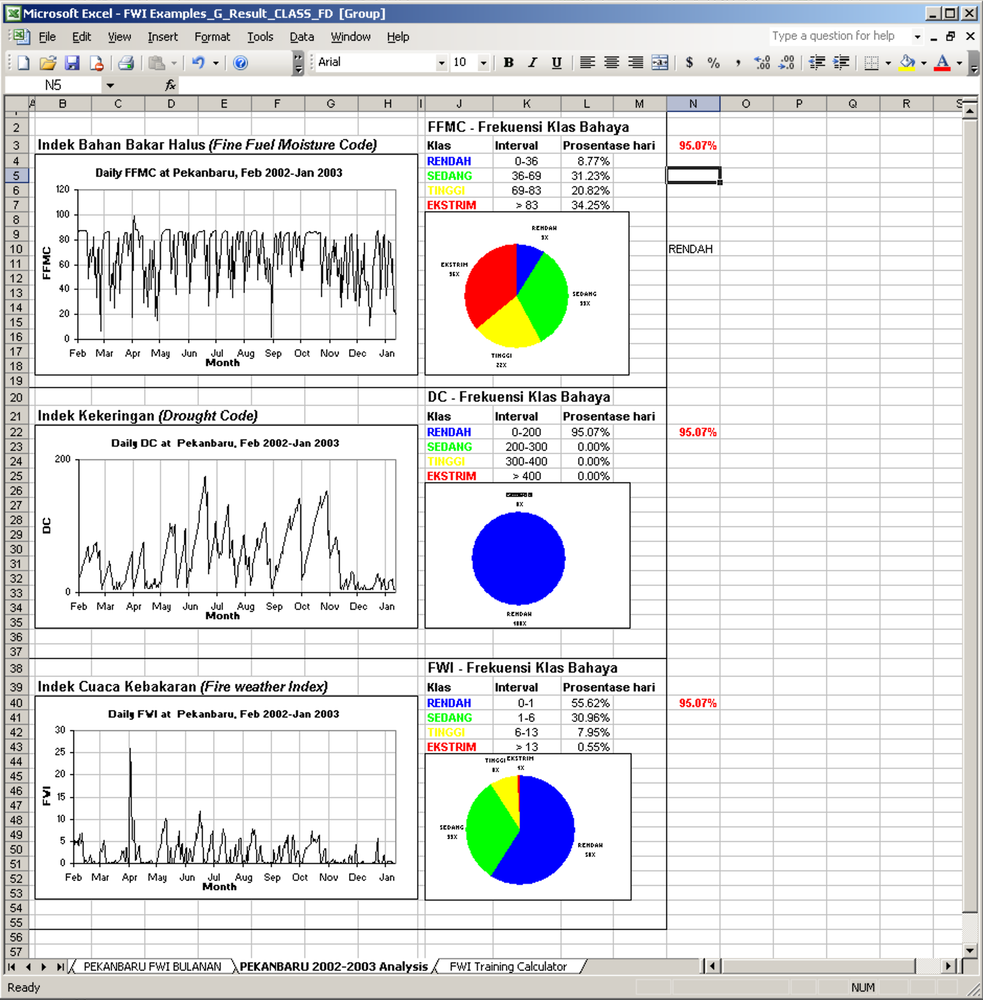
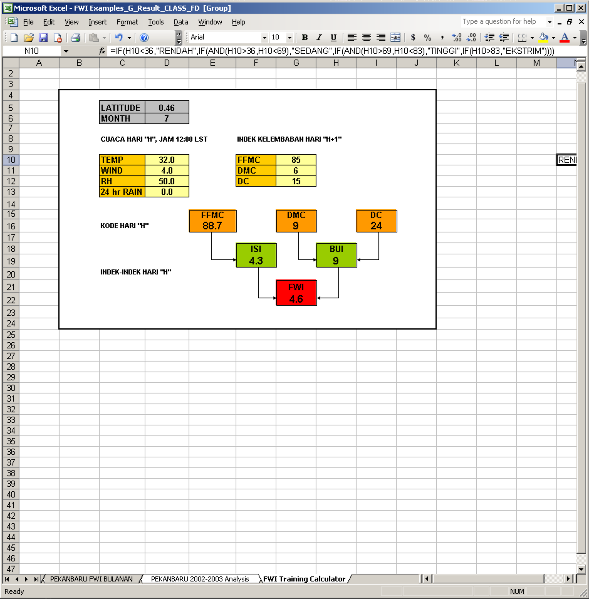
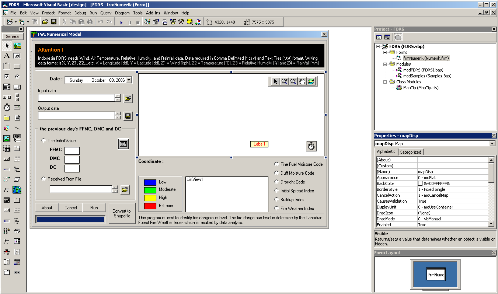

LAPAN secara rutin melakukan pemantauan Sistem Peringkat Bahaya Kebakaran (SPBK/FDRS - Fire Danger Rating System) berbasis data satelit. SPBK tersebut mengacu pada sistem Fire Weather Index ([FWI](https://cwfis.cfs.nrcan.gc.ca/en_CA/background/summary/fwi)) yang dibuat oleh Canada.

Sistem FWI membutuhkan masukan beberapa variabel cuaca harian: curah hujan, suhu udara, kelembaban relatif dan kecepatan angin. Untuk mendapatkan semua data tersebut, LAPAN memanfaatkan luaran dari [NOAA-16](https://en.wikipedia.org/wiki/NOAA-16), [QMORPH](https://www.cpc.ncep.noaa.gov/products/janowiak/cmorph_description.html) dan [TXLAPS](http://www.bom.gov.au/australia/charts/viewer/?IDCODE=IDYTX003.10M.000), dan menggunakan XLFWI addins (sistem yang sama digunakan oleh BMKG) yang berjalan di Microsoft Excel untuk menghitung FWI.

Semua data yang dihasilkan disimpan dalam bentuk file teks XYZ (1 file, 1 variabel cuaca, 1 hari), untuk memudahkan proses analisis, query dan penyimpanan.

::: {.image-gallery}
::: {.gallery-item}

:::
::: {.gallery-item}

:::
::: {.gallery-item}

:::
:::

Tugas pertama yang saya kerjakan ketika pertama kali bergabung sebagai asisten peneliti di bidang Pemantauan Sumber Daya Alam dan Lingkungan (PSDAL) - LAPAN adalah melakukan modifikasi [GISFORESTFIRE](/works/projects/2006-gisforestfire) (sistem yang saya buat ketika melakukan tugas akhir di LAPAN dan SEAMEO BIOTROP) menjadi sebuah aplikasi yang simpel dan ringan yang dapat membaca, menganalisis dan visualisasi data teks yang dibuat LAPAN untuk menghitung FWI.

Aplikasi ini hanya menggunakan 1 form, 2 modules dan 1 class modules. Saya berencana untuk menulis laporan tentang proses pembuatannya, dan mengirimkannya ke Pertemuan Ilmiah Tahunan (PIT) - Masyarakat Ahli Penginderaan Jauh ([MAPIN](https://mapin.or.id)) yang akan dilaksanakan bulan depan di Bandung.




::: {.callout-note collapse="true" title="Code untuk frmNumerik (Numerik.frm)"}
```vb
'+++++++++++++++++++++++++++++++++++++++++++++++++++++++++++++++++
' Indonesia Fire Danger Rating System [Indonesia - FDRS]
'+++++++++++++++++++++++++++++++++++++++++++++++++++++++++++++++++
'
' developed by
'
' Benny Istanto
' bennyistanto@yahoo.co.uk
'
' Department of Geophysics and Meteorology
' Faculty of Mathematics and Natural Sciences
' Bogor Agricultural University
' Gedung FMIPA, Jl.Meranti, Darmaga Campus
' Bogor - Indonesia
'+++++++++++++++++++++++++++++++++++++++++++++++++++++++++++++++++

Private BarState As String

Dim pt As New MapObjects2.Point
Dim desc As New TableDesc
Dim Peta As String
Dim ConnPath As String
Dim lyrname As String
Dim DeCon As New DataConnection
Dim gds As MapObjects2.GeoDataset
Dim InFile As String
Dim OutFile As String
Dim q As Long
Dim ii As Long
Dim DATA As String
Dim HASIL As String
Dim m_mapTip As New MapTip

Private Sub cmdAbout_Click()
'About
Dim message As String
    message = message + "Indonesia FDRS" + vbCr
    message = message + "Copyright © 2006 Benny Istanto"
    message = message + vbCr
    message = message + vbCr
    message = message + "Indonesia FDRS menyediakan cara yang mudah untuk menghitung Sistem Cuaca Kebakaran" + vbCr
    message = message + "atau yang biasa disebut Fire Weather Index [FWI]" + vbCr
    message = message + vbCr
    message = message + vbCr
    message = message + "Program dasar dari Indonesia FDRS adalah Canadian FWI System Add-In yang dikembangkan oleh   " + vbCr
    message = message + "Fire Management Systems Group of the Canadian Forest Service, Northern Forestry Centre" + vbCr
    message = message + "Edmonton, Alberta, Canada" + vbCr
    message = message + vbCr
    message = message + "For more information, please contact : " + vbCr
    message = message + "Department of Geophysics and Meteorology" + vbCr
    message = message + "Faculty of Mathematics and Natural Sciences" + vbCr
    message = message + "Bogor Agricultural University" + vbCr
    message = message + "Gedung FMIPA, Jl.Meranti, Darmaga Campus" + vbCr
    message = message + "Bogor - Indonesia" + vbCr
    message = message + vbCr
    message = message + vbCr
    message = message + "Design and script program by" + vbCr
    message = message + "Benny Istanto" + vbCr
    message = message + "             bennyistanto@yahoo.co.uk" + vbCr
    message = message + "             bennyistanto@hotmail.com" + vbCr
    message = message + vbCr
    message = message + vbCr
    MsgBox message, vbOKOnly, "About Indonesia FDRS"

End Sub

Private Sub cmdDB_Click()
'Listing code untuk memilih nama file input
    
On Error GoTo Out1
    
    txtDB.text = ""
    Dialog3.DialogTitle = "Input the previous day's FFMC, DMC, DC"
    Dialog3.InitDir = CurDir
    Dialog3.Filter = "Text Files(*.txt)|*.txt|Comma Delimited(*.csv)|*.csv|All Recognized Types|*.*|"
    Dialog3.FilterIndex = 1
    Dialog3.ShowOpen
    txtDB.text = Dialog3.FileName
    
Out1:
    Exit Sub

End Sub

Private Sub cmdRun_Click()
'Jika nilai parameter kosong
    If txtinput.text = "" Or txtoutput.text = "" Or optIV.Value = False And optFile.Value = False Then MsgBox "Please check again your input data!!", vbOKOnly, "Indonesia FDRS": GoTo finish

'Database
    DATA = txtinput.text
    IV = txtDB.text
    TemporaryFDD = App.Path & "\Temp\TemporaryFDD.csv"
    
Dim lonV!, latV!, wV!, tV!, rV!, hV!

Open DATA For Input As #22

aa = 0

While Not EOF(22)

aa = aa + 1

Input #22, lonV, latV, wV, tV, rV, hV

Wend

Close #22
    
PBar1.Visible = True
frmNumerik.MousePointer = vbHourglass
PBar1.Min = 0
PBar1.Max = aa

If optIV.Value = True Then
    
    FFMCo = txtFFMC.text
    DMCo = txtDMC.text
    DCo = txtDC.text
    
'++++++++++++++++++++++++++++++++++++++++++++++++++++++++++++++++++++++
'Memanggil Input data
'++++++++++++++++++++++++++++++++++++++++++++++++++++++++++++++++++++++
    Open DATA For Input As #1
    Open TemporaryFDD For Output As #2
    
    GG = 0
    
    While Not EOF(1)
     
    Input #1, Longitude, Latitude, Wind, Ta, RH, Rain
    
    GG = GG + 1
    
    PBar1.Value = GG
    
    '++++++++++++++++++++++++++++++++++++++++++++++++++++++++++++++++++++++
    'Menghitung FFMC
    Call spbkFFMC
    
    '++++++++++++++++++++++++++++++++++++++++++++++++++++++++++++++++++++++
    'Menghitung DMC
    Call spbkDMC
    
    '++++++++++++++++++++++++++++++++++++++++++++++++++++++++++++++++++++++
    'Menghitung DC
    Call spbkDC
    
    Write #2, Longitude, Latitude, Wind, Ta, RH, Rain, FFMC, Class_FFMC, DMC, Class_DMC, DC, Class_DC
    
    Wend
    
    Close #2
    Close #1

End If

If optFile.Value = True Then
    
'++++++++++++++++++++++++++++++++++++++++++++++++++++++++++++++++++++++
'Memanggil Input data
'++++++++++++++++++++++++++++++++++++++++++++++++++++++++++++++++++++++
    Open DATA For Input As #1
    Open IV For Input As #2
    Open TemporaryFDD For Output As #3
    
    HH = 0
    
    While Not EOF(1)
       
    Input #1, Longitude, Latitude, Wind, Ta, RH, Rain
    Input #2, Longitude, Latitude, Angin, Suhu, Kelembaban, Hujan, FFMCo, Kelas_FFMC, DMCo, Kelas_DMC, DCo, Kelas_DC, ISIo, Kelas_ISI, BUIo, Kelas_BUI, FWIo, Kelas_FWI
    
    HH = HH + 1
    PBar1.Value = HH
    
    '++++++++++++++++++++++++++++++++++++++++++++++++++++++++++++++++++++++
    'Menghitung FFMC
    Call spbkFFMC
    
    '++++++++++++++++++++++++++++++++++++++++++++++++++++++++++++++++++++++
    'Menghitung DMC
    Call spbkDMC
    
    '++++++++++++++++++++++++++++++++++++++++++++++++++++++++++++++++++++++
    'Menghitung DC
    Call spbkDC
    
    Write #3, Longitude, Latitude, Wind, Ta, RH, Rain, FFMC, Class_FFMC, DMC, Class_DMC, DC, Class_DC
    
    Wend
    
    Close #3
    Close #2
    Close #1
    
End If

Call SPBK
    
        MsgBox "Completed", vbInformation + vbOKOnly, "Indonesia FDRS"

    frmNumerik.MousePointer = vbDefault
    frmNumerik.Caption = "FWI Numerical Model"
    cmdConvert.Enabled = True
    PBar1.Visible = False
    
finish:
    
End Sub

Public Sub SPBK()
'Database
    TemporaryFDD = App.Path & "\Temp\TemporaryFDD.csv"
    TemporaryIB = App.Path & "\Temp\TemporaryIB.csv"
    
'++++++++++++++++++++++++++++++++++++++++++++++++++++++++++++++++++++++
    'Memanggil Input data
    '++++++++++++++++++++++++++++++++++++++++++++++++++++++++++++++++++++++
    Open TemporaryFDD For Input As #4
    Open TemporaryIB For Output As #5
    
    DD = 0
    
    While Not EOF(4)
    
    Input #4, Longitude, Latitude, Wind, Ta, RH, Rain, FFMC, Class_FFMC, DMC, Class_DMC, DC, Class_DC
    
    DD = DD + 1
    PBar1.Value = DD
    
    '++++++++++++++++++++++++++++++++++++++++++++++++++++++++++++++++++++++
    'Menghitung ISI
    Call spbkISI
    
    '++++++++++++++++++++++++++++++++++++++++++++++++++++++++++++++++++++++
    'Menghitung BUI
    Call spbkBUI
    
    Write #5, Longitude, Latitude, Wind, Ta, RH, Rain, FFMC, Class_FFMC, DMC, Class_DMC, DC, Class_DC, ISI, Class_ISI, BUI, Class_BUI
    
    Wend
    
    Close #5
    Close #4


'Database
    TemporaryIB = App.Path & "\Temp\TemporaryIB.csv"
    HASIL = txtoutput.text
    
    '++++++++++++++++++++++++++++++++++++++++++++++++++++++++++++++++++++++
    'Memanggil Input data
    '++++++++++++++++++++++++++++++++++++++++++++++++++++++++++++++++++++++
    Open TemporaryIB For Input As #6
    Open HASIL For Output As #7
    
    EE = 0
    
    While Not EOF(6)
    
    Input #6, Longitude, Latitude, Wind, Ta, RH, Rain, FFMC, Class_FFMC, DMC, Class_DMC, DC, Class_DC, ISI, Class_ISI, BUI, Class_BUI
    
    EE = EE + 1
    PBar1.Value = EE
    
    '++++++++++++++++++++++++++++++++++++++++++++++++++++++++++++++++++++++
    'Menghitung FWI
    Call spbkFWI
    
    Write #7, Longitude, Latitude, Wind, Ta, RH, Rain, FFMC, Class_FFMC, DMC, Class_DMC, DC, Class_DC, ISI, Class_ISI, BUI, Class_BUI, FWI, Class_FWI
    
    Wend
    
    Close #7
    Close #6

End Sub

Private Sub Form_Load()
'Posisi form
    Me.Top = 0
    Me.Left = 0
    Me.Height = 8220
    Me.Width = 12195
    
    optIV.Value = False
    optFile.Value = False
    txtFFMC.Enabled = False
    txtDMC.Enabled = False
    txtDC.Enabled = False
    txtDB.Enabled = False
    cmdDB.Enabled = False
    cmdConvert.Enabled = False
    PBar1.Visible = False
    optFFMC.Enabled = False
    optDMC.Enabled = False
    optDC.Enabled = False
    optISI.Enabled = False
    optBUI.Enabled = False
    optFWI.Enabled = False
    
    frmNumerik.Caption = "FWI Numerical Model"
    
    'Layer0 - Poly
    ConnPath = App.Path & "\ShpFile"
    lyrname = "indonesia.shp": AddVectorLayer lyrname, ConnPath
    
    'Properties
    mapDisp.Layers(lyrname).Symbol.Style = moSolidFill
    mapDisp.Layers(lyrname).Symbol.Color = RGB(220, 255, 220)
    
    ' initialize the listview columns
    Set Col = ListView1.ColumnHeaders.Add()
    Col.text = "Field"
    Set Col = ListView1.ColumnHeaders.Add()
    Col.text = "Value"
    
    ' initialize the MapTip class
    m_mapTip.Initialize mapDisp, tmrToolTip, picToolTip, lblToolTip
    m_mapTip.SetLayer mapDisp.Layers(lyrname), "KABUPATEN"
    
    'setting otomatis tanggal hari ini
    dt.Value = Date
    dt_Click
    dt_Change
    
End Sub

Private Sub dt_Change()
'Mengatur julian date
    dTahun = dt.Year
    dBulan = dt.Month
    dTanggal = dt.Day
    Tanggal = Format(dt.Value, "dd mmm yyyy")
    Tgl = Format(dt.Value, "ddmmyyyy")
    JulianDate = Format(Tanggal, "y")
    Bulan = dBulan - 1

End Sub

Private Sub dt_Click()
'Mengatur julian date
    dTahun = dt.Year
    dBulan = dt.Month
    dTanggal = dt.Day
    Tanggal = Format(dt.Value, "dd mmm yyyy")
    Tgl = Format(dt.Value, "ddmmyyyy")
    JulianDate = Format(Tanggal, "y")
    Bulan = dBulan - 1

End Sub

Private Sub cmdCancel_Click()
'Mengakhiri model
    pilihan = MsgBox("Are you sure you want to exit?", vbInformation + vbYesNo + vbDefaultButton1, "Indonesia FDRS")
    If pilihan = vbYes Then End
    If pilihan = vbNo Then frmNumerik.Show
    
End Sub

Private Sub cmdinput_Click()
'Listing code untuk memilih nama file input
    
On Error GoTo Out1
    
    txtinput.text = ""
    Dialog1.DialogTitle = "Input Weather Data "
    Dialog1.InitDir = CurDir
    Dialog1.Filter = "Text Files (*.txt)|*.txt|Comma Delimited (*.csv)|*.csv|All Recognized Types|*.*|"
    Dialog1.FilterIndex = 2
    Dialog1.ShowOpen
    txtinput.text = Dialog1.FileName
    
Out1:
    Exit Sub
    
End Sub

Private Sub cmdoutput_Click()
'Listing code untuk memilih nama file input
    
On Error GoTo Out1
    
    txtoutput.text = ""
    Dialog2.DialogTitle = "Output FDRS Data "
    Dialog2.InitDir = CurDir
    Dialog2.Filter = "Text Files (*.txt)|*.txt|Comma Delimited (*.csv)|*.csv|All Recognized Types|*.*|"
    Dialog2.FilterIndex = 1
    Dialog2.ShowSave
    txtoutput.text = Dialog2.FileName
    
Out1:
    Exit Sub
    
End Sub

Private Sub mapDisp_MouseMove(Button As Integer, Shift As Integer, x As Single, y As Single)
'This procedure updates the coordinate display in the status bar.
  Dim curPoint As Point
  Dim curX As Double
  Dim curY As Double
  
  'Convert screen coordinates to map coordinates
  Set curPoint = mapDisp.ToMapPoint(x, y)
  curX = curPoint.x
  curY = curPoint.y
  
  'If map coordinates are large, suppress digits to right of decimal place.
  Dim cX As String, cy As String
  cX = curX
  cy = curY
  cX = Left(cX, InStr(cX, ".") + 2)
  cy = Left(cy, InStr(cy, ".") + 2)
  Label1.Caption = "X: " & cX & "  Y: " & cy
  m_mapTip.MouseMove x, y

End Sub

Private Sub tmrToolTip_Timer()
'map tip
  m_mapTip.Timer

End Sub

Private Sub optBUI_Click()
'legenda bui
    Setting_Legenda

End Sub

Private Sub optDC_Click()
'legenda dc
    Setting_Legenda

End Sub

Private Sub optDMC_Click()
'legenda dmc
    Setting_Legenda

End Sub

Private Sub optFFMC_Click()
'legenda ffmc
    Setting_Legenda
    
End Sub

Private Sub optFile_Click()
Dim message As String
    message = message + "Please browse the previous day's FFMC, DMC and DC" + vbCr
    message = message + vbCr
    MsgBox message, vbOKOnly, "Indonesia FDRS"

'Option previous initial value
    txtDB.Enabled = True
    cmdDB.Enabled = True
    txtFFMC.Enabled = False
    txtDMC.Enabled = False
    txtDC.Enabled = False

End Sub

Private Sub optFWI_Click()
'legenda fwi
    Setting_Legenda

End Sub

Private Sub optISI_Click()
'legenda isi
    Setting_Legenda

End Sub

Private Sub optIV_Click()
Dim message As String
    message = message + "Please type your initial value for FFMC, DMC and DC" + vbCr
    message = message + vbCr
    message = message + "for example:" + vbCr
    message = message + "Initial value for FFMC = 85" + vbCr
    message = message + "Initial value for DMC =  6" + vbCr
    message = message + "Initial value for DC = 15" + vbCr
    message = message + vbCr
    MsgBox message, vbOKOnly, "Indonesia FDRS"

'Option previous initial value
    txtDB.Enabled = False
    cmdDB.Enabled = False
    txtFFMC.Enabled = True
    txtDMC.Enabled = True
    txtDC.Enabled = True
    
End Sub

Private Sub cmdConvert_Click()
'Output shape file, where points from infile to be added.

    OutFile = "FDRS_" & dt.Day & "_" & dt.Month & "_" & dt.Year & ".shp"

'mousepointer
    Me.MousePointer = vbHourglass
    
'Input data
    InFile = Dialog2.FileName
    Me.Caption = "Searching data..."

newemptyshape

    Me.Caption = "Add Vector Layer..."

If GetLyrIndex(OutFile) <> -1 Then mapDisp.Layers.Remove GetLyrIndex(OutFile)

'Point
    ConnPath = App.Path & "\ShpFile"
    lyrname = OutFile: AddVectorLayer lyrname, ConnPath

'Properties
    mapDisp.Layers(lyrname).Symbol.Color = moRed
    mapDisp.Layers(lyrname).Symbol.OutlineColor = moRed
    mapDisp.Layers(lyrname).Symbol.Style = moSquareMarker
    mapDisp.Layers(lyrname).Symbol.Size = 2

    Me.Caption = "Load Data..."

aaa:

    If mapDisp.Layers(lyrname).Records.Updatable Then
        LoadFromText InFile
    Else
        GoTo aaa
    End If

    mapDisp.Layers(lyrname).Records.StopEditing

    mapDisp.Layers.Remove GetLyrIndex(OutFile)

loadshapefile

'Map full extent
    mapDisp.Extent = mapDisp.FullExtent

    Me.Caption = "FWI Numerical Model"

'mousepointer
    Me.MousePointer = vbDefault

'legend
    optFFMC.Enabled = True
    optDMC.Enabled = True
    optDC.Enabled = True
    optISI.Enabled = True
    optBUI.Enabled = True
    optFWI.Enabled = True
    optFFMC.Value = True
    optDMC.Value = False
    optDC.Value = False
    optISI.Value = False
    optBUI.Value = False
    optFWI.Value = False
    
End Sub

Private Sub newemptyshape()

If GetLyrIndex(OutFile) <> -1 Then mapDisp.Layers.Remove GetLyrIndex(OutFile)

TableStru

bbb:

DeCon.Database = App.Path & "\ShpFile"

If DeCon.Connect Then
    Set gds = DeCon.AddGeoDataset(OutFile, moShapeTypePoint, desc)
Else
    'MsgBox "Bad dataConnection!"
    GoTo bbb
End If

If gds Is Nothing Then
    'MsgBox "Failed to create new Shape file (GeoDataset)!"
    GoTo bbb
Else
    'MsgBox "OK! New empty Shape file created in: " & outfile
End If

'End
End Sub

Private Sub loadshapefile()

    Me.Caption = "Load Shape..."

If GetLyrIndex(OutFile) <> -1 Then mapDisp.Layers.Remove GetLyrIndex(OutFile)

'Point
    ConnPath = App.Path & "\ShpFile"
    lyrname = OutFile: AddVectorLayer lyrname, ConnPath

Setting_Legenda

End Sub

Private Sub Setting_Legenda()

Dim recs As MapObjects2.Recordset
Dim fld As MapObjects2.Field
Dim strfld As New MapObjects2.Strings
Dim vmr As New MapObjects2.ValueMapRenderer
Dim strsUniqueValues As New MapObjects2.Strings
Dim flds As MapObjects2.Fields
Dim m As Double
Dim XYZ As MapLayer
  
Set XYZ = mapDisp.Layers(lyrname)
   
If optFFMC.Value = True Then

        Set recs = XYZ.Records
                    m = 0
                
                While Not recs.EOF
                 
                    m = m + 1
        
        Set fld = recs.Fields("Class_FFMC")
                 
                    strfld.Add recs.Fields("Class_FFMC").Value
                    recs.MoveNext
                 
                Wend
        
        Set XYZ.Renderer = vmr
        
                vmr.SymbolType = XYZ.Symbol.SymbolType
                vmr.Field = "Class_FFMC"
                vmr.ValueCount = strfld.Count
        
                For K = 0 To vmr.ValueCount - 1
            
                    vmr.Value(K) = strfld(K)
                    vmr.Symbol(K).Outline = False
                    
                    If vmr.Value(K) = "Low" Then vmr.Symbol(K).Color = &HFF0000
                    If vmr.Value(K) = "Low" Then vmr.Symbol(K).OutlineColor = &HFF0000
                    If vmr.Value(K) = "Moderate" Then vmr.Symbol(K).Color = &HFF00&
                    If vmr.Value(K) = "Moderate" Then vmr.Symbol(K).OutlineColor = &HFF00&
                    If vmr.Value(K) = "High" Then vmr.Symbol(K).Color = &HFFFF&
                    If vmr.Value(K) = "High" Then vmr.Symbol(K).OutlineColor = &HFFFF&
                    If vmr.Value(K) = "Extreme" Then vmr.Symbol(K).Color = &HFF&
                    If vmr.Value(K) = "Extreme" Then vmr.Symbol(K).OutlineColor = &HFF&
                    
                Next K
                
                mapDisp.Refresh
                ScaleBar1.Refresh
                
End If

If optDMC.Value = True Then

        Set recs = XYZ.Records
                    m = 0
                
                While Not recs.EOF
                 
                    m = m + 1
        
        Set fld = recs.Fields("Class_DMC")
                 
                    strfld.Add recs.Fields("Class_DMC").Value
                    recs.MoveNext
                 
                Wend
        
        Set XYZ.Renderer = vmr
        
                vmr.SymbolType = XYZ.Symbol.SymbolType
                vmr.Field = "Class_DMC"
                vmr.ValueCount = strfld.Count
        
                For K = 0 To vmr.ValueCount - 1
            
                    vmr.Value(K) = strfld(K)
                    vmr.Symbol(K).Outline = False
                    
                    If vmr.Value(K) = "Low" Then vmr.Symbol(K).Color = &HFF0000
                    If vmr.Value(K) = "Low" Then vmr.Symbol(K).OutlineColor = &HFF0000
                    If vmr.Value(K) = "Moderate" Then vmr.Symbol(K).Color = &HFF00&
                    If vmr.Value(K) = "Moderate" Then vmr.Symbol(K).OutlineColor = &HFF00&
                    If vmr.Value(K) = "High" Then vmr.Symbol(K).Color = &HFFFF&
                    If vmr.Value(K) = "High" Then vmr.Symbol(K).OutlineColor = &HFFFF&
                    If vmr.Value(K) = "Extreme" Then vmr.Symbol(K).Color = &HFF&
                    If vmr.Value(K) = "Extreme" Then vmr.Symbol(K).OutlineColor = &HFF&
                    
                Next K
                
                mapDisp.Refresh
                ScaleBar1.Refresh
                
End If

If optDC.Value = True Then

        Set recs = XYZ.Records
                    m = 0
                
                While Not recs.EOF
                 
                    m = m + 1
        
        Set fld = recs.Fields("Class_DC")
                 
                    strfld.Add recs.Fields("Class_DC").Value
                    recs.MoveNext
                 
                Wend
        
        Set XYZ.Renderer = vmr
        
                vmr.SymbolType = XYZ.Symbol.SymbolType
                vmr.Field = "Class_DC"
                vmr.ValueCount = strfld.Count
        
                For K = 0 To vmr.ValueCount - 1
            
                    vmr.Value(K) = strfld(K)
                    vmr.Symbol(K).Outline = False
                    
                    If vmr.Value(K) = "Low" Then vmr.Symbol(K).Color = &HFF0000
                    If vmr.Value(K) = "Low" Then vmr.Symbol(K).OutlineColor = &HFF0000
                    If vmr.Value(K) = "Moderate" Then vmr.Symbol(K).Color = &HFF00&
                    If vmr.Value(K) = "Moderate" Then vmr.Symbol(K).OutlineColor = &HFF00&
                    If vmr.Value(K) = "High" Then vmr.Symbol(K).Color = &HFFFF&
                    If vmr.Value(K) = "High" Then vmr.Symbol(K).OutlineColor = &HFFFF&
                    If vmr.Value(K) = "Extreme" Then vmr.Symbol(K).Color = &HFF&
                    If vmr.Value(K) = "Extreme" Then vmr.Symbol(K).OutlineColor = &HFF&
                    
                Next K
                
                mapDisp.Refresh
                ScaleBar1.Refresh

End If

If optISI.Value = True Then

        Set recs = XYZ.Records
                    m = 0
                
                While Not recs.EOF
                 
                    m = m + 1
        
        Set fld = recs.Fields("Class_ISI")
                 
                    strfld.Add recs.Fields("Class_ISI").Value
                    recs.MoveNext
                 
                Wend
        
        Set XYZ.Renderer = vmr
        
                vmr.SymbolType = XYZ.Symbol.SymbolType
                vmr.Field = "Class_ISI"
                vmr.ValueCount = strfld.Count
        
                For K = 0 To vmr.ValueCount - 1
            
                    vmr.Value(K) = strfld(K)
                    vmr.Symbol(K).Outline = False
                    
                    If vmr.Value(K) = "Low" Then vmr.Symbol(K).Color = &HFF0000
                    If vmr.Value(K) = "Low" Then vmr.Symbol(K).OutlineColor = &HFF0000
                    If vmr.Value(K) = "Moderate" Then vmr.Symbol(K).Color = &HFF00&
                    If vmr.Value(K) = "Moderate" Then vmr.Symbol(K).OutlineColor = &HFF00&
                    If vmr.Value(K) = "High" Then vmr.Symbol(K).Color = &HFFFF&
                    If vmr.Value(K) = "High" Then vmr.Symbol(K).OutlineColor = &HFFFF&
                    If vmr.Value(K) = "Extreme" Then vmr.Symbol(K).Color = &HFF&
                    If vmr.Value(K) = "Extreme" Then vmr.Symbol(K).OutlineColor = &HFF&
                    
                Next K
                
                mapDisp.Refresh
                ScaleBar1.Refresh

End If

If optBUI.Value = True Then

        Set recs = XYZ.Records
                    m = 0
                
                While Not recs.EOF
                 
                    m = m + 1
        
        Set fld = recs.Fields("Class_BUI")
                 
                    strfld.Add recs.Fields("Class_BUI").Value
                    recs.MoveNext
                 
                Wend
        
        Set XYZ.Renderer = vmr
        
                vmr.SymbolType = XYZ.Symbol.SymbolType
                vmr.Field = "Class_BUI"
                vmr.ValueCount = strfld.Count
        
                For K = 0 To vmr.ValueCount - 1
            
                    vmr.Value(K) = strfld(K)
                    vmr.Symbol(K).Outline = False
                    
                    If vmr.Value(K) = "Low" Then vmr.Symbol(K).Color = &HFF0000
                    If vmr.Value(K) = "Low" Then vmr.Symbol(K).OutlineColor = &HFF0000
                    If vmr.Value(K) = "Moderate" Then vmr.Symbol(K).Color = &HFF00&
                    If vmr.Value(K) = "Moderate" Then vmr.Symbol(K).OutlineColor = &HFF00&
                    If vmr.Value(K) = "High" Then vmr.Symbol(K).Color = &HFFFF&
                    If vmr.Value(K) = "High" Then vmr.Symbol(K).OutlineColor = &HFFFF&
                    If vmr.Value(K) = "Extreme" Then vmr.Symbol(K).Color = &HFF&
                    If vmr.Value(K) = "Extreme" Then vmr.Symbol(K).OutlineColor = &HFF&
                    
                Next K
                
                mapDisp.Refresh
                ScaleBar1.Refresh

End If

If optFWI.Value = True Then

        Set recs = XYZ.Records
                    m = 0
                
                While Not recs.EOF
                 
                    m = m + 1
        
        Set fld = recs.Fields("Class_FWI")
                 
                    strfld.Add recs.Fields("Class_FWI").Value
                    recs.MoveNext
                 
                Wend
        
        Set XYZ.Renderer = vmr
        
                vmr.SymbolType = XYZ.Symbol.SymbolType
                vmr.Field = "Class_FWI"
                vmr.ValueCount = strfld.Count
        
                For K = 0 To vmr.ValueCount - 1
            
                    vmr.Value(K) = strfld(K)
                    vmr.Symbol(K).Outline = False
                    
                    If vmr.Value(K) = "Low" Then vmr.Symbol(K).Color = &HFF0000
                    If vmr.Value(K) = "Low" Then vmr.Symbol(K).OutlineColor = &HFF0000
                    If vmr.Value(K) = "Moderate" Then vmr.Symbol(K).Color = &HFF00&
                    If vmr.Value(K) = "Moderate" Then vmr.Symbol(K).OutlineColor = &HFF00&
                    If vmr.Value(K) = "High" Then vmr.Symbol(K).Color = &HFFFF&
                    If vmr.Value(K) = "High" Then vmr.Symbol(K).OutlineColor = &HFFFF&
                    If vmr.Value(K) = "Extreme" Then vmr.Symbol(K).Color = &HFF&
                    If vmr.Value(K) = "Extreme" Then vmr.Symbol(K).OutlineColor = &HFF&
                    
                Next K
                
                mapDisp.Refresh
                ScaleBar1.Refresh

End If

End Sub

Private Sub TableStru()

'Set TableDesc object
With desc

    'set CodePage
    .CodePage = moAnsiCodePage

    'define three additional fields
    .FieldCount = 19

    'set the field names
    .FieldName(0) = "FID"
    .FieldName(1) = "Longitude"
    .FieldName(2) = "Latitude"
    .FieldName(3) = "Wind"
    .FieldName(4) = "Ta"
    .FieldName(5) = "RH"
    .FieldName(6) = "Rain"
    .FieldName(7) = "FFMC"
    .FieldName(8) = "Class_FFMC"
    .FieldName(9) = "DMC"
    .FieldName(10) = "Class_DMC"
    .FieldName(11) = "DC"
    .FieldName(12) = "Class_DC"
    .FieldName(13) = "ISI"
    .FieldName(14) = "Class_ISI"
    .FieldName(15) = "BUI"
    .FieldName(16) = "Class_BUI"
    .FieldName(17) = "FWI"
    .FieldName(18) = "Class_FWI"

    'set the type of field
    .FieldType(0) = moLong
    .FieldType(1) = moLong
    .FieldType(2) = moLong
    .FieldType(3) = moLong
    .FieldType(4) = moLong
    .FieldType(5) = moLong
    .FieldType(6) = moLong
    .FieldType(7) = moLong
    .FieldType(8) = moString
    .FieldType(9) = moLong
    .FieldType(10) = moString
    .FieldType(11) = moLong
    .FieldType(12) = moString
    .FieldType(13) = moLong
    .FieldType(14) = moString
    .FieldType(15) = moLong
    .FieldType(16) = moString
    .FieldType(17) = moLong
    .FieldType(18) = moString

    'set the number of digits used in the field
    .FieldPrecision(0) = 15

    'set the number of digits to the right of the decimal point
    .FieldScale(0) = 0
    .FieldScale(1) = 6
    .FieldScale(2) = 6
    .FieldScale(3) = 6
    .FieldScale(4) = 6
    .FieldScale(5) = 6
    .FieldScale(6) = 6
    .FieldScale(7) = 6
    .FieldScale(9) = 6
    .FieldScale(11) = 6
    .FieldScale(13) = 6
    .FieldScale(15) = 6
    .FieldScale(17) = 6
    
    'set the length of a character field
    .FieldLength(1) = 50
    .FieldLength(2) = 50
    .FieldLength(3) = 50
    .FieldLength(4) = 50
    .FieldLength(5) = 50
    .FieldLength(6) = 50
    .FieldLength(7) = 50
    .FieldLength(8) = 50
    .FieldLength(9) = 50
    .FieldLength(10) = 50
    .FieldLength(11) = 50
    .FieldLength(12) = 50
    .FieldLength(13) = 50
    .FieldLength(14) = 50
    .FieldLength(15) = 50
    .FieldLength(16) = 50
    .FieldLength(17) = 50
    .FieldLength(18) = 50

End With

End Sub

Private Sub LoadFromText(Fpath As String)
'Read data
Dim TxV!, TyV!, Tz1V!, Tz2V!, Tz3V!, Tz4V!, Tz5V!, Tz6V!, Tz7V!, Tz8V!, Tz9V!, Tz10V!, Tz11V!, Tz12V!, Tz13V!, Tz14V!, Tz15V!, Tz16V!

Open Dialog2.FileName For Input As #44

ZZ = 0

While Not EOF(44)

ZZ = ZZ + 1

Input #44, TxV, TyV, Tz1V, Tz2V, Tz3V, Tz4V, Tz5V, Tz6V, Tz7V, Tz8V, Tz9V, Tz10V, Tz11V, Tz12V, Tz13V, Tz14V, Tz15V, Tz16V

Wend

Close #44

'Progressbar
    PBar1.Visible = True
    
'Keterangan loading
    Me.Caption = "Convert to Shapefile..."

Dim lyr As MapObjects2.MapLayer
Dim recs1 As MapObjects2.Recordset
Set lyr = mapDisp.Layers(lyrname)
Set recs1 = lyr.Records

Dim FN 'Free file number
Dim Tx, Ty

FN = FreeFile 'Get unused file number
Open Fpath For Input Access Read As #FN 'Open file for input.

With recs1
.AutoFlush = False

ii = 0

'Progressbar
    PBar1.Min = 0
    PBar1.Max = ZZ

Do While Not EOF(1) 'Loop until end of file.
    Input #FN, Tx, Ty, Tz1, Tz2, Tz3, Tz4, Tz5, Tz6, Tz7, Tz8, Tz9, Tz10, Tz11, Tz12, Tz13, Tz14, Tz15, Tz16 'Read data into two variables.
    pt.x = Val(Tx): pt.y = Val(Ty)

ii = ii + 1

    PBar1.Value = ii
    
'Pengisian atribut shapefile
        .AddNew
        .Fields("Shape").Value = pt
        .Fields("FID").Value = ii 'FID starts from 1
        .Fields("Longitude").Value = Tx
        .Fields("Latitude").Value = Ty
        .Fields("Wind").Value = Tz1
        .Fields("Ta").Value = Tz2
        .Fields("RH").Value = Tz3
        .Fields("Rain").Value = Tz4
        .Fields("FFMC").Value = Tz5
        .Fields("Class_FFMC").Value = Tz6
        .Fields("DMC").Value = Tz7
        .Fields("Class_DMC").Value = Tz8
        .Fields("DC").Value = Tz9
        .Fields("Class_DC").Value = Tz10
        .Fields("ISI").Value = Tz11
        .Fields("Class_ISI").Value = Tz12
        .Fields("BUI").Value = Tz13
        .Fields("Class_BUI").Value = Tz14
        .Fields("FWI").Value = Tz15
        .Fields("Class_FWI").Value = Tz16
        .Update
    
    Debug.Print "X = " & pt.x & "  Y = " & pt.y

Loop
.AutoFlush = True
End With
    
Close #FN 'Close file.

    PBar1.Visible = False
    
End Sub

Private Function GetLyrIndex(lyrname As String) As Integer
'Returns a Iayer Index of lyrname in the Layers Collection

GetLyrIndex = -1 'If there is not such a layer name in the Layers Collection
For q = 0 To mapDisp.Layers.Count - 1
    If mapDisp.Layers.Item(q).Name = lyrname Then GetLyrIndex = q
Next

End Function

Public Sub AddVectorLayer(lyr_Name As String, Conn_Path As String)

Dim gd As New MapObjects2.GeoDataset
Dim dCon As New MapObjects2.DataConnection
Dim lyr As New MapObjects2.MapLayer

dCon.Database = Conn_Path

Set lyr = New MapLayer

If dCon.Connect Then
  Set gd = dCon.FindGeoDataset(lyr_Name)
    If gd Is Nothing Then
       MsgBox ("Error opening data file")
       Exit Sub
    Else
       Set lyr.GeoDataset = gd
       If lyr.Valid Then
          mapDisp.Layers.Add lyr
       Else
          MsgBox "Invalid layer", vbCritical, "Layer error"
       End If
    End If
Else
    
    MsgBox "Unable to connect to Database", vbCritical, "Connection error"

End If

End Sub

Private Sub barDisplay_ButtonClick(ByVal Button As ComctlLib.Button)
'Toolbar
  Dim bKey As String
  bKey = Button.Key
  Call doTask(bKey)
  BarState = bKey
  
End Sub

Public Sub doTask(buttonKey As String)

'Gotta clean up some forms first...
'Icon pada mouse ketika melewati MAP
    Select Case buttonKey
      
    Case "Pointer"
      mapDisp.MousePointer = moDefault
      
    Case "Zoom in"
      mapDisp.MousePointer = moZoomIn
      
    Case "Zoom out"
        mapDisp.MousePointer = moZoomOut
    
    Case "Pan"
      mapDisp.MousePointer = moPan
    
    Case "Full Extent"
        mapDisp.Extent = mapDisp.FullExtent

    End Select

End Sub

Private Sub mapDisp_AfterTrackingLayerDraw(ByVal hDC As StdOle.OLE_HANDLE)
Select Case BarState

'Perintah di Toolbar
Case "Pointer"
      mapDisp.MousePointer = moArrow
Case "Zoom in"
    mapDisp.MousePointer = moZoomIn
Case "Zoom out"
    mapDisp.MousePointer = moZoomOut
Case "Pan"
    mapDisp.MousePointer = moPan
Case Else
    mapDisp.MousePointer = moDefault
End Select

' Set the ScaleBar's MapExtent.
With ScaleBar1.MapExtent
  .MinX = mapDisp.Extent.Left
  .MinY = mapDisp.Extent.Bottom
  .MaxX = mapDisp.Extent.Right
  .MaxY = mapDisp.Extent.Top
End With
'
' Set the ScaleBar's PageExtent.
'
With ScaleBar1.PageExtent
  .MinX = mapDisp.Left / Screen.TwipsPerPixelX
  .MinY = mapDisp.Top / Screen.TwipsPerPixelY
  .MaxX = (mapDisp.Left + mapDisp.Width) / Screen.TwipsPerPixelX

  .MaxY = (mapDisp.Top + mapDisp.Height) / Screen.TwipsPerPixelY
End With
'
' Refresh the ScaleBar after the Map has changed.
'
ScaleBar1.Refresh

End Sub

Private Sub mapDisp_MouseDown(Button As Integer, Shift As Integer, x As Single, y As Single)
'This procedure invokes the active map tool; zoom in, zoom out, pan, or other.

  Dim curRectangle As MapObjects2.Rectangle
  
'Zoom in button was pushed
  If barDisplay.Buttons("Zoom in").Value = 1 Then
    Set curRectangle = mapDisp.TrackRectangle
    Set mapDisp.Extent = curRectangle
    
'Zoom out button was pushed
    ElseIf barDisplay.Buttons("Zoom out").Value = 1 Then
    Dim Loc 'As New Point
    Set Loc = mapDisp.ToMapPoint(x, y)


    Dim MapWidth As Double, MapHeight As Double
    Set curRectangle = mapDisp.Extent
    MapWidth = mapDisp.Extent.Width
    MapHeight = mapDisp.Extent.Height
    curRectangle.Right = Loc.x + MapWidth
    curRectangle.Left = Loc.x - MapWidth
    curRectangle.Top = Loc.y + MapHeight
    curRectangle.Bottom = Loc.y - MapHeight
    Set mapDisp.Extent = curRectangle
  
  ElseIf barDisplay.Buttons("Pan").Value = 1 Then
    mapDisp.Pan
    mapDisp.TrackingLayer.Refresh True
  End If
  
  ' get the layer
  Dim XYZ As MapObjects2.MapLayer
  Dim recs As MapObjects2.Recordset
  Dim flds As MapObjects2.Fields
  Dim fld As MapObjects2.Field
  
  Set XYZ = mapDisp.Layers(lyrname)
  Set recs = XYZ.Records
  Set flds = recs.Fields
  Set fld = flds(recs)
  
  ' transform the point to map coordinates
  Set Loc = mapDisp.ToMapPoint(x, y)
  
  ' perform the search
  If XYZ.shapeType = moPolygon Then
    Set recs = XYZ.SearchShape(Loc, moPointInPolygon, "")
  Else
    Set recs = XYZ.SearchByDistance(Loc, mapDisp.ToMapDistance(100), "")
  End If
  
  ' if the search returned something, display the fields
  ' and values
  
  If Not recs.EOF Then
    ' clear out existing info
    ListView1.ListItems.Clear

    For Each fld In recs.Fields ' iterate over the fields
    Dim newItem
      Set newItem = ListView1.ListItems.Add
      newItem.text = fld.Name
      newItem.SubItems(1) = fld.ValueAsString  ' get the value
    Next fld
  End If

End Sub
```
:::


::: {.callout-note collapse="true" title="Code untuk modFDRS (FDRSI.bas)"}
```vb
'+++++++++++++++++++++++++++++++++++++++++++++++++++++++++++++++++
' Indonesia Fire Danger Rating System [Indonesia - FDRS]
'+++++++++++++++++++++++++++++++++++++++++++++++++++++++++++++++++
'
' developed by
'
' Benny Istanto
' bennyistanto@yahoo.co.uk
'
' Department of Geophysics and Meteorology
' Faculty of Mathematics and Natural Sciences
' Bogor Agricultural University
' Gedung FMIPA, Jl.Meranti, Darmaga Campus
' Bogor - Indonesia
'+++++++++++++++++++++++++++++++++++++++++++++++++++++++++++++++++

Global JulianDate
Global Tanggal
Global Tgl
Global Bulan
Global FFMCo
Global DMCo
Global DCo
Global ISIo
Global BUIo
Global FWIo
Global Longitude
Global Latitude
Global Altitude
Global Ta
Global RH
Global Rad
Global Dlen
Global Wind
Global Rain
Global Kelembaban
Global Suhu
Global Hujan
Global Angin
Global retval
Global LfN
Global LfS
Global FFMC As Double
Global Class_FFMC As String
Global Kelas_FFMC As String
Global DMC As Double
Global Class_DMC As String
Global Kelas_DMC As String
Global DC As Double
Global Class_DC As String
Global Kelas_DC As String
Global BUI As Double
Global Class_BUI As String
Global Kelas_BUI As String
Global ISI As Double
Global Class_ISI As String
Global Kelas_ISI As String
Global FWI As Double
Global Class_FWI As String
Global Kelas_FWI As String
Global TemporaryFDD
Global TemporaryIB
Global hari As Double
Global dekl As Double
Global sinld As Double
Global cosld As Double
Global sinb As Double
Global arg As Double
Global arccos As Double
Global Mo As Double
Global rf As Double
Global Mr As Double
Global Ed As Double
Global ko As Double
Global kd As Double
Global kl As Double
Global F As Double
Global m As Double
Global Ew As Double
Global kw As Double
Global re As Double
Global K As Double
Global p As Double
Global Pr As Double
Global rd As Double
Global Qo As Double
Global Qr As Double
Global V As Double
Global D As Double
Global Dr As Double
Global Lf As Double
Global fWIND As Double
Global r As Double
Global U As Double
Global fF As Double
Global fD As Double
Global B As Double
Global S As Double
Global GG As Integer
Global HH As Integer
Global DD As Integer
Global EE As Integer
Global Tsea
Global Tobs
Global Lapserate
Global Elevation
Global Tfinal


Public Sub ApplyElevationAdjustment()

Lapserate = -6.5

'Database
    DTM = App.Path & "\Temp\DTM.csv"
    
Open DTM For Input As #55

While Not EOF(55)

Input #55, Longitude, Latitude, Elevation
'Tsea = T at sea level
Tsea = Ta - (Lapserate * Elevation)
Tfinal = Tsea + (Lapserate * Elevation)

Wend

Close #55

End Sub

Public Sub spbkFFMC()

'++++++++++++++++++++++++++++++++++++++++++++++++++++++++++++
'  Nama Fungsi: FFMC
'  Deskripsi: Menghitung Fine Fuel Moisture Code hari ini
'  Parameter:
'     Ta adalah suhu udara dalam derajat celcius pada jam 12.00 LST
'     RH adalah kelembaban relatif dalam % pada jam 12.00 LST
'     Wind adalah kecepatan angin dalam km/jam pada jam 12.00 LST
'     Rain adalah akumulasi curah hujan selama 24 jam dalam mm, dihitung pada jam 12.00 LST
'     FFMCo adalah FFMC pada hari sebelumnya
'++++++++++++++++++++++++++++++++++++++++++++++++++++++++++++
    
'Dimana :
'   Mo : kandungan uap air kemarin
'   rf : curah hujan netto
'   Mr : Kandungan uap air setelah terjadi hujan
'   Ed : Titik keseimbangan kandungan air yang didapat dengan pengeringan dari atas
'   Ew : Titik keseimbangan kadar air yang ditentukan oleh pembahasan dibawah
'   ko :
'   kd : logaritma tingkat pengeringan
'   kl :
'   kw : logaritma tingkat pembasahan
'   m :

frmNumerik.Caption = "Calculating FFMC, DMC and DC..."

    Mo = 147.2 * (101 - FFMCo) / (59.5 + FFMCo)
    If (Rain > 0.5) Then
        rf = Rain - 0.5

        If (Mo <= 150) Then
           Mr = Mo + _
                42.5 * rf * (Exp(-100 / (251 - Mo))) * (1 - Exp(-6.93 / rf))

        Else
           Mr = Mo + _
                42.5 * rf * (Exp(-100 / (251 - Mo))) * (1 - Exp(-6.93 / rf)) + _
                0.0015 * (Mo - 150) ^ 2 * (rf) ^ (0.5)
        End If

        If (Mr > 250) Then
           Mr = 250
        End If

        Mo = Mr
    End If

    Ed = 0.942 * (RH) ^ (0.679) + _
         11 * Exp((RH - 100) / 10) + 0.18 * (21.1 - Ta) * (1 - Exp(-0.115 * RH))

    If (Mo > Ed) Then
        ko = 0.424 * (1 - (RH / 100) ^ 1.7) + _
              0.0694 * (Wind) ^ (0.5) * (1 - (RH / 100) ^ 8)
        kd = ko * 0.581 * Exp(0.0365 * Ta)
        m = Ed + (Mo - Ed) * (10) ^ (-kd)
    Else
        Ew = 0.618 * (RH) ^ (0.753) + _
           10 * Exp((RH - 100) / 10) + _
           0.18 * (21.1 - Ta) * (1 - Exp(-0.115 * RH))
        If (Mo < Ew) Then
           kl = 0.424 * (1 - ((100 - RH) / 100) ^ 1.7) + _
            0.0694 * ((Wind) ^ 0.5) * (1 - ((100 - RH) / 100) ^ 8)
           kw = kl * 0.581 * Exp(0.0365 * Ta)
           m = Ew - (Ew - Mo) * ((10) ^ (-kw))
        Else
           m = Mo
        End If
    End If
    FFMC = 59.5 * (250 - m) / (147.2 + m)
    
    If FFMC < 0 Then FFMC = 0
    If FFMC < 72 Then Class_FFMC = "Low"
    If FFMC >= 72 And FFMC < 77 Then Class_FFMC = "Moderate"
    If FFMC >= 77 And FFMC < 82 Then Class_FFMC = "High"
    If FFMC >= 82 Then Class_FFMC = "Extreme"
       
End Sub

Public Sub spbkDMC()

'++++++++++++++++++++++++++++++++++++++++++++++++++++++++++++
'  Nama Fungsi: DMC
'  Deskripsi: Menghitung Duff Moisture Code hari ini
'  Parameter:
'     Ta adalah suhu udara dalam derajat celcius pada jam 12.00 LST
'     RH adalah kelembaban relatif dalam % pada jam 12.00 LST
'     Rain adalah akumulasi curah hujan selama 24 jam dalam mm, dihitung pada jam 12.00 LST
'     DMCo adalah DMC pada hari sebelumnya
'     Longitude adalah bujur dalam derajat desimal dari lokasi yang dihitungis the latitude in decimal degrees of the location for which calculations are being made
'     MONTH adalah bulan dari hari perhitungan
'++++++++++++++++++++++++++++++++++++++++++++++++++++++++++++
    
Const pi = 3.1415926
    
'Dimana :
'   re = jumlah hujan netto (mm)
'   Mo = Kandungan uap air kemarin
'   Mr = kandungan uap air setelah terjadi hujan
'   K = Logaritmik Tingkat pengeringan
'   B = Koefisien
'   Pr = Kode nilai
'   Dlen = Panjang hari

frmNumerik.Caption = "Calculating FFMC, DMC and DC..."

    If (Rain > 1.5) Then
        re = 0.92 * Rain - 1.27
        Mo = 20 + Exp(5.6348 - DMCo / 43.43)
        If (DMCo <= 33) Then
           B = 100 / (0.5 + (0.3 * DMCo))
        Else
           If (DMCo <= 65) Then
              B = 14 - 1.3 * (Log(DMCo))
           Else
              B = 6.2 * Log(DMCo) - 17.2
           End If
        End If
        Mr = Mo + 1000 * re / (48.77 + (B * re))
        Pr = 244.72 - 43.43 * Log(Mr - 20)
        If (Pr > 0) Then
           DMCo = Pr
        Else
           DMCo = 0
        End If
    End If

'+++++++++++++++++++++++++++++++++++++++++++++++++++++++++++++++++++++
'Menghitung panjang hari
'Diadopsi dari Shierary-Weather ver 2.0 yang dikembangkan Handoko(1998)
    hari = JulianDate
    dekl = -23.4 * Cos(2 * pi * (hari + 10) / 365)
    sinld = Sin(Latitude * pi / 180) * Sin(dekl * pi / 180)
    cosld = Cos(Latitude * pi / 180) * Cos(dekl * pi / 180)
    sinb = Sin(-0.833 * pi / 180)
    arg = (sinb - sinld) / cosld
    arccos = 2 * Atn(1) - Atn(arg / Sqr(1 - arg * arg))

    Dlen = 24 / pi * arccos
'++++++++++++++++++++++++++++++++++++++++++++++++++++++++++++++++++++++

    If (Ta > -1.1) Then
        K = 1.894 * (Ta + 1.1) * (100 - RH) * Dlen * 0.000001
    Else
        K = 0
    End If
    DMC = DMCo + 100 * K

    If DMC < 0 Then DMC = 0
    If DMC < 4 Then Class_DMC = "Low"
    If DMC >= 4 And DMC < 14 Then Class_DMC = "Moderate"
    If DMC >= 14 And DMC < 29 Then Class_DMC = "High"
    If DMC >= 29 Then Class_DMC = "Extreme"

End Sub

Public Sub spbkDC()

'++++++++++++++++++++++++++++++++++++++++++++++++++++++++++++
'  Nama Fungsi: DC
'  Deskripsi: Menghitung Drought Code hari ini
'  Parameter:
'     Ta adalah suhu udara dalam derajat celcius pada jam 12.00 LST
'     Rain adalah akumulasi curah hujan selama 24 jam dalam mm, dihitung pada jam 12.00 LST
'     DCo adalah DC pada hari sebelumnya
'     Longitude adalah bujur dalam derajat desimal dari lokasi yang dihitungis the latitude in decimal degrees of the location for which calculations are being made
'     MONTH adalah bulan dari hari perhitungan
'++++++++++++++++++++++++++++++++++++++++++++++++++++++++++++
    
'Dimana:
'   rd = curah hujan efektif (mm)
'   Rain = curah hujan harian (mm)
'   Qo = ekivalen kelembaban DC
'   Qr = ekivalen kelembaban hari setelah hujan(%)
'   DCo = DC hari kemarin
'   Dr = DC hari setelah hujan
'   V = evapotranspirasi
'   Ta = suhu siang hari (°C)
'   Lf = koreksi panjang hari DC
'   D = DC

frmNumerik.Caption = "Calculating FFMC, DMC and DC..."

    If (Rain > 2.8) Then
            rd = 0.83 * (Rain) - 1.27
            Qo = 800 * Exp(-DCo / 400)
            Qr = Qo + 3.937 * rd
            Dr = 400 * Log(800 / Qr)
            If (Dr > 0) Then
               DCo = Dr
            Else
               DCo = 0
            End If
        End If
    
    Dim DryingFactor As Double
    '+++++++++++++++++++++++++++++++++++++++++++++++++
    'Menghitung DryingFactor sementara
    
        LfN = Array(1.17, 1.2, 4.5, 2.99, 2.27, 2.45, 4.13, 4.4, 5.3, 5.17, 3.12, 1.88)
        LfS = Array(4.4, 5.3, 5.17, 3.12, 1.88, 1.17, 1.2, 4.5, 2.99, 2.27, 2.45, 4.13)

            ' Use Northern hemisphere numbers
            ' something goes wrong with >=
            
                If (Latitude > 0) Then
                    retval = LfN(Bulan)
            
            ' Use Southern hemisphere numbers
            
                ElseIf (Latitude <= 0) Then
                    retval = LfS(Bulan)
                End If

        DryingFactor = retval

    Lf = DryingFactor
    '+++++++++++++++++++++++++++++++++++++++++++++++++++

    If (Ta > -2.8) Then
        V = 0.36 * (Ta + 2.8) + Lf
    Else
        V = Lf
    End If
     
    If (V < 0) Then
        V = 0
    End If
    
    D = DCo + 0.5 * V
    DC = D

    If DC < 0 Then DC = 0
    If DC < 140 Then Class_DC = "Low"
    If DC >= 140 And DC < 260 Then Class_DC = "Moderate"
    If DC >= 260 And DC < 350 Then Class_DC = "High"
    If DC >= 350 Then Class_DC = "Extreme"

End Sub

Public Sub spbkISI()

'+++++++++++++++++++++++++++++++++++++++++++++++++++++++++++++++++++++
'  Nama Fungsi: ISI
'  Deskripsi: Menghitung Initial Spread Index hari ini
'  Parameter:
'     Wind adalah kecepatan angin dalam km/jam pada jam 12.00 LST
'     FFMC adalah FFMC hari ini
'+++++++++++++++++++++++++++++++++++++++++++++++++++++++++++++++++++++

'Dimana :
'   fWIND : fungsi untuk mengetahui pengaruh angin
'           Fungsi tersebut menggandakan nilai ISI
'           untuk setiap kenaikan 14 km/jam kecepatan angin
'   m : FFMC dalam persen
'   fF : fungsi untuk FFM
'   R : 0.208 fWIND* fF = ISI
'   Wind dalam fWIND : dalam km/jam

frmNumerik.Caption = "Calculating ISI and BUI..."

    fWIND = Exp(0.05039 * Wind)
    m = 147.2 * (101 - FFMC) / (59.5 + FFMC)
    fF = 91.9 * Exp(-0.1386 * m) * (1 + (m) ^ 5.31 / 49300000)
    ISI = 0.208 * fWIND * fF

'    fWIND = exp(0.05039 * Wind)
'    m = 147.2 * (101 - FFMC) / (59.5 + FFMC)
'
'    Ny = (Abs(m)) ^ 5.31
'    If m < 0 Then Ny = -1 * Ny
'
'    fF = 91.9 * (exp(-0.1386 * m)) * (1 + Ny) / (4.93 * (10) ^ 7)
'    ISI = 0.208 * fWIND * fF

    If ISI < 0 Then ISI = 0
    If ISI < 2 Then Class_ISI = "Low"
    If ISI >= 2 And ISI < 4 Then Class_ISI = "Moderate"
    If ISI >= 4 And ISI < 5 Then Class_ISI = "High"
    If ISI >= 5 Then Class_ISI = "Extreme"
    
End Sub

Public Sub spbkBUI()

'+++++++++++++++++++++++++++++++++++++++++++++++++++++++++++++++++++++
'  Nama Fungsi: BUI
'  Deskripsi: Menghitung Buildup Index hari ini
'  Parameter:
'     DMC adalah DMC hari ini
'     DC adalah DC hari ini
'+++++++++++++++++++++++++++++++++++++++++++++++++++++++++++++++++++++

'Dimana :
'   U : BUI

frmNumerik.Caption = "Calculating ISI and BUI..."

    If (DMC <= 0.4 * DC) Then
            U = 0.8 * DMC * DC / (DMC + (0.4 * DC))
        Else
            U = DMC - ((1 - (0.8 * DC)) / (DMC + (0.4 * DC))) _
               * (0.92 + ((0.0114 * DMC) ^ 1.7))
        End If
        
        BUI = U
        
        If BUI < 0 Then BUI = 0
        If BUI < 7 Then Class_BUI = "Low"
        If BUI >= 7 And BUI < 20 Then Class_BUI = "Moderate"
        If BUI >= 20 And BUI < 33 Then Class_BUI = "High"
        If BUI >= 33 Then Class_BUI = "Extreme"
    
End Sub

Public Sub spbkFWI()

'+++++++++++++++++++++++++++++++++++++++++++++++++++++++++++++++++++++
'  Nama Fungsi: FWI
'  Deskripsi: Menghitung Fire Weather Index hari ini
'  Parameter:
'     ISI adalah ISI hari ini
'     BUI adalah BUI hari ini
'+++++++++++++++++++++++++++++++++++++++++++++++++++++++++++++++++++++

frmNumerik.Caption = "Calculating FWI..."

    If (BUI <= 80) Then
        fD = 0.626 * (((BUI) ^ 0.809) + 2)
    Else
        fD = 1000 / (25 + 108.64 * Exp(-0.023 * BUI))
    End If
    
'Persamaan terakhir mempunyai batasan yaitu ketika nilai B > 1
'maka persamaan logaritmik ini akan negative sehingga
'tidak dapat diperoleh S
'dalam kasus seperti itu, secara sederhana S dianggap sama dengan B
    
    B = 0.1 * ISI * fD
    If (B > 1) Then
        S = Exp(2.72 * (0.434 * Log(B)) ^ 0.647)
    Else
        S = B
    End If
    
    FWI = S
    
    If FWI < 0 Then FWI = 0
    If FWI < 2 Then Class_FWI = "Low"
    If FWI >= 2 And FWI < 7 Then Class_FWI = "Moderate"
    If FWI >= 7 And FWI < 13 Then Class_FWI = "High"
    If FWI >= 13 Then Class_FWI = "Extreme"

End Sub
```
:::


::: {.callout-note collapse="true" title="Code untuk modSamples (Samples.bas)"}
```vb

Option Explicit

Public Function ReturnDataPath(dataDir As String) As String
  Dim sPath As String
  Dim iLastPos As Integer
  sPath = App.Path
  iLastPos = InStrL(sPath, "\")
  ReturnDataPath = Left(sPath, iLastPos) + "..\Data\" + dataDir
End Function

Public Function InStrL(InString As String, srchString As String) As Integer
  Dim iLastPos As Integer
  If Len(srchString) Then
    Dim iCurPos As Integer
    Do
      iLastPos = iCurPos
      iCurPos = InStr(iCurPos + 1, InString, srchString, vbTextCompare)
    Loop Until iCurPos = 0
  End If
  
  InStrL = iLastPos
End Function

Public Function ConnectErrorMsg(errNum As Integer) As String
  Select Case errNum
     
     Case moNoError:                            ConnectErrorMsg = "No Error"
     Case moUnknownError:                       ConnectErrorMsg = "Unknown error"
     Case moAccessDenied:                       ConnectErrorMsg = "Access denied"
     Case moInvalidUser:                        ConnectErrorMsg = "Invalid user"
     Case moNetworkTimeout:                     ConnectErrorMsg = "Network timeout"
     Case moInvalidDatabase:                    ConnectErrorMsg = "Invalid database"
     Case moTasksExceeded:                      ConnectErrorMsg = "Tasks exceeded"
     Case moFileNotFound:                       ConnectErrorMsg = "File not found"
     Case moInvalidDirectory:                   ConnectErrorMsg = "Invalid directory"
     Case moHostUnknown:                        ConnectErrorMsg = "Unknown host"
     
     Case moSE_FAILURE:                         ConnectErrorMsg = "Unspecified SDE error."
     Case moSE_INVALID_LAYERINFO_OBJECT:        ConnectErrorMsg = "LAYERINFO pointer not initialized."
     Case moSE_NO_ANNOTATION:                   ConnectErrorMsg = "The given shape has no annotation"
     Case moSE_FINISHED:                        ConnectErrorMsg = "Stream loading of shapes finished"
     Case moSE_SDE_NOT_STARTED:                 ConnectErrorMsg = "SDE not started, cannot perform function"
     Case moSE_UNCHANGED:                       ConnectErrorMsg = "The specified shape was left unchanged"
     Case moSE_CONNECTIONS_EXCEEDED:            ConnectErrorMsg = "The number of server connections is at maximum"
     Case moSE_LOGIN_NOT_ALLOWED:               ConnectErrorMsg = "IOMGR not accepting connection requests"
     Case moSE_INVALID_USER:                    ConnectErrorMsg = "Cannot validate the specified user and password"
     Case moSE_NET_FAILURE:                     ConnectErrorMsg = "Network i/o operation failed"
     Case moSE_NET_TIMEOUT:                     ConnectErrorMsg = "Network i/o timeout"
     Case moSE_OUT_OF_SVMEM:                    ConnectErrorMsg = "Server task cannot allocate needed memory"
     Case moSE_OUT_OF_CLMEM:                    ConnectErrorMsg = "Client task cannot allocate needed memory"
     Case moSE_OUT_OF_CONTEXT:                  ConnectErrorMsg = "Function call is out of context"
     Case moSE_NO_ACCESS:                       ConnectErrorMsg = "No access to object"
     Case moSE_TOO_MANY_LAYERS:                 ConnectErrorMsg = "Exceeded max_layers in giomgr.defs."
     Case moSE_NO_LAYER_SPECIFIED:              ConnectErrorMsg = "Missing layer specification"
     Case moSE_LAYER_LOCKED:                    ConnectErrorMsg = "Specified layer is locked"
     Case moSE_LAYER_EXISTS:                    ConnectErrorMsg = "Specified layer already exists"
     Case moSE_LAYER_NOEXIST:                   ConnectErrorMsg = "Specified layer does not exist"
     Case moSE_LAYER_INUSE:                     ConnectErrorMsg = "Specified layer is use by another user"
     Case moSE_FID_NOEXIST:                     ConnectErrorMsg = "Specified shape (LAYER:FID) does not exist"
     Case moSE_FID_EXISTS:                      ConnectErrorMsg = "Specified shape (LAYER:FID) exists"
     Case moSE_LAYER_MISMATCH:                  ConnectErrorMsg = "Both layers must be the same for this"
     Case moSE_NO_PERMISSIONS:                  ConnectErrorMsg = "No permission to perform operation"
     Case moSE_INVALID_NOT_NULL:                ConnectErrorMsg = "Column has not null constraint."
     Case moSE_INVALID_SHAPE:                   ConnectErrorMsg = "Invalid shape, cannot be verified"
     Case moSE_INVALID_LAYER_NUMBER:            ConnectErrorMsg = "Map layer number out of range"
     Case moSE_INVALID_ENTITY_TYPE:             ConnectErrorMsg = "Invalid entity type"
     Case moSE_INVALID_SEARCH_METHOD:           ConnectErrorMsg = "Invalid search method"
     Case moSE_INVALID_ETYPE_MASK:              ConnectErrorMsg = "Invalid entity type mask"
     Case moSE_BIND_CONFLICT:                   ConnectErrorMsg = "BIND/SET/GET mis-match"
     Case moSE_INVALID_GRIDSIZE:                ConnectErrorMsg = "Invalid grid size"
     Case moSE_INVALID_LOCK_MODE:               ConnectErrorMsg = "Invalid lock mode"
     Case moSE_ETYPE_NOT_ALLOWED:               ConnectErrorMsg = "Entity type of shape is not allowed in layer"
     Case moSE_TOO_MANY_POINTS:                 ConnectErrorMsg = "Exceeded max points specified."
     Case moSE_TABLE_NOEXIST:                   ConnectErrorMsg = "DBMS table does not exist"
     Case moSE_ATTR_NOEXIST:                    ConnectErrorMsg = "Specified attribute column does not exist"
     Case moSE_LICENSE_FAILURE:                 ConnectErrorMsg = "Underlying license manager problem."
     Case moSE_OUT_OF_LICENSES:                 ConnectErrorMsg = "No more SDE licenses available."
     Case moSE_INVALID_COLUMN_VALUE:            ConnectErrorMsg = "Value exceeds valid range"
     Case moSE_INVALID_WHERE:                   ConnectErrorMsg = "User specified where clause is invalid"
     Case moSE_INVALID_SQL:                     ConnectErrorMsg = "User specified sql clause is invalid"
     Case moSE_LOG_NOEXIST:                     ConnectErrorMsg = "Specified log file does not exist"
     Case moSE_LOG_NOACCESS:                    ConnectErrorMsg = "Unable to access specified logfile"
     Case moSE_LOG_NOTOPEN:                     ConnectErrorMsg = "Specified logfile is not open for i/o"
     Case moSE_LOG_IO_ERROR:                    ConnectErrorMsg = "I/O error using logfile"
     Case moSE_NO_SHAPES:                       ConnectErrorMsg = "No shapes selected or used in operation"
     Case moSE_NO_LOCKS:                        ConnectErrorMsg = "No locks defined"
     Case moSE_LOCK_CONFLICT:                   ConnectErrorMsg = "Lock request conflicts with another established lock"
     Case moSE_OUT_OF_LOCKS:                    ConnectErrorMsg = "Maximum locks allowed by system are in use"
     Case moSE_DB_IO_ERROR:                     ConnectErrorMsg = "Database level i/o error occurred"
     Case moSE_STREAM_IN_PROGRESS:              ConnectErrorMsg = "Shape/fid stream not finished, can not execute"
     Case moSE_INVALID_COLUMN_TYPE:             ConnectErrorMsg = "Invalid column data type"
     Case moSE_TOPO_ERROR:                      ConnectErrorMsg = "Topological integrity error"
     Case moSE_ATTR_CONV_ERROR:                 ConnectErrorMsg = "Attribute conversion error"
     Case moSE_INVALID_COLUMN_DEF:              ConnectErrorMsg = "Invalid column definition"
     Case moSE_INVALID_SHAPE_BUF_SIZE:          ConnectErrorMsg = "Invalid shape array buffer size"
     Case moSE_INVALID_ENVELOPE:                ConnectErrorMsg = "Envelope is null, has negative values or min > max"
     Case moSE_TEMP_IO_ERROR:                   ConnectErrorMsg = "Temp file i/o error, can not open or ran out of disk"
     Case moSE_GSIZE_TOO_SMALL:                 ConnectErrorMsg = "Spatial index grid size is too small"
     Case moSE_LICENSE_EXPIRED:                 ConnectErrorMsg = "SDE run-time license has expired, no logins allowed"
     Case moSE_TABLE_EXISTS:                    ConnectErrorMsg = "DBMS table exists"
     Case moSE_INDEX_EXISTS:                    ConnectErrorMsg = "Index with the specified name already exists"
     Case moSE_INDEX_NOEXIST:                   ConnectErrorMsg = "Index with the specified name does not exist"
     Case moSE_INVALID_POINTER:                 ConnectErrorMsg = "Specified pointer value is null or invalid"
     Case moSE_INVALID_PARAM_VALUE:             ConnectErrorMsg = "Specified parameter value is invalid"
     Case moSE_ALL_SLIVERS:                     ConnectErrorMsg = "Sliver factor caused all results to be slivers"
     Case moSE_TRANS_IN_PROGRESS:               ConnectErrorMsg = "User specified transaction in progress"
     Case moSE_IOMGR_NO_DBMS_CONNECT:           ConnectErrorMsg = "The iomgr has lost its connection to the underlying DBMS."
     Case moSE_DUPLICATE_ARC:                   ConnectErrorMsg = "An arc (startpt,midpt,endpt) already exists"
     Case moSE_INVALID_ANNO_OBJECT:             ConnectErrorMsg = "SE_ANNO pointer not initialized."
     Case moSE_PT_NO_EXIST:                     ConnectErrorMsg = "Specified point does not exist in feat"
     Case moSE_PTS_NOT_ADJACENT:                ConnectErrorMsg = "Specified points must be adjacent"
     Case moSE_INVALID_MID_PT:                  ConnectErrorMsg = "Specified mid point is invalid"
     Case moSE_INVALID_END_PT:                  ConnectErrorMsg = "Specified end point is invalid"
     Case moSE_INVALID_RADIUS:                  ConnectErrorMsg = "Specified radius is invalid"
     Case moSE_LOAD_ONLY_LAYER:                 ConnectErrorMsg = "Map layer is load only mode, operation not allowed"
     Case moSE_LAYERS_NOT_FOUND:                ConnectErrorMsg = "Layers table does not exist."
     Case moSE_FILE_IO_ERROR:                   ConnectErrorMsg = "Error writing or creating an output text file."
     Case moSE_BLOB_SIZE_TOO_LARGE:             ConnectErrorMsg = "Maximum BLOB size exceeded."
     Case moSE_CORRIDOR_OUT_OF_BOUNDS:          ConnectErrorMsg = "Resulting corridor exceeds valid coordinate range"
     Case moSE_SHAPE_INTEGRITY_ERROR:           ConnectErrorMsg = "Model integrity error"
     Case moSE_NOT_IMPLEMENTED_YET:             ConnectErrorMsg = "Function or option is not really written yet."
     Case moSE_CAD_EXISTS:                      ConnectErrorMsg = "This shape has a cad."
     Case moSE_INVALID_TRANSID:                 ConnectErrorMsg = "Invalid internal SDE Transaction ID."
     Case moSE_INVALID_LAYER_NAME:              ConnectErrorMsg = "Map layer name must not be empty"
     Case moSE_INVALID_LAYER_KEYWORD:           ConnectErrorMsg = "Invalid Layer Configuration Keyword used."
     Case moSE_INVALID_RELEASE:                 ConnectErrorMsg = "Invalid Release/Version of SDE server."
     Case moSE_VERSION_TBL_EXISTS:              ConnectErrorMsg = "VERSION table exists."
     Case moSE_COLUMN_NOT_BOUND:                ConnectErrorMsg = "Column has not been bound"
     Case moSE_INVALID_INDICATOR_VALUE:         ConnectErrorMsg = "Indicator variable contains an invalid value"
     Case moSE_INVALID_CONNECTION:              ConnectErrorMsg = "The connection handle is NULL, closed or the wrong object."
     Case moSE_INVALID_DBA_PASSWORD:            ConnectErrorMsg = "The DBA password is not correct."
     Case moSE_PATH_NOT_FOUND:                  ConnectErrorMsg = "Coord path not found in shape edit op."
     Case moSE_SDEHOME_NOT_SET:                 ConnectErrorMsg = "No $SDEHOME variable set, and we need one."
     Case moSE_NOT_TABLE_OWNER:                 ConnectErrorMsg = "User must be table owner."
     Case moSE_PROCESS_NOT_FOUND:               ConnectErrorMsg = "The process ID specified does not correspond on an SDE server."
     Case moSE_INVALID_DBMS_LOGIN:              ConnectErrorMsg = "DBMS didn't accept user/password."
     Case moSE_PASSWORD_TIMEOUT:                ConnectErrorMsg = "Password received was sent > MAXTIMEDIFF seconds before."
     Case moSE_INVALID_SERVER:                  ConnectErrorMsg = "Server machine was not found"
     Case moSE_IOMGR_NOT_AVAILABLE:             ConnectErrorMsg = "IO Mgr task not started on server"
     Case moSE_SERVICE_NOT_FOUND:               ConnectErrorMsg = "No SDE entry in the /etc/services file"
     Case moSE_INVALID_STATS_TYPE:              ConnectErrorMsg = "Tried statisitics on non-numeric"
     Case moSE_INVALID_DISTINCT_TYPE:           ConnectErrorMsg = "Distinct stats on invalid type"
     Case moSE_INVALID_GRANT_REVOKE:            ConnectErrorMsg = "Invalid use of grant/revoke function"
     Case moSE_INVALID_SDEHOME:                 ConnectErrorMsg = "The supplied SDEHOME path is invalid or NULL."
     Case moSE_INVALID_STREAM:                  ConnectErrorMsg = "Stream does not exist"
     Case moSE_TOO_MANY_STREAMS:                ConnectErrorMsg = "Max number of streams exceeded"
     Case moSE_OUT_OF_MUTEXES:                  ConnectErrorMsg = "Exceeded system's max number of mutexs."
     Case moSE_CONNECTION_LOCKED:               ConnectErrorMsg = "This connection is locked to a different thread."
     Case moSE_CONNECTION_IN_USE:               ConnectErrorMsg = "This connection is being used at the moment by another thread."
     Case moSE_NOT_A_SELECT_STATEMENT:          ConnectErrorMsg = "The SQL statement was not a select"
     Case moSE_FUNCTION_SEQUENCE_ERROR:         ConnectErrorMsg = "Function called out of sequence"
     Case moSE_WRONG_COLUMN_TYPE:               ConnectErrorMsg = "Get request on wrong column type"
     Case moSE_PTABLE_LOCKED:                   ConnectErrorMsg = "This ptable is locked to a different thread."
     Case moSE_PTABLE_IN_USE:                   ConnectErrorMsg = "This ptable is being used at the moment by another thread."
     Case moSE_STABLE_LOCKED:                   ConnectErrorMsg = "This stable is locked to a different thread."
     Case moSE_STABLE_IN_USE:                   ConnectErrorMsg = "This stable is being used at the moment by another thread."
     Case moSE_INVALID_FILTER_TYPE:             ConnectErrorMsg = "Unrecognized spatial filter type."
     Case moSE_NO_CAD:                          ConnectErrorMsg = "The given shape has no CAD."
     Case moSE_INSTANCE_NOT_AVAILABLE:          ConnectErrorMsg = "No instance running on server."
     Case moSE_INSTANCE_TOO_EARLY:              ConnectErrorMsg = "Instance is a version previous to 2.0."
     Case moSE_INVALID_SYSTEM_UNITS:            ConnectErrorMsg = "Systems units < 1 or > 2147483647."
     Case moSE_INVALID_UNITS:                   ConnectErrorMsg = "FEET, METERS, DECIMAL_DEGREES or OTHER."
     Case moSE_INVALID_CAD_OBJECT:              ConnectErrorMsg = "SE_CAD pointer not initialized."
     Case moSE_INVALID_NUM_OF_PTS:              ConnectErrorMsg = "No longer issued"
     Case moSE_VERSION_NOEXIST:                 ConnectErrorMsg = "Version not found"
     Case moSE_INVALID_SPATIAL_CONSTRAINT:      ConnectErrorMsg = "Spatial filters invalid for search"
     Case moSE_INVALID_STREAM_TYPE:             ConnectErrorMsg = "Invalid operation for the given stream"
     Case moSE_INVALID_SPATIAL_COLUMN:          ConnectErrorMsg = "Column contains NOT NULL values during SE_layer_create()"
     Case moSE_NO_SPATIAL_MASKS:                ConnectErrorMsg = "No spatial masks available."
     Case moSE_IOMGR_NOT_FOUND:                 ConnectErrorMsg = "Iomgr program not found."
     Case moSE_SYSTEM_IS_CLIENT_ONLY:           ConnectErrorMsg = "Operation can not possibly be run on this system -- it needs a server."
     Case moSE_MULTIPLE_SPATIAL_COLS:           ConnectErrorMsg = "Only one spatial column allowed"
     Case moSE_INVALID_SHAPE_OBJECT:            ConnectErrorMsg = "The given shape object handle is invalid"
     Case moSE_INVALID_PARTNUM:                 ConnectErrorMsg = "The specified shape part number does not exist"
     Case moSE_INCOMPATIBLE_SHAPES:             ConnectErrorMsg = "The given shapes are of incompatible types"
     Case moSE_INVALID_PART_OFFSET:             ConnectErrorMsg = "The specified part offset is invalid"
     Case moSE_INCOMPATIBLE_COORDREFS:          ConnectErrorMsg = "The given coordinate references are incompatible"
     Case moSE_COORD_OUT_OF_BOUNDS:             ConnectErrorMsg = "The specified coordinate exceeds the valid coordinate range"
     Case moSE_LAYER_CACHE_FULL:                ConnectErrorMsg = "Max. Layers exceeded in cache"
     Case moSE_INVALID_COORDREF_OBJECT:         ConnectErrorMsg = "The given coordinate reference object handle is invalid"
     Case moSE_INVALID_COORDSYS_ID:             ConnectErrorMsg = "The coordinate system identifier is invalid"
     Case moSE_INVALID_COORDSYS_DESC:           ConnectErrorMsg = "The coordinate system description is invalid"
     Case moSE_INVALID_ROW_ID_LAYER:            ConnectErrorMsg = "SE_ROW_ID owner.table does not match the layer"
     Case moSE_PROJECTION_ERROR:                ConnectErrorMsg = "Error projecting shape points"
     Case moSE_ARRAY_BYTES_EXCEEDED:            ConnectErrorMsg = "Max array bytes exceeded"
     Case moSE_POLY_SHELLS_OVERLAP:             ConnectErrorMsg = "2 donuts or 2 outer shells overlap"
     Case moSE_TOO_FEW_POINTS:                  ConnectErrorMsg = "numofpts is less than required for feature"
     Case moSE_INVALID_PART_SEPARATOR:          ConnectErrorMsg = "part separator in the wrong position"
     Case moSE_INVALID_POLYGON_CLOSURE:         ConnectErrorMsg = "polygon does not close properly"
     Case moSE_INVALID_OUTER_SHELL:             ConnectErrorMsg = "A polygon outer shell does not completely enclose all donuts for the part"
     Case moSE_ZERO_AREA_POLYGON:               ConnectErrorMsg = "Polygon shell has no area"
     Case moSE_POLYGON_HAS_VERTICAL_LINE:       ConnectErrorMsg = "Polygon shell contains a vertical line"
     Case moSE_OUTER_SHELLS_OVERLAP:            ConnectErrorMsg = "Multipart area has overlapping parts"
     Case moSE_SELF_INTERSECTING:               ConnectErrorMsg = "Linestring or poly boundary is self-intersecting"
     Case moSE_INVALID_EXPORT_FILE:             ConnectErrorMsg = "Export file is invalid"
     Case moSE_READ_ONLY_SHAPE:                 ConnectErrorMsg = "Attempted to modify or free a read-only shape from an stable."
     Case moSE_INVALID_DATA_SOURCE:             ConnectErrorMsg = "Invalid data source"
     Case moSE_INVALID_STREAM_SPEC:             ConnectErrorMsg = "Stream Spec parameter exceeds giomgr default"
     Case moSE_INVALID_ALTER_OPERATION:         ConnectErrorMsg = "Tried to remove cad or anno"
     Case moSE_INVALID_SPATIAL_COL_NAME:        ConnectErrorMsg = "Spat col name same as table name"
     Case moSE_INVALID_DATABASE:                ConnectErrorMsg = "Invalid database name"
     Case moSE_SPATIAL_SQL_NOT_INSTALLED:       ConnectErrorMsg = "Spatial SQL extension not present in underlying DBMS"
     Case moSE_NORM_DIM_INFO_NOT_FOUND:         ConnectErrorMsg = "Dimention parameters for SDO DIM is not found in the dbtune file"
     Case moSE_NORM_DIM_TAB_VALUE_NOT_FOUND:    ConnectErrorMsg = "Dimention parameters in the M table is corrupted or missing."
     Case moSE_UNSUPPORTED_NORMALIZED_OPERATION: ConnectErrorMsg = "Current operation is not supported for NORMALIZED LAYERS."
     Case moSE_INVALID_REGISTERED_LAYER_OPTION: ConnectErrorMsg = "Invalid option: REGISTERED LAYERS do not allow this option."
     Case moSE_READ_ONLY:                       ConnectErrorMsg = "User has read only access to SE_ROW_ID"
     Case moSE_NO_SDE_ROWID_COLUMN:             ConnectErrorMsg = "The current table doesn't have a SDE-maintained rowid column."
     Case moSE_READ_ONLY_COLUMN:                ConnectErrorMsg = "Column is not user-modifiable"
     Case moSE_INVALID_VERSION_NAME:            ConnectErrorMsg = "Illegal or blank version name"
     Case moSE_STATE_NOEXIST:                   ConnectErrorMsg = "A specified state is not in the VERSION_STATES table."
     Case moSE_INVALID_STATEINFO_OBJECT:        ConnectErrorMsg = "STATEINFO object not initialized."
     Case moSE_VERSION_HAS_MOVED:               ConnectErrorMsg = "Attempted to change version state, but already changed."
     Case moSE_STATE_HAS_CHILDREN:              ConnectErrorMsg = "Tried to open a state which has children."
     Case moSE_PARENT_NOT_CLOSED:               ConnectErrorMsg = "To create a state, the parent state must be closed."
     Case moSE_VERSION_EXISTS:                  ConnectErrorMsg = "Version already exists."
     Case moSE_TABLE_NOT_MULTIVERSION:          ConnectErrorMsg = "Table must be multiversion for this operation."
     Case moSE_STATE_USED_BY_VERSION:           ConnectErrorMsg = "Can't delete state being used by a version."
     Case moSE_INVALID_VERSIONINFO_OBJECT:      ConnectErrorMsg = "VERSIONINFO object not initialized."
     Case moSE_INVALID_STATE_ID:                ConnectErrorMsg = "State ID out of range or not found."
     Case moSE_SDETRACELOC_NOT_SET:             ConnectErrorMsg = "Environment var SDETRACELOC not set to a value  "
     Case moSE_ERROR_LOADING_SSA:               ConnectErrorMsg = "Error loading the SSA "
     Case moSE_TOO_MANY_STATES:                 ConnectErrorMsg = "This operation has more states than can fit in SQL."
     Case moSE_STATES_ARE_SAME:                 ConnectErrorMsg = "Function takes 2 <> states, but same one was given twice."
     Case moSE_NO_ROWID_COLUMN:                 ConnectErrorMsg = "Table has no usable row ID column."
     Case moSE_NO_STATE_SET:                    ConnectErrorMsg = "Call needs state to be set."
     Case moSE_SSA_FUNCTION_ERROR:              ConnectErrorMsg = "Error executing SSA function"
     Case moSE_INVALID_REGINFO_OBJECT:          ConnectErrorMsg = "REGINFO object !initialized."
     Case moSE_NO_COMMON_LINEAGE:               ConnectErrorMsg = "Attempting to trim between states on diff. branches"
     Case moSE_STATE_INUSE:                     ConnectErrorMsg = "State is being modified."
     Case moSE_STATE_TREE_INUSE:                ConnectErrorMsg = "Try to lock tree, and some state in tree already locked."
     Case moSE_INVALID_RASTER_COLUMN:           ConnectErrorMsg = "Raster column has non-NULL values or used as row_id column"
     Case moSE_RASTERCOLUMN_EXISTS:             ConnectErrorMsg = "Raster column already exists"
     Case moSE_INVALID_MVTABLE_INDEX:           ConnectErrorMsg = "Unique indexes are not allowed on multiversion tables."
     Case moSE_INVALID_STORAGE_TYPE:            ConnectErrorMsg = "Invalid layer storage type."
     Case moSE_AMBIGUOUS_NIL_SHAPE:             ConnectErrorMsg = "No SQL type provided when  converting NIL shape to text"
     Case moSE_INVALID_BYTE_ORDER:              ConnectErrorMsg = "Invalid byte order for  Well-Known Binary shape"
     Case moSE_INVALID_GEOMETRY_TYPE:           ConnectErrorMsg = "Shape type in the given shape is not a valid geometry type"
     Case moSE_INVALID_NUM_MEASURES:            ConnectErrorMsg = "Number of measures in shape must be zero or equal to number of points"
     Case moSE_INVALID_NUM_PARTS:               ConnectErrorMsg = "Number of parts in shape is incorrect for its geometry type"
     Case moSE_BINARY_TOO_SMALL:                ConnectErrorMsg = "Memory allocated for ESRI binary shape is too small"
     Case moSE_SHAPE_TEXT_TOO_LONG:             ConnectErrorMsg = "Shape text exceeds the  supplied maximum string length"
     Case moSE_SHAPE_TEXT_ERROR:                ConnectErrorMsg = "Found syntax error in the  supplied shape text"
     Case moSE_TOO_MANY_PARTS:                  ConnectErrorMsg = "Number of parts in shape is more than expected for the given shape text"
     Case moSE_TYPE_MISMATCH:                   ConnectErrorMsg = "Shape's SQL type is not as expected when constructing shape from text"
     Case moSE_SQL_PARENTHESIS_MISMATCH:        ConnectErrorMsg = "Found parentheses mismatch  when parsing shape text"
     Case moSE_NIL_SHAPE_NOT_ALLOWED:           ConnectErrorMsg = "NIL shape is not allowed for Well-Known Binary represenation"
     Case moSE_INSTANCE_ALREADY_RUNNING:        ConnectErrorMsg = "Tried to start already running SDE instance."
     Case moSE_UNSUPPORTED_OPERATION:           ConnectErrorMsg = "The operation requested is  unsupported."
     Case moSE_INVALID_EXTERNAL_LAYER_OPTION:   ConnectErrorMsg = "Invalid External layer option."
     Case moSE_NORMALIZE_VALUE_NOT_FOUND:       ConnectErrorMsg = "Normalized layer dimension  table value not found."
     Case moSE_INVALID_QUERY_TYPE:              ConnectErrorMsg = "Invalid query type."
     Case moSE_NO_TRACE_LIBRARY:                ConnectErrorMsg = "No trace functions in this library"
     Case moSE_TRACE_ON:                        ConnectErrorMsg = "Tried to enable tracing that was already on"
     Case moSE_TRACE_OFF:                       ConnectErrorMsg = "Tried to disable tracing that was already off"
     Case moSE_SCL_SYNTAX_ERROR:                ConnectErrorMsg = "SCL Compiler doesn't like the SCL stmt"
     Case moSE_TABLE_REGISTERED:                ConnectErrorMsg = "Table already registered."
     Case moSE_INVALID_REGISTRATION_ID:         ConnectErrorMsg = "Registration ID out of range"
     Case moSE_TABLE_NOREGISTERED:              ConnectErrorMsg = "Table not registered."
     Case moSE_TOO_MANY_REGISTRATIONS:          ConnectErrorMsg = "Exceeded max_registrations."
     Case moSE_DELETE_NOT_ALLOWED:              ConnectErrorMsg = "This object can not be deleted, other objects depend on it."
     Case moSE_ROWLOCKING_ENABLED:              ConnectErrorMsg = "Row locking enabled     "
     Case moSE_ROWLOCKING_NOT_ENABLED:          ConnectErrorMsg = "Row locking not enabled "
     Case moSE_RASTERCOLUMN_INUSE:              ConnectErrorMsg = "Specified raster column is used by another user"
     Case moSE_RASTERCOLUMN_NOEXIST:            ConnectErrorMsg = "The specified raster column  does not exist"
     Case moSE_INVALID_RASTERCOLUMN_NUMBER:     ConnectErrorMsg = "Raster column number  out of range"
     Case moSE_TOO_MANY_RASTERCOLUMNS:          ConnectErrorMsg = "Maximum raster column  number exceeded"
     Case moSE_INVALID_RASTER_NUMBER:           ConnectErrorMsg = "Raster number out of range"
     Case moSE_NO_REQUEST_STATUS:               ConnectErrorMsg = "cannot determine  request status"
     Case moSE_NO_REQUEST_RESULTS:              ConnectErrorMsg = "cannot open request results"
     Case moSE_RASTERBAND_EXISTS:               ConnectErrorMsg = "Raster band already exists"
     Case moSE_RASTERBAND_NOEXIST:              ConnectErrorMsg = "The specified raster band  does not exist"
     Case moSE_RASTER_EXISTS:                   ConnectErrorMsg = "Raster already exists"
     Case moSE_RASTER_NOEXIST:                  ConnectErrorMsg = "The specified raster  does not exist"
     Case moSE_TOO_MANY_RASTERBANDS:            ConnectErrorMsg = "Maximum raster band  number exceeded"
     Case moSE_TOO_MANY_RASTERS:                ConnectErrorMsg = "Maximum raster number  exceeded"
     Case moSE_VIEW_EXISTS:                     ConnectErrorMsg = "DBMS view exists"
     Case moSE_VIEW_NOEXIST:                    ConnectErrorMsg = "DBMS view does not exist"
     Case moSE_LOCK_EXISTS:                     ConnectErrorMsg = "Lock record exist"
     Case moSE_ROWLOCK_MASK_CONFLICT:           ConnectErrorMsg = "Rowlocking mask conflict"
     Case moSE_NOT_IN_RASTER:                   ConnectErrorMsg = "Raster band specified  not in a raster"
     Case moSE_INVALID_RASBANDINFO_OBJECT:      ConnectErrorMsg = "RASBANDINFO object not initialized"
     Case moSE_INVALID_RASCOLINFO_OBJECT:       ConnectErrorMsg = "RASCOLINFO object not initialized"
     Case moSE_INVALID_RASTERINFO_OBJECT:       ConnectErrorMsg = "RASTERINFO object  not initialized"
     Case moSE_INVALID_RASTERBAND_NUMBER:       ConnectErrorMsg = "Raster band number out of range"
     Case moSE_MULTIPLE_RASTER_COLS:            ConnectErrorMsg = "Only one raster column allowed"
     Case moSE_TABLE_SCHEMA_IS_LOCKED:          ConnectErrorMsg = "Table is being locked already"
     Case moSE_INVALID_LOGINFO_OBJECT:          ConnectErrorMsg = "SE_LOGINFO pointer not initialized."
     Case moSE_SQL_TOO_LONG:                    ConnectErrorMsg = "Operation generated a SQL statement too big to process"
     Case moSE_UNSUPPORTED_ON_VIEW:             ConnectErrorMsg = "Not supported on a View"
     Case moSE_LOG_EXISTS:                      ConnectErrorMsg = "Specified log file exists already."
     Case moSE_LOG_IS_OPEN:                     ConnectErrorMsg = "Specified log file is open."
     Case moSE_SPATIALREF_EXISTS:               ConnectErrorMsg = "Spatial reference entry exists."
     Case moSE_SPATIALREF_NOEXIST:              ConnectErrorMsg = "Spatial reference entry does not exist."
     Case moSE_SPATIALREF_IN_USE:               ConnectErrorMsg = "Spatial reference entry is in use by one or more layers."
     Case moSE_INVALID_SPATIALREFINFO_OBJECT:   ConnectErrorMsg = "The SE_SPATIALREFINFO object is not initialized."
     Case moSE_SEQUENCENBR_EXISTS:              ConnectErrorMsg = "Raster band sequence number  already exits."
     Case moSE_INVALID_QUERYINFO_OBJECT:        ConnectErrorMsg = "SE_QUERYINFO pointer not initialized."
     Case moSE_QUERYINFO_NOT_PREPARED:          ConnectErrorMsg = "SE_QUERYINFO pointer is not prepared for query."
     Case moSE_INVALID_RASTILEINFO_OBJECT:      ConnectErrorMsg = "RASTILEINFO object not  initialized"
     Case moSE_INVALID_RASCONSTRAINT_OBJECT:    ConnectErrorMsg = "SE_RASCONSTRAINT object not  initialized"
     Case moSE_INVALID_METADATA_RECORD_ID:      ConnectErrorMsg = "invalid record id number"
     Case moSE_INVALID_METADATA_OBJECT:         ConnectErrorMsg = "SE_METADATAINFO pointer not  initialized"
     Case moSE_INVALID_METADATA_OBJECT_TYPE:    ConnectErrorMsg = "unsupported object type"
     Case moSE_SDEMETADATA_NOT_FOUND:           ConnectErrorMsg = "SDEMETADATA table does not exist"
     Case moSE_METADATA_RECORD_NOEXIST:         ConnectErrorMsg = "Metadata record does not exist."
     Case moSE_GEOMETRYCOL_NOEXIST:             ConnectErrorMsg = "Geometry entry does not exist"
     Case moSE_INVALID_FILE_PATH:               ConnectErrorMsg = "File path too long or invalid"
     Case moSE_INVALID_LOCATOR_OBJECT_TYPE:     ConnectErrorMsg = "Locator object not initialized"
     Case moSE_INVALID_LOCATOR:                 ConnectErrorMsg = "Locator cannot be validated"
     Case moSE_TABLE_HAS_NO_LOCATOR:            ConnectErrorMsg = "Table has no associated locator"
     Case moSE_INVALID_LOCATOR_CATEGORY:        ConnectErrorMsg = "Locator cateogry is not specified"
     Case moSE_INVALID_LOCATOR_NAME:            ConnectErrorMsg = "Invalid locator name"
     Case moSE_LOCATOR_NOEXIST:                 ConnectErrorMsg = "Locator does not exist"
     Case moSE_LOCATOR_EXISTS:                  ConnectErrorMsg = "A locator with that name exists"
     Case moSE_INVALID_LOCATOR_TYPE:            ConnectErrorMsg = "Unsupported Locator type"
     Case moSE_NO_COORDREF:                     ConnectErrorMsg = "No coordref defined"
     Case moSE_CANT_TRIM_RECONCILED_STATE:      ConnectErrorMsg = "Can't trim past a reconciled state."
     Case moSE_FILE_OBJECT_NOEXIST:             ConnectErrorMsg = "Fileinfo object does not  exist."
     Case moSE_FILE_OBJECT_EXISTS:              ConnectErrorMsg = "Fileinfo object already  exists."
     Case moSE_INVALID_FILEINFO_OBJECT:         ConnectErrorMsg = "Fileinfo object not  initialized."
     Case moSE_INVALID_FILEINFO_OBJECT_TYPE:    ConnectErrorMsg = "Unsupported Fileinfo object  type."
     Case moSE_RASTERBAND_NO_STATS:             ConnectErrorMsg = "No statistics available for this raster band."
     Case moSE_VERSION_HAS_CHILDREN:            ConnectErrorMsg = "Can't delete a version with children."
     Case moSE_SQLTYPE_UNSUPPORTED_ETYPE:       ConnectErrorMsg = "SQL type does not support  ANNO or CAD at current release"
     Case moSE_NO_DBTUNE_FILE:                  ConnectErrorMsg = "The DBTUNE file is missing  or unreadable."
     Case moSE_LOG_SYSTABLES_CREATE_FAILED:     ConnectErrorMsg = "Logfile system tables do not exist."
     Case moSE_OBJECT_RESTRICTED:               ConnectErrorMsg = "This app can't perform this operation on this object."
     Case moSE_INVALID_GEOGTRAN_OBJECT:         ConnectErrorMsg = "The given geographic transformation object handle is invalid"
     Case moSE_COLUMN_EXISTS:                   ConnectErrorMsg = "Column already exists"
     Case moSE_SQL_KEYWORD:                     ConnectErrorMsg = "SQL keyword violation."
     Case moSE_INVALID_OBJECTLOCKINFO_OBJECT:   ConnectErrorMsg = "The supplied objectlock handle is bad."
     Case moSE_RASTERBUFFER_TOO_SMALL:          ConnectErrorMsg = "The raster buffer size  is too small."
     Case moSE_INVALID_RASTER_DATA:             ConnectErrorMsg = "Invalid raster data"
     Case moSE_OPERATION_NOT_ALLOWED:           ConnectErrorMsg = "This operation is not  allowed"
     Case moSE_INVALID_RASTERATTR_OBJECT:       ConnectErrorMsg = "SE_RASTERATTR object not  initialized"
     Case moSE_INVALID_VERSION_ID:              ConnectErrorMsg = "Version ID out of range."
     Case moSE_MVTABLE_CANT_BE_LOAD_ONLY:       ConnectErrorMsg = "Attempting to make an MV table load-only"
     Case moSE_INVALID_SDO_GEOM_METADATA_OBJ:   ConnectErrorMsg = "The user-supplied table/ column is invalid."
     Case moSE_ROW_OUT_OF_SEQUENCE:             ConnectErrorMsg = "The next row was not the row expected."
     Case moSE_INSTANCE_IS_READ_ONLY:           ConnectErrorMsg = "The ArcSDE instance is  read-only"
     Case moSE_MOSAIC_NOT_ALLOWED:              ConnectErrorMsg = "Image mosaicking is not allowed"
     Case moSE_INVALID_RASTER_BITMAP:           ConnectErrorMsg = "Invalid raster bitmap  object"
     Case moSE_SEQUENCENBR_NOEXIST:             ConnectErrorMsg = "The specified band sequence  number does not exist."
     Case moSE_SQLTYPE_INVALID_FEATURE_TYPE:    ConnectErrorMsg = "Invalid SQLTYPE feature type (i.e. Rect, Arc, Circle)"
     Case moSE_DBMS_OBJECTS_NOT_SUPPORTED:      ConnectErrorMsg = "DBMS Objects (Spatial, ADT's not supported"
     Case moSE_BINARY_CONV_NO_COLUMNS_FOUND:    ConnectErrorMsg = "No columns found for binary conversion (LOB/LONGRAW)"
     Case moSE_RASTERBAND_NO_COLORMAP:          ConnectErrorMsg = "The raster band has no colormap."
     Case moSE_INVALID_BIN_FUNCTION:            ConnectErrorMsg = "Invalid raster band bin  function."
     Case moSE_INVALID_RASTERBAND_STATS:        ConnectErrorMsg = "Invalid raster band statistics."
     Case moSE_INVALID_RASTERBAND_COLORMAP:     ConnectErrorMsg = "Invalid raster band  colormap"
     Case moSE_INVALID_RASTER_KEYWORD:          ConnectErrorMsg = "Invalid raster layer configuration keyword"
     Case moSE_INCOMPATIBLE_INSTANCE:           ConnectErrorMsg = "This sort of iomgr can't run on this sort of instance."
     Case moSE_INVALID_VOLUME_INFO:             ConnectErrorMsg = "Export file's volume info is invalid"
     Case moSE_INVALID_COMPRESSION_TYPE:        ConnectErrorMsg = "Invalid compression type"
     Case moSE_INVALID_INDEX_PARAM:             ConnectErrorMsg = "Invalid index parameter"
     Case moSE_INVALID_INDEX_TYPE:              ConnectErrorMsg = "Invalid index type"
     Case moSE_SET_VALUE_CONFLICT:              ConnectErrorMsg = "Try to set conflicting value  in object"
     Case moSE_ADT_DATATYPE_NOT_SUPPORTED:      ConnectErrorMsg = "Abstract Data types not supported"
     Case moSE_NO_SPATIAL_INDEX:                ConnectErrorMsg = "No spatial index"
     Case moSE_INVALID_IDENTIFIER:              ConnectErrorMsg = "Name not valid for DBMS"
     Case moSE_REGISTERED_TABLE_ROWID_EXIST:    ConnectErrorMsg = "ROWID for Oracle Spatial table already exists"
     Case moSE_SERVER_LIB_LOAD_ERROR:           ConnectErrorMsg = "gsrvr dll for direct connect could not be loaded."
     Case moSE_REGISTRATION_NOT_ALLOWED:        ConnectErrorMsg = "The table can not be registered."
     Case moSE_UNSUPPORTED_ON_MVTABLE:          ConnectErrorMsg = "Operation not supported on multiversion table."
     Case moSE_NO_ARCSDE_LICENSE:               ConnectErrorMsg = "No ArcSDE server license found."

     Case moSE_SDE_WARNING:                     ConnectErrorMsg = "Base number for warning codes"
     Case moSE_ETYPE_CHANGED:                   ConnectErrorMsg = "Function changed entity type of feat"
     Case moSE_AUTOCOMMITTED:                   ConnectErrorMsg = "This store/replace triggered an autocommit."
     Case moSE_NO_ROWS_DELETED:                 ConnectErrorMsg = "No rows were deleted."
     Case moSE_TOO_MANY_DISTINCTS:              ConnectErrorMsg = "Too many distinct values in stats"
     Case moSE_NULL_VALUE:                      ConnectErrorMsg = "Request column value is NULL"
     Case moSE_NO_ROWS_UPDATED:                 ConnectErrorMsg = "No rows were updated"
     Case moSE_NO_CPGCVT:                       ConnectErrorMsg = "No codepage conversion"
     Case moSE_NO_CPGHOME:                      ConnectErrorMsg = "Cannot find codepage directory"
     Case moSE_DBMS_DOES_NOT_SUPPORT:           ConnectErrorMsg = "DBMS does NOT support this function"
     Case moSE_INVALID_FUNCTION_ID:             ConnectErrorMsg = "Invalid DBMS function id"
     Case moSE_LAYERS_UPDATE_FAILED:            ConnectErrorMsg = "Update layer extent failed"
     Case moSE_NO_LOCALIZED_MESSAGE:            ConnectErrorMsg = "No localized error messages"
     Case moSE_SPATIAL_INDEX_NOT_CREATED:       ConnectErrorMsg = "Spatial index not created, server inability to support SPIDX_PARAM specified"
     
     Case Else:                                 ConnectErrorMsg = "Unrecognized error"
  End Select
End Function
```
:::


::: {.callout-note collapse="true" title="Code untuk MapTip (MapTip.cls)"}
```vb
' Class: MapTip
'
' Call Initialize in Form_Load to provide a Map, Timer,
' PictureBox, and Label. The Label control should be inside
' the PictureBox. The PictureBox's Appearance should be
' set to 0-Flat at design time because it can not be set
' at run time.
'
' Use SetLayer to make the MapTip work with a particular
' MapLayer and field name.
'
' Wire the MapTip to your form:
'  -Call Timer from the Timer's Timer event.
'  -Call MouseMove from the Map's MouseMove event.
'
Option Explicit

Private m_x As Single      ' current x position
Private m_y As Single      ' current y position
Private m_lastX As Single  ' x position when timer starts
Private m_lastY As Single  ' y position when timer starts

Private m_map As Object
Private m_timer As Timer
Private m_picture As PictureBox
Private m_label As Label

Private m_layer As MapLayer  ' layer to search
Private m_field As String    ' field to get ToolTip text from

Private Function DoSearch() As MapObjects2.Recordset
  Dim recs As MapObjects2.Recordset
  Dim pt As MapObjects2.Point
  Set pt = m_map.ToMapPoint(m_x, m_y)
  If m_layer.shapeType = moPolygon Then
    Set recs = m_layer.SearchShape(pt, moPointInPolygon, "")
  Else
    Set recs = m_layer.SearchByDistance(pt, m_map.ToMapDistance(100), "")
  End If
  Set DoSearch = recs
End Function

Public Sub Initialize(map As Object, tmr As Timer, pic As PictureBox, lbl As Label)
  Set m_map = map
  Set m_timer = tmr
  Set m_picture = pic
  Set m_label = lbl
  
  m_picture.Visible = False
  m_picture.BackColor = vbInfoBackground
  
  m_label.ForeColor = vbInfoText
  m_label.AutoSize = True
  m_label.BackStyle = 0 ' transparent
End Sub

Public Sub MouseMove(x As Single, y As Single)
  m_x = x
  m_y = y
  If m_timer.Interval = 0 Then  ' start the timer
    m_lastX = x
    m_lastY = y
    m_timer.Interval = 100
  Else  ' hide the tooltip
    m_picture.Visible = False
  End If
End Sub

Public Sub SetLayer(layer As MapLayer, fld As String)
  Set m_layer = layer
  m_field = fld
End Sub

Private Sub ShowTipText(text As String)
  'set the caption
  m_label.Caption = text
  m_label.Left = 50
  m_label.Top = 0
  
  ' position the picture
  m_picture.Left = m_map.Left + m_x
  m_picture.Top = m_map.Top + m_y + 290
  m_picture.Width = m_label.Width + 100
  m_picture.Visible = True
End Sub

Public Sub Timer()
  If m_x = m_lastX And m_y = m_lastY Then
    ' mouse didn't move
    m_timer.Interval = 0
    Dim recs As MapObjects2.Recordset
    Set recs = DoSearch
    If recs.EOF Then
      ' nothing at this location
      m_picture.Visible = False
    Else
      ' show the toolTip
      ShowTipText recs(m_field).Value
    End If
  Else ' start over at the current location
    m_lastX = m_x
    m_lastY = m_y
  End If
End Sub
```
:::