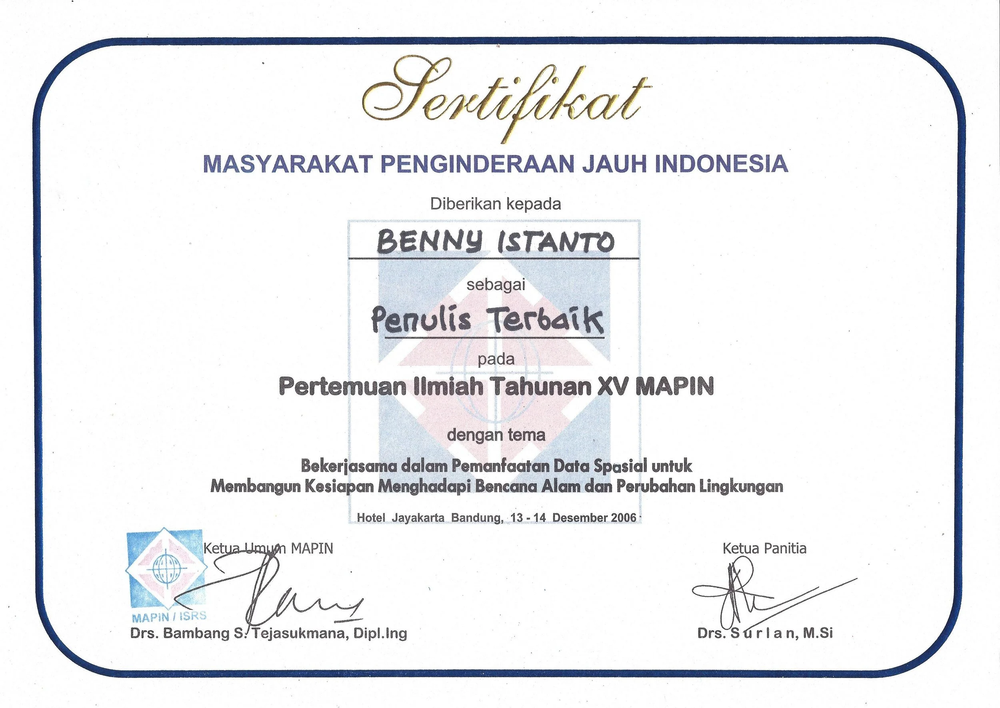
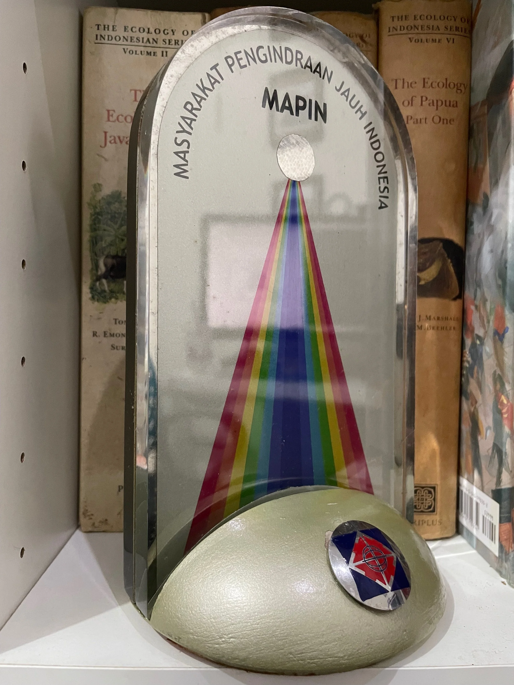
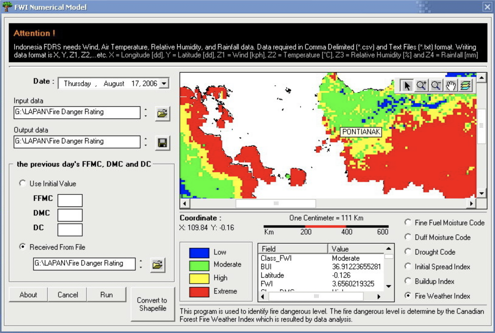

Minggu lalu saya mengikuti Pertemuan Ilmiah Tahunan XV dan Kongres IV Masyarakat Ahli Penginderaan Jauh Indonesia (MAPIN), yang diadakan di Bandung, 13 - 14 Desember 2006.

Saya mengirimkan makalah yang saya tulis bersama Pak Idung Risdiyanto dan Pak Rokhis Khomarudin dengan judul “*Penyusunan perangkat lunak untuk sistem peringatan dini kebakaran hutan di Indonesia*”. Saya mendapatkan jadwal presentasi pada hari kedua, ini merupakan pengalaman pertama yang sangat berkesan dan mendebarkan. Karena dari daftar pemakalah yang ada, sepertinya hanya saya yang masuk kategori “*anak kemarin sore*” karena baru 5 bulan menjalani wisuda S1, sedangkan yang lain namanya sudah cukup terkenal di dunia SIG dan Penginderaan Jauh di Indonesia.

Setelah selesai sesi presentasi dan tanya jawab yang berjalan cukup lancar, panitia memngumumkan bahwa saya mendapatkan Jacub Rais Award untuk kategori Penulis Terbaik.



Kaget dan senang tentunya.



Jadwal PIT MAPIN 2016 bisa dilihat di link [ini](https://drive.google.com/file/d/1Of9VW-_tJ4EsEa7838JQ8RFZLRF896MU/view?usp=sharing) dan makalah lengkapnya ada di link [ini](https://drive.google.com/file/d/1RumlhYF2ZaUP9TlVyUpEISiyyN4VKd89/view?usp=sharing).

```{=html}
<iframe 
  src="https://docs.google.com/presentation/d/e/2PACX-1vQLjqIuJWPF9gXx7IBjmJ2nDkn2BHgGOSaiRHZMwmbvA5hLF8JrJ2XQUdkatucTkjZ5FxNPl4JRf80C/embed?start=false&loop=false&delayms=3000" 
  frameborder="0" 
  width="960" 
  height="749" 
  allowfullscreen="true" 
  mozallowfullscreen="true" 
  webkitallowfullscreen="true">
</iframe>
```

Gambar di bawah ini merupakan salah satu output yang saya tampilkan dalam presentasi, user interface pengolahan FDRS menggunakan input data wilayah.

