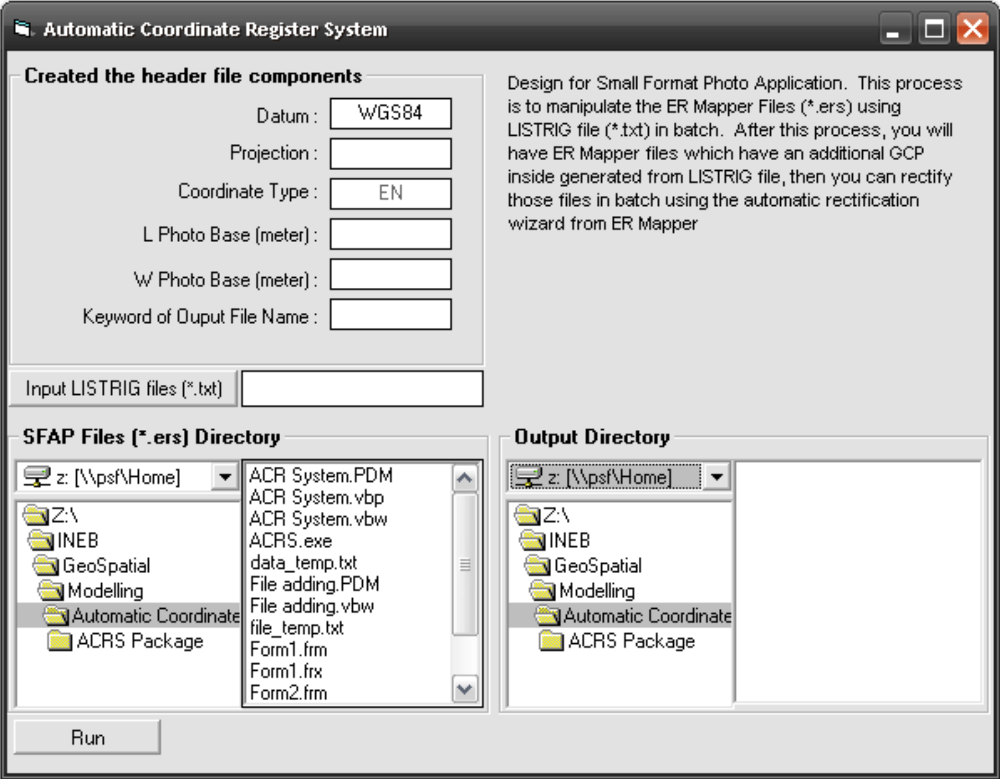

Image registration is the process of transforming different sets of data into one coordinate system. Data may be multiple photographs, data from different sensors, from different times, or from different viewpoints[^1]. It is used in computer vision, medical imaging, military automatic target recognition, and compiling and analyzing images and data from satellites. Registration is necessary in order to be able to compare or integrate the data obtained from these different measurements.

[^1]: Wikipedia, <http://en.wikipedia.org/wiki/Image_registration>

This program is designed to Small Format Aerial Photo Application. This process is to manipulate the ER Mapper Files (\*.ers) using LISTRIG file (\*.txt) in batch. After this process, you will have ER Mapper files which have an additional GCP inside generated from LISTRIG file, then you can rectify those files in batch using the automatic rectification wizard from ER Mapper.



### How it works

The program reads every `*.ers` file in the input folder and pairs each one with a record from
the LISTRIG text file, which holds the coordinates of the photo centre in degrees and minutes.
For each photo it takes an `*.ers` header template, substitutes the extent, datum, projection and
coordinate type, and writes a new `*.ers` file into the output folder. The half-width and
half-height of the photo are converted from metres to degrees so the corner coordinates can be
written as a bounding box around the centre point.

### Source code

::: {.callout-note collapse="true" title="Visual BASIC 6 - Automatic Coordinate Register System"}
```vb
'+++++++++++++++++++++++++++++++++++++++++++++++++++++++++++++++++
' Automatic Coordinate Register System (ACRS)
'
' Batch-writes ER Mapper (*.ers) headers for small-format aerial
' photos, using photo-centre coordinates read from a LISTRIG file.
'
' Benny Istanto, February 2007
'+++++++++++++++++++++++++++++++++++++++++++++++++++++++++++++++++

Option Explicit

'--- Configuration -------------------------------------------------
' Adjust these to suit your own machine and data layout.
Private Const DEFAULT_LISTRIG_DIR As String = "C:\ACRS\listrig"
Private Const TEMPLATE_FILE       As String = "file_temp.txt"  ' *.ers header template
Private Const DATASET_TYPE_FILE   As String = "data_temp.txt"  ' DataSetType value
Private Const MAX_FILES           As Integer = 1000

' Rough metres per degree of latitude. Used to convert the photo
' half-width and half-height into a degree offset from the centre.
Private Const METRES_PER_DEGREE   As Double = 111000

'--- Module state --------------------------------------------------
Private m_ErsFiles(MAX_FILES) As String   ' full path of each *.ers found
Private m_DataSetNames(MAX_FILES) As String
Private m_FileCount As Integer


'===================================================================
' Browse for the LISTRIG file
'===================================================================
Private Sub cmdBrowseListrig_Click()

    On Error GoTo CancelledByUser

    dlgFile.DialogTitle = "Open LISTRIG file"
    dlgFile.FileName = ""
    dlgFile.InitDir = DEFAULT_LISTRIG_DIR
    dlgFile.Flags = cdlOFNFileMustExist Or cdlOFNPathMustExist
    dlgFile.Filter = "Comma delimited file (*.txt)|*.txt|All files (*.*)|*.*"
    dlgFile.FilterIndex = 1
    dlgFile.ShowOpen

    txtListrigFile.Text = dlgFile.FileName

CancelledByUser:
    Exit Sub

End Sub


'===================================================================
' Build the *.ers headers
'===================================================================
Private Sub cmdProcess_Click()

    Dim inputFolder    As String
    Dim outputFolder   As String
    Dim listrigFile    As String
    Dim templateFile   As String
    Dim dataTypeFile   As String
    Dim outputPrefix   As String
    Dim outputFile     As String

    Dim foundFile      As String
    Dim ersHeader      As String   ' the *.ers header being built
    Dim templateBlock  As String   ' replacement for "RasterInfo End"
    Dim dataSetType    As String

    Dim photoWidthM    As Double   ' photo footprint, metres
    Dim photoHeightM   As Double
    Dim halfWidthM     As Double
    Dim halfHeightM    As Double

    Dim lonCentre      As Double   ' photo centre, decimal degrees
    Dim latCentre      As Double
    Dim lonMin         As Double   ' bounding box, decimal degrees
    Dim lonMax         As Double
    Dim latMin         As Double
    Dim latMax         As Double

    Dim degLon         As Variant  ' LISTRIG fields
    Dim minLon         As Variant
    Dim degLat         As Variant
    Dim minLat         As Variant
    Dim spare1         As Variant
    Dim spare2         As Variant
    Dim spare3         As Variant
    Dim spare4         As Variant

    Dim datasetPath    As String
    Dim i              As Integer
    Dim j              As Integer
    Dim recordIndex    As Integer

    inputFolder = dirInput.Path
    outputFolder = dirOutput.Path
    listrigFile = txtListrigFile.Text
    outputPrefix = "\" & txtOutputPrefix.Text

    templateFile = App.Path & "\" & TEMPLATE_FILE
    dataTypeFile = App.Path & "\" & DATASET_TYPE_FILE

    '--- Collect every *.ers file in the input folder ---------------
    m_FileCount = 0
    foundFile = Dir$(inputFolder & "\*.ers")
    Do While foundFile <> ""
        m_FileCount = m_FileCount + 1
        lstInput.AddItem foundFile
        m_ErsFiles(m_FileCount) = inputFolder & "\" & foundFile
        foundFile = Dir$
    Loop

    If m_FileCount = 0 Then
        MsgBox "No *.ers files found in " & inputFolder, vbExclamation, "Nothing to do"
        Exit Sub
    End If

    '--- Rotate the list by one position ----------------------------
    ' NOTE: this is the behaviour of the original 2007 program. Output j
    ' takes its dataset name from input j-1, wrapping the last file round
    ' to the front. Preserved as-is so the results stay reproducible.
    For i = 1 To m_FileCount
        If i = m_FileCount Then
            m_DataSetNames(1) = m_ErsFiles(m_FileCount)
        Else
            m_DataSetNames(i + 1) = m_ErsFiles(i)
        End If
    Next i

    prgProgress.Min = 0
    prgProgress.Max = m_FileCount

    '--- Build one *.ers header per photo ---------------------------
    For j = 1 To m_FileCount

        Open m_ErsFiles(j) For Input As #1     ' source *.ers
        Open templateFile For Input As #2      ' header template
        Open listrigFile For Input As #3       ' photo-centre coordinates
        Open dataTypeFile For Input As #5      ' DataSetType value

        outputFile = outputFolder & outputPrefix & j & ".ers"
        Open outputFile For Output As #4

        Input #1, ersHeader
        Input #2, templateBlock

        ersHeader = ReplaceToken(ersHeader, "RasterInfo End", templateBlock)

        '--- Photo footprint, centred on the LISTRIG coordinate ------
        photoWidthM = Val(txtPhotoWidth.Text)
        photoHeightM = Val(txtPhotoHeight.Text)
        halfWidthM = photoWidthM / 2
        halfHeightM = photoHeightM / 2

        ersHeader = ReplaceToken(ersHeader, "Xa", CStr(photoWidthM))
        ersHeader = ReplaceToken(ersHeader, "Ya", CStr(photoHeightM))
        ersHeader = ReplaceToken(ersHeader, "Xb", CStr(halfWidthM))
        ersHeader = ReplaceToken(ersHeader, "Yb", CStr(halfHeightM))

        ersHeader = ReplaceToken(ersHeader, "Dt", TextOrDefault(txtDatum.Text, "RAW"))
        ersHeader = ReplaceToken(ersHeader, "Pj", TextOrDefault(txtProjection.Text, "RAW"))
        ersHeader = ReplaceToken(ersHeader, "Ct1", TextOrDefault(txtCoordType.Text, "RAW"))

        '--- Find record j in the LISTRIG file -----------------------
        recordIndex = 0
        Do While Not EOF(3)

            Input #3, spare1, degLat, minLat, degLon, minLon, spare2, spare3, spare4

            recordIndex = recordIndex + 1
            If recordIndex = j Then

                lonCentre = Val(degLon) + Val(minLon) / 60
                latCentre = Val(degLat) + Val(minLat) / 60

                lonMin = lonCentre - (halfWidthM / METRES_PER_DEGREE)
                lonMax = lonCentre + (halfWidthM / METRES_PER_DEGREE)
                latMin = latCentre - (halfHeightM / METRES_PER_DEGREE)
                latMax = latCentre + (halfHeightM / METRES_PER_DEGREE)

                ersHeader = ReplaceToken(ersHeader, "x1", Str(lonMin))
                ersHeader = ReplaceToken(ersHeader, "x2", Str(lonMax))
                ersHeader = ReplaceToken(ersHeader, "y1", Str(latMin))
                ersHeader = ReplaceToken(ersHeader, "y2", Str(latMax))
                ersHeader = ReplaceToken(ersHeader, "x3", Str(lonCentre))
                ersHeader = ReplaceToken(ersHeader, "y3", Str(latCentre))

            End If

        Loop

        Close #2
        Close #3

        '--- Point the header at the raster on disk ------------------
        Input #5, dataSetType

        datasetPath = Replace(inputFolder, "\", "\\", 1, -1, vbTextCompare) & "/" & _
                      DatasetName(m_DataSetNames(j), inputFolder)

        ersHeader = ReplaceToken(ersHeader, "= ERStorage", "")
        ersHeader = ReplaceToken(ersHeader, "DataSetType", dataSetType)
        ersHeader = ReplaceToken(ersHeader, "apusan", datasetPath)

        Print #4, ersHeader

        Close #4
        Close #5
        Close #1

        lstOutput.AddItem outputFile
        prgProgress.Value = j

    Next j

    MsgBox "Process completed successfully.", vbInformation, "Success"

End Sub


'===================================================================
' Helpers
'===================================================================

' Case-insensitive token substitution, matching the original program.
Private Function ReplaceToken(ByVal Source As String, _
                              ByVal Token As String, _
                              ByVal Value As String) As String
    ReplaceToken = Replace(Source, Token, Value, 1, -1, vbTextCompare)
End Function

' Strip the folder and the *.ers extension to leave the dataset name.
Private Function DatasetName(ByVal FullPath As String, _
                             ByVal Folder As String) As String
    Dim s As String
    s = Replace(FullPath, Folder & "\", "", 1, -1, vbTextCompare)
    DatasetName = Replace(s, ".ers", "", 1, -1, vbTextCompare)
End Function

Private Function TextOrDefault(ByVal Value As String, _
                               ByVal Fallback As String) As String
    If Trim$(Value) = "" Then
        TextOrDefault = Fallback
    Else
        TextOrDefault = Value
    End If
End Function


'===================================================================
' Folder / drive browsers
'===================================================================
Private Sub dirInput_Change()
    filInput.Path = dirInput.Path
End Sub

Private Sub drvInput_Change()
    dirInput.Path = drvInput.Drive
End Sub

Private Sub drvOutput_Change()
    dirOutput.Path = drvOutput.Drive
End Sub
```
:::