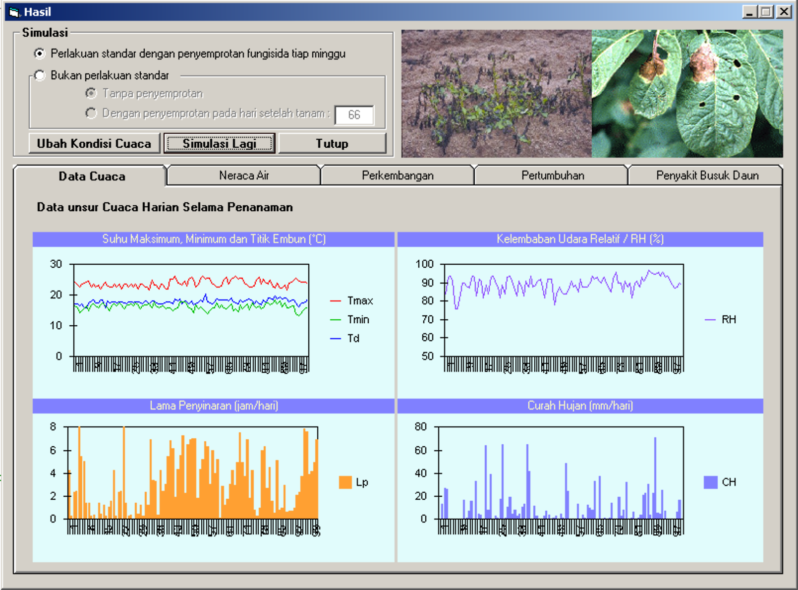
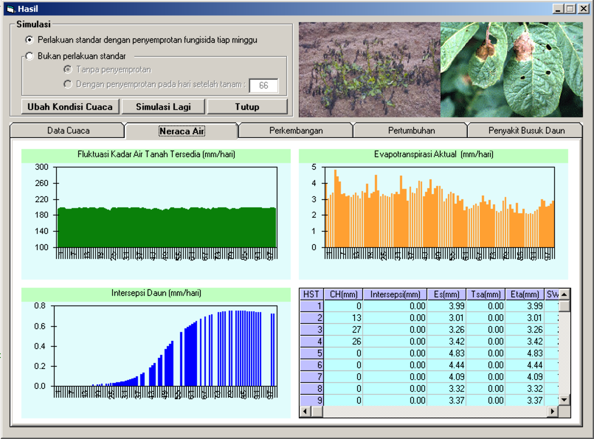
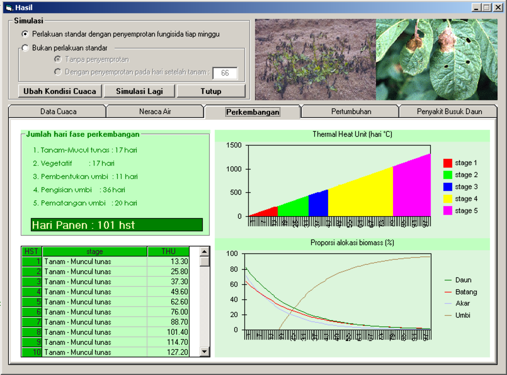
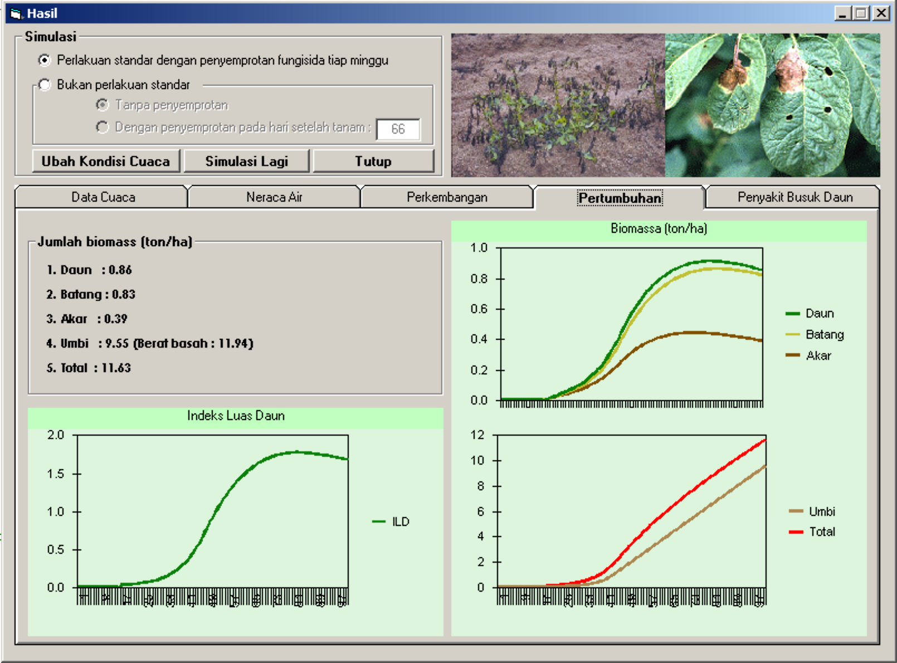
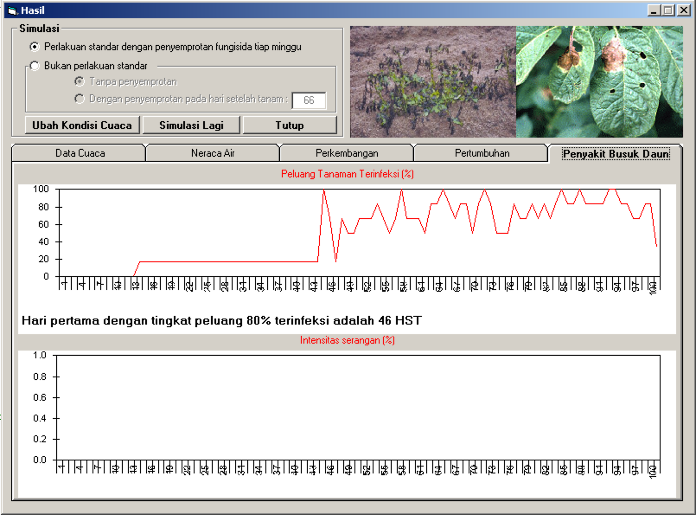
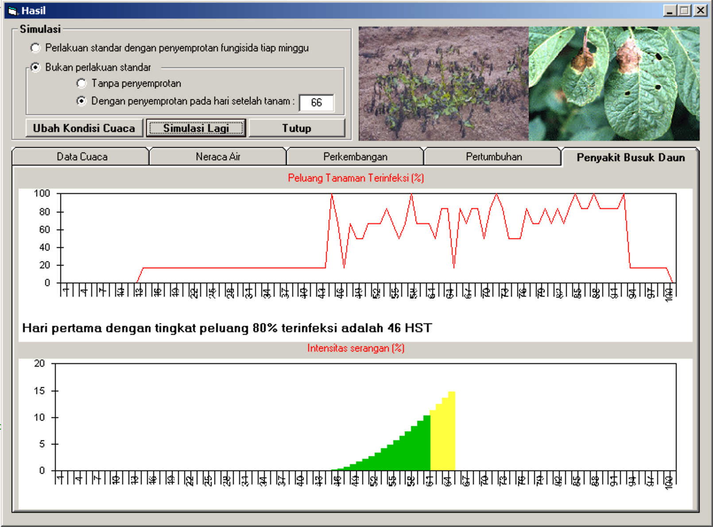
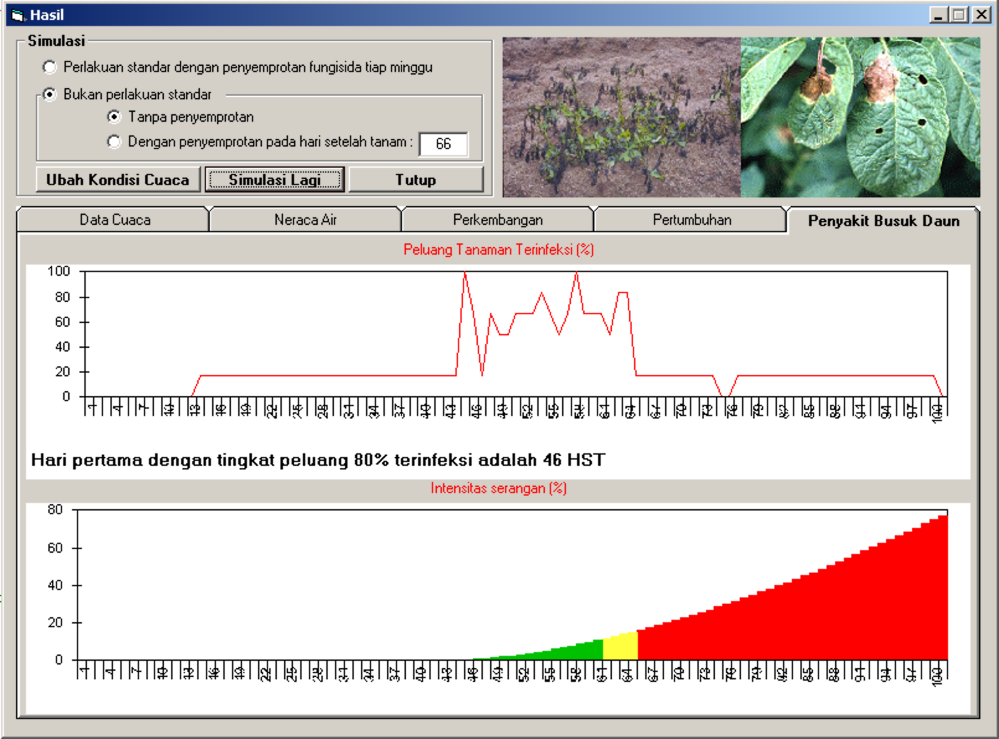

User interface model simulasi penyakit busuk daun (late blight) pada tanaman kentang (*Solanum tuberosum L.*) dibangun menggunakan Visual Basic 6.

Model ini membutuhkan input data cuaca (hujan, suhu minimum dan maksimum, kelembaban relatif dan lama penyinaran) harian selama setahun.

Terdapat dua opsi simulasi:

1. Perlakuan standar dengan penyemprotan fungisida setiap minggu
2. Bukan perlakuan standar

   * Tanpa penyemprotan
   * Dengan penyemprotan pada hari setelah tanam (HST): xx

Model simulasi ini mempunyai 3 sub model:

1. Neraca air, yang akan menghasilkan informasi tentang fluktuasi kadar air tanah tersedia (mm/hari), evapotranspirasi aktual (mm/hari) dan intersepsi daun (mm/hari)
2. Perkembangan, yang akan menghasilkan informasi tentang jumlah hari selama fase perkembangan (tanam-muncul tunas, vegetatif, pembentukan umbi, pengisian umbi dan pematangan umbi), thermal heat unit, dan proporsi alokasi biomassa (%).
3. Pertumbuhan, yang akan menghasilkan informasi indeks luas daun (ILD/LAI), jumlah biomassa untuk daun, batang, akar, umbi dan total keseluruhan dalam ton/ha.

Hasil luaran akhir dari model simulasi ini adalah informasi peluang tanaman terinfeksi (%) dan intensitas serangan (%).

Penyusunan model ini dipimpin oleh:

Dr. Ir. Handoko | Laboratorium Meteorologi Pertanian IPB / Seameo BIOTROP

::: {.image-gallery}
::: {.gallery-item}

:::
::: {.gallery-item}

:::
::: {.gallery-item}

:::
::: {.gallery-item}

:::
::: {.gallery-item}

:::
::: {.gallery-item}

:::
::: {.gallery-item}

:::
:::

Kode sumber model, ditulis dalam Visual Basic 6.

::: {.callout-note collapse="true" title="Visual Basic 6 - modul model simulasi"}
```vb
'++++++++++++++++++++++++++++++++++++++++++++++++++++
'Program simulasi penyakit busuk daun tanaman kentang
'++++++++++++++++++++++++++++++++++++++++++++++++++++

Public InputData As String
Public OutputData As String


Public Hst, hari, ch(1000), Tmin, Tmax, Td, Tave(1000), rh, ss, pi, wind, radiasi, lintang1, bujur1, RN, a2, b2, dlen

'variabel neraca air
Public Etm, Tsm, Tsa, Es, sd, wp, fc, swc, alpha, U, CEs1, CEs2, times, wdf
Public Fint ' intersepsi daun
Public Inf 'Infiltrasi

'Model Perkembangan
Public TU1 ' fase Plant - Emergence
Public TU2 ' Vegetative
Public TU3 ' Tuber inisiasi
Public TU4 ' Pengisian umbi
Public TU5 ' Pematangan umbi
Public THU, sp1, sp2, sp3, sp4, sp5, s1, s2, s3, s4, s5, Tb, sp, fs1, fs2, fs3, fs4, fs5

'Model Pertumbuhan
Public Sint
Public pA, pB, pU, pD 'proporsi daun
Public Kg 'koefisien respirasi pertumbuhan
Public Km 'koefisien respirasi pemeliharaan
Public Lue 'Light use efficiency
Public WD, WB, WA, WU, WT, dWD, dWB, dWA, dWU, dILD, ILD, kd, LMu(1000)

'Penyakit
Public embun, Tss, Hiv, dvILD
Public Scr 'Score Penyakit
Public HsTu ' Hari setelah tunas
Public HPr 'Hari Penyemprotan
Public Hpr1, HariSerangan

'Perlakuan
Public TanamStandar As Boolean
Public TanamJamur As Boolean 'Tanaman dikenai Jamur/non standar
Public TanamNoSemprot As Boolean
Public TanamSemprot As Boolean
Public jbk As Integer


'++++++++++
Public Sub HitungETP()
'Solar declination (degree):
    d = -23.4 * Cos(2 * pi * (hari + 10) / 365)

'Daylength, dlen (hours):
    sinld = Sin(lintang1 * pi / 180) * Sin(d * pi / 180)
    cosld = Cos(lintang1 * pi / 180) * Cos(d * pi / 180)
    sinb = Sin(-0.833 * pi / 180)
    arg = (sinb - sinld) / cosld
    arccos = Atn(-arg / Sqr(-arg * arg + 1)) + 2 * Atn(1)
    dlen = 24 / pi * arccos

'Vapour pressure (mb):
    TAve(hari) = (Tmin + Tmax) / 2
    esat = 6.1078 * Exp(17.239 * TAve(hari) / (TAve(hari) + 237.3))
    ea = rh * esat / 100
    vpd = esat - ea

'Slope of vapour pressure (Pa/oC):
    delta = 47.139 * Exp(0.055129 * TAve(hari))

'Albedo (unitless) :
    albs = 0.05
    albc = 0.25 * (0.23 - 0.05) * 2
    alb = albs + albc

'S angot
    sangot = 58.75 * (sinld + cosld)

'radiasi
    radiasi = ((a2 + b2 * ss / dlen) * sangot)

'Long wave radiation (MJ/m2/d):
    nN = (radiasi / sangot - 0.16) / 0.62
    Rlw = 2 * (10 ^ -9) * ((TAve(hari) + 273) ^ 4) * (0.56 - 0.08 * Sqr(ea)) * (0.1 + 0.9 * nN)

'Net radiation (MJ/m2/d):
    RN = (1 - alb) * radiasi - Rlw

'Aerodynamic function (MJ/(oC.m2.d)):
    f1 = 0.64 * (1 + 0.54 * wind * 1000 / 3600)

'Energy limited evapotranspiration (mm):
    'etp = 0.75 * (delta * Rn + f1 * vpd * 100) / ((delta + 66.1) * 2.454)
    Etp = 0.75 * (delta * RN + f1 * vpd * 100) / ((delta + 66.1) * 3)
    If Etp < 0 Then Etp = 0

'Evapotranspirasi Maksimum
    Etm = Etp

End Sub


'++++++++++
Public Sub EvaporasiTanah()
'Kapasitas Intersepsi (fungsi dari ILD)
'Jika hujan = 0 diberikan irigasi sprinkle sebesar KL-KAT(n)
    If ch(hari) <> 0 Then
        Pair = ch(hari)
    Else
        Pair = fc - swc
    End If

'Fint = 1.6481 * ILD ^ 2 + 0.3076
    If ILD < 3 Then Fint = 0.4233 * ILD Else Fint = 1.27
    If ch(hari) = 0 Then Fint = 0
    If Fint > ch(hari) Then Fint = ch(hari)

'Infiltration (INF), mm :
     Inf = Pair - Fint

'Tranpirasi maksimum, mm:
     Tsm = Etm * (1 - Exp(-0.3 * ILD))
     Esm = Etm - Tsm


     p = Inf
     If CEs1 >= U Then GoTo stage2

stage1:
     If p >= CEs1 Then CEs1 = 0 Else CEs1 = CEs1 - p

cumes1:
     CEs1 = CEs1 + Esm
     If CEs1 < U Then Es = Esm Else GoTo transition
     GoTo bufferevap

transition:
     Es = Esm - 0.4 * (CEs1 - U)
     CEs2 = 0.6 * (CEs1 - U)
     times = (CEs2 / alpha) ^ 2
     GoTo bufferevap

stage2:
     If p >= CEs2 Then GoTo storm
     times = times + 1
     timeso = times - 1
     Es = alpha * Sqr(times) - alpha * Sqr(timeso)
     If p > 0 Then GoTo rained
     If Es > Esm Then Es = Esm

cumes2:
     CEs2 = CEs2 + Es - p
     GoTo bufferevap

storm:
     p = p - CEs2
     CEs1 = U - p
     If p > U Then CEs1 = 0
     GoTo cumes1

rained:
     Esx = 0.8 * p
     If Esx <= Es Then Esx = Es + p
     If Esx > Esm Then Esx = Esm
     Es = Esx
     GoTo cumes2

bufferevap:
     If swc < 0.5 * wp Then Es = 0
     If swc >= fc Then Es = Esm

End Sub


'++++++++++
Public Sub Transpirasi()
    'Relative Extractable Water (rew, unitless):
            Swccrit = wp + 0.4 * (fc - wp)
            rew = (swc - wp) / (Swccrit - wp)
            If swc <= wp Then rew = 0
            If swc > fc Then rew = 1

     ' Menghitung perubahan kedalaman perakaran (mm)
'    If s >= 0 Then
        If TAve(hari) > 7 Then drdepth = 2.2 * (TAve(hari) - 7) Else drdepth = 0
'    Else
'        drdepth = 0
'    End If
        rdepth = rdepth + drdepth
        If rdepth > sd Then rdepth = sd

    'Actual transpiration (mm) :
            Tsa = Tsm * rew * rdepth / sd
            If Tsa > Tsm Then Tsa = Tsm
            If Tsm > 0 Then wdf = Tsa / Tsm Else wdf = 0

End Sub


'++++++++++
Public Sub neraca_air()

            swc = swc + Inf - Es - Tsa
            If swc > fc Then GoTo runoff
            perc = 0
            GoTo bufferwbal

runoff:
            runoff = swc - fc
            swc = fc

bufferwbal:
        If swc < 0 Then swc = 0
End Sub


'++++++++++
Public Sub Inisialisasi()

'Neraca air
sd = 400 'mm kedalaman perakaran
wp = 0.13 * sd ' wilting point
fc = 0.5 * sd ' field capacity
swc = fc ' soil water content
alpha = 5.08
U = 12
CEs1 = U
CEs2 = 0
times = 0
Es = 0

'Model Perkembangan
TU1 = 214 ' (0-160) fase Plant - Emergence
TU2 = 228 ' (160-330) Vegetative
TU3 = 147 ' (330-440) Tuber inisiasi
TU4 = 481 ' (440-800) Pengisian umbi
TU5 = 268 ' (800-1000) Pematangan umbi
Tb = 7
sp1 = 0.16
sp2 = 0.17
sp3 = 0.11
sp4 = 0.36
sp5 = 0.2

'Model pertumbuhan
    Km = 0.0108 '0.015 'padi
    Lue = 0.035
    kd = 0.35 'Koefisien pemadaman
    Kg = 0.13 ' 0.14 padi
    WU = 80 '20 gram/biji (berat basah) * 20% tanam:40000 tan/ha
    WB = 0
    WA = 0
    WD = 0
    WT = 0
End Sub


'++++++++++
Public Sub Perkembangan()

'Suhu rata-rata diambil pada saat perhitungan ETP
'fase tanam-emergence

THU = THU + (TAve(hari) - Tb)

If sp >= 0.8 Then GoTo fase5
If sp >= 0.44 Then GoTo fase4
If sp >= 0.33 Then GoTo fase3
If sp >= 0.16 Then GoTo fase2


fase1:
    If TAve(hari) > Tb Then s1 = s1 + sp1 * (TAve(hari) - Tb) / TU1
    fs1 = fs1 + 1
    If s1 > sp1 Then
        s1 = sp1
        ILD = 0.0323
    Else
        GoTo hitung_sp
    End If
fase2:
    If TAve(hari) > Tb Then s2 = s2 + sp2 * (TAve(hari) - Tb) / TU2
    fs2 = fs2 + 1
    If s2 > sp2 Then
        s2 = sp2
    Else
        GoTo hitung_sp
    End If
fase3:
    If TAve(hari) > Tb Then s3 = s3 + sp3 * (TAve(hari) - Tb) / TU3
        fs3 = fs3 + 1
    If s3 > sp3 Then
        s3 = sp3
    Else
        GoTo hitung_sp
    End If
fase4:
    If TAve(hari) > Tb Then s4 = s4 + sp4 * (TAve(hari) - Tb) / TU4
        fs4 = fs4 + 1
    If s4 > sp4 Then
        s4 = sp4
    Else
        GoTo hitung_sp
    End If
fase5:
    If TAve(hari) > Tb Then s5 = s5 + sp5 * (TAve(hari) - Tb) / TU5
    fs5 = fs5 + 1
    If s5 > sp5 Then
        s5 = sp5
    Else
        GoTo hitung_sp
    End If

hitung_sp:
    sp = s1 + s2 + s3 + s4 + s5
End Sub


'++++++++++
Public Sub Pertumbuhan()

'proporsi biomass


    pD = 0.852 * Exp(-4.0748 * sp) 'x '0.9871 * Exp(-5.6564 * sp)
    pB = 0.6599 * Exp(-3.7117 * sp) ' x '0.3652 * Exp(-4.5512 * sp)
    pA = 0.7517 * Exp(-5.2305 * sp) 'x '0.2922 * Exp(-5.6926 * sp)
    pU = 1 - pA - pD - pB

'Menduga ILD

    sla = (-0.0139 * (sp ^ 2)) + (0.0189 * sp) - 0.0025  ' ha/kg
    If sla < 0 Then sla = 0

    dILD = 0.6 * sla * dWD
    ILD = ILD + dILD

'Perhitungan hari setelah tunas
    If HsTu <= 0 Then
        If ILD > 0 Then HsTu = HsTu + 1
    Else
        HsTu = HsTu + 1
    End If

'======================================================================
'Penyakit (infeksi jamur akan mengurangi ILD jika indeks Tss >=80%)

    If TanamJamur = True Then

        'Penyemprotan
        If TanamSemprot = True Then HPr = Val(Hpr1)
        If TanamNoSemprot = True Then HPr = 1000
        If Hst < HPr Then
            If Hiv < 1 Then
                If Tss >= 80 Then
                    Hiv = Hiv + 1
                    HariSerangan = Hst
                    dvILD = 0.0012 * (Hiv ^ 1.6122)
                    ILD = ILD * (1 - dvILD)
                End If
            Else
                Hiv = Hiv + 1
                dvILD = 0.0012 * (Hiv ^ 1.6122)
                ILD = ILD * (1 - dvILD)
                If ILD <= 0 Then ILD = 0
            End If
        Else
            Hiv = 0
            dvILD = 0
        End If
    Else
        If jbk = 0 Then
            If Tss >= 80 Then
                jbk = 1
                HariSerangan = Hst
            End If
        End If
    End If

'===================================================================
'Intercepted radiation (MJ/m2/d) :
    RR = 140 * dlen * 3600 / 10 ^ 6
    Sint = radiasi * (1 - Exp(-kd * ILD))
    If Sint > RR Then Sint = RR
'Potential gross dry matter production (kg/ha/d) :
    GDMp = Lue * Sint * 10 ^ 4
'Actual gross dry matter production (kg/ha/d) :
    GDMa = (1 - Kg) * GDMp * wdf
'Respirasi Pemeliharaan (kg/ha/d):
    Q10 = 2 ^ ((TAve(hari) - 20) / 10)

    RmD = Km * Q10 * WD
    RmB = Km * Q10 * WB
    RmA = Km * Q10 * WA
    RmU = Km * Q10 * WU

'Pembagian biomasa :

    dWD = (pD * GDMa - RmD)
    dWB = (pB * GDMa - RmB)
    dWA = (pA * GDMa - RmA)
    dWU = (pU * GDMa - RmU)

    If Hst <= 30 And Hst < 45 Then
        bmax1 = 4 * 40
        If dWU > bmax1 Then dWU = bmax1
    End If

    If Hst >= 45 Then 'And Hst <= 60 Then
        bmax2 = 3.76 * 40
        If dWU > bmax2 Then dWU = bmax2
    End If
        WD = WD + dWD
        WB = WB + dWB
        WA = WA + dWA
        WU = WU + dWU
        WT = WD + WB + WA + WU
End Sub


'++++++++++
Public Sub Penyakit()
'syarat spora (ss)
Tss = 0
If ILD >= 0.5 Then
    'syarat intersep (ss1)
    If Fint > 0 Then ss1 = 1 Else ss1 = 0
    'syarat embun (ss2)
    If Td > Tmin Then ss2 = 1 Else ss2 = 0
    'syarat Suhu Minimum (ss3)
    If Tmin > 11 Then ss3 = 1 Else ss3 = 0
    'syarat suhu maksimum (ss4)
    If Tmax >= 24 And Tmax <= 26 Then ss4 = 1 Else ss4 = 0
    'syarat kelembababan
    If rh > 90 Then ss5 = 1 Else ss5 = 0
'total ss

End If

If hari >= 7 Then
    Tch = 0
    STave = 0
    For i = 0 To 7
        Tch = Tch + ch(hari - i)
        If ch(hari - i) > 0 Then Hch = Hch + 1
        STave = STave + TAve(hari - i)
    Next i
    ST = STave / 7
    If Tch >= 38 And Hch >= 4 Then
        If ST <= 24 Then
            ss6 = 1
        Else
            ss6 = 0
        End If
    End If
End If

Tss = ((ss1 + ss2 + ss3 + ss4 + ss5 + ss6) / 6) * 100
Scr = (dvILD / 1.0237) * 100 'persen
End Sub
```
:::
