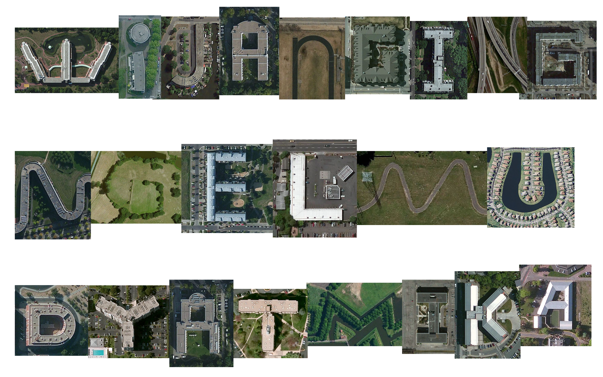

Have you heard about [Aerial Bold](http://type.aerial-bold.com/tw/)? - a project from [Benedikt Groß](https://benedikt-gross.de/projects/the-aerial-bold-project/) & [Joey Lee](https://jk-lee.com/projects/aerial-bold/), devoted to finding all the human-built letters of the world. The idea was to pore over satellite imagery to locate architectural ABCs, then turn those images into a font. Wired also discussed [this](https://www.wired.com/2016/03/aerial-bold-clever-typeface-crafted-satellite-shots-buildings/).



Here's the example of my daughter's name using Aerial Bold. If you are curious, yes it's real, W letter in the picture comes from Rosenhof Berlin-Zehlendorf Seniorenwohnanlage Betriebsgesellschaft mbH, Schlettstadter Straße 22, 14169 Berlin, Germany. <https://maps.app.goo.gl/TYBs856cSeDM9imz9>

```{=html}
<iframe 
  src="https://www.google.com/maps/embed?pb=!1m18!1m12!1m3!1d2432.1477195462976!2d13.2675548!3d52.440238799999996!2m3!1f0!2f0!3f0!3m2!1i1024!2i768!4f13.1!3m3!1m2!1s0x47a85a3771522ad3%3A0x793c032bbea9b42a!2sRosenhof%20Berlin-Zehlendorf%20Seniorenwohnanlage%20Betriebsgesellschaft%20mbH!5e0!3m2!1sen!2sid!4v1712197681975!5m2!1sen!2sid" 
  width="800" 
  height="600" 
  style="border:0;" 
  allowfullscreen="" 
  loading="lazy" 
  referrerpolicy="no-referrer-when-downgrade">
</iframe>
```