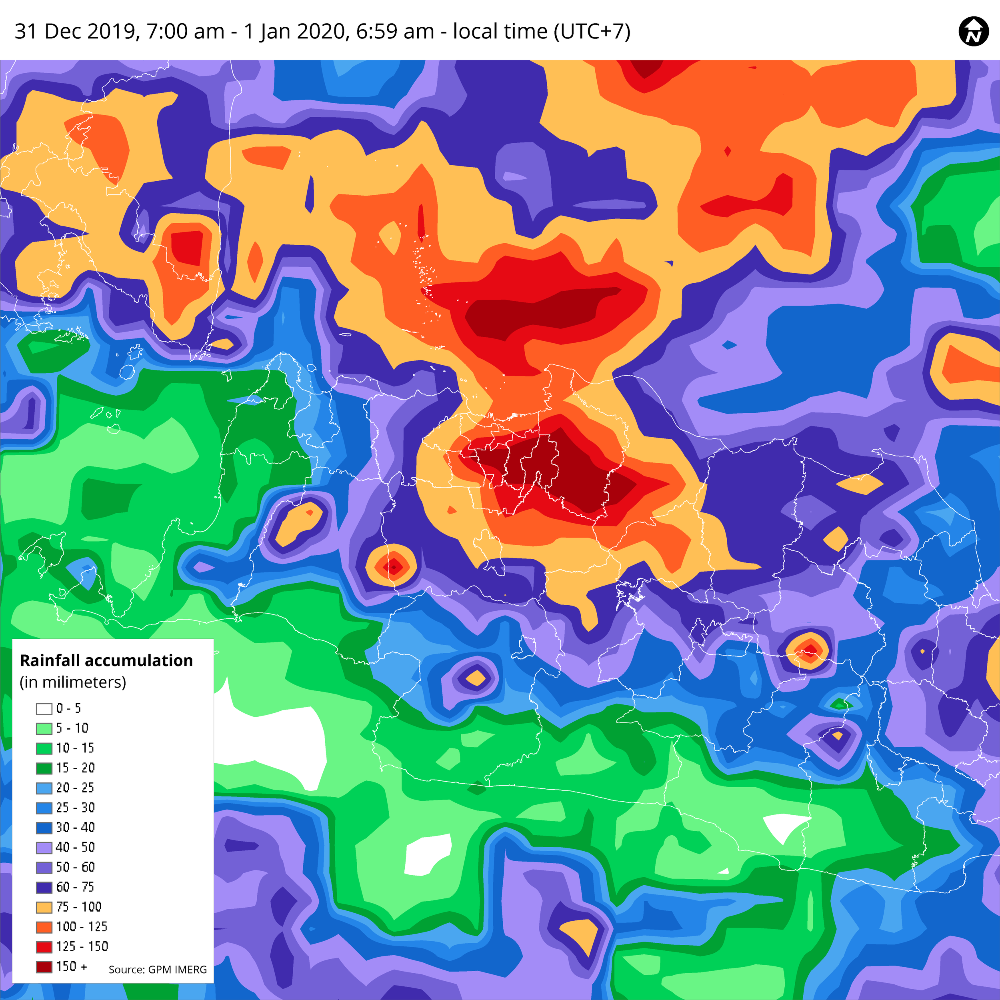
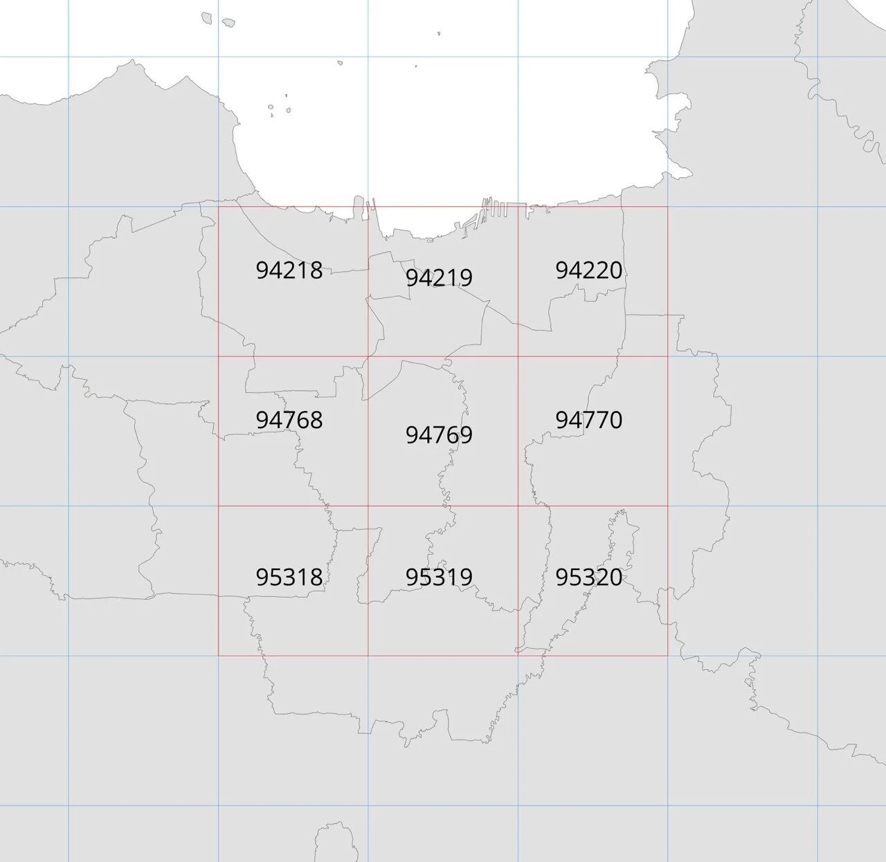

Kicking off 2020 with massive flood in Greater Jakarta. [NASA‘s GPM](https://gpm1.gesdisc.eosdis.nasa.gov/data/GPM_L3/GPM_3IMERGDL.06/2020/01/) satellite captured heavy rain of at least 300 mm pouring over East Jakarta and Bekasi nonstop from new years eve up until the morning.

Other surrounding areas experienced 100-160mm/day of rainfall. What‘s most to blame? Upstream Ciliwung river of course 😬. Yet, local rainfall in the area was only 60 mm.

Let’s check rainfall intensity per 30-minutes from the same source, [NASA’s GPM](https://gpm1.gesdisc.eosdis.nasa.gov/data/GPM_L3/GPM_3IMERGHHL.06/2020/001/).

```{=html}
<iframe 
  width="758" 
  height="536" 
  seamless frameborder="0" 
  scrolling="no" 
  src="https://docs.google.com/spreadsheets/d/e/2PACX-1vQsf-zS06tHsshe0B2e1ul2sn44_xTZrDH1UB_rwlCH4-9NoC0ZOiVHrdZZsLYqx-RWwkRI6Lkx3xtp/pubchart?oid=768668252&amp;format=interactive">
</iframe>
```

```{=html}
<iframe 
  width="805" 
  height="536" 
  seamless frameborder="0" 
  scrolling="no" 
  src="https://docs.google.com/spreadsheets/d/e/2PACX-1vTAUaIoRLnTgWJfk_yh7OkenMowhl_9_fPx2BnreKhOVZKwG65jpZQEL7QGLd5PXLgzmZ5_KtX8CjUC/pubchart?oid=1669956254&amp;format=interactive">
</iframe>
```

If you are curious every line in the chart referring to which areas, then you should check below map index.

The highest rainfall around 370 mm was fall in East Jakarta and Kota Bekasi, compared to official BMKG’s released from weather station around 340 mm.

