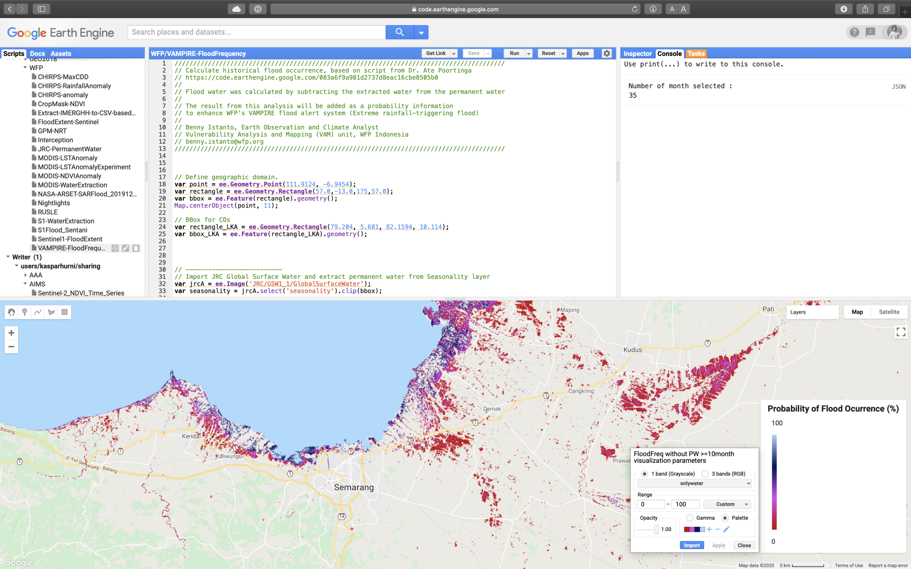

Inspired from [Dr. Ate Poortinga](https://sig-gis.com/sig-people/ate-poortinga/)’s work in extracting [water occurrence](https://code.earthengine.google.com/083a6f9a981d2737d8eac16cbe8505b0) from satellite image, I tried to do similar analysis to get historical average of flood occurrence by month. The result from this analysis will be added as a probability information to enhance WFP's VAMPIRE flood alert system (Extreme rainfall-triggering flood) that currently I am working on.

The steps below describe how to extract monthly water occurrence and seasonality water using Google Earth Engine code editor.

**Step 1.** Define geographic domain

```js
var point = ee.Geometry.Point(111.9124, -6.9454);
var rectangle = ee.Geometry.Rectangle(57.0,-13.0,175,57.0);
var bbox = ee.Feature(rectangle).geometry();
Map.centerObject(point, 11);
```

**Step 2.** Import JRC Global Surface Water and extract permanent water from Seasonality layer

```js
var jrcA = ee.Image('JRC/GSW1_1/GlobalSurfaceWater');
var seasonality = jrcA.select('seasonality').clip(bbox);
var jrcB = ee.ImageCollection("JRC/GSW1_1/MonthlyHistory");
```

**Step 3.** Define study period (example: extract January data from 1984 - 2018)

```js
var startYear = 1984;
var endYear = 2018;
var startMonth = 1;
var endMonth = 12;

var startDate = ee.Date.fromYMD(startYear, startMonth,1); 
var endDate = ee.Date.fromYMD(endYear, endMonth,31); 

var months = endDate.difference(startDate, 'month').divide(12).toInt().add(1);
print('Number of month selected : ', months);

var myjrc = jrcB.filterBounds(bbox);
var myjrc = jrcB.filter(ee.Filter.calendarRange(startYear, endYear, 'year')).filter(ee.Filter.calendarRange(startMonth, endMonth, 'month'));
```

**Step 4.** Detect all observation data with water

```js
// Detect observations
var myjrc = myjrc.map(function(img){
  // observation is img > 0
  var obs = img.gt(0);
  return img.addBands(obs.rename('obs').set('system:time_start', img.get('system:time_start')));
});

// Detect all observations with water
var myjrc = myjrc.map(function(img){
  // if water
  var water = img.select('water').eq(2);
  return img.addBands(water.rename('onlywater').set('system:time_start', img.get('system:time_start')));
});
```

**Step 5.** Calculate flood occurrence

```js
// Calculate the total amount of observations
var totalObs = ee.Image(ee.ImageCollection(myjrc.select("obs")).sum().toFloat());
// Calculate all observations with water
var totalWater = ee.Image(ee.ImageCollection(myjrc.select("onlywater")).sum().toFloat());
// Calculate the percentage of observations with water
var floodfreq0 = totalWater.divide(totalObs).multiply(100);

// Mask areas that are not water (land)
var landMask = floodfreq0.eq(0).not();
var floodfreq1 = floodfreq0.updateMask(landMask); //Historical water occurrence (permanent water + flood)

// Extract permanent water, threshold >= 82% occurrence
// 82% came from https://www.frontiersin.org/articles/10.3389/fenvs.2019.00191/full
var gte82Mask = floodfreq1.gte(82);
var pw82 = floodfreq1.updateMask(gte82Mask);

// Subtract water (flood) occurrence with permanent water, threshold >= 82% occurrence
var gt82Mask = floodfreq1.gte(82).not();
var floodfreq2 = floodfreq1.updateMask(gt82Mask);

// Extract permanent water, threshold >= 10month/year occurrence
var gte10Mask0 = seasonality.gte(10);
var pw10 = seasonality.updateMask(gte10Mask0);

// Subtract water (flood) occurrence with permanent water, threshold >= 10month/year occurrence
var gte10Mask1 = seasonality.gte(10).mask(1);
gte10Mask1 = gte10Mask1.eq(1).not();
var floodfreq3 = floodfreq1.updateMask(gte10Mask1);
```

**Step 6.** Visualisation and add map to canvas

```js
// Seasonal Water - Orange to Red is persistent water for at least 10 month/year
var seasonalityVis = {min: 0.0, max: 12.0, palette: ['f7fbff','deebf7','c6dbef','9ecae1','6baed6','4292c6','2171b5','08519c','08306b','fd8d3c','f03b20','bd0026']};

// Flood Occurrence
var floodViz = {min:0, max:100, palette:['c10000','d742f4','001556','b7d2f7']};

// Permanent Water >=82%
var pw82Viz = {palette:"ff9e00"};

// Permanent Water >=10month
var pw10Viz = {palette:"38f500"};

// Add map to canvas
Map.addLayer(floodfreq3.clip(bbox), floodViz,"FloodFreq without PW >=10month", true);
Map.addLayer(floodfreq2.clip(bbox), floodViz,"FloodFreq without PW >=82%", false);
Map.addLayer(floodfreq1.clip(bbox), floodViz,"FloodFreq", false);
Map.addLayer(pw10.clip(bbox), pw10Viz,"Permanent Water >=10 month/year", false);
Map.addLayer(pw82.clip(bbox), pw82Viz,"Permanent Water >=82% occurrence", false);
Map.addLayer(seasonality.clip(bbox), seasonalityVis, "Seasonal Water", false); 
```

**Step 7.** Export the result to Google Drive

```js
Export.image.toDrive({
  image:floodfreq3,
  description:'FF_January_1984_2018',
  folder:'GEE',
  scale:30,
  region: bbox_LKA,
  maxPixels:1e12
});
```

**Step 8.** Setting legend

```js
// Set position of panel
var legend = ui.Panel({
  style: {
  position: 'bottom-right',
  padding: '8px 15px'
  }
});
 
// Create legend title
var legendTitle = ui.Label({
  value: 'Probability of Flood Ocurrence (%)',
  style: {
  fontWeight: 'bold',
  fontSize: '18px',
  margin: '0 0 4px 0',
  padding: '0'
  }
});
 
// Add the title to the panel
legend.add(legendTitle);
 
// Create the legend image
var lon = ee.Image.pixelLonLat().select('latitude');
var gradient = lon.multiply((floodViz.max-floodViz.min)/100.0).add(floodViz.min);
var legendImage = gradient.visualize(floodViz);
 
// Create text on top of legend
var panel = ui.Panel({
  widgets: [
    ui.Label(floodViz['max'])
    ],
  });
 
legend.add(panel);
 
// Create thumbnail from the image
var thumbnail = ui.Thumbnail({
  image: legendImage,
  params: {bbox:'0,0,10,100', dimensions:'10x200'},
  style: {padding: '1px', position: 'bottom-center'}
  });
 
// Add the thumbnail to the legend
legend.add(thumbnail);
 
// Area text on top of legend
var panel = ui.Panel({
  widgets: [
    ui.Label(floodViz['min'])
    ],
  });
 
legend.add(panel);
Map.add(legend);
```



Full script [here](https://code.earthengine.google.com/a6c255d7b4629d0b0675e4e469f31af1)