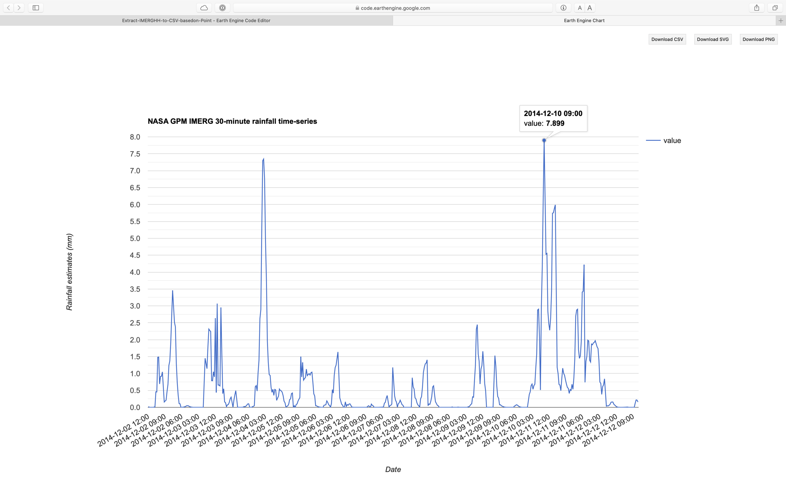
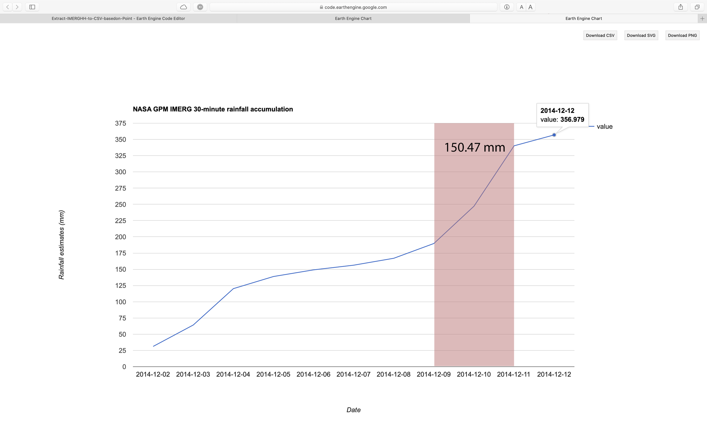
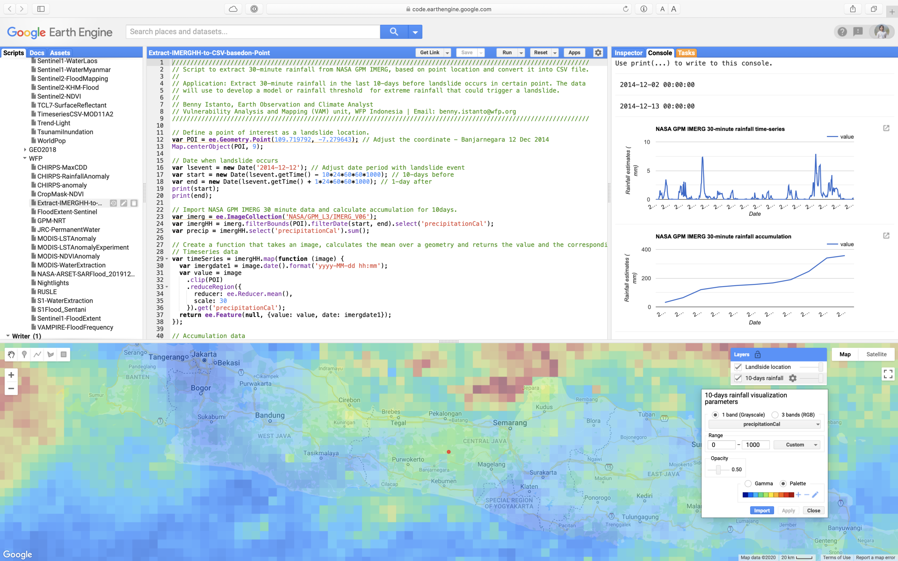

### Jemblung Landslide - Banjarnegara 2014

Landslide occured on 12 Dec 2014 in Jemblung of Sampang village, Karangkobar sub-district, Banjarnegara district, Central Java (109.719792, -7.279643) at about 5:30 pm. The [event](https://www.bbc.com/indonesia/berita_indonesia/2014/12/141213_indonesia_longsor_banjarnegara) affected settlement area with more than 300 population (53 households). Victims recorded including 15 injured, 108 death (95 bodies found and 13 lost).

Two days prior to the landslide (10–11 Dec), rainfall intensity in the area had been [very high](http://regional.kompas.com/read/2014/12/12/23380641/53.KK.di.Banjarnegara.Dikabarkan.Tertimbun.Material.Longsor.), but as the area isnt located near ground weather station, records aren’t available.

Recent development in opendata allows more access to high resolution climate/weather data and to computing platform that allows users to run geospatial analysis in the cloud. This leads to further exploration like never before.

Open access to 30 mins temporal rainfall data at [Google Earth Engine](https://earthengine.google.com) platform provided detail information on rainfall intensity during 10–11 Dec 2014 prior to the landslide in Banjarnegara. Such information help advancing research on rainfall model or identification of threshold for extreme rainfall that could trigger a landslide.

The steps below describe how to extract 30-minute rainfall from NASA [GPM-IMERG](https://gpm.nasa.gov/GPM), based on point location and convert it into CSV file using Google Earth Engine code editor.

**Step 1:** Define a point of interest as a landslide location.

```js
// Define a point of interest as a landslide location.
var POI = ee.Geometry.Point(109.719792, -7.279643); // Adjust the coordinate - Banjarnegara 12 Dec 2014
Map.centerObject(POI, 9);
```

**Step 2:** Choose date when landslide was occurred

```js
// Date when landslide occurs
var lsevent = new Date('2014-12-12'); // Adjust date period with landslide event
var start = new Date(lsevent.getTime() - 10*24*60*60*1000); // 10-days before
var end = new Date(lsevent.getTime() + 1*24*60*60*1000); // 1-day after
print(start);
print(end);
```

**Step 3:** Import NASA GPM IMERG 30 minute data and calculate accumulation for 10days.

```js
// Import NASA GPM IMERG 30 minute data and calculate accumulation for 10days.
var imerg = ee.ImageCollection('NASA/GPM_L3/IMERG_V06');
var imergHH = imerg.filterBounds(POI).filterDate(start, end).select('precipitationCal');
var precip = imergHH.select('precipitationCal').sum();
```

**Step 4:** Extract the rainfall value as time-series data

```js
// Create a function that takes an image, calculates the mean over a geometry and returns the value and the corresponding date as a feature.

// Timeseries data
var timeSeries = imergHH.map(function (image) {
var imergdate1 = image.date().format('yyyy-MM-dd hh:mm');
var value = image.clip(POI).reduceRegion({reducer: ee.Reducer.mean(), scale: 30}).get('precipitationCal');
return ee.Feature(null, {value: value, date: imergdate1});
});
```



**Step 5:** Extract the rainfall value as accumulation data

```js
// Based on input from Daniel Wiell via GIS StackExchange
// https://gis.stackexchange.com/questions/360611/extract-time-series-rainfall-from-multiple-point-with-date-information/
// Accumulation data
var days = ee.Date(end).difference(ee.Date(start), 'days');
var dayOffsets = ee.List.sequence(1, days);
var accumulation = dayOffsets.map(
function (dayOffset) {
var endDate = ee.Date(start).advance(ee.Number(dayOffset), 'days');
var image = imergHH.filterDate(start, endDate).sum();
var date = endDate.advance(-1, 'days').format('yyyy-MM-dd');
var value = image.clip(POI).reduceRegion({reducer: ee.Reducer.mean(), geometry: POI, scale: 30}).get('precipitationCal');
return ee.Feature(null, {value: value, date: date});
});
```



**Step 6:** Visualise time-series data as a chart

```js
// Create a graph of the time-series.
var graphTS = ui.Chart.feature.byFeature(timeSeries,'date', ['value']);
print(graphTS.setChartType("LineChart")
.setOptions({title: 'NASA GPM IMERG 30-minute rainfall time-series',
vAxis: {title: 'Rainfall estimates (mm)'},
hAxis: {title: 'Date'}}));
```

**Step 7:** Visualise accumulation data as a chart

```js
// Create a graph of the accumulation.
var graphAcc = ui.Chart.feature.byFeature(accumulation,'date', ['value']);
print(graphAcc.setChartType("LineChart")
 .setOptions({title: 'NASA GPM IMERG 30-minute rainfall accumulation',
 vAxis: {title: 'Rainfall estimates (mm)'},
 hAxis: {title: 'Date'}}));
```

**Step 8:** Create visualisation paramaters for rainfall and add it into canvas

```js
// Rainfall vis parameter
var palette = [ '000096','0064ff', '00b4ff', '33db80', '9beb4a', 'ffeb00', 'ffb300', 'ff6400', 'eb1e00', 'af0000'];
var precipVis = {min: 0.0, max: 1000.0, palette: palette, opacity:0.5};

// Add layer into canvas
Map.addLayer(precip, precipVis, "10-days rainfall", false);
Map.addLayer(POI, {color: "#ff0000"}, "Landlside location", true);
```

**Step 9:** Export the data to Google Drive as a CSV file.

```js
// Export the result to Google Drive as a CSV.
Export.table.toDrive({collection: timeSeries, description:'LS_69421', folder:'GEE', selectors: 'date, value', fileFormat: 'CSV'});

// End of script
```



Full script [here](https://code.earthengine.google.com/9f07654e768a7dc55cc7710d07fafcdd)

### To do

1. Get NASA Global Landslide Catalog from [here](https://gpm.nasa.gov/landslides/about.html)
2. Create Landslide list (OBJECTID, Lon, Lat, Date YYYY-MM-DD)
3. Enhance the script to be able read Location (Lon and Lat) and Date information from CSV GEE assets, and loop *Export.table.toDrive* with description based on *OBJECTID*