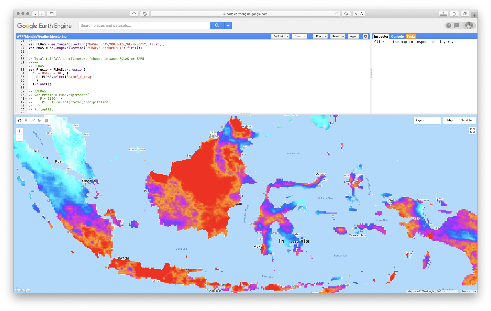
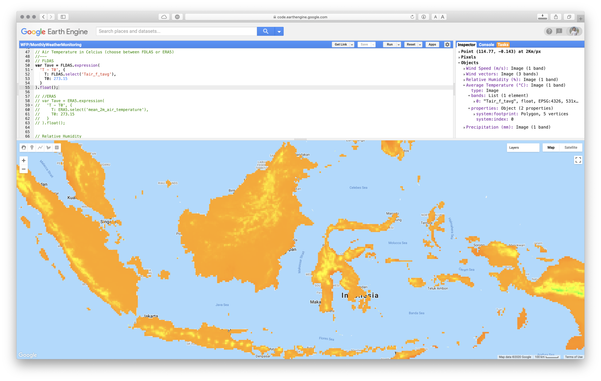
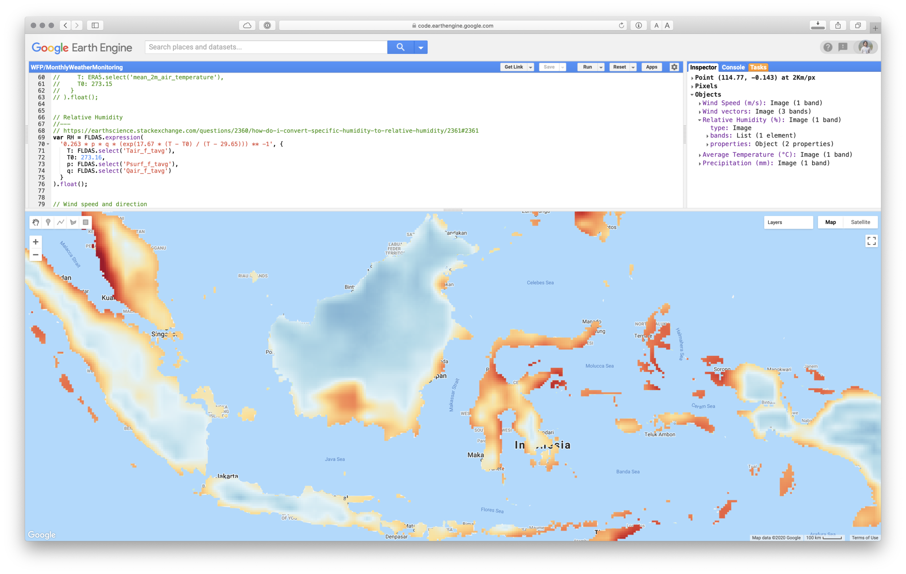
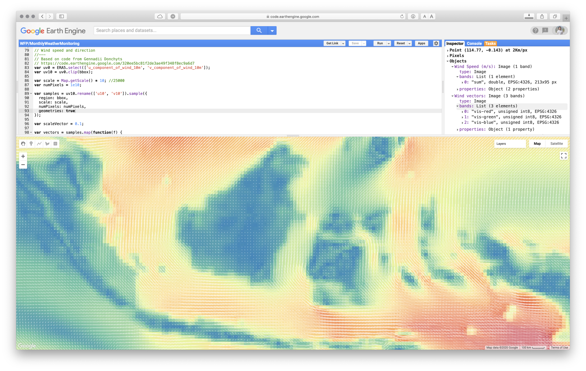

Since 2015, considerable amount of new data (high resolution satellite-based product combined with social media data) developed using new technology through artificial intelligence (machine learning, computer vision, etc.) available for public, but further utilisation remains lack.

Now in cloud computing era, we can easily get instant access to massive weather and climate data and do processing from the browser via Google Earth Engine platform.

Let’s try to access monthly weather data from NASA and ECMWF:

* <https://developers.google.com/earth-engine/datasets/catalog/NASA_FLDAS_NOAH01_C_GL_M_V001>
* <https://developers.google.com/earth-engine/datasets/catalog/ECMWF_ERA5_MONTHLY>

```js
// Define geographic domain.
//---
var rectangle = ee.Geometry.Rectangle(92, -12, 145, 9); // Indonesia
var bbox = ee.Feature(rectangle).geometry(); 
Map.setCenter(118, -3, 6);
```

Import above data from EE Data Catalog

```js
// Import latest data from GLDAS and ERA5
//---
var FLDAS = ee.ImageCollection("NASA/FLDAS/NOAH01/C/GL/M/V001").first(); 
var ERA5 = ee.ImageCollection("ECMWF/ERA5/MONTHLY").first();
```

### Precipitation

Access the precipitation data, visualise it and add to the map layer

* Precipitation unit in FLDAS data: “kg m-2 s-1”, is the International System of Units (SI) used for precipitation. While 1kg = 1Liter = 10e6 mm3 and 1m2 = 10e6 mm2. Therefore 1kg of rain over 1 m2 is equivalent to 1mm.
* Multiply the rate (given in kg m-2 s-1) by 1 to get the rainfall in terms of mm/second. Or multiply the value by 24\*60\*60 to get the total rainfall in mm per day. 1 kg/m2/s-1 = 86400 mm/day
* For the monthly value, daily value can be multiplied by the number of days e.g. 86400 x kg/m2/s x number of days in a month (28/29/30/31).
* Precipitation in ERA5 data is in m, so we need to multiply it by 1000 to get mm.

```js
// Total rainfall in milimeters (choose between FDLAS or EAR5)
//---
// FLDAS
var Precip = FLDAS.expression(
  'P * 86400 * 30', {
    P: FLDAS.select('Rainf_f_tavg')
    }
  ).float();

// //ERA5
// var Precip = ERA5.expression(
//   'P * 1000', {
//     P: ERA5.select('total_precipitation')
//   }
// ).float();

// Visualization palette for total precipitation
var PrecipVis = {
  min: 0, 
  max: 400, 
  palette: ['#FFFFFF', '#00FFFF', '#0080FF', '#DA00FF', '#FFA400','#FF0000']
};

// Add map to layer
Map.addLayer(Precip.clip(bbox), PrecipVis, 'Precipitation (mm)', true);
```



### Temperature data

* Kelvin to Celsius temperature conversion can be done by subtracting 273.15 from the Kelvin temperature in order to obtain the required celsius temperature. The Kelvin scale and the celsius scale are two different temperature scales which are related by the following formula: K = C + 273.15 (or) C = K - 273.15.

```js
// Air Temperature in Celcius (choose between FDLAS or ERA5)
//---
// FLDAS
var Tave = FLDAS.expression(
  'T - T0', {
    T: FLDAS.select('Tair_f_tavg'),
    T0: 273.15
  }
).float();

// //ERA5
// var Tave = ERA5.expression(
//   'T - T0', {
//     T: ERA5.select('mean_2m_air_temperature'),
//     T0: 273.15
//   }
// ).float();

// Visualization palette for temperature
var TaveVis = {
  min:-20, 
  max:40, 
  palette: ['#000080','#0000D9','#4000FF','#8000FF','#0080FF','#00FFFF','#00FF80','#80FF00','#DAFF00',
          '#FFFF00','#FFF500','#FFDA00','#FFB000','#FFA400','#FF4F00','#FF2500','#FF0A00','#FF00FF']
};

// Add map to layer
Map.addLayer(Tave.clip(bbox), TaveVis, 'Average Temperature (°C)', false);
```



### Relative Humidity

* FLDAS only provide Specific Humidity data, so we need to convert it into Relative Humidity. From equation in this page: <https://earthscience.stackexchange.com/a/2361> we can easily calculate RH as follow:

  $$
  RH = 100 \frac{w}{w_s} \approx 0.263 \, p \, q \left[ \exp\left( \frac{17.67\,(T - T_0)}{T - 29.65} \right) \right]^{-1}
  $$

  where $p$ is pressure $(\mathrm{Pa})$, $q$ specific humidity $(\mathrm{kg\,kg^{-1}})$,
  $T$ temperature $(\mathrm{K})$ and $T_0 = 273.16\ \mathrm{K}$.

```js
// Relative Humidity
//---
// https://earthscience.stackexchange.com/questions/2360/how-do-i-convert-specific-humidity-to-relative-humidity/2361#2361
var RH = FLDAS.expression(
  '0.263 * p * q * (exp(17.67 * (T - T0) / (T - 29.65))) ** -1', {
    T: FLDAS.select('Tair_f_tavg'),
    T0: 273.15,
    p: FLDAS.select('Psurf_f_tavg'),
    q: FLDAS.select('Qair_f_tavg')
  }
).float();

// Relative Humidity visualisation
var rhVis = {
  min: 70,
  max: 100,
  palette: ['a50026', 'd73027', 'f46d43', 'fdae61', 'fee090', 'e0f3f8', 'abd9e9', '74add1', '4575b4', '313695'],
};

// Add map to layer
Map.addLayer(RH.clip(bbox), rhVis, 'Relative Humidity (%)', false);
```



### Wind Speed and Direction

From [Google Earth Engine Developer Groups](https://groups.google.com/g/google-earth-engine-developers/c/OoRSnMhzKhs/m/yszay3zfBQAJ), Gennadii Donchyts share his code on how to visualise wind vector. Lets adapt the code to use with ERA5 data.

```js
// Wind speed and direction
//---
// Based on code from Gennadii Donchyts
// https://code.earthengine.google.com/320ee5bc81f2de3ae49f348f8ec9a6d7
var uv0 = ERA5.select(['u_component_of_wind_10m', 'v_component_of_wind_10m']);
var uv10 = uv0.clip(bbox);

var scale = Map.getScale() * 10; //25000
var numPixels = 1e10;

var samples = uv10.rename(['u10', 'v10']).sample({
  region: bbox, 
  scale: scale, 
  numPixels: numPixels, 
  geometries: true
});

var scaleVector = 0.1;

var vectors = samples.map(function(f) {
  var u = ee.Number(f.get('u10')).multiply(scaleVector);
  var v = ee.Number(f.get('v10')).multiply(scaleVector);
  
  var origin = f.geometry();

  // translate
  var proj = origin.projection().translate(u, v);
  var end = ee.Geometry.Point(origin.transform(proj).coordinates());

  // construct line
  var geom = ee.Algorithms.GeometryConstructors.LineString([origin, end], null, true);
  
  return f.setGeometry(geom);
});

var uv10final = uv10.pow(2).reduce(ee.Reducer.sum()).sqrt();


// Wind speed visualisation
var windVis = {
  min: 0,
  max: 10,
  palette: ['3288bd', '66c2a5', 'abdda4', 'e6f598', 'fee08b', 'fdae61', 'f46d43', 'd53e4f'],
};


// Add map to layer
Map.addLayer(uv10final.clip(bbox), windVis, 'Wind Speed (m/s)', false);
Map.addLayer(vectors.style({ color: 'white', width: 1 }), {}, 'Wind vectors', false);
```



Finally, if you want to download the data, you can add below code:

```js
// Export the result to Google Drive
Export.image.toDrive({
  image:Precip, // Change this variable
  description:'Precip', // Adjust the name
  folder:'GEE', // Adjust the folder inside tyour Google Drive
  scale:30,
  region: bbox,
  maxPixels:1e12
});

// End of script
```

Link for the full [code](https://code.earthengine.google.com/d366a29cbf5d345df7d79a520752c07f)  

**Notes:** The code was compiled from various source (GEE help, GEE Groups, StackExchange)