NOTES - 1 Mar 2022

I have write a new and comprehensive guideline on SPI, you can access via this link <https://bennyistanto.github.io/spi/>

---

I explained in the previous blog [post](/blog/20200706-calculate-spi-using-imerg-data) on how to calculate monthly SPI using daily IMERG data. This time I use [CHIRPS](https://chc.ucsb.edu/data/chirps), because I want to get higher resolution, more frequent monitoring (updated every dekad ~ 10days), and long-term historical data from 1981 – now.

### CHIRPS data acquisition for SPI analysis

#### Download CDO and [install](https://code.mpimet.mpg.de/projects/cdo/wiki#Download-Compile-Install) from [source](https://code.mpimet.mpg.de/projects/cdo/files) or you can install via ```Homebrew``` or ```Conda```
1. Download using ```wget``` all dekad data in netcdf format from Jan 1981 to Jun 2020:
  - ```wget -r https://data.chc.ucsb.edu/products/CHIRPS-2.0/global_dekad/netcdf/```
  
2. Crop with bounding box
  - ```for fl in *.nc; do cdo sellonlatbox,114.3,115.8,-8,-9 $fl bali_cli"_"$fl; done``` ==> bounding box for Bali, with format ```lon1,lon2,lat1,lat2```
  
3. Merge all netcdf in a folder into single netcdf
  - ```cdo mergetime bali_*.nc chirps_dekad.nc```
  
4. Check result and metadata
  - ```ncdump -h chirps_dekad.nc```
  
5. Calculate rolling window accumulation for 3 dekads
  - ```cdo runsum,3 chirps_dekad.nc chirps_monthly_bydekad.nc```
  
6. Check result and metadata
  - ```ncdump -h chirps_monthly_bydekad.nc```
  
7. Extract dekad 1,2 and 3 into separate files
  - ```cdo selday,1 chirps_monthly_bydekad.nc chirps_monthly_bydekad_a01.nc```
  - ```cdo selday,11 chirps_monthly_bydekad.nc chirps_monthly_bydekad_a11.nc```
  - ```cdo selday,21 chirps_monthly_bydekad.nc chirps_monthly_bydekad_a21.nc```
  
8. Edit variable name for longitude to lon, and latitude to lat
  - **Dekad 1**: ```cdo chname,longitude,lon chirps_monthly_bydekad_a01.nc chirps_monthly_bydekad_b01.nc```
  - **Dekad 1**: ```cdo chname,latitude,lat chirps_monthly_bydekad_b01.nc chirps_monthly_bydekad_c01.nc```
  - **Dekad 2**: ```cdo chname,longitude,lon chirps_monthly_bydekad_a11.nc chirps_monthly_bydekad_b11.nc```
  - **Dekad 2**: ```cdo chname,latitude,lat chirps_monthly_bydekad_b11.nc chirps_monthly_bydekad_c11.nc```
  - **Dekad 3**: ```cdo chname,longitude,lon chirps_monthly_bydekad_a21.nc chirps_monthly_bydekad_b21.nc```
  - **Dekad 3**: ```cdo chname,latitude,lat chirps_monthly_bydekad_b21.nc chirps_monthly_bydekad_c21.nc```
  
9. Check result and metadata
  - ```ncdump -h chirps_monthly_bydekad_c01.nc```
  
10. Show attributes
  - ```cdo -s showatts chirps_monthly_bydekad_c01.nc```
  
11. Edit precipitation unit from mm/dekad to mm
  - **Dekad 1**: ```cdo -setattribute,precip@units="mm" chirps_monthly_bydekad_c01.nc chirps_monthly_bydekad_d01.nc```
  - **Dekad 2**: ```cdo -setattribute,precip@units="mm" chirps_monthly_bydekad_c11.nc chirps_monthly_bydekad_d11.nc```
  - **Dekad 3**: ```cdo -setattribute,precip@units="mm" chirps_monthly_bydekad_c21.nc chirps_monthly_bydekad_d21.nc```
  
12. Check result and metadata to make sure everything is set as required to run SPI
  - ```ncdump -h chirps_monthly_bydekad_d01.nc```
  
#### Calculate SPI

In order to pre-compute fitting parameters for later use as inputs to subsequent SPI calculations we can save both gamma and Pearson distributinon fitting parameters to NetCDF, and later use this file as input for SPI calculations over the same calibration period.
  - **Dekad 1**: ```spi --periodicity monthly --scales 1 2 3 6 9 12 24 36 48 60 72 --calibration_start_year 1981 --calibration_end_year 2019 --netcdf_precip /Users/bennyistanto/Temp/CHIRPS/SPI/Regional/chirps_monthly_bydekad_d01.nc --var_name_precip precip --output_file_base /Users/bennyistanto/Temp/CHIRPS/SPI/Regional/Output/CHIRPS_01 --multiprocessing all --save_params /Users/bennyistanto/Temp/CHIRPS/SPI/Regional/Input/CHIRPS_01_fitting.nc --overwrite```
  - **Dekad 2**: ```spi --periodicity monthly --scales 1 2 3 6 9 12 24 36 48 60 72 --calibration_start_year 1981 --calibration_end_year 2019 --netcdf_precip /Users/bennyistanto/Temp/CHIRPS/SPI/Regional/chirps_monthly_bydekad_d11.nc --var_name_precip precip --output_file_base /Users/bennyistanto/Temp/CHIRPS/SPI/Regional/Output/CHIRPS_11 --multiprocessing all --save_params /Users/bennyistanto/Temp/CHIRPS/SPI/Regional/Input/CHIRPS_11_fitting.nc --overwrite```
  - **Dekad 3**: ```spi --periodicity monthly --scales 1 2 3 6 9 12 24 36 48 60 72 --calibration_start_year 1981 --calibration_end_year 2019 --netcdf_precip /Users/bennyistanto/Temp/CHIRPS/SPI/Regional/chirps_monthly_bydekad_d21.nc --var_name_precip precip --output_file_base /Users/bennyistanto/Temp/CHIRPS/SPI/Regional/Output/CHIRPS_21 --multiprocessing all --save_params /Users/bennyistanto/Temp/CHIRPS/SPI/Regional/Input/CHIRPS_21_fitting.nc --overwrite```

- The above command will compute SPI (standardized precipitation index, both gamma and Pearson Type III distributions) from an input precipitation dataset (in this case, CHIRPS precipitation dataset). The input dataset is 3-dekads rainfall accumulation data and the calibration period used will be Jan-1981 through Dec-2019. The index will be computed at 1,2,3,6,9,12,24,36,48,60 and 72-month timescales. The output files will be <out_dir>/CHIRPS_spi_gamma_xx.nc, and <out_dir>/CHIRPS_spi_pearson_xx.nc. Parallelization will occur utilizing all CPUs.

#### **Notes**: Updating procedure when new data is coming

What if the new data is coming (Jul 2020)? Should we re-run again for the whole periods, 1981 to date? That's not practical as it required lot of storage and time processing if you do for bigger coverage (country or regional analysis).
 
To update SPI up to SPI72, we should have data at least 6 years back (2014) from the latest (Jun 2020). To avoid computation for the whole periods (1981-2020), we could extract the data ```chirps_monthly_bydekad.nc``` result from **Step 5** only for year 2014 to 2020, using command: 

  - ```cdo selyear,2014/2020 chirps_monthly_bydekad.nc chirps_monthly_bydekad_a.nc``` 

After that, you can continue the process following above mentioned steps.

In the above example (**Calculate SPI**) we demonstrate how distribution fitting parameters can be saved as NetCDF. This fittings NetCDF can then be used as pre-computed variables in subsequent SPI computations. Initial command computes both distribution fitting values and SPI for various month scales. 

The distribution fitting variables are written to the file specified by the ```--save_params``` option. 

The second command also computes SPI but instead of computing the distribution fitting values it loads the pre-computed fitting values from the NetCDF file specified by the ```--load_params``` option. See below code:

  - **Dekad 1**: ```spi --periodicity monthly --scales 1 2 3 6 9 12 24 36 48 60 72 --calibration_start_year 1981 --calibration_end_year 2019 --netcdf_precip /Users/bennyistanto/Temp/CHIRPS/SPI/Regional/chirps_monthly_bydekad_d01.nc --var_name_precip precip --output_file_base /Users/bennyistanto/Temp/CHIRPS/SPI/Regional/Output/CHIRPS_01 --multiprocessing all --load_params /Users/bennyistanto/Temp/CHIRPS/SPI/Regional/Input/CHIRPS_01_fitting.nc```
  
  - **Dekad 2**: ```spi --periodicity monthly --scales 1 2 3 6 9 12 24 36 48 60 72 --calibration_start_year 1981 --calibration_end_year 2019 --netcdf_precip /Users/bennyistanto/Temp/CHIRPS/SPI/Regional/chirps_monthly_bydekad_d11.nc --var_name_precip precip --output_file_base /Users/bennyistanto/Temp/CHIRPS/SPI/Regional/Output/CHIRPS_11 --multiprocessing all --load_params /Users/bennyistanto/Temp/CHIRPS/SPI/Regional/Input/CHIRPS_11_fitting.nc```
  
  - **Dekad 3**: ```spi --periodicity monthly --scales 1 2 3 6 9 12 24 36 48 60 72 --calibration_start_year 1981 --calibration_end_year 2019 --netcdf_precip /Users/bennyistanto/Temp/CHIRPS/SPI/Regional/chirps_monthly_bydekad_d21.nc --var_name_precip precip --output_file_base /Users/bennyistanto/Temp/CHIRPS/SPI/Regional/Output/CHIRPS_21 --multiprocessing all --load_params /Users/bennyistanto/Temp/CHIRPS/SPI/Regional/Input/CHIRPS_21_fitting.nc```

#### Open the result using [Panoply](https://www.giss.nasa.gov/tools/panoply/)

#### Convert the result to GeoTIFF

To convert the result into GeoTIFF format, you need additional software: GDAL and NCO. Both software can be installed via ```Homebrew``` or ```conda```.

CDO required the variable should be in ```"time, lat, lon"```, while the output from SPI: ```CHIRPS_XX_spi_xxxxx_x_month.nc``` in ```"lat, lon, time"```, you can check this via ```ncdump -h file.nc```

- Let's re-order the variables into ```time,lat,lon``` using ```ncpdq``` command from NCO

  - ```ncpdq -a time,lat,lon CHIRPS_01_spi_gamma_1_month.nc CHIRPS_01_spi_gamma_1_month_rev.nc```
  
- Check result and metadata to make sure everything is correct.

  - ```ncdump -h CHIRPS_01_spi_gamma_1_month_rev.nc```

- Then convert all SPI value into GeoTIFF with ```time``` dimension information as the ```filename``` using CDO and GDAL

  ``` 
  for t in `cdo showdate CHIRPS_01_spi_gamma_1_month_rev.nc`; do
    cdo seldate,$t CHIRPS_01_spi_gamma_1_month_rev.nc dummy.nc
    gdal_translate -of GTiff -a_ullr <top_left_lon> <top_left_lat> <bottom_right_lon> <bottom_right_lat> -a_srs EPSG:4326 -co COMPRESS=LZW -co PREDICTOR=1 dummy.nc $t.tif
  done
  ```

### Example output

SPI 1, 2, 3, 6, 9, 12, 24, 36, 48, 60 and 72-month

::: {.image-gallery}
::: {.gallery-item}
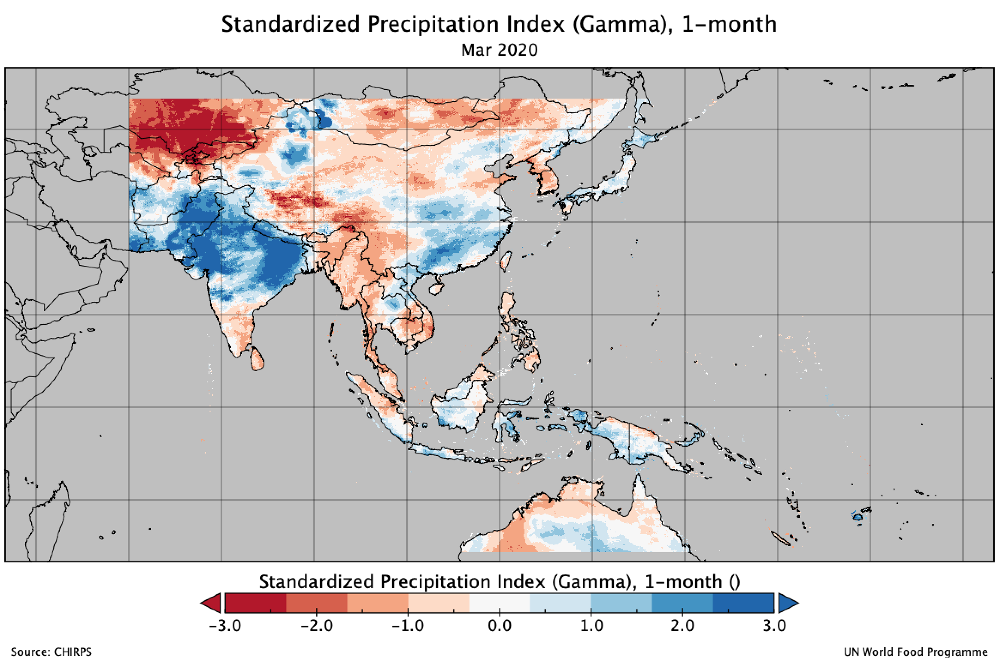
:::
::: {.gallery-item}
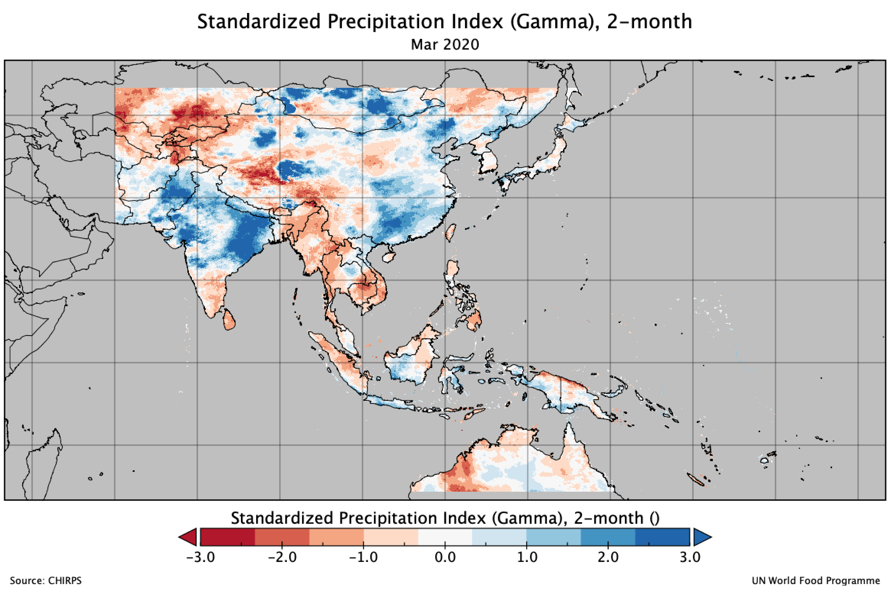
:::
::: {.gallery-item}
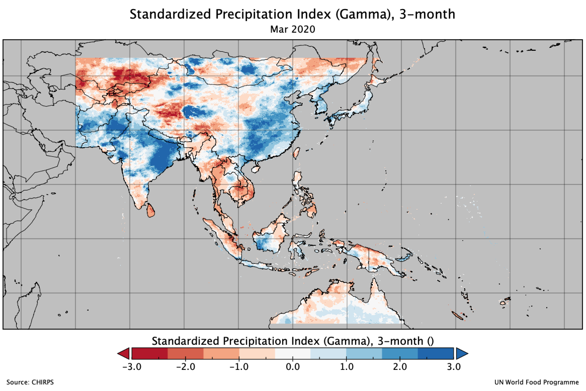
:::
::: {.gallery-item}
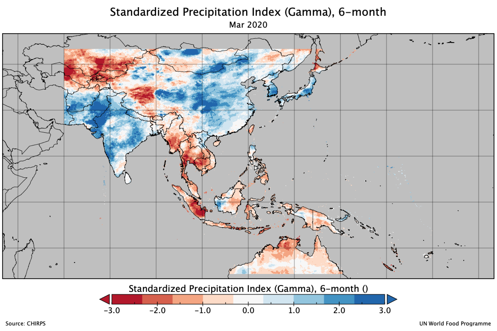
:::
::: {.gallery-item}
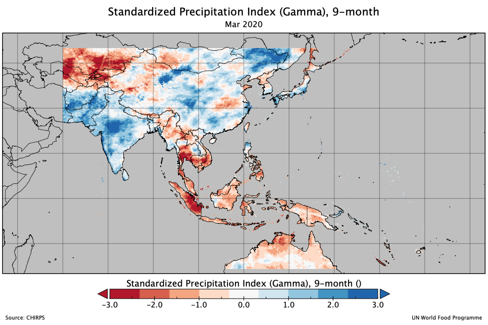
:::
::: {.gallery-item}
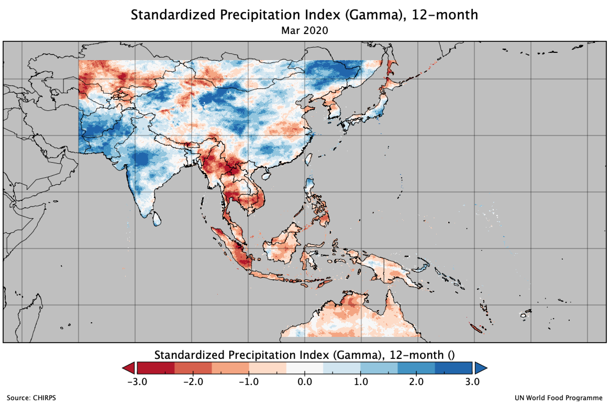
:::
::: {.gallery-item}
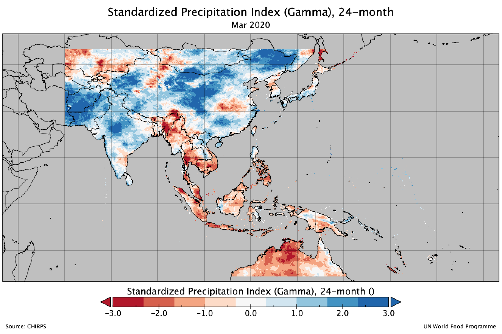
:::
::: {.gallery-item}
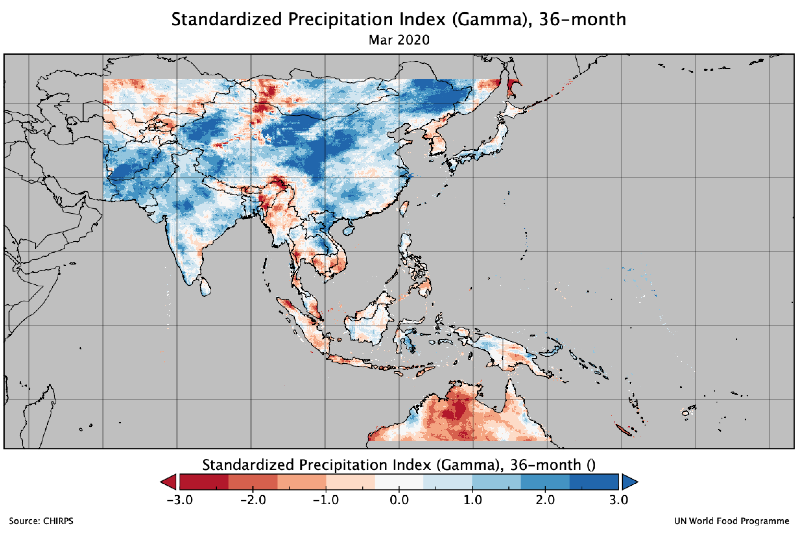
:::
::: {.gallery-item}
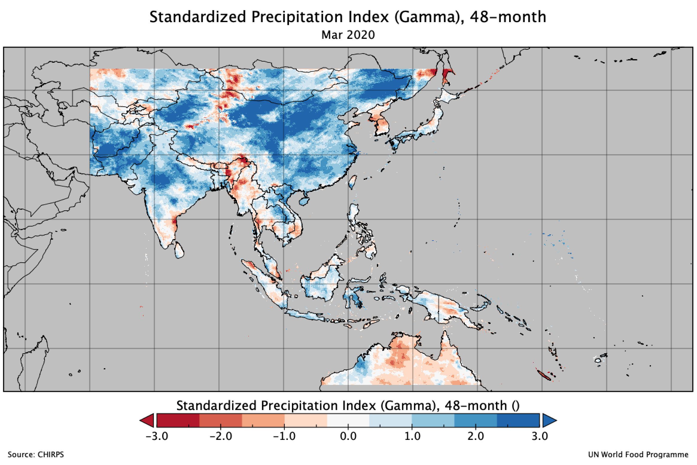
:::
::: {.gallery-item}
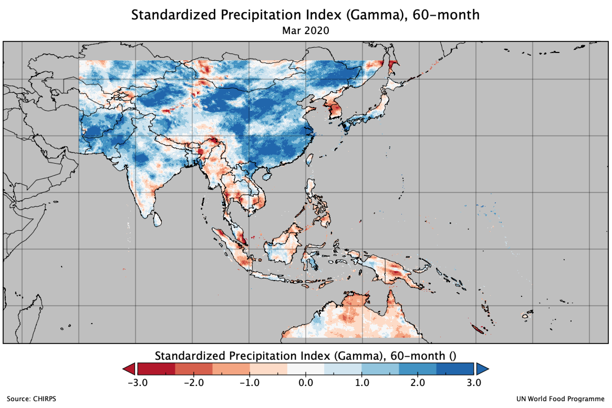
:::
::: {.gallery-item}
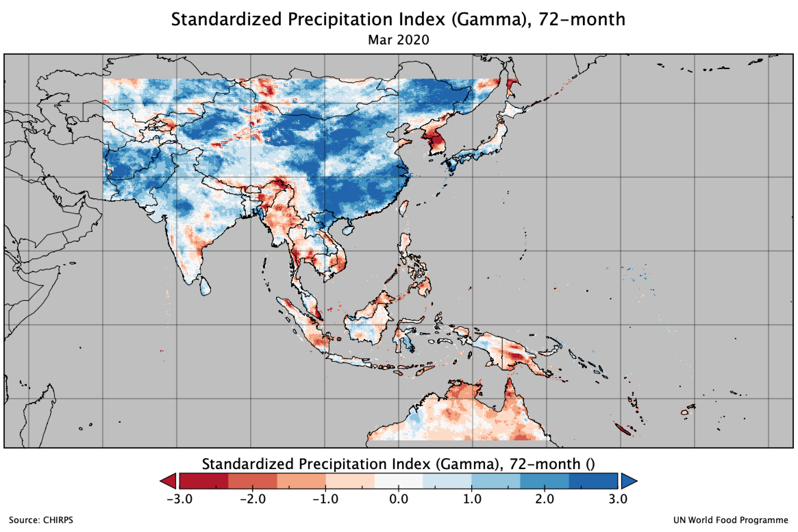
:::
:::

SPI 3-month for Indonesia, March 2020

* WFP’s calculated SPI, based on IMERG
* WFP’s calculated SPI, based on CHIRPS
* [BMKG](https://www.bmkg.go.id), based on weather station. Link: <https://www.bmkg.go.id/iklim/indeks-presipitasi-terstandarisasi.bmkg?p=the-standardized-precipitation-index-maret-2020&tag=spi&lang=ID>
* Climate Engine, based on CHIRPS. Link: <https://climengine.page.link/nTyi>

::: {.image-gallery}
::: {.gallery-item}
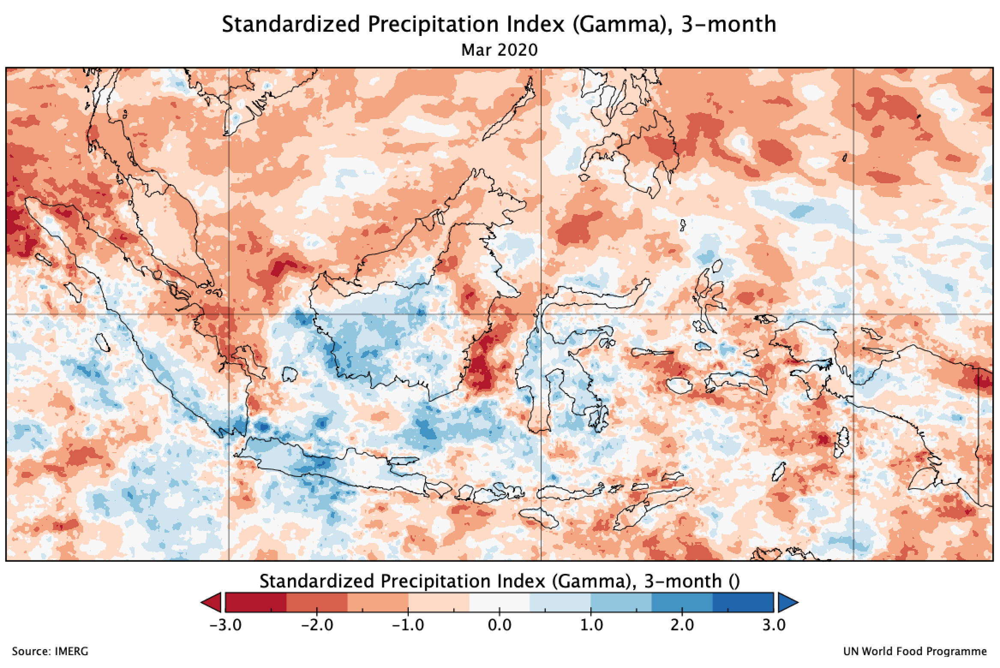
:::
::: {.gallery-item}
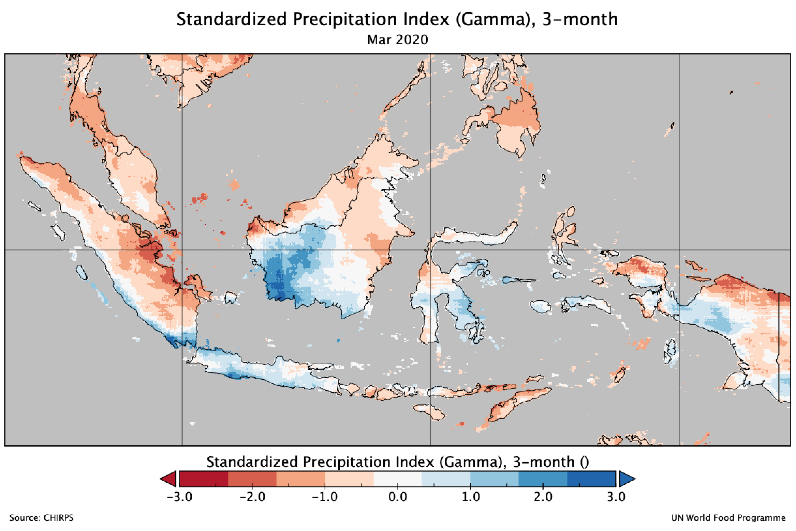
:::
::: {.gallery-item}
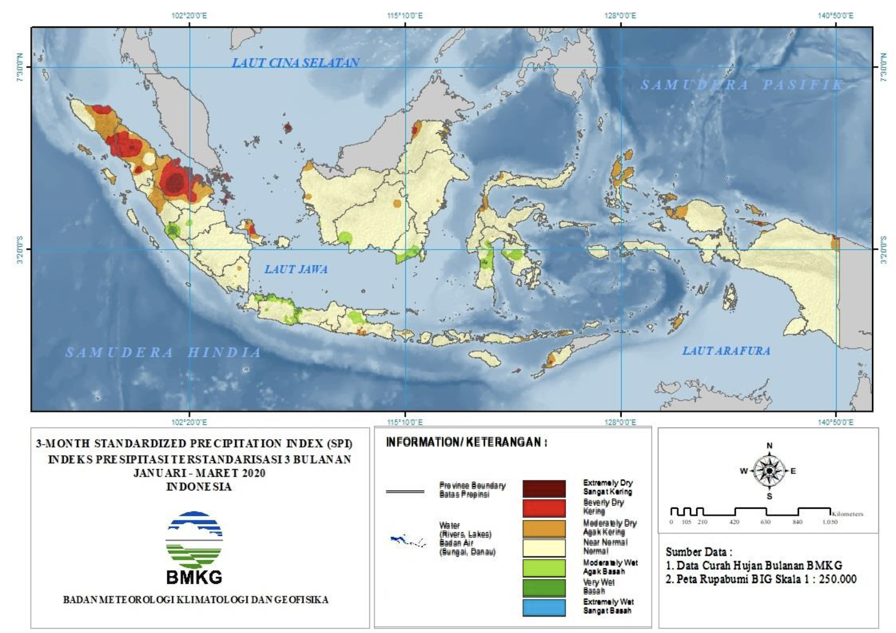
:::
::: {.gallery-item}
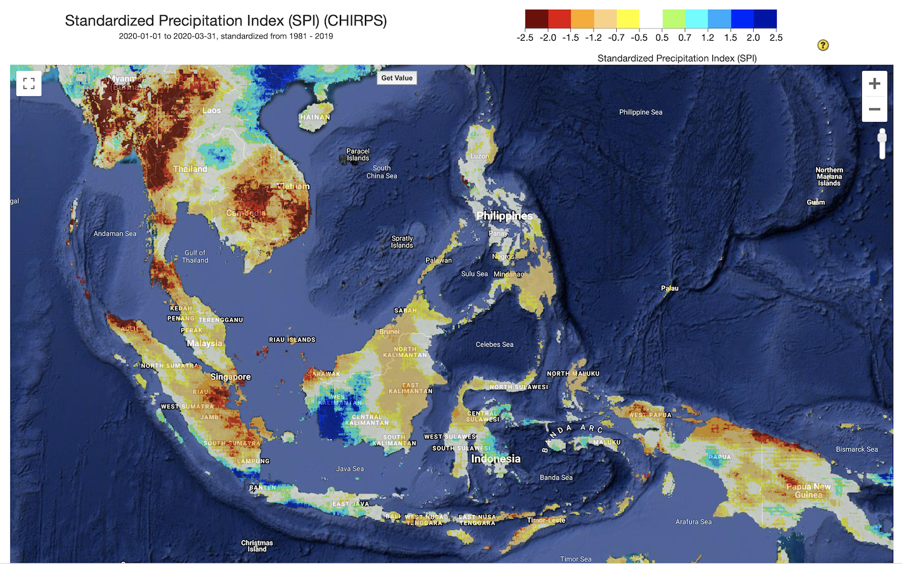
:::
:::

Notes:

Thanks to Yanmarshus Bachtiar for CDO’s tips.