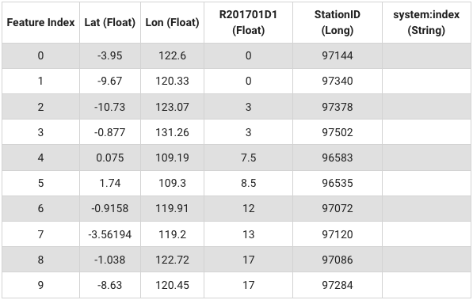
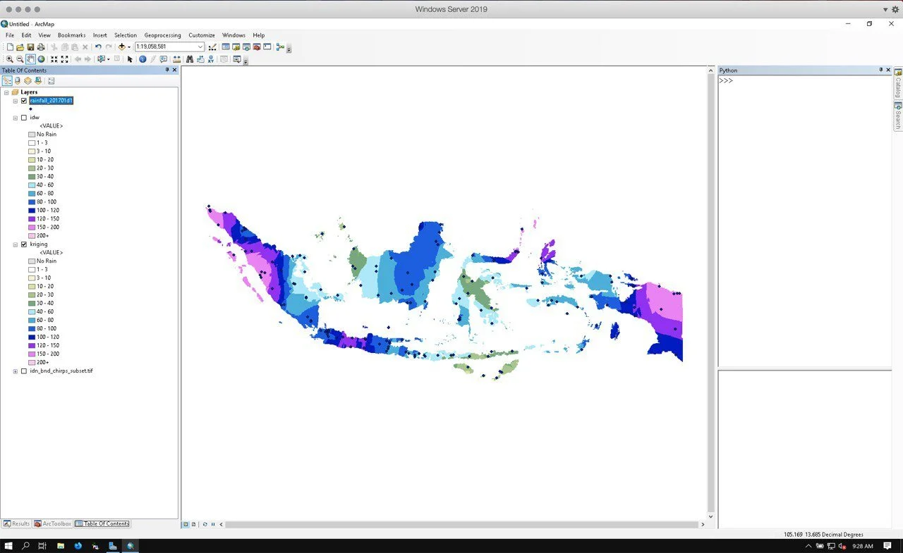
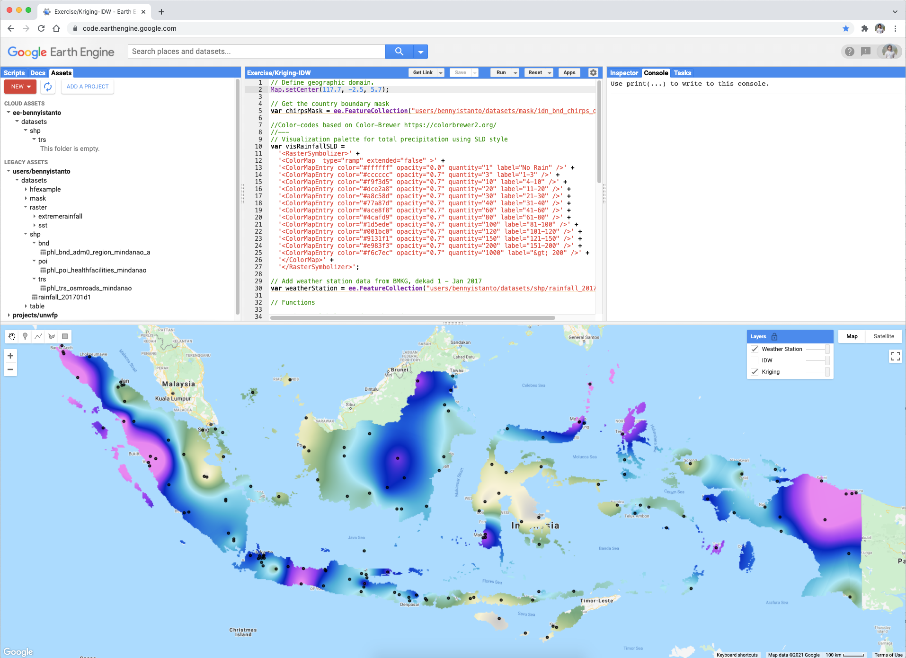
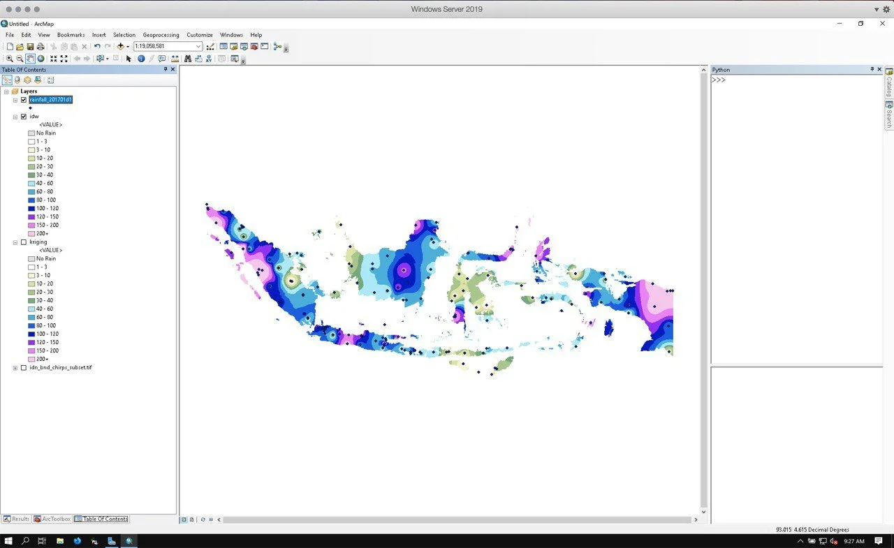
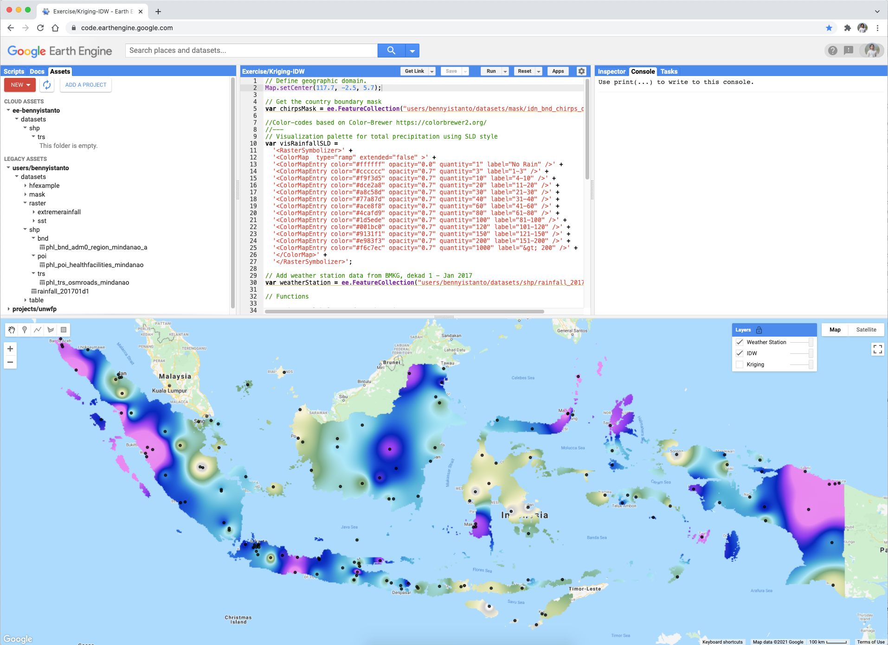

I have automatic weather station coordinates from BMKG, along with example data on precipitation accumulation for 1 - 10 Jan 2017 in csv format with column structure: Lon, Lat, Rainfall.

I uploaded this data into GEE assets, available as Feature Collection and accessible from this address: "users/bennyistanto/datasets/shp/rainfall\_201701d1"



Is it possible to do [Kriging](https://en.wikipedia.org/wiki/Kriging) and [Inverse Distance Weighting](https://en.wikipedia.org/wiki/Inverse_distance_weighting) (IDW) interpolation using Google Earth Engine?

Yes, it is. Follow below script.

::: {.callout-note collapse="true" title="Javascript - GEE Interpolation"}
```js
// Define geographic domain.
Map.setCenter(117.7, -2.5, 5.7);

// Get the country boundary mask
var chirpsMask = ee.FeatureCollection("users/bennyistanto/datasets/mask/idn_bnd_chirps_dissolve"); 

//Color-codes based on Color-Brewer https://colorbrewer2.org/
//---
// Visualization palette for total precipitation using SLD style
var visRainfallSLD =
  '<RasterSymbolizer>' +
  '<ColorMap  type="ramp" extended="false" >' +
  '<ColorMapEntry color="#ffffff" opacity="0.0" quantity="1" label="No Rain" />' +
  '<ColorMapEntry color="#cccccc" opacity="0.7" quantity="3" label="1-3" />' +
  '<ColorMapEntry color="#f9f3d5" opacity="0.7" quantity="10" label="4-10" />' +
  '<ColorMapEntry color="#dce2a8" opacity="0.7" quantity="20" label="11-20" />' +
  '<ColorMapEntry color="#a8c58d" opacity="0.7" quantity="30" label="21-30" />' +
  '<ColorMapEntry color="#77a87d" opacity="0.7" quantity="40" label="31-40" />' +
  '<ColorMapEntry color="#ace8f8" opacity="0.7" quantity="60" label="41-60" />' +
  '<ColorMapEntry color="#4cafd9" opacity="0.7" quantity="80" label="61-80" />' +
  '<ColorMapEntry color="#1d5ede" opacity="0.7" quantity="100" label="81-100" />' +
  '<ColorMapEntry color="#001bc0" opacity="0.7" quantity="120" label="101-120" />' +
  '<ColorMapEntry color="#9131f1" opacity="0.7" quantity="150" label="121-150" />' +
  '<ColorMapEntry color="#e983f3" opacity="0.7" quantity="200" label="151-200" />' +
  '<ColorMapEntry color="#f6c7ec" opacity="0.7" quantity="1000" label="&gt; 200" />' +
  '</ColorMap>' +
  '</RasterSymbolizer>';

// Add weather station data from BMKG, dekad 1 - Jan 2017
var weatherStation = ee.FeatureCollection("users/bennyistanto/datasets/shp/rainfall_201701d1");

// Functions

// Estimate global mean from the points.
var meanStats = weatherStation.reduceColumns({
  reducer: 'mean',
  selectors: ['R201701D1']
});

// Estimate standard deviation (SD) from the points.
var StdStats = weatherStation.reduceColumns({
  reducer: 'stdDev',
  selectors: ['R201701D1']
});


// Do the interpolation
// IDW
var draftIDW = weatherStation.inverseDistance({
  range: 1e6,
  propertyName: 'R201701D1',
  mean: meanStats.get('mean'),
  stdDev: StdStats.get('stdDev'),
});

// Kriging
var draftKriging = weatherStation.kriging({
  propertyName: 'R201701D1',
  shape: 'exponential',
  range: 1e6,
  sill: 1.0,
  nugget: 0.1,
  maxDistance: 1e6,
  reducer: 'mean',
});

// Mask result
var IDW = draftIDW.clip(chirpsMask);
var Kriging = draftKriging.clip(chirpsMask);

// Add to map
Map.addLayer(Kriging.sldStyle(visRainfallSLD), {}, 'Kriging', false);
Map.addLayer(IDW.sldStyle(visRainfallSLD), {}, 'IDW', false);
Map.addLayer(weatherStation,{},'Weather Station', true);
```
:::

Full [link](https://code.earthengine.google.com/4fd323b121042988ecfd8df2e9d977b7)

See below comparison from ArcGIS and GEE for both method. The pattern is slightly different due to GEE’s layer visualised using stretched colour while ArcGIS’s layer visualised using classified colour.

::: {.image-gallery}
::: {.gallery-item}

:::
::: {.gallery-item}

:::
::: {.gallery-item}

:::
::: {.gallery-item}

:::
:::