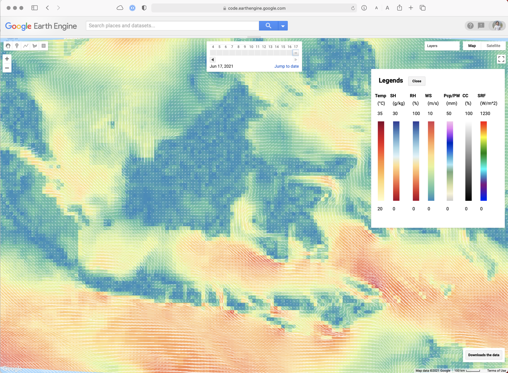
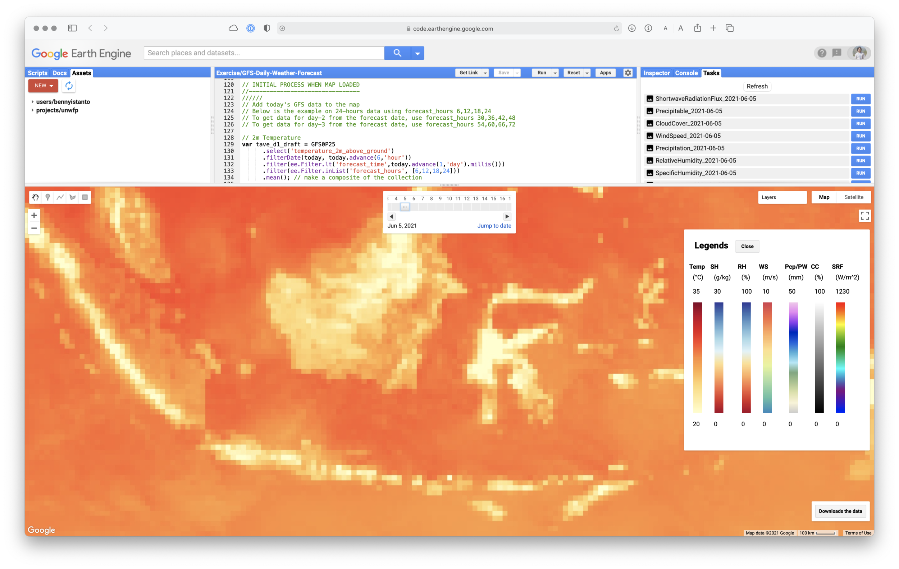
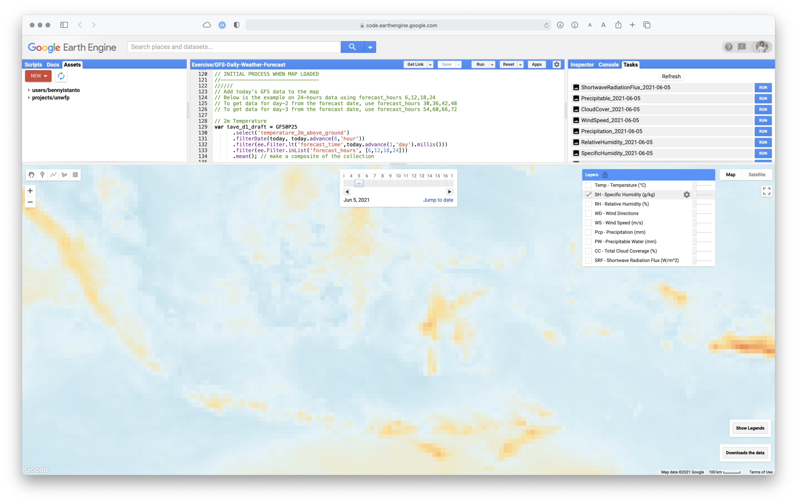
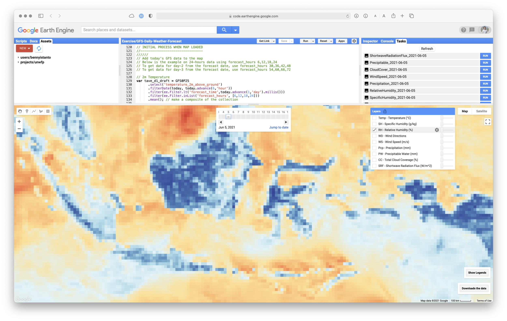
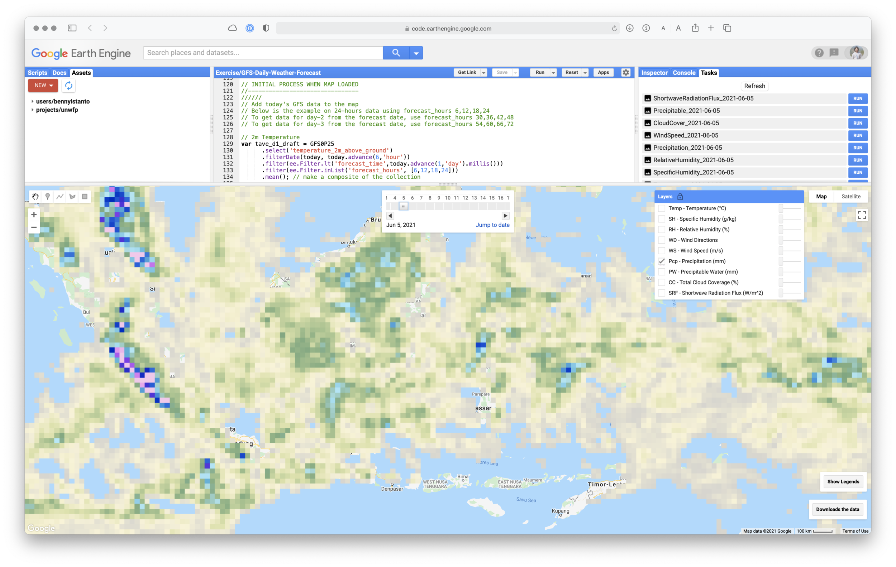
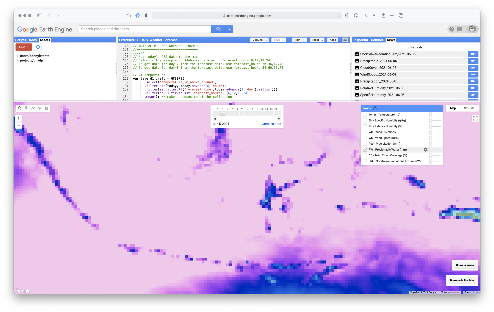
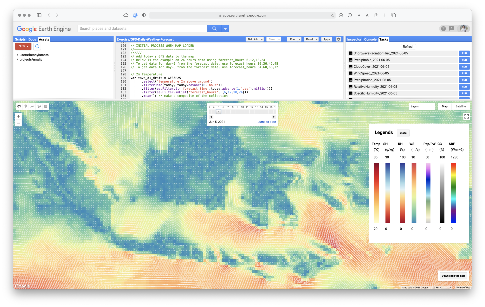
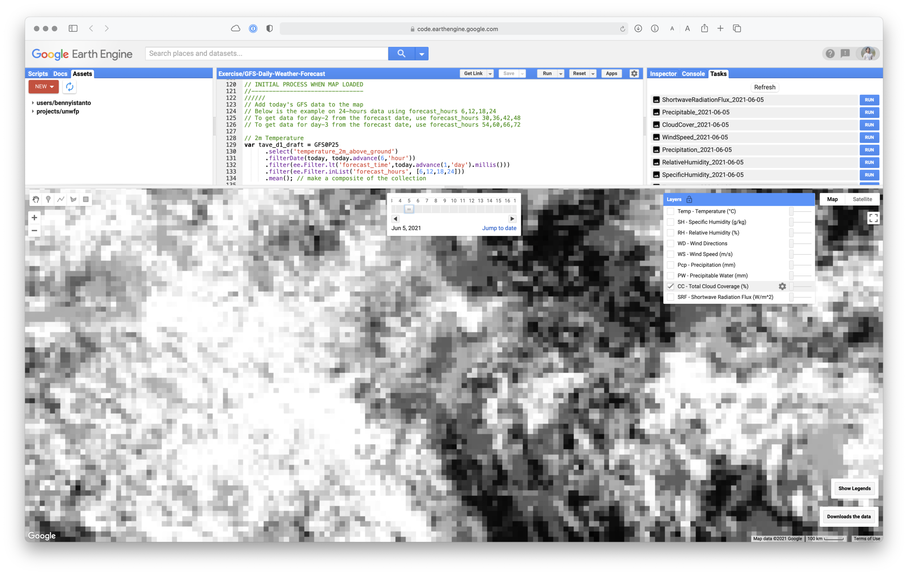
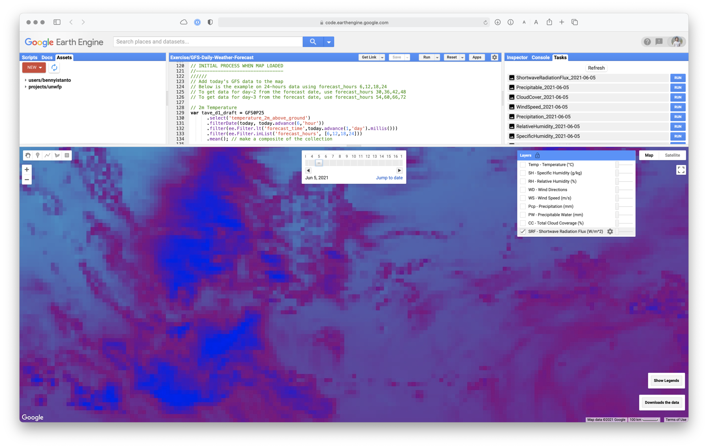

Since few years ago [NOAA](https://www.ncdc.noaa.gov) [Global Forecast Data](https://www.ncdc.noaa.gov/data-access/model-data/model-datasets/global-forcast-system-gfs) (GFS) available at [Google Earth Engine](https://earthengine.google.com) (GEE), which makes it easier to access even though there are only [9 variables](https://developers.google.com/earth-engine/datasets/catalog/NOAA_GFS0P25#bands) out of hundreds available.

Accessing GFS data is tricky, because it can get pretty confusing with the timing. I have discussed it before on [access GFS via GRIB filter](/blog/20210413-how-to-get-daily-rainfall-forecast-data-from-gfs-part1) and [getting GFS rainfall forecast using GEE](/blog/20210416-how-to-get-daily-rainfall-forecast-data-from-gfs-part-2).

Let’s start write the code. I would like to visualize all the 9-variable of GFS data using GEE.

First step is to define the geographic domain and write the symbology for all variable. Each variable will have different min-max value and palette.

::: {.callout-note collapse="true" title="Javascript - INITIALISATION AND SYMBOLOGY"}
```js
// INITIALISATION AND SYMBOLOGY
//-----------------------------
//////
// Center of the map
Map.setCenter(118, -2.5, 6);

// Define geographic domain.
//---
var rectangle = ee.Geometry.Rectangle(92, -12, 145, 9); // Indonesia
var bbox = ee.Feature(rectangle).geometry(); 


//Color-codes based on Color-Brewer https://colorbrewer2.org/
//---
// Temperature visualisation
var visTave = {
  min: 20, 
  max: 35, 
  palette: ['ffffcc','ffeda0','fed976','feb24c',
  'fd8d3c','fc4e2a','e31a1c','bd0026','800026']
};

// Specific Humidity visualisation
var visSH = {
  min: 0,
  max: 30,
  palette: ['a50026', 'd73027', 'f46d43', 'fdae61', 'fee090', 
  'e0f3f8', 'abd9e9', '74add1', '4575b4', '313695'],
};

// Relative Humidity visualisation
var visRH = {
  min: 50,
  max: 100,
  palette: ['a50026', 'd73027', 'f46d43', 'fdae61', 'fee090', 
  'e0f3f8', 'abd9e9', '74add1', '4575b4', '313695'],
};

// Wind speed visualisation
var visWind = {
  min: 0,
  max: 10,
  palette: ['3288bd', '66c2a5', 'abdda4', 'e6f598', 
  'fee08b', 'fdae61', 'f46d43', 'd53e4f'],
};

// Total precipitation visualisation
var visPcp = {
  min: 0, 
  max: 50, 
  palette: [
    'cccccc','f9f3d5','dce2a8','a8c58d','77a87d','ace8f8',
    '4cafd9','1d5ede','001bc0','9131f1','e983f3','f6c7ec'
  ]};

// Precipitable water visualisation
var visPW = {
  min: 0, 
  max: 50, 
  palette: [
    'cccccc','f9f3d5','dce2a8','a8c58d','77a87d','ace8f8',
    '4cafd9','1d5ede','001bc0','9131f1','e983f3','f6c7ec'
  ]};

// Total cloud coverage visualisation
var visCC = {
  min: 0, 
  max: 100, // dataset max is 100
  palette: ['black','white']
  
};

// Shortwave radiation visualisation
var visSR = {
  min: 0,
  max: 1230,
  palette: ['blue', 'purple', 'cyan', 'green', 'yellow', 'red'],
};
```
:::

Now set the date and data.

::: {.callout-note collapse="true" title="Javascript - DATE AND DATA"}
```js
// DATE AND DATA
//--------------------------------
//////
// Strip time off current date/time
var today = ee.Date(new Date().toISOString().split('T')[0]);
print(today);


// GFS Dataset Availability:
// https://developers.google.com/earth-engine/datasets/catalog/NOAA_GFS0P25#citations
var start_period = ee.Date('2019-11-07'); // First GFS data 1 Jul 2015


// MAIN INPUT
//-----------
//////
// Create function to import GFS data - https://developers.google.com/earth-engine/datasets/catalog/NOAA_GFS0P25
// 24-hours/1-day forecast from selected date
var GFS0P25 = ee.ImageCollection('NOAA/GFS0P25');
```
:::

Now as the initial process when map loaded, create new variable for each band, select the bands and do filtering based on date and “*forecast\_hours*”. The focus is only grab 1-day forecast, so I will use forecast hours 6,12,18,24.

I will adapt script from [Gennadii Donchyts](https://groups.google.com/g/google-earth-engine-developers/c/OoRSnMhzKhs/m/yszay3zfBQAJ) to visualize Wind Direction as a vector.

::: {.callout-note collapse="true" title="Javascript - INITIAL PROCESS WHEN MAP LOADED"}
```js
// INITIAL PROCESS WHEN MAP LOADED
//--------------------------------
//////
// Add today's GFS data to the map
// Below is the example on 24-hours data using forecast_hours 6,12,18,24
// To get data for day-2 from the forecast date, use forecast_hours 30,36,42,48
// To get data for day-3 from the forecast date, use forecast_hours 54,60,66,72

// 2m Temperature
var tave_d1_draft = GFS0P25 
      .select('temperature_2m_above_ground')
      .filterDate(today, today.advance(6,'hour'))
      .filter(ee.Filter.lt('forecast_time',today.advance(1,'day').millis()))
      .filter(ee.Filter.inList('forecast_hours', [6,12,18,24]))
      .mean(); // make a composite of the collection

var tave_d1 = tave_d1_draft.clip(bbox);


// 2m Specific Humidity
var sh_d1_draft = GFS0P25 
      .select('specific_humidity_2m_above_ground')
      .filterDate(today, today.advance(6,'hour'))
      .filter(ee.Filter.lt('forecast_time',today.advance(1,'day').millis()))
      .filter(ee.Filter.inList('forecast_hours', [6,12,18,24]))
      .mean(); // make a composite of the collection

// SH unit in GFS is kg/kg, I want to convert it to g/kg
// This means that such humidity is expressed as the amount of 
// water vapour (in grams) present in each kilogram of air
var sh_d1 = sh_d1_draft.expression(
  'SHg = SHkg * 1000', {
    'SHkg': sh_d1_draft.select('specific_humidity_2m_above_ground')
}).float().clip(bbox);


// 2m Relative Humidity
var rh_d1_draft = GFS0P25 
      .select('relative_humidity_2m_above_ground')
      .filterDate(today, today.advance(6,'hour'))
      .filter(ee.Filter.lt('forecast_time',today.advance(1,'day').millis()))
      .filter(ee.Filter.inList('forecast_hours', [6,12,18,24]))
      .mean(); // make a composite of the collection

var rh_d1 = rh_d1_draft.clip(bbox);


// 10m wind
var uv_d1_draft = GFS0P25
  .select(['u_component_of_wind_10m_above_ground', 'v_component_of_wind_10m_above_ground'])
  .filterDate(today, today.advance(6,'hour'))
  .filter(ee.Filter.lt('forecast_time',today.advance(1,'day').millis()))
  .filter(ee.Filter.inList('forecast_hours', [6,12,18,24]))
  .mean(); // make a composite of the collection
  
  // Wind speed and direction
  //---
  // Based on code from Gennadii Donchyts
  // https://code.earthengine.google.com/320ee5bc81f2de3ae49f348f8ec9a6d7
  var uv_d1_0 = uv_d1_draft.clip(bbox);
  
  var scale = Map.getScale() * 10; //25000
  var numPixels = 1e10;
  
  var samples = uv_d1_0.rename(['u10', 'v10']).sample({
    region: bbox, 
    scale: scale, 
    numPixels: numPixels, 
    geometries: true
  });
  
  var scaleVector = 0.1;
  
  var vectors_d1 = samples.map(function(f) {
    var u = ee.Number(f.get('u10')).multiply(scaleVector);
    var v = ee.Number(f.get('v10')).multiply(scaleVector);
    
    var origin = f.geometry();
  
    // translate
    var proj = origin.projection().translate(u, v);
    var end = ee.Geometry.Point(origin.transform(proj).coordinates());
  
    // construct line
    var geom = ee.Algorithms.GeometryConstructors.LineString([origin, end], null, true);
    
    return f.setGeometry(geom);
  });
  
  var uv_d1 = uv_d1_0.pow(2).reduce(ee.Reducer.sum()).sqrt();


// Precipitation
var pcp_d1_draft = GFS0P25 
      .select('total_precipitation_surface')
      .filterDate(today, today.advance(6,'hour'))
      .filter(ee.Filter.lt('forecast_time',today.advance(1,'day').millis()))
      .filter(ee.Filter.inList('forecast_hours', [6,12,18,24]))
      .sum(); // make a composite of the collection

var pcp_d1 = pcp_d1_draft.updateMask(pcp_d1_draft.gt(1)).clip(bbox);


// Precipitable Water
var pw_d1_draft = GFS0P25 
      .select('precipitable_water_entire_atmosphere')
      .filterDate(today, today.advance(6,'hour'))
      .filter(ee.Filter.lt('forecast_time',today.advance(1,'day').millis()))
      .filter(ee.Filter.inList('forecast_hours', [6,12,18,24]))
      .mean(); // make a composite of the collection
  
var pw_d1 = pw_d1_draft.clip(bbox);


// Total Cloud Cover
var cc_d1_draft = GFS0P25 
      .select('total_cloud_cover_entire_atmosphere')
      .filterDate(today, today.advance(6,'hour'))
      .filter(ee.Filter.lt('forecast_time',today.advance(1,'day').millis()))
      .filter(ee.Filter.inList('forecast_hours', [6,12,18,24]))
      .mean(); // make a composite of the collection

var cc_d1 = cc_d1_draft.clip(bbox);


// Downward Shortwave Radiation Flux
var sr_d1_draft = GFS0P25 
      .select('downward_shortwave_radiation_flux')
      .filterDate(today, today.advance(6,'hour'))
      .filter(ee.Filter.lt('forecast_time',today.advance(1,'day').millis()))
      .filter(ee.Filter.inList('forecast_hours', [6,12,18,24]))
      .mean(); // make a composite of the collection

var sr_d1 = sr_d1_draft.clip(bbox);
```
:::

Next script will be adding all layer to the display.

I am planning to use [Date Slider](https://developers.google.com/earth-engine/apidocs/ui-dateslider) widget, so the user can easily change the date then the map will automatically change. To support that plan, I need to add Reset procedure, so every change on the data, all layers will get refresh.

::: {.callout-note collapse="true" title="Javascript - Map Layer"}
```js
// ui Map Layer
// Load the image into map using standard symbology
var layer_sr_d1 = ui.Map.Layer(sr_d1,visSR,'SRF - Shortwave Radiation Flux (W/m^2)', false);
var layer_cc_d1 = ui.Map.Layer(cc_d1,visCC,'CC - Total Cloud Coverage (%)', false);
var layer_pw_d1 = ui.Map.Layer(pw_d1,visPW,'PW - Precipitable Water (mm)', false);
var layer_pcp_d1 = ui.Map.Layer(pcp_d1,visPcp,'Pcp - Precipitation (mm)', false);
var layer_uv_d1 = ui.Map.Layer(uv_d1,visWind,'WS - Wind Speed (m/s)', false);
var layer_vectors_d1 = ui.Map.Layer(vectors_d1.style({ color: 'white', width: 1 }), {}, 'WD - Wind Directions', false);
var layer_rh_d1 = ui.Map.Layer(rh_d1,visRH,'RH - Relative Humidity (%)', false);
var layer_sh_d1 = ui.Map.Layer(sh_d1,visSH,'SH - Specific Humidity (g/kg)', false);
var layer_tave_d1 = ui.Map.Layer(tave_d1,visTave,'Temp - Temperature (°C)', true);

// Reset all layers
Map.layers().reset([
  layer_sr_d1,layer_cc_d1,layer_pw_d1,layer_pcp_d1,
  layer_uv_d1,layer_vectors_d1,layer_rh_d1,layer_sh_d1,layer_tave_d1
  ]);
```
:::

Let’s add Date Slider configuration to Map.

According to the [reference](https://developers.google.com/earth-engine/apidocs/ui-dateslider), Date Slider required some arguments: *start*, *end*, *value*, *period*, *onChange*, *disabled*, *style*

::: {.callout-note collapse="true" title="Javascript - DATE SLIDER CONFIGURATION"}
```js
// DATE SLIDER CONFIGURATION
//--------------------------
//////
var startDate = start_period.getInfo();
var endDate = today.advance(24,'hour').getInfo();

// Slider function
var slider = ui.DateSlider({
  start: startDate.value, 
  end: endDate.value, 
  period: 1, // Every 5 days
  style: {width: '300px', padding: '10px'},
  onChange: renderDateRange
});

Map.add(slider);
```
:::

Then the following code will follow to describe the renderDateRange function when the Date Slide onChange is active. The code is similar with initial process when map loaded above.

::: {.callout-note collapse="true" title="Javascript - Date Slide onChange"}
```js
// Render date range function
function renderDateRange(dateRange) {
  // 24-hours/1-day/Day-1 forecast from selected date
  // 2m Temperature
  var tave_d1_draft = GFS0P25 
        .select('temperature_2m_above_ground')
        .filterDate(dateRange.start(), dateRange.end().advance(6,'hour'))
        .filter(ee.Filter.lt('forecast_time',today.advance(1,'day').millis()))
        .filter(ee.Filter.inList('forecast_hours', [6,12,18,24]))
        .mean(); // make a composite of the collection
  
  var tave_d1 = tave_d1_draft.clip(bbox);
  
  
  // 2m Specific Humidity
  var sh_d1_draft = GFS0P25 
        .select('specific_humidity_2m_above_ground')
        .filterDate(dateRange.start(), dateRange.end().advance(6,'hour'))
        .filter(ee.Filter.lt('forecast_time',today.advance(1,'day').millis()))
        .filter(ee.Filter.inList('forecast_hours', [6,12,18,24]))
        .mean(); // make a composite of the collection
  
  // SH unit in GFS is kg/kg, I want to convert it to g/kg
  // This means that such humidity is expressed as the amount of 
  // water vapour (in grams) present in each kilogram of air
  var sh_d1 = sh_d1_draft.expression(
  'SHg = SHkg * 1000', {
    'SHkg': sh_d1_draft.select('specific_humidity_2m_above_ground')
  }).float().clip(bbox);
  

  
  // 2m Relative Humidity
  var rh_d1_draft = GFS0P25 
        .select('relative_humidity_2m_above_ground')
        .filterDate(dateRange.start(), dateRange.end().advance(6,'hour'))
        .filter(ee.Filter.lt('forecast_time',today.advance(1,'day').millis()))
        .filter(ee.Filter.inList('forecast_hours', [6,12,18,24]))
        .mean(); // make a composite of the collection
  
  var rh_d1 = rh_d1_draft.clip(bbox);
  
  
  // 10m wind
  var uv_d1_draft = GFS0P25
    .select(['u_component_of_wind_10m_above_ground', 'v_component_of_wind_10m_above_ground'])
    .filterDate(dateRange.start(), dateRange.end().advance(6,'hour'))
    .filter(ee.Filter.lt('forecast_time',today.advance(1,'day').millis()))
    .filter(ee.Filter.inList('forecast_hours', [6,12,18,24]))
    .mean(); // make a composite of the collection
    
    // Wind speed and direction
    //---
    // Based on code from Gennadii Donchyts
    // https://code.earthengine.google.com/320ee5bc81f2de3ae49f348f8ec9a6d7
    var uv_d1_0 = uv_d1_draft.clip(bbox);
    
    var scale = Map.getScale() * 10; //25000
    var numPixels = 1e10;
    
    var samples = uv_d1_0.rename(['u10', 'v10']).sample({
      region: bbox, 
      scale: scale, 
      numPixels: numPixels, 
      geometries: true
    });
    
    var scaleVector = 0.1;
    
    var vectors_d1 = samples.map(function(f) {
      var u = ee.Number(f.get('u10')).multiply(scaleVector);
      var v = ee.Number(f.get('v10')).multiply(scaleVector);
      
      var origin = f.geometry();
    
      // translate
      var proj = origin.projection().translate(u, v);
      var end = ee.Geometry.Point(origin.transform(proj).coordinates());
    
      // construct line
      var geom = ee.Algorithms.GeometryConstructors.LineString([origin, end], null, true);
      
      return f.setGeometry(geom);
    });
    
    var uv_d1 = uv_d1_0.pow(2).reduce(ee.Reducer.sum()).sqrt();
  
  
  // Precipitation
  var pcp_d1_draft = GFS0P25 
        .select('total_precipitation_surface')
        .filterDate(dateRange.start(), dateRange.end().advance(6,'hour'))
        .filter(ee.Filter.lt('forecast_time',today.advance(1,'day').millis()))
        .filter(ee.Filter.inList('forecast_hours', [6,12,18,24]))
        .sum(); // make a composite of the collection
  
  var pcp_d1 = pcp_d1_draft.updateMask(pcp_d1_draft.gt(1)).clip(bbox);
  
  
  
  // Precipitable Water
  var pw_d1_draft = GFS0P25 
        .select('precipitable_water_entire_atmosphere')
        .filterDate(dateRange.start(), dateRange.end().advance(6,'hour'))
        .filter(ee.Filter.lt('forecast_time',today.advance(1,'day').millis()))
        .filter(ee.Filter.inList('forecast_hours', [6,12,18,24]))
        .mean(); // make a composite of the collection
  
  var pw_d1 = pw_d1_draft.clip(bbox);
  
  
  
  // Total Cloud Cover
  var cc_d1_draft = GFS0P25 
        .select('total_cloud_cover_entire_atmosphere')
        .filterDate(dateRange.start(), dateRange.end().advance(6,'hour'))
        .filter(ee.Filter.lt('forecast_time',today.advance(1,'day').millis()))
        .filter(ee.Filter.inList('forecast_hours', [6,12,18,24]))
        .mean(); // make a composite of the collection
  
  var cc_d1 = cc_d1_draft.clip(bbox);
  
  
  
  // Downward Shortwave Radiation Flux
  var sr_d1_draft = GFS0P25 
        .select('downward_shortwave_radiation_flux')
        .filterDate(dateRange.start(), dateRange.end().advance(6,'hour'))
        .filter(ee.Filter.lt('forecast_time',today.advance(1,'day').millis()))
        .filter(ee.Filter.inList('forecast_hours', [6,12,18,24]))
        .mean(); // make a composite of the collection
  
  var sr_d1 = sr_d1_draft.clip(bbox);
  
  
  
  // Load the image into map using standard symbology
  var layer_sr_d1 = ui.Map.Layer(sr_d1,visSR,'SRF - Shortwave Radiation Flux (W/m^2)', false);
  var layer_cc_d1 = ui.Map.Layer(cc_d1,visCC,'CC - Total Cloud Coverage (%)', false);
  var layer_pw_d1 = ui.Map.Layer(pw_d1,visPW,'PW - Precipitable Water (mm)', false);
  var layer_pcp_d1 = ui.Map.Layer(pcp_d1,visPcp,'Pcp - Precipitation (mm)', false);
  var layer_uv_d1 = ui.Map.Layer(uv_d1,visWind,'WS - Wind Speed (m/s)', false);
  var layer_vectors_d1 = ui.Map.Layer(vectors_d1.style({ color: 'white', width: 1 }), {}, 'WD - Wind Directions', false);
  var layer_rh_d1 = ui.Map.Layer(rh_d1,visRH,'RH - Relative Humidity (%)', false);
  var layer_sh_d1 = ui.Map.Layer(sh_d1,visSH,'SH - Specific Humidity (g/kg)', false);
  var layer_tave_d1 = ui.Map.Layer(tave_d1,visTave,'Temp - Temperature (°C)', true);
  
  
    
  // Reset all layers
  Map.layers().reset([
    layer_sr_d1,layer_cc_d1,layer_pw_d1,layer_pcp_d1,
    layer_uv_d1,layer_vectors_d1,layer_rh_d1,layer_sh_d1,layer_tave_d1
    ]);
}
```
:::

Next, I would like to add Download button, so user can easily download all the variable and save it into Google Drive for whatever date they choose. The filename convention will be NameOfVariable\_YYYY-MM-DD

::: {.callout-note collapse="true" title="Javascript - DATA DOWNLOAD"}
```js
// DATA DOWNLOAD
//---------------------
//////
// Add download button to panel
var download = ui.Button({
  label: 'Downloads the data',
  style: {position: 'bottom-right', color: 'black'},
  onClick: function() {
      
      // As the download request probably takes some time, we need to warn the user, 
      // so they not repeating click the download button
      alert("If you see this message, the download request is started! Please go to Tasks, wait until the download list appear. Click RUN for each data you want to download");
      
      // Downloading data
      // Export the result to Google Drive
      var dt = ee.Date(slider.getValue()[0]);
      
      // Temperature
      Export.image.toDrive({
        image:tave_d1,
        description:'Temperature_' + dt.format('yyyy-MM-dd').getInfo(),
        folder:'GEE_GFS',
        scale:projection.nominalScale(),
        region:bbox,
        maxPixels:1e12
      });
      
      // Specific Humidity
      Export.image.toDrive({
        image:sh_d1,
        description:'SpecificHumidity_' + dt.format('yyyy-MM-dd').getInfo(),
        folder:'GEE_GFS',
        scale:projection.nominalScale(),
        region:bbox,
        maxPixels:1e12
      });
      
      // Relative Humidity
      Export.image.toDrive({
        image:rh_d1,
        description:'RelativeHumidity_' + dt.format('yyyy-MM-dd').getInfo(),
        folder:'GEE_GFS',
        scale:projection.nominalScale(),
        region:bbox,
        maxPixels:1e12
      });
      
      // Wind Speed
      Export.image.toDrive({
        image:uv_d1,
        description:'WindSpeed_' + dt.format('yyyy-MM-dd').getInfo(),
        folder:'GEE_GFS',
        scale:projection.nominalScale(),
        region:bbox,
        maxPixels:1e12
      });
      
      // Precipitation
      Export.image.toDrive({
        image:pcp_d1,
        description:'Precipitation_' + dt.format('yyyy-MM-dd').getInfo(),
        folder:'GEE_GFS',
        scale:projection.nominalScale(),
        region:bbox,
        maxPixels:1e12
      });
      
      // Precipitable Water
      Export.image.toDrive({
        image:pw_d1,
        description:'Precipitable_' + dt.format('yyyy-MM-dd').getInfo(),
        folder:'GEE_GFS',
        scale:projection.nominalScale(),
        region:bbox,
        maxPixels:1e12
      });
      
      // Cloud Cover
      Export.image.toDrive({
        image:cc_d1,
        description:'CloudCover_' + dt.format('yyyy-MM-dd').getInfo(),
        folder:'GEE_GFS',
        scale:projection.nominalScale(),
        region:bbox,
        maxPixels:1e12
      });
      
      // Shortwave Radiation Flux
      Export.image.toDrive({
        image:sr_d1,
        description:'ShortwaveRadiationFlux_' + dt.format('yyyy-MM-dd').getInfo(),
        folder:'GEE_GFS',
        scale:projection.nominalScale(),
        region:bbox,
        maxPixels:1e12
      });
      
      print('Data Downloaded!', dt);
  }
});

// Add the button to the map and the panel to root.
Map.add(download);
```
:::

I would like to display all legend for all layer in a one place. To achieve the goal, I need to define some parameters: position in the panel, widget for each feature (title, unit, min-max value and a vertical ramp color as thumbnail image).

::: {.callout-note collapse="true" title="Javascript - LEGEND CONFIGURATION"}
```js
// LEGEND CONFIGURATION
//---------------------
//////
// Temperature legend
// Create legend title
var TaveLegendTitle = ui.Label({value: 'Temp',style: {fontWeight: 'bold',fontSize: '14px',
    margin: '0 0 4px 10',padding: '0'}});
// Create text on top of legend
var Taveunit = ui.Label({value:'(°C)'});
var TaveunitMax = ui.Label({value: '35'});

// Create the legend image
var lon = ee.Image.pixelLonLat().select('latitude');
var TaveGradient = lon.multiply((visTave.max-visTave.min)/100.0).add(visTave.min);
var TaveLegendImage = TaveGradient.visualize(visTave);
var TaveThumb = ui.Thumbnail({image: TaveLegendImage,params: {bbox:'0,0,20,100', dimensions:'20x250'},
    style: {padding: '1px', position: 'bottom-center'}});
var TaveunitMin = ui.Label({value: '20'});

// Set position of panel
var TaveLegend = ui.Panel({
  widgets: [TaveLegendTitle, Taveunit, TaveunitMax, TaveThumb, TaveunitMin],
  style: {position: 'bottom-left',padding: '8px 4px'}});
//////


//////
// Specific Humidity legend
// Create legend title
var SHLegendTitle = ui.Label({value: 'SH',style: {fontWeight: 'bold',fontSize: '14px',
    margin: '0 0 4px 10',padding: '0'}});
// Create text on top of legend
var SHunit = ui.Label({value:'(g/kg)'});
var SHunitMax = ui.Label({value: '30'});

// Create the legend image
var lon = ee.Image.pixelLonLat().select('latitude');
var SHGradient = lon.multiply((visSH.max-visSH.min)/100.0).add(visSH.min);
var SHLegendImage = SHGradient.visualize(visSH);
var SHThumb = ui.Thumbnail({image: SHLegendImage,params: {bbox:'0,0,20,100', dimensions:'20x250'},
    style: {padding: '1px', position: 'bottom-center'}});
var SHunitMin = ui.Label({value: '0'});

// Set position of panel
var SHLegend = ui.Panel({
  widgets: [SHLegendTitle, SHunit, SHunitMax, SHThumb, SHunitMin],
  style: {position: 'bottom-left',padding: '8px 4px'}});
//////


//////
// Relative Humidity legend
// Create legend title
var RHLegendTitle = ui.Label({value: 'RH',style: {fontWeight: 'bold',fontSize: '14px',
    margin: '0 0 4px 10',padding: '0'}});
// Create text on top of legend
var RHunit = ui.Label({value:'(%)'});
var RHunitMax = ui.Label({value: '100'});

// Create the legend image
var lon = ee.Image.pixelLonLat().select('latitude');
var RHGradient = lon.multiply((visRH.max-visRH.min)/100.0).add(visRH.min);
var RHLegendImage = RHGradient.visualize(visRH);
var RHThumb = ui.Thumbnail({image: RHLegendImage,params: {bbox:'0,0,20,100', dimensions:'20x250'},
    style: {padding: '1px', position: 'bottom-center'}});
var RHunitMin = ui.Label({value: '0'});

// Set position of panel
var RHLegend = ui.Panel({
  widgets: [RHLegendTitle, RHunit, RHunitMax, RHThumb, RHunitMin],
  style: {position: 'bottom-left',padding: '8px 4px'}});
//////


//////
// Wind Speed legend
// Create legend title
var WSLegendTitle = ui.Label({value: 'WS',style: {fontWeight: 'bold',fontSize: '14px',
    margin: '0 0 4px 10',padding: '0'}});
// Create text on top of legend
var WSunit = ui.Label({value:'(m/s)'});
var WSunitMax = ui.Label({value: '10'});

// Create the legend image
var lon = ee.Image.pixelLonLat().select('latitude');
var WSGradient = lon.multiply((visWind.max-visWind.min)/100.0).add(visWind.min);
var WSLegendImage = WSGradient.visualize(visWind);
var WSThumb = ui.Thumbnail({image: WSLegendImage,params: {bbox:'0,0,20,100', dimensions:'20x250'},
    style: {padding: '1px', position: 'bottom-center'}});
var WSunitMin = ui.Label({value: '0'});

// Set position of panel
var WSLegend = ui.Panel({
  widgets: [WSLegendTitle, WSunit, WSunitMax, WSThumb, WSunitMin],
  style: {position: 'bottom-left',padding: '8px 4px'}});
//////


//////
// Precipitation and Precipitable Water legend
// Create legend title
var PcpLegendTitle = ui.Label({value: 'Pcp/PW',style: {fontWeight: 'bold',fontSize: '14px',
    margin: '0 0 4px 10',padding: '0'}});
// Create text on top of legend
var Pcpunit = ui.Label({value:'(mm)'});
var PcpunitMax = ui.Label({value: '50'});

// Create the legend image
var lon = ee.Image.pixelLonLat().select('latitude');
var PcpGradient = lon.multiply((visPcp.max-visPcp.min)/100.0).add(visPcp.min);
var PcpLegendImage = PcpGradient.visualize(visPcp);
var PcpThumb = ui.Thumbnail({image: PcpLegendImage,params: {bbox:'0,0,20,100', dimensions:'20x250'},
    style: {padding: '1px', position: 'bottom-center'}});
var PcpunitMin = ui.Label({value: '0'});

// Set position of panel
var PcpLegend = ui.Panel({
  widgets: [PcpLegendTitle, Pcpunit, PcpunitMax, PcpThumb, PcpunitMin],
  style: {position: 'bottom-left',padding: '8px 4px'}});
//////


//////
// Cloud Coverage legend
// Create legend title
var CCLegendTitle = ui.Label({value: 'CC',style: {fontWeight: 'bold',fontSize: '14px',
    margin: '0 0 4px 10',padding: '0'}});
// Create text on top of legend
var CCunit = ui.Label({value:'(%)'});
var CCunitMax = ui.Label({value: '100'});

// Create the legend image
var lon = ee.Image.pixelLonLat().select('latitude');
var CCGradient = lon.multiply((visCC.max-visCC.min)/100.0).add(visCC.min);
var CCLegendImage = CCGradient.visualize(visCC);
var CCThumb = ui.Thumbnail({image: CCLegendImage,params: {bbox:'0,0,20,100', dimensions:'20x250'},
    style: {padding: '1px', position: 'bottom-center'}});
var CCunitMin = ui.Label({value: '0'});

// Set position of panel
var CCLegend = ui.Panel({
  widgets: [CCLegendTitle, CCunit, CCunitMax, CCThumb, CCunitMin],
  style: {position: 'bottom-left',padding: '8px 4px'}});
//////


//////
// Shortwave Radiation Flux legend
// Create legend title
var SRLegendTitle = ui.Label({value: 'SRF',style: {fontWeight: 'bold',fontSize: '14px',
    margin: '0 0 4px 10',padding: '0'}});
// Create text on top of legend
var SRunit = ui.Label({value:'(W/m^2)'});
var SRunitMax = ui.Label({value: '1230'});

// Create the legend image
var lon = ee.Image.pixelLonLat().select('latitude');
var SRGradient = lon.multiply((visSR.max-visSR.min)/100.0).add(visSR.min);
var SRLegendImage = SRGradient.visualize(visSR);
var SRThumb = ui.Thumbnail({image: SRLegendImage,params: {bbox:'0,0,20,100', dimensions:'20x250'},
    style: {padding: '1px', position: 'bottom-center'}});
var SRunitMin = ui.Label({value: '0'});

// Set position of panel
var SRLegend = ui.Panel({
  widgets: [SRLegendTitle, SRunit, SRunitMax, SRThumb, SRunitMin],
  style: {position: 'bottom-left',padding: '8px 4px'}});
//////
```
:::

Last configuration will be adding a panel for Legends. As I will display all the legend together, it will take up a space. So activate the panel through the button click are good idea, then I need to add additional button to hide the legend panel if not needed.

::: {.callout-note collapse="true" title="Javascript - Panel Legends"}
```js
//////
// Panel Legends

// Vertical ramp color
var vertRamp = ui.Panel({
  widgets: [TaveLegend, SHLegend, RHLegend, WSLegend, PcpLegend, CCLegend, SRLegend],
  layout: ui.Panel.Layout.Flow('horizontal')
  });

var panel_legends = ui.Panel();
panel_legends.style().set({
  width: '420px',  
  height: '500px',  
  position: 'top-right',  
  color: 'black',  
  shown: false
});

Map.add(panel_legends);

// Legend title
var Lintro = ui.Panel([
  ui.Label({
    value: 'Legends',
    style: {fontSize: '20px', fontWeight: 'bold'}
  }),
]);

// Add a button to close legend
  // Add a button to hide the Panel.
var Closebut = ui.Button({label: 'Close', style: {color: 'black'},
  onClick: function() {
    panel_legends.style().set('shown', false);
    button.style().set('shown', true);
    }
  });
//
// Add a button to hide the Panel.
var buts = ui.Panel({layout: ui.Panel.Layout.flow('horizontal'), widgets:[Lintro, Closebut], 
    style: {width: '420px', height: '60px', position:'top-right'}});


panel_legends.add(buts);
panel_legends.add(vertRamp);


// Create a button to unhide the panel.
var button = ui.Button({
  label: 'Show Legends',
  style: {position: 'bottom-right', color: 'black'},
  onClick: function() {
    // Hide the button.
    button.style().set('shown', false);
    // Display the panel.
    panel_legends.style().set('shown', true);

    // Temporarily make a map click hide the panel
    // and show the button.
    var listenerId = Map.onClick(function() {
      panel_legends.style().set('shown', false);
      button.style().set('shown', true);
      // Once the panel is hidden, the map should not try to close it by listening for clicks.
      Map.unlisten(listenerId);
    });
  }
});

// Add the button to the map and the panel to root.
Map.add(button);
```
:::

::: {.image-gallery}
::: {.gallery-item}

:::
::: {.gallery-item}

:::
::: {.gallery-item}

:::
::: {.gallery-item}

:::
::: {.gallery-item}

:::
::: {.gallery-item}

:::
::: {.gallery-item}

:::
::: {.gallery-item}

:::
:::

Link for the full [code](https://code.earthengine.google.com/151e6ca18064766126786d0fa80231eb)

**Notes:** The code was compiled from various source (GEE help, GEE Groups, StackExchange)