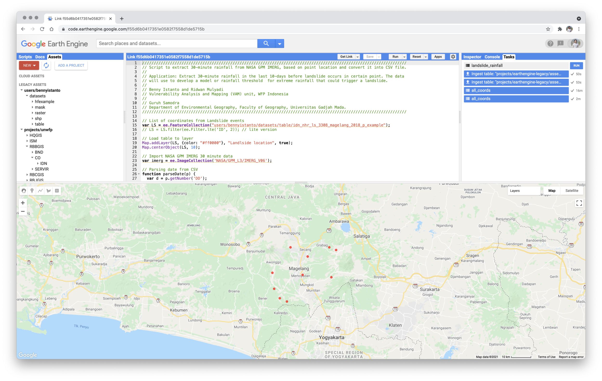
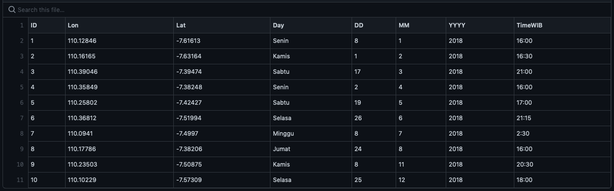
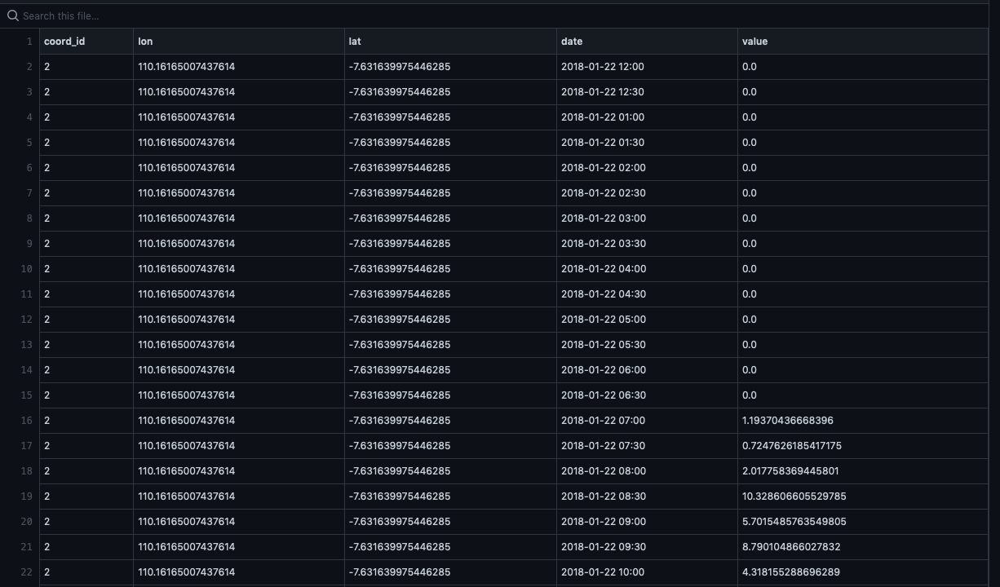

The need for the availability of 30-minutes rainfall time series data are very crucial, especially when we are working on the study of extreme rainfall induced landslide.

During 2018, landslide dominated natural disasters occurred in Central Java. The [Regional Disaster Management Agency](https://bpbd.jatengprov.go.id) (BPBD) of Central Java Province recorded that there were about 2,000 landslides in this area. Most landslide is preceeded by continuous extreme rainfall for few days, as most of the area isn't located near ground weather station, therefore rainfall records are often not available.

In this [post](/blog/20200505-30-minutes-rainfall-and-landslide-research), I have talk about how we can extract half-hourly [IMERG](https://gpm.nasa.gov/GPM) rainfall in single location and date. Now I will explain on how to batch download 30-minutes rainfall data from multiple coordinates and dates.

For this example, I am still using Landslide event as the case, and Google Earth Engine as a tool for downloading the data.

#### Data Source

1. Half hourly IMERG at Earth Engine Data Catalogue - <https://developers.google.com/earth-engine/datasets/catalog/NASA_GPM_L3_IMERG_V06>
2. Landslide event in Magelang, Central Java - Indonesia during 2018. Compiled by [Department of Environmental Geography](https://gel.geo.ugm.ac.id), Faculty of Geography - Universitas Gadjah Mada.



* Available in CSV format with column structure: ID, Lon, Lat, Day, DD, MM, YYYY, TimeWIB.

* Example of landslide event data accessible via this [link](https://github.com/wfpidn/landslide-rainfall/blob/main/data/idn_nhr_ls_3308_magelang_2018_p_example.csv), and below picture. There are 10 landslide event that happen during 2018.



#### Script

The script below describe how to extract 30-minute rainfall from NASA GPM-IMERG, based on points location and convert it into CSV file using Google Earth Engine code editor.

::: {.callout-note collapse="true" title="Javascript - extract 30-minute rainfall from NASA GPM-IMERG"}
```js
// List of coordinates from Landslide events
var LS = ee.FeatureCollection("users/bennyistanto/datasets/table/idn_nhr_ls_3308_magelang_2018_p_example");
// LS = LS.filter(ee.Filter.lte('ID', 2)); // lite version

// Load table to layer
Map.addLayer(LS, {color: "#ff0000"}, "Landslide location", true);
Map.centerObject(LS, 11);

// Import NASA GPM IMERG 30 minute data 
var imerg = ee.ImageCollection('NASA/GPM_L3/IMERG_V06');

// Parsing date from CSV
function parseDate(p) {
  var d = p.getNumber('DD');
  var m = p.getNumber('MM');
  var y = p.getNumber('YYYY');
  var dt = y.format('%d')
    .cat('-').cat(m.format('%02d'))
    .cat('-').cat(d.format('%02d'));
  return ee.Date(dt);
}

var result = LS.map(function(p) {
  var id = p.getNumber('ID');
  var point = p.geometry();
  var coord = point.coordinates();
  var dt = parseDate(p);
  var start = dt.advance(-10, 'days'); // 10-days before
  var end = dt.advance(1, 'days'); // 1-day after
  var precipHH = imerg.filterBounds(point)
    .filterDate(start, end)
    .select('precipitationCal');
  var timeSeries = precipHH.map(function(image) {
    var date = image.date().format('yyyy-MM-dd hh:mm');
    var value = image
      .clip(point)
      .reduceRegion({
        reducer: ee.Reducer.mean(),
        scale: 30
      }).get('precipitationCal'); 
    return ee.Feature(null, { 
      coord_id: id, 
      lon: coord.get(0), 
      lat: coord.get(1),
      date: date, 
      value: value
    });
  });
  return timeSeries;
});

var flatResult = ee.FeatureCollection(result).flatten();

// Export the result as CSV in Google Drive
Export.table.toDrive({
  collection: flatResult,
  description:'landslide_rainfall',
  folder:'GEE',
  selectors: 'coord_id, lon, lat, date, value', 
  fileFormat: 'CSV'
});
```
:::

Full GEE script available via this link <https://code.earthengine.google.com/b7ccc8291d23770301e96a22bd1be2c8>

#### Output

30-minutes of rainfall that occurred 10-days before landslide. Generated using GEE, CSV output is accessible via this [link](https://github.com/wfpidn/landslide-rainfall/blob/main/data/landslide_rainfall.csv).



#### About

I worked with my 2 other colleagues: Ridwan Mulyadi from WFP-VAM and [Guruh Samodra](https://scholar.google.co.id/citations?hl=en&user=0O79Hx4AAAAJ) from UGM. This activity is part of research and development of threshold for extreme rainfall that could trigger a landslide event in Indonesia. Reference: [https://bennyistanto.github.io/erm/ls/#extreme-rainfall-triggered-landslide-alert](https://wfpidn.github.io/ERM/ls/#extreme-rainfall-triggered-landslide-alert)

Source: [https://github.com/bennyistanto/landslide-rainfall](https://github.com/wfpidn/landslide-rainfall)