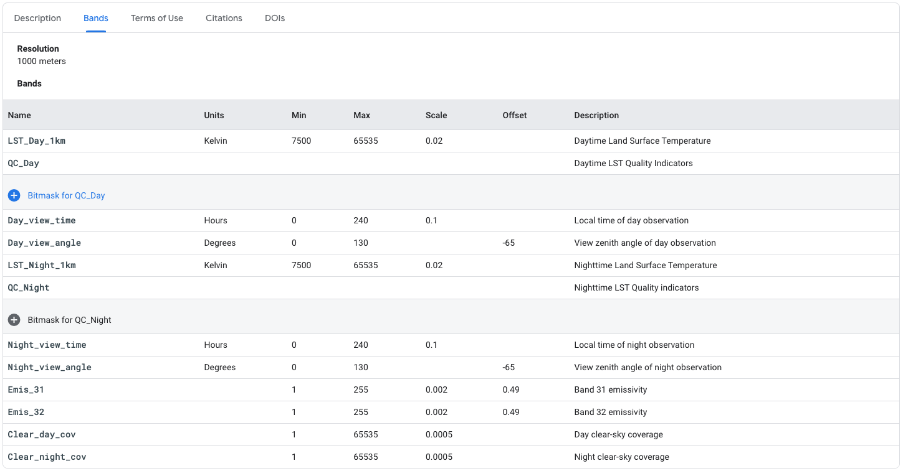
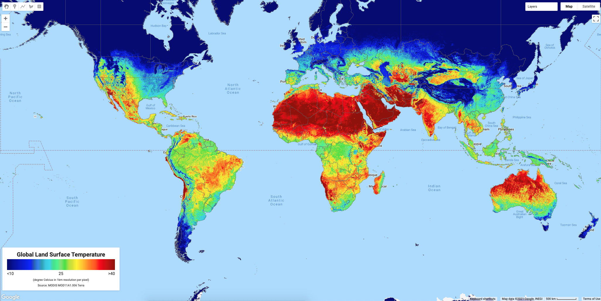
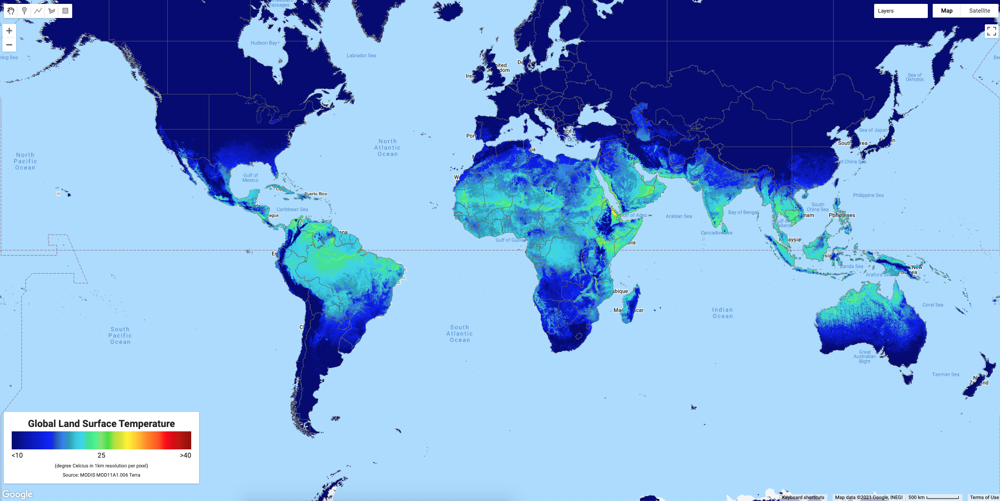
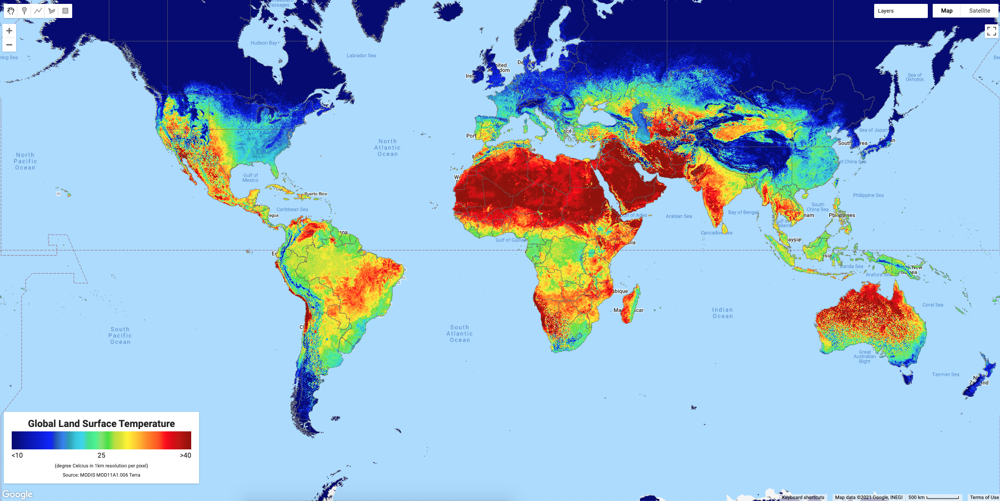
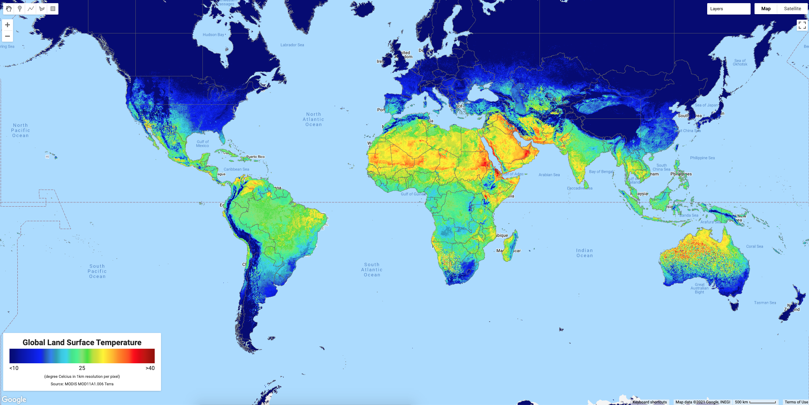
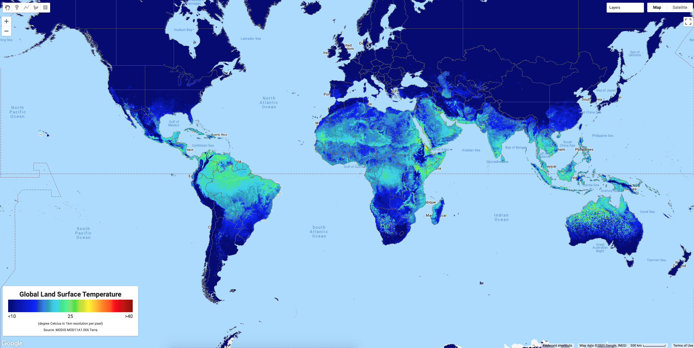
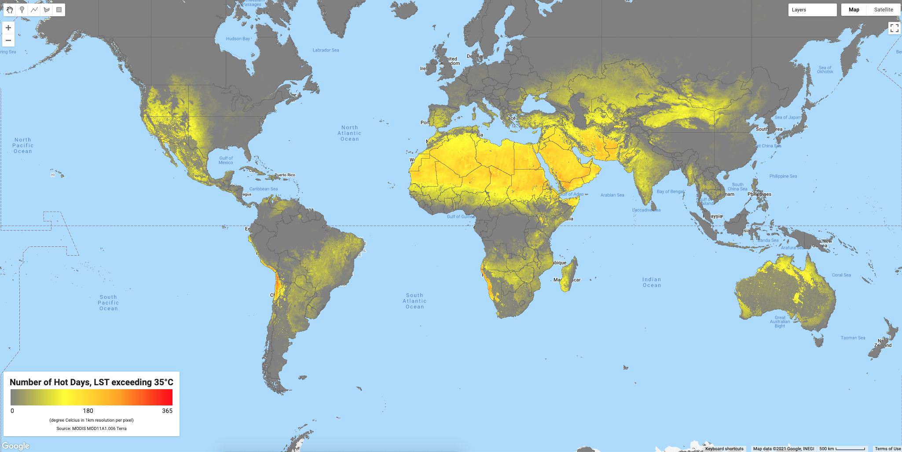
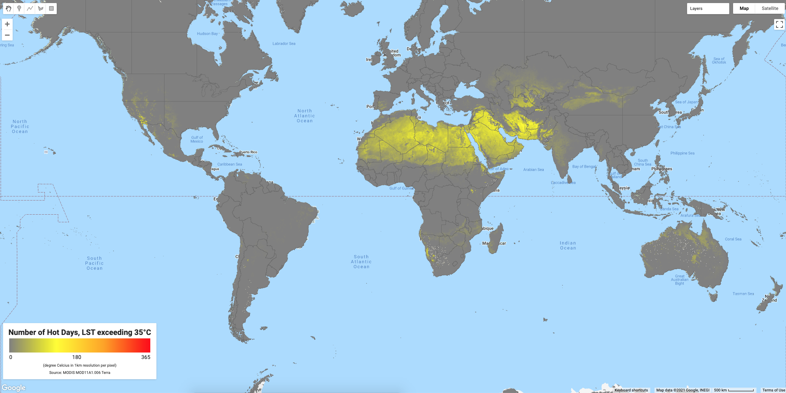

This week I got request from my colleagues to calculate mean annual temperature and number of hot days in a year using MODIS Daily Land Surface Temperature (LST) data from 2000 until 2020 for Indonesia and Latin America Countries. The first thing that comes to mind is to use [Google Earth Engine](https://earthengine.google.com) (GEE).

For this task, I will use MOD11A1.006 Terra Land Surface Temperature and Emissivity Daily Global 1km - <https://developers.google.com/earth-engine/datasets/catalog/MODIS_006_MOD11A1>. From the description: The MOD11A1 V6 product provides daily land surface temperature (LST) and emissivity values in a 1200 x 1200 kilometer grid. The temperature value is derived from the MOD11\_L2 swath product. Above 30 degrees latitude, some pixels may have multiple observations where the criteria for clear-sky are met. When this occurs, the pixel value is the average of all qualifying observations. Provided along with both the day-time and night-time surface temperature bands and their quality indicator layers are MODIS bands 31 and 32 and six observation layers.



From above picture, we can see MOD11A1 has many bands. For this exercise, I only use 4 bands: LST\_Day\_1km, QC\_Day, LST\_Night\_1km and QC\_Night.

If you would like to test, you can access link from GEE: <https://code.earthengine.google.com/?scriptPath=Examples:Datasets/MODIS_006_MOD11A1>

### Land Surface Temperature

Ok, let start! I need to define the geographic domain and the time range.

```js
// Define geographic domain and time range.
//---
var bbox_IDN = ee.Geometry.Rectangle(94.522, 6.125, 142.149, -11.409); // Indonesia
var bbox_LAC = ee.Geometry.Rectangle(-120.254, 33.348, -28.44, -58.64); // Latin America Countries
Map.setCenter(0,0,3);
// Period
var startDate = '2020-01-01';
var endDate = '2020-12-31';
var year = new Date(startDate).getFullYear();
```

Add boundary layer as a guidance when overlaying LST data, and I can use US Department of State LSIB 2017 data in Earth Engine data catalog. <https://developers.google.com/earth-engine/datasets/catalog/USDOS_LSIB_SIMPLE_2017?hl=en>

```js
// These are USDOS LSIB boundaries simplified somewhat for visualization.
var bnd = ee.FeatureCollection("USDOS/LSIB_SIMPLE/2017");
```

I need a function to translate MODIS LST data to Celsius, with equation: Digital Number (DN) to Celsius = DN\* 0.02 -273.15. I found an example of function written by [Gennadii Donchyts](https://scholar.google.com/citations?hl=en&user=8AktFykAAAAJ) at GEE Developers Group <https://groups.google.com/g/google-earth-engine-developers/c/ebrSLPCjZ8c/m/TiL2gtSnDgAJ>

Slightly different with code from above link, I will create two function, for LST\_Day\_1km and LST\_Night\_1km variable.

```js
// Function to convert to Celcius for Day and Night Temperature
function toCelciusDay(image){
  var lst = image.select('LST_Day_1km').multiply(0.02).subtract(273.15);
  var overwrite = true;
  var result = image.addBands(lst, ['LST_Day_1km'], overwrite);
  return result; 
}

function toCelciusNight(image){
  var lst = image.select('LST_Night_1km').multiply(0.02).subtract(273.15);
  var overwrite = true;
  var result = image.addBands(lst, ['LST_Night_1km'], overwrite);
  return result; 
}
```

Next, I will add MOD11A1, select the LST and pre-process Quality Control Band

```js
var mod11a1_day = ee.ImageCollection ('MODIS/006/MOD11A1')
  .select(['LST_Day_1km','QC_Day'])
  .map(toCelciusDay)
  //Select dates of interest
  .filterDate(ee.Date(startDate),ee.Date(endDate));

var mod11a1_night = ee.ImageCollection ('MODIS/006/MOD11A1')
  .select(['LST_Night_1km','QC_Night'])
  .map(toCelciusNight)
  //Select dates of interest
  .filterDate(ee.Date(startDate),ee.Date(endDate));
```

The tricky part will be considering only pixel with good quality from QC bitmask. From the catalog, we can see:

```
QC Bitmask
---
Bits 0-1: Mandatory QA flags
0: LST produced, good quality, not necessary to examine more detailed QA
1: LST produced, other quality, recommend examination of more detailed QA
2: LST not produced due to cloud effects
3: LST not produced primarily due to reasons other than cloud
```

Then I can use below script to select only the best quality images for each data. Below is the function for each Day and Night data.

```js
var QC_Day_mask = function(image2) {
  return image2.updateMask(image2.select('QC_Day').bitwiseAnd(0x1).not());
};

var QC_Night_mask = function(image3) {
  return image3.updateMask(image3.select('QC_Night').bitwiseAnd(0x1).not());
};
```

As alternative way to get good quality image, I can use bitwiseExtract function from [Daniel Wiell](https://gis.stackexchange.com/a/360887/97103)

```js
function bitwiseExtract(value, fromBit, toBit) {
  if (toBit === undefined)
    toBit = fromBit;
  var maskSize = ee.Number(1).add(toBit).subtract(fromBit);
  var mask = ee.Number(1).leftShift(maskSize).subtract(1);
  return value.rightShift(fromBit).bitwiseAnd(mask);
}

var QC_Day_mask = function(image2) {
  return image2.updateMask(bitwiseExtract(image2.select('QC_Day'), 0, 1));
};

var QC_Night_mask = function(image3) {
  return image3.updateMask(bitwiseExtract(image3.select('QC_Night'), 0, 1));
};
```

Next, let’s apply above function to get all the image collection cleaned, only considering pixel with good quality. After that we can do mosaic Day and Night for further analysis.

```js
// Removed bad pixel
// Mask the less than Good images from the collection of images
var LSTD_YYYY_QC = mod11a1_day.map(QC_Day_mask);
var LSTN_YYYY_QC = mod11a1_night.map(QC_Night_mask);
// Merge two image collection (cleaned day and night)
var LST_cleaned_combine = LSTD_YYYY_QC.combine(LSTN_YYYY_QC);
// Sort by date
var LST_cleaned_combine_sorted = LST_cleaned_combine.sort("system:time_start");

// Calculate average daily Day and Night data
var Mean_Day_LST = ee.Image((LSTD_YYYY_QC.select('LST_Day_1km')).mean());
var Mean_Night_LST = ee.Image((LSTN_YYYY_QC.select('LST_Night_1km')).mean());
```

Now I can calculate the annual Mean, Max and Min using below script.

```js
// Daily cleaned LST Mean
var LST_Mean_Daily = LST_cleaned_combine_sorted.map(
  function (image) {
    var img_Mean_src = image.expression(
      '(Day + Night)/2', {
      'Day': image.select('LST_Day_1km'),
      'Night': image.select('LST_Night_1km')
      }
    );
    var img_Mean = img_Mean_src.rename('LST_Daily_mean_1km');
    image = image.addBands([img_Mean]);
    var time = image.get('system:time_start');
    return image.set('system:time_start', time);
  }
);

// Daily cleaned LST Max
var LST_Max_Daily = LST_cleaned_combine_sorted.map(
  function (image) {
    var img_Day = image.select('LST_Day_1km');
    var img_Night = image.select('LST_Night_1km');
    var img_Max = img_Day.max(img_Night).rename('LST_Daily_max_1km');
    image = image.addBands([img_Max]);
    var time = image.get('system:time_start');
    return image.set('system:time_start', time);
  }
);

// Daily cleaned LST Min
var LST_Min_Daily = LST_cleaned_combine_sorted.map(
  function (image) {
    var img_Day = image.select('LST_Day_1km');
    var img_Night = image.select('LST_Night_1km');
    var img_Min = img_Day.min(img_Night).rename('LST_Daily_min_1km');
    image = image.addBands([img_Min]);
    var time = image.get('system:time_start');
    return image.set('system:time_start', time);
  }
);

// Calculate Annual Daily Mean, Max and Min
var Mean_LST = ee.Image((LST_Mean_Daily.select('LST_Daily_mean_1km')).mean());
var Max_LST = ee.Image((LST_Max_Daily.select('LST_Daily_max_1km')).mean());
var Min_LST = ee.Image((LST_Min_Daily.select('LST_Daily_min_1km')).mean());
```

### Hot Days

To get number of hot days in a year, I will use 35 degree Celsius as a threshold, so every LST exceeding the threshold, will added to new collection and later will summed to get total number in a year.

This case I try to get number of hot days using LST Day (average day time temperature) and LST Mean (average daily temperature - 24h average)

```js
// Function to get hot days
function hotdays(image){
    var hot = image.gt(35);
    return image.addBands(hot.rename('hotdays')
      .set('system:time_start', image.get('system:time_start')));
}

// Number of hot days, Daily LST day and mean exceeding 35degC
var LST35Mean = ee.ImageCollection(LST_Mean_Daily.select('LST_Daily_mean_1km')).map(hotdays);
var LST35Day = ee.ImageCollection(LSTD_YYYY_QC.select('LST_Day_1km')).map(hotdays);

// Calculate the total number of hot days in a year (selected time range)
var totalHotDaysLSTMean = ee.ImageCollection(LST35Mean.select('hotdays')).sum().float();
var totalHotDaysLSTDay = ee.ImageCollection(LST35Day.select('hotdays')).sum().float();
```

### Number of Consecutive Hot Days

Although this is not part of my objective, I found a script to calculate number of consecutive hot days from Jamon Van Den Hoek at [GEE Developers Group](https://groups.google.com/g/google-earth-engine-developers/c/XRznPFYyZ08/m/FraO5CN4FQAJ) and I think this is still relevant with what I have done. So I decided to put this script too, maybe someday I need it.

```js
// Function to calculate length of consecutive days above 35degC
function consecutiveDays(this_img, cum_prev_max){
  // Load cumulative # days
  var cum_img = ee.Image(cum_prev_max).select(0); 
  // Load previous day's image
  var prev_img = ee.Image(cum_prev_max).select(1);
  // Load maximum # consecutive data
  var max_run = ee.Image(cum_prev_max).select(2); 
  // Set masked pixels to 0
  this_img = this_img.unmask();
  // If this and previous day were > 35, record this consecutive day 
  cum_img = cum_img.where(this_img.eq(1).and(prev_img.eq(1)), cum_img.add(1));
  // If < 35 deg, reset counter
  cum_img = cum_img.where(this_img.neq(1), 0);
  // Last data from the time range
  max_run = max_run.where(cum_img.gt(max_run),cum_img);
  // This return value becomes cum_prev input
  return cum_img.addBands(this_img).addBands(max_run);
}

var max_value = 365;
// Mean
var LST35CMean = ee.ImageCollection(LST35Mean.select('hotdays').toList(max_value));
// Need to add 1 day to get # days rather than # two-date periods > 35 deg 
var Max_HOT_LSTMean = ee.Image(LST35CMean.iterate(consecutiveDays, ee.Image([0,0,0]))).select(2).add(1).rename('LSTMean_HOT_MaxConDay');
var Cum_HOT_LSTMean = ee.Image(LST35CMean.iterate(consecutiveDays, ee.Image([0,0,0]))).select(0).add(1).rename('LSTMean_HOT_CumConDay');
// Day
var LST35CDay = ee.ImageCollection(LST35Day.select('hotdays').toList(max_value));
// Need to add 1 day to get # days rather than # two-date periods > 35 deg 
var Max_HOT_LSTDay = ee.Image(LST35CDay.iterate(consecutiveDays, ee.Image([0,0,0]))).select(2).add(1).rename('LSTDay_HOT_MaxConDay');
var Cum_HOT_LSTDay = ee.Image(LST35CDay.iterate(consecutiveDays, ee.Image([0,0,0]))).select(0).add(1).rename('LSTDay_HOT_CumConDay');
```

### Symbology, Downloads and Legend

It’s time to visualize all the result and displaying into map with legend, and download it via Google Drive.

::: {.callout-note collapse="true" title="Javascript - Symbology and Export to Drive"}
```js
// SYMBOLOGY
//---
// LST
var LSTvis = {
  min: 10,
  max: 40,
  palette: [
    '040274', '040281', '0502a3', '0502b8', '0502ce', '0502e6',
    '0602ff', '235cb1', '307ef3', '269db1', '30c8e2', '32d3ef',
    '3be285', '3ff38f', '86e26f', '3ae237', 'b5e22e', 'd6e21f',
    'fff705', 'ffd611', 'ffb613', 'ff8b13', 'ff6e08', 'ff500d',
    'ff0000', 'de0101', 'c21301', 'a71001', '911003'
  ],
};
// Hot days
var HotDaysvis = {min:0, max:365, palette:['grey','yellow','orange','red']};
// Consecutive hot days
var ConHotDaysvis = {min:0, max:50, palette:['grey','red']};
// Boundaries
var BNDvis = {fillColor: "#00000000", color: '646464', width: 0.5,};


//Add LST layer to the map
Map.addLayer(Mean_Day_LST, LSTvis, 'Annual Daily LST Day', false);
Map.addLayer(Mean_Night_LST, LSTvis, 'Annual Daily LST Night', false);
Map.addLayer(Mean_LST, LSTvis, 'Annual Daily LST Mean', false);
Map.addLayer(Max_LST, LSTvis, 'Annual Daily LST Max', false);
Map.addLayer(Min_LST, LSTvis, 'Annual Daily LST Min', false);
Map.addLayer(totalHotDaysLSTDay, HotDaysvis, 'Number of Hot Days from Daily LST Day', false);
Map.addLayer(totalHotDaysLSTMean, HotDaysvis, 'Number of Hot Days from Daily LST Mean', false);
Map.addLayer(Max_HOT_LSTMean, ConHotDaysvis, 'Maximum Consecutive Days from Daily LST Mean', false);
Map.addLayer(Cum_HOT_LSTMean, ConHotDaysvis, 'Cumulative Consecutive Days from Daily LST Mean',false);
Map.addLayer(Max_HOT_LSTDay, ConHotDaysvis, 'Maximum Consecutive Days from Daily LST Max', false);
Map.addLayer(Cum_HOT_LSTDay, ConHotDaysvis, 'Cumulative Consecutive Days from Daily LST Max',false);
Map.addLayer(bnd.style({fillColor: "#00000000", color: '646464', width: 0.5}));


// Convert the geometry to a JSON string used as an argument to Export.
var IDN_json = bbox_IDN.toGeoJSON();
var LAC_json = bbox_LAC.toGeoJSON();

// Export the image, specifying scale and region.
// Day and Night
Export.image.toDrive({
  image:Mean_Day_LST,
  description:'IDN_LSTD_Mean_' + year, 
  folder:'GEE',
  scale:1000,
  maxPixels:1e13,
  region:IDN_json
});

Export.image.toDrive({
  image:Mean_Day_LST,
  description:'LAC_LSTD_Mean_' + year, 
  folder:'GEE',
  scale:1000,
  maxPixels:1e13,
  region:LAC_json
});

// Mean Max Min
Export.image.toDrive({
  image:Mean_LST,
  description:'IDN_LSTMean_' + year, 
  folder:'GEE',
  scale:1000,
  maxPixels:1e13,
  region:IDN_json
});

Export.image.toDrive({
  image:Max_LST,
  description:'IDN_LSTMax_' + year, 
  folder:'GEE',
  scale:1000,
  maxPixels:1e13,
  region:IDN_json
});

Export.image.toDrive({
  image:Min_LST,
  description:'IDN_LSTMin_' + year, 
  folder:'GEE',
  scale:1000,
  maxPixels:1e13,
  region:IDN_json
});

Export.image.toDrive({
  image:Mean_LST,
  description:'LAC_LSTMean_' + year, 
  folder:'GEE',
  scale:1000,
  maxPixels:1e13,
  region:LAC_json
});

Export.image.toDrive({
  image:Max_LST,
  description:'LAC_LSTMax_' + year, 
  folder:'GEE',
  scale:1000,
  maxPixels:1e13,
  region:LAC_json
});

Export.image.toDrive({
  image:Min_LST,
  description:'LAC_LSTMin_' + year, 
  folder:'GEE',
  scale:1000,
  maxPixels:1e13,
  region:LAC_json
});

// HotDays
Export.image.toDrive({
  image:totalHotDaysLSTMean,
  description:'IDN_Hotdays_LSTMean_' + year, 
  folder:'GEE',
  scale:1000,
  maxPixels:1e13,
  region:IDN_json
});

Export.image.toDrive({
  image:totalHotDaysLSTDay,
  description:'IDN_Hotdays_LSTDay_' + year, 
  folder:'GEE',
  scale:1000,
  maxPixels:1e13,
  region:IDN_json
});

Export.image.toDrive({
  image:totalHotDaysLSTMean,
  description:'LAC_Hotdays_LSTMean' + year, 
  folder:'GEE',
  scale:1000,
  maxPixels:1e13,
  region:LAC_json
});

Export.image.toDrive({
  image:totalHotDaysLSTDay,
  description:'LAC_Hotdays_LSTDay_' + year, 
  folder:'GEE',
  scale:1000,
  maxPixels:1e13,
  region:LAC_json
});


// LEGEND PANEL
//---
// A color bar widget. Makes a horizontal color bar to display the given color palette.
function ColorBar(palette) {
  return ui.Thumbnail({
    image: ee.Image.pixelLonLat().select(0),
    params: {
      bbox: [0, 0, 1, 0.1],
      dimensions: '100x10',
      format: 'png',
      min: 0,
      max: 1,
      palette: palette,
    },
    style: {stretch: 'horizontal', margin: '0px 8px'},
  });
}

// Returns our labeled legend, with a color bar and three labels representing
// the minimum, middle, and maximum values.
function makeLegend() {
  var labelPanel = ui.Panel(
      [
        // Label for LST legend
        ui.Label('<10', {margin: '4px 8px'}),
        ui.Label('25',{margin: '4px 8px', textAlign: 'center', stretch: 'horizontal'}),
        ui.Label('>40', {margin: '4px 8px'})
        // Label for Hotdays legend
        // ui.Label('0', {margin: '4px 8px'}),
        // ui.Label('180',{margin: '4px 8px', textAlign: 'center', stretch: 'horizontal'}),
        // ui.Label('365', {margin: '4px 8px'})
      ],
      ui.Panel.Layout.flow('horizontal'));
  // LST color
  return ui.Panel([ColorBar(LSTvis.palette), labelPanel]);
  // Hotdays color
  // return ui.Panel([ColorBar(HotDaysvis.palette), labelPanel]);
}

// Styling for the legend title. 
var LEGEND_TITLE_STYLE = {
  fontSize: '20px',
  fontWeight: 'bold',
  stretch: 'horizontal',
  textAlign: 'center',
  margin: '4px',
};

// Styling for the legend footnotes.
var LEGEND_FOOTNOTE_STYLE = {
  fontSize: '10px',
  stretch: 'horizontal',
  textAlign: 'center',
  margin: '4px',
};

// Assemble the legend panel.
Map.add(ui.Panel(
    [
      // Legend title for LST
      ui.Label('Global Land Surface Temperature', LEGEND_TITLE_STYLE), makeLegend(),
      // Legend title for Hotdays
      ui.Label('Number of Hotdays, LST exceeding 35°C', LEGEND_TITLE_STYLE), makeLegend(),
      ui.Label('(degree Celcius in 1km resolution per pixel)', LEGEND_FOOTNOTE_STYLE),
      ui.Label('Source: MODIS MOD11A1.006 Terra', LEGEND_FOOTNOTE_STYLE)
    ],
    ui.Panel.Layout.flow('vertical'),
    {width: '400px', position: 'bottom-left'}));

// End of script
```
:::

Full script available here: <https://code.earthengine.google.com/f2109fc305e987b97503146d4c209871> (Update 22 Dec 2021)  
And below is the example results.

::: {.image-gallery}
::: {.gallery-item}

:::
::: {.gallery-item}

:::
::: {.gallery-item}

:::
::: {.gallery-item}

:::
::: {.gallery-item}

:::
::: {.gallery-item}

:::
::: {.gallery-item}

:::
:::