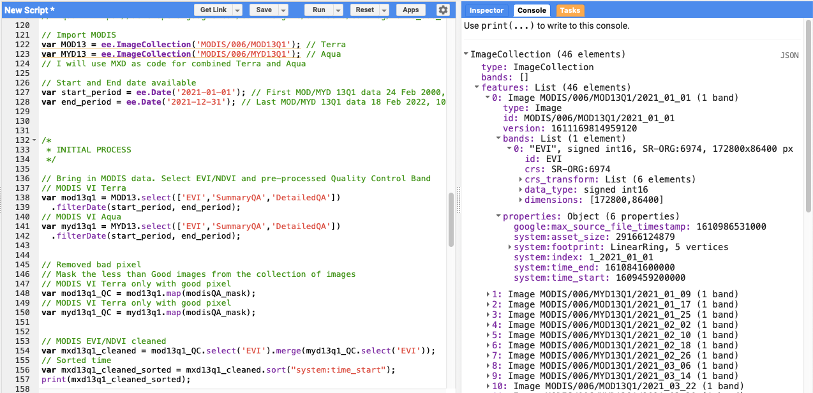
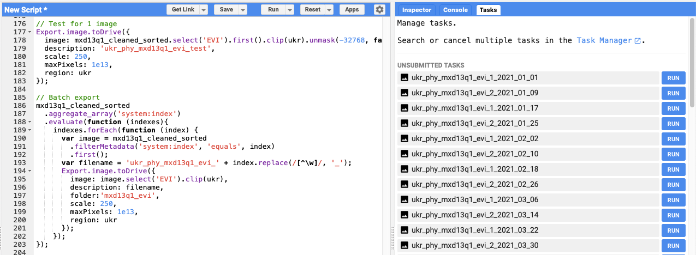
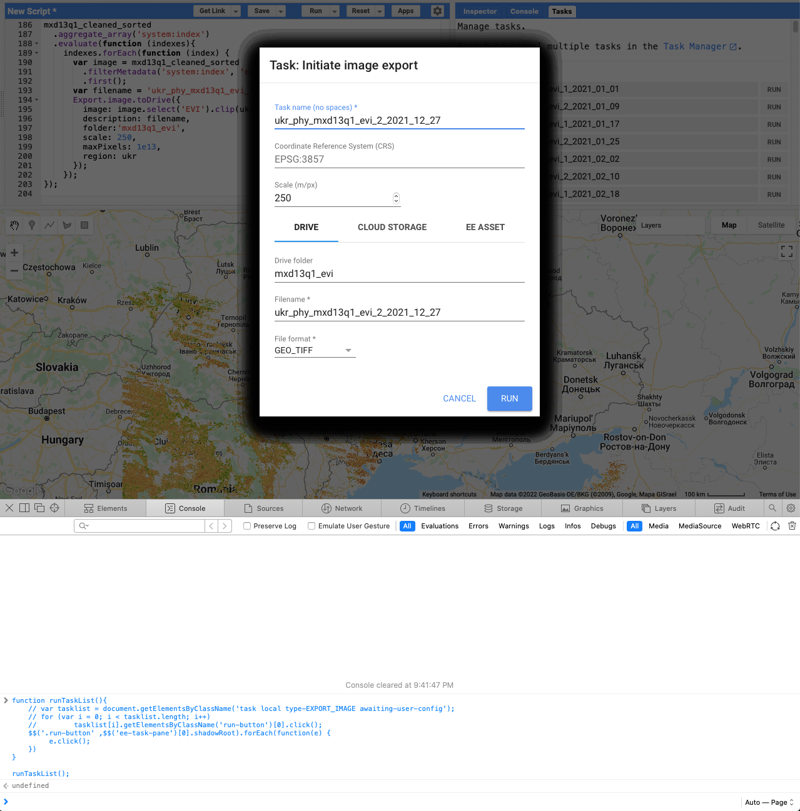
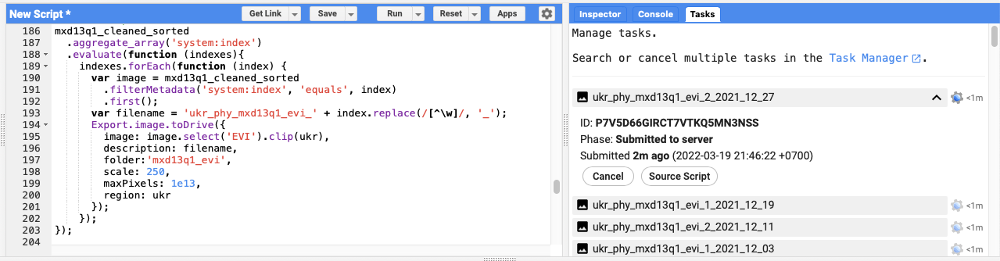

Have you ever had a problem when you wanted to download the entire data of an [*ImageCollection*](https://developers.google.com/earth-engine/datasets/) from [Google Earth Engine](https://earthengine.google.com) (GEE), but you were lazy and bored when you had to click on each available date to save it on Google Drive?

Are you looking for a solution on how to do it in more efficient way? Then, this blog post is for you!

This week I am working on analysis of [phenological metrics](/blog/20160927-satellite-based-monitoring-of-growing-season) for food crops, I need a timeseries vegetation index data and I will use [MODIS Vegetation Indices](https://ladsweb.modaps.eosdis.nasa.gov/missions-and-measurements/science-domain/vegetation-indices) (VI) data. What I usually do is download the data through [NASA AppEEARS](https://lpdaacsvc.cr.usgs.gov/appeears/), then pre-process it (remove pixel with bad quality based on Pixel Reliability layer) using GIS software.

Now I would like to use GEE to download the cleaned (pre-process) MODIS VI, I will try to get MOD13Q1 (Terra) and MYD13Q1 (Aqua), and combine the two 16-day composites into a synthethic 8-day composite containing data from both Aqua and Terra.

Ok, let start!

### Preparing the collection

I need to define the geographic domain, I will use Ukraine as an example.

```js
// Bounding box Ukraine
var bbox_ukr = ee.Geometry.Rectangle(21.7, 43.7, 40.7, 52.4);
var ukr = ee.Feature(bbox_ukr).geometry();

// Center of the map
Map.setCenter(31.434, 48.996, 6); // Ukraine
```

Then I need to import the data and define the time range. For the reference, the data is available at GEE Data Catalog:

* Terra - <https://developers.google.com/earth-engine/datasets/catalog/MODIS_006_MOD13Q1?hl=en>
* Aqua - <https://developers.google.com/earth-engine/datasets/catalog/MODIS_006_MYD13Q1?hl=en>

For this example, I will try to download all data in 2021. As Terra and Aqua has 23 data for each year (16-day), the total data for both Aqua and Terra will be 46.

```js
// Import MODIS
var MOD13 = ee.ImageCollection('MODIS/006/MOD13Q1'); // Terra
var MYD13 = ee.ImageCollection('MODIS/006/MYD13Q1'); // Aqua

// Start and End date available
var start_period = ee.Date('2021-01-01'); // First MOD/MYD 13Q1 data 24 Feb 2000, 4 Jul 2002
var end_period = ee.Date('2021-12-31'); // Last MOD/MYD 13Q1 data 18 Feb 2022, 10 Feb 2022
```

As I will pre-process the VI using GEE, I need to create a function to apply the QA Bitmask, so at the end I will get cleaned (pixel with good quality only) VI data. Bitmask information are available from above link, or you can check below.

```js
/*
 * Bitmask for SummaryQA
 *  Bits 0-1: VI quality (MODLAND QA Bits)
 *    0: Good data, use with confidence
 *    1: Marginal data, useful but look at detailed QA for more information
 *    2: Pixel covered with snow/ice
 *    3: Pixel is cloudy
 * 
 * Bitmask for DetailedQA
 *  Bits 0-1: VI quality (MODLAND QA Bits)
 *    0: VI produced with good quality
 *    1: VI produced, but check other QA
 *    2: Pixel produced, but most probably cloudy
 *    3: Pixel not produced due to other reasons than clouds
 *  Bits 2-5: VI usefulness
 *    0: Highest quality
 *    1: Lower quality
 *    2: Decreasing quality
 *    4: Decreasing quality
 *    8: Decreasing quality
 *    9: Decreasing quality
 *    10: Decreasing quality
 *    12: Lowest quality
 *    13: Quality so low that it is not useful
 *    14: L1B data faulty
 *    15: Not useful for any other reason/not processed
 *  Bits 6-7: Aerosol Quantity
 *    0: Climatology
 *    1: Low
 *    2: Intermediate
 *    3: High
 *  Bit 8: Adjacent cloud detected
 *    0: No
 *    1: Yes
 *  Bit 9: Atmosphere BRDF correction
 *    0: No
 *    1: Yes
 *  Bit 10: Mixed Clouds
 *    0: No
 *    1: Yes
 *  Bits 11-13: Land/water mask
 *    0: Shallow ocean
 *    1: Land (nothing else but land)
 *    2: Ocean coastlines and lake shorelines
 *    3: Shallow inland water
 *    4: Ephemeral water
 *    5: Deep inland water
 *    6: Moderate or continental ocean
 *    7: Deep ocean
 *  Bit 14: Possible snow/ice
 *    0: No
 *    1: Yes
 *  Bit 15: Possible shadow
 *    0: No
 *    1: Yes
*/
```

I am using bitwiseExtract function from [Daniel Wiell](https://gis.stackexchange.com/a/349401)

```js
/*
 * Utility to extract bitmask values. 
 * Look up the bit-ranges in the catalog. 
 * 
 * value - ee.Number of ee.Image to extract from.
 * fromBit - int or ee.Number with the first bit.
 * toBit - int or ee.Number with the last bit (inclusive). 
 *         Defaults to fromBit.
 */
function bitwiseExtract(value, fromBit, toBit) {
  if (toBit === undefined)
    toBit = fromBit;
  var maskSize = ee.Number(1).add(toBit).subtract(fromBit);
  var mask = ee.Number(1).leftShift(maskSize).subtract(1);
  return value.rightShift(fromBit).bitwiseAnd(mask);
}
```

Example: A mask with "Good data, use with confidence" would be “bitwiseExtract(image, 0, 1).eq(0)”

Now, let’s apply the SummaryQA and DetailedQA. As example in below code, I will use “Good data, use with confidence” and “VI produced with good quality”.

```js
var modisQA_mask = function(image) {
  var sqa = image.select('SummaryQA');
  var dqa = image.select('DetailedQA');
  var viQualityFlagsS = bitwiseExtract(sqa, 0, 1); 
  var viQualityFlagsD = bitwiseExtract(dqa, 0, 1);
  // var viUsefulnessFlagsD = bitwiseExtract(dqa, 2, 5);
  var mask = viQualityFlagsS.eq(0) // Good data, use with confidence
    // .and(viQualityFlagsS.eq(1)) // Marginal data, useful but look at detailed QA for more information
    .and(viQualityFlagsD.eq(0)) // VI produced with good quality
    // .and(viQualityFlagsD.eq(1)) // VI produced, but check other QA
    // .and(viUsefulnessFlagsD.eq(0)); // Highest quality
  return image.updateMask(mask);
};
```

Next, let’s filter the data based on preferred time range and select EVI, SummaryQA and DetailedQA layer for both Aqua and Terra.

```js
// MODIS VI Terra
var mod13q1 = MOD13.select(['EVI','SummaryQA','DetailedQA'])
  .filterDate(start_period, end_period);
// MODIS VI Aqua
var myd13q1 = MYD13.select(['EVI','SummaryQA','DetailedQA'])
  .filterDate(start_period, end_period);
```

Removed bad pixel by mask using above function from the collection of images.

```js
// MODIS VI Terra only with good pixel
var mod13q1_QC = mod13q1.map(modisQA_mask);
// MODIS VI Terra only with good pixel
var myd13q1_QC = myd13q1.map(modisQA_mask);
```

Combine Aqua and Terra into single Image Collection and sorted from the earliest date, then I will have VI with 8-day temporal resolution.

```js
// MODIS EVI/NDVI cleaned
var mxd13q1_cleaned = mod13q1_QC.select('EVI').merge(myd13q1_QC.select('EVI'));
// Sorted time
var mxd13q1_cleaned_sorted = mxd13q1_cleaned.sort("system:time_start");
print(mxd13q1_cleaned_sorted);
```

And below is the result from “print” command.



Create a symbology, and test the output as expected or not by add the last map to map display.

```js
// Symbology
var viVis = {
  min: 0.0,
  max: 8000.0,
  palette: [
    'FFFFFF', 'CE7E45', 'DF923D', 'F1B555', 'FCD163', '99B718', '74A901',
    '66A000', '529400', '3E8601', '207401', '056201', '004C00', '023B01',
    '012E01', '011D01', '011301'
  ],
};

Map.addLayer(mxd13q1_cleaned_sorted.select('EVI').first().clip(ukr), viVis, 'VI');
```

### Batch exporting

To download the data, usually I use standard code like below.

```js
// Test for 1 image
Export.image.toDrive({
  image: mxd13q1_cleaned_sorted.select('EVI').first().clip(ukr).unmask(-32768, false).toInt16(),
  description: 'ukr_phy_mxd13q1_evi_test',
  scale: 250,
  maxPixels: 1e13,
  region: ukr
});
```

To batch export for all data in the *ImageCollection*, use below code.

```js
// Batch export
mxd13q1_cleaned_sorted
  .aggregate_array('system:index')
  .evaluate(function (indexes){
    indexes.forEach(function (index) {
      var image = mxd13q1_cleaned_sorted
        .filterMetadata('system:index', 'equals', index)
        .first();
      var filename = 'ukr_phy_mxd13q1_evi_' + index.replace(/[^\w]/, '_');
      Export.image.toDrive({
        image: image.select('EVI').clip(ukr).unmask(-32768, false).toInt16(),
        description: filename,
        folder:'mxd13q1_evi',
        scale: 250,
        maxPixels: 1e13,
        region: ukr
      });      
    });
});
```

Using above code, you will have 46 unsubmitted tasks that required you to click all the RUN button. I know, clicking 46 button is not a big deal. But, by doing this frequently or you need to download more than 500 data, it’s very boring.



How to export all the data without clicking on RUN button? Thanks to Dongdong Kong and yzq.yang for creating the [script](https://github.com/gee-hydro/gee_monkey#free-version).

Below is the step-by-step:

* Run your Google Earth Engine code;
* Wait until all the tasks are listed (the Run buttons are shown);
* Click two computer keys fn and f12 at the same time and bring up console; or find it via: menubar Develop > Show JavaScript Console (Safari), and menubar View > Developer > JavaScript Console (Chrome)
* Copy and paste below code into the console, then Enter;

  ```js
  function runTaskList(){
      // var tasklist = document.getElementsByClassName('task local type-EXPORT_IMAGE awaiting-user-config');
      // for (var i = 0; i < tasklist.length; i++)
      //         tasklist[i].getElementsByClassName('run-button')[0].click();
      $$('.run-button' ,$$('ee-task-pane')[0].shadowRoot).forEach(function(e) {
          e.click();
      })
  }

  runTaskList();
  ```

* Wait until the code sends messages to the server to run all the tasks (you wait and relax); wait until GEE shows the dialogue window asking you to click "Run"; (below picture)
* Please bear in mind, the time execution is depend on the image size you will export. Example, 1 year data for Ukraine on MODIS VI takes a minute below picture to popup.



Copy and paste below code into the console, then Enter;

```js
function confirmAll() {
    // var ok = document.getElementsByClassName('goog-buttonset-default goog-buttonset-action');
    // for (var i = 0; i < ok.length; i++)
    //     ok[i].click();
    $$('ee-table-config-dialog, ee-image-config-dialog').forEach(function(e) {
         var eeDialog = $$('ee-dialog', e.shadowRoot)[0]
         var paperDialog = $$('paper-dialog', eeDialog.shadowRoot)[0]
         $$('.ok-button', paperDialog)[0].click()
    })
}

confirmAll();
```

Keep your computer open until all the tasks (Runs) are done (you probably need to set your computer to never sleep).



You can close your browser or computer after all the Tasks running and submitted to server.

Link to [code](https://code.earthengine.google.com/e49e59f058d08727cc475eb8daf0965f)

### Notes

The preferred and more stable way to do batch exports is using the Python API. Or you can try [geemap](https://geemap.org) and the example [notebook](https://github.com/giswqs/geemap/blob/master/examples/notebooks/11_export_image.ipynb) from Qiusheng Wu.