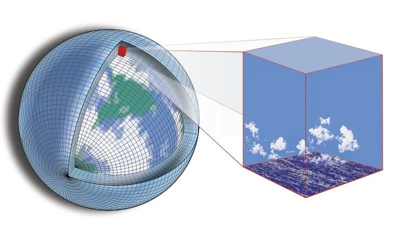

Image source: <https://nps.edu/-/nps-researchers-partner-on-next-generation-climate-model>

Climate modeling goes back to the late 19th and early 20th centuries (Edwards, P.N. [2011](https://docs.google.com/document/d/1HnjTPiA7oZqkjordLtrjJjQMGJFrBSbu/edit#bookmark=id.30j0zll)). The earliest attempts date from the 1870s (Uppenbrink, J. [1996](https://docs.google.com/document/d/1HnjTPiA7oZqkjordLtrjJjQMGJFrBSbu/edit#bookmark=id.1fob9te)), and were concerned with atmospheric processes and with calculating how the climate would change (Arrhenius, S. [1896](https://docs.google.com/document/d/1HnjTPiA7oZqkjordLtrjJjQMGJFrBSbu/edit#bookmark=id.3znysh7)). Computing power in the mid-20th century (Ruttimann, J. [2006](https://docs.google.com/document/d/1HnjTPiA7oZqkjordLtrjJjQMGJFrBSbu/edit#bookmark=id.2et92p0)) is what turned those calculations into something that could be run at scale. Models are now used for both past (Otto-Bliesner, et.al. [2006](https://docs.google.com/document/d/1HnjTPiA7oZqkjordLtrjJjQMGJFrBSbu/edit#bookmark=id.tyjcwt)) and future (Fick, S.E. and R.J. Hijmans, [2017](https://docs.google.com/document/d/1HnjTPiA7oZqkjordLtrjJjQMGJFrBSbu/edit#bookmark=id.3dy6vkm)) climate scenarios.

A climate model is a mathematical representation of the climate system, used to simulate how climate evolves over time. The most common type is the General Circulation Model (GCM), first built at the Geophysical Fluid Dynamics Laboratory (GFDL) (Manabe, S. and Bryan, K. [1969](https://docs.google.com/document/d/1HnjTPiA7oZqkjordLtrjJjQMGJFrBSbu/edit#bookmark=id.1t3h5sf)). A GCM simulates the global circulation of the atmosphere, ocean, land surface and sea ice, and is used for medium to long-term change under natural or human forcing (McGuffie, K. and Henderson-Sellers, A. [2005](https://docs.google.com/document/d/1HnjTPiA7oZqkjordLtrjJjQMGJFrBSbu/edit#bookmark=id.4d34og8)).

Earth System Models (ESMs) extend GCMs by adding the biosphere and the cryosphere, and their interaction with the other components (Scholze, M., et.al. [2012](https://docs.google.com/document/d/1HnjTPiA7oZqkjordLtrjJjQMGJFrBSbu/edit#bookmark=id.2s8eyo1)). That allows feedbacks between components to be represented (Sokolov, A. et.al. [2018](https://docs.google.com/document/d/1HnjTPiA7oZqkjordLtrjJjQMGJFrBSbu/edit#bookmark=id.17dp8vu)). ESMs are used for climate projections and for assessing the impact of climate change on different sectors (Heavens, N.G. et.al.[2013](https://docs.google.com/document/d/1HnjTPiA7oZqkjordLtrjJjQMGJFrBSbu/edit#bookmark=id.3rdcrjn)).

Regional Climate Models (RCMs) cover a smaller area. They handle small-scale features such as mountains and coastlines more realistically than a global model (Wang, Y. et.al. [2004](https://docs.google.com/document/d/1HnjTPiA7oZqkjordLtrjJjQMGJFrBSbu/edit#bookmark=id.26in1rg)), which makes them useful for local change in rainfall and temperature, and for regional extremes (Tapiador, F.J. et.al. [2020](https://docs.google.com/document/d/1HnjTPiA7oZqkjordLtrjJjQMGJFrBSbu/edit#bookmark=id.lnxbz9)).

Modeling the whole system means modeling each of its parts: atmosphere, ocean, land surface and ice (Gettelman, A. and Rood, R.B., [2016](https://docs.google.com/document/d/1HnjTPiA7oZqkjordLtrjJjQMGJFrBSbu/edit#bookmark=id.35nkun2), pp 13-22).

The atmosphere is a mix of gases, radiation and airborne particles, driven by energy from the sun. Convection, advection, radiation and condensation between them set the weather (Gettelman, A. and Rood, R.B., [2016](https://docs.google.com/document/d/1HnjTPiA7oZqkjordLtrjJjQMGJFrBSbu/edit#bookmark=id.35nkun2), pp 71-76).

The ocean covers more than 70% of the Earth's surface. Upwelling and downwelling, evaporation and convection store and move heat, which moderates global temperature and drives weather patterns (Gettelman, A. and Rood, R.B., [2016](https://docs.google.com/document/d/1HnjTPiA7oZqkjordLtrjJjQMGJFrBSbu/edit#bookmark=id.35nkun2), pp 87-88).

The land surface covers both the terrestrial biosphere and the topography. Photosynthesis, respiration and evaporation regulate climate variability (Gettelman, A. and Rood, R.B., [2016](https://docs.google.com/document/d/1HnjTPiA7oZqkjordLtrjJjQMGJFrBSbu/edit#bookmark=id.35nkun2), pp 109-111), and changes in land cover such as urbanization and deforestation feed back into weather and climate.

Ice reflects incoming solar radiation back to space. Ice sheets, glaciers and sea ice set much of the Earth's albedo, which is a major term in the global energy balance (Gettelman, A. and Rood, R.B., [2016](https://docs.google.com/document/d/1HnjTPiA7oZqkjordLtrjJjQMGJFrBSbu/edit#bookmark=id.35nkun2), pp 101).

A climate model simulates the atmosphere and its interaction with the ocean, the land surface and the other components of the system (Tehrani, M.J., et.al. [2022](https://docs.google.com/document/d/1HnjTPiA7oZqkjordLtrjJjQMGJFrBSbu/edit#bookmark=id.1ksv4uv)). Three processes carry most of the work: radiation, precipitation and circulation.

Radiation is the energy the Earth receives from the Sun, and it sets the temperature of the atmosphere. What reaches the surface is shortwave radiation (Yang, Q. et.al [2020](https://docs.google.com/document/d/1HnjTPiA7oZqkjordLtrjJjQMGJFrBSbu/edit#bookmark=id.44sinio)), mostly visible light and infrared.

Precipitation moves water from the atmosphere to the land and ocean surface. It drives erosion, sedimentation and the rest of the hydrological cycle (Tapiador, F.J. et.al. [2017](https://docs.google.com/document/d/1HnjTPiA7oZqkjordLtrjJjQMGJFrBSbu/edit#bookmark=id.2jxsxqh)).

Circulation moves heat and moisture from the ocean and atmosphere towards higher latitudes. It sets the major climate zones and produces storm systems and large-scale features such as El Niño and La Niña (Behera, S.K. et.al. [2021](https://docs.google.com/document/d/1HnjTPiA7oZqkjordLtrjJjQMGJFrBSbu/edit#bookmark=id.z337ya)).

The first use of a climate model is projection. Rainfall erosivity is expected to rise, which will drive higher erosion rates (Panagos, P., et.al. [2022](https://docs.google.com/document/d/1HnjTPiA7oZqkjordLtrjJjQMGJFrBSbu/edit#bookmark=id.3j2qqm3)). Starting from current and past conditions, greenhouse gas concentrations, temperature and ocean currents, a model projects how the climate may change, and that is what policy on mitigation and adaptation is built on (Marzi, S. et.al. [2021](https://docs.google.com/document/d/1HnjTPiA7oZqkjordLtrjJjQMGJFrBSbu/edit#bookmark=id.1y810tw); Lindbergh, S. et.al. [2022](https://docs.google.com/document/d/1HnjTPiA7oZqkjordLtrjJjQMGJFrBSbu/edit#bookmark=id.4i7ojhp); Xing, Q. et.al. [2022](https://docs.google.com/document/d/1HnjTPiA7oZqkjordLtrjJjQMGJFrBSbu/edit#bookmark=id.2xcytpi)).

The second is the past. Running a model on past atmospheric concentrations and temperatures shows how the climate has already changed (Li, Y. et.al. [2018](https://docs.google.com/document/d/1HnjTPiA7oZqkjordLtrjJjQMGJFrBSbu/edit#bookmark=id.1ci93xb); Razjigaeva, N.G. et.al. [2020](https://docs.google.com/document/d/1HnjTPiA7oZqkjordLtrjJjQMGJFrBSbu/edit#bookmark=id.3whwml4)), which helps in reading the present climate and in shaping mitigation strategies.

Past events are studied the same way: droughts (Gupta, A. S. et.al. [2011](https://docs.google.com/document/d/1HnjTPiA7oZqkjordLtrjJjQMGJFrBSbu/edit#bookmark=id.2bn6wsx)), heatwaves (Trancoso, R. et.al. [2020](https://docs.google.com/document/d/1HnjTPiA7oZqkjordLtrjJjQMGJFrBSbu/edit#bookmark=id.qsh70q)) and floods (Degeai, J.P. et.al. [2022](https://docs.google.com/document/d/1HnjTPiA7oZqkjordLtrjJjQMGJFrBSbu/edit#bookmark=id.3as4poj)). Working back through the data shows what caused them and how they relate to circulation patterns in the atmosphere and ocean. That feeds early warning systems and disaster risk management (Coughlan de Perez, E. et.al. [2022](https://docs.google.com/document/d/1HnjTPiA7oZqkjordLtrjJjQMGJFrBSbu/edit#bookmark=id.1pxezwc); Li, D. et.al. [2021](https://docs.google.com/document/d/1HnjTPiA7oZqkjordLtrjJjQMGJFrBSbu/edit#bookmark=id.49x2ik5)).

Models can also reconstruct past conditions from ice cores, tree rings and sediment cores. That is how the effect of earlier climate change is studied on vegetation (Li, P. et.al. [2021](https://docs.google.com/document/d/1HnjTPiA7oZqkjordLtrjJjQMGJFrBSbu/edit#bookmark=id.2p2csry)), animals (Gulland, F.M. et.al. [2022](https://docs.google.com/document/d/1HnjTPiA7oZqkjordLtrjJjQMGJFrBSbu/edit#bookmark=id.147n2zr)) and human societies (Rivera-Collazo, [2022](https://docs.google.com/document/d/1HnjTPiA7oZqkjordLtrjJjQMGJFrBSbu/edit#bookmark=id.3o7alnk)).

Climate models are how past and future climate change is assessed, and how the effect of human activity is separated from natural variability. The limits are well documented (CCSP, [2008](https://docs.google.com/document/d/1HnjTPiA7oZqkjordLtrjJjQMGJFrBSbu/edit#bookmark=id.23ckvvd); Oluwagbemi, O.O. et.al. [2022](https://docs.google.com/document/d/1HnjTPiA7oZqkjordLtrjJjQMGJFrBSbu/edit#bookmark=id.ihv636)): the climate system is complex, the models need high-performance computing, they depend on accurate input data, and the output is not straightforward to interpret. They remain the basis for policy on mitigation and adaptation (IPCC, [2007](https://docs.google.com/document/d/1HnjTPiA7oZqkjordLtrjJjQMGJFrBSbu/edit#bookmark=id.32hioqz)). The IPCC assessment reports draw on large ensembles of these simulations (Flato, G.J. et.al. [2013](https://docs.google.com/document/d/1HnjTPiA7oZqkjordLtrjJjQMGJFrBSbu/edit#bookmark=id.1hmsyys)), and are the main route by which the results reach the people making decisions.

### References

1. Edwards, P.N. (2011). History of climate modeling. WIREs Climate Change 2, 128–139. John Wiley & Sons, Ltd. <https://doi.org/10.1002/wcc.95>
2. Uppenbrink, J. (1996). Arrhenius and global warming. Science, 272:1122. <https://doi.org/10.1126/science.272.5265.1122>
3. Arrhenius, S. (1896). On the Influence of Carbonic Acid in the Air upon the Temperature of the Ground. Philos Mag J Sci. 41:237-276. <https://doi.org/10.1080/14786449608620846>
4. Ruttimann, J. (2006). Milestones in scientific computing. Nature 440, 399–402. <https://doi.org/10.1038/440399a>
5. Otto-Bliesner, B.L., Marshall, S,J., Overpeck, J.T., Miller, G.H., Hu, A. (2006). Simulating Arctic Climate Warmth and Icefield Retreat in the Last Interglaciation. Science, 311:5768. <https://doi.org/10.1126/science.1120808>
6. Fick, S.E. and R.J. Hijmans, (2017). WorldClim 2: new 1km spatial resolution climate surfaces for global land areas. Int J Climatol 37 (12): 4302-4315. <https://doi.org/10.1002/joc.5086>
7. Manabe, S., Bryan, K. (1969). Climate Calculation with a combined ocean-atmosphere model. J. Atmos. Sci., 26(4), 786–789, <https://doi.org/10.1175/1520-0469(1969)026%3C0786:CCWACO%3E2.0.CO;2>
8. McGuffie, K., Henderson-Sellers, A. (2005). A Climate Modelling Primer: A History of and Introduction to Climate Models. John Wiley & Sons. 253pp. <https://doi.org/10.1002/0470857617.ch2>
9. Scholze, M., Allen, J., Collins, W., Cornell, S., Huntingford, C., Joshi, M.M, Lowe, J.A, Smith, R.S., Wild, O. (2012). Earth system models: A tool to understand changes in the Earth system. In S. Cornell, I. Prentice, J. House, & C. Downy (Eds.), Understanding the Earth System: Global Change Science for Application (pp. 129-159). Cambridge: Cambridge University Press. <https://doi.org/10.1017/CBO9780511921155.008>
10. Sokolov, A., Kicklighter, D., Schlosser, C. A., Wang, C., Monier, E., Brown-Steiner, B., et al. (2018). Description and evaluation of the MIT Earth system model (MESM). AGU Journal of Advances in Modeling Earth Systems, 10(8), 1759–1789. <https://doi.org/10.1029/2018MS001277>
11. Heavens, N. G., Ward, D. S. & Natalie, M. M. (2013). Studying and Projecting Climate Change with Earth System Models. Nature Education Knowledge 4(5):4. <https://www.nature.com/scitable/knowledge/library/studying-and-projecting-climate-change-with-earth-103087065/>
12. Wang, Y., Leun, L. R., McGregor, J. L., Lee, D.-K., Wang, W.-C., Ding, Y., Kimura, F. (2004). Regional Climate Modeling: Progress, Challenges, and Prospects. Journal of the Meteorological Society of Japan. Ser. II, 82(6), 1599–1628. <https://doi.org/10.2151/jmsj.82.1599>
13. Tapiador, F.J., Navarro, A., Moreno, R., Sánchez, J.L.,  Garcia-Ortega, E. (2020). Regional climate models: 30 years of dynamical downscaling. Atmos. Res., 235, Article 104785. <https://doi.org/10.1016/j.atmosres.2019.104785>
14. Gettelman, A., Rood, R.B. (2016). Components of the Climate System. In: Demystifying Climate Models. Earth Systems Data and Models, vol 2. Springer, Berlin, Heidelberg. <https://doi.org/10.1007/978-3-662-48959-8_2>
15. Tehrani, M.J., Bozorg-Haddad, O., Pingale, S.M., Achite, M., Singh, V.P. (2022). Introduction to Key Features of Climate Models. In: Bozorg-Haddad, O. (eds) Climate Change in Sustainable Water Resources Management. Springer Water. Springer, Singapore. <https://doi.org/10.1007/978-981-19-1898-8_6>
16. Yang, Q., Zhang, F., Zhang, H., Wang, Z., Iwabuchi, H., Li, J. (2020). Impact of δ-Four-Stream Radiative Transfer Scheme on global climate model simulation. Journal of Quantitative Spectroscopy and Radiative Transfer. 243:106800. <https://doi.org/10.1016/j.jqsrt.2019.106800>
17. Tapiador, F.J., Navarro, A., Levizzani, V.,García-Ortega, E., Huffman, G.J., Kidd, C., Kucera, P.A., Kummerow, C.D., Masunaga, H., Petersen, W.A., Roca, R., Sanchez, J.-L., Tao, W.-K., Turk, F.J. (2017). Global precipitation measurements for validating climate models. Atmos. Res. 197, pp. 1-20, <https://doi.org/10.1016/j.atmosres.2017.06.021>
18. Behera, S. K., Doi, T., and Luo, J.-J. (2021). Air–sea interaction in tropical Pacific: the dynamics of El Niño/Southern Oscillation. In: Tropical and Extratropical Air-Sea Interactions (Elsevier). p. 61–92. <https://doi.org/10.1016/B978-0-12-818156-0.00005-8>
19. Panagos, P., Borrelli, P., Matthews, F., Liakos, L., Bezak, N., Diodato, N., Ballabio, C. (2022). Global rainfall erosivity projections for 2050 and 2070. J. Hydrol. 610, 127865. <https://doi.org/10.1016/j.jhydrol.2022.127865>
20. Marzi, S., Mysiak, J., Essenfelder, A.H., Pal, J.S., Vernaccini, L., Mistry, M.N., Alfieri, L., Poljansek, K., Marin-Ferrer, M., Vousdoukas, M. (2021). Assessing future vulnerability and risk of humanitarian crises using climate change and population projections within the INFORM framework. Global Environmental Change. 71:102393. <https://doi.org/10.1016/j.gloenvcha.2021.102393>
21. Lindbergh, S., Ju, Y., He, Y., Radke, J., Rakas, J. (2022). Cross-sectoral and multiscalar exposure assessment to advance climate adaptation policy: The case of future coastal flooding of California’s airports. Climate Risk Management. 38:100462. <https://doi.org/10.1016/j.crm.2022.100462>
22. Xing, Q.; Sun, Z.; Tao, Y.; Shang, J.; Miao, S.; Xiao, C.; Zheng, C. (2022). Projections of future temperature-related cardiovascular mortality under climate change, urbanization and population aging in Beijing, China. Environ. Int. 163, 107231. <https://doi.org/10.1016/j.envint.2022.107231>
23. Li, Y., Liu, Y., Ye, W., Xu, L., Zhu, G., et al. (2018). A new assessment of modern climate change, china—an approach based on paleo-climate. Earth-Science Rev. 177, 458–477. <https://doi.org/10.1016/j.earscirev.2017.12.017>
24. Razjigaeva, N.G., Grebennikova, T., Ganzey, L., Ponomarev, V., Gorbunov, A., Klimin, M., Arslanov, K., Maksimov, F., Petrov, A. (2020). Recurrence of extreme floods in south Sakhalin Island as evidence of paleo-typhoon variability in North-Western Pacific since 6.6 ka. Palaeogeogr. Palaeoclimatol. Palaeoecol. 556:109901. <https://doi.org/10.1016/j.palaeo.2020.109901>
25. Gupta, A. S., Jain, S., Kim, J.S. (2011). Past climate, future perspective: an exploratory analysis using climate proxies and drought risk assessment to inform water resources management and policy in Maine, USA. J. Environ. Manage. 92:3, pp. 941-947. <https://doi.org/10.1016/j.jenvman.2010.10.054>
26. Trancoso, R., Syktus, J., Toombs, N., Ahrens, D., Wong, K.K.-H., Pozza, R.D. (2020). Heatwaves intensification in Australia: a consistent trajectory across past, present and future. Sci. Total Environ. 742:140521. <https://doi.org/10.1016/j.scitotenv.2020.140521>
27. Degeai, J.P., Blanchemanche, P., Tavenne, L., Tillier, M., Bohbot, H., Devillers, B., Dezileau, L. (2022). River flooding on the French Mediterranean coast and its relation to climate and land use change over the past two millennia. CATENA. 219:106623. <https://doi.org/10.1016/j.catena.2022.106623>
28. Coughlan de Perez, E., Harrison, L., Berse, K., Easton-Calabria, E., Marunye, J., Marake,  M., Murshed, S.B., Shampa, Zauisomue, E.H. (2022). Adapting to climate change through anticipatory action: The potential use of weather-based early warnings. Weather and Climate Extremes. 38:100508. <https://doi.org/10.1016/j.wace.2022.100508>
29. Li, D., Fang, Z. N., & Bedient, P. B. (2021). Flood early warning systems under changing climate and extreme events. In Climate change and extreme events (pp. 83– 103). Elsevier. <https://doi.org/10.1016/B978-0-12-822700-8.00002-0>
30. Li, P., Liu, Z., Zhou, X., Xie, B., Li, Z., Luo, Y., Zhu, Q., Peng, C. (2021). Combined control of multiple extreme climate stressors on autumn vegetation phenology on the Tibetan Plateau under past and future climate change. Agr. Forest Meteorol. 308–309:108571. <https://doi.org/10.1016/j.agrformet.2021.108571>
31. Gulland, F.M.; Baker, J.D.; Howe, M.; LaBrecque, E.; Leach, L.; Moore, S.E.; Reeves, R.R.; Thomas, P.O. (2022). A Review of Climate Change Effects on Marine Mammals in United States Waters: Past Predictions, Observed Impacts, Current Research and Conservation Imperatives. Clim. Change Ecol. 3:100054. <https://doi.org/10.1016/j.ecochg.2022.100054>
32. Rivera-Collazo, I. (2022). Environment, climate and people: Exploring human responses to climate change. J. Anthropol. Archaeol. 68:101460. <https://doi.org/10.1016/j.jaa.2022.101460>
33. [CCSP] Climate Change Science Program. (2008): Climate Models: An Assessment of Strengths and Limitations. A Report by the U.S. Climate Change Science Program and the Subcommittee on Global Change Research [Bader D.C., C. Covey, W.J. Gutowski Jr., I.M. Held, K.E. Kunkel, R.L. Miller, R.T. Tokmakian and M.H. Zhang (Authors)]. Department of Energy, Office of Biological and Environmental Research, Washington, D.C., USA, 124 pp. <https://toolkit.climate.gov/reports/climate-models-assessment-strengths-and-limitations>
34. Oluwagbemi, O.O.; Hamutoko, J.T.; Fotso-Nguemo, T.C.; Lokonon, B.O.K.; Emebo, O.; Kirsten, K.L. (2022). Towards Resolving Challenges Associated with Climate Change Modelling in Africa. Appl. Sci. 12, 7107. <https://doi.org/10.3390/app12147107>
35. [IPCC] Intergovernmental Panel on Climate Change (2007): Summary for Policymakers. In: Climate Change 2007: The Physical Science Basis. Contribution of Working Group I to the Fourth Assessment Report of the Intergovernmental Panel on Climate Change [Solomon, S., D. Qin, M. Manning, Z. Chen, M. Marquis, K.B. Averyt, M.Tignor and H.L. Miller (eds.)]. Cambridge University Press, Cambridge, United Kingdom and New York, NY, USA. <https://www.ipcc.ch/site/assets/uploads/2018/05/ar4_wg1_full_report-1.pdf>
36. Flato, G., Marotzke, J., Abiodun, B., Braconnot, P., Chou, S.C., Collins, W., Cox, P., Driouech, F., Emori, S., Eyring, V., Forest, C., Gleckler, P., Guilyardi, E., Jakob, C., Kattsov, V., Reason, C., Rummukainen, M. (2013). Evaluation of Climate Models. In: Climate Change 2013: The Physical Science Basis. Contribution of Working Group I to the Fifth Assessment Report of the Intergovernmental Panel on Climate Change [Stocker, T.F., Qin, D., Plattner, G.-K., Tignor, M., Allen, S.K., Boschung, J., Nauels, A., Xia, Y., Bex, V., Midgley, P.M. (eds.)]. Cambridge University Press, Cambridge, United Kingdom and New York, NY, USA. <https://www.ipcc.ch/site/assets/uploads/2018/02/WG1AR5_Chapter09_FINAL.pdf>

### Web Resources

1. <https://glossary.ametsoc.org/wiki/Welcome>
2. <https://www.carbonbrief.org/timeline-history-climate-modelling/>
3. <https://climate.mit.edu/explainers/climate-models>
4. <https://en.wikipedia.org/wiki/Climate_model>
5. <https://earthobservatory.nasa.gov/blogs/earthmatters/2017/04/05/a-climate-model-for-the-history-books/>
6. <https://net-zero.blog/book-blog/a-short-history-of-climate-models>
7. <https://www.sciencedirect.com/topics/earth-and-planetary-sciences/general-circulation-model>
8. <https://www.energy.gov/science/doe-explainsearth-system-and-climate-models>
9. <https://e3sm.org/>
10. <https://climate.nasa.gov/news/2943/study-confirms-climate-models-are-getting-future-warming-projections-right/>
11. <https://news.climate.columbia.edu/2018/05/18/climate-models-accuracy/>
12. <https://www.gfdl.noaa.gov/climate-modeling/>