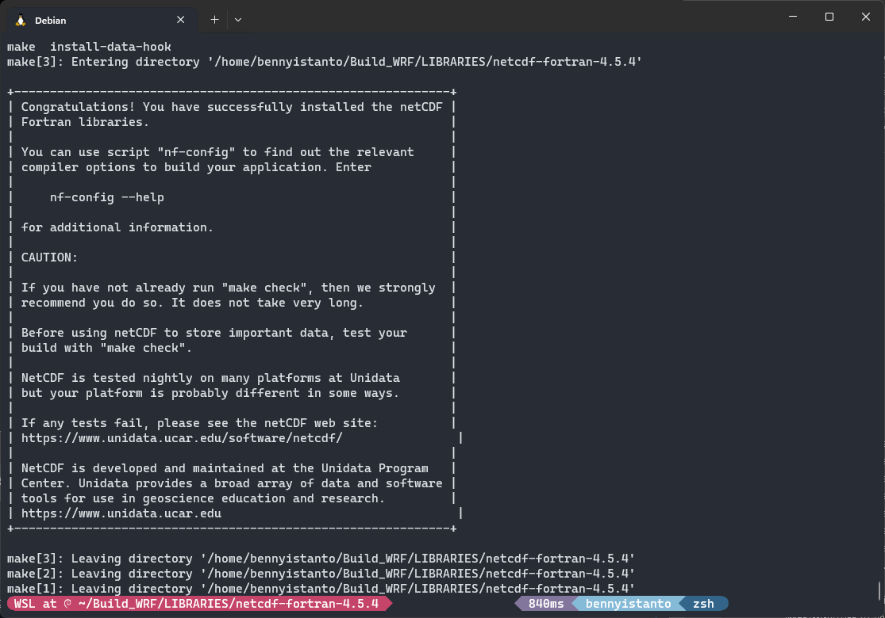
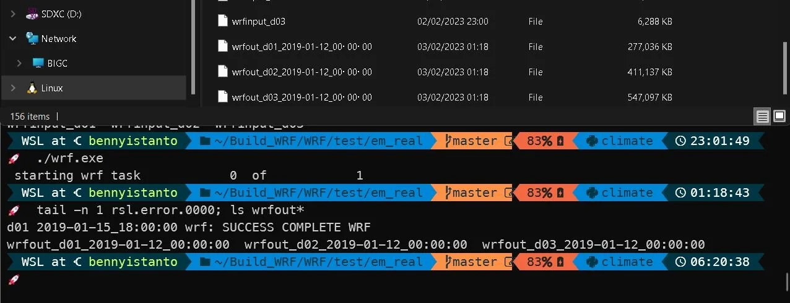

This section will explain on how to install the Weather Research and Forecasting ([WRF](https://www.mmm.ucar.edu/models/wrf)) Model inside Windows Subsystem for Linux (WSL) 2. This step-by-step guide was tested using Windows 11 with WSL2 - Debian 12 enabled running on ThinkStation P720.

--<br>
Benny Istanto, Climate Geographer<br>
GOST/DECSC/DECDG, The World Bank<br>

## Index
* [1. Working Directory](#1-working-directory)
* [2. Software Requirement](#2-software-requirement)
* [3. Building Libraries](#3-building-libraries)
* [4. Library Compatibility Test](#4-library-compatibility-test)
* [5. Building WRF](#5-building-wrf)
* [6. Building WPS](#6-building-wps)
* [7. Static Geography Data](#7-static-geography-data)
* [8. Real-time Data](#8-real-time-data)
* [References](#references)

## 1. Working Directory

When you start the WSL, you will be in the user's home directory: `/home/<username>/`. If you are not sure, to jump from any directory back to home from within a WSL command, you can use the command: `cd ~`

For this tutorial, I am working on these folder `/home/bennyistanto/`.

In the user's home directory: Create a new, clean directory called `Build_WRF`, and another one called `TESTS`

```
mkdir Build_WRF
mkdir TESTS
```

Make sure you update the packages in WSL by execute below:

```
sudo apt-get update
sudo apt-get install build-essential
sudo apt-get upgrade
```

## 2. Software Requirement

Before you can use your personal computers, it is necessary to ensure that all necessary programs and compilers are installed and that their functionality and compatibility have been confirmed through testing.

### 2.1. Compiler

Before anything else, it is crucial to have `gfortran`, `gcc`, and `cpp` compilers on your system. To check if they are present, enter the following command:

```
which gfortran cpp gcc g++
```

If they are installed, you will receive information about the location of each compiler.

If not, you need to install it before continue the rest. 

```
sudo apt-get install gfortran cpp gcc g++
```

It is recommended to use a Fortran compiler that complies with the Fortran 2003 standard (version 4.6 or higher). To determine the version of gfortran installed, enter the following command: 

```
gcc --version
```


Besides the compilers needed to create the WRF executables, the WRF build process uses scripts as the primary interface for users. For the WRF scripting system to function properly, it is essential to have the following installed: `csh`, `perl` and `sh`.

To check if they are present, enter the following command:

  ```
  which csh perl
  ```

For sh, it's usually part of the default shell and should already be available. If it's somehow missing or you encounter problems, it might be indicative of a larger issue with your shell environment.

If they are installed, you will receive information about the location of each compiler.

If not, you need to install it before continue the rest. 

  ```
  sudo apt-get install csh perl -y
  ```

This command will install both `csh` and `perl` at the same time, making the process more efficient. The `-y` flag automatically answers "yes" to any prompts during the installation process, ensuring that the installation proceeds without requiring interactive input.

### 2.2. Compiler Test

There are some straightforward tests that can be performed to ensure that the Fortran compiler has been properly constructed and is compatible with the C compiler.

* Navigate to `TESTS` directory

	```
	cd TESTS
	```

* Download and extract the test file.

	```
	wget https://www2.mmm.ucar.edu/wrf/OnLineTutorial/compile_tutorial/tar_files/Fortran_C_tests.tar
	tar -xf Fortran_C_tests.tar
	```

* Download file [`fortran-c-test.sh`](https://gist.github.com/bennyistanto/fb5dcfb1f9d9b3b8745e199523368a62#file-fortran-c-test-sh) and put inside `TESTS` directory, and execute it.

  ```
  sh fortran-c-test.sh
  ```

  There should be seven tests that should all display a SUCCESS message. If so, then everything is in good shape and you can proceed to building the required libraries.

* Or you can try to execute the test one-by-one:

  Test #1: Fixed Format Fortran Test

  ```
  gfortran TEST_1_fortran_only_fixed.f
  ./a.out
  ```

  Test #2: Free Format Fortran

  ```
  gfortran TEST_2_fortran_only_free.f90
  ./a.out
  ```

  Test #3: C: TEST_3_c_only.c

  ```
  gcc TEST_3_c_only.c
  ./a.out
  ```

  Test #4: Fortran Calling a C Function

  ```
  gcc -c -m64 TEST_4_fortran+c_c.c
  gfortran -c -m64 TEST_4_fortran+c_f.f90
  gfortran -m64 TEST_4_fortran+c_f.o TEST_4_fortran+c_c.o
  ./a.out
  ```

  Test #5: csh

  ```
  ./TEST_csh.csh
  ```

  Test #6: perl

  ```
  ./TEST_perl.pl
  ```

  Test #7: sh

  ```
  ./TEST_sh.sh
  ```

  

  The following should print out to the screen for each test:

  Test1: 
  ```
  SUCCESS test 1 fortran only fixed format
  ```

  Test2: 
  ```
  Assume Fortran 2003: has FLUSH, ALLOCATABLE, derived type, and ISO C Binding
  SUCCESS test 2 fortran only free format
  ```

  Test3: 
  ```
  SUCCESS test 3 c only
  ```

  Test4: 
  ```
  C function called by Fortran
  Values are xx = 2.00 and ii = 1
  SUCCESS test 4 fortran calling c
  ```

  Test5: 
  ```
  SUCCESS csh test
  ```

  Test6: 
  ```
  SUCCESS perl test
  ```

  Test7: 
  ```
  SUCCESS sh test
  ```

* After passing the test, back to the working directory.

	```
	cd ..
	```

### 2.3. Other packages

We need to install `json-c` and `valgrind` which will required during MPICH test. Here’s how you can install the latest available versions of JSON-C - <https://json-c.github.io/json-c/json-c-current-release/doc/html/index.html> and Valgrind - <https://valgrind.org/> in WSL2 Debian 12:

* Update your package list:

    ```bash
    sudo apt-get update
    ```
    
* Install JSON-C:
    
    You can install the latest version available in the Debian repository using:
    
    ```bash
    sudo apt-get install libjson-c-dev
    ```
    
* Install Valgrind:

    Install Valgrind using:
    
    ```bash
    sudo apt-get install valgrind
    ```


### 2.4. Conda

**OPTIONAL** Conda will use later after successfully run the WRF model and would like to utilizing the WRF output. If you just need to install the WRF, you can skip Conda installation.

Skip this step if you already have [Anaconda](https://www.anaconda.com/products/individual) or [Miniconda](https://docs.conda.io/projects/conda/en/stable/#) inside your WSL. This case I will use Anaconda instead of Miniconda.

* Go to [https://repo.anaconda.com/archive/](https://repo.anaconda.com/archive/) to find the list of Anaconda releases

* Select the release you want. I have a 64-bit computer, so I chose the latest release ending in `x86_64.sh`. If I had a 32-bit computer, I'd select the `x86.sh` version. If you accidentally try to install the wrong one, you'll get a warning in the terminal. I chose `Anaconda3-2023.09-0-Linux-x86_64.sh`.

* From the terminal run `wget https://repo.anaconda.com/archive/[YOUR VERSION]`. Example: 

	```bash
	wget https://repo.anaconda.com/archive/Anaconda3-2023.09-0-Linux-x86_64.sh
	```

* After download process completed, Run the installation script: `bash Anaconda[YOUR VERSION].sh` 

	```bash
	bash Anaconda3-2023.09-0-Linux-x86_64.sh
	```

* Read the license agreement and follow the prompts to press Return/Enter to accept. Later will follow with question on accept the license terms, type `yes` and Enter. When asks you if you'd like the installer to prepend it to the path, press Return/Enter to confirm the location. Last question will be about initialize Anaconda3, type `yes` then Enter.

* Close the terminal and reopen it to reload .bash configs. It will automatically activate `base` environment.

* Deactivate `base` environment then set to `false` the confirguration of auto activate the `base` environment by typing

	```bash
	conda deactivate && conda config --set auto_activate_base false
	```

* To test that it worked, `which python` in your Terminal. It should print a path that has anaconda in it. Mine is `/home/bennyistanto/anaconda3/bin/python`. If it doesn't have anaconda in the path, do the next step.

* Manually add the Anaconda bin folder to your PATH. To do this, I added `"export PATH=/home/bennyistanto/anaconda3/bin:$PATH"` to the bottom of my `~/.zshrc` file.

## 3. Building Libraries

Before getting started, it is necessary to create another directory. First, navigate to the `Build_WRF` directory by entering the following command:

```
cd Build_WRF
```

Then, create a directory called `LIBRARIES` using the following command:

```
mkdir LIBRARIES
cd LIBRARIES
```

The required libraries for your desired run may vary. But the essential libraries are below.

  1. **MPICH**, this library is required if you plan to run WRF in parallel mode on a machine with multiple processors. If your machine only has one processor or if you don't need to run WRF with multiple processors, you can skip the MPICH installation. Although any implementation of the MPI-2 standard should work with WRF, we have the most experience with MPICH, so that is the implementation that will be described. <https://www.mpich.org/>
  2. **zlib**, is a general-purpose, lossless data-compression library that is used by many software programs. Installing it first after the MPI compiler ensures that any other libraries or applications requiring compression capabilities can utilize it. <https://www.zlib.net/>
  3. **libpng**, is the official PNG reference library. It’s used for handling PNG images, potentially useful in visualizing data outputs from simulations if your configuration of WRF includes such capabilities. <http://www.libpng.org/pub/png/libpng.html>
  4. **Jasper**, is a software library for image coding and compression using the JPEG 2000 standard. It's important for WRF if our data inputs or outputs include JPEG 2000 formats, which might be used in data assimilation or visualization. <https://www.ece.uvic.ca/~frodo/jasper/>
  5. **HDF5**, this library required by NetCDF, is used for storing complex data arrays and is extensively used in scientific computing. HDF5 can utilize MPI for managing data in a parallel computing environment, which is why it’s beneficial to install MPICH before HDF5. <https://www.hdfgroup.org/solutions/hdf5/>
  6. **NetCDF**, it consist of `netcdf-c` <https://github.com/Unidata/netcdf-c/releases/tag/v4.8.1> and `netcdf-fortran` <https://github.com/Unidata/netcdf-fortran/releases/tag/v4.5.4>, both library is always necessary and essential for WRF as it is used for the creation, access, and sharing of array-oriented scientific data. This format is central to WRF data input and output. Installing NetCDF-C before NetCDF-Fortran is necessary because the Fortran interface depends on the C library.

Next we need to start downloading the libraries

* Download file [`library-download.sh`](https://gist.github.com/bennyistanto/fb5dcfb1f9d9b3b8745e199523368a62#file-library-download-sh), and execute it.

  ```
  sh library-download.sh
  ```
  
  Or you can download it one-by-one using below:
  
  ```bash
  wget https://github.com/pmodels/mpich/releases/download/v3.4.3/mpich-3.4.3.tar.gz
  wget https://www2.mmm.ucar.edu/wrf/OnLineTutorial/compile_tutorial/tar_files/zlib-1.2.11.tar.gz
  wget https://www2.mmm.ucar.edu/wrf/OnLineTutorial/compile_tutorial/tar_files/libpng-1.2.50.tar.gz
  wget https://www2.mmm.ucar.edu/wrf/OnLineTutorial/compile_tutorial/tar_files/jasper-1.900.1.tar.gz
  wget https://docs.hdfgroup.org/archive/support/ftp/HDF5/releases/hdf5-1.12/hdf5-1.12.0/src/hdf5-1.12.0.tar.gz
  wget https://github.com/Unidata/netcdf-c/archive/refs/tags/v4.8.1.tar.gz -O netcdf-c-4.8.1.tar.gz
  wget https://github.com/Unidata/netcdf-fortran/archive/refs/tags/v4.5.4.tar.gz -O netcdf-fortran-4.5.4.tar.gz
  ```

  Inside the folder you will find seven libraries: `mpich`, `zlib`, `libpng`, `jasper`, `hdf5`, `netcdf-c` and `netcdf-fortran`.

* For WRF, especially if you're planning to use parallel processing capabilities, it is essential that libraries which directly support parallel I/O operations (like HDF5, NetCDF-C, and NetCDF-Fortran) are compiled with a parallel-aware compiler such as MPICH. Here's a detailed breakdown:

	**Library Installation Order and Compiler Choices:**<br>
	1. **MPICH**: This should definitely be installed first, as it provides the necessary MPI libraries and compilers (like mpicc and mpif90) that are needed for parallel computing support in other libraries.
	2. **Zlib**: This library is used for compression and is a dependency for HDF5 and NetCDF. Zlib does not directly benefit from parallelization, so you can compile it with GCC or any standard C compiler.
	3. **Libpng**: This is used for handling PNG files and is also a dependency for Jasper. Like Zlib, it does not require parallelization capabilities, so a standard compiler can be used here.
	4. **Jasper**: Jasper is a library for handling JPEG2000 files, often used in conjunction with weather data formats. It also does not require MPI for its functionalities, so a standard C compiler is sufficient.
	5. **HDF5**: This is critical to compile with MPICH if you want to enable parallel I/O capabilities, which are essential for handling large datasets efficiently in a parallel computing environment like WRF.
	6. **NetCDF-C**: Since NetCDF builds on top of HDF5 for data access, it should also be compiled with MPICH to support parallel operations, especially for large data sets used in high-resolution models.
	7. **NetCDF-Fortran**: This provides a Fortran interface to the NetCDF-C libraries and should be compiled with MPICH for consistency and to enable parallel data handling in Fortran-based applications like WRF.

* Before installing the libraries, some paths must be set: 

  Download file [`set-env.sh`](https://gist.github.com/bennyistanto/fb5dcfb1f9d9b3b8745e199523368a62#file-set-env-sh), and execute it.

  ```
  sh set-env.sh
  ```

  To make sure all paths are correctly set, check file `.zshrc` in user's home directory using `nano`.

  ```
  nano ~/.zshrc
  ```

  Make sure all text written in script `set-env.sh` is there, usually at the bottom. If the list is there, you can close the `nano` window by pressing `ctrl` + `X`.

  If the above-mentioned path list is not there, you can manually add it. Don't forget to adjust the user's home directory folder with yours.

  ```
  # WRF Configuration Setting
  # Compilers
  export CC=/usr/bin/gcc
  export CXX=/usr/bin/g++
  export FC=/usr/bin/gfortran
  export FCFLAGS="-m64"
  export F77=/usr/bin/gfortran
  export FFLAGS="-m64"
  # Directory
  export DIR=/home/bennyistanto/Build_WRF/LIBRARIES
  export WRF_DIR=/home/bennyistanto/Build_WRF/WRF
  export MPICH=$DIR/mpich
  export NETCDF=$DIR/netcdf
  export JASPERLIB=$DIR/grib2/lib
  export JASPERINC=$DIR/grib2/include
  export PATH=$DIR/grib2/bin:$MPICH/bin:$NETCDF/bin:$PATH
  # Libraries
  export LD_LIBRARY_PATH=$DIR/grib2/lib:$LD_LIBRARY_PATH
  export LDFLAGS="-L$DIR/grib2/lib"
  export CPPFLAGS="-I$DIR/grib2/include"
  ```

  When you are done making your changes, press `ctrl` + `O` and hit `ENTER` to save the changes. Close `nano` by press `ctrl` + `X`
  
  > **Notes:**<br>
  > Above WRF environment setting, especially after "# Libraries" are works for `mpich`, `zlib`, `libpng`, `jasper`, `hdf5`, `netcdf-c`. Then you will modify those part before installing the `netcdf-fortran`. If you would like to re-install one of the first 6 libraries, don't forget to change back the environment setting, especially after "# Libraries" to the original setting.

* To see whats available configuration on each libraries, we can enter into each libraries folder, and execute below script:

	Example to check the configuration setting that available in `mpich`
	
	```
	tar xzvf mpich-3.4.3.tar.gz
	cd mpich-3.4.3
	./configure --help
	```
	
	The choice of configuration on each libraries are very subjective, we can explore it, try-and-error, implement depend on our need.

* It is important to ensure that these libraries are installed using the same compilers that will be used for the WRF and WPS installations.

	Download file [`library-build.sh`](https://gist.github.com/bennyistanto/fb5dcfb1f9d9b3b8745e199523368a62#file-library-build-sh), and execute it.

	```
	sh library-build.sh
	```

* Or we can install the library one-by-one using the following order, so it will much easier to track if there is an error on each package:

  * `mpich`, details on installation and configuration are available at <https://github.com/pmodels/mpich>
  
    ```
    # Untar the mpich library
    tar xzvf mpich-3.4.3.tar.gz
    # Entering the directory
    cd mpich-3.4.3
    # Configuration and install
    export FFLAGS=-fallow-argument-mismatch
    ./configure --prefix=$DIR/mpich --with-device=ch3:nemesis --enable-fast=all,O3 --disable-float --enable-threads=multiple
    make check
    make install
    # Set mpich path
    export PATH=$DIR/mpich/bin:$PATH
    # Back to LIBRARIES folder
    cd ..
    ```
  
  * Build `zlib` like below, details on installation and configuration are available at <https://www.zlib.net/zlib_faq.html#faq14>

    ```
    # Untar the zlib library
    tar xzvf zlib-1.2.11.tar.gz
    # Entering the directory
    cd zlib-1.2.11
    # Configuration and install
    ./configure --prefix=$DIR/grib2
    make check 
    make install
    # Back to LIBRARIES folder
    cd ..
    ```

  * `libpng`, details on installation and configuration are available at <https://github.com/pnggroup/libpng/blob/libpng16/INSTALL>
  
    ```
    # Untar the libpng library
    tar xzvf libpng-1.2.50.tar.gz
    # Entering the directory
    cd libpng-1.2.50
    # Configuration and install
    ./configure --prefix=$DIR/grib2
    make check 
    make install
    # Back to LIBRARIES folder
    cd ..
    ```
  
  * `jasper`, details on installation and configuration are available at <https://github.com/jasper-software/jasper/blob/master/INSTALL.txt>
  
    ```
    # Untar the jasper library
    tar xzvf jasper-1.900.1.tar.gz
    # Entering the directory
    cd jasper-1.900.1
    # Configuration and install
    ./configure --prefix=$DIR/grib2
    make check
    make install
    # Back to LIBRARIES folder
    cd ..
    ```
  
  * Then you build `hdf5`, specifying the location of the zlib library. Details on compiling steps are available at [here] (<https://docs.hdfgroup.org/hdf5/develop/_l_b_compiling.html>)
  
    ```
    # Untar the hdf5 library
    tar xzvf hdf5-1.12.0.tar.gz
    # Entering the directory
    cd hdf5-1.12.0
    # Configuration and install
    ./configure --prefix=$DIR/grib2 --with-zlib=$DIR/grib2 --enable-hl --enable-fortran
    make check 
    make install
    # Back to LIBRARIES folder
    cd ..
    ```

    Make sure you run `make check` after the configure process. If you get FAIL, then you can adjust the `configure` script by add/remove/modify the Optional Features. Check the option list using `./configure --help`.

    They are very well-behaved distributions, but sometimes the build doesn't work (perhaps because of something subtly misconfigured on the target machine). If one of these libraries is not working, netCDF will have serious problems.
    
    For parallel I/O: The configure script sets CFLAGS appropriately for standard compilers, but if you are building with parallel I/O using wrappers such as `mpicc`, `mpif90`, and `mpif77`, specify compilers using the CC, FC, and F77 variables before configure.
  
    You can change the configuration line above with below line.
  
    ```
    CC=mpicc FC=mpif90 F77=mpif77 CXX=mpicxx ./configure --prefix=$DIR/grib2 --with-zlib=$DIR/grib2 --enable-hl --enable-fortran --enable-parallel
    ```
    
    **Notes**:<br>
    **Compiler Environment Variables**: Specifying `CC=mpicc FC=mpif90 F77=mpif77` is correct for setting the C, Fortran 90, and Fortran 77 compilers to the MPICH wrappers. This will ensure that HDF5 is compiled with MPI support.

    **`--prefix=$DIR/grib2`**: This setting is supposed to define where HDF5 will be installed. Ensure that `$DIR` is correctly defined in your environment and that `/grib2` is the intended directory for HDF5. If you're installing HDF5 and not specifically related to GRIB2 data handling, consider a more descriptive directory, like `$DIR/hdf5`.

    **`--with-zlib=$DIR/grib2`**: This specifies where the configure script should look for the zlib library.

    **Flags**: 
    * `--enable-hl`: This enables the high-level API, which is generally recommended.<br>
    * `--enable-fortran`: Necessary if you plan to use HDF5 from Fortran applications.<br>
    * `--enable-parallel`: This is crucial for enabling parallel I/O capabilities in HDF5 using MPI.<br>

    Other option also available, please check using `./configure --help`
  
  * `netcdf-c`, details on installation and configuration are available at <https://github.com/Unidata/netcdf-c/blob/main/INSTALL.md>
  
    ```
    # Untar the netcdf library
    tar xzvf netcdf-c-4.8.1.tar.gz
    # Entering the directory
    cd netcdf-c-4.8.1
    # Configuration and install
    CPPFLAGS=-I$DIR/grib2/include LDFLAGS=-L$DIR/grib2/lib ./configure --prefix=$DIR/netcdf --with-hdf5=$DIR/grib2 --disable-dap --enable-netcdf-4 --enable-netcdf4 --enable-shared --enable-static --enable-large-file-tests --enable-parallel-tests --enable-hdf5 --enable-nczarr
    make check
    make install
    # Registering library
    libtool --finish $DIR/netcdf/lib
    # Back to LIBRARIES folder
    cd ..
    ```
    
    For parallel I/O: The configure script sets CFLAGS appropriately for standard compilers, but if you are building with parallel I/O using wrappers such as `mpicc`, `mpif90`, and `mpif77`, specify compilers using the CC, FC, and F77 variables before configure.
  
    You can change the configuration line above with below line.
  
    ```
    CC=mpicc FC=mpif90 F77=mpif77 CXX=mpicxx CPPFLAGS=-I$DIR/grib2/include LDFLAGS=-L$DIR/grib2/lib ./configure --prefix=$DIR/netcdf --with-hdf5=$DIR/grib2 --disable-dap --enable-netcdf-4 --enable-netcdf4 --enable-shared --enable-static --enable-large-file-tests --enable-parallel-tests --enable-hdf5 --enable-nczarr
    ```
  
    > Before continuing with `netcdf-fortran` installation, you need to update the `.zshrc`, so the `CPPFLAGS`, `LDFLAGS` and `LD_LIBRARY_PATH` are recognized the `netcdf-c` library that has been installed in previous step. 
    > Download file [`update_zshrc.sh`](https://gist.github.com/bennyistanto/fb5dcfb1f9d9b3b8745e199523368a62#file-update-zshrc-sh) and put inside `LIBRARIES` directory, and execute it.
    >
    > ```
    > sh update_zshrc.sh
    > ```
    > Details on above script is below.
    > ```
    > #!/bin/bash
    > 
    > # Path to your .zshrc file
    > ZSHRC="$HOME/.zshrc"
    > 
    > # Backup original .zshrc file before making changes
    > cp "$ZSHRC" "$ZSHRC.backup"
    > 
    > # Update environment variables for netcdf-fortran installation
    > sed -i 's|export CPPFLAGS="-I$DIR/grib2/include"|export CPPFLAGS="-I$DIR/netcdf/include -I$DIR/grib2/include"|' "$ZSHRC"
    > sed -i 's|export LDFLAGS="-L$DIR/grib2/lib"|export LDFLAGS="-L$DIR/netcdf/lib -L$DIR/grib2/lib"|' "$ZSHRC"
    > sed -i 's|export LD_LIBRARY_PATH=$DIR/grib2/lib:$LD_LIBRARY_PATH|export LD_LIBRARY_PATH=$DIR/netcdf/lib:$DIR/grib2/lib:$LD_LIBRARY_PATH|' "$ZSHRC"
    > 
    > # Add LIBS="-lnetcdf -lz -lhdf5_hl -lhdf5 -lm" if not already present
    > if ! grep -q 'export LIBS="-lnetcdf -lz -lhdf5_hl -lhdf5 -lm"' "$ZSHRC"; then
    >  echo 'export LIBS="-lnetcdf -lz -lhdf5_hl -lhdf5 -lm"' >> "$ZSHRC"
    > fi
    > 
    > echo "Updated .zshrc for netcdf-fortran installation. Original .zshrc backed up to $ZSHRC.backup"
    > ```
    >
    > Or you can manually update the `.zshrc` file. Replace lines below.
    >
    > ```
    > # Libraries
    > export LD_LIBRARY_PATH=$DIR/grib2/lib:$LD_LIBRARY_PATH
    > export LDFLAGS="-L$DIR/grib2/lib"
    > export CPPFLAGS="-I$DIR/grib2/include"
    > ```
    >
    > With below lines.
    >
    > ```
    > # Libraries
    > export CPPFLAGS="-I$DIR/netcdf/include -I$DIR/grib2/include"
    > export LDFLAGS="-L$DIR/netcdf/lib -L$DIR/grib2/lib"
    > export LD_LIBRARY_PATH=$DIR/netcdf/lib:$DIR/grib2/lib:$LD_LIBRARY_PATH
    > export LIBS="-lnetcdf -lz -lhdf5_hl -lhdf5 -lm"
    > ```

  * `netcdf-fortran`

    ```
    # Untar the netcdf-fortran library
    tar xzvf netcdf-fortran-4.5.4.tar.gz
    # Entering the directory
    cd netcdf-fortran-4.5.4
    # Configuration and install
    CPPFLAGS="-I$DIR/netcdf/include -I$DIR/grib2/include" LDFLAGS="-L$DIR/netcdf/lib -L$DIR/grib2/lib" ./configure --prefix=$DIR/netcdf --enable-shared --enable-static --enable-large-file-tests --disable-fortran-type-check
    make check
    make install
    # Back to LIBRARIES folder
    cd ..
    ```
    
    If in previous `netcdf-c` installation, you are using `mpich` compiler to enable parallelization, then you need to do the same for the `netcdf-fortran`. You can change the configuration line above with below line.
    
    ```
    CC=mpicc FC=mpif90 F77=mpif77 CXX=mpicxx CPPFLAGS="-I$DIR/netcdf/include -I$DIR/grib2/include" LDFLAGS="-L$DIR/netcdf/lib -L$DIR/grib2/lib" ./configure --prefix=$DIR/netcdf --enable-shared --enable-static --enable-large-file-tests --disable-fortran-type-check
    ```

    
  
  In all cases, the installation location specified with the `--prefix` option must be different from the source directory where the software is being built.
  
  Note that for shared libraries, you may need to add the install directory to the `LD_LIBRARY_PATH` environment variable.

## 4. Library Compatibility Test

After the system environment tests have confirmed that the target machine can build small Fortran and C executables and the NetCDF and MPI libraries have been constructed (as described in the Building Libraries section), two additional tests are necessary to mimic the behavior of the WRF code. These tests are needed to confirm that the libraries are compatible with the compilers that will be used for the WPS and WRF builds.

* Navigate to `TESTS` directory

	```
	cd ~/TESTS
	```

* Download and extract the test file.

	```
	wget https://www2.mmm.ucar.edu/wrf/OnLineTutorial/compile_tutorial/tar_files/Fortran_C_NETCDF_MPI_tests.tar
	tar -xf Fortran_C_NETCDF_MPI_tests.tar
	```

* Download file [`fortran-lib-test.sh`](https://gist.github.com/bennyistanto/fb5dcfb1f9d9b3b8745e199523368a62#file-fortran-lib-test-sh) and put inside `TESTS` directory, and execute it.

	```
	sh fortran-lib-test.sh
	```

	There should be two tests that should all display a SUCCESS message. If so, then everything is in good shape and you can proceed to building the WRF.

	The following should print out to the screen for each test:

	Test1: 

	```
	C function called by Fortran
	Values are xx = 2.00 and ii = 1
	SUCCESS test 1 fortran + c + netcdf
	```

	Test2: 
	
	```
	C function called by Fortran
	Values are xx = 2.00 and ii = 1
	status = 2
	SUCCESS test 2 fortran + c + netcdf + mpi
	```

* After passing the test, back to the working directory.

    ```
    cd ~/Build_WRF
    ```

## 5. Building WRF

Once you have confirmed that all libraries are compatible with the compilers, you can proceed to build WRF. The source code for WRF can be obtained from the WRF's [Github](https://github.com/wrf-model/) repo.

* To obtain the source code, execute below code:

	```
	git clone https://github.com/wrf-model/WRF
	```

	Inside folder `Build_WRF`, you will have a folder `WRF` which contain the source code.

* Once you obtain the WRF source code, go into the WRF directory:

	```
	cd WRF
	```

* Create a configuration file for your computer and compiler:
	
	```
	./configure
	```

	You will encounter different options. Select the option that corresponds to the compiler you are using and the desired method of building WRF (e.g. serial or parallel). There are 3 parallel options (smpar, dmpar, and dm+sm), but dmpar is the most commonly used and recommended choice.
	
	> What are the differences between Serial, SMPar, and DMPar compiles of WRF?
	> 
	> Serial is used for a single CPU, SMPar is for multi-core/multi CPUs, and DMPar is for clusters.
	> 
	> SMPar means "Shared-memory Parallelism." In practice the OpenMP directives are enabled and the resulting binary will only run within a single shared-memory system. This option is not highly tested, however, and is usually not recommended if the option for DMPar is available.
	> 
	> DMPar means "Distributed-memory Parallelism," which means MPI will be used in the build. The resulting binary will run within and across multiple nodes of a distributed-memory system (or cluster).
	> 
	> Ref: <https://forum.mmm.ucar.edu/threads/what-are-the-differences-between-serial-smpar-and-dmpar-compiles-of-wrf.65/>

	```
	------------------------------------------------------------------------
	Please select from among the following Linux x86_64 options:
	
	  1. (serial)   2. (smpar)   3. (dmpar)   4. (dm+sm)   PGI (pgf90/gcc)
	  5. (serial)   6. (smpar)   7. (dmpar)   8. (dm+sm)   PGI (pgf90/pgcc): SGI MPT
	  9. (serial)  10. (smpar)  11. (dmpar)  12. (dm+sm)   PGI (pgf90/gcc): PGI accelerator
	 13. (serial)  14. (smpar)  15. (dmpar)  16. (dm+sm)   INTEL (ifort/icc)
 	                                         17. (dm+sm)   INTEL (ifort/icc): Xeon Phi (MIC architecture)
	 18. (serial)  19. (smpar)  20. (dmpar)  21. (dm+sm)   INTEL (ifort/icc): Xeon (SNB with AVX mods)
	 22. (serial)  23. (smpar)  24. (dmpar)  25. (dm+sm)   INTEL (ifort/icc): SGI MPT
	 26. (serial)  27. (smpar)  28. (dmpar)  29. (dm+sm)   INTEL (ifort/icc): IBM POE
	 30. (serial)               31. (dmpar)                PATHSCALE (pathf90/pathcc)
	 32. (serial)  33. (smpar)  34. (dmpar)  35. (dm+sm)   GNU (gfortran/gcc)
	 36. (serial)  37. (smpar)  38. (dmpar)  39. (dm+sm)   IBM (xlf90_r/cc_r)
	 40. (serial)  41. (smpar)  42. (dmpar)  43. (dm+sm)   PGI (ftn/gcc): Cray XC CLE
	 44. (serial)  45. (smpar)  46. (dmpar)  47. (dm+sm)   CRAY CCE (ftn $(NOOMP)/cc): Cray XE and XC
	 48. (serial)  49. (smpar)  50. (dmpar)  51. (dm+sm)   INTEL (ftn/icc): Cray XC
	 52. (serial)  53. (smpar)  54. (dmpar)  55. (dm+sm)   PGI (pgf90/pgcc)
	 56. (serial)  57. (smpar)  58. (dmpar)  59. (dm+sm)   PGI (pgf90/gcc): -f90=pgf90
	 60. (serial)  61. (smpar)  62. (dmpar)  63. (dm+sm)   PGI (pgf90/pgcc): -f90=pgf90
	 64. (serial)  65. (smpar)  66. (dmpar)  67. (dm+sm)   INTEL (ifort/icc): HSW/BDW
	 68. (serial)  69. (smpar)  70. (dmpar)  71. (dm+sm)   INTEL (ifort/icc): KNL MIC
	 72. (serial)  73. (smpar)  74. (dmpar)  75. (dm+sm)   AMD (flang/clang) :  AMD ZEN1/ ZEN2/ ZEN3 Architectures
	 76. (serial)  77. (smpar)  78. (dmpar)  79. (dm+sm)   INTEL (ifx/icx) : oneAPI LLVM
	 80. (serial)  81. (smpar)  82. (dmpar)  83. (dm+sm)   FUJITSU (frtpx/fccpx): FX10/FX100 SPARC64 IXfx/Xlfx

	 Enter selection [1-83] :
	```

	Type `34` then press `ENTER`

	Then choose nesting options `(0=no nesting, 1=basic, 2=preset moves, 3=vortex following) [default 0]`: `1`
	
	If everything going well, you will found below message
	
	```
	Configuration successful!
	------------------------------------------------------------------------
	testing for fseeko and fseeko64
	fseeko64 is supported
	------------------------------------------------------------------------

	# Settings for    Linux x86_64 ppc64le, gfortran compiler with gcc   (dmpar)
	#
	...
	...
	######################
	------------------------------------------------------------------------
	Settings listed above are written to configure.wrf.
	If you wish to change settings, please edit that file.
	If you wish to change the default options, edit the file:
	     arch/configure.defaults
	NetCDF users note:
	 This installation of NetCDF supports large file support.  To DISABLE large file
	 support in NetCDF, set the environment variable WRFIO_NCD_NO_LARGE_FILE_SUPPORT
	 to 1 and run configure again. Set to any other value to avoid this message.


	Testing for NetCDF, C and Fortran compiler

	This installation of NetCDF is 64-bit
			 C compiler is 64-bit
		   Fortran compiler is 64-bit
		      It will build in 64-bit

	NetCDF version: 4.8.1
	Enabled NetCDF-4/HDF-5: yes
	NetCDF built with PnetCDF: no


	************************** W A R N I N G ************************************

	The moving nest option is not available due to missing rpc/types.h file.
	Copy landread.c.dist to landread.c in share directory to bypass compile error.

	*****************************************************************************
	*****************************************************************************
	This build of WRF will use NETCDF4 with HDF5 compression
	*****************************************************************************
	```

* After finishing your configuration, you should have a `configure.wrf` file and be prepared to compile WRF. You must choose which type of case you want to compile from the following options:

	```
	em_real (3d real case)
	em_quarter_ss (3d ideal case)
	em_b_wave (3d ideal case)
	em_les (3d ideal case)
	em_heldsuarez (3d ideal case)
	em_tropical_cyclone (3d ideal case)
	em_hill2d_x (2d ideal case)
	em_squall2d_x (2d ideal case)
	em_squall2d_y (2d ideal case)
	em_grav2d_x (2d ideal case)
	em_seabreeze2d_x (2d ideal case)
	em_scm_xy (1d ideal case)
	```

	Run `compile` function where `case_name` is one of the options listed above.

	```
	./compile case_name >& log.compile
	```

	If you have multi processor and want to leverage it, you can mention the number of processor would like to use. Example: `./compile [-j n] case_name` where `n` is number of processor, default is `2`. See below:

	```
	./compile -j 8 em_real
	```

	Compilation should take about 20-30 minutes. And youwill get printed message like below
	
	```
	( cd test/em_real ; /bin/rm -f GENPARM.TBL ; ln -s ../../run/GENPARM.TBL . )
	( cd test/em_real ; /bin/rm -f LANDUSE.TBL ; ln -s ../../run/LANDUSE.TBL . )
	( cd test/em_real ; /bin/rm -f SOILPARM.TBL ; ln -s ../../run/SOILPARM.TBL . )
	( cd test/em_real ; /bin/rm -f URBPARM.TBL ; ln -s ../../run/URBPARM.TBL . )
	( cd test/em_real ; /bin/rm -f URBPARM_LCZ.TBL ; ln -s ../../run/URBPARM_LCZ.TBL . )
	( cd test/em_real ; /bin/rm -f VEGPARM.TBL ; ln -s ../../run/VEGPARM.TBL . )
	( cd test/em_real ; /bin/rm -f MPTABLE.TBL ; ln -s ../../run/MPTABLE.TBL . )
	( cd test/em_real ; /bin/rm -f tr49t67 ; ln -s ../../run/tr49t67 . )
	( cd test/em_real ; /bin/rm -f tr49t85 ; ln -s ../../run/tr49t85 . )
	( cd test/em_real ; /bin/rm -f tr67t85 ; ln -s ../../run/tr67t85 . )
	( cd test/em_real ; /bin/rm -f gribmap.txt ; ln -s ../../run/gribmap.txt . )
	( cd test/em_real ; /bin/rm -f grib2map.tbl ; ln -s ../../run/grib2map.tbl . )
	( cd run ; /bin/rm -f real.exe ; ln -s ../main/real.exe . )
	( cd run ; /bin/rm -f tc.exe ; ln -s ../main/tc.exe . )
	( cd run ; /bin/rm -f ndown.exe ; ln -s ../main/ndown.exe . )
	( cd run ; if test -f namelist.input ; then \
		/bin/cp -f namelist.input namelist.input.backup.`date +%Y-%m-%d_%H_%M_%S` ; fi ; \
		/bin/rm -f namelist.input ; cp ../test/em_real/namelist.input . )

	==========================================================================
	build started:   Mon Apr 22 21:43:14 WIB 2024
	build completed: Mon Apr 22 22:01:41 WIB 2024

	--->                  Executables successfully built                  <---

	-rwxr-xr-x 1 bennyistanto bennyistanto 46327520 Apr 22 22:01 main/ndown.exe
	-rwxr-xr-x 1 bennyistanto bennyistanto 46470888 Apr 22 22:01 main/real.exe
	-rwxr-xr-x 1 bennyistanto bennyistanto 45594520 Apr 22 22:01 main/tc.exe
	-rwxr-xr-x 1 bennyistanto bennyistanto 54865048 Apr 22 22:00 main/wrf.exe

	==========================================================================
	```

* Once the compilation completes, to check whether it was successful, you need to look for executables in the `WRF/main` directory:

	```
	ls -ls main/*.exe
	```

	If you compiled a real case, you should see:
	
	* `wrf.exe` (model executable)
	* `real.exe` (real data initialization)
	* `ndown.exe` (one-way nesting)
	* `tc.exe` (for tc bogusing--serial only)
	

	These executables are linked to 2 different directories:
	
	* `WRF/run`
	* `WRF/test/em_real`
	
	You can choose to run WRF from either directory.

  

## 6. Building WPS

After constructing the WRF model, the next step is to build the WPS (WRF Pre-Processing System) program if you intend to run real cases instead of idealized cases. It is crucial that the WRF model is built correctly before attempting to build the WPS programs. You can acquire the WPS code by following the same process for obtaining the WRF code.	

* Navigate to the WRF main directory:

	```
	cd ~/Build_WRF
	```

* To obtain the source code, execute below code:

	```
	git clone https://github.com/wrf-model/WPS
	```

	Inside folder `Build_WRF`, you will have two folders `WPS` adn `WRF` from previous step.

* Once you obtain the WPS source code, go into the WPS directory:

	```
	cd WPS
	```

* Similar to the WRF model, make sure the WPS directory is clean, by issuing:
	
	```
	./clean
	```

* The next step is to configure WPS, however, you first need to set some paths for the ungrib libraries:
	
	```
	export JASPERLIB=$DIR/grib2/lib
	export JASPERINC=$DIR/grib2/include
	```

* The environment variable needs to be set with the path to the compiled WRF. Don't forget to adjust the user's home directory below.

	```
	export WRF_DIR=/home/bennyistanto/Build_WRF/WRF
	```

* Then you can configure:

	```
	./configure
	```

	To build the WPS program, you will need to choose from various options including the compiler type, whether to compile in serial or parallel, and if ungrib should be compiled with GRIB2 capability. It is recommended to compile WPS in serial mode, even if WRF was compiled in parallel, unless you plan to create very large domains. Furthermore, it is advisable to select a GRIB2 option, as most data is now in that format. You can still run grib1 data even if you have built with grib2. Select the option that matches the compiler you used to compile WRF, is set to serial mode, and has GRIB2 enabled. Please note that the option number may differ from the one you chose for WRF.

	```
	------------------------------------------------------------------------
	Please select from among the following supported platforms.

	   1.  Linux x86_64, gfortran    (serial)
	   2.  Linux x86_64, gfortran    (serial_NO_GRIB2)
	   3.  Linux x86_64, gfortran    (dmpar)
	   4.  Linux x86_64, gfortran    (dmpar_NO_GRIB2)
	   5.  Linux x86_64, PGI compiler   (serial)
	   6.  Linux x86_64, PGI compiler   (serial_NO_GRIB2)
	   7.  Linux x86_64, PGI compiler   (dmpar)
	   8.  Linux x86_64, PGI compiler   (dmpar_NO_GRIB2)
	   9.  Linux x86_64, PGI compiler, SGI MPT   (serial)
	  10.  Linux x86_64, PGI compiler, SGI MPT   (serial_NO_GRIB2)
	  11.  Linux x86_64, PGI compiler, SGI MPT   (dmpar)
	  12.  Linux x86_64, PGI compiler, SGI MPT   (dmpar_NO_GRIB2)
	  13.  Linux x86_64, IA64 and Opteron    (serial)
	  14.  Linux x86_64, IA64 and Opteron    (serial_NO_GRIB2)
	  15.  Linux x86_64, IA64 and Opteron    (dmpar)
	  16.  Linux x86_64, IA64 and Opteron    (dmpar_NO_GRIB2)
	  17.  Linux x86_64, Intel compiler    (serial)
	  18.  Linux x86_64, Intel compiler    (serial_NO_GRIB2)
	  19.  Linux x86_64, Intel compiler    (dmpar)
	  20.  Linux x86_64, Intel compiler    (dmpar_NO_GRIB2)
	  21.  Linux x86_64, Intel compiler, SGI MPT    (serial)
	  22.  Linux x86_64, Intel compiler, SGI MPT    (serial_NO_GRIB2)
	  23.  Linux x86_64, Intel compiler, SGI MPT    (dmpar)
	  24.  Linux x86_64, Intel compiler, SGI MPT    (dmpar_NO_GRIB2)
	  25.  Linux x86_64, Intel compiler, IBM POE    (serial)
	  26.  Linux x86_64, Intel compiler, IBM POE    (serial_NO_GRIB2)
	  27.  Linux x86_64, Intel compiler, IBM POE    (dmpar)
	  28.  Linux x86_64, Intel compiler, IBM POE    (dmpar_NO_GRIB2)
	  29.  Linux x86_64 g95 compiler     (serial)
	  30.  Linux x86_64 g95 compiler     (serial_NO_GRIB2)
	  31.  Linux x86_64 g95 compiler     (dmpar)
	  32.  Linux x86_64 g95 compiler     (dmpar_NO_GRIB2)
	  33.  Cray XE/XC CLE/Linux x86_64, Cray compiler   (serial)
	  34.  Cray XE/XC CLE/Linux x86_64, Cray compiler   (serial_NO_GRIB2)
	  35.  Cray XE/XC CLE/Linux x86_64, Cray compiler   (dmpar)
	  36.  Cray XE/XC CLE/Linux x86_64, Cray compiler   (dmpar_NO_GRIB2)
	  37.  Cray XC CLE/Linux x86_64, Intel compiler   (serial)
	  38.  Cray XC CLE/Linux x86_64, Intel compiler   (serial_NO_GRIB2)
	  39.  Cray XC CLE/Linux x86_64, Intel compiler   (dmpar)
	  40.  Cray XC CLE/Linux x86_64, Intel compiler   (dmpar_NO_GRIB2)

	Enter selection [1-40] :
	```

	Type `3` then press `ENTER`

	The `metgrid.exe` and `geogrid.exe` programs require the I/O libraries from the WRF model. The location of these libraries already set in previous step by add `WRF_DIR = /home/bennyistanto/Build_WRF/WRF` to the `PATH` and usually also automatically specified in the `configure.wps`.

	This is the default setting and will be accurate if the top-level directory for the WRF model is named `WRF` and both the `WPS` and `WRF` directories are located at the same level. If this is not the case, you need to modify the configure file before compiling and saving the changes.

* You can now compile WPS:
	
	```
	./compile >& log.compile
	```

	Compilation should only take a few minutes.

* If the compilation is successful, there should be 3 executables in the WPS top-level directory, that are linked to their corresponding src/ directories:

	* `geogrid.exe` -> `geogrid/src/geogrid.exe`
	* `ungrib.exe` -> `ungrib/src/ungrib.exe`
	* `metgrid.exe` -> `metgrid/src/metgrid.exe`

	Verify that they are not zero-sized (inside the `*/src/` directory). To see file size, you can type (for e.g.,):

	```
	ls -ls geogrid/src/geogrid.exe
	```

## 7. Static Geography Data

To use WRF to create real-data simulations, the location of the domain must first be determined. This requires a data set that contains fields such as topography and land use catergories. Such datasets can be found on the WRF website at <http://www2.mmm.ucar.edu/wrf/users/download/getsourceswps_geog.html>. 

* Navigate to the main folder `Build_WRF`then download the data

	```
	cd ~/Build_WRF
	wget https://www2.mmm.ucar.edu/wrf/src/wps_files/geog_high_res_mandatory.tar.gz
	```
	
	When downloading the complete dataset, be aware that it is a large file. To prevent individual users from having to download the file multiple times, consider placing it in a central location that can be accessed by all. 

* After downloading, uncompress and un-tar the file to make it ready for use.

	```
	gunzip geog.tar.gz
	tar -xf geog.tar
	```

* When you untar the file, it will be called "geog." Rename the file to "WPS_GEOG."

	```
	mv geog WPS_GEOG
	```

* The directory infomation is given to the geogrid program in the `/Build_WRF/WPS/namelist.wps` file in the `&geogrid` section. Navigate to the `WPS` folder and change the path directory according to user's home directory.

	```
	cd WPS
	nano namelist.wps
	```

	Change `geog_data_path = /home/bennyistanto/Build_WRF/WPS_GEOG`
	
	When you are done making your changes, press `ctrl` + `O` and hit `ENTER` to save the changes. Close `nano` by press `ctrl` + `X`

	The data expands to approximately 10 GB. This data allows a user to run the `geogrid.exe` program.

## 8. Real-time Data

* To run real-data cases, the WRF model requires current meteorological information for both initial and lateral boundary conditions. This data is traditionally provided as a Grib file obtained from a previously run external model or analysis. For a semi-operational set-up, the meteorological data is generally sourced from a global model, which permits locating the WRF model's domains anywhere on the globe.

* The National Centers for Environmental Prediction (NCEP) operates the Global Forecast System (GFS) model, which is available four times a day (initializations valid for 0000, 0600, 1200, and 1800 UTC). This is a global, isobaric, 0.5-degree latitude/longitude, forecast dataset that is freely available and is usually accessible four hours after the initialization time period.

* To access the required data, a single file must be acquired for each requested time period. For instance, if you need hours 0, 6, and 12 of a forecast that was initialized on July 12, 2019, at 0000 UTC, you will require the following times:

	```
	2019071200 – 0 h
	2019071206 – 6 h
	2019071212 – 12 h
	```

	These times correspond to the following file names:

	```
	gfs.2019071200/gfs.t00z.pgrb2.0p50.f000
	gfs.2019071200/gfs.t00z.pgrb2.0p50.f006
	gfs.2019071200/gfs.t00z.pgrb2.0p50.f012
	```

	Note that the initialization data and time (gfs.2019071200) remain the same, and the forecast cycle remains the same (t00z). The forecast hour (f00, f06, f12) is incremented.

* To obtain the data, create a directory in `Build_WRF` named `DATA` and then navigate to that directory. 

	```
	cd ~/Build_WRF
	mkdir DATA
	cd DATA
  ```
	
* A straightforward set of interactive commands to obtain these files from the NCEP servers in real-time would look like:

	* The time and date presented above is just an example, as the NCEP data servers usually have only the latest 2-3 days' data available. Therefore, if you want to use current real-time data, you must modify the commands to reflect the current date and time.
	* Typically, these commands will return a complete file within a couple of minutes, and the files will be in Grib Edition 2 format, which can be directly used by the ungrib program.
	* The following three commands are separate commands to download data for three distinct times. Each command includes the "wget" command and the full https address and file name.

	```
	wget https://ftp.ncep.noaa.gov/data/nccf/com/gfs/prod/gfs.20230201/00/atmos/gfs.t00z.pgrb2.0p25.f000
	wget https://ftp.ncep.noaa.gov/data/nccf/com/gfs/prod/gfs.20230201/00/atmos/gfs.t00z.pgrb2.0p25.f003
	wget https://ftp.ncep.noaa.gov/data/nccf/com/gfs/prod/gfs.20230201/00/atmos/gfs.t00z.pgrb2.0p25.f006
	```

## References

This step-by-step was adapted from the WRF official tutorial: <https://www2.mmm.ucar.edu/wrf/OnLineTutorial/compilation_tutorial.php>

## Supporting Files

::: {.callout-note collapse="true" title="Shell - fortran-c-test.sh"}
```bash
#!/bin/bash
# System Environment Tests
# Test1
echo "Test #1: Fixed Format Fortran Test"
gfortran TEST_1_fortran_only_fixed.f
./a.out
echo ""

# Test2
echo "Test #2: Free Format Fortran"
gfortran TEST_2_fortran_only_free.f90
./a.out
echo ""

# Test3
echo "Test #3: C: TEST_3_c_only.c"
gcc TEST_3_c_only.c
./a.out
echo ""

# Test4
echo "Test #4: Fortran Calling a C Function"
gcc -c -m64 TEST_4_fortran+c_c.c
gfortran -c -m64 TEST_4_fortran+c_f.f90
gfortran -m64 TEST_4_fortran+c_f.o TEST_4_fortran+c_c.o
./a.out
echo ""

# Test5
echo "Test #5: csh"
./TEST_csh.csh
echo ""

# Test6
echo "Test #6: perl"
./TEST_perl.pl
echo ""

# Test7
echo "Test #7: sh"
./TEST_sh.sh
echo ""
```
:::

::: {.callout-note collapse="true" title="Shell - fortran-lib-test.sh"}
```bash
#!/bin/bash
# Library Compatibility Tests
# Test1
echo "Test #1: Fortran + C + NetCDF"
echo "The NetCDF-only test requires the netcdf.inc file from the NETCDF package be in this directory. Copying the file."
cp ${NETCDF}/include/netcdf.inc .
echo "Compile the Fortran and C codes for the purpose of this test (the -c option says to not try to build an executable)."
gfortran -c 01_fortran+c+netcdf_f.f
gcc -c 01_fortran+c+netcdf_c.c
gfortran 01_fortran+c+netcdf_f.o 01_fortran+c+netcdf_c.o -L${NETCDF}/lib -lnetcdff -lnetcdf
./a.out
echo ""

# Test2
echo "Test #2: Fortran + C + NetCDF + MP"
echo "The NetCDF+MPI test requires include files from both of these packages be in this directory,"
echo "but the MPI scripts automatically make the mpif.h file available without assistance,"
echo "so no need to copy that one. Copying the NetCDF file"
cp ${NETCDF}/include/netcdf.inc .
echo "Note that the MPI executables mpif90 and mpicc are used below when compiling."
mpif90 -c 02_fortran+c+netcdf+mpi_f.f
mpicc -c 02_fortran+c+netcdf+mpi_c.c
mpif90 02_fortran+c+netcdf+mpi_f.o 02_fortran+c+netcdf+mpi_c.o -L${NETCDF}/lib -lnetcdff -lnetcdf
mpirun ./a.out
echo ""
```
:::

::: {.callout-note collapse="true" title="Shell - library-build.sh"}
```bash
#!/bin/bash
# mpich
# Untar the mpich library
tar xzvf mpich-3.4.3.tar.gz
# Entering the directory
cd mpich-3.4.3
# Configuration and install
export FFLAGS=-fallow-argument-mismatch
./configure --prefix=$DIR/mpich --with-device=ch3:nemesis --enable-fast=all,O3 --disable-float --enable-threads=multiple
make check
make install
# Back to LIBRARIES folder
cd ..

# zlib
# Untar the zlib library
tar xzvf zlib-1.2.11.tar.gz
# Entering the directory
cd zlib-1.2.11
# Configuration and install
./configure --prefix=$DIR/grib2
make check
make install
# Back to LIBRARIES folder
cd ..

# libpng
# Untar the libpng library
tar xzvf libpng-1.2.50.tar.gz
# Entering the directory
cd libpng-1.2.50
# Configuration and install
./configure --prefix=$DIR/grib2
make check 
make install
# Back to LIBRARIES folder
cd ..

# jasper
# Untar the jasper library
tar xzvf jasper-1.900.1.tar.gz
# Entering the directory
cd jasper-1.900.1
# Configuration and install
./configure --prefix=$DIR/grib2
make check
make install
# Back to LIBRARIES folder
cd ..

# hdf5
# Untar the hdf5 library
tar xzvf hdf5-1.12.0.tar.gz
# Entering the directory
cd hdf5-1.12.0
# Configuration and install
./configure --prefix=$DIR/grib2 --with-zlib=$DIR/grib2 --enable-hl --enable-fortran
#CC=mpicc FC=mpif90 F77=mpif77 CXX=mpicxx ./configure --prefix=$DIR/grib2 --with-zlib=$DIR/grib2 --enable-hl --enable-fortran --enable-parallel
make check
make install
# Back to LIBRARIES folder
cd ..

# netcdf-c
# Untar the netcdf library
tar xzvf netcdf-c-4.8.1.tar.gz
# Entering the directory
cd netcdf-c-4.8.1
# Configuration and install
CPPFLAGS=-I$DIR/grib2/include LDFLAGS=-L$DIR/grib2/lib ./configure --prefix=$DIR/netcdf --with-hdf5=$DIR/grib2 --disable-dap --enable-netcdf-4 --enable-netcdf4 --enable-shared --enable-static --enable-large-file-tests --enable-parallel-tests --enable-hdf5 --enable-nczarr
#CC=mpicc FC=mpif90 F77=mpif77 CXX=mpicxx CPPFLAGS=-I$DIR/grib2/include LDFLAGS=-L$DIR/grib2/lib ./configure --prefix=$DIR/netcdf --with-hdf5=$DIR/grib2 --disable-dap --enable-netcdf-4 --enable-netcdf4 --enable-shared --enable-static --enable-large-file-tests --enable-parallel-tests --enable-hdf5 --enable-nczarr
make check
make install
# Registering the library
libtool --finish $DIR/netcdf/lib
# Update environment variables for netcdf-fortran installation
export CPPFLAGS="-I$DIR/netcdf/include -I$DIR/grib2/include"
export LDFLAGS="-L$DIR/netcdf/lib -L$DIR/grib2/lib"
export LD_LIBRARY_PATH=$DIR/netcdf/lib:$DIR/grib2/lib:$LD_LIBRARY_PATH
# Add LIBS="-lnetcdf -lz" if not already present
export LIBS="-lnetcdf -lz -lhdf5_hl -lhdf5 -lm"
# Back to LIBRARIES folder
cd ..

# netcdf-fortran
# Untar the netcdf-fortran library
tar xzvf netcdf-fortran-4.5.4.tar.gz
# Entering the directory
cd netcdf-fortran-4.5.4
# Configuration and install
CPPFLAGS="-I$DIR/netcdf/include -I$DIR/grib2/include" LDFLAGS="-L$DIR/netcdf/lib -L$DIR/grib2/lib" ./configure --prefix=$DIR/netcdf --enable-shared --enable-static --enable-large-file-tests --disable-fortran-type-check
#CC=mpicc FC=mpif90 F77=mpif77 CXX=mpicxx CPPFLAGS="-I$DIR/netcdf/include -I$DIR/grib2/include" LDFLAGS="-L$DIR/netcdf/lib -L$DIR/grib2/lib" ./configure --prefix=$DIR/netcdf --enable-shared --enable-static --enable-large-file-tests --disable-fortran-type-check
make check
make install
# Back to LIBRARIES folder
cd ..
```
:::

::: {.callout-note collapse="true" title="Shell - library-download.sh"}
```bash
#!/bin/bash
# Download the library
# Original source https://www2.mmm.ucar.edu/wrf/OnLineTutorial/compile_tutorial/tar_files/
#wget https://www2.mmm.ucar.edu/wrf/OnLineTutorial/compile_tutorial/tar_files/mpich-3.0.4.tar.gz
wget https://github.com/pmodels/mpich/releases/download/v3.4.3/mpich-3.4.3.tar.gz
wget https://docs.hdfgroup.org/archive/support/ftp/HDF5/releases/hdf5-1.12/hdf5-1.12.0/src/hdf5-1.12.0.tar.gz
#wget https://www2.mmm.ucar.edu/wrf/OnLineTutorial/compile_tutorial/tar_files/netcdf-c-4.7.2.tar.gz
wget https://github.com/Unidata/netcdf-c/archive/refs/tags/v4.8.1.tar.gz -O netcdf-c-4.8.1.tar.gz
#wget https://www2.mmm.ucar.edu/wrf/OnLineTutorial/compile_tutorial/tar_files/netcdf-fortran-4.5.2.tar.gz
wget https://github.com/Unidata/netcdf-fortran/archive/refs/tags/v4.5.4.tar.gz -O netcdf-fortran-4.5.4.tar.gz
wget https://www2.mmm.ucar.edu/wrf/OnLineTutorial/compile_tutorial/tar_files/jasper-1.900.1.tar.gz
wget https://www2.mmm.ucar.edu/wrf/OnLineTutorial/compile_tutorial/tar_files/libpng-1.2.50.tar.gz
wget https://www2.mmm.ucar.edu/wrf/OnLineTutorial/compile_tutorial/tar_files/zlib-1.2.11.tar.gz
```
:::

::: {.callout-note collapse="true" title="Shell - set-env.sh"}
```bash
#!/bin/bash
# WRF Configuration Setting
# Compilers
export CC=/usr/bin/gcc
export CXX=/usr/bin/g++
export FC=/usr/bin/gfortran
export FCFLAGS="-m64"
export F77=/usr/bin/gfortran
export FFLAGS="-m64"
# Directory
export DIR=/home/bennyistanto/Build_WRF/LIBRARIES
export WRF_DIR=/home/bennyistanto/Build_WRF/WRF
export MPICH=$DIR/mpich
export NETCDF=$DIR/netcdf
export JASPERLIB=$DIR/grib2/lib
export JASPERINC=$DIR/grib2/include
export PATH=$DIR/grib2/bin:$MPICH/bin:$NETCDF/bin:$PATH
# Libraries
export LD_LIBRARY_PATH=$DIR/grib2/lib:$LD_LIBRARY_PATH
export LDFLAGS="-L$DIR/grib2/lib"
export CPPFLAGS="-I$DIR/grib2/include"
```
:::

::: {.callout-note collapse="true" title="Shell - update_zshrc.sh"}
```bash
#!/bin/bash

# Path to your .zshrc file
ZSHRC="$HOME/.zshrc"

# Backup original .zshrc file before making changes
cp "$ZSHRC" "$ZSHRC.backup"

# Update environment variables for netcdf-fortran installation
sed -i 's|export CPPFLAGS="-I$DIR/grib2/include"|export CPPFLAGS="-I$DIR/netcdf/include -I$DIR/grib2/include"|' "$ZSHRC"
sed -i 's|export LDFLAGS="-L$DIR/grib2/lib"|export LDFLAGS="-L$DIR/netcdf/lib -L$DIR/grib2/lib"|' "$ZSHRC"
sed -i 's|export LD_LIBRARY_PATH=$DIR/grib2/lib:$LD_LIBRARY_PATH|export LD_LIBRARY_PATH=$DIR/netcdf/lib:$DIR/grib2/lib:$LD_LIBRARY_PATH|' "$ZSHRC"

# Add LIBS="-lnetcdf -lz" if not already present
if ! grep -q 'export LIBS="-lnetcdf -lz -lhdf5_hl -lhdf5 -lm"' "$ZSHRC"; then
    echo 'export LIBS="-lnetcdf -lz -lhdf5_hl -lhdf5 -lm"' >> "$ZSHRC"
fi

echo "Updated .zshrc for netcdf-fortran installation. Original .zshrc backed up to $ZSHRC.backup"
```
:::
