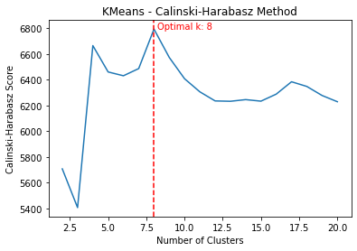
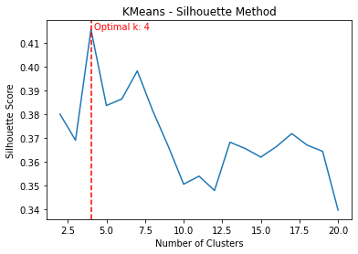
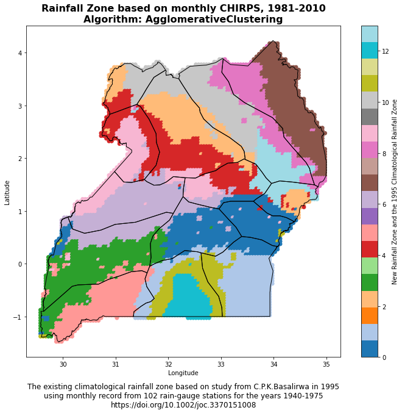
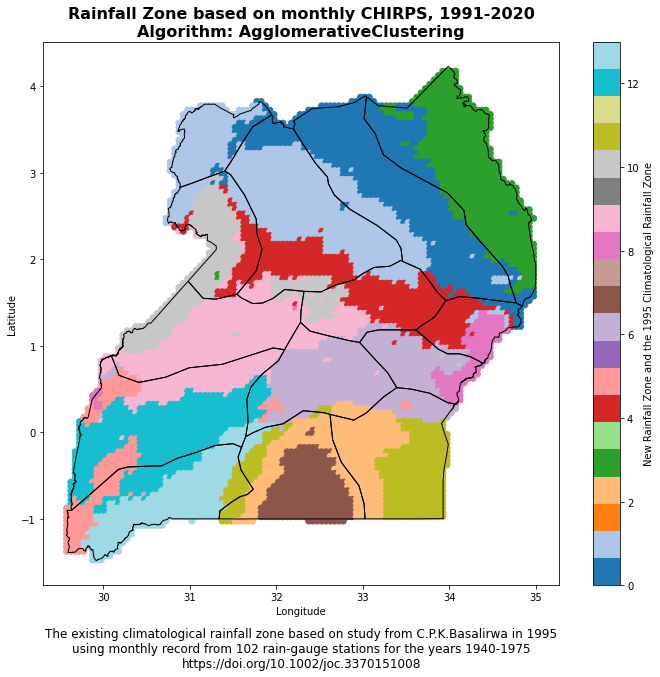
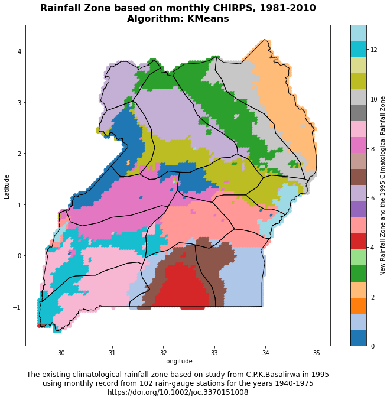
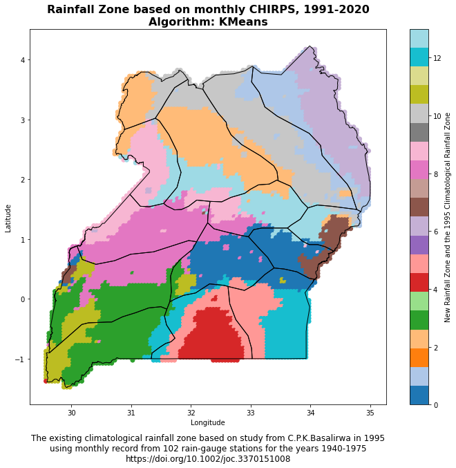

Climatological rainfall zones represent distinct areas with different rainfall patterns. They are characterized by specific precipitation behaviors, including factors such as the amount, frequency, and timing of rainfall. Understanding these zones is crucial for a variety of reasons:

1. **Agriculture:** Agriculture heavily relies on rainfall patterns. Knowing the climatological rainfall zones can help farmers and agricultural planners understand when to plant crops and which types of crops would be most suitable for a given area.
2. **Water Resource Management:** Rainfall contributes significantly to freshwater resources. Understanding the rainfall patterns can aid in planning and managing these resources effectively.
3. **Climate Change Studies:** Changes in rainfall patterns can be an indicator of larger climatic changes. Studying these zones over time can provide insights into climate change.
4. **Disaster Planning:** Areas prone to heavy rainfall could be at a higher risk of flooding. Knowledge of these zones can inform disaster planning and mitigation strategies.

### What the workflow does

The Python code provided below aids in the process of identifying climatological rainfall zones. The code does this through the following steps:

1. **Preprocessing:** The code first preprocesses the rainfall data to make it suitable for clustering. This includes standardizing the data and reducing its dimensionality using Principal Component Analysis (PCA).
2. **Clustering:** The code then applies a clustering algorithm (KMeans or Agglomerative Clustering) to the preprocessed data to identify distinct rainfall patterns, representing different climate zones. The optimal number of clusters is determined using the Calinski-Harabasz and Silhouette methods.
3. **Assignment:** Each location is then assigned to the climate zone of the nearest cluster centroid.
4. **Visualization:** Finally, the code visualizes the identified climate zones on a map, allowing for easy interpretation and application of the results.

In essence, the code facilitates the data-driven identification and visualization of climatological rainfall zones, providing valuable insights for various applications.

The full notebook is available as a Gist: <https://gist.github.com/bennyistanto/f0ef305c7d494fc13ab3adcd24088abe>

---

### Walkthrough

This Python code performs an analysis of climatological rainfall zones, with study case for Uganda, applying KMeans or Agglomerative Clustering to precipitation data sourced from CHIRPS (Climate Hazards Group InfraRed Precipitation with Station) for two time periods: [1981-2010](https://www.dropbox.com/s/atbudxdcpx4bv1y/chirps_precip_1981_2010.csv?dl=0) and [1991-2020](https://www.dropbox.com/s/205vgwvq3ydcpv2/chirps_precip_1991_2020.csv?dl=0). This data is contained in a CSV file that includes unique identifiers, longitude, latitude, and dates.

Here's a summary of what the code does:

1. **Import necessary libraries:** The code begins by importing necessary libraries for data manipulation, clustering, standardization, calculating metrics, and visualization.
2. **Choose the clustering method:** The variable `cluster_method` is set to 'KMeans' by default, but can be changed to 'AgglomerativeClustering'.
3. **Load the precipitation data:** The CSV data file is loaded into a pandas dataframe. By default, the code reads data for the period 1991-2020, but it can be switched to load the 1981-2010 data.
4. **Data Transformation:** The date columns in the dataframe are renamed and reformatted to a datetime object. The dataframe is then 'melted' to convert it into long format, which makes it easier to manage and analyze. The 'date' column is again converted into a datetime object.
5. **Calculate monthly mean precipitation:** The code then calculates the monthly mean precipitation for each location (defined by unique id, longitude, and latitude) by extracting the month from the 'date' column and using it to group the data. This monthly mean precipitation data is then rearranged into a pivot table format for further processing.
6. **Data Visualization:** Finally, the transformed dataframe is displayed for visual inspection.

```python
import pandas as pd
import geopandas as gpd
import numpy as np
from sklearn.decomposition import PCA
from sklearn.cluster import KMeans, MiniBatchKMeans, AgglomerativeClustering
from sklearn.preprocessing import StandardScaler
from sklearn.metrics import calinski_harabasz_score, silhouette_samples, silhouette_score
import matplotlib.pyplot as plt
from tqdm import tqdm
from joblib import Parallel, delayed
```


#### Loading and preparing the data

```python
# Choose the clustering method
cluster_method = 'KMeans'
# cluster_method = 'AgglomerativeClustering'

# Load the precipitation data
# precip_df = pd.read_csv("../csv/chirps_precip_1981_2010.csv", sep=";")
precip_df = pd.read_csv("../csv/chirps_precip_1991_2020.csv", sep=";")

# Rename the date columns for each dataframe
precip_df.rename(columns={'id': 'id', **{col: pd.to_datetime(col, format='%Y%m%d') for col in precip_df.columns[3:]}}, inplace=True)

# Melt the precipitation and temperature dataframes to a long format
precip_df = pd.melt(precip_df, id_vars=['id', 'lon', 'lat'], var_name='date', value_name='precipitation')

# Convert the date column to datetime type
precip_df['date'] = pd.to_datetime(precip_df['date'])

# Calculate the monthly mean precipitation for each location
precip_df["month"] = precip_df["date"].dt.month
monthly_precip_df = precip_df.groupby(["id", "lon", "lat", "month"], as_index=False).mean()
monthly_precip_df = monthly_precip_df.pivot_table(index=["id", "lon", "lat"], columns="month", values="precipitation").reset_index()
monthly_precip_df.columns.name = None
monthly_precip_df.columns = ["id", "lon", "lat", "JAN", "FEB", "MAR", "APR", "MAY", "JUN", "JUL", "AUG", "SEP", "OCT", "NOV", "DEC"]

# Check the data visually
monthly_precip_df
```

This initial portion of the code is focused on loading and preparing the data for clustering analysis, which is performed in subsequent steps (not shown in the provided code). Depending on the chosen method, KMeans or Agglomerative Clustering is applied to this monthly mean precipitation data to classify the different climatological rainfall zones. The number of clusters can be a specific integer or determined using an optimal result generated by the Calinski-Harabasz or Silhouette method.

#### Standardisation and PCA

```python
# Compute the PCA 90
X = monthly_precip_df.drop(columns=["id", "lon", "lat"])
scaler = StandardScaler()
X_scaled = scaler.fit_transform(X)
pca = PCA(n_components=0.90)
X_pca = pca.fit_transform(X_scaled)

print('Done!')
```

This section of the code is about data standardization and dimensionality reduction using Principal Component Analysis (PCA).

Here's the step-by-step explanation:

1. **Remove unnecessary columns:** The code first creates a new dataframe `X` that drops the "id", "lon", and "lat" columns from the `monthly_precip_df` dataframe. This is done because clustering should be based on the rainfall data, not identifiers or coordinates.
2. **Standardize the data:** The data is then standardized using `StandardScaler()`, which scales the data to have a mean of 0 and a standard deviation of 1. This is a common requirement for many machine learning estimators, as they might behave badly if the individual features do not more or less look like standard normally distributed data.
3. **Apply PCA:** Next, PCA is applied to the scaled data to reduce its dimensionality. `PCA(n_components=0.90)` means that PCA will keep enough components to explain 90% of the variance in the data. This is a way to reduce the complexity of the model and avoid overfitting.
4. **Fit and transform the data:** The `fit_transform()` function fits the PCA model with the scaled data `X_scaled` and applies the dimensionality reduction on `X_scaled`.

The print statement 'Done!' indicates the successful completion of these steps. Now, the data is ready for the clustering step. The transformed data, `X_pca`, can be used as the input for the clustering algorithms. The PCA transformation is beneficial especially for visualization purposes, as it allows us to plot high-dimensional data in 2D or 3D space, and it can also improve the computational efficiency and performance of the clustering algorithm.

#### Cluster count: Calinski-Harabasz score

```python
def get_optimal_plot_calinski(X, cluster_method):
    """
    Compute the optimal number of clusters and plot the Calinski-Harabasz score as a function of the number of clusters.

    Parameters:
    - X: input data array
    - cluster_method: clustering algorithm to use, either "KMeans" or "AgglomerativeClustering"

    Returns:
    - optimal_k: optimal number of clusters
    """
    if cluster_method == "KMeans":
        model = KMeans
    elif cluster_method == "AgglomerativeClustering":
        model = AgglomerativeClustering
    else:
        raise ValueError("Invalid cluster_method type. Must be either 'KMeans' or 'AgglomerativeClustering'.")

    def compute_score(k):
        score_k = model(n_clusters=k)
        score_k.fit(X)
        score = calinski_harabasz_score(X, score_k.labels_)
        return score

    # Define the range of k values to explore
    k_values = range(2, 21)

    # Compute the Calinski-Harabasz score for each value of k
    scores = Parallel(n_jobs=-1)(delayed(compute_score)(k) for k in tqdm(k_values, desc="Calculating Calinski-Harabasz Scores"))

    # Find the index of the maximum score
    max_idx = np.argmax(scores)
    optimal_k = k_values[max_idx]

    # Plot the scores
    plt.plot(k_values, scores)
    plt.axvline(optimal_k, color='r', linestyle='--')
    plt.text(optimal_k+0.2, max(scores), f"Optimal k: {optimal_k}", color='r')
    plt.title(f"{cluster_method} - Calinski-Harabasz Method")
    plt.xlabel("Number of Clusters")
    plt.ylabel("Calinski-Harabasz Score")
    plt.show()

    return optimal_k
```

This function `get_optimal_plot_calinski()` calculates the optimal number of clusters for a given dataset `X` and a specified clustering method (`KMeans` or `AgglomerativeClustering`), and then visualizes the results. It does this using the Calinski-Harabasz criterion, which is a method for determining the optimal number of clusters. It operates on the principle that clusters should be compact and well separated.

Here's what the code does, step-by-step:

1. **Define the model:** Depending on the `cluster_method` parameter, it sets the `model` to either `KMeans` or `AgglomerativeClustering`. If another value is passed, it raises a ValueError.
2. **Define the compute\_score function:** This inner function creates a model with `k` clusters, fits the model to the data `X`, and returns the Calinski-Harabasz score. The Calinski-Harabasz score is a measure of cluster validity; higher scores indicate better clustering configurations.
3. **Calculate scores for range of clusters:** It then calculates the Calinski-Harabasz score for each number of clusters in the range from 2 to 20. These computations are performed in parallel to speed up the process, especially beneficial for large datasets.
4. **Find the optimal number of clusters:** The number of clusters (`k`) that yields the maximum Calinski-Harabasz score is identified as the optimal number of clusters.
5. **Plot the scores:** Finally, it visualizes these scores in a plot, where the x-axis represents the number of clusters and the y-axis represents the corresponding Calinski-Harabasz scores. The optimal number of clusters is marked with a vertical red dashed line, and its value is also displayed on the plot.
6. **Return the optimal number of clusters:** The function returns the optimal number of clusters as determined by the Calinski-Harabasz criterion.

This function is used to explore and determine the optimal number of clusters for the dataset, which can then be used in the actual clustering process. It's an essential step in unsupervised machine learning tasks like clustering, as deciding on the number of clusters can often be non-trivial.

#### Cluster count: Silhouette score

```python
def get_optimal_plot_silhouette(X, cluster_method):
    """
    Compute the optimal number of clusters for KMeans or AgglomerativeClustering using the Silhouette score,
    and plot the Silhouette score as a function of the number of clusters.

    Parameters:
    - X: input data array
    - cluster_method: clustering algorithm to use ("KMeans" or "AgglomerativeClustering")
    """
    def compute_score(k):
        if cluster_method == "KMeans":
            clusterer = KMeans(n_clusters=k)
        elif cluster_method == "AgglomerativeClustering":
            clusterer = AgglomerativeClustering(n_clusters=k)
        else:
            raise ValueError("Invalid cluster_method parameter. Must be 'KMeans' or 'AgglomerativeClustering'.")
        cluster_labels = clusterer.fit_predict(X)
        silhouette_avg = silhouette_score(X, cluster_labels)
        sample_silhouette_values = silhouette_samples(X, cluster_labels)
        return silhouette_avg, sample_silhouette_values

    # Define the range of k values to explore
    k_values = range(2, 21)

    # Compute the Silhouette score for each value of k
    scores = Parallel(n_jobs=-1)(delayed(compute_score)(k) for k in tqdm(k_values, desc="Calculating Silhouette Scores"))

    # Extract the Silhouette score and sample Silhouette values for each k
    silhouette_scores, sample_silhouette_values = zip(*scores)

    # Find the index of the maximum score
    max_idx = np.argmax(silhouette_scores)
    max_k = k_values[max_idx]

    # Plot the scores
    plt.plot(k_values, silhouette_scores)
    plt.axvline(max_k, color='r', linestyle='--')
    plt.text(max_k+0.2, max(silhouette_scores), f"Optimal k: {max_k}", color='r')
    plt.title(f"{cluster_method} - Silhouette Method")
    plt.xlabel("Number of Clusters")
    plt.ylabel("Silhouette Score")
    plt.show()

    # Return the optimal number of clusters
    return max_k
```

This function `get_optimal_plot_silhouette()` is designed to compute the optimal number of clusters for a given dataset `X` using either the KMeans or Agglomerative Clustering method, using the silhouette score as a measure of cluster quality. It also produces a plot of the silhouette scores as a function of the number of clusters.

Here's a step-by-step breakdown of what the code does:

1. **Define the compute\_score function:** The function `compute_score` is defined to calculate the silhouette score for a given number of clusters. The silhouette score measures the quality of a clustering. A higher silhouette score indicates that the instances in the same cluster are similar to each other and different from the instances in other clusters.
2. **Calculate scores for range of clusters:** It then calculates the silhouette score for each number of clusters in the range from 2 to 20. These computations are performed in parallel to speed up the process, which can be especially beneficial for large datasets.
3. **Find the optimal number of clusters:** The number of clusters (`k`) that yields the maximum silhouette score is identified as the optimal number of clusters.
4. **Plot the scores:** The silhouette scores are then plotted against the number of clusters. The optimal number of clusters is marked with a vertical red dashed line, and its value is also displayed on the plot.
5. **Return the optimal number of clusters:** Finally, the function returns the optimal number of clusters as determined by the silhouette score.

The silhouette score is an alternative to the Calinski-Harabasz score for finding the optimal number of clusters in a dataset. It considers both the compactness of the clusters (how close the instances in the same cluster are) and the separation between the clusters (how far apart the clusters are). The optimal number of clusters is the one that maximizes the average silhouette score over all instances.

#### Running both methods

```python
# Calculate the optimal number of clusters using various method
# Calinski-Harabasz
optimal_c = get_optimal_plot_calinski(X_pca, cluster_method)
# Silhouette
optimal_s = get_optimal_plot_silhouette(X_pca, cluster_method)

print("The optimal number of clusters using Calinski-Harabasz is: ", optimal_c)
print("The optimal number of clusters using Silhouette is: ", optimal_s)

print('Done!')
```

This part of the code calculates the optimal number of clusters for the PCA-transformed data `X_pca` using two different methods: the Calinski-Harabasz method and the Silhouette method. The clustering method is defined by the variable `cluster_method`.

1. **Calinski-Harabasz:** The function `get_optimal_plot_calinski(X_pca, cluster_method)` is called to calculate the optimal number of clusters using the Calinski-Harabasz method. This function computes the Calinski-Harabasz scores for different numbers of clusters, plots the scores as a function of the number of clusters, and returns the optimal number of clusters that yields the highest Calinski-Harabasz score. The optimal number of clusters is stored in the variable `optimal_c`.
2. **Silhouette:** Similarly, the function `get_optimal_plot_silhouette(X_pca, cluster_method)` is called to calculate the optimal number of clusters using the Silhouette method. This function computes the Silhouette scores for different numbers of clusters, plots the scores as a function of the number of clusters, and returns the optimal number of clusters that yields the highest Silhouette score. The optimal number of clusters is stored in the variable `optimal_s`.

Then, it prints out the optimal number of clusters as determined by both the Calinski-Harabasz and Silhouette methods. The 'Done!' print statement indicates the successful completion of these steps.

This section of the code is crucial as it determines the most suitable number of clusters for the data, which is a key parameter for clustering algorithms. The Calinski-Harabasz and Silhouette methods are two popular methods for determining this optimal number, and comparing their results can provide additional validation for the chosen number of clusters.




#### Clustering

```python
def cluster_data(X_pca, cluster_method, n_clusters=None):
    """
    Cluster the input data using the specified method and number of clusters.

    Parameters:
    - X_pca: input data array
    - cluster_method: clustering method, either 'KMeans' or 'AgglomerativeClustering'
    - n_clusters: number of clusters, can be a specific integer or one of 'optimal_c' and 'optimal_s'

    Returns:
    - labels: array of cluster labels
    """
    if n_clusters == 'optimal_c':
        if cluster_method == 'KMeans':
            n_clusters = get_optimal_plot_calinski(X_pca, 'KMeans')
        elif mcluster_method == 'AgglomerativeClustering':
            n_clusters = get_optimal_plot_calinski(X_pca, 'AgglomerativeClustering')
        else:
            raise ValueError("Invalid clustering method. Choose 'KMeans' or 'AgglomerativeClustering'.")
    elif n_clusters == 'optimal_s':
        if cluster_method == 'KMeans':
            n_clusters = get_optimal_plot_silhouette(X_pca, 'KMeans')
        elif cluster_method == 'AgglomerativeClustering':
            n_clusters = get_optimal_plot_silhouette(X_pca, 'AgglomerativeClustering')
        else:
            raise ValueError("Invalid clustering method. Choose 'KMeans' or 'AgglomerativeClustering'.")
    elif isinstance(n_clusters, int):
        pass
    else:
        raise ValueError("Invalid value for n_clusters parameter.")
    
    if cluster_method == 'KMeans':
        cluster_model = KMeans(n_clusters=n_clusters)
    elif cluster_method == 'AgglomerativeClustering':
        cluster_model = AgglomerativeClustering(n_clusters=n_clusters)

    pbar = tqdm(total=1, desc=f"Performing {cluster_method} Clustering")
    cluster_model.fit(X_pca)
    pbar.update(1)
    
    labels = cluster_model.labels_

    return labels, n_clusters

print('Done!')
```

The `cluster_data()` function takes in the input data array `X_pca`, the chosen clustering method `cluster_method`, and an optional number of clusters `n_clusters`. It performs clustering on the data and returns the cluster labels.

Here's a step-by-step breakdown of what the code does:

1. **Check for optimal cluster number:** If `n_clusters` is set to `'optimal_c'` or `'optimal_s'`, the function calls the previously defined functions `get_optimal_plot_calinski()` or `get_optimal_plot_silhouette()`, respectively, to compute the optimal number of clusters. It does this for the specified clustering method, either `'KMeans'` or `'AgglomerativeClustering'`.
2. **Raise an error for invalid input:** If `n_clusters` is not one of the allowed strings and it is not an integer, the function raises a `ValueError`.
3. **Create the cluster model:** Depending on the value of `cluster_method`, the function creates a `KMeans` or `AgglomerativeClustering` model with the specified number of clusters.
4. **Fit the model to the data:** The function then fits the clustering model to the input data. It also provides a progress bar to track the process.
5. **Retrieve the cluster labels:** After the model has been fitted, the function retrieves the cluster labels, which indicate the cluster to which each data point has been assigned.
6. **Return the labels and number of clusters:** Finally, the function returns the cluster labels and the number of clusters used in the clustering model.

By encapsulating the clustering process into a function, the code allows for easy and repeatable clustering of the data using different methods and numbers of clusters. The function also handles the computation of the optimal number of clusters, making it easy to compare the results of different clustering approaches.

This section of the code conducts clustering of the data with the specified clustering method and the defined number of clusters (14 in this case). Once the clusters are determined, it assigns a climatic zone to each row based on the nearest centroid. Here's a step-by-step breakdown:

1. **Perform Clustering:** The function `cluster_data(X_pca, cluster_method, n_clusters=14)` is invoked to perform clustering on the data. The function returns the labels of the clusters and the number of clusters used, which are stored in `labels` and `n_clusters` respectively.
2. **Calculate Centroids:** A centroid is a point at the center of each cluster. It's the mean position of all the points in a cluster. The code calculates these centroids for each cluster and stores them in the `centroids` array.
3. **Calculate Euclidean Distances:** The code then calculates the Euclidean distance between each data point (each row) and each of the cluster centroids. The Euclidean distance is a measure of the straight line distance between two points in a space. These distances are stored in the `distances` array.
4. **Assign Closest Cluster:** For each row in the dataset, the code assigns the cluster that is closest (has the smallest Euclidean distance) to it. This is achieved using the `np.argmin()` function, which returns the index of the smallest value along an axis. The assigned clusters are added as a new column `climate_zone` in the `monthly_precip_df` dataframe.
5. **Grouping Data:** The dataset is then grouped by `id`, `lon` (longitude), and `lat` (latitude), and for each group, the mode (the most frequently appearing value) of the `climate_zone` is calculated. This essentially assigns a single climate zone to each unique location based on the most frequent climate zone assigned to it over the timeseries. This grouped data is stored in `monthly_precip_df_centroid`.
6. **Completion Message:** Upon successful completion of these steps, a 'Done!' message is printed.

#### Assigning a zone to each location

```python
# Other ways to assign a single cluster to each row based on the 360 monthly timeseries 
# of precipitation and temperature data. One approach is to calculate the distance 
# between each row and the centroids of the clusters obtained from K-Means clustering. 
# Then, assign the closest cluster to each row as its climate zone.

# Cluster the data using the defined cluster_method
labels, n_clusters = cluster_data(X_pca, cluster_method, n_clusters=14)

# Calculate the centroids for each cluster
centroids = np.zeros((n_clusters, X_pca.shape[1]))
for i in range(n_clusters):
    mask = (labels == i)
    centroids[i,:] = np.mean(X_pca[mask,:], axis=0)

# Calculate the Euclidean distance between each row and the centroids
distances = np.sqrt(np.sum(np.square(X_pca[:, None] - centroids), axis=2))

# In this code, we use the np.argmin() function to find the index of the closest centroid 
# to each row. This approach preserves the details of climate characteristics captured by 
# the monthly timeseries data.
# Assign the closest cluster to each row
monthly_precip_df["climate_zone"] = np.argmin(distances, axis=1)

# Group the merged dataframe by id, lon, and lat and take the mode of the climate zone for each group
monthly_precip_df_centroid = monthly_precip_df.groupby(["id", "lon", "lat"])["climate_zone"].apply(lambda x: x.mode()[0]).reset_index()

print('Done!')
```

This section of the code allows each location (represented by a unique combination of `id`, `lon`, and `lat`) in the dataset to be assigned to a specific climatological rainfall zone based on the monthly timeseries precipitation data. This information can be useful for various climatological and environmental studies.

#### Mapping the zones

```python
def plot_climate_zone_map(climate_zone_csv, shapefile_path):
    """
    Plot the climate zones as a point map.

    Parameters:
    - climate_zone_csv: path to the CSV file with lon, lat, and climate_zone columns
    """
    # Load the data from the CSV file
    df = pd.read_csv(climate_zone_csv)

    # Extract the lon, lat, and climate_zone columns
    lon = df["lon"]
    lat = df["lat"]
    climate_zone = df["climate_zone"]

    # Create a scatter plot of the climate zones
    plt.figure(figsize=(12, 10))
    plt.scatter(lon, lat, c=climate_zone, cmap="tab20")
    
    # Load the polygon shapefile using geopandas
    gdf = gpd.read_file(shapefile_path)

    # Plot the polygon shapefile
    gdf.plot(ax=plt.gca(), facecolor="None", edgecolor="black", linewidth=1)

    # Add a colorbar
    cbar = plt.colorbar()
    cbar.set_label("New Rainfall Zone and the 1995 Climatological Rainfall Zone")

    # Set the x and y axis labels
    # You need to adjust the title with the year of data information if needed
    plt.title("Rainfall Zone based on monthly CHIRPS, 1991-2020\nAlgorithm: "f"{cluster_method}", fontsize=16, fontweight='bold', ha='center')
    plt.text(0.5, -0.15, "The existing climatological rainfall zone based on study from C.P.K.Basalirwa in 1995\nusing monthly record from 102 rain-gauge stations for the years 1940-1975\nhttps://doi.org/10.1002/joc.3370151008", fontsize=12, fontweight='normal', ha='center', transform=plt.gca().transAxes)
    plt.xlabel("Longitude")
    plt.ylabel("Latitude")
    
    # Show the plot
    plt.show()
```

The function `plot_climate_zone_map(climate_zone_csv, shapefile_path)` is designed to generate a scatter plot of climate zones over a given geographical region, which could be a country or a continent, for instance. The plot utilizes longitude and latitude coordinates from a CSV file and a polygon shapefile to depict the geographical boundaries of the region of interest. Here's a breakdown of the steps:

1. **Load the Data:** The function starts by loading a CSV file containing longitude (`lon`), latitude (`lat`), and climate zone (`climate_zone`) data.
2. **Create a Scatter Plot:** A scatter plot is generated using the longitude and latitude values as x and y coordinates, respectively. The climate zone data is used to color-code the points on the scatter plot.
3. **Load the Polygon Shapefile:** A polygon shapefile, which represents the geographical boundaries of the region of interest, is loaded using the geopandas library.
4. **Plot the Polygon Shapefile:** The loaded polygon shapefile is overlaid on the scatter plot to provide geographical context. The boundaries are shown as black lines.
5. **Add a Colorbar:** A colorbar is added to the plot to provide a reference for the color-coding of the climate zones.
6. **Set the Title and Axis Labels:** The plot is given a title, and the x and y axes are labeled as longitude and latitude, respectively. A footnote reference to the study providing the climatological rainfall zone is also included.
7. **Display the Plot:** Finally, the plot is displayed using `plt.show()`.

This function provides a visual representation of the climate zones within a specific geographical region, which can help researchers and policymakers understand the spatial distribution of different climate characteristics based on rainfall patterns.

#### Saving the output

```python
# Save the grouped dataframe to a new CSV file
output_df_centroid = monthly_precip_df_centroid[['id', 'lon', 'lat', 'climate_zone']]
# Adjust the output filename with the year of data information if needed
output_df_centroid.to_csv("../csv/uga_climatezone_eucl_{0}_{1}_p_ai.csv".format(n_clusters, cluster_method), index=False)
print("Save the output to csv completed")
print("----------------------------------------------------------")

# Plot map
plot_climate_zone_map("../csv/uga_climatezone_eucl_{0}_{1}_p_ai.csv".format(n_clusters, cluster_method), "../shapefiles/uga_cli_climatezone_unma.shp")
print("----------------------------------------------------------")

print("Done!")
```

The code snippet provided is performing the following steps:

1. **Save DataFrame to CSV:** It saves the `monthly_precip_df_centroid` DataFrame, which contains the 'id', 'lon', 'lat', and 'climate\_zone' columns, into a CSV file. This file will be saved in the location specified by the path string. The filename is constructed using the method of clustering and the number of clusters.
2. **Print Confirmation Message:** After saving the file, a confirmation message is printed stating "Save the output to csv completed". A separator line is then printed for clarity.
3. **Plot Climate Zone Map:** The `plot_climate_zone_map` function is then called, which generates a scatter plot of climate zones over a given geographical region based on the CSV file saved in the previous step and a shapefile which represents the geographical boundaries.
4. **Print Separator Line:** Another separator line is printed for clarity.
5. **Print Completion Message:** Finally, a message is printed stating "Done!" to signify the end of the code execution.

Remember to ensure that the directory paths used in the code ("../csv/" and "../shapefiles/") exist in your current working directory and contain the necessary files. If not, you will need to change these paths to the appropriate ones that are relevant to your working environment.

::: {.image-gallery}
::: {.gallery-item}

:::
::: {.gallery-item}

:::
::: {.gallery-item}

:::
::: {.gallery-item}

:::
:::