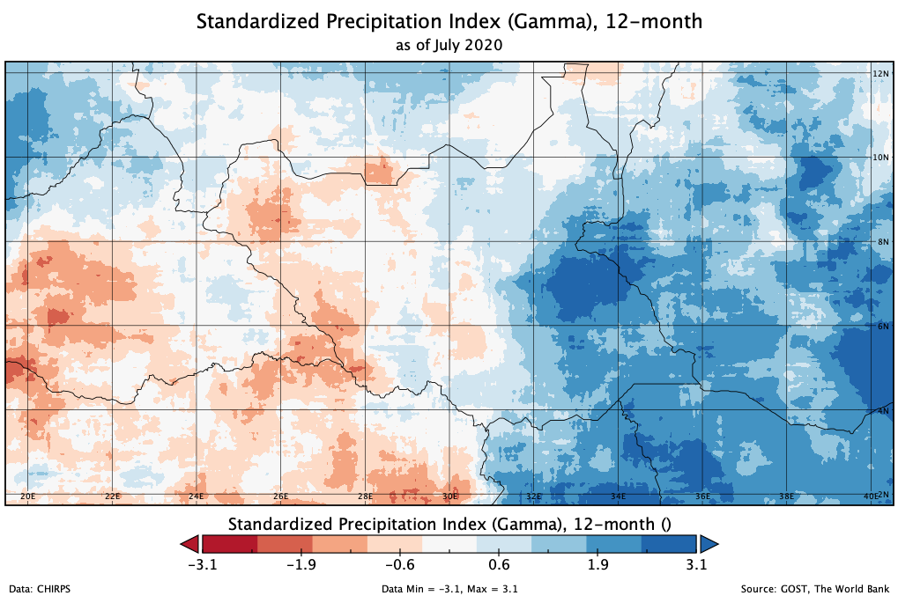
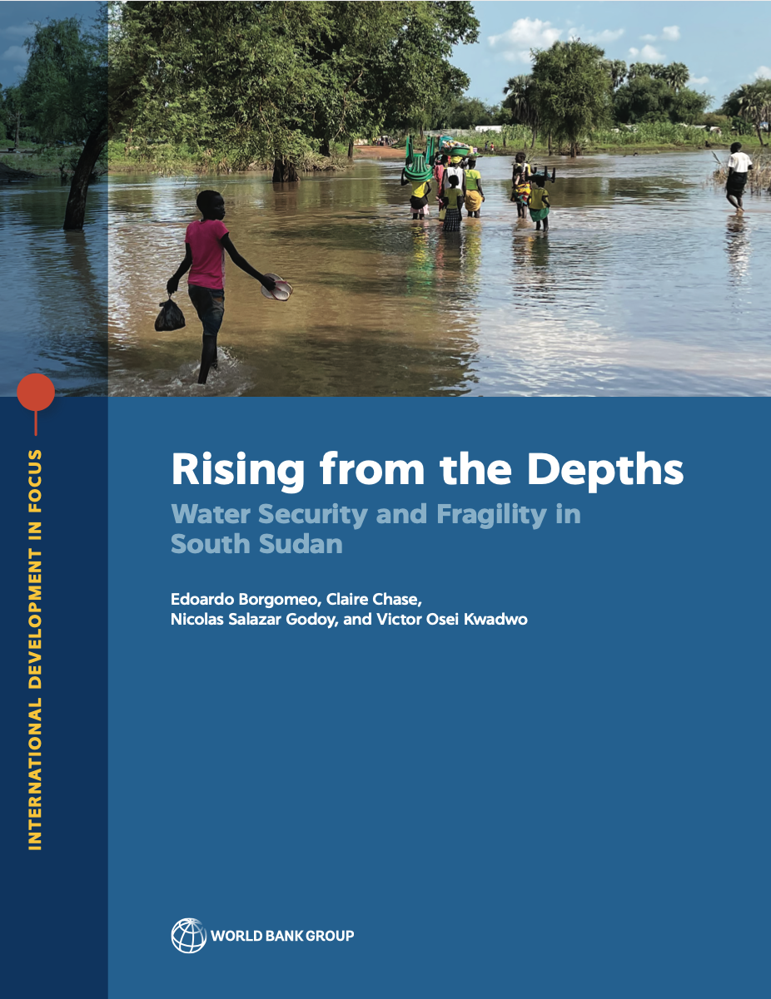

The World Bank has published "Rising from the Depths: Water Security and Fragility in South Sudan", and I contributed the dry and wet season analysis.

The report looks at how water security and fragility are connected in South Sudan, and where the World Bank Group can use water security to support stability, peace and resilience.

For the analysis we used the Standardized Precipitation Index (SPI) on CHIRPS precipitation estimates, tracking dry and wet conditions month by month and year by year.

The map below is one example. Severe flooding shows up clearly in the data.

If you are interested to read the story and report, feel free to visit below:

1. Press release: <https://www.worldbank.org/en/news/press-release/2023/03/27/new-report-with-inclusion-and-accountability-water-security-is-key-for-development-and-stability-in-afe-south-sudan>
2. Publication: <https://www.worldbank.org/en/country/southsudan/publication/rising-from-the-depths-water-security-and-fragility-in-afe-south-sudan>
3. Publication: <https://openknowledge.worldbank.org/entities/publication/91048a50-eacb-5a24-9fa4-30cf8a9a9c9b>

