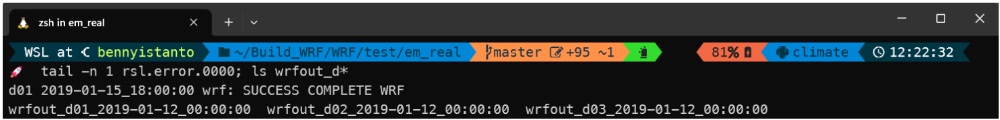
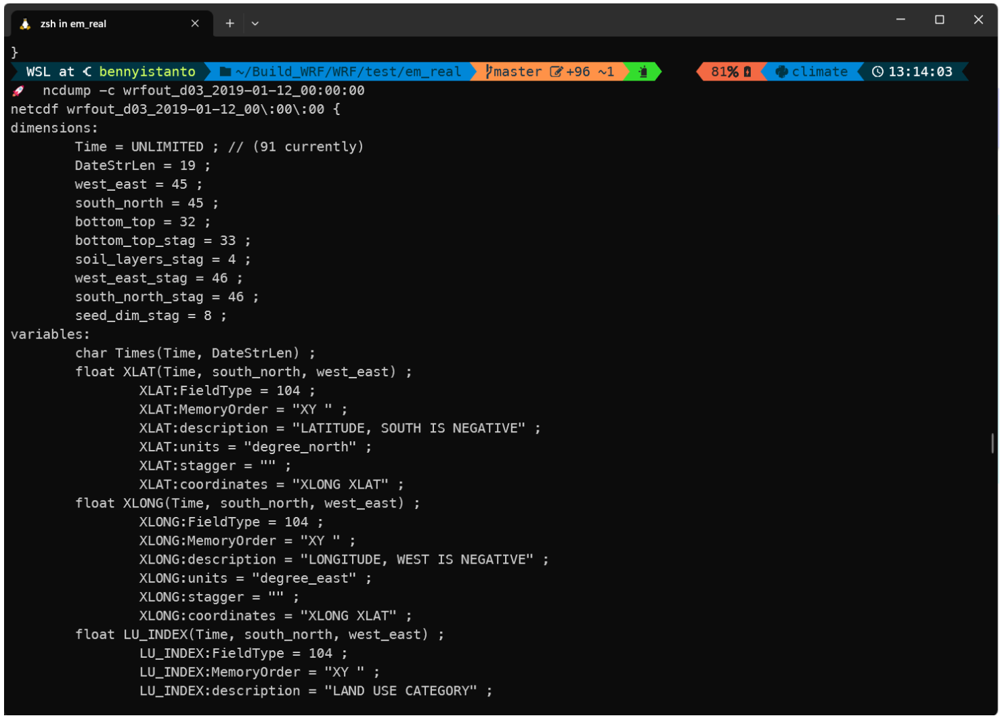
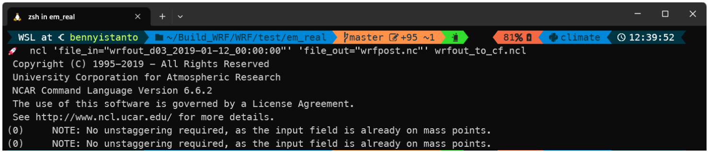
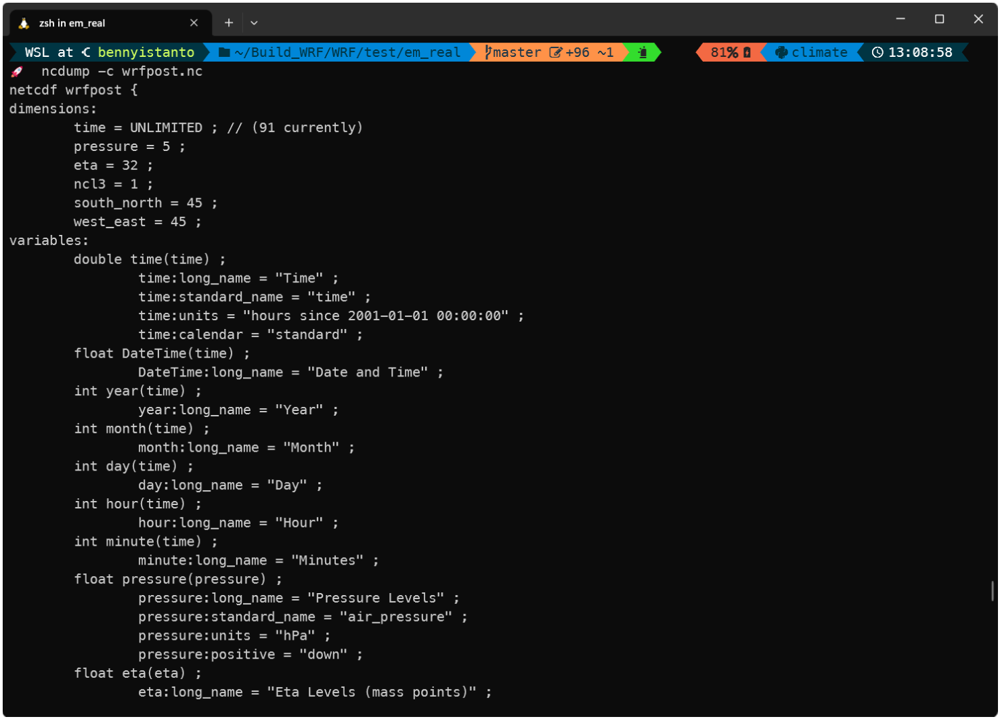
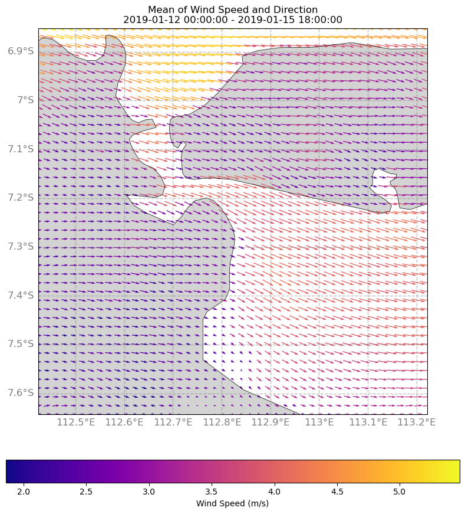
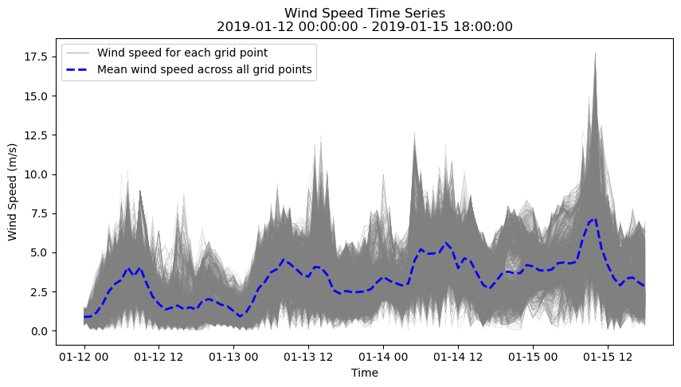
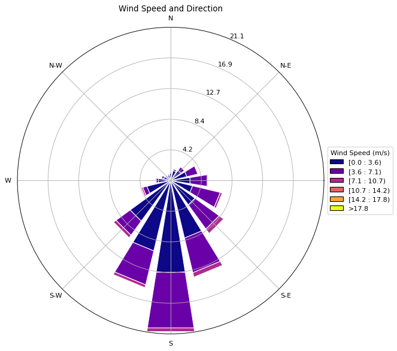
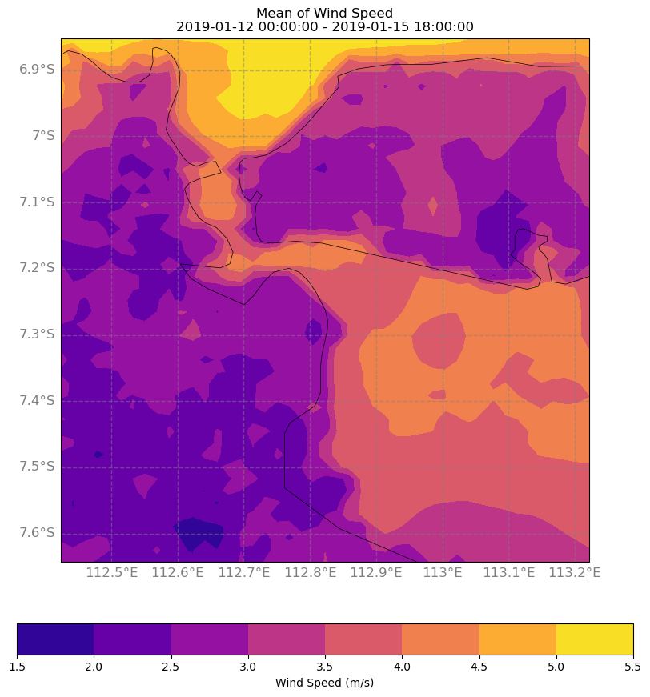
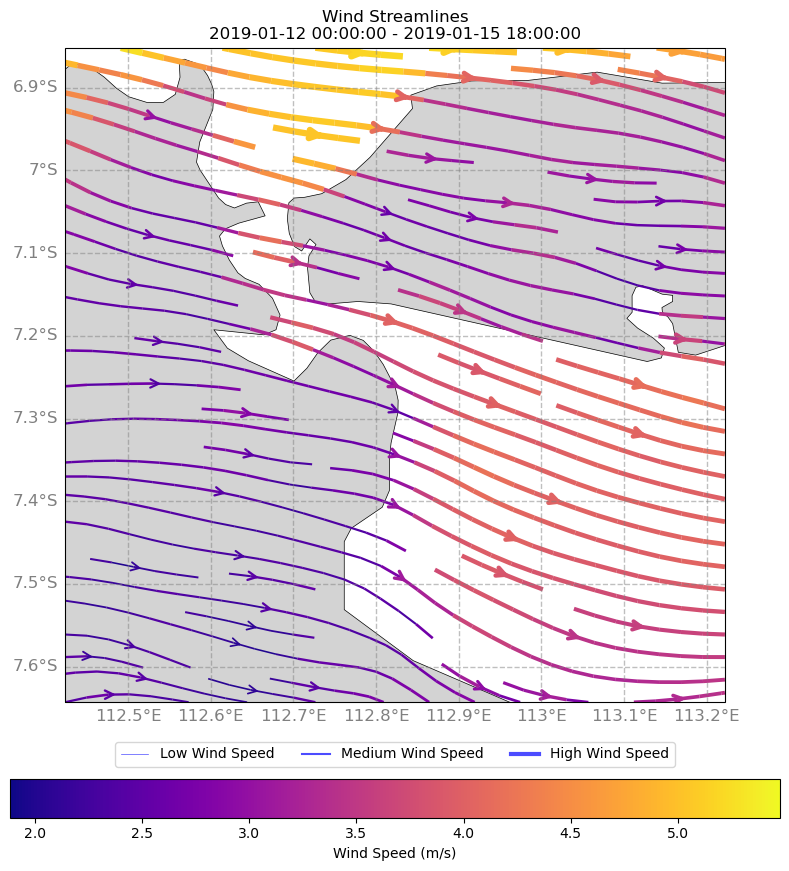

## 1 Introduction

The Weather Research and Forecasting (WRF) model is a powerful numerical weather prediction system used to simulate atmospheric phenomena at various scales. WRF produces a significant amount of output data that can provide valuable information for meteorological and climatological research, weather forecasting, and environmental management.

WRF output data is typically stored in netCDF files, which contain multiple variables with different units and dimensions. However, the netCDF files generated by WRF are not always following the Climate and Forecast (CF) metadata convention, which can make it difficult to interpret the data.

The CF metadata convention provides a standardized way of describing the metadata and units of variables in netCDF files. Adhering to this convention makes it easier to interpret the data and compare it with other datasets. However, the WRF output files are often not fully CF-compliant.

Visualizing the output from the WRF model can help researchers and practitioners to gain insights into various meteorological and climatological phenomena, including temperature, wind, precipitation, cloud cover, and atmospheric pressure. Visualization is an important step in understanding the data and extracting meaningful insights. Visualization can help identify patterns, trends, and anomalies in the data that might not be apparent from raw numerical output.

* Time series plots are a common way to visualize the temporal evolution of variables such as temperature, precipitation, and wind speed. These plots can reveal patterns and trends in the data and help to identify anomalies or outliers.
* Contour plots can be used to visualize the spatial distribution of variables such as temperature, pressure, and precipitation. These plots can show the magnitude and direction of the variables and help to identify patterns and features such as fronts, ridges, and troughs.
* Maps are a common way to visualize the spatial distribution of variables over a region of interest. Maps can be used to display variables such as temperature, precipitation, wind speed, and cloud cover, and can help to identify patterns and features such as mountains, coastlines, and rivers.
* Animations can be created from the WRF output data to visualize the temporal and spatial evolution of variables over a specific period. Animations can be useful for identifying trends, patterns, and anomalies in the data and for communicating the results to a wider audience.
* 3D visualizations can be used to represent the three-dimensional structure of atmospheric phenomena such as clouds and fronts. These visualizations can provide a more detailed and realistic representation of the data and help to identify features such as updrafts, downdrafts, and vortices.

There are several tools available for visualizing WRF output, ranging from simple plotting libraries to more advanced graphical user interfaces.

* One of the most popular tools for visualizing WRF output is the NCAR Command Language (NCL). NCL is a programming language designed specifically for scientific data analysis and visualization. NCL provides a powerful set of tools for working with NetCDF files, including the ability to subset and manipulate data, generate contour plots and maps, and create animations.
* Python is a popular programming language for data processing, analysis, and visualization. Python libraries such as Matplotlib, Cartopy, and Basemap can be used to create a wide range of visualizations from the WRF output data.
* Xarray is another popular Python library that can be used to handle and visualize multi-dimensional datasets. Xarray provides a powerful set of functions for data manipulation, analysis, and visualization and can be used to create a variety of plots and maps.
* R is a statistical programming language that can also be used for data processing, analysis, and visualization. R provides a wide range of packages for creating static and interactive visualizations, including ggplot2, lattice, and Shiny.
* Commercial software packages like ArcGIS and open-source Geographic Information System (GIS) software such as QGIS can be used to visualize WRF output data on maps and perform spatial analysis. QGIS provides a user-friendly interface for creating maps, visualizing data, and conducting geospatial analysis.

Regardless of the tool used, there are some key considerations to keep in mind when visualizing WRF output. These include choosing appropriate color maps, selecting appropriate contour intervals, and ensuring that the data is presented in a clear and understandable way.

It is also important to consider the spatial and temporal scales of the data when visualizing WRF output. For example, high-resolution data may require different visualization techniques than coarser resolution data, and data spanning multiple time scales may require animations or time series plots.

Visualization of WRF output is not only important for understanding the data but also for communicating results to stakeholders and decision-makers. Effective visualization can help convey complex scientific information in a way that is easily understood by non-experts.

Overall, visualization is a crucial step in the WRF modeling process, enabling scientists and researchers to extract meaningful insights from the vast amounts of data generated by the model. While there are many tools and techniques available for visualizing WRF output, it is important to choose the most appropriate tool for the specific task at hand and to consider best practices for data visualization to ensure clear and accurate representation of the data.

## 2 New CF based NetCDF files from native WRFOUT NetCDF files

The WRFOUT files created by the WRF model are not the most straightforward to interpret, and pose several challenges. These files include a series of three-dimensional fields that cover a specific region over a specific period of time, which can be used to analyze different meteorological phenomena, such as temperature, pressure, wind speed and direction, clouds, and precipitation.

However, WRF output data does not always follow the CF convention, especially when dealing with large datasets. This makes it difficult to interpret and analyze the data in its raw format, without the ability to visualize it. Additionally, the files can be very large and contain many variables related to the WRF simulation that may not be necessary for a research project.

Modifying the WRF registry can help to address some of these issues by allowing the user to change the variables included in the WRFOUT files. This can be a tedious and potentially messy process though, as some variables may be included in WRFOUT for reasons that the user may never know. As such, it is important to consider the potential unintended consequences of removing certain variables. Furthermore, the variables will still be on the staggered grid and on the model vertical levels, so visualization can still be challenging.

To address this issue, users can use the NCL to translate the netCDF output into a format that follows the CF convention. This can help to standardize the metadata and units of the variables, making it easier to interpret and compare the data.

`wrfout\_to\_cf` is an NCL based script designed to create CF compliant NetCDF files with user selectable variables, time reference, vertical levels, and spatial and temporal subsetting. This script is designed to be a simple, user-flexible post-processing utility and is particularly useful for research projects because it produces output files that are more convenient to work with.

However, `wrfout\_to\_cf` can be a relatively inefficient post-processing utility and may not be suitable for all applications. It is important to consider the pros and cons of each post-processing utility to determine which one is the best fit for any given research project

1. After running the simulation, WRF will produce three output files, you can check it by typing command in your simulation folder:

It will return



Download `wrfout\_to\_cf.ncl` from <https://sundowner.colorado.edu/wrfout_to_cf/wrfout_to_cf.ncl> and put it in the same folder with WRFOUT file. If you check one of file output using below:

You will get responses and see the netCDF structure, but it is not easy to understand.



Start to convert the native WRFOUT netCDF file to new CF based netCDF file using below command:



You will find a new file `wrfpost.nc` in the folder. Let check it using ncdump command below:



After you get the `wrfpost.nc` in place, you are ready to visualize it using various tools.

## 3 Visualizing the Wind

With 3 days of hourly information, there are several ways to visualize wind speed and direction to best illustrate the information.

Let's start writing the code using Python.

```python
import xarray as xr
import matplotlib.pyplot as plt
import matplotlib.cm as cm
from matplotlib.lines import Line2D
import numpy as np
import cartopy.crs as ccrs
import cartopy.feature as cfeature
import pandas as pd
from windrose import WindroseAxes

# Load the WRF output file
ds = xr.open_dataset('wrfpost.nc')

# Extract the wind speed and direction variables
u_wind = ds.u_10m_gr.values
v_wind = ds.v_10m_gr.values

# Calculate the wind speed and direction
wind_speed = (u_wind ** 2 + v_wind ** 2) ** 0.5
wind_direction = 180 + (180 / np.pi) * np.arctan2(v_wind, u_wind)

# Get the first and last date in the dataset
start_date = pd.to_datetime(ds.time.values[0]).strftime('%Y-%m-%d %H:%M:%S')
end_date = pd.to_datetime(ds.time.values[-1]).strftime('%Y-%m-%d %H:%M:%S')

# Create a map projection
proj = ccrs.PlateCarree()
```

After importing the library and defining the data, we can start visualizing the wind data.

Here are some options:

### 3.1 Time series plot

We can create a time series plot showing the variation of wind speed and direction over the three-day period. This type of plot is useful for identifying patterns or trends in the data over time. We can use Python libraries such as Matplotlib or Seaborn to create time series plots.

```python
# Create a figure and axis object
fig, ax = plt.subplots(figsize=(10, 10), subplot_kw=dict(projection=proj))

# Set the plot extent
ax.set_extent([ds.lon.min(), ds.lon.max(), ds.lat.min(), ds.lat.max()])

# Add map features
ax.add_feature(cfeature.LAND, facecolor='lightgray')
ax.add_feature(cfeature.COASTLINE, linewidth=0.5)
ax.add_feature(cfeature.BORDERS, linewidth=0.5)

# Add the latitude and longitude grid
gl = ax.gridlines(crs=ccrs.PlateCarree(), draw_labels=True,
                  linewidth=1, color='gray', alpha=0.5, linestyle='--')
gl.top_labels = False
gl.right_labels = False
gl.xlabel_style = {'size': 12, 'color': 'gray'}
gl.ylabel_style = {'size': 12, 'color': 'gray'}

# Add the wind vectors
q = ax.quiver(ds.lon.values, ds.lat.values, u_wind.mean(axis=0), v_wind.mean(axis=0), wind_speed.mean(axis=0),
          transform=ccrs.PlateCarree(), cmap='plasma', pivot='middle', width=0.002, scale=80)

# Add a colorbar
cbar = fig.colorbar(q, orientation='horizontal', fraction=0.05, pad=0.1)
cbar.ax.set_xlabel('Wind Speed (m/s)')

# Create a string with the title and date information
title_str = f'Mean of Wind Speed and Direction\n{start_date} - {end_date}'

# Add a title
plt.title(title_str)

# Show the plot
plt.show()
```

Above code will produce a map below.



As an alternative, we can have other visualizations for each grid as a line over time.

```python
# Create a figure and axis object for time series plot
fig2, ax2 = plt.subplots(figsize=(10, 5))

# Plot wind speed for each grid point as a line
for i in range(wind_speed.shape[1]):
    for j in range(wind_speed.shape[2]):
        ax2.plot(ds.time.values, wind_speed[:, i, j], color='Grey', linewidth=0.1)

# Calculate and plot the mean wind speed across all grid points for each time step
wind_speed_mean = wind_speed.mean(axis=(1, 2))
lines2 = ax2.plot(ds.time.values, wind_speed_mean, linestyle='--', color='blue', linewidth=2)

# Set x-axis label
ax2.set_xlabel('Time')

# Set y-axis label
ax2.set_ylabel('Wind Speed (m/s)')

# Create a string with the title and date information
title_str = f'Wind Speed Time Series\n{start_date} - {end_date}'

# Add a title
plt.title(title_str)

# Add legend
legend_elements = [Line2D([0], [0], color='gray', lw=0.5, label='Wind speed for each grid point'),
                   Line2D([0], [0], linestyle='--', color='blue', lw=2, label='Mean wind speed across all grid points')]
ax2.legend(handles=legend_elements, loc='upper left')

# Show the plot
plt.show()
```

Above code will produce a chart below.



### 3.2 Wind rose plot

A wind rose plot can be used to show the distribution of wind direction and speed over the three-day period. This type of plot is useful for identifying the prevailing wind direction and speed. You can use Python libraries such as Windrose or Matplotlib to create wind rose plots.

```python
# Create a WindroseAxes object
ax = WindroseAxes.from_ax()

# Plot the wind rose
ax.bar(wind_direction.flatten(), wind_speed.flatten(), normed=True, opening=0.8, edgecolor='white', cmap=cm.plasma)

# Set the title and legend
ax.set_title('Wind Speed and Direction')
ax.legend(title='Wind Speed (m/s)', loc='center left', bbox_to_anchor=(1, 0.5))

# Show the plot
plt.show()
```

Above code will produce a chart below.



### 3.3 Contour plot

A contour plot can be used to show the spatial distribution of wind speed and direction at a particular time during the three-day period. This type of plot is useful for identifying areas with high or low wind speed and direction. You can use Python libraries such as Matplotlib, Cartopy, or Basemap to create contour plots.

```python
# Create a figure and axis object
fig, ax = plt.subplots(figsize=(10, 10), subplot_kw=dict(projection=proj))

# Set the plot extent
ax.set_extent([ds.lon.min(), ds.lon.max(), ds.lat.min(), ds.lat.max()])

# Add map features
ax.add_feature(cfeature.LAND, facecolor='lightgray')
ax.add_feature(cfeature.COASTLINE, linewidth=0.5)
ax.add_feature(cfeature.BORDERS, linewidth=0.5)

# Add the latitude and longitude grid
gl = ax.gridlines(crs=ccrs.PlateCarree(), draw_labels=True,
                  linewidth=1, color='gray', alpha=0.5, linestyle='--')
gl.top_labels = False
gl.right_labels = False
gl.xlabel_style = {'size': 12, 'color': 'gray'}
gl.ylabel_style = {'size': 12, 'color': 'gray'}

# Create a contour plot of wind speed
cf = ax.contourf(ds.lon, ds.lat, wind_speed.mean(axis=0),
                 transform=ccrs.PlateCarree(), cmap='plasma')

# Add a colorbar
cbar = fig.colorbar(cf, orientation='horizontal', fraction=0.05, pad=0.1)
cbar.ax.set_xlabel('Wind Speed (m/s)')

# Create a string with the title and date information
title_str = f'Mean of Wind Speed\n{start_date} - {end_date}'

# Add a title
plt.title(title_str)

# Show the plot
plt.show()
```

Above code will produce a map below.



### 3.4 Streamline plot

 A streamline plot can be used to show the flow of wind direction and speed at a particular time during the three-day period. This type of plot is useful for identifying the flow of wind over a geographic area. You can use Python libraries such as Matplotlib, Cartopy, or Basemap to create streamline plots.

```python
# Define the maximum and minimum line width
max_width = 5.0
min_width = 1.0

# Normalize the streamline speed to the range [0, 1]
speed_norm = (wind_speed.mean(axis=0) - wind_speed.mean(axis=0).min()) / (wind_speed.mean(axis=0).max() - wind_speed.mean(axis=0).min())

# Calculate the linewidths based on the normalized speed
linewidths = min_width + (max_width - min_width) * speed_norm

# Create a figure and axis object
fig, ax = plt.subplots(figsize=(10, 10), subplot_kw=dict(projection=proj))

# Set the plot extent
ax.set_extent([ds.lon.min(), ds.lon.max(), ds.lat.min(), ds.lat.max()])

# Add map features
ax.add_feature(cfeature.LAND, facecolor='lightgray')
ax.add_feature(cfeature.COASTLINE, linewidth=0.5)
ax.add_feature(cfeature.BORDERS, linewidth=0.5)

# Add the latitude and longitude grid
gl = ax.gridlines(crs=ccrs.PlateCarree(), draw_labels=True,
                  linewidth=1, color='gray', alpha=0.5, linestyle='--')
gl.top_labels = False
gl.right_labels = False
gl.xlabel_style = {'size': 12, 'color': 'gray'}
gl.ylabel_style = {'size': 12, 'color': 'gray'}

# Add the wind streamlines
strm = ax.streamplot(ds.lon.values, ds.lat.values, u_wind.mean(axis=0), v_wind.mean(axis=0),
                     transform=ccrs.PlateCarree(), cmap='plasma', density=1, color=wind_speed.mean(axis=0),
                     linewidth=linewidths, arrowstyle='->', arrowsize=1.5, minlength=0.1)

# Create a custom legend
legend_elements = [
    Line2D([0], [0], color='blue', linewidth=0.5, linestyle='-', alpha=0.7,
           label='Low Wind Speed'),
    Line2D([0], [0], color='blue', linewidth=1.5, linestyle='-', alpha=0.7,
           label='Medium Wind Speed'),
    Line2D([0], [0], color='blue', linewidth=3, linestyle='-', alpha=0.7,
           label='High Wind Speed')
]

# Create a colorbar
cbar = plt.colorbar(strm.lines, orientation='horizontal', fraction=0.05, pad=0.1)
cbar.set_label('Wind Speed (m/s)')

# Add the legend to the plot
ax.legend(handles=legend_elements, loc='upper center', bbox_to_anchor=(0.5, -0.05), ncol=3)

# Create a string with the title and date information
title_str = f'Wind Streamlines\n{start_date} - {end_date}'

# Add a title
plt.title(title_str)

# Show the plot
plt.show()
```

Above code will produce a map below.



Overall, the choice of visualization method will depend on the specific research question or application, and the intended audience. It may be useful to try different visualization methods and compare the results to determine which method is most effective for the task at hand.

## 4 Notebook

The compilation for all the above code available as a notebook and hosted here: <https://gist.github.com/bennyistanto/3f7877b44eebaf0db5e37fa8e7b8603a>