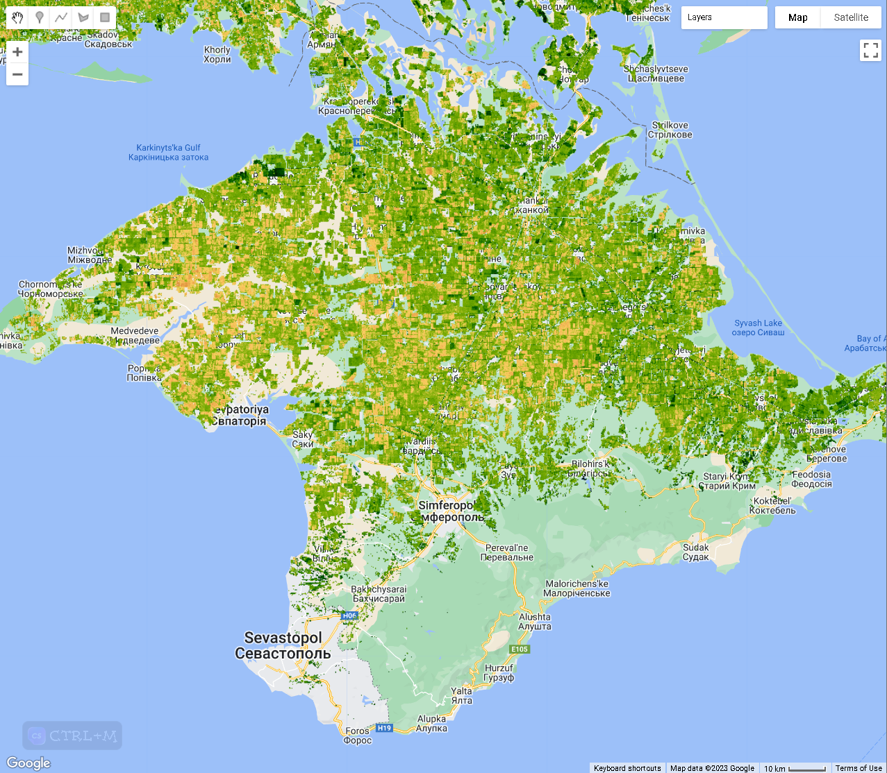
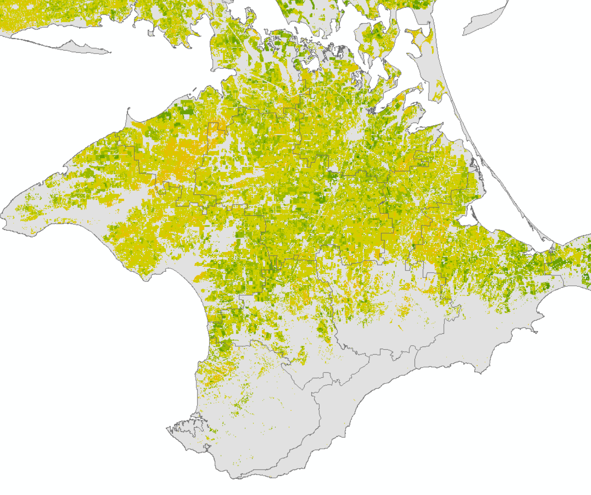

The Sentinel-1 modified Radar Vegetation Index (RVI) based on Google Earth Engine (GEE) script below originally developed by my friend Jose Manuel Delgado Blasco ([Scholar](https://scholar.google.com/citations?user=TwtlI-UAAAAJ), [Linkedin](https://it.linkedin.com/in/josemanuel-delgadoblasco)) as part of our team (GOST) activities to support during Ukraine response last year, published as GOST Public Good’s Github repo <https://github.com/worldbank/GOST_SAR/tree/master/Radar_Vegetation_Index>

The original GEE script was meant to be used only for individual updates, as time progresses and the need for vegetation monitoring continually increases, I believe it's necessary to obtain this RVI time-series data, which can be matched with monthly rainfall time-series data for monitoring food crop phenology.

For this reason, I've added a function to mosaic every ten days and [batch downloading](/blog/20220319-batch-task-execution-in-google-earth-engine-code-editor) if the list of data is quite extensive.

All credit goes to the awesome work of Jose Manuel! Hats off to him!



Above picture is Vegetation Indices based on Sentinel-1 (generated using the GEE script), below picture is Vegetation Indices for the same period based on Sentinel-2 (generated using Climate Engine <https://climengine.page.link/sZnR>)



NDVI in Crimean Peninsula  
  
Full GEE code is here: <https://code.earthengine.google.com/62f799954525c997629cefdd435c500e>

::: {.callout-note collapse="true" title="Javascript - Sentinel-1 modified RVI"}
```js
/*
 * Sentinel-1 modified RADAR VEGETATION INDEX (mRVI)
 *
 * Within this script SAR Sentinel-1 is being used to generate a vegetation index maps
 * using the mRVI approach defined in Çolak et al.(2021) with doi  
 * 10.5194/isprs-archives-xliii-b3-2021-701-2021. We have selected this one as it has shown to 
 * provide more similar information to the MODIS NDVI data.
 * 
 * We create mRVI nation-wide composites from both ascending and descending orbits together a
 * it has shown to provide better results on successive steps. The final maps are masked using
 * the ESA WorldCover map to generate only the mRVI index over crop areas, and finally rescaled
 * by a factor of 10000 to convert it into UInt16 (lighter than float)
 * 
 * Originally created by Jose Manuel Delgado Blasco, as part of GOST support to UKR activities
 * - https://github.com/worldbank/GOST_SAR/tree/master/Radar_Vegetation_Index
 * - https://code.earthengine.google.com/2b3eff8d77e245c0ba67c3dd127ec6e9
 * mRVI will use by GOST to monitor the crop phenology: Start of Season, End of Season, etc
 * the phenological analysis will use TIMESAT software for smoothing using Savitsky-Golay and
 * extract the seasonality parameters
 * 
 * Contact: Benny Istanto. Climate Geographer - GOST/DECAT/DECDG, The World Bank
 * related to the use of mRVI for crop growing stage monitoring
 * 
 * Changelog:
 * 2022-07-05 last commit by JMDB at GOST_SAR repository
 * 2023-06-14 Add function to get list images within dekad calendar, mosaic the result
 *            Batch downloading using JavaScript console (useful if you have hundred images)
 * 
 * ------------------------------------------------------------------------------
 */

/*
                    SELECT YOUR OWN STUDY AREA   

The user can :
1) select a full country by changing the countryname variable or;
2) use the polygon-tool in the top left corner of the map pane to draw the shape of your 
   study area. Single clicks add vertices, double-clicking completes the polygon.
   **CAREFUL**: Under 'Geometry Imports' (top left in map panel) uncheck the 
                geometry box, so it does not block the view on the imagery later.
3) load a shapefile stored in the user Assets collection
*/
 
/*
1)  Choose country name
*/
// List of country name: https://en.wikipedia.org/wiki/List_of_FIPS_country_codes
var countryname='Ukraine';
var countries = ee.FeatureCollection('USDOS/LSIB_SIMPLE/2017');
var aoi = countries.filter(ee.Filter.eq('country_na', countryname));
Map.addLayer(aoi,{},'AoI', false);
Map.centerObject(aoi,6);

/*
2) Use a user defined geometry.
   Uncomment the two lines below if you want to use a defined geometry as AoI 
*/
// var aoi = ee.FeatureCollection(geometry);
// Map.centerObject(aoi,8);

/*
3) Load a shapefile from Assets collection.
   Uncomment and modify the lines below if you want to use a shapefile stored in your assets
*/
// var aoi= ee.FeatureCollection('users/josemanueldelgadoblasco/UKR_adm0')
// Map.centerObject(aoi,8);


/*
                    SET TIME FRAME

Set start and end dates of a period that you want to generate the mRVI. Make sure it is long enough for 
Sentinel-1 to acquire an image (repitition rate = 6 days). Adjust these parameters, if
your ImageCollections (see Console) do not contain any elements.
*/

// Set the start and end dates to be used as pre-event in YYYY-MM-DD format.
var startDate = ee.Date('2023-01-01');
var endDate = ee.Date('2023-06-14');


/*
  ---->>> DO NOT EDIT THE SCRIPT PAST THIS POINT! (unless you know what you are doing) <<<---
  ------------------>>> now hit the'RUN' at the top of the script! <<<-----------------------
  -----> The final mRVI product will be ready for download on the right (under tasks) <-----
*/

// Creating dekad list from the date range
// Calculate the number of months between startDate and endDate
var numMonths = endDate.difference(startDate, 'month').round();

// Generate a sequence of months from startDate to endDate
var monthSequence = ee.List.sequence(0, numMonths, 1).map(function(month) {
  return startDate.advance(ee.Number(month), 'month');
});

// Function to generate dekad dates for a given month
var generateDekads = function(date) {
  date = ee.Date(date);
  var y = date.get('year');
  var m = date.get('month');

  var dekad1 = ee.Date.fromYMD(y, m, 1);
  var dekad2 = ee.Date.fromYMD(y, m, 11);
  var dekad3 = ee.Date.fromYMD(y, m, 21);

  return [dekad1, dekad2, dekad3];
};

// get the dekadList
var dekadList = monthSequence.map(generateDekads).flatten();
var filteredDekadList = dekadList.map(function(date){
  return ee.Algorithms.If(
    ee.Date(date).millis().lte(endDate.millis()),
    date,
    null
  );
}).removeAll([null]);

// Remove duplicate dekad dates from filteredDekadList
filteredDekadList = filteredDekadList.distinct();
print(filteredDekadList);


// Auxiliary variables and Data
// VH polarization is needed to compute the mRVI
var polarization = 'VH';
// Using the ESA WorldCover to mask out urban, water and other non crop areas.
var LULC = ee.ImageCollection("ESA/WorldCover/v200");
// Selecting cropland and herbaceous classes (class with value 40)
var cropland = LULC.mosaic().clip(aoi).eq(40);

// Defining auxiliary functions
// Defining the mRVI formula, based on Agapiou, 2020 - https://doi.org/10.3390/app10144764
var addmRVI = function (img) {
  var mRVI = img
    .select(['VV'])
    .divide(img.select(['VV']).add(img.select(['VH'])))
    .pow(0.5)
    .multiply(
      img
        .select(['VH'])
        .multiply(ee.Image(4))
        .divide(img.select(['VV']).add(img.select(['VH'])))
    )
    .rename('mRVI');
  return img.addBands(mRVI);
};


// Translating User Inputs
// DATA SELECTION & PREPROCESSING
// Load the Sentinel-1 GRD data (linear units) and filter by predefined parameters
var rvi = ee.ImageCollection('COPERNICUS/S1_GRD_FLOAT')
  .filterBounds(aoi)
  .filterDate(startDate, endDate)
  .filter(ee.Filter.eq('instrumentMode','IW'))
  .filter(ee.Filter.listContains('transmitterReceiverPolarisation', polarization))
  .filter(ee.Filter.eq('resolution_meters', 10))
  .map(addmRVI)
  .select('mRVI');

// Sorted time
var rvi_sorted = rvi.sort("system:time_start");
print(rvi_sorted);


// Mosaic all images within dekad calendar
// Function to create a mosaic for each dekad
var createMosaic = function(dekad) {
  // Calculate the start date for the dekad
  var startDate = ee.Date(dekad);
  
  // Find the index of the current dekad
  var currentIndex = ee.Number(filteredDekadList.indexOf(dekad));
  
  // Find the index of the next dekad
  var nextIndex = currentIndex.add(1);
  
  // Check if the next dekad exists. If not, use the endDate.
  var nextDate = ee.Algorithms.If(
    nextIndex.lt(filteredDekadList.size()),
    ee.Date(filteredDekadList.get(nextIndex)),
    endDate
  );
    
  // Filter the images within the dekad
  var dekadImages = rvi_sorted.filterDate(startDate, nextDate);
  
  // Select the mRVI band from each image
  var mRVIImages = dekadImages.select('mRVI');
  
  // Calculate the median of the mRVI images
  var medianImage = mRVIImages.reduce(ee.Reducer.median());

  // Return the median image with the dekad property
  return medianImage.set('dekad', dekad, 'system:time_start', startDate.millis());
};

// Apply the createMosaic function to each dekad in the filteredDekadList
var mosaicImages = ee.List(filteredDekadList.map(createMosaic));

// Convert the mosaicImages to an ImageCollection
var mosaicCollection = ee.ImageCollection.fromImages(mosaicImages);

// Multiply by 10000 and convert imageCollection to Uint16, can help preserve the precision
var toUInt16 = function(img){
  return img.multiply(10000).toUint16().copyProperties(img, ["dekad", "system:time_start"]);
};

// apply mask to imageCollection, get mRVI only in cropland areas
var masking = function(img){
  return img.updateMask(cropland).copyProperties(img, ["dekad", "system:time_start"]);
};

// Apply the toUInt16 function to each image in the mosaicCollection
var mosaicCollectionUInt16 = mosaicCollection.map(toUInt16);

// Apply the masking function to each image in the mosaicCollectionUInt16
var mosaicCollectionMasked = mosaicCollectionUInt16.map(masking);

// Print the masked mosaicCollection
print(mosaicCollectionMasked);
print(mosaicCollectionMasked.first().getInfo());


// Visualisation
// Symbology
var rviVis = {
  min: 0.0,
  max:8000,
  palette: [
    'FFFFFF', 'CE7E45', 'DF923D', 'F1B555', 'FCD163', '99B718', '74A901',
    '66A000', '529400', '3E8601', '207401', '056201', '004C00', '023B01',
    '012E01', '011D01', '011301'
  ],
};

// Add as map layer
Map.addLayer(LULC.first().clip(aoi),{bands: ['Map']},'landcover', false);
Map.addLayer(cropland.updateMask(cropland),{min:0,max:1,palette:['black','green']},'cropland', false);
Map.addLayer(mosaicCollectionMasked.first().clip(aoi), rviVis, 'RVI');


// Download process
// Batch export
mosaicCollectionMasked
  .aggregate_array('system:index')
  .evaluate(function (indexes){
    indexes.forEach(function (index) {
      var image = mosaicCollectionMasked
        .filterMetadata('system:index', 'equals', index)
        .first();

      var date = ee.Date(image.get('system:time_start'));
      var dateString = date.format('yyyyMMdd');
      
      dateString.evaluate(function(res){
        var filename = 'ukr_phy_s1_rvi_' + res;
        Export.image.toDrive({
          image: image.select('mRVI_median'),
          description: filename,
          folder:'ukr_rvi',
          scale: 100,
          maxPixels: 1e13,
          region: aoi,
          crs: 'EPSG:4326'
        }); 
      });     
    });
});


/*
 * Exporting image without clicking RUN button
 * 
 * 1. Run your Google Earth Engine code;
 * 2. Wait until all the tasks are listed (the Run buttons are shown);
 * 3. Click two computer keys fn and f12 at the same time and bring up console;
 *    or find it via: menubar Develop > Show JavaScript Console (Safari),
 *    and menubar View > Developer > JavaScript Console (Chrome)
 * 4. Copy and paste (line 313-322 below) into the console, press Enter;
 * 5. Wait until the code sends messages to the server to run all the tasks (you wait and relax);
 * 6. Wait until GEE shows the dialogue window asking you to click "Run"; 
 *    then Copy and paste (line 324-335 below), press Enter
 *    Notes: 
 *    Please bear in mind, the time execution is depend on the image size you will export. 
 *    Example, 1 year data for Ukraine on MODIS VI takes a minute to popup a window "Task: Initiate image export".
 * 7. Keep your computer open until all the tasks (Runs) are done 
 *    (you probably need to set your computer to never sleep).
 */

/**
 * Copyright (c) 2017 Dongdong Kong. All rights reserved.
 * This work is licensed under the terms of the MIT license.  
 * For a copy, see <https://opensource.org/licenses/MIT>.
 *
 * Batch execute GEE Export task
 *
 * First of all, You need to generate export tasks. And run button was shown.
 *   
 * Then press F12 get into console, then paste those scripts in it, and press 
 * enter. All the task will be start automatically. 
 * (Firefox and Chrome are supported. Other Browsers I didn't test.)
 * 
 * @Author: 
 *  Dongdong Kong, 28 Aug' 2017, Sun Yat-sen University
 *  yzq.yang, 17 Sep' 2021
 */

/*
function runTaskList(){
    // var tasklist = document.getElementsByClassName('task local type-EXPORT_IMAGE awaiting-user-config');
    // for (var i = 0; i < tasklist.length; i++)
    //         tasklist[i].getElementsByClassName('run-button')[0].click();
    $$('.run-button' ,$$('ee-task-pane')[0].shadowRoot).forEach(function(e) {
         e.click();
    })
}

runTaskList();

function confirmAll() {
    // var ok = document.getElementsByClassName('goog-buttonset-default goog-buttonset-action');
    // for (var i = 0; i < ok.length; i++)
    //     ok[i].click();
    $$('ee-table-config-dialog, ee-image-config-dialog').forEach(function(e) {
         var eeDialog = $$('ee-dialog', e.shadowRoot)[0]
         var paperDialog = $$('paper-dialog', eeDialog.shadowRoot)[0]
         $$('.ok-button', paperDialog)[0].click()
    })
}

confirmAll();
```
:::