This exercise aims to determine the best reduced model (RM) in regression analysis with dummy variables from annual rainfall data and altitude data in three different regions. This will result in a new regression equation capable of describing the relationship between altitude and rainfall in these three regions.

### Summary

The dummy variables constructed in this article are based on regional location, specifically regions 1, 2, and 3. The initial analysis entailed the representation of data for each region through scatter plots. Thereafter, a regression analysis with all parameters was conducted to derive the Full Model (FM). Subsequently, the scatter plot patterns for each region were examined, and regression equation models with identical intercepts or slopes were identified. The objective was to generate simpler regression models or equations (Reduced Models - RM) from the dummy variables constructed based on regional location. Upon obtaining several RMs, all were statistically tested using the F-test to ascertain their similarity to the FM. It was also necessary to compute and analyze the Mallows's Cp value for all RMs to determine the optimal RM. A good Reduced Model is one that is similar or identical to the Full Model. The F-test performed in this report was designed to determine whether the RM is similar or identical to the FM. The hypotheses for the F-test were as follows.

$H_0$: FM $=$ RM

$H_1$: FM $\neq$ RM

The null hypothesis is refuted in instances where the observed F-value surpasses the F-table value. This suggests that, as of yet, there's insufficient robust evidence to proclaim that the Reduced Model (RM) bears resemblance to the Full Model (FM) (Kutner et al., 2005). Within the conducted F-test analysis, a confidence interval of 95% is employed. The observed F-value can be calculated using the following formulation (Kutner et al., 2005):

$$F_{\text{Observed}} = \frac{(SSR_{FM} - SSR_{RM})/(df_{R,FM} - df_{R,RM})}{SSE_{FM}/df_{E,FM}}$$

The F-table value is derived from the F-distribution with the calculated degrees of freedom

$$F_{\text{table}} = F(df_{R,FM} - df_{R,RM}, df_{E,FM})$$

The RM is considered as efficient or akin to the FM if the Mallows's Cp value is equal to or less than the total number of parameters ($C_{P,\text{Mallows}} \leq p$) (Mallows, 1973). The Cp value is determined using the equation:

$$C_{P,\text{Mallows}} = p + \frac{(S^2 - \sigma^2)(n - p)}{\sigma^2}$$

where $p$ represents the number of parameters utilized in the RM, $n$ denotes the total number of observations within the model ($n=45$), $S^2$ is the variance of the RM, and $\sigma^2$ is the variance of the FM.

### Data

Total rainfall in different altitude and region. The data available in csv format with columns: altitude; rainfall; region

The data for this analysis is available from this link: <https://drive.google.com/file/d/1v3CGHBykg3UUqjKS3oyy8rIGsogN1DY5/view?usp=sharing>

### Implementation

In the implementation phase of this analysis, we utilized Python and the library to develop dummy variables regression

The whole thing runs in Google Colab with the data on Google Drive, so mount the drive first. This part only applies if you are working in Colab.

::: {.callout-note collapse="true" title="Python - connect Google Drive to Colab"}
```python
# Connect Google Drive directory into Colab
from google.colab import drive

# Unmount the drive
drive.flush_and_unmount()

# Mount the drive again
drive.mount('/content/drive')
```
:::

Then point `working_dir` at the folder holding the csv. Every path below is built from it.

::: {.callout-note collapse="true" title="Python - set the working directory"}
```python
# Import the library
import os

# Define the appropriate folder directory paths
working_dir = f'/content/drive/MyDrive/MSc_IPB_Graduate_program/02_Fundamental_Courses/GFM1622_3_Advanced_Climatological_Methods/exercises/dummy'

# If you have different folder structure, adjust it, put the input_data.csv from above link into Google Drive folder
# and adjust the working_dir above

# List the contents of the directory
directory_contents = os.listdir(working_dir)
directory_contents
```
:::

#### Plot the input data

Read the csv first and check what came in.

::: {.callout-note collapse="true" title="Python - read the input csv"}
```python
import pandas as pd

# Read the csv file
df = pd.read_csv(f'{working_dir}/input_data_uas.csv', delimiter=';')
df
```
:::

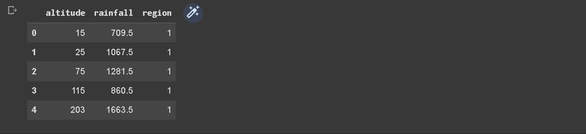

The code presented aims to investigate the relationship between rainfall and altitude across different regions. The dataset, obtained from a CSV file, contains information on rainfall and altitude for various regions. The code utilizes the `pandas` library to read the data and `matplotlib` and `seaborn` libraries for data visualization.

To begin, unique regions in the dataset are identified. A dictionary, `regression_params`, is created to store the coefficients of the regression equations for each region. Subsequently, a scatter plot is generated for each region, where altitude is plotted on the x-axis and rainfall on the y-axis. This is achieved using the `sns.scatterplot` function from the `seaborn` library.

A linear regression model is then fitted to the data for each region using the `LinearRegression` class from the `sklearn.linear_model` module. The model is trained with altitude as the predictor variable (`X`) and rainfall as the target variable (`y`). The slope and intercept coefficients of the regression equation are obtained from the fitted model.

The regression coefficients are stored in the `regression_params` dictionary, associating them with their respective regions. Additionally, the regression equation is displayed on the plot for each region using the `ax.text` function. A regression line is drawn on the plot using the `ax.plot` function to visualize the relationship between altitude and rainfall.

The resulting plot showcases the rainfall-altitude relationship for different regions, with each region's data points, regression line, and equation displayed. The plot is saved as an image file, and the figure is displayed for further examination.

Finally, the regression parameters for each region are printed to provide insights into the specific regression equations obtained. The slope and intercept values are extracted from the `regression_params` dictionary and displayed for each region.

::: {.callout-note collapse="true" title="Python - scatter plot and per-region regression lines"}
```python
import pandas as pd
import matplotlib.pyplot as plt
import seaborn as sns
from sklearn.linear_model import LinearRegression
import numpy as np

# Read the csv file
df = pd.read_csv(f'{working_dir}/input_data_uas.csv', delimiter=';')
df

# List out unique regions
regions = df['region'].unique()

# Create a dictionary to store regression equation coefficients
regression_params = {}

# Create a figure and axis for the plot
fig, ax = plt.subplots()

# Loop through the unique regions
for region in regions:
    # Select rows for this region
    region_data = df[df['region'] == region]

    # Create scatter plot for this region
    sns.scatterplot(data=region_data, x='altitude', y='rainfall', label=region, ax=ax)

    # Fit linear regression model
    model = LinearRegression()
    X = region_data['altitude'].values.reshape(-1, 1)
    y = region_data['rainfall'].values.reshape(-1, 1)
    model.fit(X, y)

    # Get results from the model
    slope = model.coef_[0][0]
    intercept = model.intercept_[0]

    # Store regression coefficients in the dictionary
    regression_params[region] = (slope, intercept)

    # Display regression equation on the plot
    ax.text(max(X), max(y), f'y={slope:.2f}x+{intercept:.2f}', fontsize=9)

    # Draw regression line
    ax.plot(X, model.predict(X), linewidth=2)

# Add title and labels
ax.set_title('Rainfall by Altitude for Different Regions')
ax.set_xlabel('Altitude')
ax.set_ylabel('Rainfall')

# Save figure
plt.savefig(f'{working_dir}/uas_01_data.png', dpi=300)

# Show the plot
plt.show()

# Now you can access the regression parameters like this:
for region, params in regression_params.items():
    slope, intercept = params
    print(f"For region {region}, the regression equation is y = {slope:.2f}x + {intercept:.2f}")
```
:::

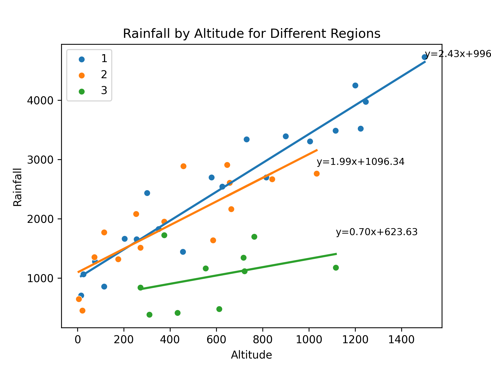

The provided code snippet focuses on data preprocessing and feature creation based on the information in a CSV file. It employs the pandas library for data manipulation and transformation.

Initially, the CSV file is read into a DataFrame using the pd.read\_csv function, with the resulting DataFrame stored as df.

Next, several new columns are created based on the region column. These new columns serve as indicator variables to represent different regions in the dataset. Specifically, columns I1, I2, and I3 are generated using logical comparisons to check if the region value matches the respective region number. The astype(int) method is then applied to convert the resulting Boolean values to integers.

Similarly, additional columns H1, H2, and H3 are created by multiplying the altitude column with the corresponding indicator variables (I1, I2, and I3). This results in the creation of separate altitude columns for each region, where the altitude values are present only for the respective region and are set to zero for other regions.

Following this, combinations of indicator variables are generated to represent different combinations of regions. Columns I12, I13, I23, and I123 are created using logical comparisons to check if the region value matches the respective region combination. Column I123 is assigned a constant value of 1 since it represents the inclusion of all regions.

Similarly, new altitude columns H12, H13, H23, and H123 are created by multiplying the altitude column with the respective combination indicator variables. These columns enable the representation of altitude values for specific region combinations.

Lastly, the modified DataFrame is saved as a new CSV file using the to\_csv function, with the file path specified and the separator set to ;. The resulting DataFrame is displayed using the df.head() method to show the first few rows of the transformed dataset.

In summary, this code segment demonstrates a data preprocessing step where new columns are created to represent regions and region combinations based on the original data. These transformations facilitate subsequent analysis and modeling tasks by providing a more informative and structured dataset.

::: {.callout-note collapse="true" title="Python - build the dummy and interaction variables"}
```python
import pandas as pd

# Read the csv file
df = pd.read_csv(f'{working_dir}/input_data_uas.csv', delimiter=';')

# Create I1, I2, and I3 based on 'region'
df['I1'] = (df['region'] == 1).astype(int)
df['I2'] = (df['region'] == 2).astype(int)
df['I3'] = (df['region'] == 3).astype(int)

# Create H1, H2, and H3
df['H1'] = df['altitude'] * df['I1']
df['H2'] = df['altitude'] * df['I2']
df['H3'] = df['altitude'] * df['I3']

# Create I12, I13, I23, and I123
df['I12'] = ((df['region'] == 1) | (df['region'] == 2)).astype(int)
df['I13'] = ((df['region'] == 1) | (df['region'] == 3)).astype(int)
df['I23'] = ((df['region'] == 2) | (df['region'] == 3)).astype(int)
df['I123'] = 1  # as all regions are included

# Create H12, H13, H23, and H123
df['H12'] = df['altitude'] * df['I12']
df['H13'] = df['altitude'] * df['I13']
df['H23'] = df['altitude'] * df['I23']
df['H123'] = df['altitude']  # as it is multiplied by I123 which is always 1

# Save the new dataframe to a csv file
df.to_csv(f'{working_dir}/output_data_uas.csv', index=False, sep=';')

df.head()  # Display the first few rows of the new dataframe
```
:::

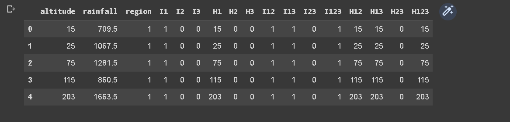

#### Full model, avoid dummy trap

The Full Model regression equation doesn't include I3 because of a technique used in regression analysis known as dummy coding. When we have a categorical variable with k levels (in this case, region with 3 levels), we need to create k-1 dummy variables to represent it in the regression model.

The reason for using k-1 dummy variables instead of k is to avoid the dummy variable trap, which is a scenario in which the independent variables are multicollinear. In other words, one variable can be predicted perfectly from the others.

In our case, I1, I2, and I3 represent the three regions. If we included all three in our model, we would have perfect multicollinearity because I3 can be perfectly predicted from I1 and I2 (if I1 = 0 and I2 = 0, then I3 has to be 1). This would make the model's estimates unstable and uninterpretable.

By leaving out I3, we are implicitly choosing region 3 as the reference category. The coefficients for I1 and I2 then represent the difference in the outcome between regions 1 and 3, and regions 2 and 3, respectively.

If we want to make comparisons between regions 1 and 2, we can either change the reference category (by including I3 and leaving out I1 or I2 instead), or compute the difference between the I1 and I2 coefficients.

::: {.callout-note collapse="true" title="Python - full model, leaving out I3 to avoid the dummy trap"}
```python
import statsmodels.api as sm

# Read the csv file
df = pd.read_csv(f'{working_dir}/output_data_uas.csv', delimiter=';')

# Define the independent variables
X = df[['I1', 'I2', 'H1', 'H2', 'H3']]
X = sm.add_constant(X)  # adding a constant (intercept term)

# Define the dependent variable
y = df['rainfall']

# Fit the model using statsmodels
model = sm.OLS(y, X)
results = model.fit()

# Print the regression summary
print(results.summary())

# Extract the model's coefficients and format them as strings
intercept = results.params[0]
coefficients = results.params[1:]
equation_terms = [f"{coeff:.3f}*{var}" for coeff, var in zip(coefficients, X.columns[1:])]

# Construct the full regression equation string
regression_equation = "y = " + str(intercept) + " + " + " + ".join(equation_terms)
print("\nFull model regression equation:\n", regression_equation)
```
:::

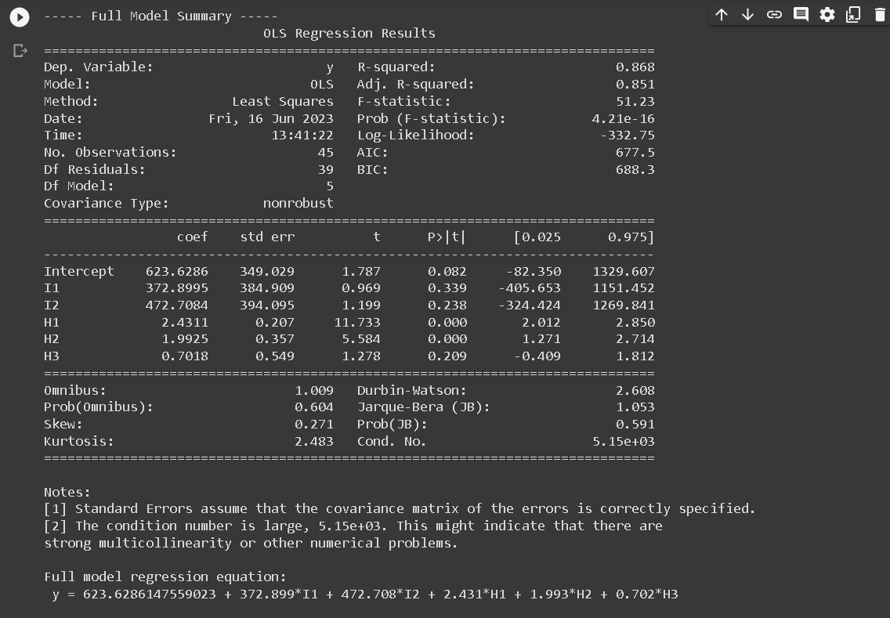

#### Reduced Model

Next, we are talking about creating Reduced Models (RMs) from a Full Model (FM) with dummy variables representing regions and altitude variables interacted with these region dummies. The Full Model (FM) in this context is:

FM: y123 = a1 I1 + a2 I2 + a3 I3 + b1 H1 + b2 H2 + b3 H3

where:

* y123 represents rainfall
* I1, I2, I3 are dummy variables for regions 1, 2, and 3, respectively
* H1, H2, H3 are altitude variables interacted with the respective region dummies

Based on this FM, we can derive 5 different Reduced Models (RMs):

* RM1: Common slope across region 1 and region 2: y123 = a12 I12 + b1H1 + b2H2 + a3 I3 + b3H3
* RM2: Common intercept and slope across all regions: y123 = a123 I123 + b123 H123
* RM3: Common intercept and slope across region 1 and region 3, different slope for region 2: y123 = a13 I13 + b13H13 + a2I2 + b2H2
* RM4: Common slope across region 1 and region 2, different slope for region 3: y123 = a12 I12 + b12 H12 + a3I3 + b3H3
* RM5: Common intercept across all regions, common slope across region 1 and region 2, different slope for region 3: y123 = a1 I1 + a2 I2 + a3 I3 + b12 H12 + b3 H3

::: {.callout-note collapse="true" title="Python - fit the five reduced models and run the F-test"}
```python
import statsmodels.api as sm
import statsmodels.formula.api as smf
import pandas as pd
from scipy.stats import f

# Read the csv file
df = pd.read_csv(f'{working_dir}/output_data_uas.csv', delimiter=';')

# Define the list of RM equations
rm_equations = [
    ['I12', 'H1', 'H2', 'I3', 'H3'],  # RM1
    ['I123', 'H123'],  # RM2
    ['I13', 'H13', 'I2', 'H2'],  # RM3
    ['I12', 'H12', 'I3', 'H3'],  # RM4
    ['I1', 'I2', 'I3', 'H12', 'H3']  # RM5
]

# Full model with specified predictors
full_model_formula = 'y ~ I1 + I2 + H1 + H2 + H3'
full_model = smf.ols(formula=full_model_formula, data=df)
full_results = full_model.fit()

# Print the Full Model Regression Summary
print("----- Full Model Summary -----")
print(full_results.summary())

# Extract the model's coefficients and format them as strings
intercept = full_results.params[0]
coefficients = full_results.params[1:]
equation_terms = [f"{coeff:.3f}*{var}" for coeff, var in zip(coefficients, full_model_formula.split(' ~ ')[1].split(' + '))]

# Construct the full regression equation string
regression_equation = "y = " + str(intercept) + " + " + " + ".join(equation_terms)
print("\nFull model regression equation:\n", regression_equation)

# For each RM, fit the model and print the summary
results_list = []  # Initialize a list to store the results of each RM
for i, predictors in enumerate(rm_equations, start=1):
    reduced_model_formula = 'y ~ ' + ' + '.join(predictors)
    reduced_model = smf.ols(formula=reduced_model_formula, data=df)
    results = reduced_model.fit()
    results_list.append(results)  # Store the results of this RM

    # Print the regression summary
    print(f"\n----- Reduced Model {i} Summary -----")
    print(results.summary())

print("------------")
print("Summary table for Full Model and Reduce Model")
print("------------")

# Create summary table
summary_table = pd.DataFrame(index=['Regression', 'Residual Error', 'Total', 'Ftest', 'Ftable', 'Hypothesis'],
                             columns=['FM_SS', 'FM_DF', 'RM1_SS', 'RM1_DF', 'RM2_SS', 'RM2_DF', 'RM3_SS', 'RM3_DF', 'RM4_SS', 'RM4_DF', 'RM5_SS', 'RM5_DF'])

# Store full model statistics
full_model_anova = sm.stats.anova_lm(full_results, typ=1)
summary_table.loc['Regression', 'FM_SS'] = full_model_anova.sum_sq.sum() - full_model_anova.sum_sq['Residual']
summary_table.loc['Residual Error', 'FM_SS'] = full_model_anova.sum_sq['Residual']
summary_table.loc['Total', 'FM_SS'] = full_model_anova.sum_sq.sum()

# Calculation of degrees of freedom for full model
summary_table.loc['Regression', 'FM_DF'] = full_results.df_model
summary_table.loc['Residual Error', 'FM_DF'] = full_results.df_resid
summary_table.loc['Total', 'FM_DF'] = full_results.df_model + full_results.df_resid

# Loop through each RM
for i, results in enumerate(results_list, start=1):
    reduced_model_anova = sm.stats.anova_lm(results, typ=1)

    # Store reduced model statistics
    summary_table.loc['Regression', f'RM{i}_SS'] = reduced_model_anova.sum_sq.sum() - reduced_model_anova.sum_sq['Residual']
    summary_table.loc['Residual Error', f'RM{i}_SS'] = reduced_model_anova.sum_sq['Residual']
    summary_table.loc['Total', f'RM{i}_SS'] = reduced_model_anova.sum_sq.sum()

    # Calculation of degrees of freedom for reduced models
    summary_table.loc['Regression', f'RM{i}_DF'] = results.df_model
    summary_table.loc['Residual Error', f'RM{i}_DF'] = results.df_resid
    summary_table.loc['Total', f'RM{i}_DF'] = results.df_model + results.df_resid

    # Calculate F-test
    summary_table.loc['Ftest', f'RM{i}_SS'] = ((summary_table.loc['Regression', 'FM_SS'] - summary_table.loc['Regression', f'RM{i}_SS']) / (summary_table.loc['Regression', 'FM_DF'] - summary_table.loc['Regression', f'RM{i}_DF'])) / (summary_table.loc['Residual Error', f'RM{i}_SS'] / summary_table.loc['Residual Error', f'RM{i}_DF'])

    # Calculate F-table
    summary_table.loc['Ftable', f'RM{i}_SS'] = f.ppf(0.95, summary_table.loc['Regression', 'FM_DF'] - summary_table.loc['Regression', f'RM{i}_DF'], summary_table.loc['Residual Error', f'RM{i}_DF'])

    # Hypothesis test
    summary_table.loc['Hypothesis', f'RM{i}_SS'] = 'Accept' if summary_table.loc['Ftest', f'RM{i}_SS'] <= summary_table.loc['Ftable', f'RM{i}_SS'] else 'Reject'

print(summary_table)
```
:::

::: {.image-gallery}
::: {.gallery-item}
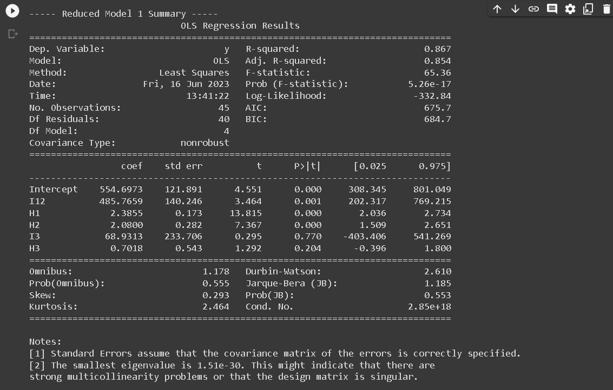
:::
::: {.gallery-item}
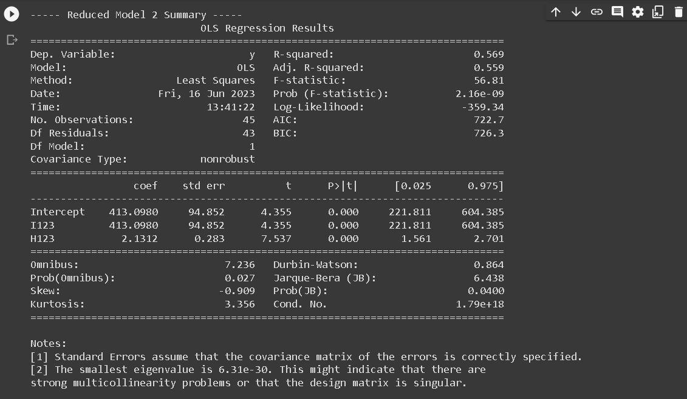
:::
::: {.gallery-item}
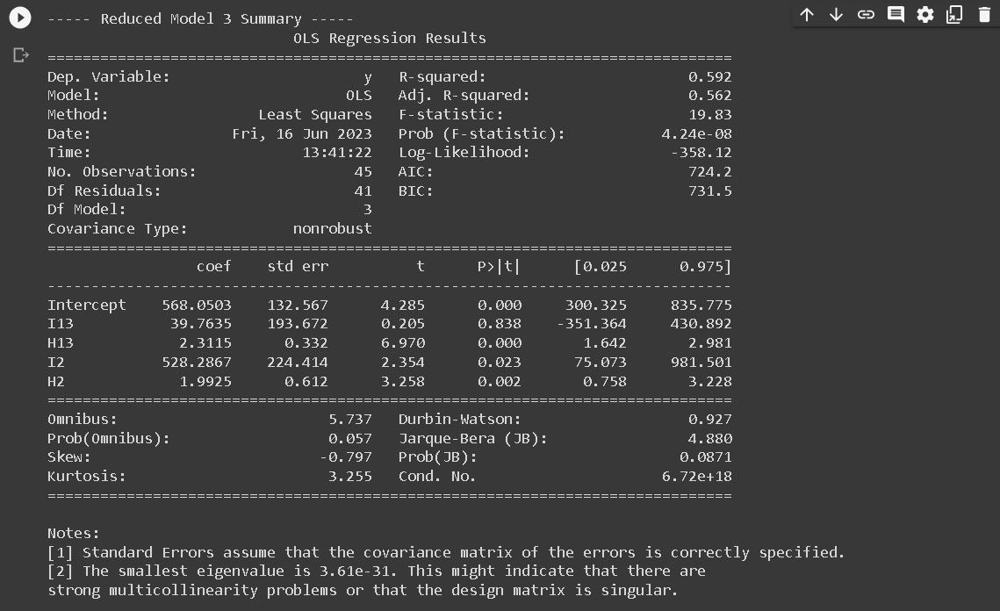
:::
::: {.gallery-item}

:::
::: {.gallery-item}
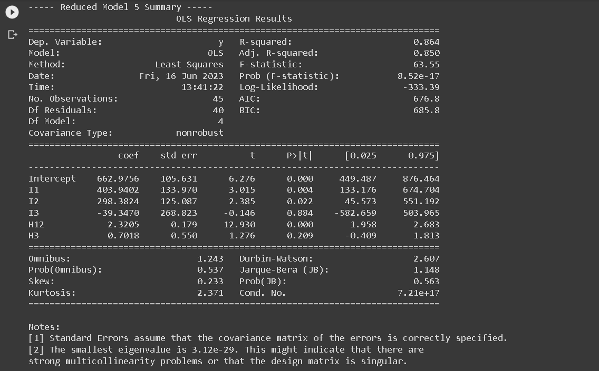
:::
::: {.gallery-item}
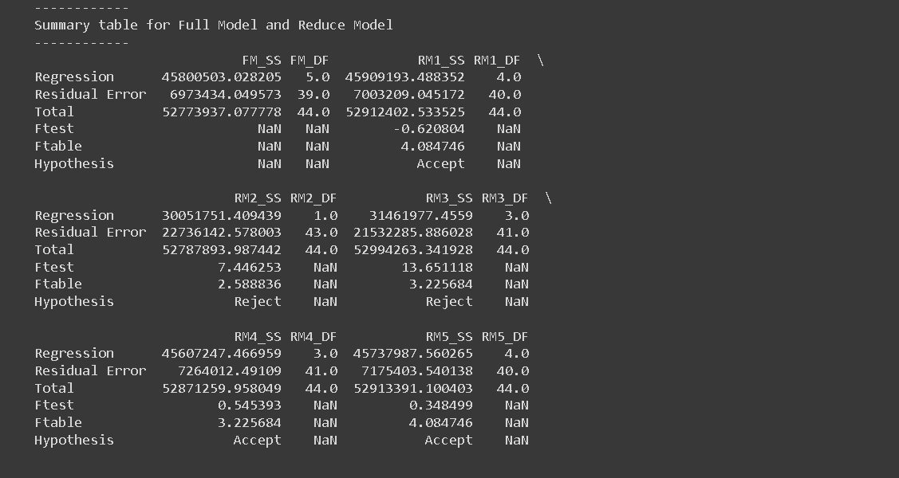
:::
:::

#### Cp Mallows

Next, a summary table was created to provide a succinct overview of both the Full Model (FM) and each Reduced Model (RM). This table is essential as it encapsulates vital statistical information about each model. This summary table consists of five columns: P, S, σ, n, and C\_P\_Mallow, and six rows corresponding to FM',RM1,RM2', RM3, RM4, and RM5.

The P denotes the number of parameters used in each model, S indicates the standard deviation of the residuals, σ represents the standard deviation of residuals for the full model, n signifies the number of observations, and C\_P\_Mallow represents the value of Mallow's C\_P statistic.

In the process of determining the effectiveness of the Reduced Models in relation to the Full Model, the Mallow's $C_P$ statistic plays a crucial role. According to Mallows (1973), a Reduced Model can be considered comparable to the Full Model if the Mallow's $C_P$ value is less than or equal to the number of parameters ($C_{P,\text{Mallow}} \leq p$). This statistic is calculated using the formula:

$$C_{P,\text{Mallow}} = p + \frac{(S^2 - \sigma^2)(n - p)}{\sigma^2}$$

In this context, $p$ corresponds to the number of parameters used in the Reduced Model, $n$ denotes the total data observations used in the model (in this case, $n=45$), $S^2$ is the variance of the Reduced Model, and $\sigma^2$ is the variance of the Full Model. By making use of this computation, we were able to evaluate the efficiency of each Reduced Model in comparison to the Full Model, aiding in the effective and accurate analysis of our data set.

::: {.callout-note collapse="true" title="Python - Mallows's Cp for each reduced model"}
```python
# Create a summary table
summary_rm_table = pd.DataFrame(columns=['P', 'S', 'σ', 'n', 'C_P_Mallow'],
                                index=['FM', 'RM1', 'RM2', 'RM3', 'RM4', 'RM5'])

# Constants
n = len(df)  # The number of observations

# σ (variance of the full model)
σ = (summary_table.loc['Residual Error', 'FM_SS'] / summary_table.loc['Residual Error', 'FM_DF'])**0.5

# For the full model (FM)
p = summary_table.loc['Regression', 'FM_DF']  # The number of parameters in the full model

# Store the values in the summary table for FM
summary_rm_table.loc['FM', 'P'] = p
summary_rm_table.loc['FM', 'S'] = σ
summary_rm_table.loc['FM', 'σ'] = σ
summary_rm_table.loc['FM', 'n'] = n
summary_rm_table.loc['FM', 'C_P_Mallow'] = p  # for the full model, CP Mallow is equal to the number of parameters

# Loop through each RM
for i in range(len(rm_equations)):
    p = summary_table.loc['Regression', f'RM{i+1}_DF']  # The number of parameters in the reduced model

    S = (summary_table.loc['Residual Error', f'RM{i+1}_SS'] / summary_table.loc['Residual Error', f'RM{i+1}_DF'])**0.5  # The variance of the reduced model

    # Calculate CP Mallow
    C_P_Mallow = min(p, p + ((S**2 - σ**2) * (n - p) / σ**2))  # Update the calculation to ensure CP doesn't exceed p

    # Store the values in the summary table
    summary_rm_table.loc[f'RM{i+1}', 'P'] = p
    summary_rm_table.loc[f'RM{i+1}', 'S'] = S
    summary_rm_table.loc[f'RM{i+1}', 'σ'] = σ
    summary_rm_table.loc[f'RM{i+1}', 'n'] = n
    summary_rm_table.loc[f'RM{i+1}', 'C_P_Mallow'] = C_P_Mallow

print(summary_rm_table)
```
:::

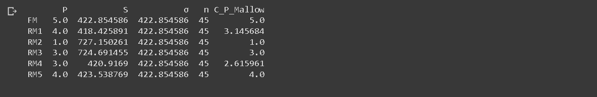

#### Plot Cp Mallows

Based on the provided results from the code, we can create a plot to visualize the CP Mallow statistic. The x-axis of the plot will represent the number of predictors (P), while the y-axis will represent the CP Mallow values.

To begin, we will draw a cross line starting from the point (1, 1) and extending to the point (n, n), where 'n' represents the total number of observations. This line will serve as a reference and help us identify the region of interest.

Next, we will plot the CP values on the y-axis corresponding to the respective number of predictors (P) on the x-axis. Each point on the plot will represent a reduced model, with the CP value indicating its performance compared to the full model.

To highlight the specific point that satisfies the given criteria - the lowest number of predictors (P) and falls either above or below the cross line - we can customize the marker style or color for that point. This will make it visually distinct from the other points on the plot.

By examining the plot, we can easily identify the reduced model that strikes a balance between simplicity (fewer predictors) and predictive power (CP Mallow value). The highlighted point will represent the optimal reduced model that meets these criteria.

This plot provides a visual representation of the CP Mallow statistic, allowing us to compare the performance of different reduced models and select the most appropriate one based on the desired balance between complexity and prediction accuracy.

::: {.callout-note collapse="true" title="Python - plot Mallows's Cp against the number of predictors"}
```python
import matplotlib.pyplot as plt

# Extract the relevant data from the summary table
p_values = summary_rm_table['P'].values[1:]  # Exclude FM
cp_values = summary_rm_table['C_P_Mallow'].values[1:]  # Exclude FM

# Create a figure with a larger size
plt.figure(figsize=(8, 6))

# Create scatter plot with switched x and y-axis
plt.scatter(p_values, cp_values, color='blue')

# Adding the cross line
plt.plot([0, max(p_values) + 1], [0, max(cp_values) + 1], linestyle='--', color='gray')

# Highlighting the point with the lowest P and above/below the cross line
min_p_index = np.argmin(cp_values)
highlighted_p = p_values[min_p_index]
highlighted_cp = cp_values[min_p_index]
highlight_color = 'red' if highlighted_p < highlighted_cp else 'green'

plt.scatter(highlighted_p, highlighted_cp, marker='o', color=highlight_color)

# Add labels for each point using the index
for i, (p, cp) in enumerate(zip(p_values, cp_values)):
    plt.text(p, cp, f'RM{i+1}', fontsize=8, verticalalignment='bottom', horizontalalignment='left')

# Set the x and y-axis limits based on the maximum values
plt.xlim(0, max(p_values) + 1)
plt.ylim(0, max(cp_values) + 1)

# Setting plot labels and title
plt.xlabel('Number of Predictors (P)')
plt.ylabel('CP Mallow')
plt.title('CP Mallow vs. Number of Predictors')

# Displaying the plot
plt.show()
```
:::

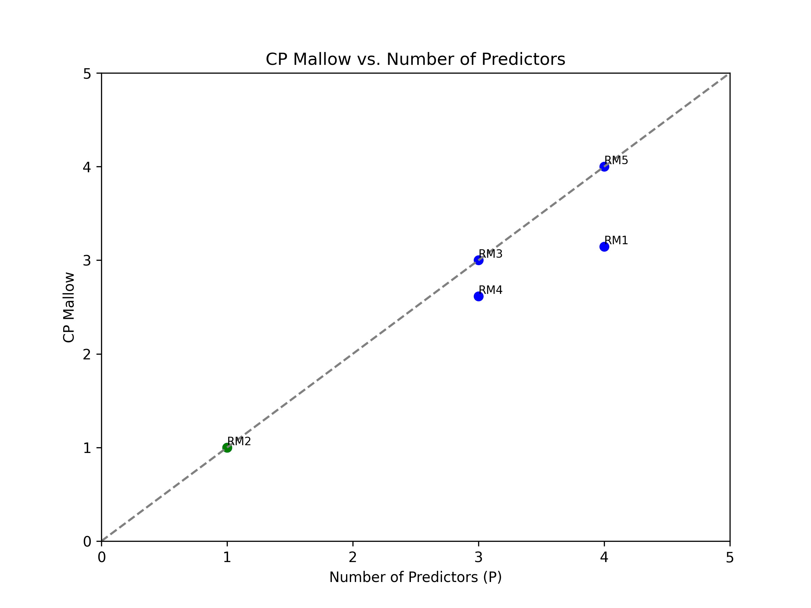

The execution of linear regression analysis across the three designated regions indicated a correlation between the augmentation of annual precipitation and escalating altitude. The reduced models (RM) that demonstrated a close correspondence to the full model (FM) were RM2 and RM4. However, the models that exhibited remarkable efficacy were RM2. The characteristics embodied by the first and second regions can be postulated to bear similarities, while they exhibit discernible divergence from the attributes of the third region