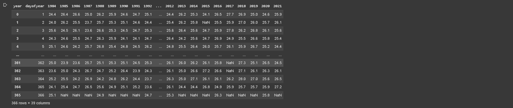
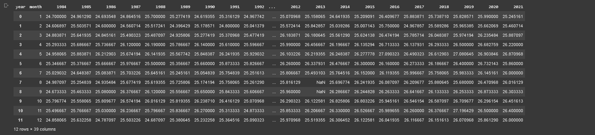
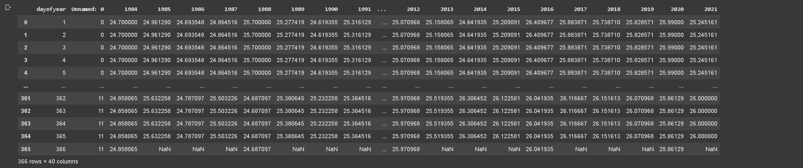
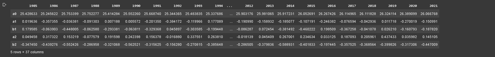
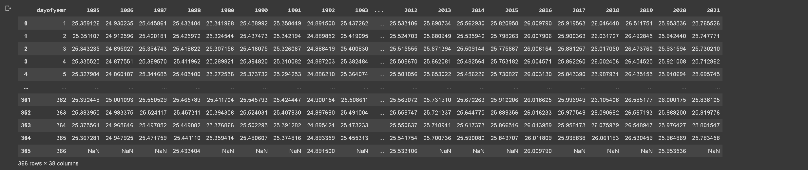
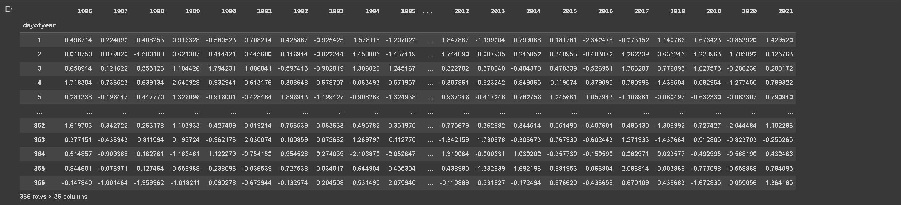
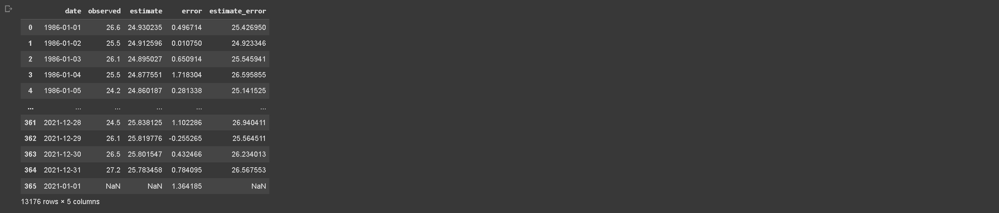
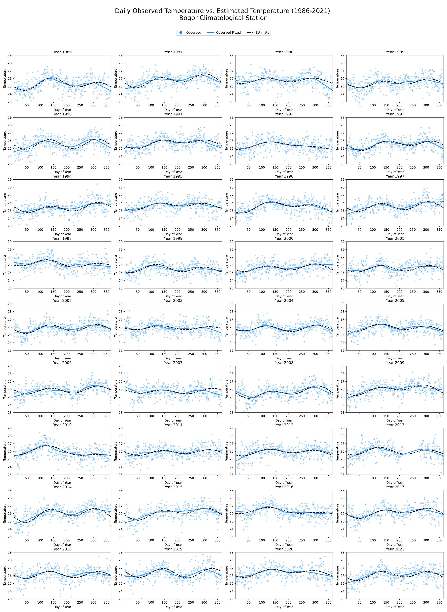
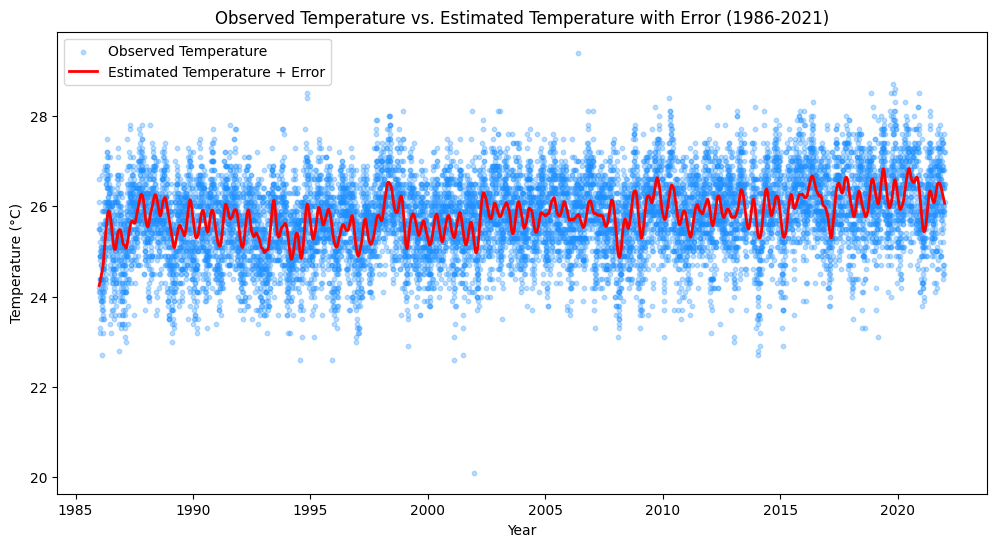
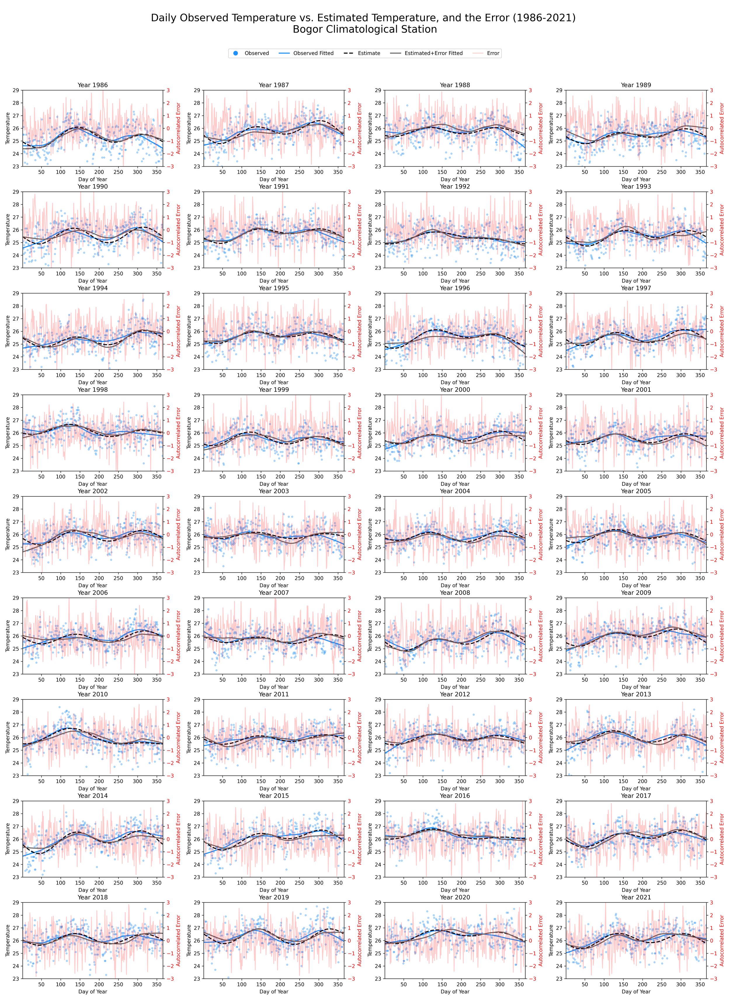

### 1 Introduction

In the sphere of meteorology, the significance of statistical models in comprehending and forecasting diverse weather patterns is incontestable. Within this context, the Fourier regression model has emerged as a formidable asset, specifically in generating daily time series from monthly temperature data (Wilks, 1998). The model lays a robust foundation for simulating temperature patterns, yielding crucial insights that are indispensable for weather prediction, climate change studies, and managing water resources.

The Fourier regression model has been proven to be a highly effective tool for generating daily time series from monthly temperature data, enhancing our understanding and prediction capabilities in weather forecasting, climate change studies, and water resource management. This model's unique ability to incorporate historical context allows it to capture intricate dependencies and transitions in temperature data, which are crucial in understanding temperature patterns.

By applying Fourier series, it is possible to reduce the number of parameters involved in the process, thereby simplifying complex calculations and making the model more efficient. Moreover, the Fourier regression model can seamlessly replace missing values and handle anomalies, which are often challenges in data analysis. This enables more accurate simulations and predictions, making it a vital tool in fields such as agriculture and urban planning.

The Fourier regression model's success in generating daily time series from monthly temperature data not only contributes to our understanding of weather patterns but also provides practical solutions for real-world challenges, making it a powerful instrument in various domains.

### 2 Data

Over the past three decades, Bogor's climate has remained relatively consistent. The city experiences an average annual temperature of around 26 °Celsius. The temperature varies little throughout the year, with the warmest month averaging around 27 °Celsius and the coolest month averaging around 25 °Celsius.

Daily temperature data of Bogor Climatological Station from 1984-2021 were used in this analysis, downloaded from BMKG Data Online in \*.xlsx format. The file then manipulated by remove the logo and unnecessary text, aggregated into monthly, leaving only two columns, namely date in column A and temperature in column B for the header with the format extending downwards, and save as \*.csv format.

| date | temperature |
|---|---|
| 01-Jan-1984 | 24.4 |
| 02-Jan-1984 | 24.0 |
| 03-Jan-1984 | 25.6 |
| ... | ... |
| 22-Dec-2021 | NaN |
| ... | ... |
| 30-Dec-2021 | 26.5 |
| 31-Dec-2021 | 27.2 |

The final input file is accessible via this link: <https://drive.google.com/file/d/1vKT5ekDnqahkG6um5wIm-ZfhExqZTAm8/view?usp=sharing>

### 3 Methods

This exercise focuses on the Fourier regression model as a tool for generating daily temperature data from monthly time series (Boer, 1999).

Fourier series can also be employed to generate other climate data. McCaskill (1990a) utilized Fourier series regression, incorporating rainfall events to generate pan evaporation data, maximum and minimum air temperature, and daily radiation intensity (P(i)).

$$
P_{(i)} = a_0 + \sum_{k=1}^{m} \left[ a_k \sin(k i') + b_k \cos(k i') \right] + \sum_{j=1}^{n} c_j \, f\left[ R(i+j) \right]
\tag{1}
$$

where $f$ represents a rain function, $R(i+j)$ is a rain event on day $(i+j)$, and $c_j$, $l$, and $n$ are determined through regression analysis. In the context of Australia, the incorporation of rain events in the Fourier series function did not exert a significant impact, although it substantially reduced the error level of the estimated value (McCaskill, 1990a).

In the above equation 1, the effect of rainfall events is assumed to be additive. However, for certain regions, this rainfall event impact could be multiplicative.

In many cases, climate data is generally presented as monthly data, making analysis requiring daily data difficult to execute. Fourier series regression can also be used to generate daily climate data from average monthly climate data (Epstein, 1991). The equation is written as follows:

$$
P_{(t)} = a_0 + \sum_{k=1}^{n} \left[ a_k \sin(k t') + b_k \cos(k t') \right]
\tag{2}
$$

where $t' = \frac{2\pi t}{12}$, and $t$ is the month. This equation assumes an equal number of days in each month, which is not the case in reality. Therefore, to adjust it, the value of $t$ in the above equation is changed as the $m$-th day for the $T$-th month so that the value $t = (T-0.5)+\frac{(m-0.5)}{D}$, where $D$ is the number of days in month $T$. The use of equation 2 to create fitting lines for daily data is highly effective. The fitting lines composed from daily data and those derived from monthly data almost overlap.

For simulation purposes, an error component, $e(i)$, which has a normal distribution with a mean of 0 and a variance of $s^2$ is typically included. Thus, the data series generated by each simulation will differ but still reflect the seasonal diversity of data. Errors in climate data simulation models often autocorrelate. Therefore, the error component can be modeled using a k-th order autocorrelation function (Wannacott and Wannacott, 1987), which is:

$$
e_{(i)} = r_1 e_{(i-1)} + r_2 e_{(i-2)} + \dots + r_k e_{(i-k)} + w_{(i)}
\tag{3}
$$

where $r$ is the correlation value and $w(i)$ is the random error (white noise). The simplest autocorrelation error function linearly connects the error on day $i$ with the error on day $i-1$ plus the random error on day $i$ (first-order autocorrelation function), namely:

$$
e_{(i)} = r\, e_{(i-1)} + w_{(i)}
\tag{4}
$$

Therefore, if the value of $r$ is positive, the error on day $i$ tends to increase if the error on the previous day was high, and vice versa. Practically, the value of $r$ is always less than one, but its magnitude is unknown.

### 4 Implementation

In the implementation phase of this analysis, we utilized Python and the Pandas, Numpy and Matplotlib library to develop a Fourier regression model to generate daily time series from monthly temperature data.

The whole thing runs in Google Colab with the data on Google Drive, so the first step is to mount the drive. This part only applies if you are working in Colab.

::: {.callout-note collapse="true" title="Python - connect Google Drive to Colab"}
```python
# Connect Google Drive directory into Colab
from google.colab import drive

# Unmount the drive
drive.flush_and_unmount()

# Mount the drive again
drive.mount('/content/drive')
```
:::

Then set the working directories. Every path variable used in the rest of the code comes from here, so run this before anything else.

::: {.callout-note collapse="true" title="Python - set the working directories"}
```python
import os

# Define the Google Drive path
working_dir = '/content/drive/MyDrive/MSc_IPB_Graduate_program/02_Fundamental_Courses/GFM1622_3_Advanced_Climatological_Methods/exercises/climgen'
station_path = f'{working_dir}/station'
output_path = f'{working_dir}/output'
image_path = f'{working_dir}/image'

# List of folder directories
folder_directories = [
    working_dir, station_path, output_path, image_path
]

# Create the folder directories if they don't already exist
for directory in folder_directories:
    os.makedirs(directory, exist_ok=True)

# Combine the paths
full_path = os.path.join(working_dir, station_path)

# List the contents of the directory
directory_contents = os.listdir(full_path)
directory_contents
```
:::

#### 4.1 How-to?

The step-by-step guide for the model is readily accessible in Google Colab, an ideal platform for data analysis and machine learning. This comprehensive how-to guide explains the entire process, starting with reshaping the data to ensure compatibility with the model, and aggregate calculation from daily to monthly, assigning monthly data across the corresponding days of the month, Fourier Series Modeling and Coefficient Extraction, Temperature estimation using Fourier Coefficients, Autocorrelated Error Calculation and Final estimates adjusted temperature..

##### 4.1.1 Reshape the data

The first step in our analysis involves pre-processing and reshaping the data to fit the requirements of the subsequent statistical modeling. Our raw temperature data, originally in a CSV file, consists of daily temperature readings recorded over several years. In this data, dates are represented in a 'YYYY-MM-DD' format. However, for our analysis, we require the 'day of the year' and the 'year' as separate variables.

We start by loading the data into a Pandas DataFrame. Next, we convert the 'date' column into a datetime format using the pd.to\_datetime() function, which facilitates date-specific manipulations. This allows us to extract the 'day of the year' and the 'year' information from each date and store these in new columns titled 'dayofyear' and 'year', respectively.

Since we have multiple temperature readings per day, we average these readings for each day of the year across all years. We do this by grouping the data by 'dayofyear' and 'year', and then calculating the mean temperature for each group using the groupby() and mean() functions.

However, this leaves us with a long format DataFrame, where each row represents a day of a particular year. For easier visualization and modeling, we convert this into a wide format DataFrame, where each column represents a year and each row represents a day of the year. This transformation is performed using the unstack() function.

Lastly, we reset the DataFrame index for neatness and compatibility with future operations. The resulting DataFrame is saved into a new CSV file. This reshaping of data forms the foundation for our Fourier regression model and helps ensure accuracy and efficiency in the subsequent analysis.

::: {.callout-note collapse="true" title="Python - reshape the daily data from long to wide"}
```python
import pandas as pd

# Read the CSV file
temperature_df = pd.read_csv(f'{station_path}/bogor_temperature.csv', sep=';')

# Convert the 'date' column to datetime type
temperature_df['date'] = pd.to_datetime(temperature_df['date'])

# Create 'dayofyear' and 'year' columns
temperature_df['dayofyear'] = temperature_df['date'].dt.dayofyear
temperature_df['year'] = temperature_df['date'].dt.year

# Group by 'dayofyear' and 'year' and calculate the average temperature
grouped_temperature_df = temperature_df.groupby(['dayofyear', 'year'])['temperature'].mean()

# Use unstack to pivot on the 'year' level of the index
wide_format_df = grouped_temperature_df.unstack(level='year')

# Reset the index
wide_format_df.reset_index(inplace=True)

# Save the resulting DataFrame into a new CSV file
wide_format_df.to_csv(f'{output_path}/bogor_temperature_wide_format.csv', sep=';')

# Preview the output
wide_format_df
```
:::

Above code will produce output previews like below.



**Table 1.** Reshape data from long to wide format

##### 4.1.2 Daily to Monthly

In addition to the daily analysis, we decided to explore the temperature trends on a monthly basis. The process for reshaping the data for monthly temperature averages mirrors the daily approach.

First, we load the raw temperature data from a CSV file into a Pandas DataFrame and convert the 'date' column to a datetime format. With the datetime format, we're able to extract the 'month' and 'year' from each date, creating new columns for each.

As with the daily analysis, we handle multiple temperature readings per day by averaging these for each month of each year. We achieve this by grouping the data by 'month' and 'year', then calculating the mean temperature for each group.

To facilitate further analysis and visualization, we convert this long format DataFrame to a wide format DataFrame, with each column representing a year and each row representing a month. This is done using the unstack() function.

After resetting the DataFrame index for better data structure, we save the resulting DataFrame into a new CSV file. This CSV file contains average monthly temperatures over the years and will be useful for understanding broader temperature trends and providing context to our Fourier regression model.

::: {.callout-note collapse="true" title="Python - monthly averages, long to wide"}
```python
import pandas as pd

# Read the CSV file
temperature_df = pd.read_csv(f'{station_path}/bogor_temperature.csv', sep=';')

# Convert the 'date' column to datetime type
temperature_df['date'] = pd.to_datetime(temperature_df['date'])

# Create 'month' and 'year' columns
temperature_df['month'] = temperature_df['date'].dt.month
temperature_df['year'] = temperature_df['date'].dt.year

# Group by 'month' and 'year' and calculate the average temperature
grouped_temperature_df = temperature_df.groupby(['month', 'year'])['temperature'].mean()

# Use unstack to pivot on the 'year' level of the index
wide_format_monthly_df = grouped_temperature_df.unstack(level='year')

# Reset the index
wide_format_monthly_df.reset_index(inplace=True)

# Save the resulting DataFrame into a new CSV file
wide_format_monthly_df.to_csv(f'{output_path}/bogor_temperature_monthly_avg_wide.csv', sep=';')

# Preview the output
wide_format_monthly_df
```
:::

Above code will produce output previews like below.



**Table 2.** Monthly average of temperature

##### 4.1.3 Assigning monthly data into across the corresponding days of the month

In order to prepare our dataset for Fourier regression modeling, we need to map the average monthly temperature values to their corresponding days of the year. This step is crucial as it enables the creation of a continuous time series from the previously calculated monthly averages.

We begin this process by defining the number of days in each month, differentiating between leap and non-leap years. Then, we create a new DataFrame, dayofyear\_df, with a 'dayofyear' column that sequentially enumerates each day of the year from 1 to 366. A binary 'leap' column is also added to indicate if the day corresponds to a leap year.

To map the 'dayofyear' to the corresponding month, we create a 'month' column using np.repeat() to repeat the month index according to the number of days in each month. This column is then adjusted for non-leap years.

The average monthly temperatures, stored in monthly\_avg\_df, are merged with the dayofyear\_df DataFrame, repeating each monthly average across the corresponding days of the month. As a result, we obtain a DataFrame with daily granularity, which contains the corresponding average monthly temperature for each day.

We then handle the 366th day of non-leap years, setting the temperature to NaN, as it doesn't exist in those years.

Finally, we remove the unnecessary 'month' and 'leap' columns, reset the index, and save this DataFrame into a new CSV file. This final, reshaped DataFrame serves as our input for the Fourier regression modeling, enabling us to predict temperatures at a daily level from average monthly temperatures.

::: {.callout-note collapse="true" title="Python - map the monthly averages onto each day of the year"}
```python
import pandas as pd
import numpy as np

# Read the CSV file
monthly_avg_df = pd.read_csv(f'{output_path}/bogor_temperature_monthly_avg_wide.csv', sep=';')

# Define the number of days in each month for leap and non-leap years
days_in_month_leap = [31, 29, 31, 30, 31, 30, 31, 31, 30, 31, 30, 31]
days_in_month_non_leap = [31, 28, 31, 30, 31, 30, 31, 31, 30, 31, 30, 31]

# Create an empty DataFrame with one row for each day of the year
dayofyear_df = pd.DataFrame({'dayofyear': np.arange(1, 367)})

# Determine the leap years
dayofyear_df['leap'] = (dayofyear_df['dayofyear'] == 366)

# Add a 'month' column that maps 'dayofyear' to the corresponding month
dayofyear_df['month'] = np.repeat(np.arange(1, 13), days_in_month_leap)

# Adjust the length of the 'month' column for normal years
dayofyear_df.loc[~dayofyear_df['leap'], 'month'] = np.repeat(np.arange(1, 13), days_in_month_non_leap)

# Merge 'dayofyear_df' with 'monthly_avg_df' to repeat each monthly average for each day of the corresponding month
dayofyear_df = dayofyear_df.merge(monthly_avg_df, on='month', how='left')

# Determine the years
years = monthly_avg_df.columns[2:]  # Assumes the year columns start from the third column

# Set the values of dayofyear 366 to NaN for non-leap years
for year in years:
    leap = int(year) % 4 == 0
    if not leap:  # Adjusted condition here, set NaN for non-leap years
        dayofyear_df.loc[(dayofyear_df['leap'] == True) & (dayofyear_df[year].notnull()), year] = np.nan

# Drop the unnecessary columns
dayofyear_df.reset_index(drop=True, inplace=True)
dayofyear_df = dayofyear_df.drop(columns=['month', 'leap'])

# Save the resulting DataFrame into a new CSV file
dayofyear_df.to_csv(f'{output_path}/bogor_temperature_dayofyear_avg_wide.csv', sep=';')

# Preview the output
dayofyear_df
```
:::

Above code will produce output previews like below.



**Table 3.** Assigning monthly data into daily

##### 4.1.4 Fourier series modeling and coefficient extraction

The next step in the analysis process involves fitting a Fourier series to our daily temperature data. The Fourier series is a mathematical tool used for analyzing periodic functions, making it suitable for modeling periodic patterns in weather data like temperature.

To begin, we first load the reshaped DataFrame containing the daily average temperatures. Next, we define a Fourier function, specifying the form it should take. The function is expressed in terms of trigonometric terms (cosine and sine functions) and includes coefficients that we aim to estimate (a0, a1, b1, a2, b2).

To perform this estimation, we iterate over each year in the DataFrame. For each year, we calculate new variables 'T', 'm', 'D', and 't'. These variables represent respectively the month, the day of the month, the number of days in the month, and a transformed time index (where each month is considered as a unit time interval). We exclude data points with NaN or infinite values.

We then utilize the curve\_fit function from the scipy.optimize module to fit the Fourier function to the temperature data for each year. This function returns the optimal values for the coefficients a0, a1, b1, a2, and b2 that best fit the data.

In cases where there's insufficient data to fit the Fourier series, we handle the errors and assign NaN values to the coefficients for that year.

Once we obtain the coefficients for each year, we save this data into a new CSV file. This file will then be used to generate our Fourier regression model and perform temperature estimation. The generated Fourier coefficients provide insights into the amplitude and phase of the cyclical patterns in the temperature data.

::: {.callout-note collapse="true" title="Python - fit the Fourier series and extract the coefficients"}
```python
import pandas as pd
import numpy as np
from scipy.optimize import curve_fit
import calendar

# Read the CSV file
df = pd.read_csv(f'{output_path}/bogor_temperature_dayofyear_avg_wide.csv', sep=';')

# Drop the 'Unnamed: 0' column
#df = df.drop(columns=['Unnamed: 0'])

# Fourier function
def fourier(x, a0, a1, b1, a2, b2):
    t_prime = 2 * np.pi * x / 12
    return a0 + a1 * np.cos(t_prime) + b1 * np.sin(t_prime) + a2 * np.cos(2 * t_prime) + b2 * np.sin(2 * t_prime)

# Initialize dataframes to hold coefficients
coeffs = pd.DataFrame(index=['a0', 'a1', 'b1', 'a2', 'b2'])

# Iterate over the columns (years) of the dataframe
for year in df.columns[4:]:
    # Calculate the 'T', 'm', 'D', and 't' values
    df['T'] = df['dayofyear'] // (29 if calendar.isleap(int(year)) else 28) + 1
    df['m'] = df['dayofyear'] % (29 if calendar.isleap(int(year)) else 28) + 1
    df['D'] = df['T'].map({1:31, 2:29 if calendar.isleap(int(year)) else 28, 3:31, 4:30, 5:31, 6:30, 7:31, 8:31, 9:30, 10:31, 11:30, 12:31})
    df['t'] = (df['T'] - 0.5) + ((df['m'] - 0.5) / df['D'])

    # Drop rows where 't' or the year's data is NaN or infinite
    clean_df = df[['t', year]].replace([np.inf, -np.inf], np.nan).dropna()

    try:
        # Fit the Fourier series to the temperature data for this year
        popt, _ = curve_fit(fourier, clean_df['t'], clean_df[year])

        # Add the coefficients to the dataframe
        coeffs[year] = pd.Series(popt, index=['a0', 'a1', 'b1', 'a2', 'b2'])

    except (TypeError, RuntimeError) as e:
        # Handle cases where there's insufficient data to fit the Fourier series
        coeffs[year] = pd.Series([np.nan, np.nan, np.nan, np.nan, np.nan], index=['a0', 'a1', 'b1', 'a2', 'b2'])

# Save the coefficients to a new CSV file
coeffs.transpose().to_csv(f'{output_path}/bogor_temperature_fourier_coefficients.csv', sep=';')

# Preview the output
coeffs
```
:::

Above code will produce output previews like below.



**Table 4.** Fourier coefficient

##### 4.1.5 Temperature estimation using Fourier coefficient

Having determined the coefficients of the Fourier series for each year, we can now use these coefficients to generate temperature estimates. This step entails constructing a time series model for the daily temperatures based on the Fourier series.

We start by loading the DataFrame that contains the Fourier coefficients for each year. These coefficients were calculated in the previous step and are used to define the form of the Fourier series for each year.

Our next task is to create a new DataFrame, 'temp\_estimates', to store our estimated temperatures. This DataFrame is initially populated with a 'dayofyear' column, containing each day of the year (from 1 to 367).

We then iterate over each year in our coefficients DataFrame. For each year, we create a separate DataFrame 'year\_df' and calculate the transformed time index 't' just as we did when fitting the Fourier series. This time index is used as the input to our Fourier function.

Next, we use our Fourier function, along with the coefficients for the current year, to calculate the estimated temperature for each day of that year. These estimated temperatures are then added as a new column in the 'year\_df' DataFrame, with the column name being the current year.

We repeat this process for all years in our dataset, merging the temperature estimates for each year into the 'temp\_estimates' DataFrame.

Finally, we save these temperature estimates to a new CSV file. The end result of this process is a DataFrame that provides a day-by-day estimate of the temperature for each year based on the Fourier regression model. These estimates serve as the basis for our subsequent analysis and allow us to visualize and quantify the cyclical patterns present in the temperature data.

::: {.callout-note collapse="true" title="Python - estimate daily temperature from the coefficients"}
```python
import pandas as pd
import numpy as np
import calendar

# Read the CSV file with the coefficients
coeffs = pd.read_csv(f'{output_path}/bogor_temperature_fourier_coefficients.csv', sep=';')

# Set the first column (which should be the years) as the index
coeffs.set_index(coeffs.columns[0], inplace=True)

# Fourier function
def fourier(x, a0, a1, b1, a2, b2):
    t_prime = 2 * np.pi * x / 12
    return a0 + a1 * np.cos(t_prime) + b1 * np.sin(t_prime) + a2 * np.cos(2 * t_prime) + b2 * np.sin(2 * t_prime)

# Prepare a dataframe to hold the temperature estimates
temp_estimates = pd.DataFrame()
temp_estimates['dayofyear'] = range(1, 367)

# Iterate over the rows (years) of the coefficients dataframe
for year in coeffs.index:
    year = int(year)
    a0, a1, b1, a2, b2 = coeffs.loc[year, :]

    # Prepare a dataframe for this year
    year_df = pd.DataFrame()
    year_df['dayofyear'] = range(1, 367 if calendar.isleap(year) else 366)

    # Calculate T, m, and D based on the actual date
    year_df['date'] = pd.to_datetime(year_df['dayofyear'], format='%j').apply(lambda dt: dt.replace(year=year))
    year_df['T'] = year_df['date'].dt.month
    year_df['m'] = year_df['date'].dt.day
    year_df['D'] = year_df['date'].dt.days_in_month
    year_df['t'] = (year_df['T'] - 0.5) + ((year_df['m'] - 0.5) / year_df['D'])

    # Calculate the temperature estimate for each day of this year
    year_df[str(year)] = fourier(year_df['t'], a0, a1, b1, a2, b2)

    # Drop the date column (it's not needed anymore)
    year_df.drop(columns='date', inplace=True)

    # Add this year's temperature estimates to the main dataframe
    temp_estimates = pd.merge(temp_estimates, year_df[['dayofyear', str(year)]], on='dayofyear', how='left')

# Save the temperature estimates to a new CSV file
temp_estimates.to_csv(f'{output_path}/bogor_temperature_estimates.csv', sep=';', index=False)

# Preview the output
temp_estimates
```
:::

Above code will produce output previews like below.



**Table 5.** Temperature estimates

##### 4.1.6 Autocorrelated error calculation

This code calculates the autocorrelated error between the observed temperature and the estimated temperature from the Fourier model for each year, and stores the errors in a dataframe.

Firstly, we load the wide-format data and the estimated temperature data. Then, we specify an autocorrelation factor (r), which is a parameter that describes the correlation between values of the error at different points in time.

We loop over each year from 1986 to 2022, and for each year we:

1. Calculate the difference between the observed and estimated temperatures to get the error.
2. Generate a sequence of random numbers from a normal distribution, called white noise.
3. Compute the autocorrelated error. The error for the first day is simply the white noise, and for each subsequent day, the error is the autocorrelation factor multiplied by the previous day's error, plus the white noise for that day.
4. Finally, we create a DataFrame from the dictionary of autocorrelated errors, and save it to a CSV file.

This autocorrelated error represents the error in our model's estimate that cannot be explained by the model itself, but rather depends on previous errors. This could be due to factors that we did not include in our model, such as atmospheric conditions or climate change. By including this autocorrelation in our analysis, we can better understand and model these unexplained variations in temperature.

::: {.callout-note collapse="true" title="Python - autocorrelated error"}
```python
import numpy as np

# Load the data
df_wide = pd.read_csv(f'{output_path}/bogor_temperature_wide_format.csv', sep=';')
df_estimates = pd.read_csv(f'{output_path}/bogor_temperature_estimates.csv', sep=';')

# Autocorrelation factor
r = 0.3  # autocorrelation factor, to be determined empirically

np.random.seed(42)  # for reproducibility

years = range(1986, 2022)
error_autocorrelated = {}

for year in years:
    # Calculate the error between observed and estimated temperature for each year
    error = df_wide[str(year)] - df_estimates[str(year)]

    # Add a white noise component to the error
    white_noise = np.random.normal(0, 1, len(error))  # zero mean, standard deviation of 1

    # Compute the autocorrelated error
    error_autocorrelated_year = [white_noise[0]]  # The error on the first day is just white noise
    for i in range(1, len(error)):
        e_i = r * error_autocorrelated_year[i-1] + white_noise[i]
        error_autocorrelated_year.append(e_i)

    # Store the autocorrelated errors for this year
    error_autocorrelated[str(year)] = error_autocorrelated_year

# Save data into csv format
error_autocorrelated_df = pd.DataFrame(error_autocorrelated, index=df_wide['dayofyear'])
error_autocorrelated_df.to_csv(f'{output_path}/bogor_autocorrelated_error.csv', sep=';', index_label='dayofyear')

# Preview the output
error_autocorrelated_df
```
:::

Above code will produce output previews like below.



**Table 6.** Autocorrelated error

##### 4.1.7 Final estimates adjusted temperature

We integrated the autocorrelated error into our temperature estimates to generate a more refined model of temperature estimation. With this data in place, we transformed our wide-format data into a long-format data frame. Each row of this data frame represented a specific day from a specific year, containing information on the date, observed temperature, estimated temperature, error, and the adjusted estimated temperature (estimate + error).

This transformed format provided us with a holistic and granular view of our data, suitable for subsequent detailed analyses. Once the transformation was complete, the data was saved into a CSV file, enabling easy access for further research or data visualization tasks.

::: {.callout-note collapse="true" title="Python - combine estimate and error into long format"}
```python
import pandas as pd

# Load the data
df_wide = pd.read_csv(f'{output_path}/bogor_temperature_wide_format.csv', sep=';')
df_estimates = pd.read_csv(f'{output_path}/bogor_temperature_estimates.csv', sep=';')
df_error_autocorrelated = pd.read_csv(f'{output_path}/bogor_autocorrelated_error.csv', sep=';')

# Add the autocorrelated error to the estimates
df_estimates_error = df_estimates.copy()
for year in range(1986, 2022):
    df_estimates_error[str(year)] += df_error_autocorrelated[str(year)]

# Prepare final dataframe
df_final = pd.DataFrame()

for year in range(1986, 2022):
    year_data = pd.DataFrame()
    year_data['date'] = pd.to_datetime(df_wide['dayofyear'], format='%j').apply(lambda dt: dt.replace(year=year))
    year_data['observed'] = df_wide[str(year)]
    year_data['estimate'] = df_estimates[str(year)]
    year_data['error'] = df_error_autocorrelated[str(year)]
    year_data['estimate_error'] = df_estimates_error[str(year)]
    
    df_final = pd.concat([df_final, year_data])

# Save the final dataframe to a new CSV file
df_final.to_csv(f'{output_path}/bogor_final_temperature_data_long_format.csv', sep=';', index=False)

# Preview the output
df_final
```
:::

Above code will produce output previews like below.



**Table 7.** Final adjusted temperature

#### 4.2 Jupyter Notebook

The provided code shows the process on how we can use monthly temperature data to generate daily time series temperature using Fourier regression models. Here's a summary of what each part of the code does: <https://gist.github.com/bennyistanto/a9e6045a78b230dbd5c443a0e0e4fa41>

### 5 Results

The graphical visualization of the estimated daily temperature against the observed temperature provided a robust means of evaluating the efficacy of the Fourier model across the study period (1986-2021) at the Bogor Climatological Station. The estimated temperature, generated from the Fourier model, was superimposed onto a scatter plot of the observed temperatures. The latter were smoothed using the nonparametric LOESS technique to discern major trends within the data.

Each subplot delineated a separate year's worth of data, allowing for an insightful year-to-year examination of the model's performance. The observed temperatures were presented as scatter points, with the LOESS smoothing line capturing the general pattern of the temperature across different days of the year.

The comparison between the observed temperature trends and the estimates from the Fourier model revealed a substantial degree of congruence, indicating the model's reliability in predicting daily temperature patterns. The Fourier model demonstrated a commendable ability to generate daily temperature estimates from monthly data. This affirms the model's utility in climatological studies, particularly when granular daily data are not readily available.

::: {.callout-note collapse="true" title="Python - chart, observed vs estimated year-by-year"}
```python
import matplotlib.pyplot as plt
import pandas as pd
import numpy as np
import statsmodels.api as sm

# Load the data
df_wide = pd.read_csv(f'{output_path}/bogor_temperature_wide_format.csv', sep=';')
df_estimates = pd.read_csv(f'{output_path}/bogor_temperature_estimates.csv', sep=';')

# Define the layout of the subplots
nrows = 9
ncols = 4

fig, axs = plt.subplots(nrows, ncols, figsize=(20, 30))

years = np.arange(1986, 2022)

# Create custom legend
scatter = plt.Line2D([0], [0], marker='o', color='w', label='Observed', markerfacecolor='dodgerblue', markersize=10)
estimate_line = plt.Line2D([0], [0], color='black', label='Estimate', linestyle='dashed')
loess_line = plt.Line2D([0], [0], color='dodgerblue', label='Observed Fitted')

# Iterate over each subplot and plot the data for the corresponding year
for i, ax in enumerate(axs.flat):
    if i < len(years):
        year = years[i]

        # Add x-axis and y-axis labels
        ax.set_xlabel('Day of Year')
        ax.set_ylabel('Temperature')
        ax.set_title(f'Year {year}')
        ax.set_xlim(1, 366)
        ax.set_ylim(23, 29)

        # Scatter plot
        ax.scatter(df_wide['dayofyear'], df_wide[str(year)], color='dodgerblue', alpha=0.3, s=10)

        # LOESS smoothing
        z = sm.nonparametric.lowess(df_wide[str(year)], df_wide['dayofyear'], frac=0.3)
        ax.plot(z[:, 0], z[:, 1], color='dodgerblue', linewidth=2)

        # Plot estimates as dashed line
        ax.plot(df_estimates['dayofyear'], df_estimates[str(year)], color='black', linestyle='dashed', linewidth=2)

    else:
        ax.axis('off')  # Hide empty subplots

# Add overall plot title
plt.suptitle('Daily Observed Temperature vs. Estimated Temperature (1986-2021) \nBogor Climatological Station', fontsize=20, y=0.9)

# Add common legend
fig.legend(handles=[scatter, loess_line, estimate_line], loc='upper center', bbox_to_anchor=(0.5, 0.87), ncol=3)

plt.tight_layout()

# Adjust the positioning of the top-most subplot titles so that they don't overlap with the figure title or legend
plt.subplots_adjust(top=0.83)

# Save the figure
plt.savefig(f'{image_path}/bogor_observer_vs_estimate_temperature.png', dpi=300)

# Preview the output
plt.show()
```
:::

Above code will produce a chart visualization below



**Picture 1.** Observed temperature vs Estimated temperature, year-by-year

In this exercise, we implemented a method to compute autocorrelated errors between observed and estimated temperatures from 1986 to 2022. We began by loading our dataset, after which we defined an autocorrelation factor, a parameter that reveals the correlation between different points in time within the error series.

Each year's temperature discrepancy was calculated and white noise, a random sequence derived from a normal distribution, was added. We then introduced the autocorrelation factor into the errors, with the first day's error being only the white noise. The error for subsequent days factored in both the white noise and a portion of the previous day's error, weighted by the autocorrelation factor.

Post computation, we organized the autocorrelated errors into a dictionary, subsequently transforming it into a DataFrame for further analysis. This dataset of autocorrelated errors presents the unexplained variance within our model, potentially stemming from unaccounted factors such as climate changes or certain atmospheric conditions.

Finally, we integrated these autocorrelated errors with our estimated temperatures, resulting in an adjusted and more refined temperature prediction. This revised dataset was then visualized in a time series plot, allowing for a comparative analysis between observed and adjusted estimated temperatures. The plot revealed a clear upward trend in the temperature at the Bogor Climatological Station from 1986 to 2021. Notably, the application of autocorrelated errors offered an excellent fit to the observed temperatures, thus affirming the effectiveness of our model.

::: {.callout-note collapse="true" title="Python - chart, observed vs estimated with error"}
```python
import matplotlib.pyplot as plt
import statsmodels.api as sm

# Load the final data
df_final = pd.read_csv(f'{output_path}/bogor_final_temperature_data_long_format.csv', sep=';')

# Convert 'date' to datetime
df_final['date'] = pd.to_datetime(df_final['date'])
df_final['year'] = df_final['date'].dt.year + df_final['date'].dt.dayofyear / 365.25

# Plotting
fig, ax = plt.subplots(figsize=(12, 6))

# Scatter plot for observed temperature
observed_temp = ax.scatter(df_final['year'], df_final['observed'], alpha=0.3, s=10, color='dodgerblue')

# LOESS smoothing for estimate_error
z = sm.nonparametric.lowess(df_final['estimate_error'], df_final['year'], frac=0.01)
estimated_temp, = ax.plot(z[:, 0], z[:, 1], color='red', linewidth=2)

# Set title and labels
ax.set_title('Observed Temperature vs. Estimated Temperature with Error (1986-2021)')
ax.set_xlabel('Year')
ax.set_ylabel('Temperature (°C)')

# Add the legend
ax.legend((observed_temp, estimated_temp), ('Observed Temperature', 'Estimated Temperature + Error'))

# Save the figure
plt.savefig(f'{image_path}/bogor_observer_vs_estimate_and_error_temperature.png', dpi=300)

# Preview the output
plt.show()
```
:::

Above code will produce a chart visualization below



**Picture 2.** Observed temperature vs Estimated temperature with error

The Fourier model's estimates were further scrutinized by integrating autocorrelated errors into the calculations. This facilitated the generation of a modified temperature prediction that comprised the original estimate and the error. Upon examination, the plots vividly displayed a comprehensive juxtaposition of this adjusted forecast against the observed data for each year from 1986 to 2021.

Notably, the error-adjusted estimates, visualized through LOESS-smoothed lines, revealed minor disparities compared to the original model predictions. These charts underscored the pertinence of accommodating inherent model errors and substantiated the robustness of the Fourier model's initial estimates. The insights derived from this comparison can guide further refinements to the model for superior accuracy in future temperature estimates.

::: {.callout-note collapse="true" title="Python - chart, observed vs estimated with error, year-by-year"}
```python
import matplotlib.pyplot as plt
import pandas as pd
import numpy as np
import statsmodels.api as sm

# Load the data
df_wide = pd.read_csv(f'{output_path}/bogor_temperature_wide_format.csv', sep=';')
df_estimates = pd.read_csv(f'{output_path}/bogor_temperature_estimates.csv', sep=';')
df_error_autocorrelated = pd.read_csv(f'{output_path}/bogor_autocorrelated_error.csv', sep=';')

# Add the autocorrelated error to the estimates
df_estimates_error = df_estimates.copy()
for year in range(1986, 2022):
    df_estimates_error[str(year)] += df_error_autocorrelated[str(year)]

# Define the layout of the subplots
nrows = 9
ncols = 4

fig, axs = plt.subplots(nrows, ncols, figsize=(20, 30))

years = np.arange(1986, 2022)

# Create custom legend
scatter = plt.Line2D([0], [0], marker='o', color='w', label='Observed', markerfacecolor='dodgerblue', markersize=10)
loess_observerd_line = plt.Line2D([0], [0], color='dodgerblue', label='Observed Fitted', linewidth=2)
estimate_line = plt.Line2D([0], [0], color='black', label='Estimate', linestyle='dashed', linewidth=2)
loess_estimate_and_error_line = plt.Line2D([0], [0], color='dimgrey', label='Estimated+Error Fitted', linewidth=2)
error_line = plt.Line2D([0], [0], color='red', alpha=0.2, label='Error')

# Iterate over each subplot and plot the data for the corresponding year
for i, ax in enumerate(axs.flat):
    if i < len(years):
        year = years[i]

        # Add x-axis and y-axis labels
        ax.set_xlabel('Day of Year')
        ax.set_ylabel('Temperature')
        ax.set_title(f'Year {year}')
        ax.set_xlim(1, 366)
        ax.set_ylim(23, 29)

        # Create secondary y-axis for the autocorrelated error
        ax_error = ax.twinx()
        ax_error.plot(df_error_autocorrelated['dayofyear'], df_error_autocorrelated[str(year)], color='red', alpha=0.2)
        ax_error.set_ylabel('Autocorrelated Error', color='red')
        ax_error.tick_params(axis='y', labelcolor='red')
        ax_error.set_ylim(-3, 3)

        # Scatter plot
        ax.scatter(df_wide['dayofyear'], df_wide[str(year)], color='dodgerblue', alpha=0.3, s=10)

        # LOESS smoothing for observed data
        z = sm.nonparametric.lowess(df_wide[str(year)], df_wide['dayofyear'], frac=0.3)
        ax.plot(z[:, 0], z[:, 1], color='dodgerblue', linewidth=2)

        # Plot estimates as dashed line
        ax.plot(df_estimates['dayofyear'], df_estimates[str(year)], color='black', linestyle='dashed', linewidth=2)

        # LOESS smoothing for error data
        z_error = sm.nonparametric.lowess(df_estimates_error[str(year)], df_wide['dayofyear'], frac=0.3)
        ax.plot(z_error[:, 0], z_error[:, 1], color='dimgrey', linewidth=2)

    else:
        ax.axis('off')  # Hide empty subplots

# Add overall plot title
plt.suptitle('Daily Observed Temperature vs. Estimated Temperature, and the Error (1986-2021) \nBogor Climatological Station', fontsize=20, y=0.9)

# Add common legend
fig.legend(handles=[scatter, loess_observerd_line, estimate_line, loess_estimate_and_error_line, error_line], loc='upper center', bbox_to_anchor=(0.5, 0.87), ncol=5)

plt.tight_layout()

# Adjust the positioning of the top-most subplot titles so that they don't overlap with the figure title or legend
plt.subplots_adjust(top=0.83)

# Save the figure
plt.savefig(f'{image_path}/bogor_observer_vs_estimate_and_error_temperature_yearly.png', dpi=300)

# Preview the output
plt.show()
```
:::

Above code will produce a chart visualization below



**Picture 3.** Observed temperature vs Estimated temperature with error, year-by-year

### 6 Conclusion

The application of the Fourier regression model for generating daily time series data from monthly temperature observations has demonstrated considerable efficacy in climatological studies. This modeling approach provides a mathematically rigorous way to interpolate intra-monthly fluctuations, leveraging periodicity inherent in annual temperature patterns. The model is thus capable of filling data gaps and offering granular insights into day-to-day temperature variations, a granularity that monthly data alone cannot provide.

Notably, the model's provision for the autocorrelation of errors adds an additional layer of realism to the estimations, acknowledging the dependence of errors on preceding values. This factor makes the model responsive to the serial correlation often seen in climatic data, enhancing its predictive capabilities.

In conclusion, Fourier regression modeling serves as an invaluable tool for climatologists, offering an effective means of generating daily time series data from sparse or aggregated observations. Through its utilization, it is possible to acquire more detailed insights into temperature dynamics, paving the way for refined climate studies, policy formulation, and mitigation strategies against climatic anomalies. The model's robustness, flexibility, and accommodating nature towards error correlation further enhance its applicability, making it a staple in the data-driven examination of climate patterns.

### 7 References

Epstein, E.S. 1991. On Obtaining daily climatological values from monthly means. J. Climate 4:465-368. <https://doi.org/10.1175/1520-0442(1991)004%3C0365:OODCVF%3E2.0.CO;2>

Boer, R., Notodipuro, K.A., Las, I. 1999. Prediction of Daily Rainfall Characteristics from Monthly Climate Indices. RUT-IV report. National Research Council, Indonesia.

Castañeda-Miranda, A., Icaza-Herrera, M. de, & Castaño, V. M. (2019). Meteorological Temperature and Humidity Prediction from Fourier-Statistical Analysis of Hourly Data. Advances in Meteorology, 2019, 1–13. <https://doi.org/10.1155/2019/4164097>

Hernández-Bedolla, J.; Solera, A.; Paredes-Arquiola, J.; Sanchez-Quispe, S.T.; Domínguez-Sánchez, C. A Continuous Multisite Multivariate Generator for Daily Temperature Conditioned by Precipitation Occurrence. Water 2022, 14, 3494. <https://doi.org/10.3390/w14213494>

McCaskill, M.R. 1990. An efficient method for generation of full climatological records from daily rainfall. Australian Journal of Agricultural Research 41, 595-602. <https://doi.org/10.1071/AR9900595>

Parra-Plazas, J., Gaona-Garcia, P. & Plazas-Nossa, L. Time series outlier removal and imputing methods based on Colombian weather stations data. Environ Sci Pollut Res 30, 72319–72335 (2023). <https://doi.org/10.1007/s11356-023-27176-x>

Srikanthan, R., & McMahon, T. A. (2001). Stochastic generation of annual, monthly and daily climate data: A review. Hydrology and Earth System Sciences Discussions, 5(4), 653-670. <https://doi.org/10.5194/hess-5-653-2001>

Stern, R. D., & Coe, R. (1984). A model fitting analysis of daily rainfall data. Journal of the Royal Statistical Society. Series A (General), 147(1), 1-34. <https://doi.org/10.2307/2981736>

Wannacott, T.H. and R.J. Wannacott. 1987. Regression: A second course in statistics. Robert E. Krieger Publishing, Co. Florida.