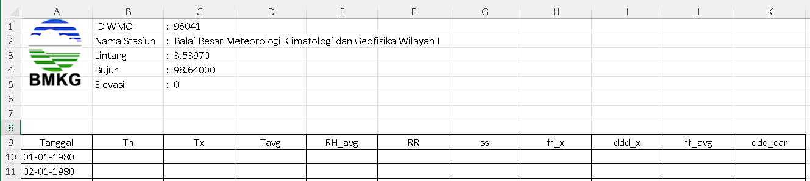
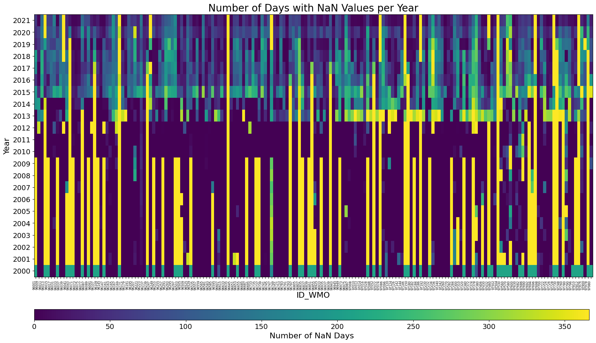
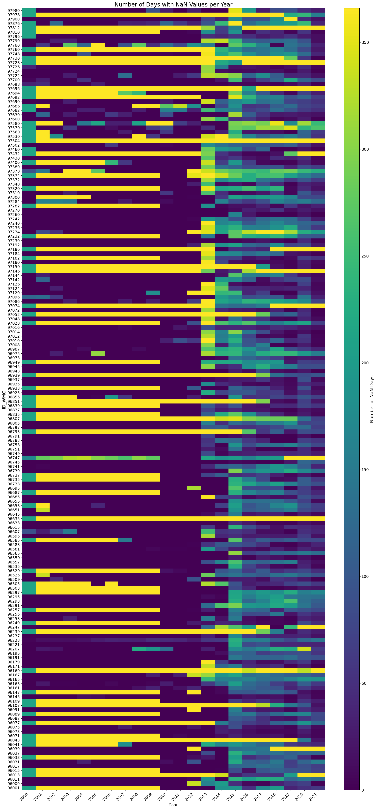
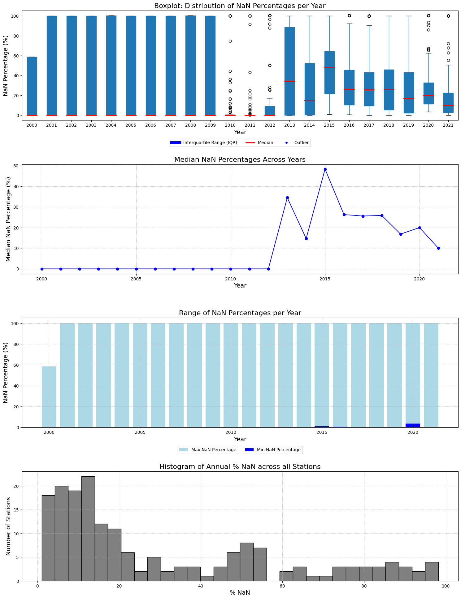
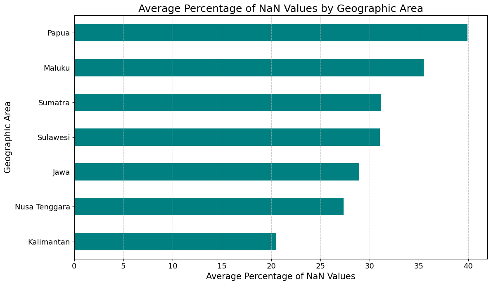
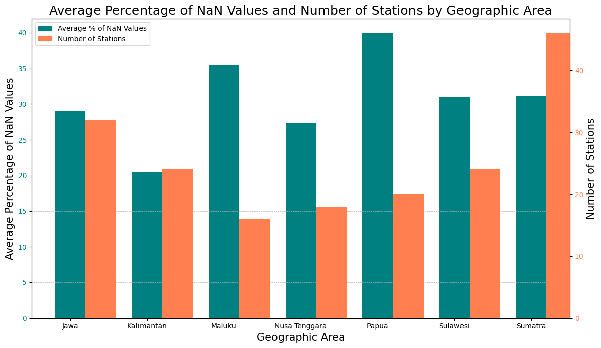
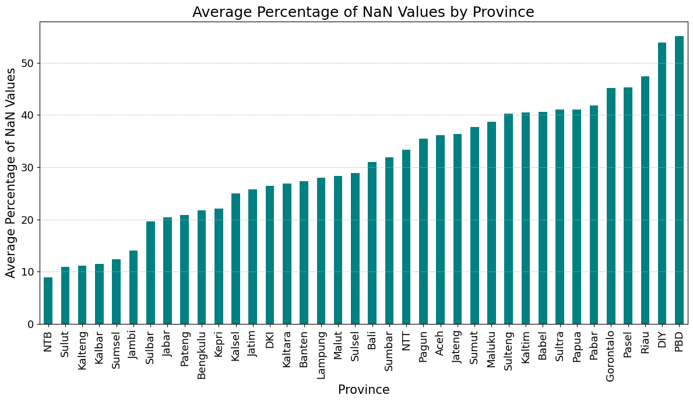
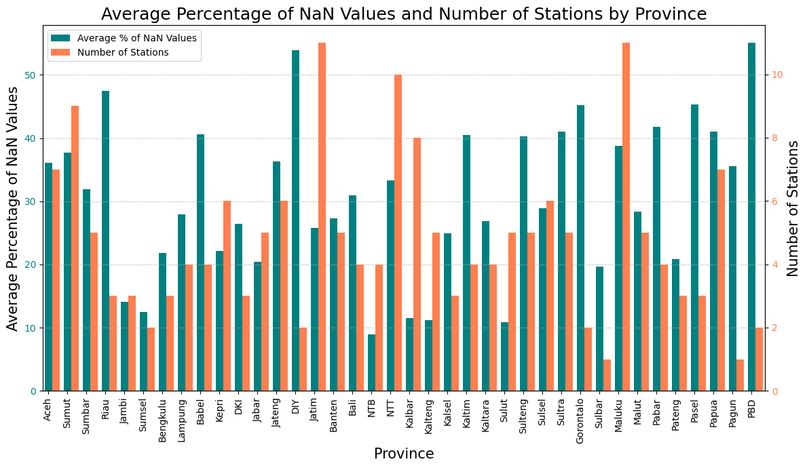

To replicate below code, please download daily climate data from BMKG Data Online <https://dataonline.bmkg.go.id/home>, just a heads up, if you haven't already registered on the portal, you might want to do so. It's a necessary step before you can download any data.

Then go to Climate Data > Daily Data, choose the Station Type, Parameter, Province, Regency, Station Name and the Date Period and click Process button. You will get the data in \*.xlsx format.

You can get one of the data example from this link: <https://docs.google.com/spreadsheets/d/1xbBWeHhiMNs8IehHbsrMV9yeZlcu8GqR/edit?usp=sharing&ouid=104182606454912191559&rtpof=true&sd=true>

In above example, I tried to get daily precipitation data for all station from 1 Jun 2000 - 31 Dec 2021. I would like to use it to correct the value and distribution of daily [IMERG](https://gpm.nasa.gov/data/imerg) data using a bias correction method that currently I have develop.

### How the file is laid out

The xlsx is a bit unconventional for a spreadsheet. The values for ID WMO, Nama Stasiun, Lintang and the rest are in the header names themselves, not in the cells under those headers. The daily table starts further down, with its own header on row 9.



So every file has to be read twice: once as-is to reach the header text, and once with `skiprows=8` to reach the daily values.

### Extract the station information

Around 180 xlsx files, one station per file. First pull the station metadata out of each and compile it into a single csv. `ID_WMO` comes from the third column header, and the station name, latitude, longitude and elevation come from the first four rows of that same column, each sitting after a colon.

::: {.callout-note collapse="true" title="Python - extract station metadata from ~180 xlsx files"}
```python
import pandas as pd
import os
import re
from tqdm import tqdm

# Function to extract data after the colon
def get_data_after_colon(cell_value):
    match = re.search(r':\s+(.*)', str(cell_value))
    if match:
        return match.group(1).strip()
    else:
        return str(cell_value).strip()

# Function to extract only numeric characters
def get_only_numbers(cell_value):
    return ''.join(re.findall(r'\d+', str(cell_value)))

# Directory containing the .xlsx files
folder_path = './input/BMKG/'

# Get a list of all xlsx files in the directory
xlsx_files = [f for f in os.listdir(folder_path) if f.endswith('.xlsx')]

all_data = []

# Loop through each file and extract data
for file in tqdm(xlsx_files, desc="Processing files"):
    try:
        # Load the spreadsheet
        xls = pd.ExcelFile(folder_path + file)
        sheet = xls.parse(xls.sheet_names[0])

        # Extract data
        ID_WMO = get_only_numbers(sheet.columns[2])  # From column header
        Station = get_data_after_colon(sheet.iloc[0, 2])
        Lat = float(get_data_after_colon(sheet.iloc[1, 2]))
        Lon = float(get_data_after_colon(sheet.iloc[2, 2]))
        Elevation = float(get_data_after_colon(sheet.iloc[3, 2]))

        all_data.append([ID_WMO, Station, Lon, Lat, Elevation])
    except Exception as e:
        print(f"Error processing file {file}: {e}")

# Convert to dataframe
df = pd.DataFrame(all_data, columns=['ID_WMO', 'Station', 'Lon', 'Lat', 'Elevation'])

# Sort by ID_WMO
df = df.sort_values(by=['ID_WMO'])

# Add ID column as index
df = df.reset_index(drop=True)
df['ID'] = df.index + 1

# Reorder columns
df = df[['ID', 'ID_WMO', 'Station', 'Lon', 'Lat', 'Elevation']]

# Save to csv
df.to_csv('./output/idn_cli_weatherstation_location_bmkg.csv', index=False)

# Preview the output
df
```
:::

With the coordinates in one table it is easy to plot the stations and check the spatial spread across the country.

::: {.callout-note collapse="true" title="Python - plot the station locations"}
```python
import pandas as pd
import matplotlib.pyplot as plt
from mpl_toolkits.basemap import Basemap

# Load the CSV data
df = pd.read_csv('./output/idn_cli_weatherstation_location_bmkg.csv')

# Initialize a new map
fig, ax = plt.subplots(figsize=(10,15))
m = Basemap(resolution='i', projection='merc', llcrnrlat=-11, urcrnrlat=6, llcrnrlon=95, urcrnrlon=141, ax=ax)
m.drawcoastlines()
m.drawcountries()
m.drawmapboundary(fill_color='white')  # Set sea color to white
m.fillcontinents(color='grey',lake_color='white')  # Set land color to grey

# Plot each weather station on the map
for _, row in df.iterrows():
    x, y = m(row['Lon'], row['Lat'])
    m.plot(x, y, 'ro', markersize=5)  # Change marker to red
    #plt.text(x, y, row['ID_WMO'], fontsize=9)

# Save the map as a PNG
plt.savefig('./output/idn_cli_weatherstation_map_bmkg.png', dpi=300)

# Show the map
plt.show()
```
:::

### Extract the rainfall

Next the daily values, in this case RR (rainfall). The target shape is long format with one row per date and one column per station: ID, Date, Julian Date, then ID_WMO(1), ID_WMO(2) up to ID_WMO(n).

The date filter in the code below is 1 January 2001 rather than 1 June 2000, so the first half-year of the download is dropped. Change the comparison date if you want to keep it.

::: {.callout-note collapse="true" title="Python - extract daily rainfall and pivot by station"}
```python
import pandas as pd
import os
from tqdm import tqdm

# Function to convert a date in DD-MM-YYYY format to its Julian date
def to_julian_date(date_string):
    try:
        date_obj = pd.to_datetime(date_string, format='%d-%m-%Y')
        return int(date_obj.strftime('%j'))
    except:
        return None

# Directory containing the .xlsx files
folder_path = './input/BMKG/'

# Get a list of all xlsx files in the directory
xlsx_files = [f for f in os.listdir(folder_path) if f.endswith('.xlsx')]

# Dictionary to store the data
data_dict = {"ID": [], "Date": [], "JD": []}

# Loop through each file and extract data
for file in tqdm(xlsx_files, desc="Processing files"):
    try:
        # Load the spreadsheet
        xls = pd.ExcelFile(folder_path + file)
        sheet = xls.parse(xls.sheet_names[0], skiprows=8)  # Start reading from row 9

        # Extract ID_WMO value from column C1
        ID_WMO = ''.join(filter(str.isdigit, xls.parse(xls.sheet_names[0]).columns[2]))

        # Check and initialize ID_WMO in data_dict if not already present
        if ID_WMO not in data_dict:
            data_dict[ID_WMO] = [None for _ in range(len(data_dict['ID']))]

        # Loop through each row in the sheet starting from the 10th row
        for index, row in sheet.iterrows():
            date_string = row['Tanggal']

            # Check if date_string is empty, and if so, break out of the loop for this sheet
            if pd.isna(date_string):
                break

            # Check if the date is 01-01-2001 or later
            if pd.to_datetime(date_string, format='%d-%m-%Y') >= pd.to_datetime('01-01-2001', format='%d-%m-%Y'):
                julian_date = to_julian_date(date_string)
                rr_value = row['RR']

                # If date_string is new, append to data_dict
                if date_string not in data_dict["Date"]:
                    data_dict["ID"].append(index + 1)
                    data_dict["Date"].append(date_string)
                    data_dict["JD"].append(julian_date)
                    for key in data_dict:
                        if key not in ["ID", "Date", "JD"]:
                            data_dict[key].append(None)  # Add None for other ID_WMOs

                # Update the RR value for the current ID_WMO
                idx = data_dict["Date"].index(date_string)
                data_dict[ID_WMO][idx] = rr_value

    except Exception as e:
        print(f"Error processing file {file}: {e}")

# Convert data dictionary to dataframe
df = pd.DataFrame(data_dict)

# Save to csv
df.to_csv('./output/idn_cli_weatherstation_data_bmkg.csv', index=False)

# Preview the output
df
```
:::

### Count the missing days

Before using any of this for bias correction, I want to know how much of it is actually there. Group by year and count the NaN per station, which gives one number per station per year: how many days that station did not report.

::: {.callout-note collapse="true" title="Python - annual NaN count per station"}
```python
import pandas as pd

# Load the previously generated CSV file
df = pd.read_csv('./output/idn_cli_weatherstation_data_bmkg.csv')

# Extract the year from the Date column
df['Year'] = pd.to_datetime(df['Date'], format='%d-%m-%Y').dt.year

# Create a dataframe to store annual NaN counts
nan_count_df = df.groupby('Year').apply(lambda x: x.isna().sum()).drop(columns=['ID', 'Date', 'JD', 'Year'])

# Reset the index for the new dataframe
nan_count_df = nan_count_df.reset_index()

# Sort columns by their names (ID_WMO values)
sorted_columns = sorted(nan_count_df.columns[1:], key=lambda x: int(x))  # Convert ID_WMO to integers for sorting
nan_count_df = nan_count_df[['Year'] + sorted_columns]

# Display the result
print(nan_count_df)

# Save the summarized dataframe to CSV
nan_count_df.to_csv('./output/idn_cli_annual_nan_precip_count_summary_bmkg.csv', index=False)
```
:::

### Heat map

One cell per station-year, coloured by the number of missing days. Dark purple is a complete year, yellow is a year with no data at all.



Two patterns show up. Up to 2012, most cells are dark: the stations that were reporting reported nearly every day. What breaks the picture is the vertical yellow stripes, stations that are simply absent for a decade at a time. From 2013 the shape flips. Almost every station is now reporting something, but almost none of them report a full year, so the whole block turns blue and green. 2013 and 2015 are the worst of it.

::: {.callout-note collapse="true" title="Python - heat map, years down the side"}
```python
import pandas as pd
import matplotlib.pyplot as plt
import numpy as np

# Read the csv file
df = pd.read_csv('./output/idn_cli_annual_nan_precip_count_summary_bmkg.csv')

# Set the 'Year' column as the index
df.set_index('Year', inplace=True)

# Check and drop the 'ID' column if it exists
if 'ID' in df.columns:
    df.drop('ID', axis=1, inplace=True)

# Sort the DataFrame by its index (Year)
df = df.sort_index()

# Generate the heatmap again using only matplotlib and avoid using tight_layout()
fig, ax = plt.subplots(figsize=(20, 10))

# Plot heatmap using pcolormesh
cax = ax.pcolormesh(df, cmap="viridis", shading="auto")

# Adjusting position of the colorbar to be further below the x-axis label and displayed horizontally
cbar_ax = fig.add_axes([0.125, 0.03, 0.77, 0.03])  # [left, bottom, width, height]
cbar = fig.colorbar(cax, cax=cbar_ax, orientation='horizontal')
cbar.ax.tick_params(labelsize=14)  # Font size for colorbar tick labels
cbar.set_label('Number of NaN Days', size=16)  # Font size for colorbar label

# Set x-axis labels to be the columns of df (i.e., ID_WMO values)
ax.set_xticks(np.arange(len(df.columns)) + 0.5)
ax.set_xticklabels(df.columns, rotation=90, ha='right', fontsize=6)  # Font size for x-axis labels

# Set y-axis labels to be the index of df (i.e., years)
ax.set_yticks(np.arange(len(df.index)) + 0.5)
ax.set_yticklabels(df.index, fontsize=14)  # Font size for y-axis labels

# Set title and x/y axis labels with specified font sizes
ax.set_title("Number of Days with NaN Values per Year", fontsize=20)
ax.set_xlabel("ID_WMO", fontsize=16)
ax.set_ylabel("Year", fontsize=16)

# Adjust layout using subplots_adjust
plt.subplots_adjust(bottom=0.15)

plt.show()
```
:::

Transposing it puts one station per row, which is the version to use if you are chasing a particular station rather than a particular year.

::: {.callout-note collapse="true" title="Python - heat map, stations down the side"}
```python
import pandas as pd
import matplotlib.pyplot as plt
import numpy as np

# Read the csv file
df = pd.read_csv('./output/idn_cli_annual_nan_precip_count_summary_bmkg.csv')

# Set the 'Year' column as the index
df.set_index('Year', inplace=True)

# Check and drop the 'ID' column if it exists
if 'ID' in df.columns:
    df.drop('ID', axis=1, inplace=True)

# Transpose the DataFrame
df = df.transpose()

# Sort the DataFrame by its index (ID_WMO)
df = df.sort_index()

# Generate the heatmap using only matplotlib
fig, ax = plt.subplots(figsize=(20, 40))

# Plot heatmap using pcolormesh
cax = ax.pcolormesh(df, cmap="viridis", shading="auto")

# Create a colorbar and adjust its height
cbar = fig.colorbar(cax, ax=ax, aspect=50)
cbar.ax.tick_params(labelsize=14)  # Font size for colorbar tick labels
cbar.set_label('Number of NaN Days', size=16)  # Font size for colorbar label

# Set x-axis labels to be the columns of df (i.e., years)
ax.set_xticks(np.arange(len(df.columns)) + 0.5)
ax.set_xticklabels(df.columns, rotation=45, ha='right', fontsize=14)  # Font size for x-axis labels

# Set y-axis labels to be the index of df (i.e., the ID_WMO values)
ax.set_yticks(np.arange(len(df.index)) + 0.5)
ax.set_yticklabels(df.index, fontsize=14)  # Font size for y-axis labels

# Set title and x/y axis labels with specified font sizes
ax.set_title("Number of Days with NaN Values per Year", fontsize=20)
ax.set_xlabel("Year", fontsize=16)
ax.set_ylabel("ID_WMO", fontsize=16)

# Save the map as a PNG
plt.savefig('./output/idn_cli_weatherstation_heatmap_nancount_bmkg.png', dpi=300)

plt.tight_layout()
plt.show()
```


:::

### Summary per station

Four numbers per station, enough to decide whether to keep it:

1. Annual average number of NaN: how many days, on average, are missing each year.
2. Annual percentage of NaN: the same thing as a share of the year.
3. Average number of NaN across all periods: how often data is missing, aggregated over all years.
4. Percentage of NaN across all periods: the same as a share, over the whole record.

::: {.callout-note collapse="true" title="Python - summary statistics per station"}
```python
import pandas as pd

# Load the data
df = pd.read_csv('./output/idn_cli_annual_nan_precip_count_summary_bmkg.csv')

# Extract the year from the dataframe
df.set_index('Year', inplace=True)

# Calculate metrics
total_days_per_year = 365.25  # accounting for leap years
total_years = len(df.index)

# Calculations
annual_avg_nan = df.mean()
annual_percentage_nan = (annual_avg_nan / total_days_per_year) * 100
avg_nan_all_periods = df.sum() / total_years
percentage_nan_all_periods = (avg_nan_all_periods / total_days_per_year) * 100

# Combine results into a DataFrame
summary_df = pd.DataFrame({
    'Annual Avg NaN': annual_avg_nan,
    'Annual % NaN': annual_percentage_nan,
    'Avg NaN (All Years)': avg_nan_all_periods,
    'Percentage NaN (All Years)': percentage_nan_all_periods
})

# Save to CSV
summary_df.to_csv('./output/idn_cli_nan_summary_per_station.csv', index=True)

# Preview the output
print(summary_df)
```
:::

### Distribution of the gaps

Four plots on the same data. The boxplot gives the spread of missing percentages per year, with the median in red, the interquartile range as the box, and outliers as dots. The line plot follows the median alone across years. The bar plot shows the range each year, light blue for the maximum and dark blue for the minimum. The histogram counts stations by their annual percentage of NaN.



::: {.callout-note collapse="true" title="Python - boxplot, median line, range and histogram"}
```python
# Required Libraries
import pandas as pd
import matplotlib.pyplot as plt

# Load the data
df = pd.read_csv('./output/idn_cli_annual_nan_precip_count_summary_bmkg.csv')

# Melt the dataframe to long format
df_melted = df.melt(id_vars=['Year'], var_name='Station', value_name='NaN_Count')

# Calculate percentage of NaN values for each row
df_melted['NaN_Percentage'] = (df_melted['NaN_Count'] / 365) * 100  # Considering non-leap year for simplicity

# Calculate descriptive statistics for each year
desc_stats = df_melted.groupby('Year')['NaN_Percentage'].describe()

# Compute the "Annual % NaN" for each station across all years
annual_percentage_nan_per_station = (df.drop(columns='Year').mean(axis=0) / 365) * 100

# Set up the figure and axes again
fig, ax = plt.subplots(nrows=4, ncols=1, figsize=(15, 20))

# 1. Boxplot for distribution of NaN percentages per year
bp = df_melted.boxplot(column='NaN_Percentage', by='Year', ax=ax[0], grid=False, patch_artist=True, return_type='dict')
for median in bp['NaN_Percentage']['medians']:
    median.set(color='red', linewidth=2)
ax[0].set_title("Boxplot: Distribution of NaN Percentages per Year", fontsize=16)
ax[0].set_xlabel("Year", fontsize=14)
ax[0].set_ylabel("NaN Percentage (%)", fontsize=14)
box_patch = plt.Line2D([0], [0], color='blue', linewidth=6, label='Interquartile Range (IQR)')
median_patch = plt.Line2D([0], [0], color='red', linewidth=2, label='Median')
outlier_patch = plt.Line2D([0], [0], marker='o', color='w', markerfacecolor='blue', markersize=6, label='Outlier', linestyle='None')
ax[0].legend(handles=[box_patch, median_patch, outlier_patch], loc='upper center', bbox_to_anchor=(0.5, -0.15), ncol=3)

# 2. Line plot for median NaN percentages across years
ax[1].plot(desc_stats.index, desc_stats['50%'], marker='o', color='blue', linestyle='-')
ax[1].set_title("Median NaN Percentages Across Years", fontsize=16)
ax[1].set_xlabel("Year", fontsize=14)
ax[1].set_ylabel("Median NaN Percentage (%)", fontsize=14)
ax[1].grid(True, which='both', linestyle='--', linewidth=0.5)

# 3. Bar plot to show the range of NaN percentages for each year
ax[2].bar(desc_stats.index, desc_stats['max'], color='lightblue', label='Max NaN Percentage')
ax[2].bar(desc_stats.index, desc_stats['min'], color='blue', label='Min NaN Percentage')
ax[2].set_title("Range of NaN Percentages per Year", fontsize=16)
ax[2].set_xlabel("Year", fontsize=14)
ax[2].set_ylabel("NaN Percentage (%)", fontsize=14)
ax[2].legend(loc='upper center', bbox_to_anchor=(0.5, -0.15), ncol=2)
ax[2].grid(True, which='both', linestyle='--', linewidth=0.5)

# 4. Histogram for "Annual % NaN" across stations
annual_percentage_nan_per_station.hist(bins=30, ax=ax[3], color='gray', edgecolor='black')
ax[3].set_title("Histogram of Annual % NaN across all Stations", fontsize=16)
ax[3].set_xlabel("% NaN", fontsize=14)
ax[3].set_ylabel("Number of Stations", fontsize=14)
ax[3].grid(True, which='both', linestyle='--', linewidth=0.5)

# Adjust layout
plt.tight_layout()
plt.subplots_adjust(top=0.95, hspace=0.4)
plt.suptitle('')  # Remove the default title generated by boxplot
plt.savefig('./output/idn_cli_bmkg_dailyprecip_statsdesc_2000_2021.png')
plt.show()
```
:::

Reading them together:

- The minimum is 0% in every year, so there is always at least one station with a complete record. The maximum reaches 100% from 2001 to 2021, so there is also always at least one station with nothing at all.
- 2015 has the highest median at about 48.36%. The year 2000 has the lowest at 0%, meaning more than half the stations that year were complete.
- Between 2000 and 2009 the boxes run the full height of the chart. A station in that period is usually either complete or entirely absent, with little in between.
- From 2013 the median climbs and the boxes shrink, which is the partial-reporting pattern showing up. It peaks in 2015 and drifts down after that, but the spread between stations stays wide.

### The numbers

Some figures worth keeping:

- The overall missing rate across all stations and years is about **30.32%**.
- The worst year is 2015 at about 46.39% missing on average, the best is 2011 at about 15.33%.
- The worst station is 96635, missing about 98.18% of its record. The best is 97230, missing about 1.07%.
- The overall median is about **7.12%**.

The gap between the 30.32% mean and the 7.12% median is the whole story. A typical station is fine. The average is being dragged up by a set of stations that barely report at all.

That set is large enough to matter:

| Stations missing less than | Share of all stations |
|:---|---:|
| 5% of days per year | 12.15% |
| 10% | 29.83% |
| 25% | 60.22% |
| 50% | 73.48% |
| 75% | 80.74% |

Only about one station in eight is good enough to use without gap-filling, and close to one in five is missing more than three quarters of its record.

::: {.callout-note collapse="true" title="Python - overall statistics"}
```python
# Required Libraries
import pandas as pd
import matplotlib.pyplot as plt

# Reload the data and preprocess it again
df = pd.read_csv('./output/idn_cli_annual_nan_precip_count_summary_bmkg.csv')

# Melt the dataframe to long format
df_melted = df.melt(id_vars=['Year'], var_name='Station', value_name='NaN_Count')

# Calculate percentage of NaN values for each row
df_melted['NaN_Percentage'] = (df_melted['NaN_Count'] / 365) * 100  # Considering non-leap year for simplicity

# 1. Overall Average of NaN Percentages Across All Years and Stations
overall_avg_nan_percentage = df_melted['NaN_Percentage'].mean()

# 2. Year with the Highest Average NaN Percentage Across Stations
year_max_avg_nan = df_melted.groupby('Year')['NaN_Percentage'].mean().idxmax()
max_avg_nan = df_melted.groupby('Year')['NaN_Percentage'].mean().max()

# 3. Year with the Lowest Average NaN Percentage Across Stations
year_min_avg_nan = df_melted.groupby('Year')['NaN_Percentage'].mean().idxmin()
min_avg_nan = df_melted.groupby('Year')['NaN_Percentage'].mean().min()

# 4. Station with the Highest Average NaN Percentage Across All Years
station_max_avg_nan = (df.drop(columns='Year').mean(axis=0) / 365 * 100).idxmax()
max_avg_nan_station = (df.drop(columns='Year').mean(axis=0) / 365 * 100).max()

# 5. Station with the Lowest Average NaN Percentage Across All Years
station_min_avg_nan = (df.drop(columns='Year').mean(axis=0) / 365 * 100).idxmin()
min_avg_nan_station = (df.drop(columns='Year').mean(axis=0) / 365 * 100).min()

# 6. Overall Median of NaN Percentages Across All Years and Stations
overall_median_nan_percentage = df_melted['NaN_Percentage'].median()

# 7. Percentage of Stations with Less than 5% NaN Values Annually
stations_below_5_percent = ((df.drop(columns='Year').mean(axis=0) / 365 * 100) < 5).sum()
percentage_stations_below_5 = (stations_below_5_percent / df.shape[1]) * 100  # excluding the 'Year' column

# 8. Percentage of Stations with less than 10% NaN Values Annually
stations_below_10_percent = ((df.drop(columns='Year').mean(axis=0) / 365 * 100) < 10).sum()
percentage_stations_below_10 = (stations_below_10_percent / df.shape[1]) * 100  # excluding the 'Year' column

# 9. Percentage of Stations with less than 25% NaN Values Annually
stations_below_25_percent = ((df.drop(columns='Year').mean(axis=0) / 365 * 100) < 25).sum()
percentage_stations_below_25 = (stations_below_25_percent / df.shape[1]) * 100

# 10. Percentage of Stations with less than 50% NaN Values Annually
stations_below_50_percent = ((df.drop(columns='Year').mean(axis=0) / 365 * 100) < 50).sum()
percentage_stations_below_50 = (stations_below_50_percent / df.shape[1]) * 100

# 11. Percentage of Stations with less than 75% NaN Values Annually
stations_below_75_percent = ((df.drop(columns='Year').mean(axis=0) / 365 * 100) < 75).sum()
percentage_stations_below_75 = (stations_below_75_percent / df.shape[1]) * 100

overall_avg_nan_percentage, (year_max_avg_nan, max_avg_nan), (year_min_avg_nan, min_avg_nan), (station_max_avg_nan, max_avg_nan_station), (station_min_avg_nan, min_avg_nan_station), overall_median_nan_percentage, percentage_stations_below_5, percentage_stations_below_10, percentage_stations_below_25, percentage_stations_below_50, percentage_stations_below_75
```
:::

### Where the gaps are

The last question is whether the gaps sit anywhere in particular. Joining the per-station percentages back to the location table and grouping by island group and by province answers that.

The location csv used below has three extra columns that the extraction code does not produce: `geoareas` for the island group, and `a1short` and `a1c_bps` for the province name and its BPS code. I added those afterwards by joining the station coordinates against the province boundaries.



Papua is worst at about 40% and Kalimantan best at about 20.5%, but the whole range is only twenty points wide. Every island group is missing between a fifth and two fifths of its data, so this is not a problem confined to the east.



Station count does not explain it either. Sumatra has the most stations at around 47 and still sits at 31%, while Maluku has the fewest at around 16 and sits at 35.5%.

::: {.callout-note collapse="true" title="Python - missing data by island group"}
```python
# Required Libraries
import pandas as pd
import matplotlib.pyplot as plt

# Load the NaN summary data
nan_summary_df = pd.read_csv('./output/idn_cli_annual_nan_precip_count_summary_bmkg.csv')

# Load the station location data
location_df = pd.read_csv('./output/idn_cli_weatherstation_location_bmkg.csv')

# Exclude the 'Year' from the calculations
nan_df_without_year = nan_summary_df.drop(columns=["Year"])

# Calculate the overall mean percentage of NaN values for each station across all years
overall_mean_percentage = ((nan_df_without_year.mean(axis=0) / 365) * 100).reset_index()
overall_mean_percentage.columns = ['ID_WMO', 'NaN_Percentage']
overall_mean_percentage['ID_WMO'] = overall_mean_percentage['ID_WMO'].astype(int)

# Merge with location data to get the geoareas information
merged_df = overall_mean_percentage.merge(location_df[['ID_WMO', 'geoareas']], on='ID_WMO', how='left')

# Group by geoareas and calculate the mean percentage
grouped_df = merged_df.groupby('geoareas').mean().reset_index()

# Visualization
plt.figure(figsize=(12, 7))
grouped_df.sort_values(by="NaN_Percentage").set_index('geoareas')['NaN_Percentage'].plot(kind='barh', color='teal')
plt.title('Average Percentage of NaN Values by Geographic Area', fontsize=18)
plt.xlabel('Average Percentage of NaN Values', fontsize=15)
plt.ylabel('Geographic Area', fontsize=15)
plt.xticks(fontsize=13)
plt.yticks(fontsize=13)
plt.grid(axis='x', linestyle='--', linewidth=0.5)
plt.tight_layout()
plt.show()
```
:::

::: {.callout-note collapse="true" title="Python - missing data and station count by island group"}
```python
import pandas as pd
import matplotlib.pyplot as plt

# Load the NaN summary data
nan_summary_df = pd.read_csv('./output/idn_cli_annual_nan_precip_count_summary_bmkg.csv')

# Load the station location data
location_df = pd.read_csv('./output/idn_cli_weatherstation_location_bmkg.csv')

# Exclude the 'Year' from the calculations
nan_df_without_year = nan_summary_df.drop(columns=["Year"])

# Calculate the overall mean percentage of NaN values for each station across all years
overall_mean_percentage = ((nan_df_without_year.mean(axis=0) / 365) * 100).reset_index()
overall_mean_percentage.columns = ['ID_WMO', 'NaN_Percentage']
overall_mean_percentage['ID_WMO'] = overall_mean_percentage['ID_WMO'].astype(int)

# Merge with location data to get the geoareas information
merged_df = overall_mean_percentage.merge(location_df[['ID_WMO', 'geoareas']], on='ID_WMO', how='left')

# Group by geoareas and calculate the mean percentage
grouped_df = merged_df.groupby('geoareas').mean().reset_index()

# Count the number of stations per geoareas
station_count = merged_df.groupby('geoareas')['ID_WMO'].count().reset_index()
station_count.columns = ['geoareas', 'Station_Count']

# Merge the mean percentage dataframe with the station count dataframe
final_df = pd.merge(grouped_df, station_count, on='geoareas')

# Visualization
fig, ax1 = plt.subplots(figsize=(12, 7))

# Plotting NaN Percentage as primary bars
bar_width = 0.4
positions = range(len(final_df))
ax1.bar(positions, final_df['NaN_Percentage'], width=bar_width, color='teal', label='Average % of NaN Values')
ax1.set_title('Average Percentage of NaN Values and Number of Stations by Geographic Area', fontsize=18)
ax1.set_ylabel('Average Percentage of NaN Values', fontsize=15)
ax1.set_xlabel('Geographic Area', fontsize=15)
ax1.set_xticks(positions)
ax1.set_xticklabels(final_df['geoareas'], rotation=0)
ax1.tick_params(axis='y', labelcolor='teal')
ax1.grid(axis='y', linestyle='--', linewidth=0.5)

# Adjusting the x-axis limits to remove the blank space
ax1.set_xlim(-0.5, len(final_df) - 0.5)

# Creating a secondary y-axis for Station_Count
ax2 = ax1.twinx()
ax2.bar([p + bar_width for p in positions], final_df['Station_Count'], width=bar_width, color='coral', label='Number of Stations')
ax2.set_ylabel('Number of Stations', fontsize=15)
ax2.tick_params(axis='y', labelcolor='coral')

# Setting up the legend
lines, labels = ax1.get_legend_handles_labels()
lines2, labels2 = ax2.get_legend_handles_labels()
ax2.legend(lines + lines2, labels + labels2, loc='upper left')

plt.tight_layout()
plt.show()
```
:::

Dropping to province level spreads things out more, from about 9% in NTB to about 55% in Papua Barat Daya.



The ends of that range need care. Plotting the station count alongside shows that the worst provinces, Papua Barat Daya and DIY, have only one or two stations each, so a single bad station sets the whole province average. The provinces with ten or eleven stations all land in the middle of the range.



::: {.callout-note collapse="true" title="Python - missing data by province"}
```python
import pandas as pd
import matplotlib.pyplot as plt

# Load the NaN summary data
nan_summary_df = pd.read_csv('./output/idn_cli_annual_nan_precip_count_summary_bmkg.csv')

# Load the station location data
location_df = pd.read_csv('./output/idn_cli_weatherstation_location_bmkg.csv')

# Exclude the 'Year' from the calculations
nan_df_without_year = nan_summary_df.drop(columns=["Year"])

# Calculate the overall mean percentage of NaN values for each station across all years
overall_mean_percentage = ((nan_df_without_year.mean(axis=0) / 365) * 100).reset_index()
overall_mean_percentage.columns = ['ID_WMO', 'NaN_Percentage']
overall_mean_percentage['ID_WMO'] = overall_mean_percentage['ID_WMO'].astype(int)

# Merge with location data to get the a1short information
merged_df = overall_mean_percentage.merge(location_df[['ID_WMO', 'a1short']], on='ID_WMO', how='left')

# Group by a1short and calculate the mean percentage
grouped_df = merged_df.groupby('a1short').mean().reset_index()

# Visualization
plt.figure(figsize=(12, 7))
grouped_df.sort_values(by="NaN_Percentage").set_index('a1short')['NaN_Percentage'].plot(kind='bar', color='teal')
plt.title('Average Percentage of NaN Values by Province', fontsize=18)
plt.ylabel('Average Percentage of NaN Values', fontsize=15)
plt.xlabel('Province', fontsize=15)
plt.yticks(fontsize=13)
plt.xticks(rotation=90, fontsize=13)
plt.grid(axis='y', linestyle='--', linewidth=0.5)
plt.tight_layout()
plt.show()
```
:::

::: {.callout-note collapse="true" title="Python - missing data and station count by province"}
```python
import pandas as pd
import matplotlib.pyplot as plt

# Load the NaN summary data
nan_summary_df = pd.read_csv('./output/idn_cli_annual_nan_precip_count_summary_bmkg.csv')

# Load the station location data
location_df = pd.read_csv('./output/idn_cli_weatherstation_location_bmkg.csv')

# Exclude the 'Year' from the calculations
nan_df_without_year = nan_summary_df.drop(columns=["Year"])

# Calculate the overall mean percentage of NaN values for each station across all years
overall_mean_percentage = ((nan_df_without_year.mean(axis=0) / 365) * 100).reset_index()
overall_mean_percentage.columns = ['ID_WMO', 'NaN_Percentage']
overall_mean_percentage['ID_WMO'] = overall_mean_percentage['ID_WMO'].astype(int)

# Merge with location data to get the 'a1short' and 'a1c_bps' information
merged_df = overall_mean_percentage.merge(location_df[['ID_WMO', 'a1short', 'a1c_bps']], on='ID_WMO', how='left')

# Group by 'a1short' and calculate the mean percentage and count of stations
grouped_df = merged_df.groupby('a1short').agg({'NaN_Percentage': 'mean', 'ID_WMO': 'size'}).reset_index()
grouped_df.rename(columns={'ID_WMO': 'Station_Count'}, inplace=True)

# Sort merged_df based on 'a1c_bps'
final_df = grouped_df.merge(location_df[['a1short', 'a1c_bps']], on='a1short', how='left').drop_duplicates().sort_values(by='a1c_bps')

# Visualization
fig, ax1 = plt.subplots(figsize=(12, 7))

# Plotting NaN Percentage as primary bars
bar_width = 0.4
positions = range(len(final_df))
ax1.bar(positions, final_df['NaN_Percentage'], width=bar_width, color='teal', label='Average % of NaN Values')
ax1.set_title('Average Percentage of NaN Values and Number of Stations by Province', fontsize=18)
ax1.set_ylabel('Average Percentage of NaN Values', fontsize=15)
ax1.set_xlabel('Province', fontsize=15)
ax1.set_xticks(positions)
ax1.set_xticklabels(final_df['a1short'], rotation=90)
ax1.tick_params(axis='y', labelcolor='teal')
ax1.grid(axis='y', linestyle='--', linewidth=0.5)

# Adjusting the x-axis limits to remove the blank space
ax1.set_xlim(-0.3, len(final_df) - 0.3)

# Creating a secondary y-axis for Station_Count
ax2 = ax1.twinx()
ax2.bar([p + bar_width for p in positions], final_df['Station_Count'], width=bar_width, color='coral', label='Number of Stations')
ax2.set_ylabel('Number of Stations', fontsize=15)
ax2.tick_params(axis='y', labelcolor='coral')

# Setting up the legend
lines, labels = ax1.get_legend_handles_labels()
lines2, labels2 = ax2.get_legend_handles_labels()
ax2.legend(lines + lines2, labels + labels2, loc='upper left')

plt.tight_layout()
plt.show()
```
:::

### So

Unfortunately, too many missing value. Bias correction needs a long, continuous daily record to fit against, and only about 12% of these stations can supply one.

I should find alternative daily timeseries precipitation data, probably gridded data will suit my objectives.
