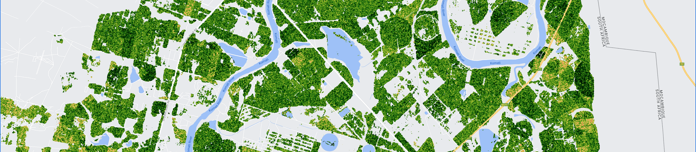
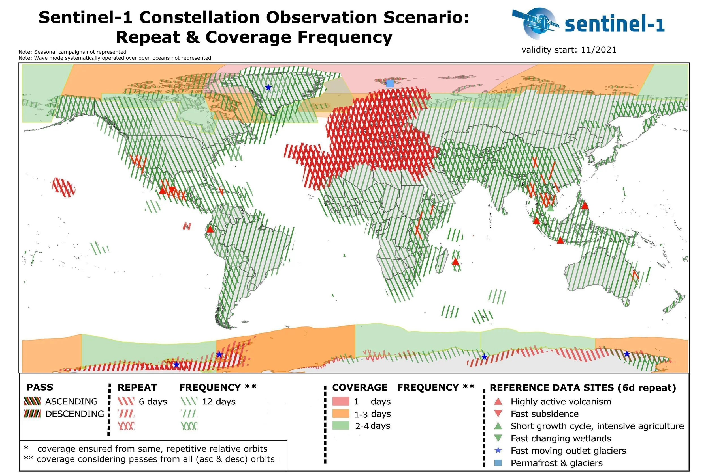
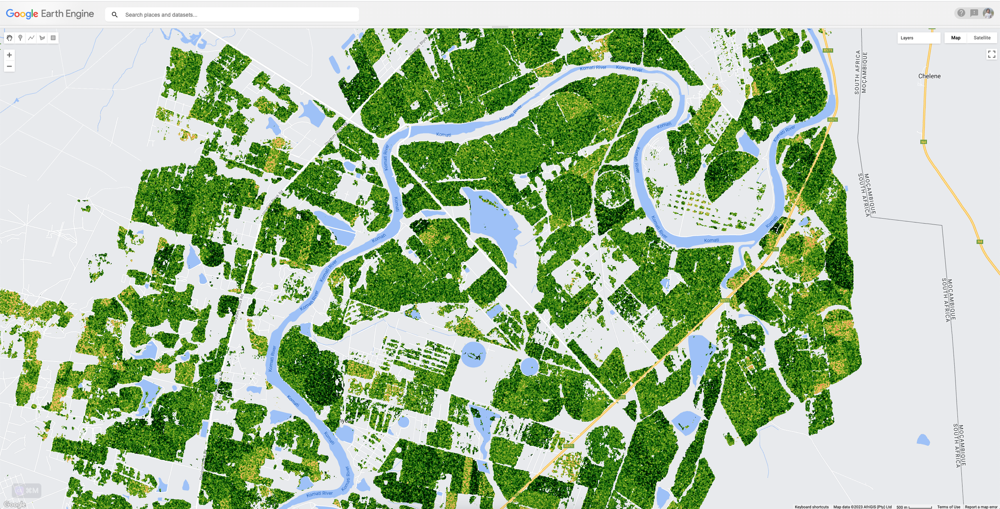

Few months ago, I wrote a [post](/blog/20230614-sentinel-1-modified-radar-vegetation-index) about how to calculate The modified Radar Vegetation Index (mRVI) using Sentinel-1 satellite. It was try to extract the mRVI every Dekad with study case is Ukraine.

For areas in Europe, getting the S1 data every dekad is doable, but it’s bit tricky for area outside Europe. Currently, for my work, I would like to extract the mRVI for [Mpumalanga](https://en.wikipedia.org/wiki/Mpumalanga) province in South Africa. The location is near -25.5 S, then according to below picture the revisit time is every 12 days.

[](https://sentinel.esa.int/documents/247904/4748961/Sentinel-1-Repeat-Coverage-Frequency-Geometry-2021.jpg)

Getting monthly mosaic mRVI seems possible for case in South Africa, as if I keep the dekad, some of them will return an empty collection.

So, I need to modify the existing code to get the monthly list, calculate monthly mosaics, calculate monthly mean and the ratio anomaly

Full GEE code is here: <https://code.earthengine.google.com/aea00cb8f3f1ccc921d5f6698b5c0c5a>



::: {.callout-note collapse="true" title="Javascript - GEE script for Monthly mosaic of modified RVI"}
```js
/*
 * Sentinel-1 modified RADAR VEGETATION INDEX (mRVI)
 *
 * Within this script, SAR Sentinel-1 is being used to generate a vegetation index maps
 * using the mRVI approach defined in Çolak et al.(2021) with doi  
 * 10.5194/isprs-archives-xliii-b3-2021-701-2021. We have selected this one as it has shown to 
 * provide more similar information to the MODIS NDVI data.
 * 
 * We create mRVI nation-wide composites from both ascending and descending orbits together a
 * it has shown to provide better results on successive steps. The final maps are masked using
 * the ESA WorldCover map to generate only the mRVI index over crop areas, and finally rescaled
 * by a factor of 10000 to convert it into UInt16 (lighter than float)
 * 
 * Originally created by Jose Manuel Delgado Blasco, as part of GOST support to UKR activities
 * - https://github.com/worldbank/GOST_SAR/tree/master/Radar_Vegetation_Index
 * - https://code.earthengine.google.com/2b3eff8d77e245c0ba67c3dd127ec6e9
 * mRVI will use by GOST to monitor the crop phenology: Start of Season, End of Season, etc
 * the phenological analysis will use TIMESAT software for smoothing using Savitsky-Golay and
 * extract the seasonality parameters
 * 
 * Contact: Benny Istanto. Climate Geographer - GOST/DECAT/DECDG, The World Bank
 * related to the use of mRVI for crop growing stage monitoring
 * 
 * Changelog:
 * 2022-07-05 last commit by JMDB at GOST_SAR repository
 * 2023-06-14 Add function to get list images within dekad calendar, mosaic the result
 *            Batch downloading using JavaScript console (useful if you have hundred images)
 * 2023-08-24 Modify to get monthly list, as most of the country outside Europe has >10days
 *            revisit time, on dekad list will produce empty collection.
 *        .   Calculate the long-term Mean and the anomaly
 * ------------------------------------------------------------------------------
 */
 
/*
                    SELECT YOUR OWN STUDY AREA   

The user can :
1) select a full country by changing the countryname variable or;
2) use the polygon-tool in the top left corner of the map pane to draw the shape of your 
   study area. Single clicks add vertices, double-clicking completes the polygon.
   **CAREFUL**: Under 'Geometry Imports' (top left in map panel) uncheck the 
                geometry box, so it does not block the view on the imagery later.
3) load a shapefile stored in the user Assets collection
*/
 
/*
1)  Choose country name
*/
// List of country name: https://en.wikipedia.org/wiki/List_of_FIPS_country_codes
// var countryname='South Africa';
// var countries = ee.FeatureCollection('USDOS/LSIB_SIMPLE/2017');
// var aoi = countries.filter(ee.Filter.eq('country_na', countryname));
// Map.addLayer(aoi,{},'AoI', false);
// Map.centerObject(aoi,7);

/*
2) Use a user defined geometry.
   Uncomment the two lines below if you want to use a defined geometry as AoI 
*/
// var aoi = ee.FeatureCollection(geometry);
// Map.centerObject(aoi,8);

/*
3) Load a shapefile from Assets collection.
   Uncomment and modify the lines below if you want to use a shapefile stored in your assets
*/
// zaf_bnd_adm1 downloaded from HDX https://data.humdata.org/dataset/cod-ab-zaf
// and uploaded as an assets
var assets = ee.FeatureCollection("users/bennyistanto/datasets/shp/bnd/zaf_bnd_adm1");
var adm1 = assets.filter(ee.Filter.eq('ADM1_EN', 'Mpumalanga'));
var aoi = adm1.geometry();
Map.centerObject(aoi,8);


/*
                    SET TIME FRAME

Set start and end dates of a period that you want to generate the mRVI. Make sure it is long enough for 
Sentinel-1 to acquire an image (repitition rate = 6 days). Adjust these parameters, if
your ImageCollections (see Console) do not contain any elements.
*/

// Set the start and end dates to be used as pre-event in YYYY-MM-DD format. Max 1-year periods.
var startDate = ee.Date('2016-01-01');
var endDate = ee.Date('2023-07-31');


/*
  ---->>> DO NOT EDIT THE SCRIPT PAST THIS POINT! (unless you know what you are doing) <<<---
  ------------------>>> now hit the'RUN' at the top of the script! <<<-----------------------
  -----> The final mRVI product will be ready for download on the right (under tasks) <-----
*/

// Creating monthly list from the date range
// Calculate the number of months between startDate and endDate
var numMonths = endDate.difference(startDate, 'month').round();

// Generate a sequence of months from startDate to endDate
var monthSequence = ee.List.sequence(0, numMonths.subtract(1), 1).map(function(month) {
  return startDate.advance(ee.Number(month), 'month');
});

// Function to generate monthly intervals for mosaic
var generateMonthlyIntervals = function(date) {
  date = ee.Date(date);
  var y = date.get('year');
  var m = date.get('month');
  var endOfMonth = date.advance(1, 'month');

  return ee.Dictionary({
    start: date,
    end: endOfMonth
  });
};

// Get the monthly List
var monthlyIntervals = monthSequence.map(generateMonthlyIntervals);
print(monthlyIntervals);

// Auxiliary Variables and Data
// VH polarization is needed to compute the mRVI
var polarization = 'VH';
// Using the ESA WorldCover to mask out urban, water and other non crop areas.
var LULC = ee.ImageCollection("ESA/WorldCover/v200");
// Selecting cropland and herbaceous classes (class with value 40)
var cropland = LULC.mosaic().clip(aoi).eq(40);

// Defining auxiliary functions
// Defining the mRVI formula, based on Agapiou, 2020 - https://doi.org/10.3390/app10144764
var addmRVI = function (img) {
  var mRVI = img
    .select(['VV'])
    .divide(img.select(['VV']).add(img.select(['VH'])))
    .pow(0.5)
    .multiply(
      img
        .select(['VH'])
        .multiply(ee.Image(4))
        .divide(img.select(['VV']).add(img.select(['VH'])))
    )
    .rename('mRVI');
  return img.addBands(mRVI);
};


// Translating User Inputs
// DATA SELECTION & PREPROCESSING
// Load the Sentinel-1 GRD data (linear units) and filter by predefined parameters
var rvi = ee.ImageCollection('COPERNICUS/S1_GRD_FLOAT')
  .filterBounds(aoi)
  .filterDate(startDate, endDate)
  .filter(ee.Filter.eq('instrumentMode','IW'))
  .filter(ee.Filter.listContains('transmitterReceiverPolarisation', polarization))
  .filter(ee.Filter.eq('resolution_meters', 10))
  .map(addmRVI)
  .select('mRVI');

// Sorted time
var rvi_sorted = rvi.sort("system:time_start");
// print(rvi_sorted);


/*
                    MONTHLY COLLECTION

Create the monthly collection based on preferred start and end date, and do the mosaic based on monthly list
Then convert the result into ImageCollection
*/
// Mosaic all images within monthly intervals
var createMonthlyMosaic = function(dict) {
  dict = ee.Dictionary(dict);
  
  // Retrieve the start and end date of the month
  var startOfMonth = dict.get('start');
  var endOfMonth = dict.get('end');
    
  // Filter the images within the month
  var monthlyImages = rvi_sorted.filterDate(ee.Date(startOfMonth), ee.Date(endOfMonth));
  
  // Select the mRVI band from each image
  var mRVIImages = monthlyImages.select('mRVI');
  
  // Calculate the median of the mRVI images
  var medianImage = mRVIImages.reduce(ee.Reducer.median());

  // Return the median image with the month property
  return medianImage.set('month', startOfMonth, 'system:time_start', ee.Date(startOfMonth).millis());
};

// Apply the createMonthlyMosaic function to each month in the monthlyIntervals
var mosaicImages = ee.List(monthlyIntervals.map(createMonthlyMosaic));

// Convert the mosaicImages to an ImageCollection
var mosaicCollection = ee.ImageCollection.fromImages(mosaicImages);


/*
                    LONG-TERM MEAN and ANOMALY

Create the long-term mean based on preferred start and end date, then convert the result into ImageCollection
Calculate the ratio anomaly by comparing the mRVI and the long-term Mean
*/
// Long-term monthly Mean
// Set the start and end date for the long-term period.
var longTermStart = ee.Date('2016-01-01');
var longTermEnd = ee.Date('2022-12-31');

// Create a list to represent months
var months = ee.List.sequence(1, 12);

// Function to compute monthly mean for the long term period
var computeMonthlyMean = function(month) {
  month = ee.Number(month);
  
  // Filter the ImageCollection to get images for a particular month over all years in the long-term period.
  var monthlyImages = rvi_sorted.filter(ee.Filter.calendarRange(month, month, 'month'))
                                .filterDate(longTermStart, longTermEnd);

  // Reduce the images to a median and rename the resulting band
  var monthlyMean = monthlyImages.reduce(ee.Reducer.median()).rename('mRVI_mean');
  
  return monthlyMean.set('month', month);
};

// Calculate monthly means for the long-term period.
var monthlyMeans = months.map(computeMonthlyMean);

// Convert the monthlyMeans to an ImageCollection
var monthlyMeanCollection = ee.ImageCollection.fromImages(monthlyMeans);
print(monthlyMeanCollection);

// Anomaly
// Compute the anomalies using the defined startDate and endDate using the formula Int(100 * mRVI / MEAN_mRVI).
var computeAnomaly = function(image) {
  // Get the month of the image
  var month = ee.Date(image.get('system:time_start')).get('month');
  
  // Get the corresponding monthly mean image.
  var meanImage = monthlyMeanCollection.filterMetadata('month', 'equals', month).first();
  
  // Compute the anomaly using the formula Int(100 * mRVI / MEAN_mRVI)
  var anomaly = image.divide(meanImage).multiply(100).toInt();
  
  // Rename the mRVI_median band to mRVI_anomaly
  anomaly = anomaly.select(['mRVI_median'], ['mRVI_anomaly']);
  
  return anomaly.set('system:time_start', image.get('system:time_start'));
};

// Apply the computeAnomaly function to the images between startDate and endDate in the mosaicCollection.
var anomalies = mosaicCollection.filterDate(startDate, endDate).map(computeAnomaly);


/*
                    FINAL mRVI and ANOMALY

Create the long-term mean based on preferred start and end date, then convert the result into ImageCollection
Calculate the ratio anomaly by comparing the mRVI and the long-term Mean
*/
// Multiply by 10000 and convert imageCollection to Uint16, can help preserve the precision
var toUInt16 = function(img){
  return img.multiply(10000).toUint16().copyProperties(img, ["dekad", "system:time_start"]);
};

// apply mask to imageCollection, get mRVI only in cropland areas
var masking = function(img){
  return img.updateMask(cropland).copyProperties(img, ["dekad", "system:time_start"]);
};

// Apply the toUInt16 function to each image in the mosaicCollection
var monthlyMeanCollectionUInt16 = monthlyMeanCollection.map(toUInt16);

// Apply the toUInt16 function to each image in the mosaicCollection
var mosaicCollectionUInt16 = mosaicCollection.map(toUInt16);

// Apply the masking function to each image in the mosaicCollectionUInt16
var mosaicCollectionMasked = mosaicCollectionUInt16.map(masking);

// Apply the masking function to each image in the mean
var monthlyMeanCollectionMasked = monthlyMeanCollectionUInt16.map(masking);

// Apply the masking function to each image in the anomalies
var anomaliesMasked = anomalies.map(masking);

// Print the masked mosaicCollection
print(mosaicCollectionMasked);
print(anomaliesMasked);


/*
  Visualisation
*/
// Palettes
var palettes = [
    'FFFFFF', 'CE7E45', 'DF923D', 'F1B555', 'FCD163', '99B718', '74A901',
    '66A000', '529400', '3E8601', '207401', '056201', '004C00', '023B01',
    '012E01', '011D01', '011301'
  ];

// Symbology
var rviVis = {min: 0.0, max:8000, palette: palettes};
var anomalyVis = {min: 0.0, max:200, palette: palettes};

// Add as map layer
Map.addLayer(LULC.first().clip(aoi),{bands: ['Map']},'landcover', false);
Map.addLayer(cropland.updateMask(cropland),{min:0,max:1,palette:['black','green']},'cropland', false);
Map.addLayer(monthlyMeanCollection.first().clip(aoi), rviVis, 'mRVI mean', false);
Map.addLayer(monthlyMeanCollectionMasked.first().clip(aoi), rviVis, 'mRVI mean on cropland', true);
Map.addLayer(mosaicCollectionUInt16.first().clip(aoi), rviVis, 'mRVI', false);
Map.addLayer(mosaicCollectionMasked.first().clip(aoi), rviVis, 'mRVI on cropland', false);
Map.addLayer(anomalies.first().clip(aoi), anomalyVis, 'mRVI anomaly', false);
Map.addLayer(anomaliesMasked.first().clip(aoi), anomalyVis, 'mRVI anomaly on cropland', true);


/*
                    BATCH DOWNLOAD

There are hacks to click all the "Run Task" buttons for you, just in case you are lazy to click one-by-one
Read the instruction from line 350
*/
// Batch export
mosaicCollectionMasked
// mosaicCollectionUInt16
  .aggregate_array('system:index')
  .evaluate(function (indexes){
    indexes.forEach(function (index) {
      var image = mosaicCollectionMasked
        .filterMetadata('system:index', 'equals', index)
        .first();

      var date = ee.Date(image.get('system:time_start'));
      var dateString = date.format('yyyyMMdd');
      
      dateString.evaluate(function(res){
        var filename = 'zaf_phy_mpumalanga_s1rvi_' + res;
        Export.image.toDrive({
          image: image.select('mRVI_median'),
          description: filename,
          folder:'zaf_rvi',
          scale: 100,
          maxPixels: 1e13,
          region: aoi,
          crs: 'EPSG:4326'
        }); 
      });     
    });
});


/*
 * Exporting image without clicking RUN button
 * 
 * 1. Run your Google Earth Engine code;
 * 2. Wait until all the tasks are listed (the Run buttons are shown);
 * 3. Click two computer keys fn and f12 at the same time and bring up console;
 *    or find it via: menubar Develop > Show JavaScript Console (Safari),
 *    and menubar View > Developer > JavaScript Console (Chrome)
 * 4. Copy and paste (line 388-397 below) into the console, press Enter;
 * 5. Wait until the code sends messages to the server to run all the tasks (you wait and relax);
 * 6. Wait until GEE shows the dialogue window asking you to click "Run"; 
 *    then Copy and paste (line 399-410 below), press Enter
 *    Notes: 
 *    Please bear in mind, the time execution is depend on the image size you will export. 
 *    Example, 1 year data for Ukraine on MODIS VI takes a minute to popup a window "Task: Initiate image export".
 * 7. Keep your computer open until all the tasks (Runs) are done 
 *    (you probably need to set your computer to never sleep).
 */

/**
 * Copyright (c) 2017 Dongdong Kong. All rights reserved.
 * This work is licensed under the terms of the MIT license.  
 * For a copy, see <https://opensource.org/licenses/MIT>.
 *
 * Batch execute GEE Export task
 *
 * First of all, You need to generate export tasks. And run button was shown.
 *   
 * Then press F12 get into console, then paste those scripts in it, and press 
 * enter. All the task will be start automatically. 
 * (Firefox and Chrome are supported. Other Browsers I didn't test.)
 * 
 * @Author: 
 *  Dongdong Kong, 28 Aug' 2017, Sun Yat-sen University
 *  yzq.yang, 17 Sep' 2021
 */

/*
function runTaskList(){
    // var tasklist = document.getElementsByClassName('task local type-EXPORT_IMAGE awaiting-user-config');
    // for (var i = 0; i < tasklist.length; i++)
    //         tasklist[i].getElementsByClassName('run-button')[0].click();
    $$('.run-button' ,$$('ee-task-pane')[0].shadowRoot).forEach(function(e) {
         e.click();
    })
}

runTaskList();

function confirmAll() {
    // var ok = document.getElementsByClassName('goog-buttonset-default goog-buttonset-action');
    // for (var i = 0; i < ok.length; i++)
    //     ok[i].click();
    $$('ee-table-config-dialog, ee-image-config-dialog').forEach(function(e) {
         var eeDialog = $$('ee-dialog', e.shadowRoot)[0]
         var paperDialog = $$('paper-dialog', eeDialog.shadowRoot)[0]
         $$('.ok-button', paperDialog)[0].click()
    })
}

confirmAll();
```
:::