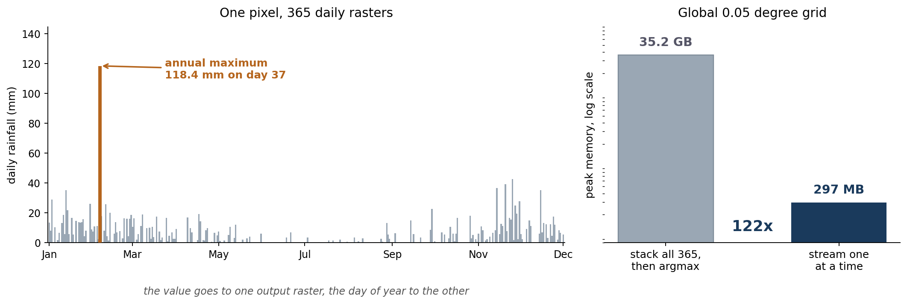

A common request: give me the wettest day of the year, for every pixel. Usually followed by the more useful one, which is *when* it happened.

The first is a design storm, the input to a return-period analysis or a drainage calculation. The second tells you about the season, and about whether a district's worst day arrives with the monsoon or out of nowhere in the middle of the dry season.

Both come out of the same pass over the data.



## The obvious way, and why it stops working

Read all 365 daily rasters into a 3D array, then:

```python
max_values = np.max(stack, axis=0)
max_dates  = np.argmax(stack, axis=0)
```

Two lines, correct, and it works fine on a province.

On a global grid at 0.05 degrees it does not. That grid is 7200 by 3600, so 25,920,000 pixels. One float32 band is about 99 MB, and 365 of them is **35 GB** before you have computed anything at all.

## Keep two arrays instead

You never need the whole stack. You need the best value so far, and the day it came from. Read one raster, compare, update, discard.

```python
condition = r > max_values
max_values[condition] = r[condition]
max_dates[condition]  = julian_day
```

That is the whole algorithm, and the thing I like about it is that **one boolean mask does both jobs**. Wherever today beat the running maximum, write today's value into one array and today's day number into the other. The two outputs stay in step by construction, because the same mask indexes both.

Peak memory is now the two accumulators plus whichever raster is in flight, about 297 MB. Roughly 120 times less, and it does not grow if you move from a year to a decade.

It also parallelises trivially and it is order-independent: the maximum of a set does not care what sequence you visit it in.

## Getting the day out of the filename

Julian day comes from the filename rather than from any metadata:

```python
date_str = file_name.split('_')[-1].split('.')[0]
date_obj = datetime.datetime.strptime(date_str, '%Y%m%d')
julian_day = date_obj.timetuple().tm_yday
```

So the files have to end `_YYYYMMDD.tif`. That is fragile, and it is also the correct trade for this job: the alternative is opening each file's metadata and hoping the acquisition date is populated and consistent, which for a stack of derived products it very often is not. A naming convention you control beats a metadata field you do not.

Day of year rather than a date string, because the output has to be a raster, and a raster holds numbers.

## Two versions, because not everyone has a licence

The original was ArcPy, which is fine if you have ArcGIS. Plenty of people do not, and the whole thing is about twenty lines of numpy with a raster reader bolted on either side, so there is a `rasterio` version that does exactly the same work.

The ArcPy one uses `arcpy.RasterToNumPyArray` in and `arcpy.NumPyArrayToRaster` out. The rasterio one opens the first file to grab a profile, then writes that profile back out with the dtype changed for the day raster. The middle, the part that matters, is identical in both.

::: {.callout-note collapse="true" title="Python - rasterio version"}
```python
import os
import datetime
import numpy as np
import rasterio

src_flder = r"Y:\3days\2017"
out_flder = r"Y:\3days\2017_output"
out_year = os.path.basename(src_flder)
max_name = os.path.join(out_flder, f"idn_{out_year}_max.tif")
date_name = os.path.join(out_flder, f"idn_{out_year}_day.tif")

os.makedirs(out_flder, exist_ok=True)

# Sorted, and filtered to .tif, so the run is reproducible and the first
# file is definitely a raster.
files = sorted(f for f in os.listdir(src_flder) if f.lower().endswith(".tif"))
if not files:
    raise SystemExit(f"No .tif files in {src_flder}")

# Take the grid definition from the first raster.
with rasterio.open(os.path.join(src_flder, files[0])) as src:
    meta = src.meta.copy()
    shape = (src.height, src.width)

max_values = np.zeros(shape, dtype=np.float32)
max_dates = np.zeros(shape, dtype=np.int32)

for file_name in files:
    with rasterio.open(os.path.join(src_flder, file_name)) as src:
        r = src.read(1).astype(np.float32)
        nodata = src.nodata
    if nodata is not None:
        r = np.where(r == nodata, 0.0, r)

    # One mask, two updates: the value and the day it came from.
    condition = r > max_values
    max_values[condition] = r[condition]

    date_str = file_name.split("_")[-1].split(".")[0]
    julian_day = datetime.datetime.strptime(date_str, "%Y%m%d").timetuple().tm_yday
    max_dates[condition] = julian_day

# The wettest value seen.
meta.update(dtype="float32", count=1, nodata=0)
with rasterio.open(max_name, "w", **meta) as dst:
    dst.write(max_values, 1)

# The day of year it happened.
meta.update(dtype="int32", count=1, nodata=0)
with rasterio.open(date_name, "w", **meta) as dst:
    dst.write(max_dates, 1)

print(f"Wrote {max_name} and {date_name} from {len(files)} rasters")
```
:::

::: {.callout-note collapse="true" title="Python - ArcPy version"}
```python
import os
import datetime
import numpy as np
import arcpy

arcpy.env.overwriteOutput = True

src_flder = r"Y:\3days\2017"
out_flder = r"Y:\3days\2017_output"
out_year = os.path.basename(src_flder)
max_name = os.path.join(out_flder, f"idn_{out_year}_max.tif")
date_name = os.path.join(out_flder, f"idn_{out_year}_day.tif")

# Set the workspace before listing anything from it.
arcpy.env.workspace = src_flder
rasters = sorted(arcpy.ListRasters("*", "TIF"))
if not rasters:
    raise SystemExit(f"No rasters in {src_flder}")

# Grid definition from the first raster: origin and cell size both read,
# rather than assumed.
first = arcpy.Raster(os.path.join(src_flder, rasters[0]))
lower_left = arcpy.Point(first.extent.XMin, first.extent.YMin)
cell_x, cell_y = first.meanCellWidth, first.meanCellHeight

first_arr = arcpy.RasterToNumPyArray(first, nodata_to_value=0.0)
max_values = np.zeros_like(first_arr, dtype=np.float32)
max_dates = np.zeros_like(first_arr, dtype=np.int32)

for name in rasters:
    r = arcpy.RasterToNumPyArray(name, nodata_to_value=0.0)

    condition = r > max_values
    max_values[condition] = r[condition]

    date_str = name.split("_")[-1].split(".")[0]
    julian_day = datetime.datetime.strptime(date_str, "%Y%m%d").timetuple().tm_yday
    max_dates[condition] = julian_day

arcpy.NumPyArrayToRaster(
    max_values, lower_left, x_cell_size=cell_x, y_cell_size=cell_y,
    value_to_nodata=0).save(max_name)

arcpy.NumPyArrayToRaster(
    max_dates, lower_left, x_cell_size=cell_x, y_cell_size=cell_y,
    value_to_nodata=0).save(date_name)

print(f"Wrote {max_name} and {date_name} from {len(rasters)} rasters")
```
:::

## The corners worth knowing about

**Zero is doing two jobs.** The accumulators start at zero and the outputs write zero as nodata. That works because rainfall cannot be negative, so a pixel that never rains keeps a maximum of zero and a day of zero, and both become nodata in the output. Convenient, and it would break immediately on any variable that can go negative. Temperature anomalies would need a different sentinel.

**Ties go to whichever file was read first.** The comparison is strictly greater than, so the first day to reach the maximum keeps it. Exact float ties in daily rainfall are rare, but sorting the file list at least makes the outcome reproducible rather than dependent on whatever order the filesystem returns.

**Read the cell size, do not type it.** The version I had been using hardcoded `x_cell_size=0.05`, which is right until the day you point it at a different product and get an output that is georeferenced wrongly while looking perfectly normal. Both scripts above take the origin *and* the cell size from the first input raster.

**Filter for `.tif` before taking the first file.** A stray `.aux.xml` or a thumbnail sitting first in the directory listing will stop the run before it starts.

That last group is the reason to write this down at all. The algorithm is four lines and has been correct since the first version. Everything that has gone wrong with it since has been about the plumbing.

The scripts are [in a gist](https://gist.github.com/bennyistanto/079159b048f74a80f80463497787cfc0).
