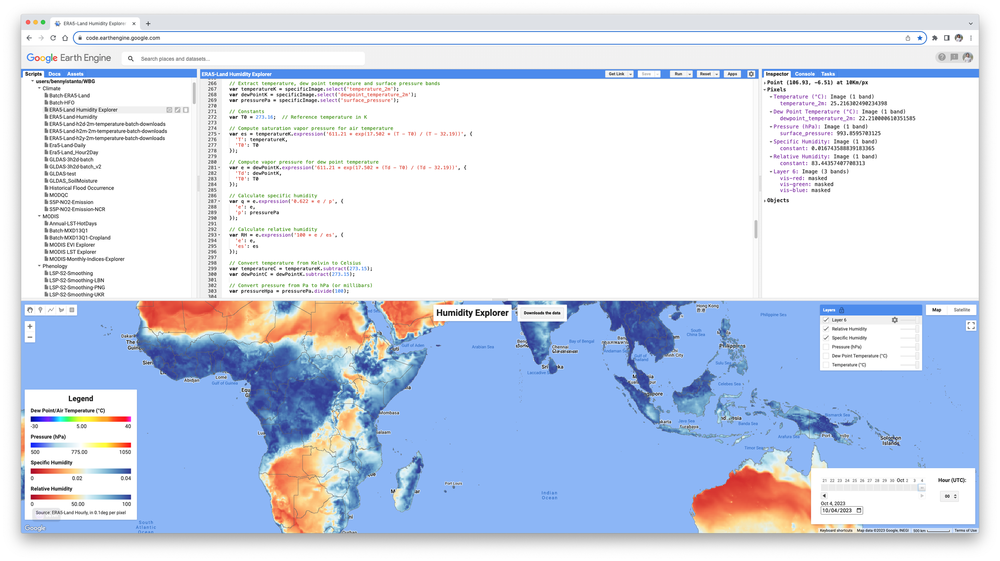

I needed humidity data and tried several ways of calculating it: saturation water vapour pressure using Teten's formula with Buck's parameters, saturation over ice from Alduchov and Eskridge, and Clausius-Clapeyron.

If you want hourly humidity from 1 Jan 1950 to the present, you can pull it out of ERA5-Land Hourly through Google Earth Engine (GEE). Specific and Relative Humidity are calculated from three parameters: T2m (temperature at 2 metres), dew point, and surface pressure.

The GEE script is here: <https://code.earthengine.google.com/9b23f929939122fb1fdc8418d17c43f5>

The script uses the improved Magnus form from Alduchov and Eskridge (1996), written in Kelvin, rather than the other methods above. Three constants do the work: 611.21 Pa is the saturation vapour pressure at the triple point, 17.502 and 32.19 fit the curve to observations over water, and 0.622 is the ratio of the molecular weight of water to dry air, used for specific humidity.

If you spot a mistake or have a suggestion, send me an email.

### Reference

Alduchov, O. A., & Eskridge, R. E. (1996). Improved Magnus form approximation of saturation vapor pressure. Journal of Applied Meteorology, 35(4), 601-609.

---

::: {.callout-note collapse="true" title="Javascript - GEE script for hourly humidity data"}
```js
/*
 * Humidity Explorer
 *
 * Set of script to:
 * - Calculate Specific and Relative Humidity based on Air Temperature, 
 *   Dew Point Temperaure and Surface Pressure
 * - Visualise it based on selected date and hour (UTC)
 * 
 * Contact: Benny Istanto. Climate Geographer - GOST/DECAT/DECDG, The World Bank
 * If you found a mistake, send me an email to bistanto@worldbank.org
 * 
 * Changelog:
 * 2023-10-15 first draft
 *
 * ------------------------------------------------------------------------------
 */


/* 
 * VISUALIZATION AND STYLING
 */
 
// Center of the map
Map.setCenter(118, -2, 3); // Indonesia

// Create the application title bar.
Map.add(ui.Label('Humidity Explorer', {fontWeight: 'bold', fontSize: '24px'}));
    
// SYMBOLOGY
// Visualization parameters
// Temperature
var tempVisC = {
  min: -30, 
  max: 40, 
  palette: [
    '000080', '0000d9', '4000ff', '8000ff', '0080ff', '00ffff',
    '00ff80', '80ff00', 'daff00', 'ffff00', 'fff500', 'ffda00',
    'ffb000', 'ffa400', 'ff4f00', 'ff2500', 'ff0a00', 'ff00ff',
  ]
};
// Pressure
var pressureVisHpa = {
  min: 500, 
  max: 1050, 
  palette: ['blue', 'lightblue', 'white', 'yellow', 'red']
};
// Specific Humidity
var qVis = {
  min: 0, 
  max: 0.04, 
  palette: [
    'a50026', 'd73027', 'f46d43', 'fdae61', 'fee090', 'e0f3f8', 
    'abd9e9', '74add1', '4575b4', '313695'
  ]
};
// Relative Humidity
var RHVis = {
  min: 0, 
  max: 100, 
  palette: [
    'a50026', 'd73027', 'f46d43', 'fdae61', 'fee090', 'e0f3f8', 
    'abd9e9', '74add1', '4575b4', '313695'
  ]
};
// Boundaries
var BNDvis = {fillColor: "#00000000", color: '646464', width: 0.5,};


// COLOR BAR
// Number of color bar
var nStepsR = 15;

// A color bar widget. Makes a horizontal color bar to display the given color palette.
function ColorBar(palette) {
  return ui.Thumbnail({
    image: ee.Image.pixelLonLat().select(0),
    params: {
      bbox: [0, 0, nStepsR, 0.1],
      dimensions: '100x5',
      format: 'png',
      min: 0,
      max: nStepsR,
      palette: palette,
    },
    style: {stretch: 'horizontal', margin: '0px 8px'},
  });
}

// LEGEND STYLE
// Returns a labeled legend, with a color bar and three labels representing
// the minimum, middle, and maximum values.
function makeLegend(title, vis) {
  var colorBar = ColorBar(vis.palette);
  
  var minLabel = vis.min.toString();
  var maxLabel = vis.max.toString();
  var midLabel = ((vis.min + vis.max) / 2).toFixed(2).toString(); // Compute the middle value and format it
  
  var labels = ui.Panel(
    [
      ui.Label(minLabel, {margin: '4px 8px'}),
      ui.Label(midLabel, {margin: '4px 8px', textAlign: 'center', stretch: 'horizontal'}),
      ui.Label(maxLabel, {margin: '4px 8px'})
    ],
    ui.Panel.Layout.flow('horizontal')
  );
  
  return ui.Panel(
    [
      ui.Label(title, {fontWeight: 'bold'}),
      colorBar,
      labels
    ]
  );
}

// Styling for the legend title. 
var LEGEND_TITLE_STYLE = {
  fontSize: '20px',
  fontWeight: 'bold',
  stretch: 'horizontal',
  textAlign: 'center',
  margin: '4px',
};

// Styling for the legend footnotes.
var LEGEND_FOOTNOTE_STYLE = {
  fontSize: '12px',
  stretch: 'horizontal',
  textAlign: 'center',
  margin: '4px',
};

// Assemble the legend panel.
var legendPanel = ui.Panel(
  [
    ui.Label('Legend', LEGEND_TITLE_STYLE),
    makeLegend('Dew Point/Air Temperature (°C)', tempVisC),
    makeLegend('Pressure (hPa)', pressureVisHpa),
    makeLegend('Specific Humidity', qVis),
    makeLegend('Relative Humidity', RHVis),
    // Add more legends as needed
    ui.Label('Source: ERA5-Land Hourly, in 0.1deg per pixel', LEGEND_FOOTNOTE_STYLE),
  ],
  ui.Panel.Layout.flow('vertical'),
  {width: '300px', position: 'bottom-left'}
);

// Add the Panel to the map.
Map.add(legendPanel);


/*
 * DATE AND HOUR CONFIGURATION
 */
 
// Strip time off current date/time
// As ERA5-Land data is not real time available at GEE, sometimes has a lag up to 10 days
// So for first data to be loaded into map will be 10 days before
var firstload = ee.Date(new Date().toISOString().split('T')[0]).advance(-10, 'day');
print(firstload);

// First date available to access via slider
var start_period = ee.Date('1950-01-01'); 

// Start and End
var startDate = start_period.getInfo();
var endDate = firstload.getInfo();

// Define your initial date and hour.
var initialDate = firstload;
var initialHour = '00';

// Create a dropdown for hour selection.
var hours = [];
for (var i = 0; i < 24; i++) {
  hours.push(i < 10 ? '0' + i : i.toString());
}
var hourSelector = ui.Select({
  items: hours,
  value: initialHour,
  style: {width: '60px', padding: '5px'},
  onChange: updateVisualization
});

// Create a label for the dropdown.
var hourLabel = ui.Label('Hour (UTC):', {fontWeight: 'bold'});

// Create a panel to hold the label and the dropdown.
var hourPanel = ui.Panel({
  widgets: [hourLabel, hourSelector],
  style: {position: 'bottom-right'}
});

// Slider function
var dateSlider = ui.DateSlider({
  start: startDate.value, 
  end: endDate.value, 
  value: initialDate,
  period: 1, // 1-day granularity.
  style: {width: '300px', padding: '10px', position: 'bottom-right'},
  onChange: updateVisualization // Function to call when date changes.
});

// Create a panel to hold the date slider and the hour dropdown.
var dateTimePanel = ui.Panel({
  widgets: [dateSlider, hourPanel],
  layout: ui.Panel.Layout.flow('horizontal'), // Align widgets horizontally
  style: {position: 'bottom-right'}
});

Map.add(dateTimePanel);


/*
 * MAIN FUNCTION
 */
 
// Function to update the visualization based on selected date and hour.
//
// Reference
// Alduchov, O. A., & Eskridge, R. E. (1996). Improved Magnus form approximation of saturation vapor pressure. 
// Journal of Applied Meteorology, 35(4), 601-609.
// 
// 611.21: This is the saturation vapor pressure of water at the triple point (in Pascals). 
// The triple point is a specific combination of temperature and pressure at which water can 
// coexist in three phases (solid, liquid, and gas) simultaneously.
//
// 17.502 and 32.19: These are constants specific to the Magnus formula over water. 
// They are used to adjust the curve of the formula to fit the actual observed data. 
// The values would be different for saturation over ice.
// 
// 0.622: This constant is the ratio of the molecular weight of water to the molecular weight of dry air. 
// It's used in the formula to calculate specific humidity.

function updateVisualization() {
  // Remove previous layers
  Map.layers().reset();
  
  // Initial Date and Hour
  var selectedDate = dateSlider.getValue();
  var selectedHour = hourSelector.getValue();
  
  var selectedDateString = selectedDate.toString();
  var startDateString = selectedDateString.split(',')[0];
  var selectedDateStart = ee.Date(Number(startDateString));

  // Convert the selected date to an ee.Date
  var date = selectedDateStart;
  
  // Use the selected hour directly to advance the date
  var startDateTime = date.advance(ee.Number.parse(selectedHour), 'hour');
  
  // Add an hour to the start time to get the end time
  var endDateTime = startDateTime.advance(1, 'hour');
  
  // These are USDOS LSIB boundaries simplified for boundary visualization.
  var bnd = ee.FeatureCollection("USDOS/LSIB_SIMPLE/2017");

  // Filter your collection by this time range and update the map.
  // Load the specific image from the ECMWF/ERA5_LAND/HOURLY collection
  var collection = ee.ImageCollection("ECMWF/ERA5_LAND/HOURLY");
  var filteredCollection = collection.filterDate(startDateTime, endDateTime);
  var specificImage = filteredCollection.first();

  // Extract temperature, dew point temperature and surface pressure bands
  var temperatureK = specificImage.select('temperature_2m');
  var dewPointK = specificImage.select('dewpoint_temperature_2m');
  var pressurePa = specificImage.select('surface_pressure');
  
  // Constants
  var T0 = 273.16;  // Reference temperature in K
  
  // Compute saturation vapor pressure for air temperature
  var es = temperatureK.expression('611.21 * exp(17.502 * (T - T0) / (T - 32.19))', {
    'T': temperatureK,
    'T0': T0
  });
  
  // Compute vapor pressure for dew point temperature
  var e = dewPointK.expression('611.21 * exp(17.502 * (Td - T0) / (Td - 32.19))', {
    'Td': dewPointK,
    'T0': T0
  });
  
  // Calculate specific humidity
  var q = e.expression('0.622 * e / p', {
    'e': e,
    'p': pressurePa
  });
  
  // Calculate relative humidity
  var RH = e.expression('100 * e / es', {
    'e': e,
    'es': es
  });
  
  // Convert temperature from Kelvin to Celsius
  var temperatureC = temperatureK.subtract(273.15);
  var dewPointC = dewPointK.subtract(273.15);
    
  // Convert pressure from Pa to hPa (or millibars)
  var pressureHpa = pressurePa.divide(100);
  
  // Attach as properties to specificImage
  specificImage = specificImage.set('temperatureC', temperatureC);
  specificImage = specificImage.set('dewPointC', dewPointC);
  specificImage = specificImage.set('pressureHpa', pressureHpa);
  specificImage = specificImage.set('q', q);
  specificImage = specificImage.set('RH', RH);
  
  currentImage = specificImage;
  
  currentImage = currentImage.addBands(temperatureC.rename('temperatureC'));
  currentImage = currentImage.addBands(dewPointC.rename('dewPointC'));
  currentImage = currentImage.addBands(pressureHpa.rename('pressureHpa'));
  currentImage = currentImage.addBands(q.rename('q'));
  currentImage = currentImage.addBands(RH.rename('RH'));

  // Display temperature, dew point temperature, pressure, specific humidity, and relative humidity
  Map.addLayer(temperatureC, tempVisC, 'Temperature (°C)', false);
  Map.addLayer(dewPointC, tempVisC, 'Dew Point Temperature (°C)', false);
  Map.addLayer(pressureHpa, pressureVisHpa, 'Pressure (hPa)', false);
  Map.addLayer(q, qVis, 'Specific Humidity');
  Map.addLayer(RH, RHVis, 'Relative Humidity');
  
  // Optional: Add the boundaries for better visualization.
  Map.addLayer(bnd.style({fillColor: "#00000000", color: '646464', width: 0.5}));
}

// Update variables
var currentImage;

// Initial visualization.
updateVisualization();


/* 
 * DATA DOWNLOAD
 */

// Add download button to panel
var download = ui.Button({
  label: 'Downloads the data',
  style: {position: 'top-center', color: 'black'},
  onClick: function() {
      
      // Warning message for the user
      alert("If you see this message, the download request is started! Please go to Tasks, wait until the download list appear. Click RUN for each data you want to download");
      
      // Export parameters
      var dt = ee.Date(dateSlider.getValue()[0]);
      var hour = hourSelector.getValue();
      var scaleValue = 11132;
      var maxPixelsValue = 1e12;
      var folderName = 'GEE';
      
      // Temperature
      Export.image.toDrive({
        image: ee.Image(currentImage.get('temperatureC')),
        description: 'wld_cli_era5land_t2m_' + hour + 'h_' + dt.format('yyyy-MM-dd').getInfo(),
        folder: folderName,
        scale: scaleValue,
        maxPixels: maxPixelsValue
      });

      // Dew Point
      Export.image.toDrive({
        image: ee.Image(currentImage.get('dewPointC')),
        description: 'wld_cli_era5land_dewPoint_' + hour + 'h_' + dt.format('yyyy-MM-dd').getInfo(),
        folder: folderName,
        scale: scaleValue,
        maxPixels: maxPixelsValue
      });

      // Pressure
      Export.image.toDrive({
        image: ee.Image(currentImage.get('pressureHpa')),
        description: 'wld_cli_era5land_pressure_' + hour + 'h_' + dt.format('yyyy-MM-dd').getInfo(),
        folder: folderName,
        scale: scaleValue,
        maxPixels: maxPixelsValue
      });

      // Specific Humidity
      Export.image.toDrive({
        image: ee.Image(currentImage.get('q')),
        description: 'wld_cli_era5land_sh_' + hour + 'h_' + dt.format('yyyy-MM-dd').getInfo(),
        folder: folderName,
        scale: scaleValue,
        maxPixels: maxPixelsValue
      });

      // Relative Humidity
      Export.image.toDrive({
        image: ee.Image(currentImage.get('RH')),
        description: 'wld_cli_era5land_rh_' + hour + 'h_' + dt.format('yyyy-MM-dd').getInfo(),
        folder: folderName,
        scale: scaleValue,
        maxPixels: maxPixelsValue
      });
      
      print('Data Downloaded!', dt);
  }
});


// Add the button to the map and the panel to root.
Map.add(download);


/*
 * END OF SCRIPT
 */
```
:::