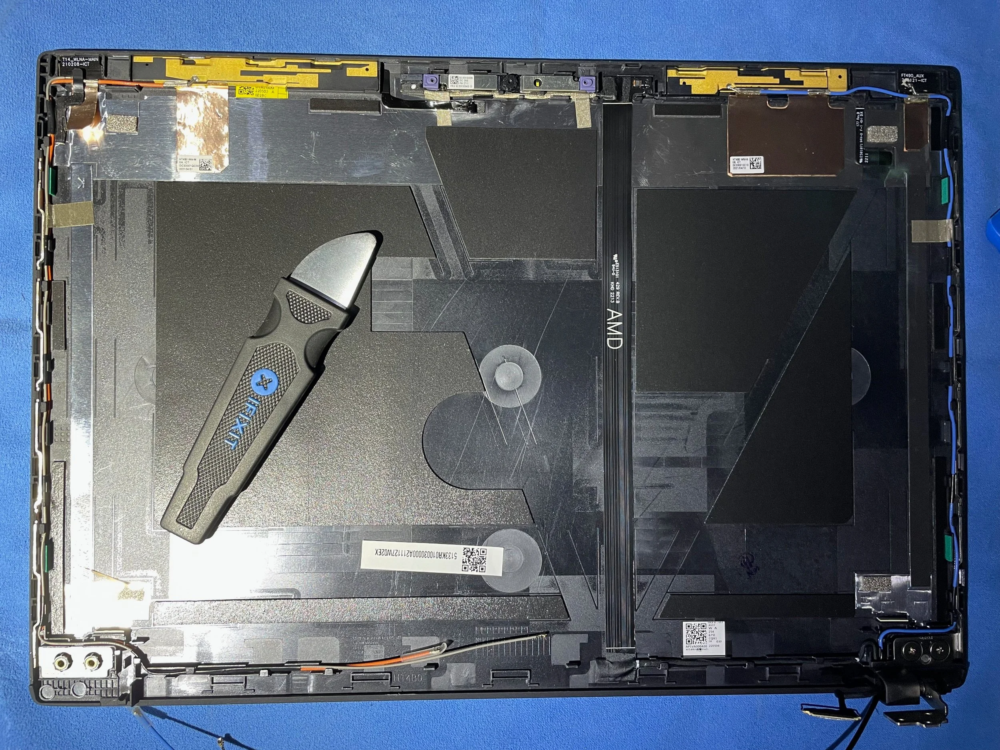
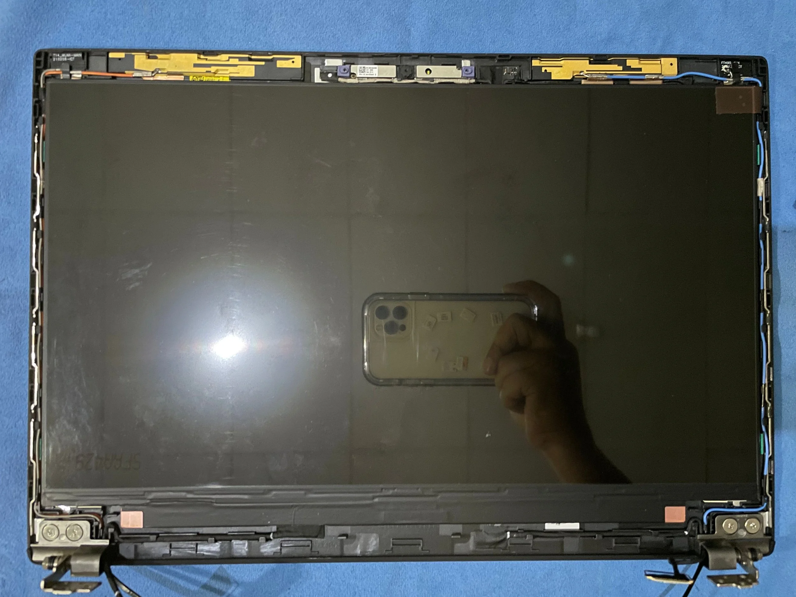
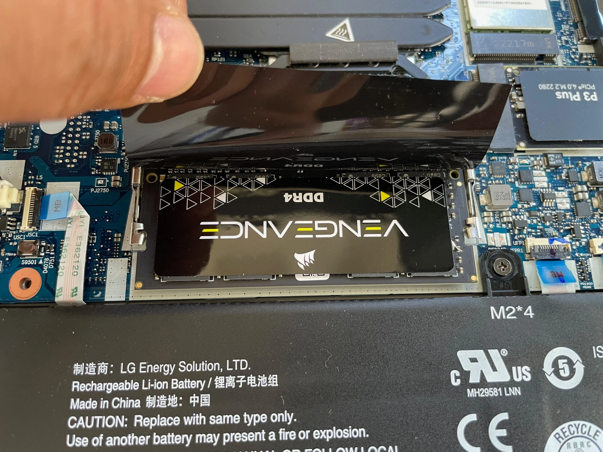
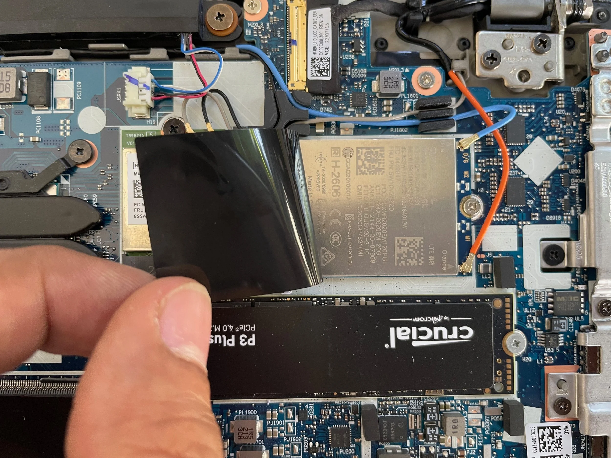

I bought a [Thinkpad T14 Gen 2 AMD](https://www.lenovo.com/us/en/p/laptops/thinkpad/thinkpadt/t14-g2-amd/22tpt14t4a1) (released on August 2022) end of December 2023, it’s second hand with mint condition and standard specification (AMD Ryzen™ 7 PRO 5850U Processor with Radeon Graphics, 256GB nvme and 16GB RAM, FHD 14”).

This is my second-owned Thinkpad after the [T480](/blog/20220501-maximizing-thinkpad-t480), and same as before I also did some upgrades on my T14. Here’s the list of the components:

1. T14 Gen 2: 14″, 3840×2160, IPS, 500 nits, 100% Adobe RGB, Anti-glare from <https://www.myfixguide.com/store/screen-for-thinkpad-t14/>
2. 40pin UHD cable from <https://www.myfixguide.com/store/lcd-cable-for-t14-gen2/>
3. 4TB NVMe SSD from <https://www.crucial.com/ssd/p3-plus/CT4000P3PSSD8>
4. 32GB RAM DDR4 SODIMM 3200MHz from <https://www.corsair.com/us/en/p/memory/cmsx32gx4m1a3200c22/corsair-high-performance-vengeance-memory-kit-cmsx32gx4m1a3200c22>
5. WWAN card and the antenna from <https://thinkparts.com/products/-4970>

I did all the installation myself by following the awesome guideline and use Pro Tech Toolkit <https://www.ifixit.com/Store/Tools/Pro-Tech-Toolkit/IF145-307> from [IFIXIT](https://www.ifixit.com/).

See some of the picture below:

