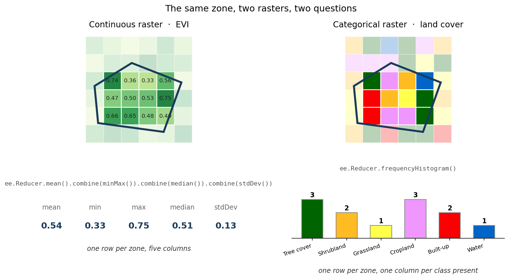

Zonal statistics is the operation you reach for whenever someone hands you a raster and a set of boundaries and asks for a table. Summarise the pixels inside each polygon. It is probably the single most common thing I do.

But it is two operations wearing one name, and picking the wrong one gives you a number that looks fine and means nothing.



## The distinction is not stylistic

On the left, the pixels are a measurement. Vegetation index, rainfall, temperature, elevation. The values sit on a scale where the arithmetic means something, so mean, minimum, maximum, median and standard deviation are all legitimate answers.

On the right, the pixels are labels. Class 10 is tree cover, class 40 is cropland. The numbers are names, not quantities. The mean of tree cover and cropland is not a landscape, it is a number with no referent. You cannot average a category, and any tool that lets you is not protecting you.

So for the right-hand raster the only sensible question is **how many pixels of each class**, and the answer is not one number per zone but a row of counts.

In ArcGIS these are two different tools, Zonal Statistics and Zonal Histogram. In [rasterstats](https://pythonhosted.org/rasterstats/) it is the `categorical` flag. In Earth Engine it is which reducer you pass.

## The continuous case

```python
reducers = ee.Reducer.mean().combine(
              reducer2=ee.Reducer.minMax(), sharedInputs=True
           ).combine(
              reducer2=ee.Reducer.median(), sharedInputs=True
           ).combine(
              reducer2=ee.Reducer.stdDev(), sharedInputs=True
           )

stats = img.reduceRegion(
    reducer=reducers,
    geometry=feature.geometry(),
    scale=250,
    maxPixels=1e9,
)
```

`sharedInputs=True` is the part worth understanding. It tells Earth Engine that all these reducers consume the same pixel stream, so it makes **one pass** and computes five statistics from it. Without it you would be reading the same pixels five times.

Two arguments deserve more attention than they usually get.

**`scale`** is the resolution the reduction runs at, in metres, and it is not optional in any meaningful sense. Set it to 250 for MODIS and you are working at the native resolution. Set it to 1000 and Earth Engine will happily resample first and give you an answer to a different question. The number should come from the dataset, not from habit.

**`maxPixels`** is a safety rail. Hit it and the task fails rather than silently truncating, which is the correct behaviour and occasionally an annoying one.

## The categorical case

```python
reducer = ee.Reducer.frequencyHistogram()

stats = raster.reduceRegion(
    reducer=reducer,
    geometry=feature.geometry(),
    scale=300,
    maxPixels=1e9,
)
stats = ee.Dictionary(stats.get('Map'))
```

`frequencyHistogram` returns a dictionary of value to count, so the output shape is different: one column per class actually present in that zone, rather than a fixed set of columns.

That last line is the one that will catch you. The histogram comes back nested under the **band name**, and ESA WorldCover happens to call its band `Map`. Point the same code at a different categorical product and `stats.get('Map')` returns nothing, with no error, because asking a dictionary for a key it does not have is a perfectly legal thing to do. If you switch datasets, change that string.

## Sum is the third case, and it is easy to miss

There is a flag in the script for including a sum reducer, and the comment says it is for population data. That deserves spelling out, because it is a case where the obvious choice is wrong.

If your raster is population count per pixel, the **mean** is the average number of people in a pixel of that district. Almost nobody wants that. What they want is the total, which is the sum. Get this wrong and your numbers are out by a factor of however many pixels are in the zone.

The rule of thumb: if the pixel value is a density or an intensity, mean is right. If it is a count of something, sum is right. Rainfall in millimetres is an intensity, so mean. People per pixel is a count, so sum.

## Export, do not fetch

Everything here ends in a batch export rather than a `getInfo()` call:

```python
task = ee.batch.Export.table.toDrive(
    collection=stats_fc,
    description=file_description,
    folder='zonal_gee',
    fileFormat='CSV',
)
task.start()
```

This matters more than it looks. `getInfo()` pulls the result back into your Python session synchronously, and it has a payload limit that a national admin-2 breakdown will exceed. You will get an error that reads like a bug in your code.

An export task runs on Google's side, has no such limit, and survives your notebook kernel dying. The cost is that it is asynchronous: `task.start()` returns immediately, the files appear in Drive minutes later, and if something fails you find out in the Tasks tab rather than in a traceback.

For the monthly EVI run that is thirteen separate tasks for a year of data, submitted in a loop, and the console output is just:

```
Processing image 1 of 13...
...
All tasks submitted.
```

"Submitted" is doing real work in that sentence. Nothing has actually been computed yet.

## Monthly composites

The temporal aggregation builds one composite per calendar month by filtering on year and month and taking the mean:

```python
collection.filter(ee.Filter.calendarRange(year, year, 'year')) \
          .filter(ee.Filter.calendarRange(month, month, 'month')) \
          .mean()
```

MODIS MOD13Q1 is a 16-day product, so a monthly composite is averaging two or three images. That is a reasonable default and it is worth knowing it is happening, because the zonal mean you get out is then a mean of a mean: averaged over time first, then over space.

For a vegetation index that is usually fine. For anything where you care about extremes, compositing first will have already removed them before the reducer ever sees them.

## One thing I would change

The boundary code filters GAUL level 2 and then calls `distinct()`:

```python
boundary = ee.FeatureCollection("FAO/GAUL/2015/level2")
aoi_country = boundary.filter(ee.Filter.eq('ADM0_NAME', country_name))

if admin_level == 'ADM1_CODE':
    aoi = aoi_country.distinct('ADM1_CODE')
```

`distinct()` removes duplicate features. It does not dissolve geometry. So on a level-2 collection, asking for distinct `ADM1_CODE` gives you **one district per province**, not the province, and the zonal statistics that follow are computed over that single district while carrying a province label.

If you want province-level zones, load `FAO/GAUL/2015/level1` directly. The level-2 path with `distinct('ADM2_CODE')` is fine, because there the codes are already unique and the call is a no-op.

Worth checking against your own output: for Indonesia you would get 34 rows either way, so the row count will not tell you. Look at whether the geometry of a row covers a whole province or one kabupaten inside it.

## The notebook

Three ways to define the zones, a continuous example on MODIS EVI, a categorical one on ESA WorldCover, both exporting CSV to Drive. [The gist is here](https://gist.github.com/bennyistanto/38997cf5cbaf70b05a3d8f894d0533b0).

The general point is smaller than the code. Before you reduce anything, ask what the pixel values are. If they are measurements, average them. If they are labels, count them. The reducer is not a preference.
