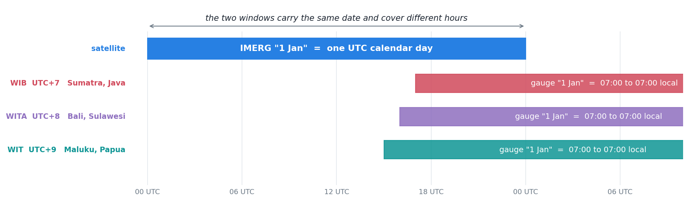
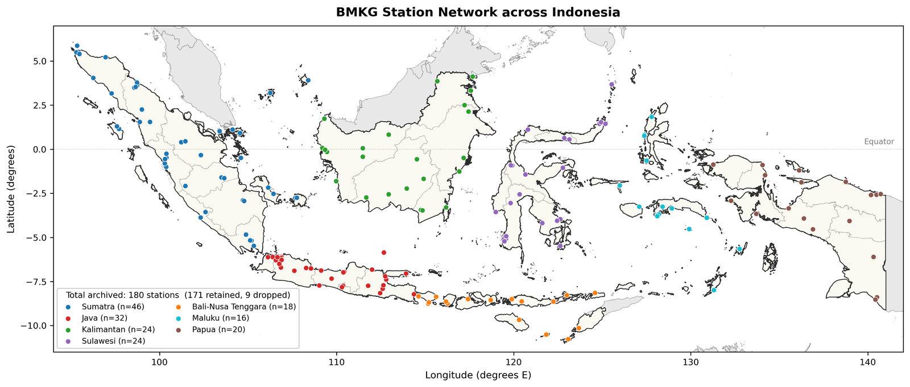

I have spent the last few months comparing satellite rainfall estimates against rain gauges here, and the agreement is worse than I expected. Not a little worse. The kind of worse that sends you back through your own code three times looking for a unit error.

The code was fine. The problem is the place.

So this post is me writing down why, mostly so I stop re-deriving it from scratch every time a number disappoints me.

## The rain here is made differently

Most of what falls on the archipelago comes from deep convection, organised by two things pulling against each other: the large-scale monsoon circulation, and local land-sea breezes running off several thousand islands. [Aldrian and Susanto](https://doi.org/10.1002/joc.950) sorted the first into three dominant rainfall regions and tied them to sea surface temperature. [Wu and colleagues](https://doi.org/10.2151/jmsj.86A.187) followed the second out to sea, and found the rain forming offshore from Kalimantan at night.

If you want the whole picture in one place, [Yamanaka's outline](https://doi.org/10.1016/j.atmosres.2016.03.017) of the physical climatology here is where I keep going back to.

The monsoon sets the season. The northwest monsoon, roughly November to March, brings the main wet season to most of the country. The southeast monsoon, May to September, brings the dry season to the south and something more complicated to the north. On top of that the Inter-Tropical Convergence Zone migrates through, and the Madden-Julian Oscillation adds its own rhythm every few weeks.

What comes out of all that is a daily rainfall field with a heavy tail and no spatial patience at all. Two pixels twenty kilometres apart can have completely different days.

That is hard for a satellite. It is harder for a satellite being scored against gauges, because the two do not fail in the same direction.

## It rains in the afternoon, and that matters more than it sounds

Convection over the big islands peaks in the local afternoon, usually somewhere between two and five o'clock. Daytime heating builds it, the sea breeze converges it over land, it comes down hard, and it clears. [Mori and colleagues](https://doi.org/10.1175/1520-0493(2004)132%3C2021:DLRPMO%3E2.0.CO;2) watched that peak migrate between land and sea over Sumatra, using TRMM alongside intensive rawinsonde soundings.

There is a validation of IMERG against 302 automatic gauges across the region, by [Ramadhan and colleagues](https://doi.org/10.1016/j.rsase.2024.101186), that gets at the part I keep thinking about. The satellite reproduces the diurnal *amount* well. It reproduces the *frequency* well. What it gets wrong is the phase: the satellite puts the peak in the early afternoon, and the gauges put it in the early morning.

If you only ever look at daily totals, that error is invisible. It happens inside the day.

Which brings me to the thing I have not been able to stop thinking about.

## Three time zones and one UTC day

Indonesia has three: WIB at UTC+7 in the west, WITA at UTC+8 through the middle, WIT at UTC+9 in the east.

IMERG accumulates on a UTC calendar day. A gauge day is whatever the observing routine says it is, and here that means a morning-to-morning window closed at the seven o'clock reading.

Work through the western zone slowly. Seven in the morning local time is midnight UTC. So a gauge total closed at that reading covers exactly one complete UTC day. But it gets written down under the *following* calendar date. The convection of one UTC day ends up filed under the next day's gauge label.

That is not a messy partial overlap you would have to model your way around. It is a whole-day offset, the sort of thing a date shift would fix.

I have not measured what it costs. I mention it because every time I look at a daily correlation that seems too low to be real, this is sitting at the back of my mind, and at some point I am going to have to go and find out.

## The gauges thin out going east

One hundred and eighty archived stations. Sumatra 46, Java 32, Kalimantan 24, Sulawesi 24, Papua 20, Bali and Nusa Tenggara 18, Maluku 16.

Read those against the map rather than as a list. Java is small and has 32. Papua is enormous and has 20. The network is dense where the people and the agriculture are, and it thins going east precisely where the islands get bigger and further apart.

Then it narrows again. Only a subset of those stations reach the international exchange that feeds the gridded gauge analyses most people use as a reference. Those analyses rest on interpolation methods worked out by [Xie and colleagues](https://doi.org/10.1175/JHM583.1) for East Asia and assessed globally by [Chen and colleagues](https://doi.org/10.1029/2007JD009132), and they can only be as good as the stations underneath them. So the reference product is well constrained in the west and weakly constrained in the east.

And it does not tell you which is which. It hands you a value for every cell either way.

## Where that leaves me

Three things, in the order they bother me.

The rain is genuinely hard to observe. Convective, heavy-tailed, spatially impatient. Nothing to be done about that; it is the weather.

Some of the disagreement is not physical at all. It is two calendars, and I suspect a meaningful share of what looks like satellite error is a labelling problem I have been counting against the satellite.

The reference I would correct against is not uniform in quality, and it looks uniform. That is the one that actually worries me. If you learn a correction from a reference that is strong in the west and weak in the east, and then apply it evenly across the whole country, you will produce something confidently wrong in exactly the half you can least check.

Whatever I end up building is going to have to know that about itself.
