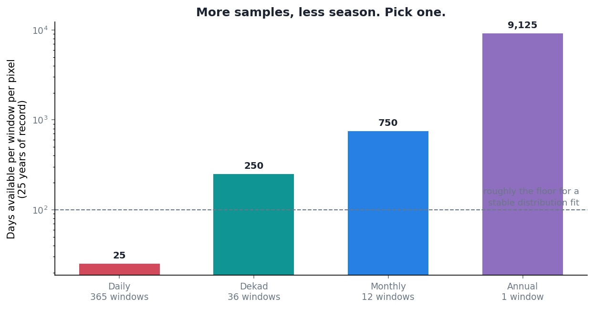
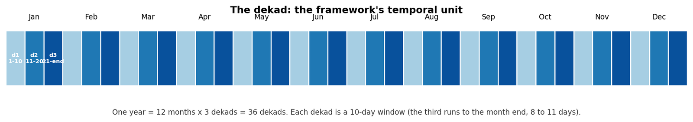

Every statistical correction needs a window. You cannot fit a distribution to "rainfall" in the abstract; you fit it to rainfall in some slice of the year, at some place, and the size of that slice turns out to matter more than I expected.

The tension is simple to state and annoying to resolve. Wide windows give you plenty of data and the wrong climate. Narrow windows give you the right climate and not enough data.

## Why a year is too wide

Take the whole year as one window and you have twenty-five years times 365 days of samples for each cell. Statistically luxurious.

You have also just declared that January and August are the same. In a monsoon climate they are not remotely the same. Fitting one distribution across both gives you a shape that describes neither: too wet for the dry season, too dry for the wet one, and correcting every day against that average is worse than not correcting at all in both halves of the year.

Anywhere with a seasonal cycle this is obviously wrong. In the tropics, where the seasonal cycle is most of the signal, it is disqualifying.

## Why a day is too narrow

The other end is worse. Fit separately for each calendar day and you get 365 windows, each holding one day per year. Twenty-five years of record gives you twenty-five values per window.



Twenty-five values, of which perhaps half are dry, to estimate a distribution shape and a tail. That is not an estimate, it is a rumour. And you would be fitting 365 of them per cell, over hundreds of thousands of cells, each one wobbling independently. Neighbouring days would get visibly different corrections for no physical reason at all, just sampling noise.

## Why a month is close but not right

A month is a reasonable answer and it is what a lot of work uses. Twelve windows, plenty of samples, seasonality preserved at a sensible resolution.

The problem is specific to monsoon climates: the interesting part of the year is when the season turns, and the turn does not respect month boundaries. Onset can move through the second half of one month and into the next. A monthly window averages the pre-onset and post-onset regimes together, and that average describes a state the atmosphere is never actually in.

## Ten days



A dekad is a ten-day window. Days 1 to 10, days 11 to 20, and day 21 to whatever the month ends on, which makes the third one eight to eleven days long depending on the month. Three per month, thirty-six per year.

Twenty-five years of record gives roughly 250 days per window per cell, of which the wet ones are what actually gets fitted. Enough to estimate a shape. Fine enough that onset lands inside one or two dekads rather than smearing across a whole season.

The part I like is that I did not have to invent it. The dekad is a standard unit in agricultural meteorology, and a great deal of operational drought and crop monitoring is already reported on it. Choosing it means the correction lines up with products people already use, rather than requiring a translation step at the end.

## What it does not fix

A fixed calendar window is still fixed. If the wet season onset in a region shifts by a fortnight from one year to the next, then the dekad that catches onset in one year catches pre-onset conditions in another, and the fit for that window is noisier than its neighbours as a result.

I do not have a good answer for that. A dekad calendar anchored to climatological onset rather than to the calendar would help, and would also make every downstream comparison harder. For now the fixed calendar stays and the variable-onset regions are simply the ones I should be most careful interpreting.

Ten days is not correct. It is the least wrong of the available compromises, which in this line of work is usually what you get.

## Grouping the record into dekads

The dekad grouping itself is unglamorous. Every day in the record gets a month and a dekad label, matching days are gathered across all years, and the result is 36 stacks per pixel.

::: {.callout-note collapse="true" title="Python - aggregate_data_across_years, from src/io.py"}
```python
def aggregate_data_across_years(
        imerg_ds,
        cpc_ds,
        month,
        dekad_start_day,
        dekad_end_day,
        imerg_var=None,
        cpc_var=None
    ):
    """
    Aggregate IMERG and CPC data across all years for the specified dekad.

    Parameters:
    ----------
    imerg_ds : xarray.Dataset
        IMERG precipitation dataset with dimensions ('time', 'lat', 'lon').
    cpc_ds : xarray.Dataset
        CPC precipitation dataset with dimensions ('time', 'lat', 'lon').
    month : int
        The month number (1-12) for which the dekad is specified.
    dekad_start_day : int
        Start day of the dekad (e.g., 1, 11, 21).
    dekad_end_day : int
        End day of the dekad (e.g., 10, 20, last day of month).
    imerg_var : str, optional
        Variable name for precipitation in IMERG dataset. If None, uses config default.
    cpc_var : str, optional
        Variable name for precipitation in CPC dataset. If None, uses config default.

    Returns:
    ----------
    tuple of xarray.DataArray
        Aggregated IMERG and CPC data for the specified dekad across all years.
    """
    # Use config defaults if variable names not provided
    if imerg_var is None:
        imerg_var = IMERG_PRECIP_VAR
    if cpc_var is None:
        cpc_var = CPC_PRECIP_VAR

    # Align datasets on their shared coordinates (time, lat, lon).
    # Uses join="inner" so only coordinates present in BOTH datasets are kept.
    # IMPORTANT: The caller must ensure the two datasets are already on the
    # same spatial grid (e.g., via reindex_and_align_with_monotonicity).
    # If IMERG and CPC have different native grids, the inner join will
    # find zero overlapping lat/lon values and produce empty arrays.
    logging.info("Aligning IMERG and CPC datasets...")
    n_lat_imerg_before = len(imerg_ds.lat)
    n_lat_cpc_before = len(cpc_ds.lat)

    imerg_ds, cpc_ds = xr.align(imerg_ds, cpc_ds, join="inner")

    # Diagnostic: detect spatial coordinate mismatch early
    n_lat_after = len(imerg_ds.lat)
    n_lon_after = len(imerg_ds.lon)
    if n_lat_after == 0 or n_lon_after == 0:
        logging.error(
            "Spatial coordinate mismatch detected! "
            f"IMERG had {n_lat_imerg_before} lats, CPC had {n_lat_cpc_before} lats, "
            f"but inner join produced {n_lat_after} lats and {n_lon_after} lons. "
            "This usually means the CPC dataset was not spatially aligned to IMERG "
            "before calling this function. Use reindex_and_align_with_monotonicity() "
            "first, then pass the aligned CPC dataset here."
        )
        raise ValueError(
            "No overlapping spatial coordinates between IMERG and CPC. "
            "Did you pass cpc_ds_aligned (from reindex_and_align_with_monotonicity) "
            "instead of the original cpc_ds?"
        )

    # Log time step counts after alignment
    logging.info(f"After alignment: IMERG has {len(imerg_ds.time)} time steps, CPC has {len(cpc_ds.time)} time steps")

    # Create time masks
    logging.info("Creating time-based masks...")
    imerg_time_mask = (
        (imerg_ds['time.month'] == month) &
        (imerg_ds['time.day'] >= dekad_start_day) &
        (imerg_ds['time.day'] <= dekad_end_day)
    )
    cpc_time_mask = (
        (cpc_ds['time.month'] == month) &
        (cpc_ds['time.day'] >= dekad_start_day) &
        (cpc_ds['time.day'] <= dekad_end_day)
    )

    # Apply time masks
    try:
        logging.info("Applying time masks...")
        imerg_dekad_data = imerg_ds[imerg_var].where(imerg_time_mask, drop=True)
        cpc_dekad_data = cpc_ds[cpc_var].where(cpc_time_mask, drop=True)
    except KeyError as e:
        logging.error(f"Variable not found in dataset: {e}")
        logging.info(f"IMERG variables: {list(imerg_ds.data_vars)}")
        logging.info(f"CPC variables: {list(cpc_ds.data_vars)}")
        raise ValueError(f"Variable not found. Check IMERG_PRECIP_VAR='{imerg_var}' and CPC_PRECIP_VAR='{cpc_var}' in config.")
    except Exception as e:
        logging.error("Error during masking:", exc_info=True)
        raise ValueError(f"Failed to apply time masks: {str(e)}")

    # Validate resulting data
    if imerg_dekad_data.size == 0 or cpc_dekad_data.size == 0:
        logging.error("No data available after masking.")
        logging.info(f"IMERG data after masking: {imerg_dekad_data.shape}")
        logging.info(f"CPC data after masking: {cpc_dekad_data.shape}")
        raise ValueError("No data found for the specified month and dekad.")

    return imerg_dekad_data, cpc_dekad_data
```
:::

[`src/io.py`](https://github.com/bennyistanto/hybrid-bias-correction/blob/main/src/io.py)
