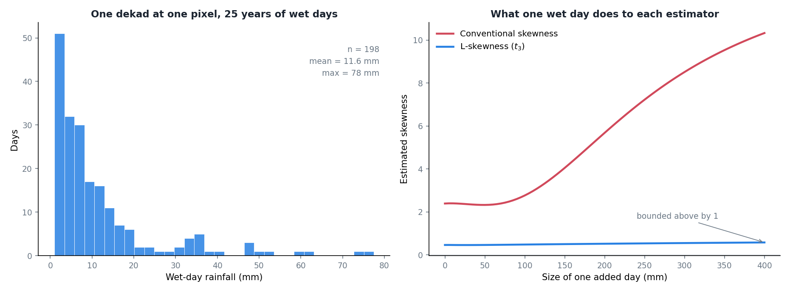
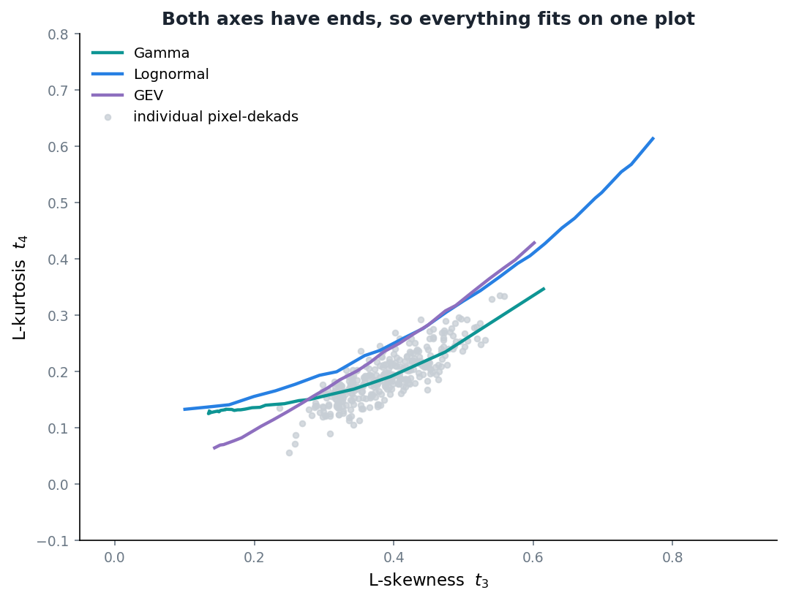

Here is the problem I keep running into.

I want to fit a probability distribution to wet-day rainfall, separately for each ten-day window of the year and separately for each grid cell. Twenty-five years of record gives me around 250 days per window per cell, and once I drop the dry days I am often down to fewer than 200 wet ones.

Two hundred numbers, heavily skewed, with a long right tail that is the entire reason I care. And I need to estimate the shape of that from the sample.

The textbook answer is to compute moments: mean, variance, skewness. That answer has a problem, and it took me longer than it should have to see it clearly.

## What one day does

Skewness is built from the cube of the deviations from the mean. Cubing is a violent operation. A value three times further from the mean than its neighbours contributes twenty-seven times as much.

So I ran the obvious experiment. Take a realistic wet-day sample for one dekad at one pixel. Then add a single extra day and walk it upward from ordinary to extreme, watching what happens to the estimate.



The red line is conventional skewness. With the sample as it stands it reads 2.39. Add one 400 mm day and it reads 10.33.

One day. Out of 199. Four times the answer.

And 400 mm in a day is not a fantasy here. It is a bad tropical downpour, the sort of thing that happens somewhere in the archipelago most years. If a single such day lands inside the window I happen to be fitting, my shape parameter is no longer describing the climate. It is describing that day.

The blue line is the alternative.

## Sort first, then take differences

L-moments come at the same question from a different direction. Instead of raising deviations to powers, you sort the sample and take weighted differences between the order statistics.

The first L-moment is just the mean. The second is a measure of spread built from the expected difference between two randomly drawn values. The third brings in three at a time, the fourth four at a time. [Hosking](https://doi.org/10.1111/j.2517-6161.1990.tb01775.x) set the whole thing out in 1990, along with unbiased estimators built on probability-weighted moments:

$$
b_r = \frac{1}{n} \sum_{i=1}^{n} \frac{\binom{i-1}{r}}{\binom{n-1}{r}} \, x_{i:n}
$$

where $x_{i:n}$ are the sorted values. The L-moments then fall out as simple combinations: $\lambda_1 = b_0$, $\lambda_2 = 2b_1 - b_0$, $\lambda_3 = 6b_2 - 6b_1 + b_0$, and so on.

Nothing is ever raised to a power. Each observation enters linearly, with a weight that depends only on its rank. That is the whole trick, and it is why one enormous value cannot run away with the estimate: it is still just one value, sitting at the top of the sort, carrying one value's worth of weight.

In the experiment above, L-skewness goes from 0.461 to 0.579 while conventional skewness quadruples.

## The ratios are bounded, which is quietly useful

You do not usually work with the L-moments directly. You work with ratios: $t_2 = \lambda_2 / \lambda_1$ as a measure of variability, $t_3 = \lambda_3 / \lambda_2$ for skewness, $t_4 = \lambda_4 / \lambda_2$ for kurtosis.

Conventional skewness is unbounded. It can be 2, or 10, or 40, and the number on its own tells you very little about whether that is unusual.

L-skewness lives between -1 and 1. That sounds like a technicality and it is not. It means you can put the L-skewness and L-kurtosis of thousands of grid cells on one plot, next to the theoretical curves for Gamma, Pearson III, GEV and the rest, and see at a glance which family your data actually looks like.



The cloud sits between the Gamma and Lognormal curves, which is roughly where wet-day rainfall ought to sit and is a useful thing to be able to see rather than assume. That diagram is the reason people reach for L-moments in regional frequency analysis, and it is only possible because the axes have ends. [Hosking and Wallis](https://doi.org/10.1017/CBO9780511529443) built a whole book around the approach, and it is the one to read if you want the method rather than the estimator.

## What I take from this

None of this makes the estimate correct. Two hundred wet days is still a small sample and a small sample is still uncertain. L-moments do not create information that is not there.

What they do is stop a single observation from deciding the answer. Given that I am fitting tens of thousands of these, one per cell per dekad, and given that I will never inspect them individually, an estimator that fails gracefully matters more to me than one that is marginally more efficient when everything is well behaved.

## The code

The estimator is short enough to read in one sitting. Sort, take the four probability-weighted moments, combine them.

::: {.callout-note collapse="true" title="Python - calculate_l_moments, from src/distribution_fitting.py"}
```python
def calculate_l_moments(
        data
    ):
    """
    Calculate L-moments and L-moment ratios for the given data.

    L-moments are statistics used to describe the shape of a probability distribution.
    They are analogous to conventional moments but can be more robust to outliers.

    Uses the unbiased PWM estimators from Hosking (1990):
        b_r = (1/n) * sum_{i=1}^{n} C(i-1,r)/C(n-1,r) * x_{i:n}
    where x_{i:n} are the order statistics.

    Parameters:
    data (numpy.ndarray): The input data.

    Returns:
    tuple: L-moments (l1, l2, l3, l4) and L-moment ratios (t2, t3, t4)
    """
    # Sort the data in ascending order
    # This is required for the calculation of probability weighted moments
    sorted_data = np.sort(data)
    n = len(data)

    if n < 4:
        logging.warning("Insufficient data points for L-moment calculation (need >= 4)")
        return np.nan, np.nan, np.nan, np.nan, np.nan, np.nan, np.nan

    # Calculate the first four probability weighted moments (PWMs)
    # Using unbiased estimators from Hosking (1990):
    # b_r = (1/n) * sum_{i=0}^{n-1} [C(i,r) / C(n-1,r)] * x_{i:n}
    # where i is zero-based index into sorted_data

    i = np.arange(n)  # 0, 1, ..., n-1

    # b0 is simply the mean of the data
    b0 = np.mean(sorted_data)

    # b1: weights = i / (n-1)
    b1 = np.sum(i / (n - 1) * sorted_data) / n

    # b2: weights = i*(i-1) / ((n-1)*(n-2))
    b2 = np.sum(i * (i - 1) / ((n - 1) * (n - 2)) * sorted_data) / n

    # b3: weights = i*(i-1)*(i-2) / ((n-1)*(n-2)*(n-3))
    b3 = np.sum(i * (i - 1) * (i - 2) / ((n - 1) * (n - 2) * (n - 3)) * sorted_data) / n

    # Calculate L-moments
    # L-moments are linear combinations of PWMs
    l1 = b0  # L1 is the mean (measure of location)
    l2 = 2 * b1 - b0  # L2 is a measure of scale (analogous to standard deviation)
    l3 = 6 * b2 - 6 * b1 + b0  # L3 is a measure of skewness
    l4 = 20 * b3 - 30 * b2 + 12 * b1 - b0  # L4 is a measure of kurtosis

    # Calculate L-moment ratios
    # These ratios are dimensionless and often more interpretable
    t2 = l2 / l1 if l1 != 0 else np.nan  # L-CV (coefficient of L-variation)
    t3 = l3 / l2 if l2 != 0 else np.nan  # L-skewness
    t4 = l4 / l2 if l2 != 0 else np.nan  # L-kurtosis

    return l1, l2, l3, l4, t2, t3, t4

# ----
# Function to fit a gamma distribution
```
:::

And the experiment in the first figure, which is just the estimator above run repeatedly against a growing outlier:

::: {.callout-note collapse="true" title="Python - the one-day sensitivity experiment"}
```python
import numpy as np
from scipy import stats

rng = np.random.default_rng(20240319)

# one dekad at one pixel: ~250 days over 25 years, wet days only
base = stats.gamma.rvs(a=0.62, scale=14.0, size=250, random_state=rng)
base = np.round(base[base >= 1.0], 1)

# walk a single extra day from ordinary to extreme
for extra in [0, 100, 200, 300, 400]:
    sample = np.append(base, extra) if extra else base
    conventional = stats.skew(sample)
    l_skewness = calculate_l_moments(sample)[5]      # t3
    print(f"+{extra:3d} mm   skew={conventional:6.2f}   t3={l_skewness:.3f}")

# +  0 mm   skew=  2.39   t3=0.461
# +400 mm   skew= 10.33   t3=0.579
```
:::

[`src/distribution_fitting.py`](https://github.com/bennyistanto/hybrid-bias-correction/blob/main/src/distribution_fitting.py)
