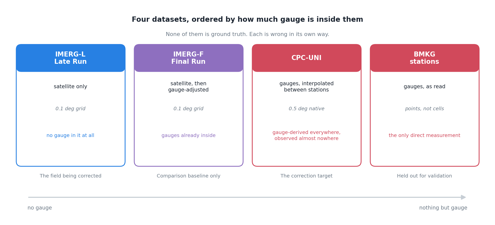

To correct a satellite rainfall product you need something to correct it towards. That thing gets called the reference, and once it has a name people stop asking what it is.

I have four candidates in front of me. None of them is ground truth. Working out how each one is wrong turned out to be more useful than picking a winner.



## What each one actually is

**IMERG Late Run** is the satellite product I want to fix. Passive microwave and infrared retrievals, merged, on a 0.1 degree grid, available within hours. No gauge has touched it. It is an inference about rainfall from what the atmosphere looked like from above.

**IMERG Final Run** is the same satellite processing, then adjusted against gauge analyses after the fact. It is better than the Late Run. It is also not available in near-real time, which is the whole reason the Late Run exists.

**CPC-UNI** is the other direction entirely: gauge reports, interpolated onto a grid. Its native resolution is 0.5 degree, which is five times coarser than IMERG in each direction, so one CPC cell covers a 5 by 5 block of IMERG pixels.

**BMKG stations** are the gauges themselves, as read by an observer, at a point.

## Where this gets uncomfortable

**IMERG-F has gauges in it already.** If I build a correction using gauge information and then score it against IMERG-F, part of what I am measuring is agreement between two things that were both told the same answer. That is not a fatal problem, but it means IMERG-F can only ever be a comparison baseline. It cannot be the target and it cannot be the independent check.

**CPC-UNI produces a value everywhere, and observes almost nowhere.** That is what interpolation is for and it is a reasonable thing to do. The trouble is what comes out the other end: a complete, gapless, confident-looking grid. A cell over central Papua and a cell over central Java look identical in the file. One of them is near several stations. The other is an extrapolation across a few hundred kilometres of forest. Nothing in the NetCDF distinguishes them.

I keep coming back to this. The uncertainty is real and enormous, and the data format has nowhere to put it.

**Stations are points and grids are areas.** A tipping-bucket gauge samples a funnel maybe twenty centimetres across. A 0.1 degree cell at the equator is about eleven kilometres on a side. Asking whether they agree is asking whether a single point measurement represents the average over roughly 120 square kilometres, which for convective rain it frequently does not. If a thunderstorm sits over the next valley, the gauge reads zero and the cell average does not.

So some of the disagreement between satellite and gauge is not error in either. It is the two of them measuring different things and being compared as though they were not.

## Roles, not truth

Where I have landed is that "reference" is the wrong word because it implies one thing. What I actually need is three roles, filled by three different datasets, chosen for different reasons.

Something to **correct towards**, which has to be gridded and complete, because I need a value at every cell. CPC-UNI, with its interpolation problem accepted as a known cost.

Something to **compare against**, so I can tell whether the correction is doing better than the obvious alternative. IMERG-F, kept strictly at arm's length because of the circularity.

Something to **check with**, which has to be genuinely independent and therefore cannot have been used in the fitting at all. The BMKG stations, held out entirely.

The third one is the only honest verification, and it is also the one with the worst spatial coverage and the point-versus-area problem baked in. That is not a satisfying conclusion. It is where the data leaves me.

What I would like, and do not have, is a reference that reports its own uncertainty. Failing that, the next best thing is a correction that knows where its reference is weak and behaves differently there. I do not yet know how to build that, but it is clearly the shape of the problem.

## What this looks like in a config

The roles end up written down, which is the useful part. Four entries, four different jobs, and the variable names differ between the satellite and the gauge product because the providers never agreed on one:

::: {.callout-note collapse="true" title="YAML - the input contract"}
```yaml
input_files:
  imergl_file:      # the satellite field being corrected
  imergf_file:      # gauge-adjusted satellite, comparison baseline only
  cpc_file:         # gauge analysis regridded to 0.1 deg, the EQM target
  cpc_native_file:  # gauge analysis at its native 0.5 deg
  mask_file:        # land = 1, sea = 0 or NaN
  station_file:     # station metadata
  station_data_file: # daily station observations, held out

variable_names:
  imerg_precip_var: "precipitation"
  cpc_precip_var:   "precip"
  mask_var:         "land"
```
:::
