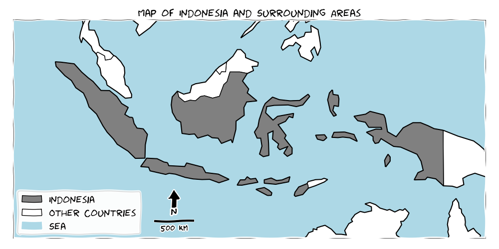
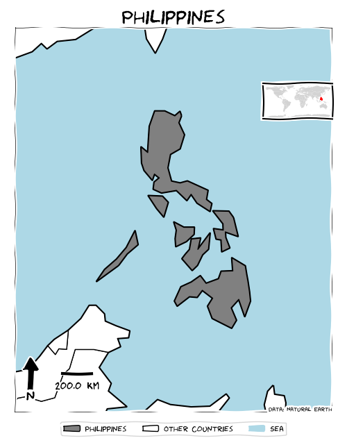
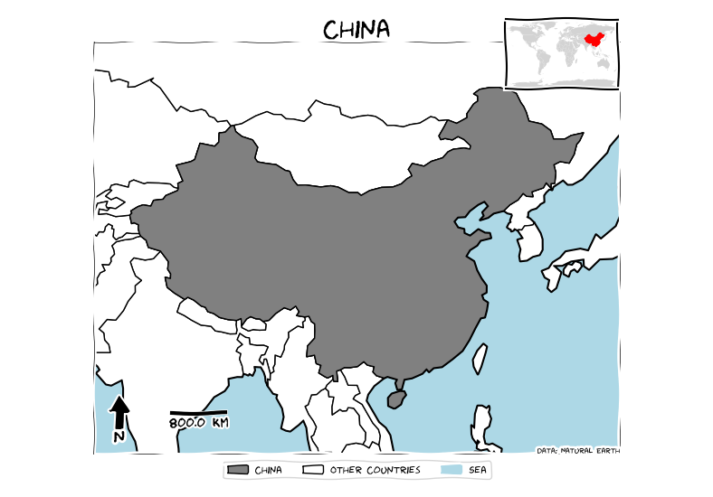
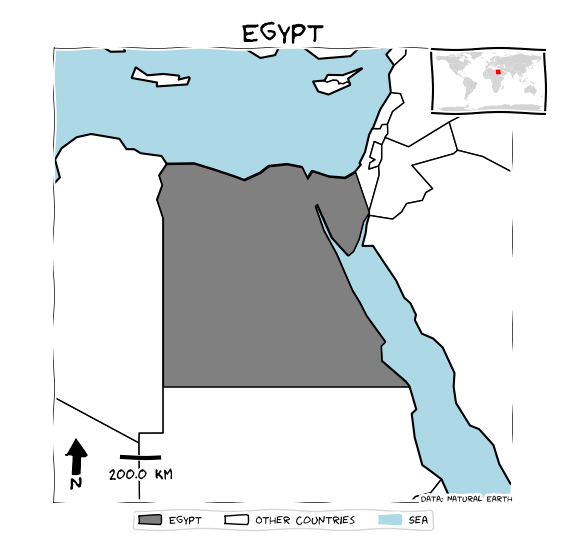
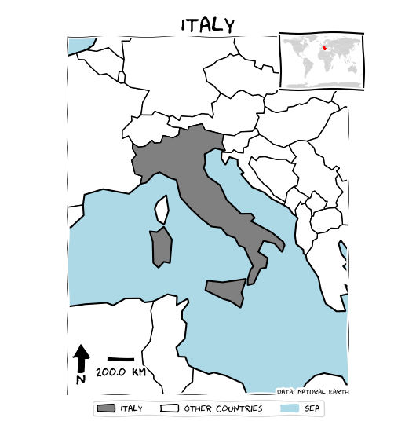
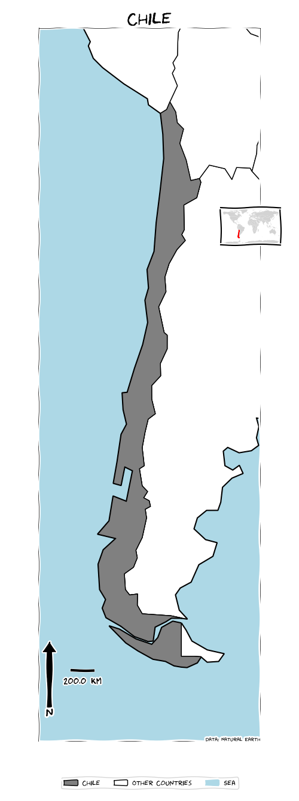

This is example result of Python script that could generate a xkcd-style for Country Map.

Example:

::: {.image-gallery}
::: {.gallery-item}

:::
::: {.gallery-item}

:::
::: {.gallery-item}

:::
::: {.gallery-item}

:::
::: {.gallery-item}

:::
::: {.gallery-item}

:::
:::

And the code is below, You can paste the below code into an online Python compiler like <https://python-fiddle.com/> and grab the result instantly.

::: {.callout-note collapse="true" title="Python - XKCD country map"}
```python
"""
NAME
    xkcd_countrymap.py
DESCRIPTION
    Generate a country map using XKCD style.
USAGE
    You can paste the below code into an online Python compiler like https://python-fiddle.com/
    and grab the result instantly. Don't forget to change the country name in line 41.
    The script used column NAME as country name identification from the Natural Earth data: 
    https://naciscdn.org/naturalearth/110m/cultural/ne_110m_admin_0_countries.zip
NOTES
    The output is similar to what ReliefWeb's location maps do but in a more informal way.
    The map includes a title, inset, north arrow, scale bar, and legend. 
    The map doesn't show country labels on it due to the complicated script and XKCD font issues.
    This map is just for fun.
    It uses low-resolution Natural Earth boundaries, which may not be comparable to the official 
    boundaries from each country, the United Nations, or the World Bank.
    To use the XKCD font, ensure it is installed correctly on your system. 
    You can download it from: https://github.com/ipython/xkcd-font/tree/master/xkcd-script/font
CONTACT
    Benny Istanto
    Climate Geographer
    GOST/DECSC/DECDG, The World Bank
LICENSE
    This script is in the public domain, free from copyrights or restrictions.
VERSION
    $Id$
TODO
    Add country labels to the map.
    Add handling on country who located in central meridian, like Fiji.
"""
import matplotlib.pyplot as plt
import geopandas as gpd
from shapely.geometry import box
from matplotlib.patches import Polygon, Rectangle
import matplotlib.patheffects as PathEffects
import numpy as np

# Define the country name
# This is the main country that will be highlighted in the map.
country_name = "Indonesia"

# Load the world shapefile dataset from Natural Earth
# This dataset contains the geometries of all countries.
world = gpd.read_file(gpd.datasets.get_path('naturalearth_lowres'))

# Get the bounding box for the country
# This retrieves the geometry of the specified country and calculates its bounding box.
country_geom = world[world.name == country_name].geometry.unary_union
bbox = country_geom.bounds

# Add a buffer of 5 degrees
# The buffer adds extra space around the country's bounding box to ensure the map isn't too tight around the edges.
buffer = 5
bbox = (bbox[0] - buffer, bbox[1] - buffer, bbox[2] + buffer, bbox[3] + buffer)

# Clip the world data to the bounding box
# This clips the world dataset to the bounding box of the specified country.
bbox_shape = box(*bbox)
world_clip = world[world.intersects(bbox_shape)]

# Calculate the aspect ratio of the bounding box
# This ensures the plot maintains the correct aspect ratio based on the bounding box dimensions.
bbox_width = bbox[2] - bbox[0]
bbox_height = bbox[3] - bbox[1]
aspect_ratio = bbox_width / bbox_height

# Set minimum width for the figure to avoid extremely thin plots
# This sets a minimum width for the plot and adjusts the height accordingly.
min_width = 5
fig_width = max(min_width, aspect_ratio * 5)
fig_height = fig_width / aspect_ratio + 0.5  # Add extra space for the legend

# Set XKCD style
# This applies the XKCD style to the plot for a hand-drawn, comic-like appearance.
plt.xkcd()

# Create the plot with dynamic figsize
# This creates the figure and axes objects with the specified dimensions.
fig, ax = plt.subplots(1, 1, figsize=(fig_width, fig_height), tight_layout=True)
plt.subplots_adjust(bottom=1.5 / fig_height)

# Set the plot limits to the bounding box
# This sets the x and y limits of the plot to match the bounding box.
ax.set_xlim(bbox[0], bbox[2])
ax.set_ylim(bbox[1], bbox[3])

# Plot the sea with light blue color within the bbox
# This adds a light blue rectangle to represent the sea within the bounding box.
ax.add_patch(Rectangle((bbox[0], bbox[1]), 
                       bbox_width, bbox_height, 
                       color='#ADD8E6', zorder=0))

# Plot all countries
# This plots the boundaries and fills for all countries within the clipped area.
world_clip.boundary.plot(ax=ax, edgecolor='black', zorder=2)
world_clip.plot(ax=ax, color='white', edgecolor='black', zorder=3)

# Highlight the specified country in grey
# This highlights the specified country in grey.
highlight_country = world_clip[world_clip.name == country_name]
highlight_country.plot(ax=ax, color='grey', edgecolor='black', zorder=4)

# Plot the rectangle border for bbox
# This adds a border around the bounding box.
bbox_patch = Polygon([(bbox[0], bbox[1]), (bbox[0], bbox[3]), 
                      (bbox[2], bbox[3]), (bbox[2], bbox[1]), 
                      (bbox[0], bbox[1])], closed=True, 
                     edgecolor='black', facecolor='none', linewidth=0.5, zorder=5)
ax.add_patch(bbox_patch)

# Add title
# This adds a title to the plot.
plt.title(f'{country_name}', fontsize=20)

# Remove axes
# This removes the axes for a cleaner look.
ax.set_axis_off()

# Calculate dynamic scale bar length
# This calculates the scale bar length dynamically based on the bounding box width.
bbox_width_km = bbox_width * 111  # approximate conversion from degrees to kilometers
scalebar_length = round(bbox_width_km / 10, -int(np.floor(np.log10(bbox_width_km / 10))))  # scale bar length to a rounded number

# Adjust the position of the scale bar
# This sets the position for the scale bar.
scale_bar_x_offset = 0.15 * (bbox[2] - bbox[0])
scale_bar_y_offset = 0.05 * (bbox[3] - bbox[1])

# Add scale bar next to the north arrow
# This plots the scale bar on the map.
scale_x = bbox[0] + 0.15 * (bbox[2] - bbox[0])
scale_y = bbox[1] + 0.1 * (bbox[3] - bbox[1])
scale_length_deg = scalebar_length / 111  # approximate conversion from km to degrees

# Plot the scale bar
ax.plot([scale_x, scale_x + scale_length_deg], [scale_y, scale_y], color='k', linewidth=3, zorder=6)
ax.text(scale_x + scale_length_deg / 2, scale_y - 0.5, f'{scalebar_length} km', ha='center', va='top', fontsize=12, color='k',
        path_effects=[PathEffects.withStroke(linewidth=3, foreground="white")], zorder=6)

# Add north arrow
# This adds a north arrow to the map.
x, y, arrow_length = 0.05, 0.14, 0.1
ax.annotate('N', xy=(x, y), xytext=(x, y - arrow_length),
            arrowprops=dict(facecolor='black', width=5, headwidth=15),
            ha='center', va='center', fontsize=15,
            xycoords=ax.transAxes, zorder=6)

# Calculate dynamic font size for legend
# This calculates the font size for the legend dynamically based on the bounding box width.
legend_font_size = min(8, bbox_width * 10)  # Adjust the multiplier as needed

# Add custom legend with adjusted font size
# This adds a legend to the map with the specified font size.
legend_patches = [
    Polygon([(0,0)], closed=True, edgecolor='black', facecolor='grey', label=country_name),
    Polygon([(0,0)], closed=True, edgecolor='black', facecolor='white', label='Other Countries'),
    Rectangle((0,0),1,1, color='#ADD8E6', label='Sea')
]
legend = plt.legend(handles=legend_patches, loc='lower center', bbox_to_anchor=(0.5, -0.07), ncol=3, fontsize=legend_font_size)

# Add data source label
# This adds a label indicating the data source at the bottom right of the map.
plt.text(bbox[2], bbox[1], "Data: Natural Earth", fontsize=6, ha='right', va='bottom', zorder=6)

# Add world map inset
# This adds an inset world map to the top right corner of the plot.
inset_width = 0.2
inset_height = inset_width * (fig_height / fig_width)

# Calculate the top right corner of the main map in figure coordinates
bbox_main = ax.get_position()
inset_left = bbox_main.x1 - inset_width
inset_bottom = bbox_main.y1 - inset_height

# Adjust inset position to align with top right corner of the main map area
inset_ax = fig.add_axes([inset_left, inset_bottom, inset_width, inset_height])
world.plot(ax=inset_ax, color='lightgrey')
highlight_country_inset = world[world.name == country_name]
highlight_country_inset.plot(ax=inset_ax, color='red', edgecolor='red')
inset_ax.set_xticks([])
inset_ax.set_yticks([])
inset_ax.set_xlim(-180, 180)
inset_ax.set_ylim(-90, 90)

# Show the plot
# This displays the final map.
plt.show()
```
:::

Source: <https://gist.github.com/bennyistanto/7b391b11e861334bc020dd03c06815f2>