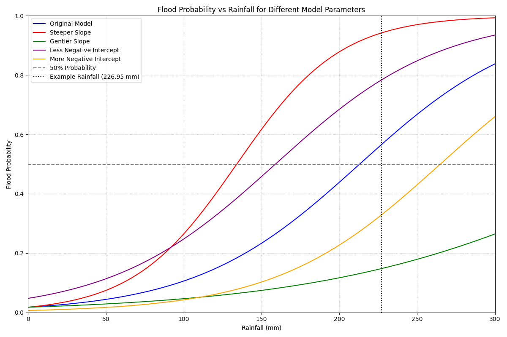
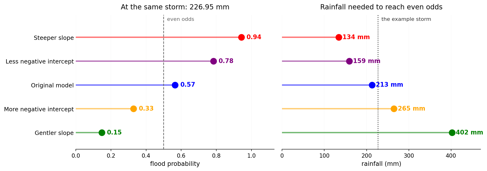

A logistic regression is the standard way to turn a continuous thing into a probability. You want to know how likely a flood is given a certain amount of rain, so you fit:

$$
P(\text{flood}) = \frac{1}{1 + e^{-(\beta_1 R + \beta_0)}}
$$

where $R$ is rainfall. Two parameters, a slope and an intercept, and that is the entire model.

Fitting it gives you two numbers. Mine were a slope of 0.01888 and an intercept of -4.0219, which tell you nothing at all until you do something with them.

## What the numbers actually mean

Coefficients from a logistic model are not readable. The slope is in log-odds per millimetre, which is not a unit anyone has intuition for. So I wrote fifteen lines to plot the curve, and then plotted four variations alongside it.

```python
def flood_probability(rainfall, slope, intercept):
    g = slope * rainfall + intercept
    return 1 / (1 + np.exp(-g))
```



The vertical dotted line is a specific storm, 226.95 mm, that I wanted to check the model against.

Once it is drawn, two things become obvious that were not obvious from the coefficients.

**The intercept moves the curve sideways.** It sets how much rain you need before the probability starts climbing at all. The purple and orange curves have the same slope as the original and differ only here, and they are the same shape shifted left and right.

**The slope sets how decisive the model is.** A steep curve goes from "unlikely" to "very likely" over a narrow band of rainfall. A gentle one never really commits to anything.

## The quantity worth reporting

The one number I would put in a report is where the curve crosses 50 per cent, because that has a plain-language meaning: the rainfall at which a flood becomes more likely than not.

It falls straight out of the two coefficients:

$$
R_{50} = -\frac{\beta_0}{\beta_1}
$$

For the fitted model that is $4.0219 / 0.01888 = 213$ mm.

That is a sentence anyone can act on. "Above about 213 millimetres, this catchment floods more often than not" is worth saying out loud. "The slope is 0.01888" is not.

## Same storm, five answers

Now put the example storm through all five parameter sets.



Same rain, same question, and the answer runs from **0.15 to 0.94**. One model says the flood probably will not happen and another says it is close to certain.

The right-hand panel is the same disagreement stated as a threshold. The five parameter sets want between 134 mm and 402 mm of rain before they will call even odds. That is a spread of nearly three to one, from changes to the coefficients that all look small written down.

The gentler-slope case is the one I find most instructive. Halving the slope from 0.01888 to 0.01 sounds like a modest adjustment. It pushes the 50 per cent crossing from 213 mm out to 402 mm, which is off the right-hand edge of the original plot entirely. Within the range of rainfall that actually occurs, that model never commits to a flood at all.

## Why this is worth fifteen lines

None of this is sophisticated. It is a sigmoid, plotted five times.

But a logistic model is very easy to fit and very easy to hand over as a pair of coefficients, and coefficients hide exactly the thing an operational user needs to know: how sharp is the transition, and where does it sit. Two models with similar-looking parameters can disagree completely about the storm in front of you.

The other thing the picture makes visible is how wide the transition is. Under the fitted model it takes about 116 mm of additional rain to go from a 25 per cent chance to a 75 per cent chance. That is a very gentle ramp. It means the model is not really identifying a threshold at all, it is expressing a broad tendency, and anyone hoping to use it as a trigger should know that before they wire it to an alert.

I would rather find that out from a plot in fifteen lines than from a system that fired late.

::: {.callout-note collapse="true" title="Python - the whole thing"}
```python
import numpy as np
import matplotlib.pyplot as plt


def flood_probability(rainfall, slope, intercept):
    g = slope * rainfall + intercept
    return 1 / (1 + np.exp(-g))


rainfall = np.linspace(0, 300, 1000)

scenarios = [
    {"slope": 0.01888, "intercept": -4.0219, "label": "Original Model", "color": "blue"},
    {"slope": 0.03,    "intercept": -4.0219, "label": "Steeper Slope", "color": "red"},
    {"slope": 0.01,    "intercept": -4.0219, "label": "Gentler Slope", "color": "green"},
    {"slope": 0.01888, "intercept": -3,      "label": "Less Negative Intercept", "color": "purple"},
    {"slope": 0.01888, "intercept": -5,      "label": "More Negative Intercept", "color": "orange"},
]

plt.figure(figsize=(12, 8))
for s in scenarios:
    plt.plot(rainfall, flood_probability(rainfall, s["slope"], s["intercept"]),
             label=s["label"], color=s["color"])

plt.axhline(y=0.5, color='gray', linestyle='--', label='50% Probability')
plt.axvline(x=226.95, color='black', linestyle=':', label='Example Rainfall (226.95 mm)')

plt.xlabel('Rainfall (mm)')
plt.ylabel('Flood Probability')
plt.title('Flood Probability vs Rainfall for Different Model Parameters')
plt.legend()
plt.grid(True, which='both', linestyle=':', color='gray', alpha=0.5)
plt.ylim(0, 1)
plt.xlim(0, 300)
plt.tight_layout()
plt.show()
```
:::

It needs nothing but numpy and matplotlib, so it runs in any online Python sandbox if you want to try your own coefficients without setting anything up. The [gist is here](https://gist.github.com/bennyistanto/05fd4bc54b31728d07703ace60ec885d).
