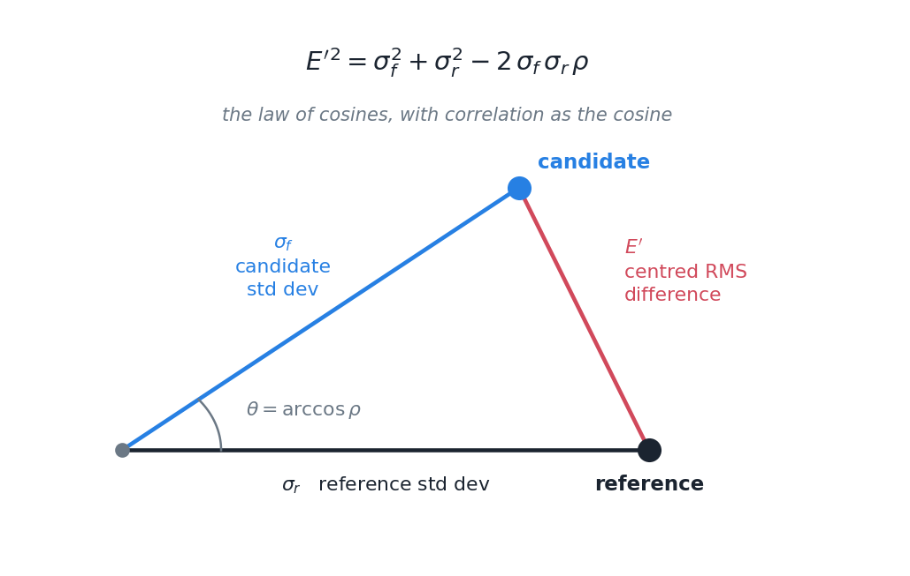
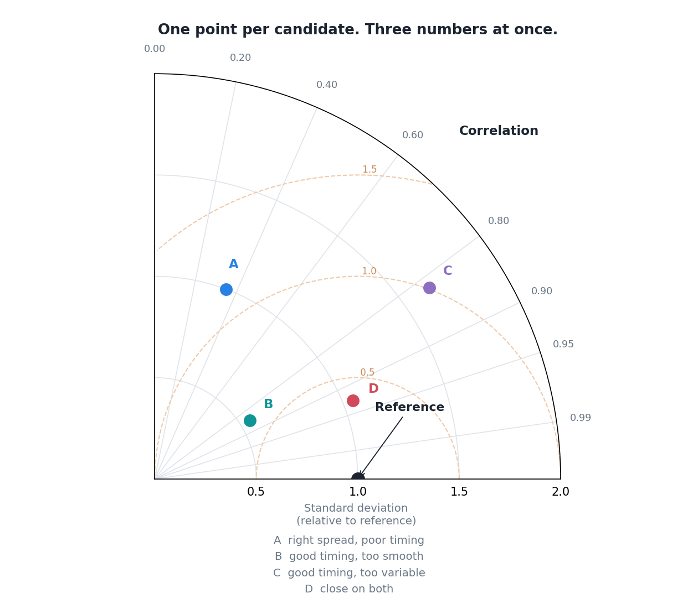

I have four candidate corrections and a reference, and I want to know which is best. The obvious approach is a table: correlation, standard deviation, RMS difference, one row per candidate.

Tables are fine for four. They stop working at forty, and they stop working entirely when you want to see a hundred and seventy stations at once. So people use a Taylor diagram, and for a while I could read one without really understanding why it worked.

## The trick

Here is the thing that makes it possible. The centred RMS difference between a candidate and the reference, their two standard deviations, and their correlation are not four independent numbers. They are related:

$$
E'^2 = \sigma_f^2 + \sigma_r^2 - 2\,\sigma_f\,\sigma_r\,\rho
$$

If that looks familiar it should. It is the law of cosines, with $\rho$ playing the role of $\cos\theta$.



Which means you can draw it. Put the reference on the horizontal axis at a distance equal to its standard deviation. Put each candidate at a radius equal to *its* standard deviation, and at an angle whose cosine is the correlation. The straight-line distance between the two points is then the RMS difference, automatically, because the geometry enforces the identity.

Three statistics. One point. No extra information encoded, nothing squeezed in by convention: the relationship is genuinely a triangle and the diagram is genuinely that triangle.

## Reading one



Three things to look at, in this order.

**Angle.** Sweeping anticlockwise from the horizontal takes you from correlation 1.0 down towards 0. A point near the horizontal axis has good timing. Candidate A is high up, which means it gets the timing badly wrong.

**Radius.** Distance from the origin is variability. The grey arc through the reference point is the "correct" amount. Inside it the candidate is too smooth, outside it too noisy. B sits well inside: it has decent timing but has flattened the variability. C sits outside: similar timing, too much variance.

**Distance to the reference point.** That is the RMS difference, and it is the thing to minimise. The dashed arcs are contours of it. D is closest, and D is the one to pick.

Once you have those three moves, a diagram with a hundred and seventy points on it reads at a glance. Clusters of stations behaving similarly, outliers sitting on their own, and whether a method moved points towards the reference or just moved them around.

## What it leaves out

Two things, and both matter for what I am doing.

**It is blind to the mean.** The RMS difference in that identity is the *centred* one: the means are subtracted before it is computed. So a candidate that is uniformly 40% too wet everywhere, but gets the timing and the variability exactly right, plots directly on top of the reference point. A perfect score for a product with a large systematic bias.

That is not a flaw so much as a division of labour, and it is one you have to remember. Bias needs reporting separately, always, next to the diagram.

**It says nothing about extremes.** Standard deviation and correlation are whole-distribution statistics. A candidate that reproduces the ordinary days beautifully and flattens every heavy event will still look good, because the heavy events are a small fraction of the sample and contribute little to either number.

For rainfall, where the heavy events are frequently the entire reason anyone wants the data, that is a serious blind spot. It has to be covered by something else: threshold-based detection scores, or a look at the tail directly.

## Where I have landed

A Taylor diagram is a good summary and a bad verdict. It answers "how do these candidates compare on timing and variability" clearly and compactly, and it will happily let a badly biased product with flattened extremes look like the winner.

So I use it, and I never use it alone.

The original is Taylor, K.E. (2001), *Summarizing multiple aspects of model performance in a single diagram*, Journal of Geophysical Research: Atmospheres. [10.1029/2000JD900719](https://doi.org/10.1029/2000JD900719)

## Drawing one

Once you know it is a triangle, plotting it is short. The whole diagram is a polar axis with correlation on the angle and standard deviation on the radius, plus arcs centred on the reference point for the RMS contours.

::: {.callout-note collapse="true" title="Python - the essentials of a Taylor diagram"}
```python
import numpy as np
import matplotlib.pyplot as plt

fig = plt.figure(figsize=(8, 7))
ax = fig.add_subplot(111, projection="polar")
ax.set_thetamin(0); ax.set_thetamax(90)          # one quadrant is enough
RMAX = 2.0

# correlation lives on the angle
for r in [0.0, 0.2, 0.4, 0.6, 0.8, 0.9, 0.95, 0.99]:
    theta = np.arccos(r)
    ax.plot([theta, theta], [0, RMAX], color="#dfe4ea", lw=0.8)
    ax.text(theta, RMAX * 1.06, f"{r:.2f}", ha="center", fontsize=8.5)

# RMS difference contours: circles centred on the reference at radius 1
for crms in [0.5, 1.0, 1.5]:
    t = np.linspace(0, np.pi, 300)
    x, y = 1.0 + crms * np.cos(t), crms * np.sin(t)
    rr, tt = np.hypot(x, y), np.arctan2(y, x)
    keep = (rr <= RMAX) & (tt >= 0) & (tt <= np.pi / 2)
    ax.plot(tt[keep], rr[keep], color="#f0c9a8", lw=1.0, ls="--")

ax.plot(0, 1.0, "o", ms=11, color="#1b2430")     # the reference itself

# one point per candidate: angle = arccos(r), radius = its standard deviation
for sd, r, col in [(1.00, 0.35, "#2780e3"), (0.55, 0.85, "#0e9594"),
                   (1.65, 0.82, "#8e6fbf"), (1.05, 0.93, "#d1495b")]:
    ax.plot(np.arccos(r), sd, "o", ms=10, color=col)
```
:::
