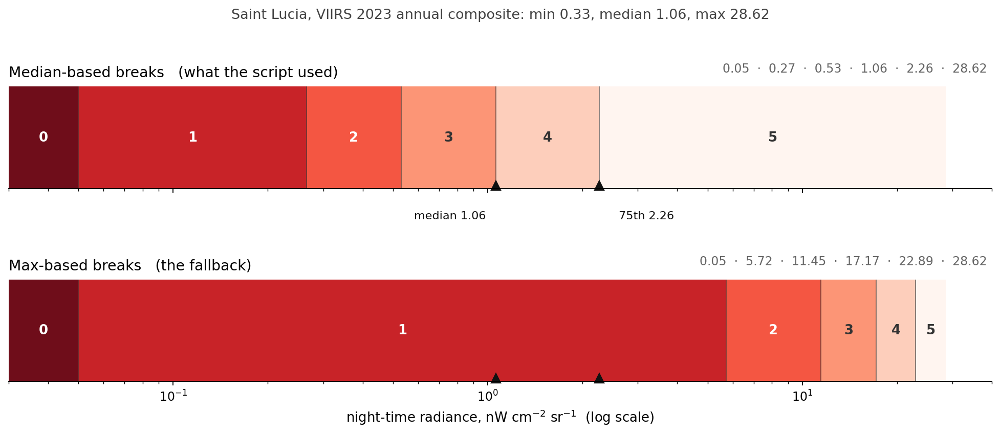
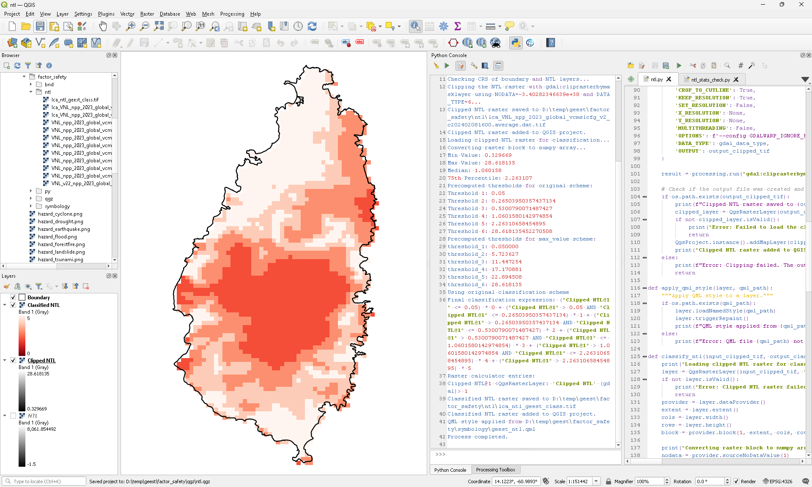

A colleague needed night-time lights turned into six classes, for every country in a project covering Small Island Developing States. Same method everywhere, so the results are comparable.

The project is [GEEST](https://github.com/worldbank/GEEST), which maps the enabling environment for women's employment in the renewable energy sector across the Caribbean, the Pacific, West Africa and the Indian Ocean. One of the things it accounts for is whether a place feels safe to move through after dark, and night-time light is the usual proxy for that. Not a perfect one, but the only one available at consistent resolution everywhere.

So: take the [VIIRS annual composite](https://eogdata.mines.edu/products/vnl/), clip it to a country, cut it into six classes. It sounds like an afternoon.

## Fixed thresholds do not survive contact with the data

The first instinct is to pick six radiance values and use them everywhere. That fails immediately, because the range varies enormously between countries. A threshold that separates "town" from "village" in Jamaica puts the whole of Nauru in one class.

The second instinct is equal intervals: take the maximum, divide by six. That is worse, and it is worth seeing why.



That is Saint Lucia. The VIIRS composite over the island runs from 0.33 to 28.62, with a median of 1.06 and a 75th percentile of 2.26.

Look at the bottom bar, the equal-interval one. Its first break after zero is at 5.72. The median is 1.06 and the 75th percentile is 2.26, so **both of them sit inside class 1**. At least three quarters of the country lands in the bottom two classes, and the top four classes are sharing whatever is left. You would produce a map that is almost entirely one colour, and the six classes would be a fiction.

This is what a heavily skewed distribution does to equal intervals. Night lights are dominated by a small number of very bright pixels, and the mean and maximum both live out in that tail with almost none of the country for company.

## Breaks that follow the data

The top bar is what the script actually uses. Only the first break is fixed:

| Class | Meaning | Upper bound | Saint Lucia |
|---|---|---|---|
| 0 | No access | 0.05 | 0.05 |
| 1 | Very low | 0.25 × median | 0.27 |
| 2 | Low | 0.50 × median | 0.53 |
| 3 | Moderate | median | 1.06 |
| 4 | High | 75th percentile | 2.26 |
| 5 | Very high | maximum | 28.62 |

Now the median falls on the boundary between classes 3 and 4, and the 75th percentile between 4 and 5. By construction, half the country is in classes 0 to 3 and a quarter is in class 5. Every class gets used, and the map has something to show.

The 0.05 floor is the one hard number, and it is the only one that means something in absolute terms: it is the project's working threshold for electricity access. Everything below it is treated as unlit, regardless of what the rest of the country looks like. That is why it stays fixed while the other five breaks move with the data.

Using percentiles rather than fixed values has support in the literature. [Levin and Zhang](https://doi.org/10.1016/j.rse.2017.01.006) use them in their global analysis of what actually controls VIIRS light levels, and [Elvidge and colleagues](https://doi.org/10.7125/APAN.35.7) make the broader argument that night-light analysis has to account for local context rather than applying one global scale. The idea of reading luminosity as a proxy for something socio-economic goes back further, to [Chen and Nordhaus](https://doi.org/10.1073/pnas.1017031108).

## When the rule breaks

Deriving breaks from the median works until the distribution has no shape to derive them from. Two cases, and the script tests for both:

```python
if use_max_value_scheme or max_value <= 0.05 or (max_value - percentile_75) <= 0.05 * max_value:
```

**The whole country is dark.** If the maximum is at or below 0.05, every threshold collapses onto the floor. There is no median worth taking a quarter of.

**The whole country is uniformly bright.** If the 75th percentile is within five per cent of the maximum, then the top three breaks are effectively the same number, and classes 4 and 5 have nowhere to live.

Both sound like edge cases until you remember the country list. Nauru is 21 square kilometres. At the 15 arc-second resolution of the annual composite that is about a hundred pixels, most of them containing some part of the same settlement. Niue, Tuvalu, the Marshall Islands: these are places where the entire national territory is smaller than one city in the datasets these methods were designed on.

For those, the equal-interval scheme is the right answer, precisely because there is no distribution to follow. The fallback is not a worse method. It is the correct method for a degenerate case, and the test decides which situation you are in rather than making you guess.

The script computes both sets of thresholds and prints them either way, which I would keep. Seeing the scheme you did not use is how you notice when the choice was marginal.

The whole decision is small enough to draw:

```{mermaid}
flowchart TD
    A[Clip NTL to country] --> B{"max ≤ 0.05?"}
    B -- yes, everything unlit --> F[Equal intervals on max]
    B -- no --> C{"75th percentile within<br/>5% of max?"}
    C -- yes, no spread --> F
    C -- no --> G[Breaks from median and 75th]
    G --> H[Six classes]
    F --> H
```

Equal intervals are not the fallback because they are worse. They are the fallback because they are the only thing that works when there is no distribution to follow.

## What it cannot tell you

The write-up that preceded the script is careful about this, and the caveats are worth carrying into any map that comes out of it.

**Overglow.** Light appears to spread beyond its actual source, so lit areas come out larger than they are. [Small and colleagues](https://doi.org/10.1016/j.rse.2005.02.002) documented this for the DMSP-OLS era and it has not gone away.

**Saturation.** In genuinely bright urban centres the sensor tops out, and everything above that point looks the same. For most of the countries here that is not a problem, since there is no city bright enough. For Jamaica or the Dominican Republic it might be.

**Rural underrepresentation.** At roughly 460 metres a pixel, small-scale lighting in a scattered rural settlement may not register at all. A village with a dozen lights and a village with none can look identical.

**Time.** A single year is a single year. [Xie and colleagues](https://doi.org/10.1016/j.rse.2019.03.008) show how much artificial light varies between years, so a multi-year average is the safer input if you have one and the question is about infrastructure rather than about a particular year.

None of these are reasons not to use night lights. They are reasons to describe what the map is: a proxy, computed a specific way, with a floor at the electricity access threshold and five breaks that move with the country.

## The NODATA trap

One detail that would have quietly ruined everything.

When you clip a raster you have to nominate a NODATA value for the area outside the boundary. The obvious choice is zero.

For night lights, zero is a real measurement. It means dark, which describes most of the rural land in most of these countries. Use it as NODATA and you delete exactly the areas the safety analysis is most interested in.

So the script picks a sentinel that cannot collide with real data, chosen from the raster's own type:

```python
def determine_nodata_value_and_type(data_type):
    if data_type == 1:    # Byte
        return 255, 1
    elif data_type == 3:  # Int16
        return -32768, 2
    elif data_type == 6:  # Float32
        return -3.40282346639e+38, 6
    ...
```

The VIIRS composite is Float32, so the clip runs with `NODATA=-3.4e38`, a number no radiometer will ever produce.

## A note if you want to run it

The script is written for the QGIS Python console, and it takes advantage of that: `iface`, `QgsFillSymbol`, `QgsRasterCalculator` and `QgsRasterCalculatorEntry` are all injected into the console namespace, so the original never imports them. Paste it into the console and it works. Save it as a file and run it standalone and you get a `NameError`.

The version below has the imports added, so it works either way.

::: {.callout-note collapse="true" title="Python - PyQGIS night lights clip and classify"}
```python
import os
import numpy as np
from qgis.core import (
    QgsRasterLayer, QgsVectorLayer, QgsProject, QgsFillSymbol,
)
from qgis.analysis import QgsRasterCalculator, QgsRasterCalculatorEntry
import processing


def add_layer_if_not_exists(layer, layer_name, zoom_to_layer=False):
    """Add a layer to the project unless a layer of that name is already there."""
    if not QgsProject.instance().mapLayersByName(layer_name):
        QgsProject.instance().addMapLayer(layer)
        print(f"Layer {layer_name} added to QGIS project.")
        if zoom_to_layer:
            iface.mapCanvas().setExtent(layer.extent())   # console only
            iface.mapCanvas().refresh()
    else:
        print(f"Layer {layer_name} already exists in QGIS project.")


def set_boundary_layer_style(layer):
    """Transparent fill, black outline, so the boundary reads over the raster."""
    symbol = QgsFillSymbol.createSimple({
        'color': 'transparent', 'outline_color': 'black', 'outline_width': '0.6'})
    layer.renderer().setSymbol(symbol)
    layer.triggerRepaint()


def determine_nodata_value_and_type(data_type):
    """Pick a NODATA sentinel that cannot collide with a real measurement.

    Zero is not available: for night lights it means 'dark', which is most of
    the rural land in most of these countries.
    """
    if data_type == 1:      # Byte
        return 255, 1
    elif data_type == 2:    # UInt16
        return 65535, 3
    elif data_type == 3:    # Int16
        return -32768, 2
    elif data_type == 4:    # UInt32
        return 4294967295, 4
    elif data_type == 5:    # Int32
        return -2147483648, 5
    elif data_type == 6:    # Float32
        return -3.40282346639e+38, 6
    elif data_type == 7:    # Float64
        return -1.7976931348623157e+308, 7
    elif data_type == 12:   # Int8
        return -128, 12
    raise ValueError(f"Unsupported data type: {data_type}")


def clip_ntl(input_global_tif, country_boundary_shp, output_clipped_tif):
    ntl_layer = QgsRasterLayer(input_global_tif, "NTL")
    boundary_layer = QgsVectorLayer(country_boundary_shp, "Boundary", "ogr")
    if not ntl_layer.isValid() or not boundary_layer.isValid():
        print("Error: an input layer failed to load.")
        return

    add_layer_if_not_exists(ntl_layer, "NTL")
    add_layer_if_not_exists(boundary_layer, "Boundary", zoom_to_layer=True)
    set_boundary_layer_style(boundary_layer)

    # The boundary must be in the raster's CRS, not the other way round:
    # reprojecting the raster would resample the radiance values.
    if boundary_layer.crs() != ntl_layer.crs():
        print("Reprojecting boundary to match the NTL CRS...")
        boundary_layer = processing.run("native:reprojectlayer", {
            'INPUT': boundary_layer,
            'TARGET_CRS': ntl_layer.crs(),
            'OUTPUT': 'memory:',
        })['OUTPUT']

    data_type = ntl_layer.dataProvider().dataType(1)
    nodata_value, gdal_data_type = determine_nodata_value_and_type(data_type)

    print(f"Clipping with NODATA={nodata_value}, DATA_TYPE={gdal_data_type}...")
    processing.run("gdal:cliprasterbymasklayer", {
        'INPUT': ntl_layer,
        'MASK': boundary_layer,
        'NODATA': nodata_value,
        'ALPHA_BAND': False,
        'CROP_TO_CUTLINE': True,
        'KEEP_RESOLUTION': True,
        'MULTITHREADING': False,
        'OPTIONS': f'--config GDALWARP_IGNORE_BAD_CUTLINE=YES -dstnodata {nodata_value}',
        'DATA_TYPE': gdal_data_type,
        'OUTPUT': output_clipped_tif,
    })

    if not os.path.exists(output_clipped_tif):
        print("Error: clipping produced no output.")
        return
    clipped = QgsRasterLayer(output_clipped_tif, "Clipped NTL")
    if clipped.isValid():
        QgsProject.instance().addMapLayer(clipped)
        print(f"Clipped NTL raster saved to {output_clipped_tif}")


def apply_qml_style(layer, qml_path):
    if os.path.exists(qml_path):
        layer.loadNamedStyle(qml_path)
        layer.triggerRepaint()
        print(f"QML style applied from {qml_path}")
    else:
        print(f"Error: QML file {qml_path} not found.")


def classify_ntl(input_clipped_tif, output_classified_tif, qml_path,
                 use_max_value_scheme=False):
    layer = QgsRasterLayer(input_clipped_tif, "Clipped NTL")
    if not layer.isValid():
        print("Error: clipped NTL raster failed to load.")
        return

    provider = layer.dataProvider()
    extent, cols, rows = layer.extent(), layer.width(), layer.height()
    block = provider.block(1, extent, cols, rows)
    nodata = provider.sourceNoDataValue(1)

    data = np.array([[block.value(i, j) for j in range(cols)] for i in range(rows)])
    valid = data[~np.isnan(data) & (data != nodata)]
    if valid.size == 0:
        print("No valid data found.")
        return

    min_value = float(np.min(valid))
    max_value = float(np.max(valid))
    median = float(np.median(valid))
    percentile_75 = float(np.percentile(valid, 75))
    print(f"Min {min_value:.6f} | Max {max_value:.6f} | "
          f"Median {median:.6f} | p75 {percentile_75:.6f}")

    # Scheme A: breaks follow the distribution. Only the floor is fixed.
    med_breaks = [0.05, 0.25 * median, 0.5 * median, median, percentile_75, max_value]
    # Scheme B: equal intervals on the maximum, for degenerate distributions.
    max_breaks = [0.05, 0.2 * max_value, 0.4 * max_value,
                  0.6 * max_value, 0.8 * max_value, max_value]

    print("median-based:", [round(b, 4) for b in med_breaks])
    print("max-based   :", [round(b, 4) for b in max_breaks])

    # Fall back to equal intervals when the median scheme has nothing to work
    # with: everything dark, or everything the same brightness.
    degenerate = max_value <= 0.05 or (max_value - percentile_75) <= 0.05 * max_value
    breaks = max_breaks if (use_max_value_scheme or degenerate) else med_breaks
    print("Using", "max_value" if breaks is max_breaks else "original", "scheme")

    r = '"Clipped NTL@1"'
    expr_str = (
        f'({r} <= {breaks[0]}) * 0 + '
        + ' + '.join(
            f'({r} > {breaks[k-1]} AND {r} <= {breaks[k]}) * {k}' for k in range(1, 5))
        + f' + ({r} > {breaks[4]}) * 5'
    )
    print("Expression:", expr_str)

    entry = QgsRasterCalculatorEntry()
    entry.ref, entry.raster, entry.bandNumber = 'Clipped NTL@1', layer, 1

    calc = QgsRasterCalculator(expr_str, output_classified_tif, 'GTiff',
                               extent, cols, rows, [entry])
    if calc.processCalculation() != 0:
        print("Error during classification.")
        return

    classified = QgsRasterLayer(output_classified_tif, "Classified NTL")
    if classified.isValid():
        QgsProject.instance().addMapLayer(classified)
        apply_qml_style(classified, qml_path)
        print(f"Classified NTL raster saved to {output_classified_tif}")


# ---- edit these five paths, then run ------------------------------------
base = r'D:\temp\geest\factor_safety'
input_global_tif = os.path.join(
    base, 'ntl', 'VNL_npp_2023_global_vcmslcfg_v2_c202402081600.average.dat.tif')
country_boundary_shp = os.path.join(base, 'bnd', 'lca_admbnda_adm0_gov_2019.shp')
output_clipped_tif = os.path.join(base, 'ntl', 'lca_VNL_npp_2023_clipped.tif')
output_classified_tif = os.path.join(base, 'ntl', 'lca_ntl_geest_class.tif')
qml_path = os.path.join(base, 'symbology', 'geest_ntl.qml')

print("Starting process...")
clip_ntl(input_global_tif, country_boundary_shp, output_clipped_tif)
classify_ntl(output_clipped_tif, output_classified_tif, qml_path,
             use_max_value_scheme=False)
print("Process completed.")
```
:::



The styling is a QML file with six colours running from dark red for unlit ground to near-white for the brightest class, applied automatically so that every country in the project comes out looking the same. That part is not clever, but it is the difference between a method and a set of one-off maps.

Everything, including the QML, is [in a gist](https://gist.github.com/bennyistanto/7ec367ba090468ca0e6e888dd13f7f3e). The [method note that came first](https://gist.github.com/bennyistanto/32348d9a108898e30670a1f3924defc1) has the class definitions, the decision tree and the references in full.

## What I took from it

The thing I would carry to the next problem is not the thresholds. It is that the script computes both schemes every time and prints them, then chooses.

I could have written a single rule with the degenerate cases handled silently. Instead the console output says which scheme it used and shows you the one it rejected, which means that six months from now, looking at a map that seems wrong, the first question has already been answered.
