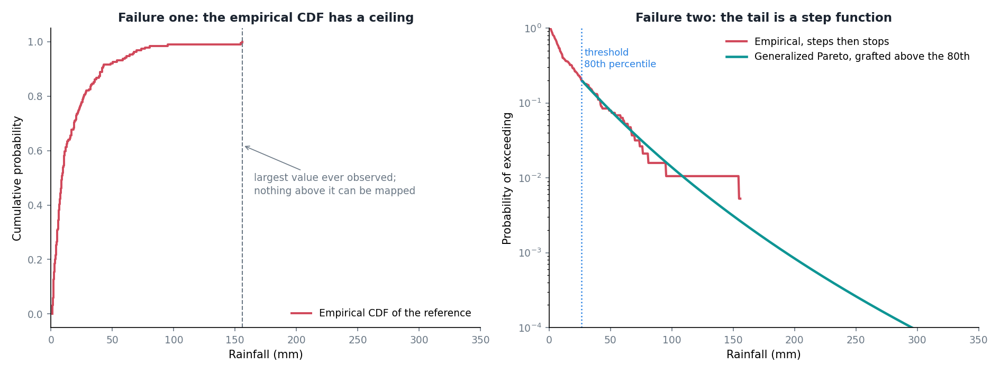

Quantile mapping is a lovely, simple idea. Take a value from the product you are correcting, find where it sits in that product's distribution, and replace it with the value that sits at the same place in the reference distribution. Do that for everything and the corrected product ends up with the reference's distribution while keeping the satellite's ordering of wet and dry days.

It works well. It works well right up until the part I actually care about, and then it fails in two specific ways that took me a while to name.

## Failure one: the ceiling

An empirical distribution is built from the values you have. Its largest quantile is the largest observation in the sample.

So if the reference for a given cell and dekad tops out at 156 mm, then 156 mm is the largest value quantile mapping can ever produce there. Feed it a satellite day of 300 mm and it will hand you back 156. Feed it 500 and it will still hand you back 156.



The corrected product is not merely wrong on those days. It is wrong in a systematic direction, and it is wrong specifically on the days when someone might need the number. Every genuinely extreme event gets flattened to the largest thing in the calibration record.

## Failure two: the staircase

Below the ceiling there is a subtler problem.

In the body of the distribution I might have a hundred and fifty wet days to work with, so the empirical curve is smooth enough. Above the 80th percentile I have maybe thirty. Above the 95th, seven or eight.

An empirical inverse distribution built from eight values is a step function with eight steps. Two satellite days a millimetre apart can land on the same step and come out identical, or land either side of one and come out twenty millimetres apart. The corrected values in the tail are not a smooth function of the input, they are quantised by the accident of which extreme days happened to fall in the calibration window.

You can see it in the right panel: the red line staggers downward in visible flat sections and then stops entirely.

## What a tail model buys

The fix is to stop using the empirical curve where it stops being trustworthy, and to fit something parametric above a threshold instead.

Extreme value theory has a specific answer for this. For exceedances above a high enough threshold, the distribution of how far they exceed it converges to a Generalized Pareto:

$$
P(X - u > x \mid X > u) = \left( 1 + \frac{\xi x}{\sigma} \right)^{-1/\xi}
$$

Two parameters. The scale $\sigma$ sets how quickly exceedances fall away. The shape $\xi$ decides the character of the tail: positive means heavier than exponential, which is what convective tropical rain tends to look like; zero is exponential; negative means the distribution has a hard upper bound.

Fit that above the 80th percentile, graft it onto the empirical body below, and both problems go away at once. The staircase becomes a curve because it is now a two-parameter function rather than eight isolated points. The ceiling disappears because a fitted distribution is happy to tell you the probability of 300 mm even though it has never seen 300 mm.

In the figure the fitted shape came out at $\xi = 0.095$, mildly heavy, and the green curve carries on past 250 mm where the empirical one gave up at 156.

## The part that makes me uneasy

Extrapolating beyond your data is exactly the thing you are taught not to do, and that is precisely what this does.

The defence is that it is a principled extrapolation. Extreme value theory says the tail should take this form, so fitting that form and extending it is not the same as drawing a line through the last two points and hoping. But it is still a model doing the talking beyond the range of the evidence, and the further out you go the more of the answer is model and the less is data.

Two things I have put in to keep it honest. The threshold is a choice, so the fit gets cross-validated across folds rather than trusted from one pass. And the output is capped near the top of the reference range, so the extrapolation cannot run away to a number that has no physical business existing.

Neither of those makes the extrapolation true. They just stop it being reckless. The 80th percentile threshold itself is a convention from the literature rather than something I optimised, which is a loose end I should come back to.

## The code

The fit is a few lines. The cross-validation around it is there because a shape parameter estimated once from thirty exceedances is not something to trust on its own.

::: {.callout-note collapse="true" title="Python - fit_generalized_pareto_distribution"}
```python
def fit_generalized_pareto_distribution(
        data,
        threshold
    ):
    """
    Fit a Generalized Pareto Distribution (GPD) to the excesses above the threshold.

    The GPD is often used in extreme value theory to model the tail of a distribution.
    It's particularly useful for modeling events that exceed a high threshold.

    Parameters:
    data (numpy.ndarray): Array of data values.
    threshold (float): Threshold value for defining the excesses.

    Returns:
    tuple: Fitted parameters of the GPD (shape, location, scale).
    """
    # Calculate excesses above the threshold
    excesses = data[data > threshold] - threshold

    # Check if there are enough excesses for reliable fitting
    if len(excesses) < 10:  # Arbitrary minimum number of points for GPD fitting
        return (0, 0, 1)  # Return a default GPD with zero shape, zero location, and unit scale

    # Fit the GPD to the excesses
    # genpareto.fit returns (shape, loc, scale)
    # Fix A (Coles 2001): pin location to 0 because we are fitting excesses
    # that are by construction non-negative. Allowing a free location can
    # drift and produces a small systematic bias in the upper tail.
    try:
        params = genpareto.fit(excesses, floc=0)
    except Exception:
        return (0.0, 0.0, 1.0)
    return params

# ----
# Cross-validate GPD fitting
```
:::

::: {.callout-note collapse="true" title="Python - cross_validate_gpd"}
```python
def cross_validate_gpd(
        data,
        threshold,
        n_splits=N_SPLITS_GPD_CROSSVALIDATE
    ):
    """
    Cross-validate GPD fitting by splitting data into folds.

    This function uses K-Fold cross-validation to assess the stability and reliability
    of the GPD parameter estimates.

    Parameters:
    data (numpy.ndarray): Array of data values.
    threshold (float): Threshold value for defining the excesses.
    n_splits (int, optional): Number of cross-validation splits. Default is 5.

    Returns:
    tuple: Averaged parameters of the GPD from cross-validation (shape, location, scale).
    """
    # Calculate excesses above the threshold
    excesses = data[data > threshold] - threshold

    # If there aren't enough excesses for cross-validation, fall back to simple fitting
    if len(excesses) < n_splits:
        return fit_generalized_pareto_distribution(data, threshold)

    # Initialize K-Fold cross-validator with shuffle for better stability
    # Precipitation excesses have temporal ordering; shuffling ensures
    # each fold samples across the full temporal range
    kf = KFold(n_splits=n_splits, shuffle=True, random_state=42)
    params_list = []

    # Perform cross-validation
    for train_index, test_index in kf.split(excesses):
        train_data, test_data = excesses[train_index], excesses[test_index]
        # Fit GPD to training data with floc=0 (Fix A, Coles 2001)
        try:
            params = genpareto.fit(train_data, floc=0)
            params_list.append(params)
        except Exception:
            continue

    if not params_list:
        return (0.0, 0.0, 1.0)

    # Calculate average parameters across all folds
    shape_avg = np.mean([params[0] for params in params_list])
    loc_avg = np.mean([params[1] for params in params_list])
    scale_avg = np.mean([params[2] for params in params_list])

    return shape_avg, loc_avg, scale_avg


# ----
# Fit CPC distribution parameters at native 0.5° resolution
```
:::

[`src/distribution_fitting.py`](https://github.com/bennyistanto/hybrid-bias-correction/blob/main/src/distribution_fitting.py)
