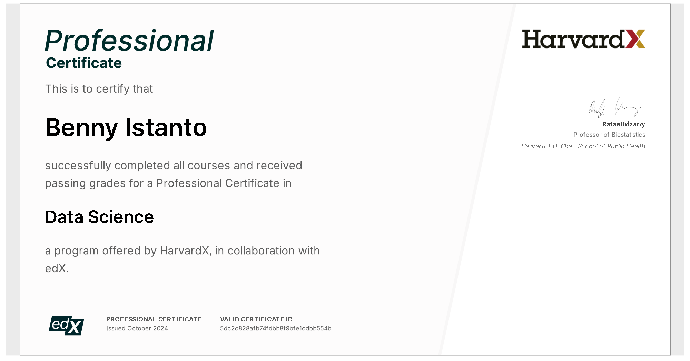
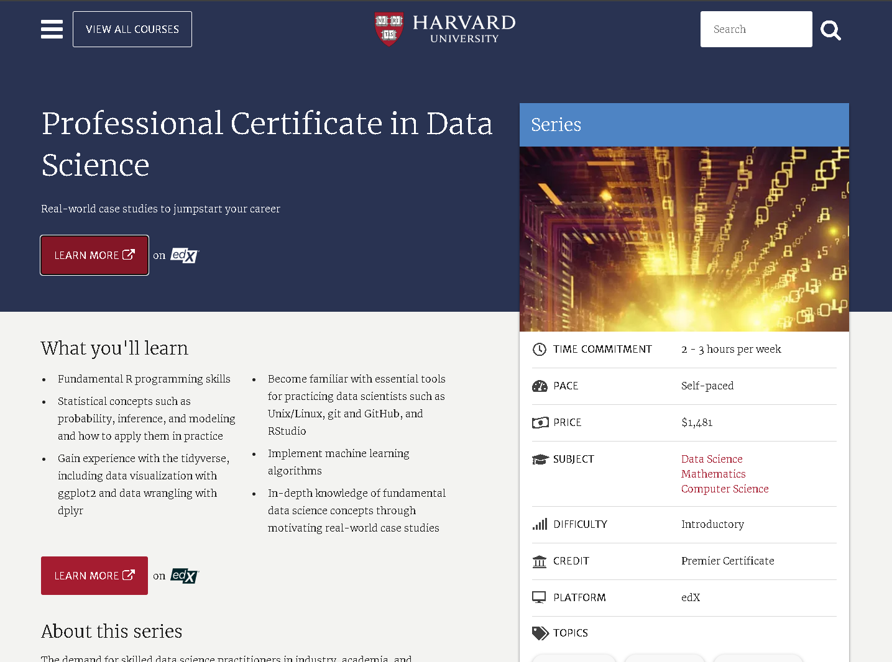

Just finished the [Data Science Professional Certificate](https://pll.harvard.edu/series/professional-certificate-data-science) from Harvard Online. 🎓

Nine courses, all in R, taken alongside a full-time job and the first year of a master's, which is why it took considerably longer than the advertised two to three hours a week.

The [programme](https://www.edx.org/certificates/professional-certificate/harvardx-data-science) is deliberately broad: R fundamentals, visualisation with ggplot2, wrangling with dplyr, probability and inference, linear regression, machine learning, and a productivity course that turns out to mean Unix, git and RStudio. It bills itself as introductory, and for the statistics that is fair. For the working habits it is not, and those were the parts I got most out of.

There are two capstones. The first is MovieLens, which everybody does: predict film ratings, get judged on RMSE. The second is yours to choose, so I used it on something closer to my own work, predicting vegetation health from rainfall over Indramayu, a rice-producing district on the north coast of West Java.

Both reports, the R scripts and the rendered PDFs are in [the capstone repository](https://github.com/bennyistanto/HarvardX-PH125.9x-Data-Science-Capstone).

Big thanks to my peers for their collaboration on grading, and to the staff for the final assessment and constructive feedback. You all made this journey awesome.
