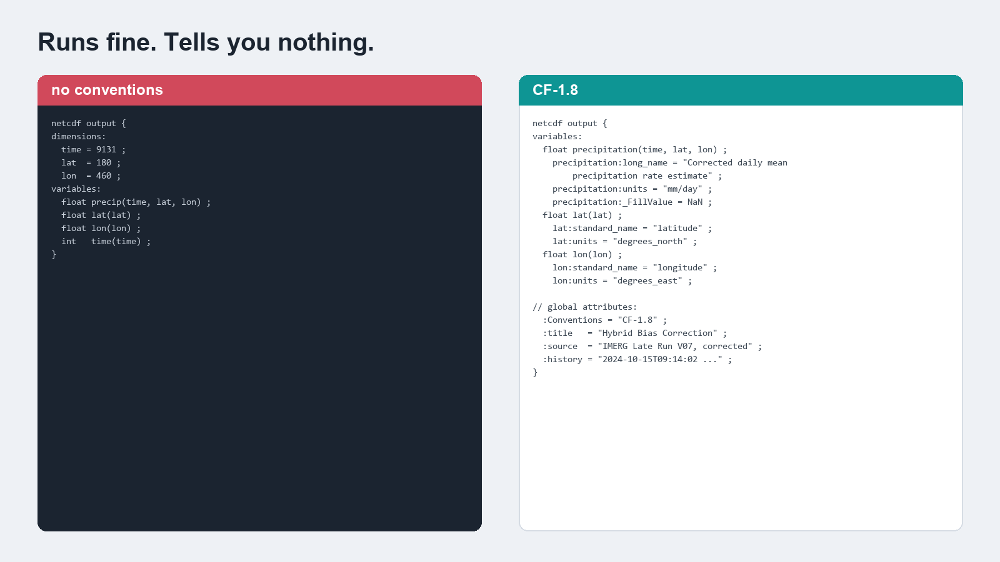

I have been writing a lot of NetCDF lately, and I have come round to a view I did not hold a year ago: the metadata is not paperwork. It is most of what makes the file useful to anybody who is not me.

## The file that works and tells you nothing

Here is a header that runs perfectly well.



A variable called `precip`, three dimensions, some floats. `xarray` will open it. You can plot it. Nothing is broken.

Now try to answer some questions about it. What units? Millimetres per day, or millimetres per hour, or metres because someone was working in SI? Are the latitudes ascending or descending? What do the missing cells mean: ocean, or outside the domain, or a failed retrieval? Is this the raw product or a corrected one, and if corrected, by what?

None of that is in the file. It is in my head, and in a notebook, and possibly in a filename that will get changed.

Six months later I will not remember. That is not a hypothetical, it is a thing that has already happened to me.

## What the conventions actually buy

The [CF conventions](https://cfconventions.org/) are a controlled vocabulary for exactly these questions. Give `lat` a `standard_name` of `latitude` and `units` of `degrees_north`, and every CF-aware tool now knows which way is up without being told. Give the data variable `units` and a `_FillValue` and the same tools know how to label an axis and what to leave blank.

The practical payoff is that CDO, NCO, GDAL, xarray and Panoply all read the file correctly with no special handling. No per-tool shim, no "remember to flip the latitudes first". The file arrives self-describing.

There are a few global attributes I have come to think are non-negotiable:

- `Conventions`, so a reader knows which rules the file claims to follow
- `title` and `source`, so the file says what it is and what it came from
- `history`, a timestamped record of what was done to it

`history` is the one I underrated. Six months on, it is the difference between a file you trust and a file you regenerate because you cannot remember whether it was the good run.

## The attribute I leave out on purpose

CF has a controlled list of `standard_name` values, and using one is the strongest statement you can make about what a variable is.

My corrected precipitation variable does not get one.

There are CF standard names for precipitation flux and similar quantities, and my variable is close to several of them without being exactly any. It is a satellite estimate, bias-corrected against a gauge-derived reference, through a specific chain. Claiming an exact controlled term for it would tell a downstream tool something more precise than I can actually support.

CF treats `standard_name` as optional. `long_name` is free text and carries the description instead. So the variable gets a long name that says what it is in words, and no standard name at all.

That felt like a cop-out when I first did it. I have come to think it is the honest choice: an omitted attribute is a gap a reader can see, while a wrong one is a lie a machine will act on.

## The extra ones nobody asked for

Beyond CF, I have started writing a few attributes that are purely for my own future benefit: the software version that produced the file, the git commit, a run timestamp, and the values of the handful of parameters that most affect the output.

None of that is required by anything. It costs a few hundred bytes. And when two files produced months apart disagree, it is the difference between an afternoon of forensics and one `ncdump -h`.

Every lookup degrades to `unknown` rather than failing, so a missing git binary never interrupts a run. That detail matters more than it sounds: metadata that can crash your pipeline will eventually get removed from your pipeline.

## The writer

All of the above lives in one function. Most of its length is attributes, which is the point.

::: {.callout-note collapse="true" title="Python - save_corrected_precip, from src/io.py"}
```python
def save_corrected_precip(
        precip_data,
        ds,
        method_abbr,
        method_full,
        folder,
        dekad_str,
        month_str
    ):
    """
    Save precipitation data to NetCDF with metadata and proper filename formatting.

    Parameters:
    ----------
    precip_data : xarray.DataArray
        Precipitation data to be saved.
    ds : xarray.Dataset
        Original dataset for coordinates and attributes.
    method_abbr : str
        Abbreviation of the method (e.g., 'ls', 'lseqm', 'lseqmdl').
    method_full : str
        Full name of the method (e.g., 'Linear Scaling', 'LSEQM').
    folder : str
        Directory where the corrected precipitation will be saved.
    dekad_str : str
        String representing the dekad (e.g., '01', '11', '21').
    month_str : str
        Two-digit string representing the month (e.g., '01', '02', ..., '12').

    Returns:
    -------
    str or None
        Path to the saved file, or None if saving failed or skipped.
    """
    # Generate output filename
    from . import config as _cfg
    output_file = output_filename_template.format(
        folder=folder,
        filename_prefix=_cfg.FILENAME_PREFIX,
        method_abbr=method_abbr,
        month_str=month_str,
        dekad_str=dekad_str
    )

    # Check if output file exists
    if os.path.exists(output_file):
        logging.info(f"File {output_file} already exists.")
        decision = set_user_decision()

        if decision == 'S':
            logging.info(f"Skipping file {output_file}")
            # File is there on disk - return its path so callers can find it
            # for downstream inspection / plotting steps.
            return output_file
        elif decision == 'A':
            logging.info("Aborting process.")
            raise BiasCorrectAbort("User chose to abort the bias correction process.")
        elif decision == 'O':
            logging.info(f"Overwriting file {output_file}")

    logging.info(f"Precip data dims: {precip_data.dims}, shape: {precip_data.shape}")
    # Ensure that precip_data has dimensions ('time', 'lat', 'lon')
    expected_dims = ('time', 'lat', 'lon')

    # If there's no 'time' dimension, create a dummy time dimension of length 1
    if 'time' not in precip_data.dims:
        logging.warning("Data has no 'time' dimension; adding dummy time dimension.")
        # Turn shape (lat, lon) -> (time, lat, lon)
        precip_data = precip_data.expand_dims(dim={'time': [pd.Timestamp.now()]}, axis=0)

    # Ensure lat, lon, time are in correct order
    missing_dims = [d for d in expected_dims if d not in precip_data.dims]
    if missing_dims:
        logging.warning(f"Missing dims {missing_dims}, cannot reorder precisely.")
    else:
        # Reorder the dimensions
        precip_data = precip_data.transpose(*expected_dims)

    # Extract data from precip_data
    precip_values = precip_data.data

    # Create xarray Dataset for corrected precipitation
    corrected_ds = xr.Dataset(
        data_vars={
            'precipitation': (
                ('time', 'lat', 'lon'), precip_values
            )
        },
        coords={
            'time': precip_data['time'],
            'lat': precip_data['lat'],
            'lon': precip_data['lon']
        },
        # Below information will appear as metadata in the output file
        # Feel free to adjust or modify, especially on the creator name, role and email
        attrs={
            'Conventions': 'CF-1.8',
            'cdm_data_type': 'GRID',
            'title': f'Bias Corrected IMERG Late Precipitation using {method_full}',
            'summary': f'Precipitation data corrected using {method_full}',
            'source': 'IMERG and CPC-UNI',
            'history': f'Created on {pd.Timestamp.now()}',
            'references': 'https://doi.org/10.3390/rs18142298',
            'DOI': '10.5067/GPM/IMERGDL/DAY/07',
            'creator_name': 'Benny Istanto',
            'creator_role': 'Climate Geographer',
            'creator_email': 'bennyistanto@apps.ipb.ac.id',
            'comment': f'This dataset has been bias corrected using {method_full}',
            **_run_provenance(),
        }
    )

    # Update metadata attributes.
    # No standard_name is set. The previous value 'corrected_precipitation' is
    # not in the CF standard name table, and CF treats standard_name as
    # optional: omitting it is correct when no controlled term applies, and is
    # preferable to asserting one that may not match. long_name carries the
    # description, and the correction method is in the filename and title.
    # units follow the IMERG-L source ('mm/day'), which is what this product is
    # derived from and what long_name describes. CPC-UNI labels the same
    # quantity 'mm' as a daily total; the values are identical either way.
    corrected_ds['precipitation'].attrs.update({
        'units': 'mm/day',
        'long_name': 'Corrected daily mean precipitation rate estimate'
    })

    corrected_ds['lat'].attrs.update({
        'units': 'degrees_north', 'long_name': 'Latitude', 'standard_name': 'latitude'
    })
    corrected_ds['lon'].attrs.update({
        'units': 'degrees_east', 'long_name': 'Longitude', 'standard_name': 'longitude'
    })

    # Apply land-sea mask to the `precipitation` variable only.
    # Use dynamic config lookup so a mid-session initialize_config() switch
    # (e.g. config.yml -> config_bali.yml) picks up the new mask path.
    masked_precip = apply_land_sea_mask(corrected_ds['precipitation'], _cfg.mask_file)

    # Replace the precipitation variable in corrected_ds with the masked version:
    corrected_ds['precipitation'] = masked_precip

    # Save to NetCDF following CF Convention
    try:
        corrected_ds.to_netcdf(output_file, encoding=cf18_f32, engine=NETCDF_ENGINE)
        logging.info(f"Saved {method_full} corrected precipitation for month {month_str}, dekad {dekad_str} at {output_file}")
        return output_file
    except IOError as e:
        logging.error(f"Failed to save file {output_file}: {str(e)}")
        return None
```
:::

[`src/io.py`](https://github.com/bennyistanto/hybrid-bias-correction/blob/main/src/io.py)
