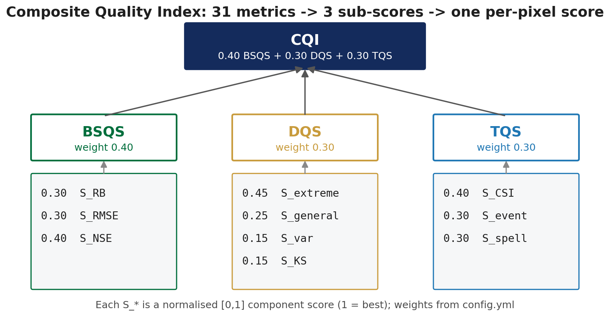

I have three candidate corrections, a hundred thousand or so land pixels, thirty-six dekads, and thirty-one verification metrics. That is more numbers than anyone can hold, and the question I actually want answered is embarrassingly simple: which correction is better, and where?

So the metrics get collapsed into one score per pixel. I have gone back and forth on whether that is a good idea, and I have ended up doing it while remaining slightly uncomfortable about it.

## How the collapse works

Two levels rather than one.



The thirty-one metrics sort into three families that measure genuinely different things. **Basic** covers the ordinary agreement statistics: is the magnitude right. **Distribution** asks whether the shape matches: the right amount of light rain, the right amount of heavy rain, the right proportion of dry days. **Temporal** covers behaviour through time.

Each family is normalised to sit between 0 and 1, then the three are combined with weights of 0.4, 0.3 and 0.3:

$$
\text{CQI} = 0.4\,S_{\text{basic}} + 0.3\,S_{\text{dist}} + 0.3\,S_{\text{temporal}}
$$

The result is one number per pixel, which maps, and which sorts into bands: above 0.80 excellent, above 0.60 good, above 0.40 fair, below that poor.

Doing it in two stages rather than averaging all thirty-one at once matters. Twelve of those metrics might be measuring roughly the same property in slightly different ways, and a flat average would silently give that property twelve votes. Grouping first means each family gets one vote, at a weight I chose deliberately rather than one that fell out of how many metrics happened to exist.

## What it buys

Comparability, mostly. With one number per pixel I can map it, subtract one method's map from another's, take a regional median, or sort dekads by which went worst. None of that is possible with thirty-one parallel fields.

It also forces an argument into the open. The weights are 0.4, 0.3, 0.3 and they sit in a config file where anyone can see them and disagree. That is better than the alternative, which is not weighting anything explicitly and letting the choice of which metrics to report do the weighting invisibly.

## What it hides, which is the real point

A composite score is an average, and an average can move for reasons that have nothing to do with what you care about.

Suppose one method improves the distribution component substantially and degrades the temporal component slightly. Weighted together, those partly cancel, and the composite barely moves. Read the composite alone and you conclude nothing happened. Read the components and you see a real trade: the correction bought distribution skill and paid for it in timing.

That is not a hypothetical worry. It is the specific way I expect this correction to behave, because the distribution is what it is designed to fix and timing is not something a marginal correction can do much about.

Which leads to the one design decision I feel most strongly about.

## Leaving correlation out

Pearson correlation is not in the composite. It is computed, reported, and mapped, but it is kept outside the score entirely.

The reason is exactly the cancellation above. Correlation is the metric I am least confident a correction of this kind can move. If I fold it into a weighted average with seven other things, and it stays flat while everything around it improves, the composite goes up and the flatness disappears from view.

Kept separate, it cannot hide. If it does not move, I have to look at it and say so.

I am aware this is a slightly self-serving argument: excluding a metric because you suspect it will be unflattering could just as easily be a way of quietly protecting your headline number. The defence is that it is excluded *and* reported, not excluded and dropped. It sits next to the composite in every table.

Whether that holds up is something I will find out when I have more results. For now the rule I am working to is: report the composite because it is the only way to see the whole map at once, and never report it without the components underneath.

## The code

The roll-up itself, and one of the three components so you can see what a normalised sub-score is actually made of.

::: {.callout-note collapse="true" title="Python - calculate_overall_quality, the roll-up"}
```python
def calculate_overall_quality(basic_score, dist_score, temporal_score,
                              component_weights=None, categorical_thresholds=None):
    """
    Calculate Continuous Quality Index (CQI) and categorical classification.

    Parameters
    ----------
    basic_score : xarray.DataArray
        Basic statistical quality score [0, 1].
    dist_score : xarray.DataArray
        Distribution quality score [0, 1].
    temporal_score : xarray.DataArray
        Temporal quality score [0, 1].
    component_weights : dict, optional
        Weights for 'basic_stats', 'distribution', 'temporal'.
        Default: 0.35, 0.35, 0.30.
    categorical_thresholds : dict, optional
        Thresholds for 'excellent', 'good', 'fair'.
        Default: 0.8, 0.6, 0.4.

    Returns
    -------
    continuous_quality : xarray.DataArray
        CQI score, range [0, 1].
    categorical_quality : xarray.DataArray
        Classification: 4=Excellent, 3=Good, 2=Fair, 1=Poor, -9999=NoData.
    """
    if component_weights is None:
        component_weights = {'basic_stats': 0.35, 'distribution': 0.35, 'temporal': 0.30}
    if categorical_thresholds is None:
        categorical_thresholds = {'excellent': 0.8, 'good': 0.6, 'fair': 0.4}

    # Continuous Quality Index
    continuous_quality = (
        component_weights['basic_stats'] * basic_score +
        component_weights['distribution'] * dist_score +
        component_weights['temporal'] * temporal_score
    ).astype('float32')

    # Categorical classification
    cat = xr.full_like(continuous_quality, 1, dtype='int32')
    cat = xr.where(continuous_quality >= categorical_thresholds['fair'], 2, cat)
    cat = xr.where(continuous_quality >= categorical_thresholds['good'], 3, cat)
    cat = xr.where(continuous_quality >= categorical_thresholds['excellent'], 4, cat)
    cat = xr.where(np.isnan(continuous_quality), -9999, cat).astype('int32')

    continuous_quality.attrs.update({
        'long_name': 'Continuous Quality Index',
        'units': 'unitless',
        'valid_range': [0, 1],
        'description': 'Weighted average of basic, distribution, and temporal scores',
    })
    cat.attrs.update({
        'long_name': 'Categorical Quality Classification',
        'units': 'category',
        'flag_values': [1, 2, 3, 4],
        'flag_meanings': 'poor fair good excellent',
    })

    return continuous_quality, cat
```
:::

::: {.callout-note collapse="true" title="Python - calculate_distribution_quality, one component"}
```python
def calculate_distribution_quality(metrics, weights=None):
    """
    Calculate distribution quality score from percentile matching, variability,
    and formal distribution testing.

    Evaluates four aspects:
    1. **Extreme percentile matching** (p90, p95, p99): how well the upper
       tail is reproduced. The 99th percentile has higher weight because
       extremes are the primary target of the GPD tail adjustment. This is
       the most important sub-component for our EQM+GPD workflow.
    2. **General percentile matching** (p25, p50, p75): how well the bulk
       distribution is reproduced. Score = 1 - |test - ref| / (ref + 0.1).
    3. **Variability preservation**: |1 - stdev_ratio|. A ratio of 1 means
       perfect variability preservation.
    4. **KS p-value**: formal two-sample Kolmogorov-Smirnov test. A high
       p-value means no statistical evidence that the distributions differ,
       indicating successful correction. This provides a rigorous statistical
       complement to the empirical percentile comparisons.

    Parameters
    ----------
    metrics : xarray.Dataset
        Dataset containing percentile variables (p25_ref, p25_test, etc.),
        stdev_ratio, and ks_pvalue.
    weights : dict, optional
        Weights for 'extreme_percentiles', 'general_percentiles',
        'variability', 'ks_test'. Must sum to 1.0.
        Default: 0.45, 0.25, 0.15, 0.15.

    Returns
    -------
    xarray.DataArray
        Distribution quality score, range [0, 1].
    """
    if weights is None:
        weights = {
            'extreme_percentiles': 0.45,
            'general_percentiles': 0.25,
            'variability': 0.15,
            'ks_test': 0.15,
        }

    # Extreme percentile matching (p90, p95, p99) - most important for GPD/DL
    extreme_pairs = [
        ('p90_ref', 'p90_test', 0.3),  # 90th: 30% weight
        ('p95_ref', 'p95_test', 0.3),  # 95th: 30% weight
        ('p99_ref', 'p99_test', 0.4),  # 99th: 40% weight - critical for extremes
    ]
    extreme_score = sum(
        w * (1 - np.minimum(np.abs(metrics[t] - metrics[r]) / (metrics[r] + 0.1), 1))
        for r, t, w in extreme_pairs
    )

    # General percentile matching (p25, p50, p75)
    general_pairs = [
        ('p25_ref', 'p25_test', 0.3),  # 25th percentile: 30% weight
        ('p50_ref', 'p50_test', 0.4),  # 50th (median): 40% weight - most important
        ('p75_ref', 'p75_test', 0.3),  # 75th percentile: 30% weight
    ]
    general_score = sum(
        w * (1 - np.minimum(np.abs(metrics[t] - metrics[r]) / (metrics[r] + 0.1), 1))
        for r, t, w in general_pairs
    )

    # Variability preservation: ideal stdev_ratio = 1
    var_score = 1 - np.minimum(np.abs(1 - metrics['stdev_ratio']), 1)

    # KS p-value: high p-value = no evidence distributions differ = good
    # Clipped to [0, 1] for safety (already in that range by definition)
    ks_score = np.maximum(np.minimum(metrics['ks_pvalue'], 1), 0)

    dist_score = (
        weights['extreme_percentiles'] * extreme_score +
        weights['general_percentiles'] * general_score +
        weights['variability'] * var_score +
        weights['ks_test'] * ks_score
    )

    dist_score.attrs.update({
        'long_name': 'Distribution Quality Score',
        'units': 'unitless',
        'valid_range': [0, 1],
        'description': 'Percentile matching + variability + KS test score',
    })

    return dist_score
```
:::

[`src/qa_framework.py`](https://github.com/bennyistanto/hybrid-bias-correction/blob/main/src/qa_framework.py)
